# Home Security Intelligence

Turn "dumb" security cameras into an intelligent threat detection system — **100% local, no cloud APIs required.**

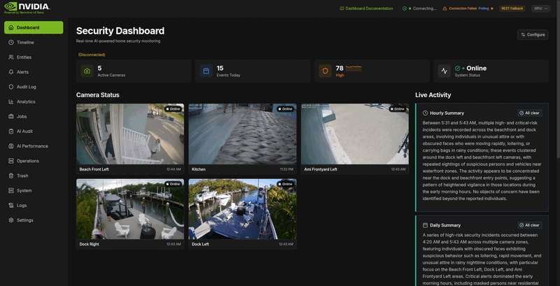

<details>
<summary>📸 Static Screenshots</summary>

| Dashboard                                           | Timeline                                          | Entities                                          |
| --------------------------------------------------- | ------------------------------------------------- | ------------------------------------------------- |
| 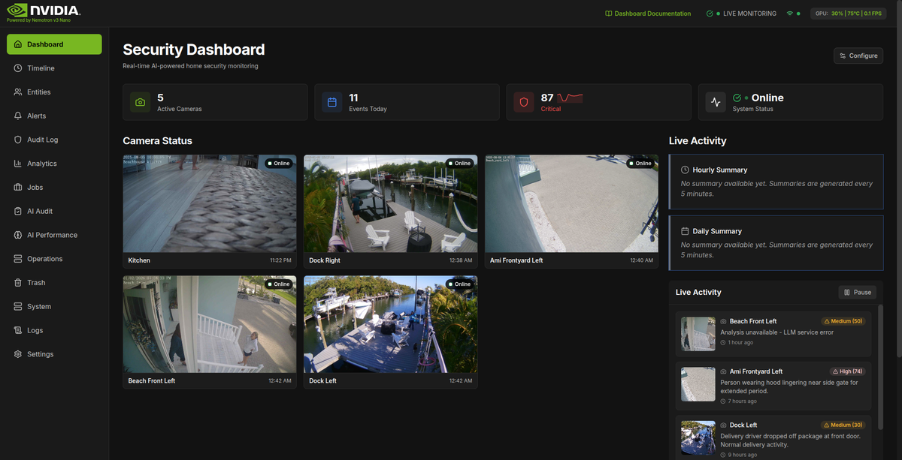 | 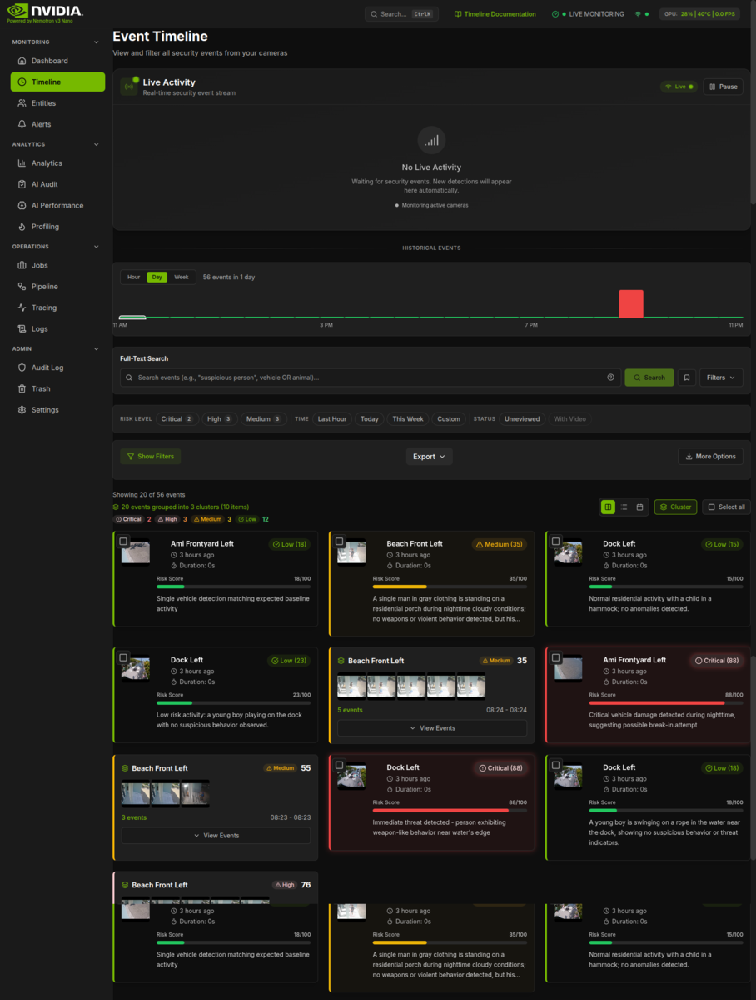 | 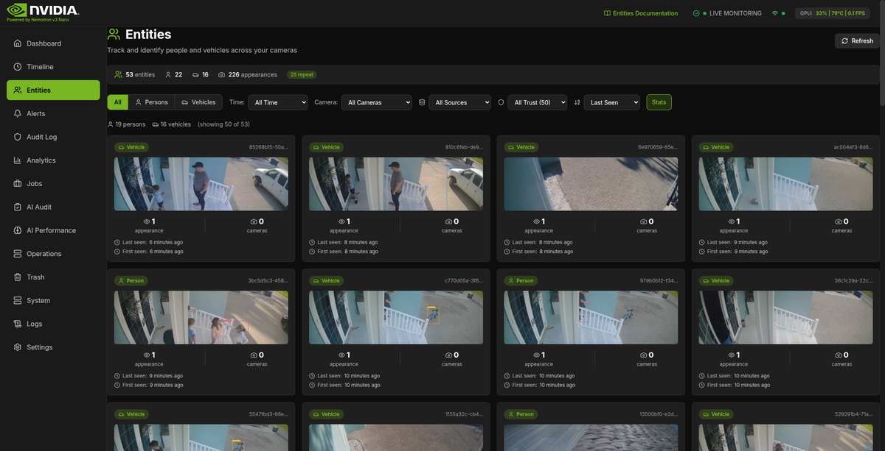 |

| Alerts                                        | Analytics                                           | AI Performance                                                |
| --------------------------------------------- | --------------------------------------------------- | ------------------------------------------------------------- |
| 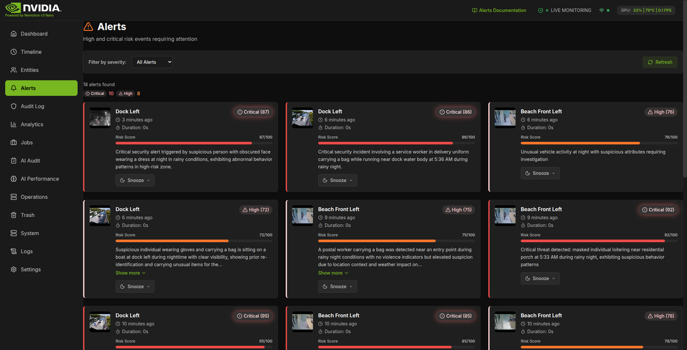 | 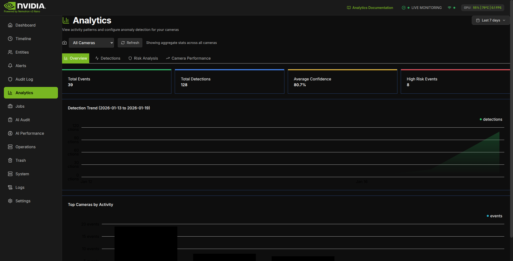 | 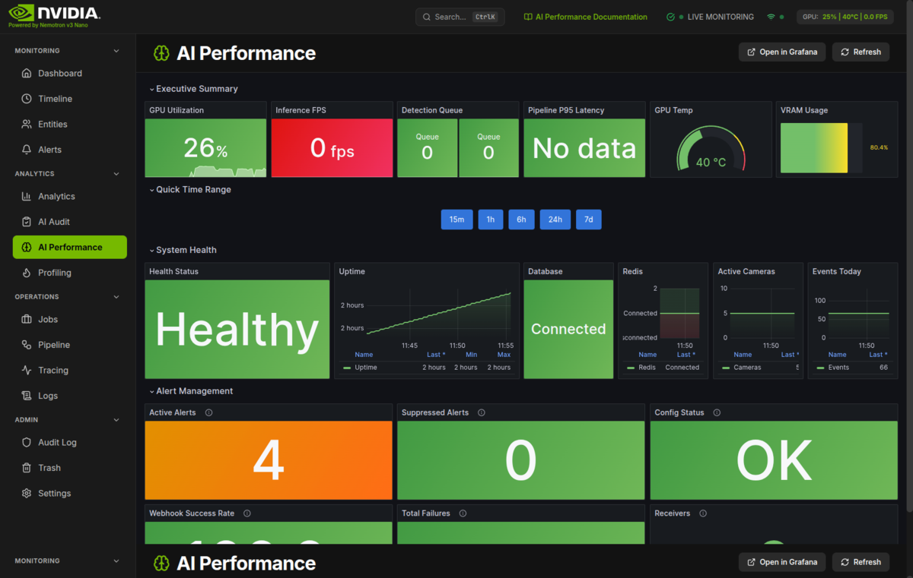 |

| Profiling                                           | Tracing                                         | Operations                                            |
| --------------------------------------------------- | ----------------------------------------------- | ----------------------------------------------------- |
| 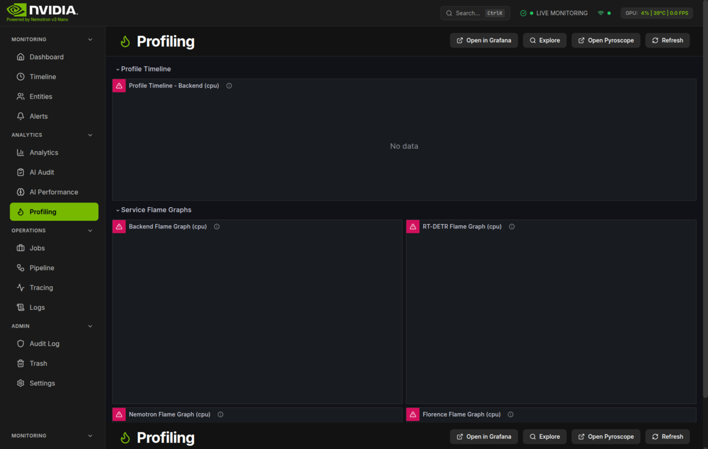 | 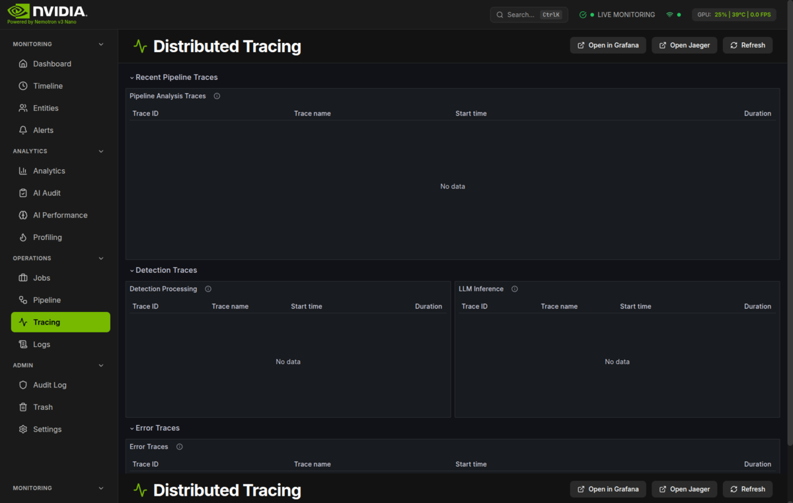 | 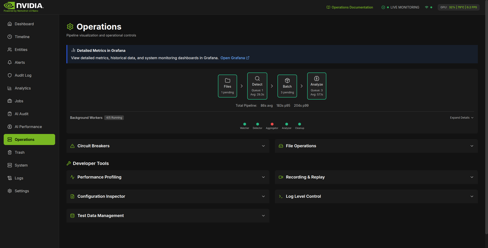 |

</details>

[](https://www.python.org/downloads/)
[](https://nodejs.org/)
[](https://fastapi.tiangolo.com/)
[](https://react.dev/)

[](https://github.com/mikesvoboda/nemotron-v3-home-security-intelligence/actions/workflows/ci.yml)
[](https://codecov.io/gh/mikesvoboda/nemotron-v3-home-security-intelligence)
[](https://codecov.io/gh/mikesvoboda/nemotron-v3-home-security-intelligence)
[](https://codecov.io/gh/mikesvoboda/nemotron-v3-home-security-intelligence)

| I want to…                   | Start here                                |
| ---------------------------- | ----------------------------------------- |
| Run this at home             | [User Hub](docs/user/README.md)           |
| Deploy and maintain it       | [Operator Hub](docs/operator/README.md)   |
| Contribute / extend the code | [Developer Hub](docs/developer/README.md) |

---

## What You Get: AI-Powered Risk Reasoning

The brain of this system is [NVIDIA's Nemotron-3-Nano](https://huggingface.co/nvidia/Nemotron-3-Nano-30B-A3B-GGUF) — a 30 billion parameter reasoning model that runs entirely on your hardware:

| Specification        | Value                  | Why It Matters                                       |
| -------------------- | ---------------------- | ---------------------------------------------------- |
| **Parameters**       | 30B (A3B architecture) | State-of-the-art reasoning in a dense model          |
| **Quantization**     | Q4_K_M (4-bit)         | Reduces memory by ~4x with minimal quality loss      |
| **VRAM Required**    | ~14.7GB                | Fits on RTX 3090, 4090, A5000, A5500, A6000          |
| **Context Window**   | 128K tokens            | Analyze hours of security context in a single prompt |
| **Inference Engine** | llama.cpp              | Optimized C++ with CUDA acceleration                 |

**Also included:**

- **Real-time dashboard** — camera grid, activity feed, risk gauge, telemetry
- **Detections → events** — time-window batching turns many frames into one explained "event"
- **Model zoo enrichment** — captions, re-ID, license plates, faces, clothing/vehicle/pet context
- **Local-first** — runs on your hardware; footage stays on your network


---

## Video Analytics Features

The system provides comprehensive video analytics capabilities:

### Detection and Analysis

| Feature                 | Description                                       | Documentation                                           |
| ----------------------- | ------------------------------------------------- | ------------------------------------------------------- |
| **Object Detection**    | YOLO26 detects people, vehicles, animals, objects | [Video Analytics Guide](docs/guides/video-analytics.md) |
| **Scene Understanding** | Florence-2 generates captions and descriptions    | [Video Analytics Guide](docs/guides/video-analytics.md) |
| **Anomaly Detection**   | CLIP baselines detect unusual activity            | [Video Analytics Guide](docs/guides/video-analytics.md) |
| **Threat Detection**    | Weapon and dangerous item detection               | [Video Analytics Guide](docs/guides/video-analytics.md) |

### Zone Intelligence

| Feature                   | Description                              | Documentation                                           |
| ------------------------- | ---------------------------------------- | ------------------------------------------------------- |
| **Detection Zones**       | Define areas for focused monitoring      | [Zone Configuration](docs/guides/zone-configuration.md) |
| **Dwell Time Tracking**   | Monitor how long objects remain in zones | [Zone Configuration](docs/guides/zone-configuration.md) |
| **Line Crossing**         | Detect zone entry/exit events            | [Zone Configuration](docs/guides/zone-configuration.md) |
| **Household Integration** | Link zones to household members          | [Zone Configuration](docs/guides/zone-configuration.md) |

### Person and Vehicle Identification

| Feature                    | Description                           | Documentation                                           |
| -------------------------- | ------------------------------------- | ------------------------------------------------------- |
| **Face Detection**         | Detect faces within person detections | [Face Recognition](docs/guides/face-recognition.md)     |
| **Person Re-ID**           | Track individuals across cameras      | [Face Recognition](docs/guides/face-recognition.md)     |
| **Demographics**           | Age and gender estimation             | [Face Recognition](docs/guides/face-recognition.md)     |
| **License Plates**         | Plate detection and OCR               | [Video Analytics Guide](docs/guides/video-analytics.md) |
| **Vehicle Classification** | Vehicle type identification           | [Video Analytics Guide](docs/guides/video-analytics.md) |

### Analytics and Reporting

| Endpoint                             | Description                | Documentation                                    |
| ------------------------------------ | -------------------------- | ------------------------------------------------ |
| `/api/analytics/detection-trends`    | Daily detection counts     | [Analytics API](docs/api/analytics-endpoints.md) |
| `/api/analytics/risk-history`        | Risk level distribution    | [Analytics API](docs/api/analytics-endpoints.md) |
| `/api/analytics/camera-uptime`       | Camera performance metrics | [Analytics API](docs/api/analytics-endpoints.md) |
| `/api/analytics/object-distribution` | Object type breakdown      | [Analytics API](docs/api/analytics-endpoints.md) |

---

## AI Model Zoo

The system uses multiple AI models for comprehensive security analysis. Models are managed with VRAM-efficient on-demand loading.

### Core Models

| Model                   | Purpose              | Size  | HuggingFace                                                                                       |
| ----------------------- | -------------------- | ----- | ------------------------------------------------------------------------------------------------- |
| **Nemotron-3-Nano-30B** | Risk reasoning (LLM) | 23 GB | [nvidia/Nemotron-3-Nano-30B-A3B-GGUF](https://huggingface.co/nvidia/Nemotron-3-Nano-30B-A3B-GGUF) |

### Always-Loaded Models (~2.65GB VRAM)

These models are always loaded for real-time analysis:

| Model            | Purpose                       | VRAM   | Port |
| ---------------- | ----------------------------- | ------ | ---- |
| Object Detector  | Primary object detection      | ~650MB | 8095 |
| Florence-2-large | Scene understanding, captions | ~1.2GB | 8092 |
| CLIP ViT-L/14    | Anomaly detection baseline    | ~800MB | 8093 |

### Object Detector

The system uses YOLO26 for object detection, providing excellent speed for real-time multi-camera monitoring:

| Model   | Inference (TensorRT) | FPS | Best For                     |
| ------- | -------------------- | --- | ---------------------------- |
| YOLO26m | 5.76ms               | 174 | Default, best accuracy       |
| YOLO26s | 4.86ms               | 206 | Maximum throughput           |
| YOLO26n | 3.25ms (ONNX-CUDA)   | 308 | Lightweight, edge deployment |

### On-Demand Models (~6.8GB budget)

These models are loaded when needed and evicted using LRU when VRAM is constrained:

| Model                    | Purpose                | VRAM   | Priority |
| ------------------------ | ---------------------- | ------ | -------- |
| Threat-Detection-YOLOv8n | Weapon detection       | ~400MB | CRITICAL |
| YOLOv8n-pose             | Pose estimation        | ~300MB | HIGH     |
| Age-Gender               | Demographics           | ~500MB | HIGH     |
| OSNet-x0.25              | Person re-ID           | ~100MB | MEDIUM   |
| FashionCLIP              | Clothing analysis      | ~800MB | MEDIUM   |
| Vehicle Classifier       | Vehicle identification | ~1.5GB | MEDIUM   |
| Pet Classifier           | Pet detection          | ~200MB | MEDIUM   |
| Depth Anything v2        | Spatial reasoning      | ~150MB | LOW      |
| X-CLIP                   | Action recognition     | ~1.5GB | LOW      |

<details>
<summary><strong>Full Model Zoo (~19GB additional)</strong></summary>

| Model                  | Size   | Purpose                     |
| ---------------------- | ------ | --------------------------- |
| Weather Classification | 2.4 GB | Weather/visibility context  |
| X-CLIP Base            | 1.5 GB | Action recognition          |
| Violence Detection     | 656 MB | Violence classifier         |
| YOLO License Plate     | 656 MB | License plate detection     |
| Segformer Clothes      | 523 MB | Clothing segmentation       |
| ViTPose Small          | 127 MB | Pose estimation             |
| Vehicle Damage         | 120 MB | Damage detection            |
| Vehicle Segment        | 91 MB  | Vehicle type classification |
| Pet Classifier         | 86 MB  | Cat/dog detection           |
| YOLO Face              | 41 MB  | Face detection              |
| YOLO World             | 25 MB  | Open-vocabulary detection   |
| PaddleOCR              | 12 MB  | Text recognition            |
| OSNet Re-ID            | 2.9 MB | Person re-identification    |

</details>

### Model Priority System

Models are assigned priorities that control eviction order:

- **CRITICAL**: Never evicted if possible (threat detection)
- **HIGH**: Evicted only when necessary (pose, demographics)
- **MEDIUM**: Standard eviction (clothing, vehicle, pet, re-ID)
- **LOW**: Evicted first (depth, action recognition)

### Downloading Models

```bash
# Download all models (~15GB total)
./scripts/download_models.sh

# Or using Python
python scripts/download_models.py

# Set custom models directory
MODELS_DIR=/path/to/models ./scripts/download_models.sh
```

### VRAM Requirements

| Configuration | VRAM Needed | Notes                            |
| ------------- | ----------- | -------------------------------- |
| Minimum       | 8GB         | Always-loaded models only        |
| Recommended   | 16GB        | Good on-demand headroom          |
| Optimal       | 24GB        | All models can load concurrently |

The on-demand model manager automatically loads/unloads models based on VRAM availability using LRU eviction with priority-based ordering.

### Model Status API

Check which models are currently loaded:

```bash
curl http://localhost:8094/models/status
```

Preload a specific model:

```bash
curl -X POST http://localhost:8094/models/preload?model_name=threat_detector
```

---

<details>
<summary><strong>Hardware Requirements</strong></summary>

### Minimum vs Recommended

| Component      | Minimum               | Recommended       | This Project Uses |
| -------------- | --------------------- | ----------------- | ----------------- |
| **GPU VRAM**   | 12GB (reduced layers) | 24GB              | RTX A5500 (24GB)  |
| **System RAM** | 32GB                  | 64GB+             | 128GB             |
| **Storage**    | 50GB (core models)    | 100GB+ (full zoo) | ~42GB models      |
| **CPU**        | 8 cores               | 16+ cores         | AMD Ryzen 9       |

### GPU Compatibility

| VRAM     | What You Can Run                   | Example GPUs                        |
| -------- | ---------------------------------- | ----------------------------------- |
| **24GB** | Full stack, all models loaded      | RTX 3090, 4090, A5000, A5500, A6000 |
| **16GB** | Nemotron (reduced layers) + YOLO26 | RTX 4080, A4000, Tesla T4           |
| **12GB** | Nemotron (CPU offload) + YOLO26    | RTX 3080, 4070 Ti                   |
| **8GB**  | YOLO26 only, no LLM                | RTX 3070, 4060 Ti                   |

### Runtime Resource Usage

With all services running on RTX A5500 (24GB):

| Resource       | Usage                                                 |
| -------------- | ----------------------------------------------------- |
| **GPU Memory** | ~23 GB / 24 GB                                        |
| **System RAM** | ~16 GB                                                |
| **Containers** | 9                                                     |
| **Open Ports** | 5173/8443 (UI HTTP/HTTPS), 8000 (API), 8091-8096 (AI) |

> [!TIP] > **Don't have 24GB VRAM?** Reduce `GPU_LAYERS` to offload some layers to CPU RAM, or use a smaller quantization. The system degrades gracefully.

</details>

---

## Quick Start

**Prerequisites:** Linux host + NVIDIA GPU + Docker/Podman with GPU passthrough

```bash
# 1. Run setup (generates .env)
./setup.sh

# 2. Download AI models
./ai/download_models.sh

# 3. Start everything
docker compose -f docker-compose.prod.yml up -d
```

**Verify:**

```bash
curl http://localhost:8000/api/system/health  # Backend health
open http://localhost:5173                     # Dashboard (HTTP)
# Or: open https://localhost:8443              # Dashboard (HTTPS - SSL enabled by default)
```

> [!TIP]
> Run **just core services**: `docker compose -f docker-compose.prod.yml up -d postgres redis backend frontend ai-yolo26 ai-llm`

<details>
<summary><strong>Development Setup (host-run AI)</strong></summary>

Useful when iterating on AI services, or when GPU passthrough is inconvenient.

```bash
# 1. Run setup
./setup.sh

# 2. Download AI models
./ai/download_models.sh

# 3. Start AI on the host (in separate terminals)
./ai/start_detector.sh   # YOLO26 on port 8095
./ai/start_llm.sh        # Nemotron on port 8091

# 4. Set AI_HOST for container → host networking
export AI_HOST=host.docker.internal  # Docker Desktop
# export AI_HOST=host.containers.internal  # Podman macOS

# 5. Start app stack (no container AI)
docker compose up -d
```

> [!WARNING]
> Do **not** mix host-run AI with `docker-compose.prod.yml` (port conflicts on 8091/8095).

</details>

---

## Architecture


| Layer       | Stack                         | Key Files                           |
| ----------- | ----------------------------- | ----------------------------------- |
| Frontend    | React + TypeScript + Tailwind | `frontend/src/services/api.ts`      |
| Backend     | FastAPI + SQLAlchemy + Redis  | `backend/services/`, `backend/api/` |
| AI Services | llama.cpp + FastAPI           | `ai/yolo26/`, `ai/nemotron/`        |

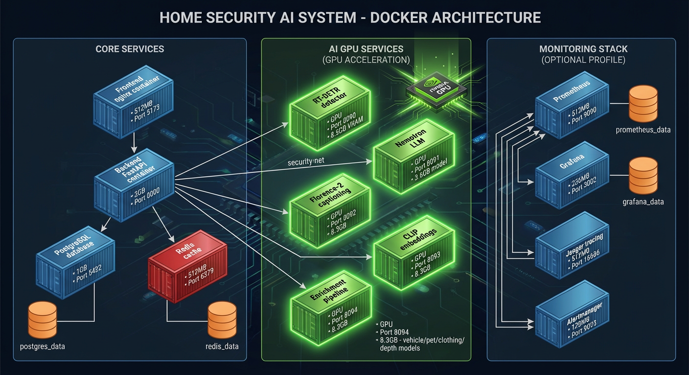


**Detailed Documentation:**

| Hub                                                                  | Description                                |
| -------------------------------------------------------------------- | ------------------------------------------ |
| [Architecture Hub](docs/architecture/README.md)                      | Complete system architecture documentation |
| [Security](docs/architecture/security/README.md)                     | Input validation, data protection, OWASP   |
| [Dataflows](docs/architecture/dataflows/README.md)                   | End-to-end data traces, pipeline timing    |
| [Detection Pipeline](docs/architecture/detection-pipeline/README.md) | YOLO26 integration, image processing       |
| [AI Orchestration](docs/architecture/ai-orchestration/README.md)     | Nemotron LLM, batch processing             |

---

<details>
<summary><strong>Camera Ingestion (FTP)</strong></summary>

Cameras upload images/videos to:

```
/export/foscam/{camera_name}/
```

You can:

- Bring your own FTP server and point it at `/export/foscam`
- Use the included FTP container: see [`vsftpd/README.md`](vsftpd/README.md)

> [!NOTE]
> In production containers, the host camera path is mounted to `/cameras` and the backend uses `FOSCAM_BASE_PATH=/cameras`.

</details>

<details>
<summary><strong>Configuration</strong></summary>

**Source of truth:** [Environment Variable Reference](docs/reference/config/env-reference.md)

Common settings:

| Variable                     | Purpose                     |
| ---------------------------- | --------------------------- |
| `FOSCAM_BASE_PATH`           | Camera upload directory     |
| `YOLO26_URL`, `NEMOTRON_URL` | Core AI endpoints           |
| `FLORENCE_URL`, `CLIP_URL`   | Enrichment AI endpoints     |
| `RETENTION_DAYS`             | Event retention (days)      |
| `BATCH_WINDOW_SECONDS`       | Detection batching window   |
| `FILE_WATCHER_POLLING`       | Use polling (Docker mounts) |
| `API_KEY_ENABLED`            | Enable API key auth         |

</details>

<details>
<summary><strong>Security Model</strong></summary>

This MVP is designed for **single-user, trusted LAN** deployments.

- Authentication is **off by default**
- Rate limiting is **on by default**
- Do **not** expose to the public internet without hardening

See: [Admin Security Guide](docs/operator/admin/security.md)

</details>

---

## Contributing

Start with the [Developer Hub](docs/developer/README.md), then:

```bash
./scripts/validate.sh  # Full validation (lint + typecheck + tests)
```

**Issue tracking:** [Linear](https://linear.app/nemotron-v3-home-security/team/NEM/active)

---

## License

Licensed under **Apache License 2.0**. See [LICENSE](LICENSE).

## Acknowledgments

[Ultralytics YOLO](https://github.com/ultralytics/ultralytics) ·
[Nemotron](https://huggingface.co/nvidia) ·
[llama.cpp](https://github.com/ggerganov/llama.cpp) ·
[FastAPI](https://fastapi.tiangolo.com/) ·
[Tremor](https://www.tremor.so/)
