# Home Security Intelligence

Turn "dumb" security cameras into an intelligent threat detection system — **100% local, no cloud APIs required.**

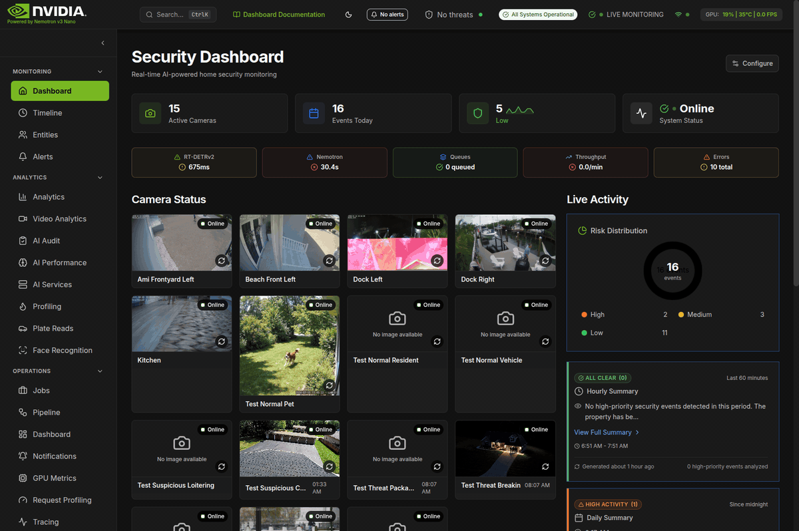

<details>
<summary>📸 Static Screenshots</summary>

| Dashboard                                           | Timeline                                          | Entities                                          |
| --------------------------------------------------- | ------------------------------------------------- | ------------------------------------------------- |
| 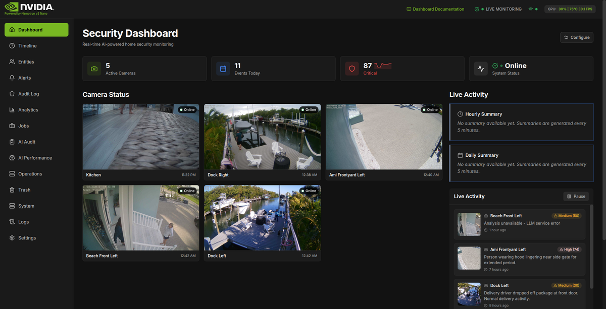 | 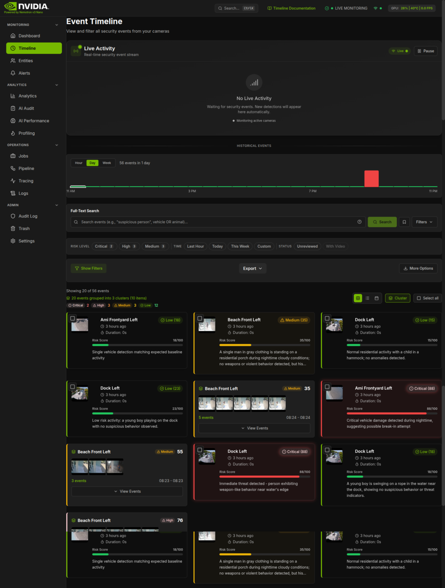 | 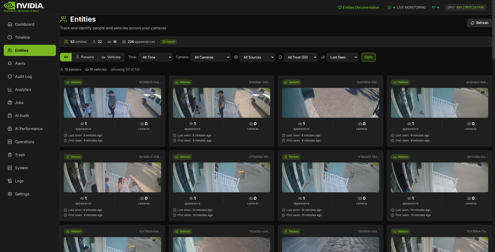 |

| Alerts                                        | Analytics                                           | AI Performance                                                |
| --------------------------------------------- | --------------------------------------------------- | ------------------------------------------------------------- |
| 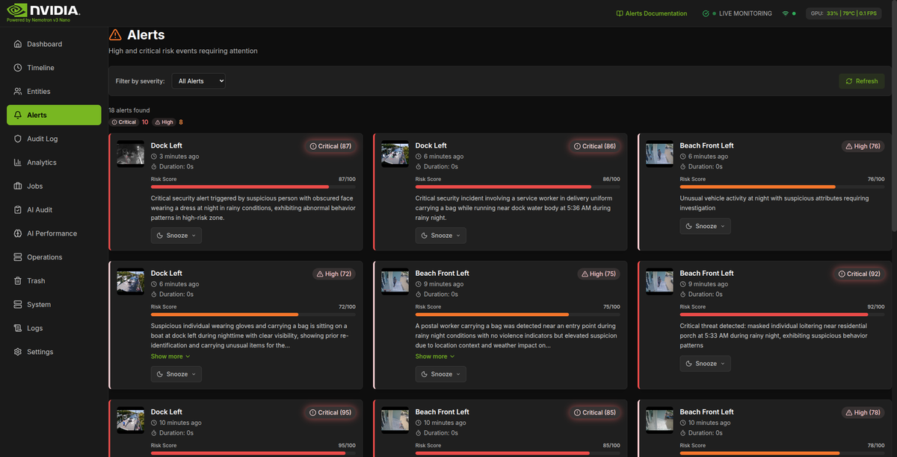 | 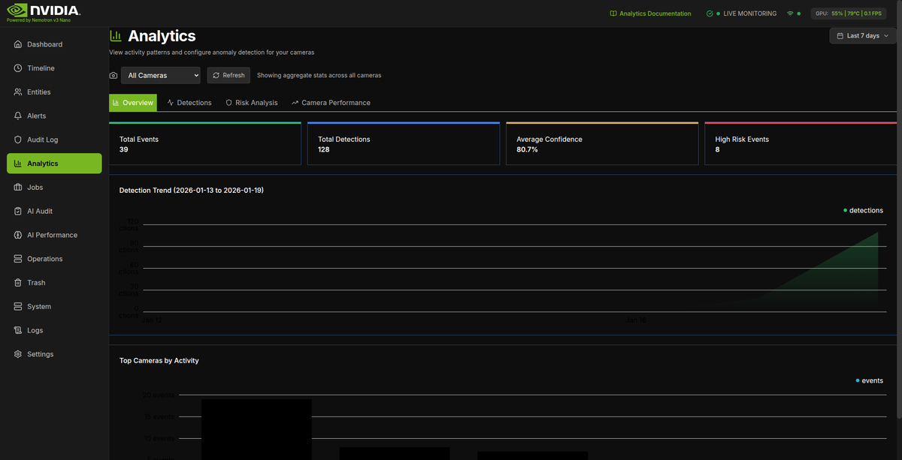 | 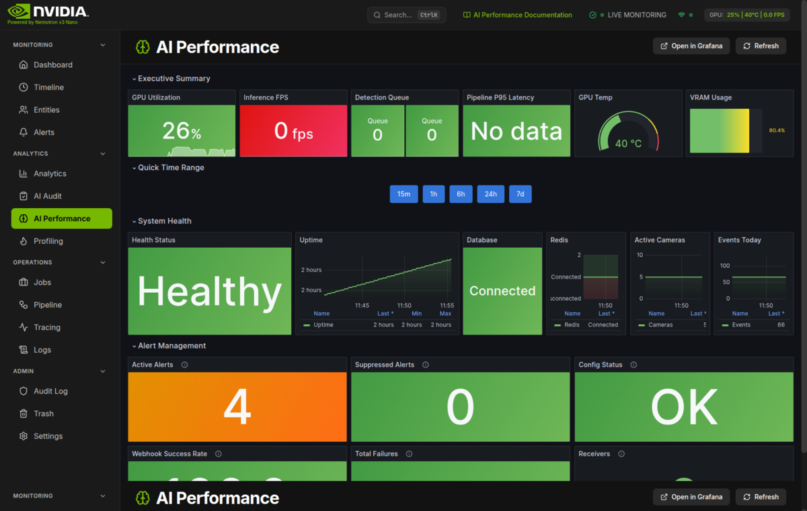 |

| Profiling                                           | Tracing                                         | Operations                                            |
| --------------------------------------------------- | ----------------------------------------------- | ----------------------------------------------------- |
| 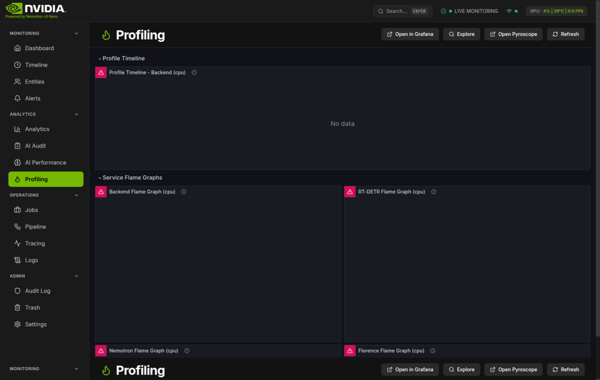 | 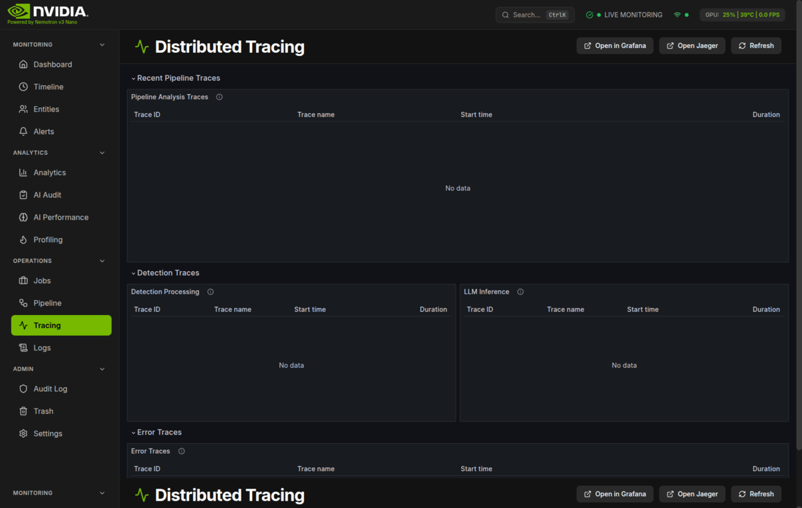 | 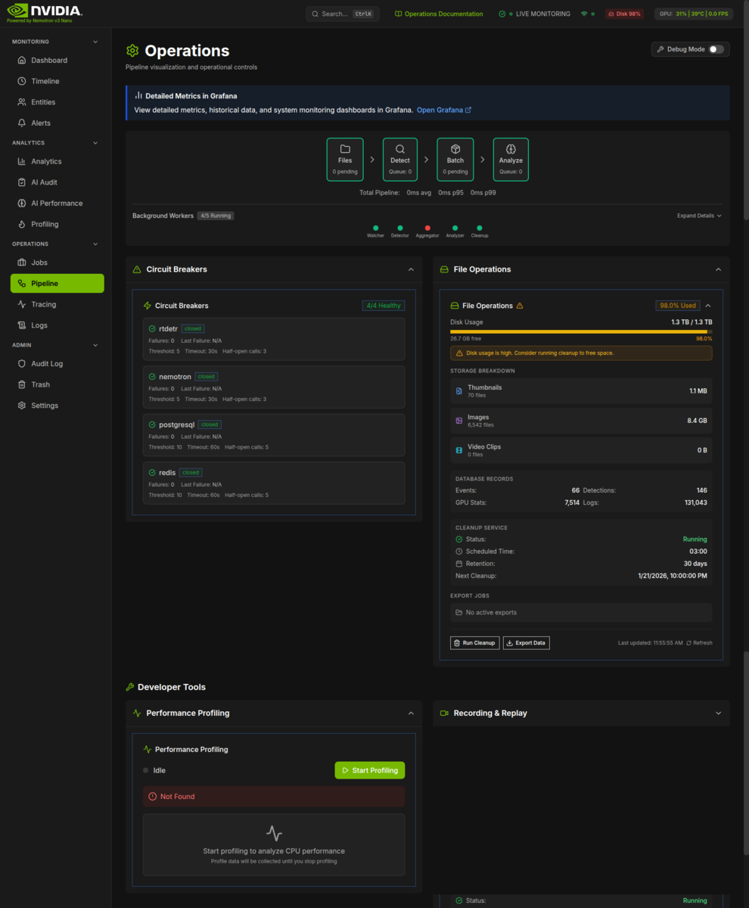 |

</details>

[](https://www.python.org/downloads/)
[](https://nodejs.org/)
[](https://fastapi.tiangolo.com/)
[](https://react.dev/)

[](https://github.com/mikesvoboda/nemotron-v3-home-security-intelligence/actions/workflows/ci.yml)
[](https://mikesvoboda.github.io/nemotron-v3-home-security-intelligence/)
[](https://codecov.io/gh/mikesvoboda/nemotron-v3-home-security-intelligence)
[](https://codecov.io/gh/mikesvoboda/nemotron-v3-home-security-intelligence)
[](https://codecov.io/gh/mikesvoboda/nemotron-v3-home-security-intelligence)

| I want to…                   | Start here                                                                                                                                                                                        |
| ---------------------------- | ------------------------------------------------------------------------------------------------------------------------------------------------------------------------------------------------- |
| Browse the full docs         | [**Documentation Site**](https://mikesvoboda.github.io/nemotron-v3-home-security-intelligence/)                                                                                                   |
| Run this at home             | [User Hub](docs/user/README.md)                                                                                                                                                                   |
| Deploy and maintain it       | [Operator Hub](docs/operator/README.md)                                                                                                                                                           |
| Contribute / extend the code | [Developer Hub](docs/developer/README.md)                                                                                                                                                         |
| Work on it as an AI agent    | [`AGENTS.md`](AGENTS.md) — the root instruction file (read it; `CLAUDE.md` is retired); every directory has its own `AGENTS.md`, and [`llms.txt`](llms.txt) is the condensed machine-readable map |

---

## What You Get: AI-Powered Risk Reasoning

The brain of this system is [Nemotron-3-Nano-30B-A3B](https://huggingface.co/unsloth/Nemotron-3-Nano-30B-A3B-GGUF) — the reasoning model that scores every event. It runs entirely on your hardware:

| Specification        | Value                              | Why It Matters                                    |
| -------------------- | ---------------------------------- | ------------------------------------------------- |
| **Parameters**       | 30B total, ~3B active (MoE)        | Big-model reasoning at small-model speed          |
| **Quantization**     | Q4_K_M (4-bit GGUF, ~15GB on disk) | Cuts memory ~4x with minimal quality loss         |
| **VRAM Required**    | ~21GB resident                     | Fits on RTX 3090, 4090, A5000, A5500, A6000       |
| **Context Window**   | 262,144 tokens (`CTX_SIZE`)        | Split 8 ways: 32K per slot, 8 concurrent analyses |
| **Inference Engine** | llama.cpp                          | Optimized C++ with CUDA acceleration              |

**Also included:**

- **Real-time dashboard** — camera grid, activity feed, risk gauge, telemetry
- **Detections → events** — time-window batching turns many frames into one explained "event"
- **Model zoo enrichment** — captions, re-ID, license plates, faces, clothing/vehicle/pet context
- **Local-first** — runs on your hardware; footage stays on your network
- **First run** — the API returns 503 for everything except setup and health until you register the
  first admin in the dashboard; that's the setup guard working, not a broken install


---

## Video Analytics Features

The system provides comprehensive video analytics capabilities:

### Detection and Analysis

| Feature                 | Description                                       | Documentation                                                             |
| ----------------------- | ------------------------------------------------- | ------------------------------------------------------------------------- |
| **Object Detection**    | YOLO26 detects people, vehicles, animals, objects | [Object detection](docs/guides/video-analytics.md#object-detection)       |
| **Scene Understanding** | Florence-2 generates captions and descriptions    | [Scene understanding](docs/guides/video-analytics.md#scene-understanding) |
| **Anomaly Detection**   | CLIP baselines detect unusual activity            | [Anomaly detection](docs/guides/video-analytics.md#anomaly-detection)     |
| **Threat Detection**    | Weapon and dangerous item detection               | [Threat detection](docs/guides/video-analytics.md#threat-detection)       |

### Zone Intelligence

| Feature                   | Description                              | Documentation                                                              |
| ------------------------- | ---------------------------------------- | -------------------------------------------------------------------------- |
| **Detection Zones**       | Define areas for focused monitoring      | [Creating zones](docs/guides/zone-configuration.md#creating-zones)         |
| **Dwell Time Tracking**   | Monitor how long objects remain in zones | [Dwell time](docs/guides/zone-configuration.md#dwell-time-tracking)        |
| **Line Crossing**         | Detect zone entry/exit events            | [Line crossing](docs/guides/zone-configuration.md#line-crossing-detection) |
| **Household Integration** | Link zones to household members          | [Households](docs/guides/zone-configuration.md#household-integration)      |

### Person and Vehicle Identification

| Feature                    | Description                           | Documentation                                                                 |
| -------------------------- | ------------------------------------- | ----------------------------------------------------------------------------- |
| **Face Detection**         | Detect faces within person detections | [Face detection](docs/guides/face-recognition.md#face-detection)              |
| **Person Re-ID**           | Track individuals across cameras      | [Re-identification](docs/guides/face-recognition.md#person-re-identification) |
| **Demographics**           | Age and gender estimation             | [Demographics](docs/guides/face-recognition.md#demographics-analysis)         |
| **License Plates**         | Plate detection and OCR               | [License plates](docs/guides/video-analytics.md#license-plate-detection)      |
| **Vehicle Classification** | Vehicle type identification           | [Vehicle analysis](docs/guides/video-analytics.md#vehicle-analysis)           |

### Analytics and Reporting

All four live on the [Analytics API](docs/api/analytics-endpoints.md):

| Endpoint                             | Description                |
| ------------------------------------ | -------------------------- |
| `/api/analytics/detection-trends`    | Daily detection counts     |
| `/api/analytics/risk-history`        | Risk level distribution    |
| `/api/analytics/camera-uptime`       | Camera performance metrics |
| `/api/analytics/object-distribution` | Object type breakdown      |

---

## AI Model Zoo

`models.yml` is the single source of truth for every model the system downloads and loads — name, download size, VRAM footprint, and which service runs it. The tables below are drawn from it, except where a model runs inside the gateway's Triton process instead of the backend model zoo (those carry `vram_mb: 0` there, so their VRAM comes from [VRAM Requirements](docs/_includes/vram-requirements.md)).

### Always-Loaded Models

These stay resident because every detection path touches them:

| Model                     | Purpose                    | VRAM                                | Where it runs                          |
| ------------------------- | -------------------------- | ----------------------------------- | -------------------------------------- |
| Nemotron-3-Nano-30B (LLM) | Risk reasoning             | ~21GB resident (~15GB on-disk GGUF) | `ai-llm` container, port 8091          |
| YOLO26                    | Primary object detection   | ~2GB (Triton; not in `models.yml`)  | `ai-gateway` Triton, route `/yolo26/*` |
| SigLIP 2 Base             | Re-ID / anomaly embeddings | ~200MB                              | `ai-gateway` Triton, route `/clip/*`   |

> Since the gateway consolidation (bc7d6101), detection and enrichment models run inside `ai-gateway` on
> port **8090** as path-prefixed routers — `/yolo26` `/florence` `/clip` `/enrichment` `/enrich-lt`. There are
> no separate 8092/8093/8095 server containers. Only the Nemotron LLM keeps its own port (8091).

### Object Detector

Three YOLO26 variants ship (`n`/`s`/`m`; `m` is the default). Measured end-to-end latency, RTX A5500 at 640x640, batch 1 — details and throughput curves in [YOLO26 Benchmarks](docs/benchmarks/yolo26-benchmarks.md):

| Variant | Latency (batch 1) | FPS  | Best For                     |
| ------- | ----------------- | ---- | ---------------------------- |
| YOLO26m | 138.84ms          | 7.2  | Default, best accuracy       |
| YOLO26s | 73.74ms           | 13.6 | Maximum throughput per frame |
| YOLO26n | 44.83ms           | 22.3 | Lightweight, edge deployment |

### On-Demand Models

The rest of `models.yml`: these load when a detection needs them (inside the gateway's Triton process or the backend model zoo) and evict by LRU when VRAM runs short. Representative entries (VRAM from `models.yml`):

| Model                    | Purpose            | VRAM   |
| ------------------------ | ------------------ | ------ |
| Florence-2-base          | Scene captions     | Triton |
| Threat-Detection-YOLOv8n | Weapon detection   | ~300MB |
| Smoke/Fire-YOLOv8n       | Fire and smoke     | ~350MB |
| YOLOv8n-pose             | Pose estimation    | ~200MB |
| ViT age + gender         | Demographics       | ~200MB |
| OSNet-AIN x1.0           | Person re-ID       | ~100MB |
| FashionCLIP              | Clothing analysis  | ~500MB |
| Vehicle-Segment          | Vehicle type       | ~1.5GB |
| Pet Classifier           | Cat/dog detection  | ~200MB |
| Depth Anything v2 tiny   | Spatial reasoning  | ~100MB |
| X-CLIP Base / ST-GCN++   | Action recognition | Triton |

Full list: `models.yml` (grouped by `download_phase`: 0 required, 1 core enrichment, 2 extended, 3 optional).

### Model Priority System

Every model carries a priority in `models.yml` that sets its eviction order under VRAM pressure:

- **CRITICAL**: never evicted if any VRAM can be freed (smoke/fire detection is the one marked today)
- **HIGH** / **MEDIUM** / **LOW**: evicted in that order; most models ship at **medium** default
- `never_evict: true` pins a model outright; `preload: true` loads it at startup

### Downloading Models

```bash
# Download all models the gateway needs (~34GB — sum of models.yml entries). The
# script's own header says ~42GB; it also pulls clip-vit-large, which models.yml
# doesn't list, and counts Git-LFS working-tree overhead.
# Reads only the AI_MODELS_PATH shell variable (not .env — export it to match
# setup.py's choice, below) and the target must already exist and be writable:
# setup.py sudo-creates it; otherwise sudo mkdir -p + chown first.
./ai/download_models.sh

# Subset-only alternative (10 enrichment models, no Nemotron/YOLO26/Florence;
# targets ./models, not the container mount path — not usable by the stack as-is)
python scripts/download_models.py

# Custom models directory (default /export/ai_models; the containers mount this)
AI_MODELS_PATH=/path/to/models ./ai/download_models.sh
```

### VRAM Budget

| Configuration | VRAM Needed | What Runs                                                             |
| ------------- | ----------- | --------------------------------------------------------------------- |
| Minimum       | 8–12GB      | LLM partially offloaded via `GPU_LAYERS` (slow) + YOLO26 + embeddings |
| Recommended   | 16GB        | LLM with reduced `GPU_LAYERS` + on-demand                             |
| Optimal       | 24GB        | Full stack, LLM fully on GPU                                          |

The on-demand model manager loads and unloads models based on VRAM availability using LRU eviction with priority-based ordering.

### Model Status API

```bash
curl http://localhost:8000/api/system/models
curl http://localhost:8000/api/system/models/<name>/status
```

> [!WARNING]
> Runtime state is **wrong** until the status API is repointed at the gateway. Both routes still read
> from the retired `ai-enrichment:8094` / `ai-enrichment-light:8096` services, which no longer exist in
> `docker-compose.prod.yml` (the models now run inside `ai-gateway`, routes `/enrichment` and
> `/enrich-lt`). The fetch fails soft, so `GET /api/system/models` answers 200 while reporting every
> model `loaded: false` and both services unhealthy — a phantom "all models unloaded" reading, not an
> outage. Trust `http://localhost:8090/health` and `http://localhost:8090/metrics` on the gateway
> instead. Load/unload (`POST /api/system/models/<name>/load` and `/unload`) proxy to those same dead
> hostnames, so they always fail 503; don't reach for them until the routes are rewired.

---

<details>
<summary><strong>Hardware Requirements</strong></summary>

### Minimum vs Recommended

| Component      | Minimum               | Recommended       | This Project Uses                                         |
| -------------- | --------------------- | ----------------- | --------------------------------------------------------- |
| **GPU VRAM**   | 12GB (reduced layers) | 24GB              | RTX A5500 (24GB)                                          |
| **System RAM** | 32GB                  | 64GB+             | 128GB                                                     |
| **Storage**    | 50GB (core models)    | 100GB+ (full zoo) | ~34GB per `models.yml` (~42GB as the script downloads it) |
| **CPU**        | 8 cores               | 16+ cores         | AMD Ryzen 9                                               |

### GPU Compatibility

| VRAM     | What You Can Run                                              | Example GPUs                        |
| -------- | ------------------------------------------------------------- | ----------------------------------- |
| **24GB** | Full stack, all models loaded                                 | RTX 3090, 4090, A5000, A5500, A6000 |
| **16GB** | Nemotron (reduced layers) + YOLO26                            | RTX 4080, A4000, Tesla T4           |
| **12GB** | Nemotron (CPU offload) + YOLO26                               | RTX 3080, 4070 Ti                   |
| **8GB**  | Nemotron partially offloaded via `GPU_LAYERS` (slow) + YOLO26 | RTX 3070, 4060 Ti                   |

### Runtime Resource Usage

With all services running on RTX A5500 (24GB):

| Resource       | Usage                                                                                                          |
| -------------- | -------------------------------------------------------------------------------------------------------------- |
| **GPU Memory** | ~23 GB / 24 GB                                                                                                 |
| **System RAM** | ~49 GB (sum of `deploy.resources.limits.memory` in `docker-compose.prod.yml`; host minimum 32GB)               |
| **Containers** | 21 (19 run by default — `foscam-init` exits after its chown; `ai-llm-vllm` and `dcgm-exporter` need a profile) |
| **Open Ports** | 8444/8080 (UI HTTPS/HTTP), 8000 (API), 8090/8091 (AI gateway/Nemotron)                                         |

> [!TIP] > **Don't have 24GB VRAM?** Reduce `GPU_LAYERS` to offload some layers to CPU RAM, or use a smaller quantization. The system degrades gracefully.

</details>

---

## Quick Start

**Prerequisites:** Linux host + NVIDIA GPU + Podman with GPU passthrough (the `docker` CLI works as a shim only via the optional `podman-docker` package)

```bash
# 1. Run setup — generates .env from .env.example with your ports, paths and secrets,
#    offers to download the models, and ends by deploying the stack
python setup.py

# 2. Download AI models (~34GB per models.yml; 30-90 min on a fast connection).
#    Skip if you let setup.py do it. The script reads only the AI_MODELS_PATH shell
#    variable — not .env — so match what setup.py wrote, and the target directory
#    must already exist and be writable (setup.py sudo-creates it).
AI_MODELS_PATH=$(grep -m1 ^AI_MODELS_PATH .env | cut -d= -f2-) ./ai/download_models.sh

# 3. Start everything (you only need this if setup.py's auto-deploy was skipped —
#    reboot prompt, --defaults, or Ctrl-C; see the note below for PODMAN_SOCKET)
podman compose -f docker-compose.prod.yml up -d
```

> [!NOTE]
> This project targets **Podman**: the compose file uses Podman-specific keys
> (`userns_mode: keep-id`, `:U` mount flags, CDI `devices:`), so plain `docker compose`
> does not run it as-is. `backend` and `alloy` also hard-require `PODMAN_SOCKET` in
> `.env`; `python setup.py deploy` appends it automatically. If you skipped the deploy
> phase, enable the socket first:
>
> ```bash
> systemctl --user enable --now podman.socket
> echo "PODMAN_SOCKET=/run/user/$(id -u)/podman/podman.sock" >> .env
> ```

**Verify:**

```bash
curl http://localhost:8000/api/system/health   # Backend health
open http://localhost:8080                     # Dashboard (HTTP)
# Or: open https://localhost:8444              # Dashboard (HTTPS; enable with SSL_ENABLED=true)
```

Then open the dashboard: first run requires you to register the first admin account
(the API returns 503 for everything except setup and health until you do).

> [!TIP]
> Run **just core services**: `podman compose -f docker-compose.prod.yml up -d postgres redis backend frontend ai-gateway ai-llm`
> (Since the gateway consolidation, `ai-gateway` is the single AI entrypoint — detection/enrichment run inside it, models load on demand.)

## Operations & Monitoring

The monitoring ships in the same compose file — no separate stack to start. Monitoring URLs bind
`127.0.0.1`, so open them on the host itself (or forward an SSH tunnel); the dashboard is the
exception, bound `0.0.0.0` for tunnel access — use your firewall to fence it.

| Where        | URL                                                       | Notes                                                        |
| ------------ | --------------------------------------------------------- | ------------------------------------------------------------ |
| Dashboard    | `http://localhost:8080` / `https://localhost:8444`        | HTTPS needs `SSL_ENABLED=true`                               |
| API docs     | `http://localhost:8000/docs`                              | FastAPI Swagger UI                                           |
| Grafana      | `http://localhost:3002` or `https://<host>:8444/grafana/` | Anonymous access on by default (`GF_AUTH_ANONYMOUS_ENABLED`) |
| Prometheus   | `http://localhost:9090`                                   | Metrics and alerting rules                                   |
| Alertmanager | `http://localhost:9093`                                   | Delivered alerts                                             |
| Loki         | `http://localhost:3100`                                   | Log aggregation (queried through Grafana)                    |
| Tempo        | `http://localhost:3200`                                   | Distributed traces                                           |
| Pyroscope    | `http://localhost:4040`                                   | Continuous profiling                                         |

Port numbers come from `.env` (`GRAFANA_PORT`, `PROMETHEUS_PORT`, …). Full guide:
[Monitoring & Observability](docs/operator/monitoring.md).

### First five minutes at 2am

```bash
# What's up / what's down (this project uses Podman)
podman ps -a --format "table {{.Names}}\t{{.Status}}"
podman compose -f docker-compose.prod.yml ps

# Logs — a whole service, or one container
podman compose -f docker-compose.prod.yml logs --tail=50 backend
podman logs --tail=50 backend

# Restart one service without touching the rest
podman compose -f docker-compose.prod.yml restart backend
```

Host-run dev-mode logs land in `logs/backend.log` (`./scripts/dev.sh logs` tails it).

Health endpoints, cheapest first — `health/live` answers without touching dependencies:

| Endpoint                                       | What it tells you                |
| ---------------------------------------------- | -------------------------------- |
| `http://localhost:8000/api/system/health/live` | Backend process is alive         |
| `http://localhost:8000/api/system/health`      | Backend + dependency status      |
| `http://localhost:8000/api/system/health/full` | Every dependency, no timeouts    |
| `http://localhost:8090/health`                 | AI gateway (Triton, all routers) |
| `http://localhost:8091/health`                 | Nemotron LLM                     |

Service control and self-healing details: [Service Control](docs/operator/service-control.md).

<details>
<summary><strong>Development Setup (host-run backend + frontend)</strong></summary>

Runs backend and frontend as host processes for fast iteration; Redis and
PostgreSQL come from containers, AI containers stay as they are. Needs `uv`
(`curl -LsSf https://astral.sh/uv/install.sh | sh`), Node 24+, and Python 3.14
(`requires-python` in `pyproject.toml`) on the host.

```bash
# 1. One-time setup
python setup.py
uv sync --extra dev            # Python deps (repo-root .venv — dev.sh sources this one)
cd frontend && npm ci          # Frontend deps (CI uses npm; bun.lock exists but no bun config)

# 2. PostgreSQL — dev.sh does NOT start it, and the backend dies on boot without it
#    (init_db in the FastAPI lifespan). .env's DATABASE_URL/REDIS_URL point at the
#    container hostnames `postgres`/`redis`, so run a dev container and override:
podman run -d --name dev-postgres \
  -e POSTGRES_USER=security -e POSTGRES_DB=security \
  -e POSTGRES_PASSWORD="$(grep -m1 ^POSTGRES_PASSWORD .env | cut -d= -f2-)" \
  -p 127.0.0.1:5432:5432 docker.io/library/postgres:16-alpine
export DATABASE_URL="postgresql+asyncpg://security:$(grep -m1 ^POSTGRES_PASSWORD .env | cut -d= -f2-)@localhost:5432/security"
export REDIS_URL=redis://localhost:6379/0

# 3. Start Redis + backend (uvicorn :8000) + frontend (Vite dev server :8444, HTTPS)
./scripts/dev.sh start
./scripts/dev.sh status        # Also: stop | restart | logs
```

`dev.sh` starts Redis with the `docker` CLI; on a Podman host give it the
docker-compatible socket (`systemctl --user enable --now podman.socket` + the
`podman-docker` shim, or `export DOCKER_HOST=unix:///run/user/$UID/podman/podman.sock`)
or run a system Redis (`sudo systemctl start redis`) — otherwise `start` aborts
(`set -e`) before backend/frontend launch. `./scripts/dev.sh redis` manages just
Redis.

Open https://localhost:8444 — Vite serves HTTPS with a self-signed cert
(strictPort; accept the browser warning). It proxies `/api` and `/ws` to the
backend on port 8000. (`scripts/dev.sh` prints a 5173 URL — that echo is
wrong; the server really binds 8444 per `frontend/vite.config.ts`.)

</details>

<details>
<summary><strong>Host-run AI servers</strong></summary>

Useful when iterating on AI model code directly on the host. The host-run detector
replaces only the gateway's `/yolo26` router — Florence/CLIP/enrichment still need the
`ai-gateway` container.

```bash
# Start the AI servers on the host (separate terminals)
./ai/start_detector.sh   # YOLO26 — reads PORT/YOLO26_PORT, defaults to 8090
./ai/start_llm.sh        # Nemotron llama.cpp server, port 8091

# Then point the HOST-RUN backend (dev.sh) at them. The host detector serves its
# endpoints at the root (/health, /detect), so no router suffix — and these exports
# never reach a containerized backend (compose hardcodes the AI URLs; no env_file).
export YOLO26_URL=http://localhost:8090
export NEMOTRON_URL=http://localhost:8091
# Florence/CLIP/enrichment come from the ai-gateway container, published on
# 127.0.0.1:8090 — point the remaining clients at its routers. Leave
# USE_AI_GATEWAY=false (the default): with it true the detector client ignores
# YOLO26_URL and sends detection back to the gateway.
export FLORENCE_URL=http://localhost:8090/florence CLIP_URL=http://localhost:8090/clip
export ENRICHMENT_URL=http://localhost:8090/enrichment ENRICHMENT_LIGHT_URL=http://localhost:8090/enrich-lt
```

If instead the backend itself runs in a container, `host.docker.internal` resolves
only on macOS/Docker Desktop; on Linux Podman use `host.containers.internal` or the
host IP, and note the compose file hardcodes the AI URLs, so override them with a
compose `environment:` entry or an override file — a shell `export` is not enough.
See [AI Configuration](docs/operator/ai-configuration.md) for the per-platform hostnames.

> [!WARNING]
> Do **not** run these while `ai-gateway`/`ai-llm` containers are up — they will fight over ports 8090/8091.
> The host-run detector defaults to 8090, which is also the `ai-gateway` host port — so it
> collides with `ai-gateway`, not with the retired 8095.
> To keep `ai-gateway` up for Florence/CLIP/enrichment, run the detector on a free port instead:
> `YOLO26_PORT=8095 ./ai/start_detector.sh` with `export YOLO26_URL=http://localhost:8095`.

</details>

---

## Architecture


| Layer       | Stack                         | Key Files                                         |
| ----------- | ----------------------------- | ------------------------------------------------- |
| Frontend    | React + TypeScript + Tailwind | `frontend/src/services/api.ts`                    |
| Backend     | FastAPI + SQLAlchemy + Redis  | `backend/services/`, `backend/api/`               |
| AI Services | llama.cpp + Triton + FastAPI  | `ai/gateway/` (all model routers), `ai/nemotron/` |

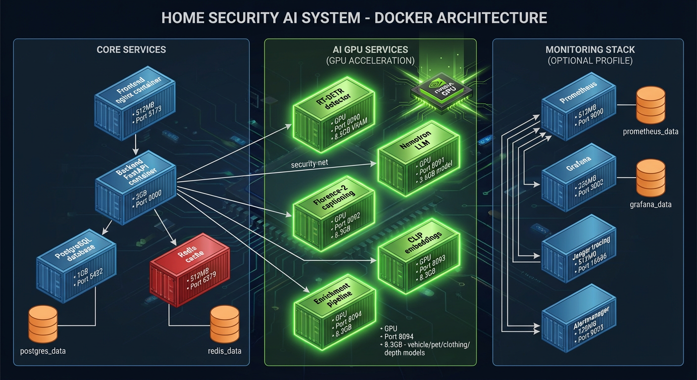


**Detailed Documentation:**

| Hub                                                                  | Description                                |
| -------------------------------------------------------------------- | ------------------------------------------ |
| [Architecture Hub](docs/architecture/README.md)                      | Complete system architecture documentation |
| [Security](docs/architecture/security/README.md)                     | Input validation, data protection, OWASP   |
| [Dataflows](docs/architecture/dataflows/README.md)                   | End-to-end data traces, pipeline timing    |
| [Detection Pipeline](docs/architecture/detection-pipeline/README.md) | YOLO26 integration, image processing       |
| [AI Orchestration](docs/architecture/ai-orchestration/README.md)     | Nemotron LLM, batch processing             |

---

<details>
<summary><strong>Camera Ingestion (FTP)</strong></summary>

Cameras upload images/videos to:

```
/export/foscam/{camera_name}/
```

You can:

- Bring your own FTP server and point it at `/export/foscam`
- Run the archived vsftpd container yourself from [`archive/vsftpd/`](archive/vsftpd/) — `vsftpd.conf`, `Dockerfile`, `docker-compose-wrapper.sh`, `install-systemd.sh`. It is not wired into any compose file, and the README in that directory still points at a `docker-compose.yml` that no longer exists.

> [!NOTE]
> In production containers, the host camera path is mounted to `/cameras` and the backend uses `FOSCAM_BASE_PATH=/cameras`.

</details>

<details>
<summary><strong>Configuration</strong></summary>

**Source of truth:** [Environment Variable Reference](docs/reference/config/env-reference.md)

Common settings:

| Variable                                 | Purpose                                 | Containerized deploy                                                                                                          |
| ---------------------------------------- | --------------------------------------- | ----------------------------------------------------------------------------------------------------------------------------- |
| `FOSCAM_BASE_PATH`                       | Camera upload directory (host path)     | Read from `.env` by compose (bind-mount source); inside the container it's forced to `/cameras`                               |
| `YOLO26_URL`, `FLORENCE_URL`, `CLIP_URL` | AI gateway router endpoints (port 8090) | Compose hardcodes these to `http://ai-gateway:8090/<route>`; your `.env` values are ignored (host runs only)                  |
| `NEMOTRON_URL`                           | Nemotron LLM endpoint (port 8091)       | Compose hardcodes `http://ai-llm:8091` (host runs only)                                                                       |
| `RETENTION_DAYS`                         | Event retention (days; default 30)      | **Not passed to the backend container** — add an `environment:` entry or an override file, or edits silently keep the default |
| `BATCH_WINDOW_SECONDS`                   | Detection batching window               | **Not passed to the backend container** — same caveat                                                                         |
| `API_KEY_ENABLED`                        | Enable API key auth (off by default)    | **Not passed to the backend container** — same caveat                                                                         |
| `FILE_WATCHER_POLLING`                   | Use polling (Docker mounts)             | Passed through by compose — the only knob here that works out of the box                                                      |

> [!NOTE]
> The prod compose file has **no** `env_file:` and mounts no `.env`, and `.dockerignore` excludes it —
> so the `env_file=".env"` in `backend/core/config.py` resolves to a path inside the image that
> doesn't exist. Only variables compose interpolates with `${...}`, or names in the `environment:`
> list, reach the container. Host-run dev mode (`./scripts/dev.sh`) reads `.env` directly, where all
> of these work.

</details>

<details>
<summary><strong>Security Model</strong></summary>

This MVP is designed for **single-user, trusted LAN** deployments.

- On a fresh install the API returns 503 until you register the first admin account through the dashboard
  (SetupGuardMiddleware); after that, API endpoints are open to the local network.
- Optional API keys exist behind `API_KEY_ENABLED` (off by default); admin/destructive routes carry their own guards.
- Rate limiting is **on by default**
- Do **not** expose to the public internet without hardening

See: [Admin Security Guide](docs/operator/admin/security.md)

</details>

---

## Contributing

Start with the [Developer Hub](docs/developer/README.md), then:

```bash
./scripts/validate.sh  # Full validation (lint + typecheck + tests)
```

**Issue tracking:** [Linear](https://linear.app/nemotron-v3-home-security/team/NEM/active)

---

## License

Licensed under **Apache License 2.0**. See [LICENSE](LICENSE).

## Acknowledgments

[Ultralytics YOLO](https://github.com/ultralytics/ultralytics) ·
[Nemotron](https://huggingface.co/nvidia) ·
[llama.cpp](https://github.com/ggerganov/llama.cpp) ·
[FastAPI](https://fastapi.tiangolo.com/) ·
[Tremor](https://www.tremor.so/)
