# Home Security Intelligence

Turn "dumb" security cameras into an intelligent threat detection system — **100% local, no cloud APIs required.**

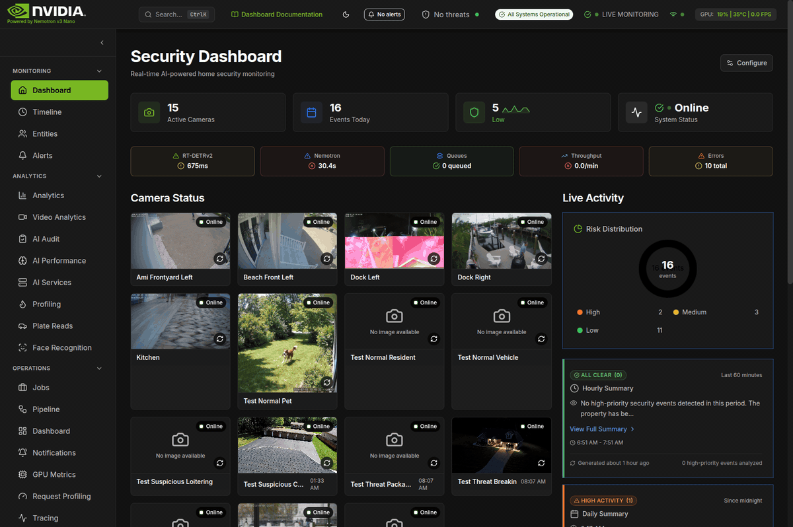

<details>
<summary>📸 Static Screenshots</summary>

| Dashboard                                           | Timeline                                          | Entities                                          |
| --------------------------------------------------- | ------------------------------------------------- | ------------------------------------------------- |
| 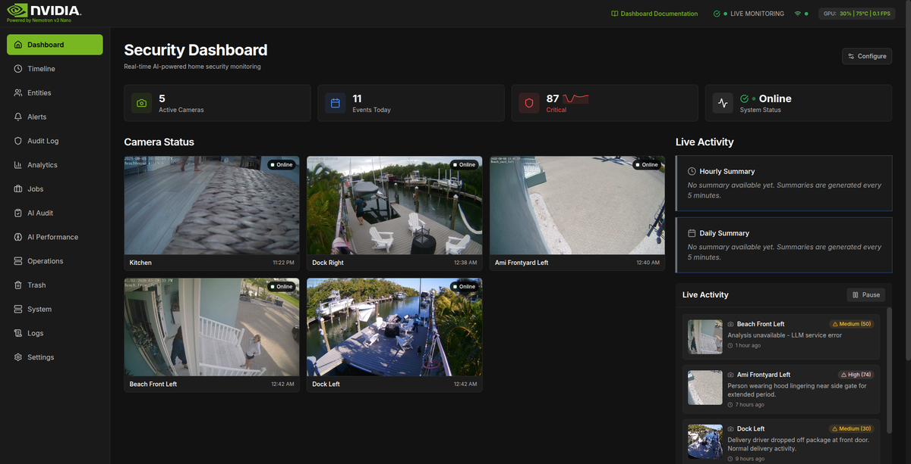 | 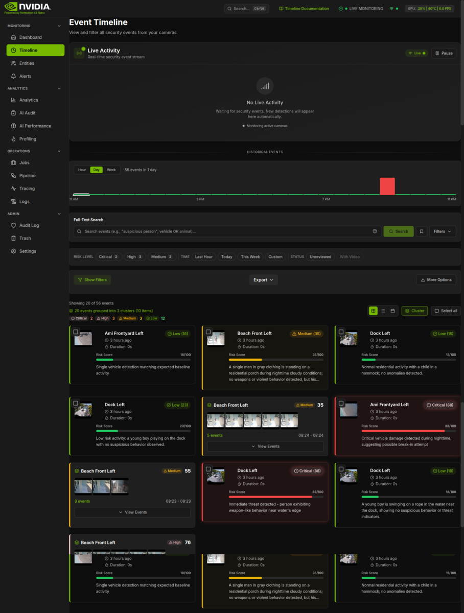 | 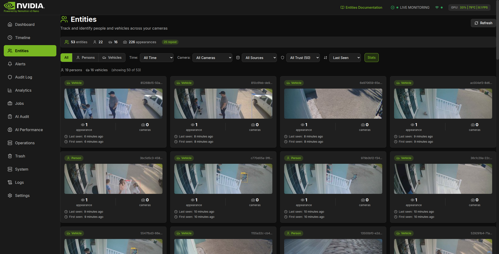 |

| Alerts                                        | Analytics                                           | AI Performance                                                |
| --------------------------------------------- | --------------------------------------------------- | ------------------------------------------------------------- |
| 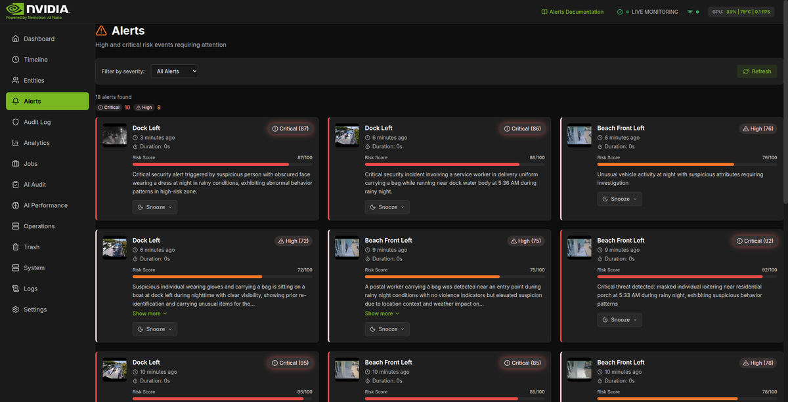 | 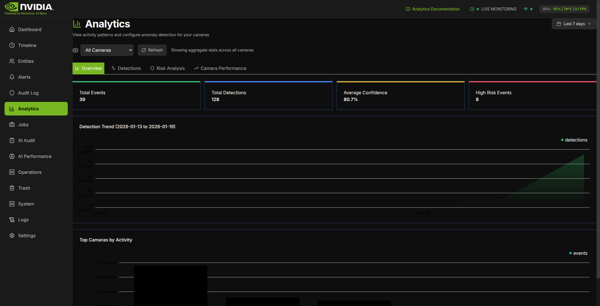 | 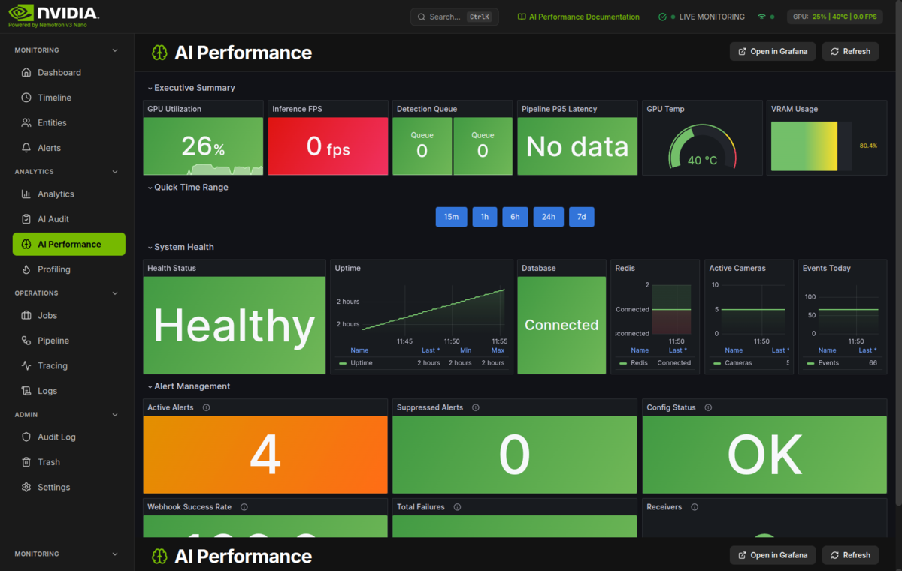 |

| Profiling                                           | Tracing                                         | Operations                                            |
| --------------------------------------------------- | ----------------------------------------------- | ----------------------------------------------------- |
| 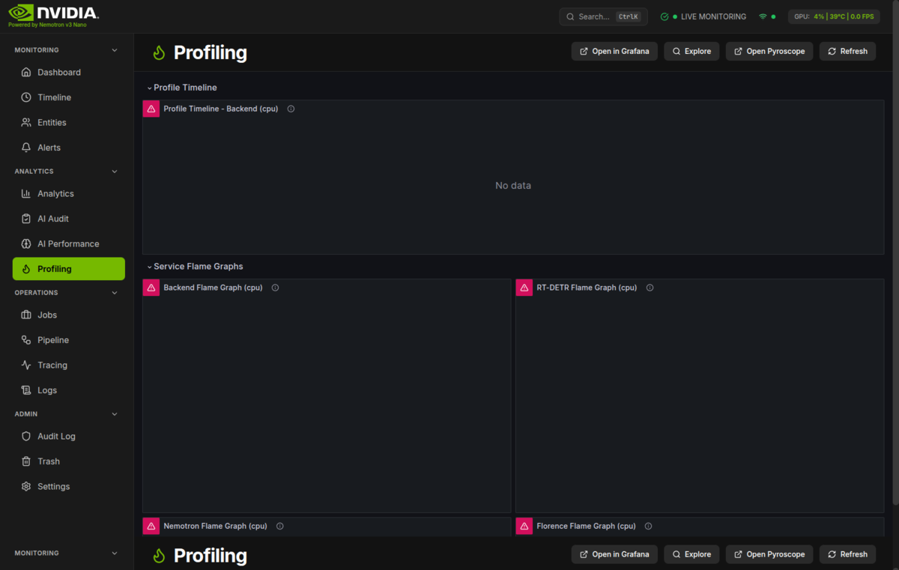 | 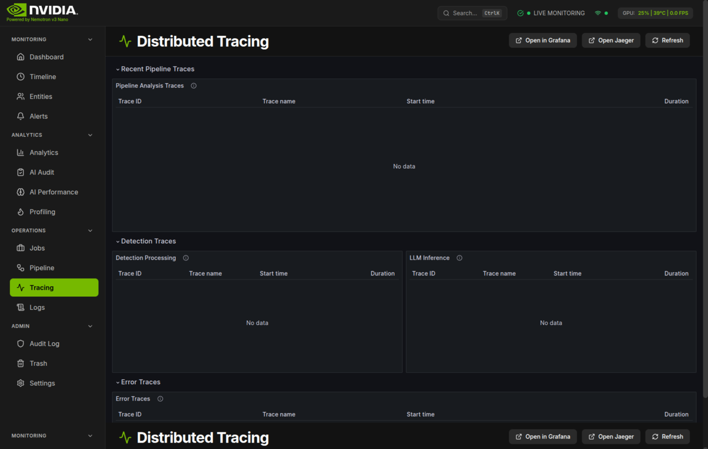 | 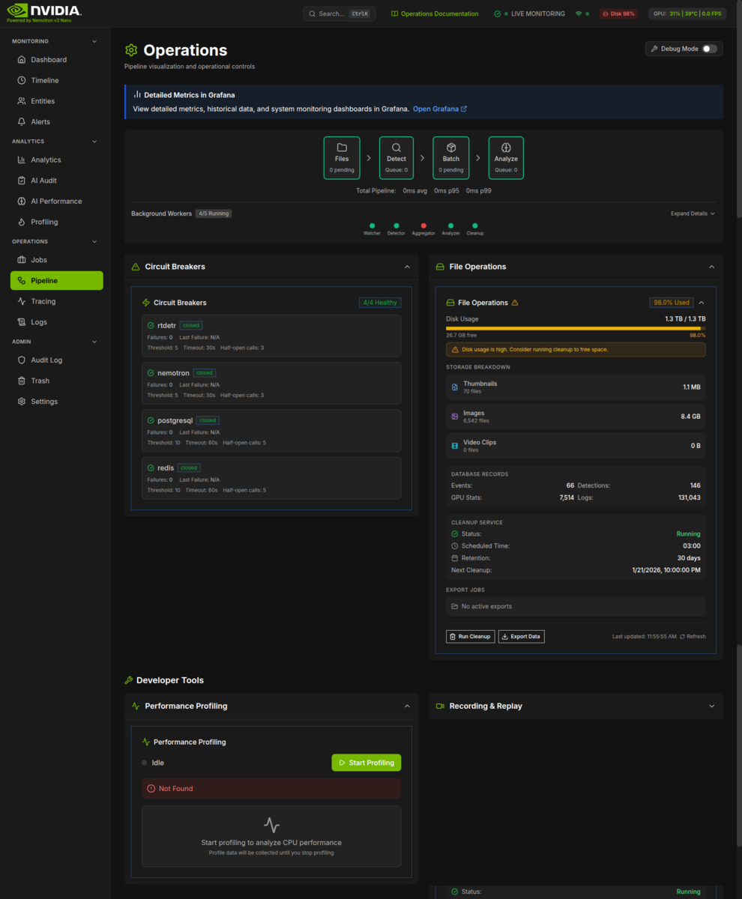 |

</details>

[](https://www.python.org/downloads/)
[](https://nodejs.org/)
[](https://fastapi.tiangolo.com/)
[](https://react.dev/)

[](https://github.com/mikesvoboda/nemotron-v3-home-security-intelligence/actions/workflows/ci.yml)
[](https://mikesvoboda.github.io/nemotron-v3-home-security-intelligence/)
[](https://codecov.io/gh/mikesvoboda/nemotron-v3-home-security-intelligence)
[](https://codecov.io/gh/mikesvoboda/nemotron-v3-home-security-intelligence)
[](https://codecov.io/gh/mikesvoboda/nemotron-v3-home-security-intelligence)

| I want to…                   | Start here                                                                                                                                                                          |
| ---------------------------- | ----------------------------------------------------------------------------------------------------------------------------------------------------------------------------------- |
| Browse the full docs         | [**Documentation Site**](https://mikesvoboda.github.io/nemotron-v3-home-security-intelligence/)                                                                                     |
| Run this at home             | [User Hub](docs/user/README.md)                                                                                                                                                     |
| Deploy and maintain it       | [Operator Hub](docs/operator/README.md)                                                                                                                                             |
| Contribute / extend the code | [Developer Hub](docs/developer/README.md)                                                                                                                                           |
| Work on it as an AI agent    | [`AGENTS.md`](AGENTS.md) — the root instruction file (read it); most code directories carry their own `AGENTS.md`, and [`llms.txt`](llms.txt) is the condensed machine-readable map |

---

## What You Get: AI-Powered Risk Reasoning

The brain of this system is a vision-language model that assesses every event — `VlmAnalyzer`
asks the `ai-vlm` llama.cpp serve for a verdict on each batch. Model identity is config
(`VLM_MODEL_PATH`), not code. It runs entirely on your hardware:

| Specification        | Value                                                                        | Why It Matters                                     |
| -------------------- | ---------------------------------------------------------------------------- | -------------------------------------------------- |
| **Weights**          | GGUF pair, host-mounted, never baked                                         | `VLM_MODEL_PATH` / `VLM_MMPROJ_PATH` in `.env`     |
| **Serving model**    | `Qwen3VL-8B-Instruct-Q4_K_M` + `mmproj-Qwen3VL-8B-Instruct-Q8_0`             | shipped default; both are overridable config       |
| **VRAM Required**    | config-driven — see [VRAM Requirements](docs/_includes/vram-requirements.md) | sized per card; `VLM_GPU_LAYERS=auto` offloads     |
| **Context Window**   | 32,768 tokens (`VLM_CTX_SIZE`)                                               | Split 2 ways: 16,384 per slot, concurrent analyses |
| **Inference Engine** | llama.cpp (`ai-vlm`, container port 8098)                                    | Optimized C++ with CUDA acceleration               |

**Also included:**

- **Real-time dashboard** — camera grid, activity feed, risk gauge, telemetry
- **Detections → events** — time-window batching turns many frames into one explained "event"
- **Identity lookups** — faces, license plates and person re-ID matched against your own
  registrations, in-process, alongside every VLM verdict
- **Local-first** — runs on your hardware; footage stays on your network
- **First run** — the API returns 503 for everything except setup and health until you register the
  first admin in the dashboard; that's the setup guard working, not a broken install


---

## Video Analytics Features

The system provides comprehensive video analytics capabilities:

### Detection and Analysis

| Feature                 | Description                                       | Documentation                                                             |
| ----------------------- | ------------------------------------------------- | ------------------------------------------------------------------------- |
| **Object Detection**    | YOLO26 detects people, vehicles, animals, objects | [Object detection](docs/guides/video-analytics.md#object-detection)       |
| **Scene Understanding** | The VLM describes and assesses each event         | [Scene understanding](docs/guides/video-analytics.md#scene-understanding) |
| **Anomaly Detection**   | Learned activity baselines flag unusual patterns  | [Anomaly detection](docs/guides/video-analytics.md#anomaly-detection)     |

### Zone Intelligence

| Feature                   | Description                              | Documentation                                                              |
| ------------------------- | ---------------------------------------- | -------------------------------------------------------------------------- |
| **Detection Zones**       | Define areas for focused monitoring      | [Creating zones](docs/guides/zone-configuration.md#creating-zones)         |
| **Dwell Time Tracking**   | Monitor how long objects remain in zones | [Dwell time](docs/guides/zone-configuration.md#dwell-time-tracking)        |
| **Line Crossing**         | Detect zone entry/exit events            | [Line crossing](docs/guides/zone-configuration.md#line-crossing-detection) |
| **Household Integration** | Link zones to household members          | [Households](docs/guides/zone-configuration.md#household-integration)      |

### Person and Vehicle Identification

| Feature               | Description                                 | Documentation                                                                 |
| --------------------- | ------------------------------------------- | ----------------------------------------------------------------------------- |
| **Face Detection**    | Detect faces within person detections       | [Face detection](docs/guides/face-recognition.md#face-detection)              |
| **Person Re-ID**      | Track individuals across cameras            | [Re-identification](docs/guides/face-recognition.md#person-re-identification) |
| **License Plates**    | Plate detection and OCR                     | [License plates](docs/guides/video-analytics.md#license-plate-detection)      |
| **Vehicle Detection** | YOLO26 vehicle classes (car, truck, bus, …) | [Vehicle analysis](docs/guides/video-analytics.md#vehicle-analysis)           |

### Analytics and Reporting

All four live on the [Analytics API](docs/api/analytics-endpoints.md):

| Endpoint                             | Description                |
| ------------------------------------ | -------------------------- |
| `/api/analytics/detection-trends`    | Daily detection counts     |
| `/api/analytics/risk-history`        | Risk level distribution    |
| `/api/analytics/camera-uptime`       | Camera performance metrics |
| `/api/analytics/object-distribution` | Object type breakdown      |

---

## AI Model Zoo

`models.yml` is the single source of truth for every model the system downloads and loads — name, download size, VRAM footprint, and which service runs it. The tables below are drawn from it, except where a model runs inside the gateway's Triton process instead of the backend model zoo (that process is budgeted in [VRAM Requirements](docs/_includes/vram-requirements.md); the Triton-served rows' `vram_mb` — e.g. osnet 100, threat 300 — cover only the backend-side load).

### Two AI Services

| Service          | Engine                                    | Port | What it serves                                                         |
| ---------------- | ----------------------------------------- | ---- | ---------------------------------------------------------------------- |
| **`ai-gateway`** | FastAPI + NVIDIA Triton (TensorRT / ONNX) | 8090 | Routers `/yolo26` (object detection) and `/enrich-lt` (readiness lane) |
| **`ai-vlm`**     | llama.cpp `llama-server`                  | 8098 | `POST /v1/chat/completions` — the per-event verdict                    |

The VLM runs in the default compose set (`up -d` starts it; until UR-18 it sat
behind a compose profile that had to be named explicitly) and the backend
soft-depends on it (`docker-compose.prod.yml:639-651` lists `postgres`, `redis`,
`ai-gateway` and `go2rtc`, never `ai-vlm`; the dial is the
`AI_VLM_URL` env var at `:554` — the backend has no `depends_on` entry
for it, so the backend degrades instead of failing to boot). `ai-gateway`'s
Triton repository holds exactly `{yolo26, reid, threat}`; `GATEWAY_MODEL_SET` accepts only
`vlm` and hard-raises on anything else. `ai-vlm` is the only LLM service; there is no
`ai-llm`.

### Object Detector

Three YOLO26 variants ship (`n`/`s`/`m`; `m` is the default). Measured end-to-end latency, RTX A5500 at 640x640, batch 1 — details and throughput curves in [YOLO26 Benchmarks](docs/benchmarks/yolo26-benchmarks.md):

| Variant | Latency (batch 1) | FPS  | Best For                     |
| ------- | ----------------- | ---- | ---------------------------- |
| YOLO26m | 138.84ms          | 7.2  | Default, best accuracy       |
| YOLO26s | 73.74ms           | 13.6 | Maximum throughput per frame |
| YOLO26n | 44.83ms           | 22.3 | Lightweight, edge deployment |

### Lookup Models

Three in-process lookup legs run alongside every VLM verdict and answer _identity_
questions (whose face, which plate, which person) against your own registrations.
The rest of the catalogue backs those legs and the Triton models the gateway serves.
Backend-zoo models become resident at boot when `BACKEND_MODEL_PRELOAD=true` loads
their `enabled: true` + `preload: true` rows; nothing loads them on demand at runtime,
and a leg whose model is absent answers unavailable instead. Nothing evicts: the zoo
has no eviction pass, so `never_evict`/`priority` rows are parsed but have no consumer
(see `backend/main.py`'s preload note). Complete `models.yml` inventory:

| Model                    | Purpose                               | VRAM              | Notes                                                     |
| ------------------------ | ------------------------------------- | ----------------- | --------------------------------------------------------- |
| yolo26                   | Primary object detection              | Triton (`yolo26`) | `enabled: false` in the zoo; gateway export reads the .pt |
| osnet-ain-x1-0           | Person re-ID embeddings               | ~100MB            | `enabled: true`; `preload: true`                          |
| face-detector-scrfd      | Face detection (CPU onnxruntime)      | 0 (CPU)           | `low` priority; `preload: true`                           |
| face-recognizer          | Face embeddings (CPU onnxruntime)     | 0 (CPU)           | `low` priority; `preload: true`                           |
| threat-detection-yolov8n | Weapon detection (knives, guns, bats) | ~300MB            | Triton `threat`; opted in via `GATEWAY_ENABLE_THREAT`     |
| yolo11-face              | Face detection on person crops        | ~200MB            | backend                                                   |
| yolo11-license-plate     | License plate detection               | ~300MB            | backend                                                   |
| fast-alpr                | Plate detection + OCR (ONNX)          | ~28MB             | library fetches at runtime                                |
| paddleocr                | Text recognition                      | ~100MB            | plates are handled by fast-alpr                           |
| yolo26-general           | General scene detection               | ~400MB            | `enabled: false` — weights not released                   |

### Model Priority System

Every model carries a `priority` in `models.yml` — the intended eviction order
for a future VRAM-budget pass. **No eviction pass exists today**, so the field
is parsed into `ModelConfig` and read by nobody (the contract is documented in
[docs/reference/models.md](docs/reference/models.md)):

- **CRITICAL** / **HIGH** / **MEDIUM** / **LOW**: most rows ship at **medium**
  (the two CPU face rows are **low**); no row is marked critical
- `never_evict: true` is the intended pin (no live row sets it)
- `preload: true` **is** honored: it loads the row at startup alongside
  `enabled: true` — today osnet + the two face rows

### Downloading Models

```bash
# Download the models the setup_lib rule selects (5 of the 10 live
# models.yml rows, 763MB of models.yml size_mb — the script header carries the
# exact re-derivation, and a guard test pins the fetch list to the rule).
# Reads only the AI_MODELS_PATH shell variable (not .env — export it to match
# setup.py's choice, below) and the target must already exist and be writable:
# setup.py sudo-creates it; otherwise sudo mkdir -p + chown first.
./ai/download_models.sh

# Custom models directory (default /export/ai_models; the containers mount this)
AI_MODELS_PATH=/path/to/models ./ai/download_models.sh
```

### VRAM Budget

Sizing is dominated by the VLM identity in `VLM_MODEL_PATH` / `VLM_MMPROJ_PATH`:
`VLM_GPU_LAYERS=auto` (default) offloads as many layers as the card allows, so
there is no fixed tier table. Budget the GGUF pair's layers, the gateway's Triton
process, and ~1.0GB of lookup-model headroom — the full table lives in
[VRAM Requirements](docs/_includes/vram-requirements.md).

The backend `ModelManager` (`backend/services/model_zoo.py`) exposes an
`@asynccontextmanager` `load()` that releases VRAM on exit, but in production the only
load trigger is the boot preload sweep (`BACKEND_MODEL_PRELOAD=true` in
`backend/main.py`'s lifespan) — no runtime path calls `load()`; a leg whose model is
absent answers unavailable. Preloaded models stay resident until shutdown
(`unload_all()` runs in the same lifespan), and the zoo has no eviction pass; the HTTP
load/unload endpoints return 501 because Triton models are resident by design
(`--model-control-mode=none`).

### Model Status API

```bash
curl http://localhost:8000/api/system/models
curl http://localhost:8000/api/system/models/<name>/status
```

> [!NOTE]
> The status API reads **ai-gateway** health — Triton readiness unioned across the mounted
> routers (`/yolo26`, `/enrich-lt`) plus in-process state from the backend ModelManager for
> models without a Triton mapping. Load/unload
> (`POST /api/system/models/<name>/load` and `/unload`) return **501 by design**:
> Triton runs with `--model-control-mode=none`, gateway models are resident, and the
> gateway exposes no preload/unload surface — see `backend/api/routes/model_management.py`
> for the full semantics. `vram-summary` sums `models.yml`'s estimated `vram_mb` per
> router; Triton does not expose per-model VRAM over HTTP.

---

<details>
<summary><strong>Hardware Requirements</strong></summary>

### Minimum vs Recommended

| Component      | Minimum                                                                                                                              | Recommended                                    | This Project Uses                                                                                                                                                                                                                                                                                                                                                                                  |
| -------------- | ------------------------------------------------------------------------------------------------------------------------------------ | ---------------------------------------------- | -------------------------------------------------------------------------------------------------------------------------------------------------------------------------------------------------------------------------------------------------------------------------------------------------------------------------------------------------------------------------------------------------- |
| **GPU VRAM**   | Whatever fits detection (24GB reference hardware recommended; the VLM offloads to CPU via `VLM_GPU_LAYERS` on smaller cards, slower) | 24GB                                           | RTX A5500 (24GB) — reference hardware, not a requirement                                                                                                                                                                                                                                                                                                                                           |
| **System RAM** | 32GB                                                                                                                                 | 64GB+                                          | 128GB                                                                                                                                                                                                                                                                                                                                                                                              |
| **Storage**    | 20GB (weights + DB)                                                                                                                  | 100GB+ (weights + DB + `RETENTION_DAYS` video) | `models.yml` has 10 catalogue rows totalling ~1.4GB of `size_mb` estimates; the shared download rule selects 5 of them (763 MB). `download_models.sh` provisions that 763 MB plus the read-only GGUF pair you mount into `ai-vlm` via `VLM_MODEL_PATH` / `VLM_MMPROJ_PATH`, whose size is whatever model you pick. Disk is dominated by recorded video (`RETENTION_DAYS`, default 30), not weights |
| **CPU**        | 8 cores                                                                                                                              | 16+ cores                                      | AMD Ryzen 9                                                                                                                                                                                                                                                                                                                                                                                        |

### GPU Compatibility

GPU residency is dominated by the GGUF pair named in `VLM_MODEL_PATH` /
`VLM_MMPROJ_PATH`: `VLM_GPU_LAYERS=auto` (default) offloads as many layers as the
card allows, so a smaller card still boots — more of the VLM runs on CPU, slower.
The gateway's resident Triton models (`yolo26`, `reid`, plus `threat` when
`GATEWAY_ENABLE_THREAT=true`) and the lookup `vram_mb` rows are itemized in
[VRAM Requirements](docs/_includes/vram-requirements.md).

### Runtime Resource Usage

> [!NOTE] > **No published GPU residency figure exists for this stack.** Residency is
> config-driven — size the VLM with `VLM_MODEL_PATH` / `VLM_MMPROJ_PATH` and
> `VLM_GPU_LAYERS`, then measure your own card (`nvidia-smi`, or the gateway's
> `/metrics`). A number from another card does not transfer here.

| Resource       | Usage                                                                                                                                          |
| -------------- | ---------------------------------------------------------------------------------------------------------------------------------------------- |
| **GPU Memory** | config-driven — see the note above; no fixed figure is published                                                                               |
| **System RAM** | 47 GB of `deploy.resources.limits.memory` across the 19 services that start by default (71 GB if every profile is enabled); host minimum 32 GB |
| **Containers** | 21 (19 start by default — `ai-llm-vllm` and `dcgm-exporter` need a profile; of the 19, `foscam-init` exits after its chown, so 18 stay up)     |
| **Open Ports** | 8444/8080 (UI HTTPS/HTTP), 8000 (API), 8090 (AI gateway), 8098 (VLM engine) — all AI ports bound to `127.0.0.1`                                |

> [!TIP] > **Tight on VRAM?** `VLM_GPU_LAYERS` is the dial: lower it and more of the VLM
> runs on CPU RAM, slower but functional. The system degrades gracefully.

</details>

---

## Quick Start

**Prerequisites:** Linux host + NVIDIA GPU + Podman with GPU passthrough (the `docker` CLI works as a shim only via the optional `podman-docker` package)

```bash
# 1. Run setup — generates .env from .env.example with your ports, paths and secrets,
#    offers to download the models, and ends by deploying the stack
python setup.py

# 2. Download AI models (763 MB — the 5 rows the shared setup_lib rule selects
#    from models.yml; minutes on a fast connection. The VLM GGUF pair is separate:
#    you place it at VLM_MODEL_PATH / VLM_MMPROJ_PATH yourself, ledger D5).
#    Skip if you let setup.py do it. The script reads only the AI_MODELS_PATH shell
#    variable — not .env — so match what setup.py wrote, and the target directory
#    must already exist and be writable (setup.py sudo-creates it).
AI_MODELS_PATH=$(grep -m1 ^AI_MODELS_PATH .env | cut -d= -f2-) ./ai/download_models.sh

# 3. Start everything (you only need this if setup.py's auto-deploy was skipped —
#    reboot prompt, --defaults, or Ctrl-C; see the note below for PODMAN_SOCKET)
podman compose -f docker-compose.prod.yml up -d
```

> [!NOTE]
> This project targets **Podman**: the compose file uses Podman-specific keys
> (`userns_mode: keep-id`, `:U` mount flags, CDI `devices:`), so plain `docker compose`
> does not run it as-is. `backend` and `alloy` also hard-require `PODMAN_SOCKET` in
> `.env`; `python setup.py deploy` appends it automatically. If you skipped the deploy
> phase, enable the socket first:
>
> ```bash
> systemctl --user enable --now podman.socket
> echo "PODMAN_SOCKET=/run/user/$(id -u)/podman/podman.sock" >> .env
> ```

**Verify:**

```bash
curl http://localhost:8000/api/system/health   # Backend health
open http://localhost:8080                     # Dashboard (HTTP)
# Or: open https://localhost:8444              # Dashboard (HTTPS; enable with SSL_ENABLED=true)
```

Then open the dashboard: first run requires you to register the first admin account
(the API returns 503 for everything except setup and health until you do).

> [!TIP]
> Run **just core services**: `podman compose -f docker-compose.prod.yml up -d postgres redis backend frontend ai-gateway ai-vlm`
> (`ai-gateway` serves detection on `/yolo26`; `ai-vlm` is in the default set, so a plain `up -d` starts it too — no flag needed.)

## Operations & Monitoring

The monitoring ships in the same compose file — no separate stack to start. Monitoring URLs bind
`127.0.0.1`, so open them on the host itself (or forward an SSH tunnel); the dashboard is the
exception, bound `0.0.0.0` for tunnel access — use your firewall to fence it.

| Where        | URL                                                       | Notes                                                                                                                                                                  |
| ------------ | --------------------------------------------------------- | ---------------------------------------------------------------------------------------------------------------------------------------------------------------------- |
| Dashboard    | `http://localhost:8080` / `https://localhost:8444`        | HTTPS needs `SSL_ENABLED=true`                                                                                                                                         |
| API docs     | `http://localhost:8000/docs`                              | FastAPI Swagger UI                                                                                                                                                     |
| Grafana      | `http://localhost:3002` or `https://<host>:8444/grafana/` | Anonymous access: on for a `setup.py`-written `.env` (compose fallback — setup.py emits no `GF_AUTH_*`), off if you `cp .env.example .env` (the example ships `false`) |
| Prometheus   | `http://localhost:9090`                                   | Metrics and alerting rules                                                                                                                                             |
| Alertmanager | `http://localhost:9093`                                   | Delivered alerts                                                                                                                                                       |
| Loki         | `http://localhost:3100`                                   | Log aggregation (queried through Grafana)                                                                                                                              |
| Tempo        | `http://localhost:3200`                                   | Distributed traces                                                                                                                                                     |
| Pyroscope    | `http://localhost:4040`                                   | Continuous profiling                                                                                                                                                   |

Port numbers come from `.env` (`GRAFANA_PORT`, `PROMETHEUS_PORT`, …). Full guide:
[Monitoring & Observability](docs/operator/monitoring.md).

### First five minutes at 2am

```bash
# What's up / what's down (this project uses Podman)
podman ps -a --format "table {{.Names}}\t{{.Status}}"
podman compose -f docker-compose.prod.yml ps

# Logs — a whole service, or one container
podman compose -f docker-compose.prod.yml logs --tail=50 backend
# backend has no container_name: the real name is <project>-backend-1 (compose v2)
# or <project>_backend_1 (podman-compose v1) — discover it:
podman logs --tail=50 "$(podman ps --format '{{.Names}}' | grep -E -- '[-_]backend[-_]?[0-9]?$')"

# Restart one service without touching the rest
podman compose -f docker-compose.prod.yml restart backend
```

Host-run dev-mode logs land in `logs/backend.log` (`./scripts/dev.sh logs` tails it).

Health endpoints, cheapest first — `health/live` answers without touching dependencies:

| Endpoint                                       | What it tells you                                        |
| ---------------------------------------------- | -------------------------------------------------------- |
| `http://localhost:8000/api/system/health/live` | Backend process is alive                                 |
| `http://localhost:8000/api/system/health`      | Backend + dependency status                              |
| `http://localhost:8000/api/system/health/full` | Every dependency, no timeouts                            |
| `http://localhost:8090/health`                 | AI gateway (Triton, mounted routers)                     |
| `http://localhost:8098/health`                 | VLM engine (llama.cpp) — starts with the default `up -d` |

A `/health` 200 from `ai-vlm` proves the server answers, not that it loaded the
`mmproj` projector. Check `podman logs ai-vlm 2>&1 | grep -i mmproj` when verdicts
arrive as `verification_failed` with a NULL risk score.

Service control and self-healing details: [Service Control](docs/operator/service-control.md).

<details>
<summary><strong>Development Setup (host-run backend + frontend)</strong></summary>

Runs backend and frontend as host processes for fast iteration; Redis and
PostgreSQL come from containers, AI containers stay as they are. Needs `uv`
(`curl -LsSf https://astral.sh/uv/install.sh | sh`), Node 24+, and Python 3.14
(`requires-python` in `pyproject.toml`) on the host.

```bash
# 1. One-time setup
python setup.py
uv sync --extra dev            # Python deps (repo-root .venv — dev.sh sources this one)
cd frontend && npm ci          # Frontend deps (CI uses npm; bun.lock + bunfig.toml exist — if you use bun, `bun run test`, never `bun test`; see frontend/bunfig.toml)

# 2. PostgreSQL — dev.sh does NOT start it, and the backend dies on boot without it
#    (init_db in the FastAPI lifespan). .env's DATABASE_URL/REDIS_URL point at the
#    container hostnames `postgres`/`redis`, so run a dev container and override:
podman run -d --name dev-postgres \
  -e POSTGRES_USER=security -e POSTGRES_DB=security \
  -e POSTGRES_PASSWORD="$(grep -m1 ^POSTGRES_PASSWORD .env | cut -d= -f2-)" \
  -p 127.0.0.1:5432:5432 docker.io/library/postgres:16-alpine
export DATABASE_URL="postgresql+asyncpg://security:$(grep -m1 ^POSTGRES_PASSWORD .env | cut -d= -f2-)@localhost:5432/security"
export REDIS_URL=redis://localhost:6379/0

# 3. Start Redis + backend (uvicorn :8000) + frontend (Vite dev server :8444, HTTPS)
./scripts/dev.sh start
./scripts/dev.sh status        # Also: stop | restart | logs
```

`dev.sh` starts Redis with the `docker` CLI; on a Podman host give it the
docker-compatible socket (`systemctl --user enable --now podman.socket` + the
`podman-docker` shim, or `export DOCKER_HOST=unix:///run/user/$UID/podman/podman.sock`)
or run a system Redis (`sudo systemctl start redis`) — otherwise `start` aborts
(`set -e`) before backend/frontend launch. `./scripts/dev.sh redis` manages just
Redis.

Open https://localhost:8444 — Vite pins 8444 with `strictPort`; HTTPS needs a
cert provider (`@vitejs/plugin-basic-ssl` — `https: true` alone no longer
auto-generates a cert, the TLS handshake just fails). It proxies `/api` and
`/ws` to the backend on port 8000. (`frontend/vite.config.ts`.)

</details>

<details>
<summary><strong>Host-run AI servers</strong></summary>

Useful when iterating on AI model code directly on the host. The host-run detector
replaces only the gateway's `/yolo26` router — the `/enrich-lt` readiness lane still needs
the `ai-gateway` container. (Triton inside `ai-gateway` serves yolo26; the archived
standalone GPU image build recipe lives at `archive/ai-yolo26-image/Dockerfile`.)

```bash
# Start the AI servers on the host (separate terminals)
./ai/start_detector.sh   # YOLO26 — reads PORT/YOLO26_PORT, defaults to 8090
# The reasoning engine has no host-run script: the shipped llama.cpp serve is the
# ai-vlm container — start it with
#   podman compose -f docker-compose.prod.yml up -d ai-vlm

# Then point the HOST-RUN backend (dev.sh) at them. The host detector serves its
# endpoints at the root (/health, /detect), so no router suffix — and these exports
# never reach a containerized backend (compose hardcodes the AI gateway URLs —
# AI_VLM_URL is the interpolated exception; no env_file).
export YOLO26_URL=http://localhost:8090
# The /enrich-lt lane (threat + re-ID Triton models, published on 127.0.0.1:8090 by
# the ai-gateway container) is read as a readiness target by
# backend/api/routes/model_management.py. Leave USE_AI_GATEWAY=false (the Settings
# default): with it true the detector client ignores YOLO26_URL and sends detection
# back to the gateway.
export ENRICHMENT_LIGHT_URL=http://localhost:8090/enrich-lt
```

If instead the backend itself runs in a container, `host.docker.internal` resolves
only on macOS/Docker Desktop; on Linux Podman use `host.containers.internal` or the
host IP, and note the compose file hardcodes the AI gateway URLs (`AI_VLM_URL` is
interpolated — it is the one that reaches the container from `.env`), so override them with a
compose `environment:` entry or an override file — a shell `export` is not enough.
See [AI Configuration](docs/operator/ai-configuration.md) for the per-platform hostnames.

> [!WARNING]
> Do **not** run these while the `ai-gateway` container is up — they will fight over port 8090.
> The host-run detector defaults to 8090, which is also the `ai-gateway` host port.
> To keep `ai-gateway` up for the `/enrich-lt` lane, run the detector on a free port instead:
> `YOLO26_PORT=8095 ./ai/start_detector.sh` with `export YOLO26_URL=http://localhost:8095`.

</details>

---

## Architecture


| Layer       | Stack                         | Key Files                                                   |
| ----------- | ----------------------------- | ----------------------------------------------------------- |
| Frontend    | React + TypeScript + Tailwind | `frontend/src/services/api.ts`                              |
| Backend     | FastAPI + SQLAlchemy + Redis  | `backend/services/`, `backend/api/`                         |
| AI Services | llama.cpp + Triton + FastAPI  | `ai/gateway/` (Triton routers), `ai/vlm/` (llama.cpp serve) |

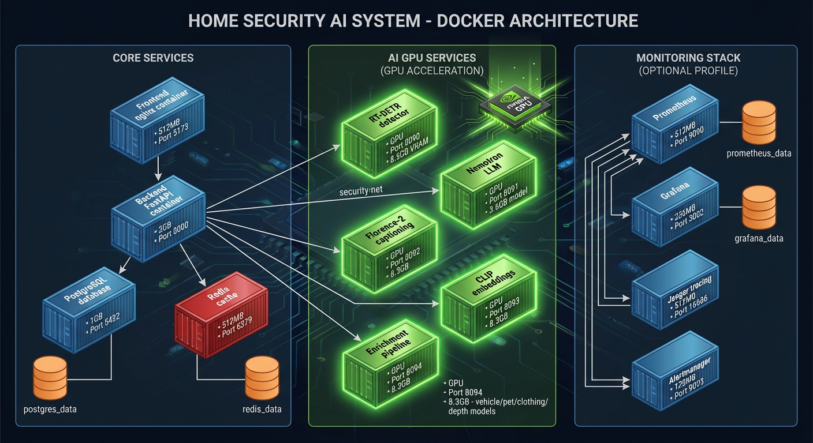


**Detailed Documentation:**

| Hub                                                                  | Description                                |
| -------------------------------------------------------------------- | ------------------------------------------ |
| [Architecture Hub](docs/architecture/README.md)                      | Complete system architecture documentation |
| [Security](docs/architecture/security/README.md)                     | Input validation, data protection, OWASP   |
| [Dataflows](docs/architecture/dataflows/README.md)                   | End-to-end data traces, pipeline timing    |
| [Detection Pipeline](docs/architecture/detection-pipeline/README.md) | YOLO26 integration, image processing       |
| [AI Orchestration](docs/architecture/ai-orchestration/README.md)     | VLM verdict path, batch processing         |

---

<details>
<summary><strong>Camera Ingestion (FTP)</strong></summary>

Cameras upload images/videos to:

```
/export/foscam/{camera_name}/
```

You can:

- Bring your own FTP server and point it at `/export/foscam`
- Run the archived vsftpd container yourself from [`archive/vsftpd/`](archive/vsftpd/) — `vsftpd.conf`, `Dockerfile`, `docker-compose-wrapper.sh`, `install-systemd.sh`. It is not wired into any compose file.

> [!NOTE]
> In production containers, the host camera path is mounted to `/cameras` and the backend uses `FOSCAM_BASE_PATH=/cameras`.

</details>

<details>
<summary><strong>Configuration</strong></summary>

**Source of truth:** [Environment Variable Reference](docs/reference/config/env-reference.md)

Common settings:

| Variable                             | Purpose                                 | Containerized deploy                                                                                                                |
| ------------------------------------ | --------------------------------------- | ----------------------------------------------------------------------------------------------------------------------------------- |
| `FOSCAM_BASE_PATH`                   | Camera upload directory (host path)     | Read from `.env` by compose (bind-mount source); inside the container it's forced to `/cameras`                                     |
| `YOLO26_URL`, `ENRICHMENT_LIGHT_URL` | AI gateway router endpoints (port 8090) | Compose hardcodes these to `http://ai-gateway:8090/<route>`; your `.env` values are ignored (host runs only)                        |
| `AI_VLM_URL`                         | VLM engine endpoint (port 8098)         | Interpolated (`${AI_VLM_URL:-http://ai-vlm:8098}`) — your `.env` value lands; default is the container DNS name (host runs: set it) |
| `RETENTION_DAYS`                     | Event retention (days; default 30)      | **Not passed to the backend container** — add an `environment:` entry or an override file, or edits silently keep the default       |
| `BATCH_WINDOW_SECONDS`               | Detection batching window               | **Not passed to the backend container** — same caveat                                                                               |
| `API_KEY_ENABLED`                    | Enable API key auth (off by default)    | **Not passed to the backend container** — same caveat                                                                               |
| `FILE_WATCHER_POLLING`               | Use polling (Docker mounts)             | Passed through by compose — the only knob here that works out of the box                                                            |

> [!NOTE]
> The prod compose file has **no** `env_file:` and mounts no `.env`, and `.dockerignore` excludes it —
> so the `env_file=".env"` in `backend/core/config.py` resolves to a path inside the image that
> doesn't exist. Only variables compose interpolates with `${...}`, or names in the `environment:`
> list, reach the container. Host-run dev mode (`./scripts/dev.sh`) reads `.env` directly, where all
> of these work.

</details>

<details>
<summary><strong>Security Model</strong></summary>

This MVP is designed for **single-user, trusted LAN** deployments.

- On a fresh install the API returns 503 until you register the first admin account through the dashboard
  (SetupGuardMiddleware); after that, API endpoints are open to the local network.
- Optional API keys exist behind `API_KEY_ENABLED` (off by default); admin/destructive routes carry their own guards.
- Rate limiting is **on by default**
- Do **not** expose to the public internet without hardening

See: [Admin Security Guide](docs/operator/admin/security.md)

</details>

---

## Contributing

Start with the [Developer Hub](docs/developer/README.md), then:

```bash
./scripts/validate.sh  # Full validation (lint + typecheck + tests)
```

**Issue tracking:** [Linear](https://linear.app/nemotron-v3-home-security/team/NEM/active)

---

## License

Licensed under **Apache License 2.0**. See [LICENSE](LICENSE).

## Acknowledgments

[Ultralytics YOLO](https://github.com/ultralytics/ultralytics) ·
[Qwen3-VL](https://huggingface.co/Qwen) ·
[llama.cpp](https://github.com/ggerganov/llama.cpp) ·
[NVIDIA Triton](https://developer.nvidia.com/triton-inference-server) ·
[FastAPI](https://fastapi.tiangolo.com/) ·
[Tremor](https://www.tremor.so/)
