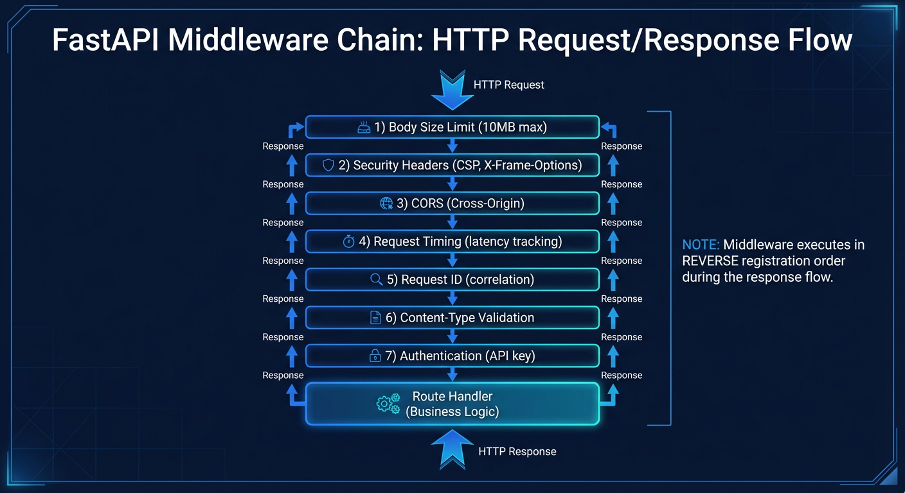

# API Middleware

## Middleware Chain



_HTTP request/response flow through the middleware chain showing execution order._

## Authentication Middleware

`AuthMiddleware` (`auth.py`) is the EXPOSE_LAN gate (OD-12), the outermost middleware.

### Configuration

| Variable     | Default | Effect                                                                                       |
| ------------ | ------- | -------------------------------------------------------------------------------------------- |
| `EXPOSE_LAN` | `false` | `true`: every request needs the login session cookie or an `API_KEYS` key, except open paths |
| `API_KEYS`   | `[]`    | Keys the gate accepts (JSON array); `verify_api_key` routes also need `API_KEY_ENABLED=true` |

With `EXPOSE_LAN` unset the gate passes every request; the `127.0.0.1` binding is the boundary.

### Credentials

- Browsers: the `session_id` cookie set by `POST /api/auth/login`, checked against Redis.
- Scripts over HTTP: `curl -H "X-API-Key: <key>" ...`. A key in the URL (`?api_key=`) is refused.
- WebSockets: the `api-key.<key>` subprotocol (preferred: URLs reach access logs) or `?api_key=<key>`.

### Open paths

Exact matches only: `/health`, `/ready`, `/api/system/health`, `/api/system/health/ready`,
`/api/metrics`, `/api/system/gpu`, `/api/system/stats`, `/api/system/telemetry`,
`/api/auth/setup-status`, `/api/auth/register`, `/api/auth/login`, `/api/auth/logout`, plus CORS
preflights that carry `Origin`. `/docs`, `/openapi.json` and media need a credential.

### Responses

- Refused HTTP request: `401 {"detail": "Authentication required"}`.
- Refused WebSocket: accepted, then closed with `4001`.
- An authenticated response is marked `Cache-Control: private`, so no shared cache keeps it.
- Every refusal is logged as a security event (`event_type="auth_required"`, client IP masked).

### Testing

```bash
uv run pytest backend/tests/unit/api/middleware/test_auth.py backend/tests/unit/api/test_expose_lan_routes.py -v
uv run pytest backend/tests/integration/test_expose_lan_auth.py -v
```

## Additional Middleware Modules

The middleware directory contains 24 modules total. Beyond authentication, key middleware includes:

- **`setup_guard.py`** - `SetupGuardMiddleware` blocks all API access with HTTP 503 until the first admin user is registered. This ensures the system is properly initialized before accepting requests.
- **`etag.py`** - ETag support for conditional requests (If-None-Match / 304 responses)
- **`profiling.py`** - Request profiling for performance analysis
- **`prometheus.py`** - Prometheus metrics collection for request monitoring
- **`baggage.py`** - W3C Baggage context propagation for distributed tracing

See `backend/AGENTS.md` for the complete middleware listing.

### Future Enhancements

- Database storage for API keys with metadata (name, created_at, is_active)
- Key rotation and expiration
- Rate limiting per API key
- Audit logging of API key usage
- Key permissions/scopes
