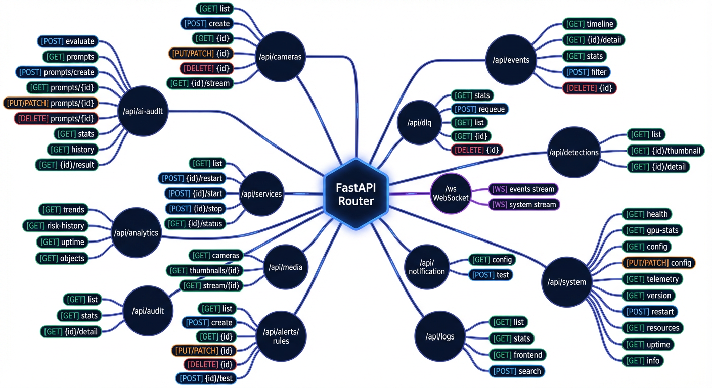

# API Routes

## Endpoint Relationships Graph



_Complete API endpoint relationship graph showing all route groups and their HTTP methods._

## Purpose

The `backend/api/routes/` directory contains FastAPI router modules that define HTTP endpoints for the home security monitoring system. Each file groups related endpoints by resource type (cameras, events, detections, system, media, WebSocket, DLQ, metrics, analytics, notification preferences, RUM, services, and more).

## Files

### `__init__.py`

Package initialization with public exports:

- `alerts_router` - Alert rules API router
- `audit_router` - Audit logs API router
- `entities_router` - Entity re-identification API router
- `logs_router` - Logs API router
- `zones_router` - Camera zones API router

Note: Other routers (cameras, events, detections, system, media, websocket, dlq, metrics, notification, admin, ai_audit, prompt_management, analytics, notification_preferences, rum, services, calibration, debug) are imported directly via FastAPI app.include_router() in main.py.

### `cameras.py`

Camera management CRUD endpoints and snapshot serving.

**Router prefix:** `/api/cameras`

**Endpoints:**

| Method | Path                                | Purpose                                         |
| ------ | ----------------------------------- | ----------------------------------------------- |
| GET    | `/api/cameras`                      | List all cameras with optional status filter    |
| GET    | `/api/cameras/{camera_id}`          | Get a specific camera by ID                     |
| GET    | `/api/cameras/{camera_id}/snapshot` | Get latest snapshot image                       |
| POST   | `/api/cameras`                      | Create a new camera                             |
| PATCH  | `/api/cameras/{camera_id}`          | Update an existing camera                       |
| DELETE | `/api/cameras/{camera_id}`          | Delete a camera (cascades to detections/events) |

**Key Features:**

- UUID generation for new cameras
- Partial updates via PATCH (only updates provided fields)
- Cascade deletion of related data
- Latest snapshot serving from camera folder (finds most recently modified image)
- Path traversal protection for snapshot serving

### `events.py`

Security event management, querying, and statistics.

**Router prefix:** `/api/events`

**Endpoints:**

| Method | Path                                | Purpose                                |
| ------ | ----------------------------------- | -------------------------------------- |
| GET    | `/api/events`                       | List events with filtering/pagination  |
| GET    | `/api/events/stats`                 | Get aggregated event statistics        |
| GET    | `/api/events/{event_id}`            | Get specific event by ID               |
| PATCH  | `/api/events/{event_id}`            | Update event (reviewed status & notes) |
| GET    | `/api/events/{event_id}/detections` | Get detections for event               |

**Query Parameters (List):**

- `camera_id` - Filter by camera ID (e.g., "front_door")
- `risk_level` - Filter by risk level (low, medium, high, critical)
- `start_date` / `end_date` - Date range filter (ISO format)
- `reviewed` - Filter by reviewed status
- `object_type` - Filter by detected object type
- `limit` / `offset` - Pagination (default: 50, max: 1000)

**Key Features:**

- Object type filtering via detection join
- Detection count calculation from JSON array detection_ids
- Aggregated statistics by risk level and camera
- User notes support

### `detections.py`

Object detection listing and thumbnail image serving.

**Router prefix:** `/api/detections`

**Endpoints:**

| Method | Path                                   | Purpose                                   |
| ------ | -------------------------------------- | ----------------------------------------- |
| GET    | `/api/detections`                      | List detections with filtering/pagination |
| GET    | `/api/detections/{detection_id}`       | Get specific detection by ID              |
| GET    | `/api/detections/{detection_id}/image` | Get thumbnail with bounding box           |

**Query Parameters (List):**

- `camera_id` - Filter by camera ID (e.g., "front_door")
- `object_type` - Filter by object type (person, car, etc.)
- `start_date` / `end_date` - Date range filter
- `min_confidence` - Minimum confidence (0.0-1.0)
- `limit` / `offset` - Pagination

**Key Features:**

- On-the-fly thumbnail generation if not cached
- Bounding box overlay on images
- Image caching with 1-hour cache headers
- Integration with ThumbnailGenerator service

### `logs.py`

System and frontend log management.

**Router prefix:** `/api/logs`

**Endpoints:**

| Method | Path                 | Purpose                             |
| ------ | -------------------- | ----------------------------------- |
| GET    | `/api/logs`          | List logs with filtering/pagination |
| GET    | `/api/logs/stats`    | Get log statistics for dashboard    |
| GET    | `/api/logs/{log_id}` | Get specific log entry by ID        |
| POST   | `/api/logs/frontend` | Submit frontend log entry           |

**Query Parameters (List):**

- `level` - Filter by log level (DEBUG, INFO, WARNING, ERROR, CRITICAL)
- `component` - Filter by component/module name
- `camera_id` - Filter by associated camera ID (e.g., "front_door")
- `source` - Filter by source (backend, frontend)
- `search` - Search in message text (case-insensitive)
- `start_date` / `end_date` - Date range filter
- `limit` / `offset` - Pagination (default: 100)

**Key Features:**

- Dashboard statistics (today's counts by level and component)
- Frontend log ingestion with automatic user agent capture
- Top component identification

### `websocket.py`

WebSocket endpoints for real-time communication.

**Router prefix:** None (WebSocket endpoints)

**Endpoints:**

| Method | Path         | Purpose                         |
| ------ | ------------ | ------------------------------- |
| WS     | `/ws/events` | Real-time security event stream |
| WS     | `/ws/system` | Real-time system status stream  |

**Event Stream (`/ws/events`):**

- Broadcasts security events as they are analyzed
- Message format: `{"type": "event", "data": {...}}`
- Uses EventBroadcaster service

**System Stream (`/ws/system`):**

- Broadcasts system status updates every 5 seconds
- Message format: `{"type": "system_status", "data": {...}}`
- Uses SystemBroadcaster service

**Authentication:**
When API key auth is enabled, provide key via:

- Query parameter: `ws://host/ws/events?api_key=YOUR_KEY`
- Sec-WebSocket-Protocol header: `api-key.YOUR_KEY`

**Connection Lifecycle:**

1. Client connects and is authenticated (if enabled)
2. Connection registered with broadcaster
3. Client receives broadcast messages
4. Ping/pong keep-alive support
5. Graceful disconnect and cleanup

### `system.py`

System monitoring, health checks, GPU stats, configuration, telemetry, worker supervision, and pipeline status.

**Router prefix:** `/api/system`

**Core Health Endpoints:**

| Method | Path                           | Purpose                                      |
| ------ | ------------------------------ | -------------------------------------------- |
| GET    | `/api/system/health`           | Detailed system health check                 |
| GET    | `/health` (root level)         | Liveness probe (always returns "alive")      |
| GET    | `/api/system/health/ready`     | Readiness probe (checks all dependencies)    |
| GET    | `/api/system/health/full`      | Comprehensive health check (all AI services) |
| GET    | `/api/system/health/websocket` | WebSocket broadcaster circuit breaker status |

**Prometheus Monitoring Endpoints:**

| Method | Path                             | Purpose                                         |
| ------ | -------------------------------- | ----------------------------------------------- |
| GET    | `/api/system/monitoring/health`  | Monitoring stack health (Prometheus, exporters) |
| GET    | `/api/system/monitoring/targets` | Prometheus scrape target status                 |

**GPU and Performance Endpoints:**

| Method | Path                              | Purpose                                       |
| ------ | --------------------------------- | --------------------------------------------- |
| GET    | `/api/system/gpu`                 | Current GPU statistics                        |
| GET    | `/api/system/gpu/history`         | GPU stats time series                         |
| GET    | `/api/system/performance`         | Real-time performance metrics (GPU, AI, host) |
| GET    | `/api/system/performance/history` | Historical performance data for time-series   |

**Configuration and Statistics Endpoints:**

| Method | Path                   | Purpose                                          |
| ------ | ---------------------- | ------------------------------------------------ |
| GET    | `/api/system/stats`    | System statistics (counts, uptime)               |
| GET    | `/api/system/config`   | Public configuration settings                    |
| PATCH  | `/api/system/config`   | Update configuration settings (API key required) |
| GET    | `/api/system/storage`  | Storage statistics and disk usage                |
| GET    | `/api/system/severity` | Severity level definitions and thresholds        |
| PUT    | `/api/system/severity` | Update severity thresholds (API key required)    |

**Telemetry and Pipeline Latency Endpoints:**

| Method | Path                                   | Purpose                                         |
| ------ | -------------------------------------- | ----------------------------------------------- |
| GET    | `/api/system/telemetry`                | Pipeline queue depths and latency stats         |
| GET    | `/api/system/pipeline-latency`         | Pipeline stage transition latencies             |
| GET    | `/api/system/pipeline-latency/history` | Pipeline latency history for time-series charts |

**Cleanup Endpoints:**

| Method | Path                                 | Purpose                                   |
| ------ | ------------------------------------ | ----------------------------------------- |
| POST   | `/api/system/cleanup`                | Trigger manual cleanup (API key required) |
| POST   | `/api/system/cleanup/orphaned-files` | Clean orphaned files (API key required)   |
| GET    | `/api/system/cleanup/status`         | Cleanup service status and next run       |

**Circuit Breaker Endpoints:**

| Method | Path                                        | Purpose                                |
| ------ | ------------------------------------------- | -------------------------------------- |
| GET    | `/api/system/circuit-breakers`              | All circuit breaker states and metrics |
| POST   | `/api/system/circuit-breakers/{name}/reset` | Reset circuit breaker to closed state  |

**Worker Supervisor Endpoints (NEM-2457):**

| Method | Path                                            | Purpose                          |
| ------ | ----------------------------------------------- | -------------------------------- |
| GET    | `/api/system/supervisor`                        | Worker supervisor status         |
| GET    | `/api/system/supervisor/status`                 | Worker supervisor status (alias) |
| POST   | `/api/system/supervisor/workers/{name}/start`   | Start a stopped worker           |
| POST   | `/api/system/supervisor/workers/{name}/stop`    | Stop a running worker            |
| POST   | `/api/system/supervisor/workers/{name}/restart` | Restart a worker                 |
| POST   | `/api/system/supervisor/reset/{name}`           | Reset worker restart count       |
| GET    | `/api/system/supervisor/restart-history`        | Paginated restart event history  |

**Model Zoo Endpoints:**

| Method | Path                                    | Purpose                                         |
| ------ | --------------------------------------- | ----------------------------------------------- |
| GET    | `/api/system/models`                    | Model Zoo registry (all models with VRAM stats) |
| GET    | `/api/system/models/{model_name}`       | Specific model status                           |
| GET    | `/api/system/model-zoo/status`          | Compact model status for UI                     |
| GET    | `/api/system/model-zoo/latency/history` | Model latency history for charts                |

**Anomaly Detection Endpoints:**

| Method | Path                         | Purpose                                     |
| ------ | ---------------------------- | ------------------------------------------- |
| GET    | `/api/system/anomaly-config` | Anomaly detection configuration             |
| PATCH  | `/api/system/anomaly-config` | Update anomaly detection settings (API key) |

**Pipeline Status Endpoints:**

| Method | Path                           | Purpose                                         |
| ------ | ------------------------------ | ----------------------------------------------- |
| GET    | `/api/system/pipeline`         | Pipeline architecture status (watcher, batches) |
| GET    | `/api/system/websocket/events` | WebSocket event type registry with schemas      |

**Health Status Logic:**

- `healthy` - All services operational
- `degraded` - Some non-critical services down
- `unhealthy` - Critical services (database) down

**Readiness Logic:**

- `ready` - Database and Redis healthy
- `degraded` - Database up but Redis down
- `not_ready` - Database down

**Worker Supervisor States:**

- `running` - Worker is actively processing
- `stopped` - Worker is stopped (can be started)
- `crashed` - Worker crashed, pending restart
- `restarting` - Worker is being restarted
- `failed` - Worker exceeded max restart limit

**Worker Status Tracking:**

- GPU monitor, cleanup service, system broadcaster, file watcher
- Detection worker, analysis worker, batch timeout worker
- Workers registered via `register_workers()` at startup
- Supervisor provides automatic restart with exponential backoff

**Telemetry:**

- Queue depths for detection and analysis queues
- Per-stage latency statistics (watch, detect, batch, analyze)
- Percentile calculations (p50, p95, p99)

**Key Features:**

- Multi-service health checks with timeout protection (5 seconds)
- Circuit breaker pattern for AI service health checks
- Runtime configuration updates persisted to env file
- Application uptime tracking
- Kubernetes-style liveness/readiness probes
- Pipeline latency tracking with percentiles (p50, p95, p99)
- Manual cleanup with dry_run mode for verification
- Severity taxonomy and thresholds for frontend consistency
- Storage stats with disk usage and per-category breakdown
- Worker supervisor with automatic restart and exponential backoff
- Model Zoo VRAM budget management (1650 MB dedicated)
- Prometheus monitoring integration with exporter health tracking
- WebSocket event registry for frontend discovery

### `media.py`

Secure media file serving for camera images and detection thumbnails.

**Router prefix:** `/api/media`

**Endpoints:**

| Method | Path                                        | Purpose                              |
| ------ | ------------------------------------------- | ------------------------------------ |
| GET    | `/api/media/cameras/{camera_id}/{filename}` | Serve camera images/videos           |
| GET    | `/api/media/thumbnails/{filename}`          | Serve detection thumbnails           |
| GET    | `/api/media/{path}`                         | Compatibility route for legacy paths |

**Allowed File Types:**

- Images: `.jpg`, `.jpeg`, `.png`, `.gif`
- Videos: `.mp4`, `.mkv`, `.avi`, `.mov`

**Security Features:**

- Path traversal prevention (blocks `..` and `/` prefixes)
- File type whitelist enforcement
- Base path validation (resolved path must be within allowed directory)
- Descriptive error responses via `MediaErrorResponse`

**Base Paths:**

- Camera files: `{foscam_base_path}/{camera_id}/`
- Thumbnails: thumbnails directory under data (relative to backend)

### `dlq.py`

Dead-letter queue (DLQ) inspection and management.

**Router prefix:** `/api/dlq`

**Endpoints:**

| Method | Path                                | Purpose                     |
| ------ | ----------------------------------- | --------------------------- |
| GET    | `/api/dlq/stats`                    | Get DLQ statistics          |
| GET    | `/api/dlq/jobs/{queue_name}`        | List jobs in a specific DLQ |
| POST   | `/api/dlq/requeue/{queue_name}`     | Requeue oldest job from DLQ |
| POST   | `/api/dlq/requeue-all/{queue_name}` | Requeue all jobs from DLQ   |
| DELETE | `/api/dlq/{queue_name}`             | Clear all jobs from DLQ     |

**Queue Names:**

- `dlq:detection_queue` - Failed detection jobs
- `dlq:analysis_queue` - Failed analysis jobs

**Key Features:**

- View failed job payloads and error messages
- Retry failed jobs by moving back to processing queue
- Bulk requeue with iteration limit (10,000 max)
- Clear DLQ contents

### `metrics.py`

Prometheus metrics endpoint for observability.

**Router prefix:** `/api`

**Endpoints:**

| Method | Path           | Purpose                                        |
| ------ | -------------- | ---------------------------------------------- |
| GET    | `/api/metrics` | Return Prometheus metrics in exposition format |

**Key Features:**

- No authentication required (for Prometheus scraping)
- Standard Prometheus text format
- Integrates with `backend.core.metrics`

### `alerts.py`

Alert rules management with CRUD operations and rule testing.

**Router prefix:** `/api/alerts/rules`

**Endpoints:**

| Method | Path                               | Purpose                             |
| ------ | ---------------------------------- | ----------------------------------- |
| GET    | `/api/alerts/rules`                | List alert rules with filtering     |
| POST   | `/api/alerts/rules`                | Create new alert rule               |
| GET    | `/api/alerts/rules/{rule_id}`      | Get specific alert rule             |
| PUT    | `/api/alerts/rules/{rule_id}`      | Update alert rule                   |
| DELETE | `/api/alerts/rules/{rule_id}`      | Delete alert rule                   |
| POST   | `/api/alerts/rules/{rule_id}/test` | Test rule against historical events |

**Query Parameters (List):**

- `enabled` - Filter by enabled status
- `severity` - Filter by severity level (low, medium, high, critical)
- `limit` / `offset` - Pagination

**Key Features:**

- Rule conditions: risk threshold, object types, camera IDs, zone IDs, min confidence
- Schedule-based rules with timezone support (time-of-day filtering)
- Deduplication with cooldown windows
- Channel-based notification routing
- Rule testing against historical events to validate configuration

### `audit.py`

Audit log management for security and compliance tracking.

**Router prefix:** `/api/audit`

**Endpoints:**

| Method | Path                    | Purpose                      |
| ------ | ----------------------- | ---------------------------- |
| GET    | `/api/audit`            | List audit logs with filters |
| GET    | `/api/audit/stats`      | Get audit log statistics     |
| GET    | `/api/audit/{audit_id}` | Get specific audit log entry |

**Query Parameters (List):**

- `action` - Filter by action type
- `resource_type` - Filter by resource type (event, alert, rule, camera, settings)
- `resource_id` - Filter by specific resource ID
- `actor` - Filter by actor (user or system)
- `status` - Filter by status (success/failure)
- `start_date` / `end_date` - Date range filter
- `limit` / `offset` - Pagination

**Key Features:**

- Tracks security-sensitive operations
- Statistics aggregation by action, resource type, and status
- Recent actors tracking

### `zones.py`

Camera zone management (nested under cameras resource).

**Router prefix:** `/api/cameras`

**Endpoints:**

| Method | Path                                       | Purpose               |
| ------ | ------------------------------------------ | --------------------- |
| GET    | `/api/cameras/{camera_id}/zones`           | List zones for camera |
| POST   | `/api/cameras/{camera_id}/zones`           | Create zone           |
| GET    | `/api/cameras/{camera_id}/zones/{zone_id}` | Get specific zone     |
| PUT    | `/api/cameras/{camera_id}/zones/{zone_id}` | Update zone           |
| DELETE | `/api/cameras/{camera_id}/zones/{zone_id}` | Delete zone           |

**Query Parameters (List):**

- `enabled` - Filter by enabled status

**Key Features:**

- Polygon coordinates in normalized 0-1 range
- Zone types: entry_point, exit_point, restricted, monitored, other
- Shape support: rectangle, polygon
- Priority-based overlapping zones
- Color customization for UI display

### `notification.py`

Notification configuration and testing endpoints.

**Router prefix:** `/api/notification`

**Endpoints:**

| Method | Path                       | Purpose                            |
| ------ | -------------------------- | ---------------------------------- |
| GET    | `/api/notification/config` | Get notification configuration     |
| POST   | `/api/notification/test`   | Test notification channel delivery |

**Key Features:**

- Shows which notification channels are configured (email, webhook, push)
- Returns SMTP and webhook settings (without sensitive data)
- Test endpoint sends mock alerts to verify channel configuration
- Supports email, webhook, and push notification channels
- Integrates with AuditService for logging test actions

### `admin.py`

Development-only admin endpoints for seeding test data.

**Router prefix:** `/api/admin`

**Endpoints:**

| Method | Path                      | Purpose                         |
| ------ | ------------------------- | ------------------------------- |
| POST   | `/api/admin/seed/cameras` | Seed test cameras               |
| POST   | `/api/admin/seed/events`  | Seed mock events and detections |
| DELETE | `/api/admin/seed/clear`   | Clear all seeded data           |

**Key Features:**

- Only available when `DEBUG=true` in environment
- Predefined sample cameras (Front Door, Backyard, Garage, etc.)
- Mock events with realistic risk levels and summaries
- Weighted risk distribution (50% low, 35% medium, 15% high)
- Auto-generates detections with random bounding boxes

### `debug.py`

Debug endpoints for runtime diagnostics (NEM-1642).

**Router prefix:** `/api/debug`

**SECURITY:** All endpoints gated by `settings.debug == True`. When `debug=False`, endpoints return 404 Not Found to avoid revealing the existence of debug functionality.

**Endpoints:**

| Method | Path                               | Purpose                                    |
| ------ | ---------------------------------- | ------------------------------------------ |
| GET    | `/api/debug/config`                | Current configuration with redacted values |
| GET    | `/api/debug/redis/info`            | Redis connection stats and pub/sub info    |
| GET    | `/api/debug/websocket/connections` | Active WebSocket connection states         |
| GET    | `/api/debug/circuit-breakers`      | All circuit breaker states                 |
| GET    | `/api/debug/pipeline-state`        | Pipeline queue depths and worker status    |
| GET    | `/api/debug/log-level`             | Get current log level                      |
| POST   | `/api/debug/log-level`             | Change log level at runtime                |

**Configuration Endpoint (`/api/debug/config`):**

- Returns all settings with sensitive values redacted
- Uses `redact_sensitive_value()` from `backend/core/logging.py`
- Redacts: passwords, API keys, secrets, database URLs, Redis URLs

**Redis Info Endpoint (`/api/debug/redis/info`):**

- Connection status (connected, unavailable, error)
- Server info (version, memory, clients, uptime)
- Active pub/sub channels and subscriber counts

**WebSocket Connections Endpoint (`/api/debug/websocket/connections`):**

- Event broadcaster status (connection count, listening state, degraded mode)
- System broadcaster status (connection count, listening state)
- Circuit breaker state for each broadcaster

**Circuit Breakers Endpoint (`/api/debug/circuit-breakers`):**

- All registered circuit breakers from global registry
- State (CLOSED, OPEN, HALF_OPEN)
- Failure/success counts, total/rejected calls
- Configuration (thresholds, timeouts)

**Log Level Endpoint (`/api/debug/log-level`):**

- GET: Returns current root logger level
- POST: Changes log level at runtime (DEBUG, INFO, WARNING, ERROR, CRITICAL)
- Updates all handlers to new level

**Key Features:**

- Security: Returns 404 when `debug=False` (hides endpoint existence)
- Redaction: Uses consistent patterns from `backend/core/logging.py`
- Graceful degradation: Redis endpoints handle unavailability
- Real-time: All data is live, not cached

### `ai_audit.py`

AI pipeline audit management for model performance, quality scoring, recommendations, and prompt management.

**Router prefix:** `/api/ai-audit`

**Audit Endpoints:**

| Method | Path                                       | Purpose                                            |
| ------ | ------------------------------------------ | -------------------------------------------------- |
| GET    | `/api/ai-audit/events/{event_id}`          | Get audit info for a specific event                |
| POST   | `/api/ai-audit/events/{event_id}/evaluate` | Trigger full evaluation for an event               |
| GET    | `/api/ai-audit/stats`                      | Get aggregate AI audit statistics                  |
| GET    | `/api/ai-audit/leaderboard`                | Get model leaderboard by contribution rate         |
| GET    | `/api/ai-audit/recommendations`            | Get aggregated prompt improvement recommendations  |
| POST   | `/api/ai-audit/batch`                      | Trigger batch audit processing for multiple events |

**Prompt Management Endpoints (Prompt Playground API):**

| Method | Path                                      | Purpose                                  |
| ------ | ----------------------------------------- | ---------------------------------------- |
| GET    | `/api/ai-audit/prompts`                   | Get all prompt configurations            |
| POST   | `/api/ai-audit/prompts/test`              | Test a modified prompt against an event  |
| GET    | `/api/ai-audit/prompts/history`           | Get prompt version history (all models)  |
| GET    | `/api/ai-audit/prompts/export`            | Export all prompts as JSON               |
| POST   | `/api/ai-audit/prompts/import`            | Import prompt configurations             |
| GET    | `/api/ai-audit/prompts/{model}`           | Get prompt for a specific model          |
| PUT    | `/api/ai-audit/prompts/{model}`           | Update prompt for a specific model       |
| GET    | `/api/ai-audit/prompts/history/{model}`   | Get version history for a specific model |
| POST   | `/api/ai-audit/prompts/history/{version}` | Restore a specific prompt version        |

**Query Parameters:**

- `days` - Number of days to include (1-90, default 7)
- `camera_id` - Filter by camera ID (stats endpoint)
- `force` - Force re-evaluation even if already evaluated (evaluate endpoint)
- `min_risk_score` - Minimum risk score filter (batch endpoint)
- `limit` - Maximum events to process (batch endpoint)

**Supported Prompt Models:**

- `nemotron` - System prompt for risk analysis
- `florence2` - Scene analysis queries
- `yolo_world` - Custom object classes and confidence threshold
- `xclip` - Action recognition classes
- `fashion_clip` - Clothing categories

**Key Features:**

- Model contribution tracking (YOLO26, Florence, CLIP, violence, clothing, vehicle, pet, weather, etc.)
- Quality scoring (context usage, reasoning coherence, risk justification, consistency)
- Prompt improvement suggestions (missing context, confusing sections, unused data, format suggestions)
- Model leaderboard with quality correlation
- Batch evaluation for historical events
- Full prompt version history with change descriptions
- Export/import for backup and sharing configurations
- A/B testing prompts against events or images

### `analytics.py`

Comprehensive analytics endpoints for video analytics, detection trends, risk analysis, and camera performance metrics.

**Router prefix:** `/api/analytics`

**Endpoints:**

| Method | Path                                     | Purpose                             |
| ------ | ---------------------------------------- | ----------------------------------- |
| GET    | `/api/analytics/detection-trends`        | Detection counts aggregated by day  |
| GET    | `/api/analytics/risk-history`            | Risk level distribution over time   |
| GET    | `/api/analytics/camera-uptime`           | Uptime percentage per camera        |
| GET    | `/api/analytics/object-distribution`     | Detection counts by object type     |
| GET    | `/api/analytics/risk-score-distribution` | Risk score histogram with buckets   |
| GET    | `/api/analytics/risk-score-trends`       | Average risk score trends over time |

**Query Parameters:**

- `start_date` - Start of date range (ISO format, required)
- `end_date` - End of date range (ISO format, required)
- `camera_id` - Filter by camera ID (optional)
- `bucket_size` - Size of histogram buckets (1-50, default: 10, risk-score-distribution only)

**Key Features:**

- Time-series data for dashboard charts
- Risk level breakdown (low, medium, high, critical)
- Camera uptime calculation based on detection activity
- Object type distribution with percentages
- Risk score histogram with configurable bucket sizes
- Average risk score trends with daily counts
- Date validation ensures start_date <= end_date
- Gap filling for days with no data

**Response Caching:**

- All endpoints cached for 5 minutes
- ETag support for conditional requests

**Documentation:** See [Analytics API Reference](../../../docs/api/analytics-endpoints.md)

### `calibration.py`

User risk threshold calibration endpoints for personalizing event severity classification.

**Router prefix:** `/api/calibration`

**Endpoints:**

| Method | Path                        | Purpose                          |
| ------ | --------------------------- | -------------------------------- |
| GET    | `/api/calibration`          | Get current calibration settings |
| PUT    | `/api/calibration`          | Update calibration (full update) |
| PATCH  | `/api/calibration`          | Partial calibration update       |
| POST   | `/api/calibration/reset`    | Reset to default thresholds      |
| GET    | `/api/calibration/defaults` | Get default threshold values     |

**Default Thresholds:**

- `low_threshold`: 30 (scores 0-29 = low risk)
- `medium_threshold`: 60 (scores 30-59 = medium risk)
- `high_threshold`: 85 (scores 60-84 = high risk, 85-100 = critical)
- `decay_factor`: 0.1 (learning rate for threshold adjustment)

**Key Features:**

- Auto-creates calibration record on first GET if none exists
- Validates threshold ordering (low < medium < high)
- Preserves feedback counts on reset
- Single-user system uses `user_id="default"`
- Supports partial updates (only provided fields changed)

**Related:** Works with Feedback API for threshold adjustment based on user feedback.

### `exports.py`

Export job management with database persistence for event data exports.

**Router prefix:** `/api/exports`

**Endpoints:**

| Method | Path                                  | Purpose                        |
| ------ | ------------------------------------- | ------------------------------ |
| POST   | `/api/exports`                        | Start new export job           |
| GET    | `/api/exports`                        | List recent export jobs        |
| GET    | `/api/exports/{job_id}`               | Get export job status          |
| DELETE | `/api/exports/{job_id}`               | Cancel export job              |
| GET    | `/api/exports/{job_id}/download`      | Download completed export file |
| GET    | `/api/exports/{job_id}/download/info` | Get download metadata          |

**Query Parameters (List):**

- `status` - Filter by job status (pending, running, completed, failed)
- `limit` / `offset` - Pagination (default: 50, max: 1000)

**Export Formats:**

- `csv` - Comma-separated values
- `json` - JSON format
- `zip` - ZIP archive with multiple files
- `excel` - Excel spreadsheet

**Key Features:**

- Database persistence via ExportJob model
- Background task processing with progress tracking
- WebSocket progress broadcasts via JobTracker
- Cancellation support for pending/running jobs
- File download with proper content types
- Filter by camera, risk level, date range, reviewed status

### `feedback.py`

Event feedback management for model calibration and false positive tracking (NEM-1908).

**Router prefix:** `/api/feedback`

**Endpoints:**

| Method | Path                             | Purpose                           |
| ------ | -------------------------------- | --------------------------------- |
| POST   | `/api/feedback`                  | Submit feedback for an event      |
| GET    | `/api/feedback/event/{event_id}` | Get feedback for an event         |
| GET    | `/api/feedback/stats`            | Get aggregate feedback statistics |

**Feedback Types:**

- `false_positive` - Event incorrectly flagged as a threat
- `missed_detection` - Real threat not detected
- `wrong_severity` - Incorrect risk level assigned
- `correct` - Classification was correct

**Key Features:**

- One feedback per event (enforced by unique constraint)
- Statistics aggregation by feedback type and camera
- Used for calibrating personalized risk thresholds
- Helps improve AI model accuracy over time

### `jobs.py`

Background job tracking API with comprehensive management features.

**Router prefix:** `/api`

**Core Job Endpoints:**

| Method | Path                        | Purpose                          |
| ------ | --------------------------- | -------------------------------- |
| GET    | `/api/jobs`                 | List all jobs with filtering     |
| GET    | `/api/jobs/types`           | List available job types         |
| GET    | `/api/jobs/stats`           | Get aggregate job statistics     |
| GET    | `/api/jobs/search`          | Advanced job search (NEM-2392)   |
| GET    | `/api/jobs/{job_id}`        | Get job status                   |
| GET    | `/api/jobs/{job_id}/detail` | Get detailed job info (NEM-2390) |
| POST   | `/api/jobs/{job_id}/cancel` | Cancel a queued job              |
| POST   | `/api/jobs/{job_id}/abort`  | Abort a running job              |
| DELETE | `/api/jobs/{job_id}`        | Cancel or abort based on state   |
| POST   | `/api/jobs/bulk-cancel`     | Bulk cancel multiple jobs        |

**Job History Endpoints (NEM-2396):**

| Method | Path                         | Purpose                   |
| ------ | ---------------------------- | ------------------------- |
| GET    | `/api/jobs/{job_id}/history` | Get job execution history |
| GET    | `/api/jobs/{job_id}/logs`    | Get job execution logs    |

**Export Endpoint:**

| Method | Path                 | Purpose                |
| ------ | -------------------- | ---------------------- |
| POST   | `/api/events/export` | Start event export job |

**Available Job Types:**

- `export` - Export events to CSV, JSON, or ZIP
- `cleanup` - Clean up old data and temp files
- `backup` - Create system data backup
- `import` - Import events from external files
- `batch_audit` - Batch AI pipeline audit processing

**Query Parameters (List):**

- `job_type` - Filter by type
- `status` - Filter by status (pending, running, completed, failed)
- `limit` / `offset` - Pagination

**Search Parameters:**

- `q` - Free text search across job type, error, metadata
- `status` - Comma-separated status values
- `job_type` - Comma-separated job types
- `created_after` / `created_before` - Creation time range
- `completed_after` / `completed_before` - Completion time range
- `has_error` - Filter by error presence
- `min_duration` / `max_duration` - Duration range (seconds)
- `sort` / `order` - Sort field and direction

**Key Features:**

- In-memory job tracking with Redis persistence
- WebSocket progress broadcasts
- Job history with state transitions
- Retry attempt tracking with error details
- Bulk cancellation support
- Advanced search with aggregations

### `queues.py`

Queue status monitoring for job processing pipeline health.

**Router prefix:** `/api/queues`

**Endpoints:**

| Method | Path                 | Purpose                |
| ------ | -------------------- | ---------------------- |
| GET    | `/api/queues/status` | Get all queue statuses |

**Queues Monitored:**

- `detection` - Object detection jobs from camera uploads
- `ai_analysis` - LLM risk analysis for batched detections
- `dlq` - Dead-letter queue for failed jobs

**Health Status Levels:**

- `healthy` - Queue depth below warning threshold
- `warning` - Queue depth approaching limits
- `critical` - Queue depth exceeds limits or wait times too long

**Response Includes:**

- Queue depth and running job count
- Worker count per queue
- Throughput (jobs/minute, avg processing time)
- Oldest job details with wait time
- Summary with aggregated stats

**Key Features:**

- Configurable warning/critical thresholds
- Maximum wait time monitoring
- Throughput calculation
- Overall health status aggregation

### `notification_preferences.py`

User notification preferences including global settings, per-camera settings, and quiet hours.

**Router prefix:** `/api/notifications/preferences`

**Global Preferences Endpoints:**

| Method | Path                             | Purpose                             |
| ------ | -------------------------------- | ----------------------------------- |
| GET    | `/api/notifications/preferences` | Get global notification settings    |
| PATCH  | `/api/notifications/preferences` | Update global notification settings |

**Camera-Specific Settings Endpoints:**

| Method | Path                                                 | Purpose                               |
| ------ | ---------------------------------------------------- | ------------------------------------- |
| GET    | `/api/notifications/preferences/cameras`             | List per-camera notification settings |
| GET    | `/api/notifications/preferences/cameras/{camera_id}` | Get settings for specific camera      |
| PATCH  | `/api/notifications/preferences/cameras/{camera_id}` | Update settings for specific camera   |

**Quiet Hours Endpoints:**

| Method | Path                                              | Purpose                         |
| ------ | ------------------------------------------------- | ------------------------------- |
| GET    | `/api/notifications/preferences/quiet-hours`      | List all quiet hours periods    |
| POST   | `/api/notifications/preferences/quiet-hours`      | Create new quiet hours period   |
| GET    | `/api/notifications/preferences/quiet-hours/{id}` | Get specific quiet hours period |
| PUT    | `/api/notifications/preferences/quiet-hours/{id}` | Update quiet hours period       |
| DELETE | `/api/notifications/preferences/quiet-hours/{id}` | Delete quiet hours period       |

**Key Features:**

- Global enable/disable for all notifications
- Sound selection (none, default, alert, chime, urgent)
- Risk level filters (which levels trigger notifications)
- Per-camera enable/disable and risk threshold
- Quiet hours with day-of-week scheduling
- Overlapping quiet periods supported

### `rum.py`

Real User Monitoring (RUM) endpoints for Core Web Vitals ingestion.

**Router prefix:** `/api/rum`

**Endpoints:**

| Method | Path              | Purpose                                 |
| ------ | ----------------- | --------------------------------------- |
| POST   | `/api/rum/ingest` | Ingest batch of Core Web Vitals metrics |

**Request Body (RUMBatchRequest):**

- `metrics` - List of WebVitalMetric objects (LCP, FID, INP, CLS, TTFB, FCP)
- `session_id` - Optional session identifier
- `user_agent` - Optional user agent string

**Metric Fields:**

- `name` - Metric name (LCP, FID, INP, CLS, TTFB, FCP)
- `value` - Metric value (milliseconds or dimensionless for CLS)
- `rating` - Performance rating (good, needs-improvement, poor)
- `delta` - Delta since last report
- `id` - Unique metric identifier from web-vitals library
- `navigationType` - Navigation type (navigate, reload, back_forward, prerender)
- `path` - Page path where metric was measured

**Key Features:**

- Batch ingestion for reduced API calls
- Frontend web-vitals library integration
- Session and user agent tracking
- All Core Web Vitals metrics supported

### `services.py`

Container orchestrator service management for monitoring and control.

**Router prefix:** `/api/services`

**Endpoints:**

| Method | Path                                   | Purpose                        |
| ------ | -------------------------------------- | ------------------------------ |
| GET    | `/api/services`                        | List all container services    |
| GET    | `/api/services/{service_name}`         | Get status of specific service |
| POST   | `/api/services/{service_name}/restart` | Restart a service              |
| POST   | `/api/services/{service_name}/start`   | Start a stopped service        |
| POST   | `/api/services/{service_name}/stop`    | Stop a running service         |

**Key Features:**

- Service health monitoring
- Container lifecycle management
- Integration with Docker/Podman
- Service restart for recovery from failures

### `webhooks.py`

Webhook receivers for external monitoring systems (primarily Alertmanager).

**Router prefix:** `/api/webhooks`

**Endpoints:**

| Method | Path                   | Purpose                                    |
| ------ | ---------------------- | ------------------------------------------ |
| POST   | `/api/webhooks/alerts` | Receive Alertmanager webhook notifications |

**Alertmanager Integration:**

- Receives alerts in standard [Alertmanager webhook format](https://prometheus.io/docs/alerting/latest/configuration/#webhook_config)
- Logs alerts with appropriate severity (ERROR for critical firing, WARNING for warning/high firing, INFO otherwise)
- Broadcasts alerts to WebSocket clients as `infrastructure_alert` events
- Supports both `firing` and `resolved` alert statuses

**Alert Labels:**

| Label       | Description               | Example Values                           |
| ----------- | ------------------------- | ---------------------------------------- |
| `alertname` | Name of the alert rule    | `HSIGPUMemoryHigh`, `HSIPipelineStalled` |
| `severity`  | Alert severity level      | `critical`, `warning`, `info`            |
| `component` | System component affected | `gpu`, `pipeline`, `redis`, `database`   |

**Response:**

```json
{
  "status": "ok",
  "received": 1,
  "processed": 1,
  "message": "Processed 1 alert(s) from receiver-name"
}
```

**Key Features:**

- Background WebSocket broadcasting (non-blocking)
- Structured logging with severity-based log levels
- Graceful degradation when broadcaster unavailable
- Standard Alertmanager payload validation

### `entities.py`

Entity re-identification tracking across multiple cameras using CLIP embeddings.

**Router prefix:** `/api/entities`

**Endpoints:**

| Method | Path                                | Purpose                               |
| ------ | ----------------------------------- | ------------------------------------- |
| GET    | `/api/entities`                     | List tracked entities with filtering  |
| GET    | `/api/entities/{entity_id}`         | Get detailed info for an entity       |
| GET    | `/api/entities/{entity_id}/history` | Get appearance timeline for an entity |

**Query Parameters (List):**

- `entity_type` - Filter by type ('person' or 'vehicle')
- `camera_id` - Filter by camera ID
- `since` - Filter entities seen since this timestamp
- `limit` / `offset` - Pagination (default: 50, max: 1000)

**Key Features:**

- Cross-camera entity tracking using CLIP embeddings stored in Redis
- Appearance history with timestamps and camera locations
- Thumbnail URLs for each entity appearance
- Entity summaries with appearance counts and cameras seen
- Graceful degradation when Redis is unavailable

### `prompt_management.py`

Prompt configuration management for AI models with versioning, testing, and import/export.

**Router prefix:** `/api/ai-audit/prompts`

**Note:** This module is currently NOT included in main.py. The prompt management endpoints are served by `ai_audit.py` instead. This file exists as a standalone module that may be used for alternate routing or future refactoring.

**Endpoints:**

| Method | Path                                         | Purpose                                 |
| ------ | -------------------------------------------- | --------------------------------------- |
| GET    | `/api/ai-audit/prompts`                      | Get all prompt configurations           |
| GET    | `/api/ai-audit/prompts/export`               | Export all prompts as JSON              |
| GET    | `/api/ai-audit/prompts/history`              | Get prompt version history              |
| POST   | `/api/ai-audit/prompts/test`                 | Test a modified prompt against an event |
| POST   | `/api/ai-audit/prompts/import`               | Import prompt configurations            |
| POST   | `/api/ai-audit/prompts/import/preview`       | Preview import changes without applying |
| POST   | `/api/ai-audit/prompts/history/{version_id}` | Restore a specific prompt version       |
| GET    | `/api/ai-audit/prompts/{model}`              | Get prompt for a specific model         |
| PUT    | `/api/ai-audit/prompts/{model}`              | Update prompt for a specific model      |

**Supported Models:**

- `nemotron` - System prompt for risk analysis
- `florence2` - Scene analysis queries
- `yolo_world` - Custom object classes and confidence threshold
- `xclip` - Action recognition classes
- `fashion_clip` - Clothing categories

**Key Features:**

- Full version history with change descriptions
- Export/import for backup and sharing configurations
- Import preview with diff computation
- A/B testing prompts against events or images
- Restore previous versions while preserving history

## Common Patterns

### Async Database Access

All routes use async SQLAlchemy sessions with Annotated dependency injection (NEM-3742):

```python
from backend.api.dependencies import DbSession

# Modern pattern (preferred)
async def list_items(db: DbSession):
    result = await db.execute(select(Model).where(...))
    item = result.scalar_one_or_none()

# Legacy pattern (still supported)
async def list_items(db: AsyncSession = Depends(get_db)):
    result = await db.execute(select(Model).where(...))
    item = result.scalar_one_or_none()
```

### Error Handling

```python
if not resource:
    raise HTTPException(
        status_code=status.HTTP_404_NOT_FOUND,
        detail=f"Resource with id {id} not found",
    )
```

### Response Models

Every endpoint declares its response model:

```python
@router.get("", response_model=ResponseSchema)
async def endpoint(...) -> ResponseType:
    ...
```

### Dependency Injection

Routes use FastAPI Annotated dependencies (NEM-3742):

```python
from backend.api.dependencies import DbSession, RedisDep, CacheDep

@router.get("/items")
async def list_items(db: DbSession, redis: RedisDep):
    ...
```

**Available Type Aliases:**

| Type                 | Description                                                               |
| -------------------- | ------------------------------------------------------------------------- |
| `DbSession`          | Write database session (`Annotated[AsyncSession, Depends(get_db)]`)       |
| `ReadDbSession`      | Read-only session (`Annotated[AsyncSession, Depends(get_read_db)]`)       |
| `RedisDep`           | Redis client (`Annotated[RedisClient, Depends(get_redis)]`)               |
| `CacheDep`           | Cache service (`Annotated[CacheService, Depends(get_cache_service_dep)]`) |
| `BaselineServiceDep` | Baseline service                                                          |
| `JobTrackerDep`      | Job tracker                                                               |

**Configuration:**

- `get_settings()` - Configuration settings

## Helper Functions

### `system.py` Helpers

- `get_latest_gpu_stats(db)` - Fetch most recent GPU stats from database
- `check_database_health(db)` - Test database connectivity with timeout
- `check_redis_health(redis)` - Test Redis connectivity with timeout
- `check_ai_services_health()` - AI service health check (placeholder)
- `register_workers(...)` - Register background workers for readiness monitoring
- `record_stage_latency(redis, stage, latency_ms)` - Record pipeline latency sample
- `get_latency_stats(redis)` - Calculate latency statistics from Redis

### `media.py` Helpers

- `_validate_and_resolve_path(base_path, requested_path)` - Secure path validation
  - Prevents path traversal
  - Validates file exists
  - Checks file type is allowed
  - Returns resolved absolute path

### `dlq.py` Helpers

- `_get_target_queue(dlq_name)` - Get target queue for requeuing

### `alertmanager.py`

Prometheus Alertmanager webhook receiver for real-time alert integration (NEM-3122).

**Router prefix:** `/api/v1/alertmanager`

**Endpoints:**

| Method | Path                           | Purpose                                     |
| ------ | ------------------------------ | ------------------------------------------- |
| POST   | `/api/v1/alertmanager/webhook` | Receive alerts from Prometheus Alertmanager |

**Key Features:**

- Stores Prometheus alerts in database for history tracking
- Broadcasts alerts via WebSocket for real-time frontend updates
- Handles Alertmanager webhook payload format

### `hierarchy.py`

Household organizational hierarchy management endpoints (NEM-3131, NEM-3132, NEM-3133).

**Router prefix:** `/api/v1` (multiple resource prefixes)

**Endpoints:**

| Method | Path                                     | Purpose                       |
| ------ | ---------------------------------------- | ----------------------------- |
| GET    | `/api/v1/households`                     | List all households           |
| POST   | `/api/v1/households`                     | Create household              |
| GET    | `/api/v1/households/{id}`                | Get household by ID           |
| PATCH  | `/api/v1/households/{id}`                | Update household              |
| DELETE | `/api/v1/households/{id}`                | Delete household              |
| GET    | `/api/v1/households/{id}/properties`     | List properties for household |
| POST   | `/api/v1/households/{id}/properties`     | Create property               |
| GET    | `/api/v1/properties/{id}`                | Get property by ID            |
| PATCH  | `/api/v1/properties/{id}`                | Update property               |
| DELETE | `/api/v1/properties/{id}`                | Delete property               |
| GET    | `/api/v1/properties/{id}/areas`          | List areas for property       |
| POST   | `/api/v1/properties/{id}/areas`          | Create area                   |
| GET    | `/api/v1/areas/{id}`                     | Get area by ID                |
| PATCH  | `/api/v1/areas/{id}`                     | Update area                   |
| DELETE | `/api/v1/areas/{id}`                     | Delete area                   |
| GET    | `/api/v1/areas/{id}/cameras`             | List cameras in area          |
| POST   | `/api/v1/areas/{id}/cameras`             | Link camera to area           |
| DELETE | `/api/v1/areas/{id}/cameras/{camera_id}` | Unlink camera from area       |

### `household.py`

Household member and vehicle management for reducing false positives (NEM-3018).

**Router prefix:** `/api/household`

**Endpoints:**

| Method | Path                                            | Purpose                      |
| ------ | ----------------------------------------------- | ---------------------------- |
| GET    | `/api/household/members`                        | List all household members   |
| POST   | `/api/household/members`                        | Create new member            |
| GET    | `/api/household/members/{member_id}`            | Get specific member          |
| PATCH  | `/api/household/members/{member_id}`            | Update member                |
| DELETE | `/api/household/members/{member_id}`            | Delete member                |
| POST   | `/api/household/members/{member_id}/embeddings` | Add embedding from event     |
| GET    | `/api/household/vehicles`                       | List all registered vehicles |
| POST   | `/api/household/vehicles`                       | Create new vehicle           |
| GET    | `/api/household/vehicles/{vehicle_id}`          | Get specific vehicle         |
| PATCH  | `/api/household/vehicles/{vehicle_id}`          | Update vehicle               |
| DELETE | `/api/household/vehicles/{vehicle_id}`          | Delete vehicle               |

### `settings_api.py`

User-configurable system settings endpoints (NEM-3119, NEM-3120).

**Router prefix:** `/api/settings`

**Endpoints:**

| Method | Path            | Purpose                       |
| ------ | --------------- | ----------------------------- |
| GET    | `/api/settings` | Get all configurable settings |
| PATCH  | `/api/settings` | Update settings               |

**Settings Categories:**

- Detection settings (confidence thresholds)
- Batch settings (window, idle timeout)
- Severity settings (risk level thresholds)
- Retention settings (data retention periods)
- Rate limiting settings
- Queue settings
- Feature flags

### `summaries.py`

Dashboard summaries for LLM-generated event overviews.

**Router prefix:** `/api/summaries`

**Endpoints:**

| Method | Path                    | Purpose                             |
| ------ | ----------------------- | ----------------------------------- |
| GET    | `/api/summaries/latest` | Get both hourly and daily summaries |
| GET    | `/api/summaries/hourly` | Get latest hourly summary only      |
| GET    | `/api/summaries/daily`  | Get latest daily summary only       |

**Key Features:**

- Summaries generated every 5 minutes by background job
- Caches responses for performance
- Returns structured bullet points and risk scores

## Integration Points

### Database Models

- `Camera` - Camera configuration
- `Detection` - Object detections
- `Event` - Security events
- `GPUStats` - GPU metrics
- `Log` - System and frontend logs
- `AlertRule` - Alert rule definitions
- `Alert` - Triggered alerts
- `AuditLog` - Security audit trail
- `Zone` - Camera detection zones

### External Services

- SQLAlchemy async engine
- Redis for health checks, queues, and pub/sub
- File system for media serving

### Configuration

Uses `backend.core.config.Settings` for:

- Foscam base path
- Application name/version
- Batch processing settings
- Retention policies

### Service Integration

- `EventBroadcaster` - WebSocket event broadcasting
- `SystemBroadcaster` - WebSocket system status broadcasting
- `ThumbnailGenerator` - Detection thumbnail generation
- `RetryHandler` - Dead-letter queue operations
- `AlertRuleEngine` - Alert rule evaluation and testing
- `AuditService` - Audit log recording and querying

## Testing Considerations

When testing routes:

1. Use `AsyncClient` for async endpoints
2. Mock database dependencies with test fixtures
3. Test error cases (404, 403, 429, validation errors)
4. Verify cascade deletes for cameras
5. Test path traversal prevention for media endpoints
6. Verify health check logic for degraded states
7. Test WebSocket connection lifecycle
8. Test DLQ operations with mock Redis
9. Test alert rule conditions and schedule evaluation
10. Test zone coordinate validation (0-1 range)
11. Test admin endpoints require DEBUG mode
