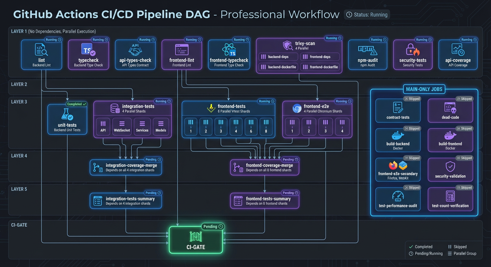

# Deployment Strategy: Progressive Delivery with Health Checks and Automated Rollback

This document describes the production deployment strategy for the Home Security Intelligence system, including health checks, progressive delivery options, and automated rollback mechanisms.

## Table of Contents

- [Overview](#overview)
- [Deployment Pipeline](#deployment-pipeline)
- [Health Check Strategy](#health-check-strategy)
- [Progressive Deployment Options](#progressive-deployment-options)
- [Automated Rollback](#automated-rollback)
- [Deployment Validation](#deployment-validation)
- [Post-Deployment Monitoring](#post-deployment-monitoring)
- [Troubleshooting](#troubleshooting)

## Overview

### Deployment Topology


_Comparison of development (Docker Desktop, local volumes) vs production (Podman, GPU passthrough, NFS storage) deployment topologies._

### Strategy Overview

The deployment strategy implements several layers of protection to ensure zero-downtime deployments with automatic rollback on failures:

1. **Container Image Building** - Multi-arch builds for all platforms
2. **Supply Chain Security** - SBOM and cryptographic signing
3. **Health Check Validation** - Comprehensive endpoint verification
4. **Progressive Rollout** - Canary and blue-green deployment options
5. **Automated Rollback** - Automatic revert on health check failure
6. **Post-Deployment Monitoring** - Real-time health and circuit breaker tracking

## Deployment Pipeline



_GitHub Actions workflow DAG showing job dependencies, parallelization, and deployment stages._

### Stage 1: Build (Native Architecture)

Multi-architecture Docker builds ensure compatibility with different platforms:

```
┌─────────────────────────────────────────────┐
│ Native Architecture Builds                   │
├─────────────────────────────────────────────┤
│ • Linux/amd64 on ubuntu-latest              │
│ • Linux/arm64 on ubuntu-24.04-arm           │
│ • Parallel builds for both architectures    │
│ • BuildKit layer caching for performance    │
└─────────────────────────────────────────────┘
         │                      │
         v                      v
   ┌──────────────┐     ┌──────────────┐
   │ backend:amd64│     │backend:arm64 │
   │frontend:amd64│     │frontend:arm64│
   └──────────────┘     └──────────────┘
```

**Duration**: 10-15 minutes (with caching)

**Key Files**:

- `.github/workflows/deploy.yml` - Main deployment workflow
- `backend/Dockerfile` - Multi-stage production build
- `frontend/Dockerfile` - Optimized frontend build

### Stage 2: Manifest Merge

Architecture-specific images are combined into a single multi-arch manifest:

```
docker buildx imagetools create \
  -t ghcr.io/owner/repo/backend:latest \
  -t ghcr.io/owner/repo/backend:<sha> \
  ghcr.io/owner/repo/backend@sha256:amd64 \
  ghcr.io/owner/repo/backend@sha256:arm64
```

This allows automatic architecture selection at pull time.

**Duration**: 30 seconds
**Output**: Multi-arch manifest tags (latest, commit SHA)

### Stage 3: Supply Chain Security

Generate and sign SBOM (Software Bill of Materials) and SLSA provenance attestations:

```
┌─────────────────────────────────────────────┐
│ Security Attestations                       │
├─────────────────────────────────────────────┤
│ • SBOM Generation (Syft/Anchore)           │
│ • Cosign image signing                      │
│ • SLSA Level 3 provenance                   │
│ • Artifact attachment to registry           │
└─────────────────────────────────────────────┘
```

**Verification**:

```bash
# Verify image signature
cosign verify ghcr.io/owner/repo/backend:latest \
  --certificate-identity-regexp https://github.com/owner/repo

# Retrieve SBOM
cosign download sbom ghcr.io/owner/repo/backend:latest
```

### Stage 4: Smoke Test & Health Validation

Comprehensive deployment validation in isolated CI environment:

1. **Pull Images**

   - Backend and frontend images from GHCR
   - Verify images are pullable and not corrupted

2. **Start Services**

   - PostgreSQL, Redis, Backend, Frontend
   - Docker Compose orchestration with health checks

3. **Wait for Health**

   - Backend `/api/system/health/ready` - Max 120s
   - Frontend HTTP 200 - Max 60s
   - All services must pass health checks

4. **Run Smoke Tests**

   - API endpoint validation
   - Frontend HTML response
   - WebSocket connectivity (optional)
   - API endpoint responses

5. **Full Health Check**
   - Test `/api/system/health/full` endpoint
   - Verify critical service status (postgres, redis)
   - Validate circuit breaker states
   - Check AI service health (if configured)

**Exit Criteria**:

- All health checks return 200 OK
- Database connectivity confirmed
- Cache connectivity confirmed
- No critical services in failed state
- Circuit breakers all closed

**Duration**: 5-10 minutes
**Timeout**: 15 minutes total

## Health Check Strategy

### Health Check Endpoints

#### 1. Liveness Probe

```
GET /health
```

Simple probe to verify process is running.

**Response**:

```json
{
  "status": "alive"
}
```

**HTTP Status**: Always 200 (only fails if process is down)

#### 2. Readiness Probe

```
GET /api/system/health/ready
```

Checks if system is ready to accept traffic (infrastructure only).

**Response**:

```json
{
  "ready": true,
  "checks": {
    "database": {
      "status": "healthy",
      "latency_ms": 2.5
    },
    "redis": {
      "status": "healthy",
      "latency_ms": 1.2
    }
  }
}
```

**HTTP Status**:

- `200 OK` - System is ready
- `503 Service Unavailable` - System is not ready

**Use Cases**:

- Load balancer traffic routing
- Kubernetes readiness probes
- Deployment startup ordering

#### 3. Full Health Check

```
GET /api/system/health/full
```

Comprehensive health check including all services and circuit breakers.

**Response**:

```json
{
  "status": "healthy",
  "ready": true,
  "postgres": {
    "status": "healthy",
    "message": "Database operational"
  },
  "redis": {
    "status": "healthy",
    "message": "Redis connected"
  },
  "ai_services": [
    {
      "name": "rtdetr",
      "status": "healthy",
      "response_time_ms": 45.2,
      "circuit_state": "closed"
    }
  ],
  "circuit_breakers": {
    "total": 5,
    "open": 0,
    "half_open": 0,
    "closed": 5
  },
  "workers": [
    {
      "name": "file_watcher",
      "running": true,
      "critical": true
    }
  ]
}
```

**HTTP Status**:

- `200 OK` - Healthy or degraded (non-critical services failing)
- `503 Service Unavailable` - Critical services failing

### Health Check Configuration

In `docker-compose.prod.yml`, health checks are defined per service:

```yaml
backend:
  healthcheck:
    test:
      [
        'CMD',
        'python',
        '-c',
        "import httpx; r = httpx.get('http://localhost:8000/api/system/health/ready'); exit(0 if r.status_code == 200 else 1)",
      ]
    interval: 10s
    timeout: 5s
    retries: 3
    start_period: 30s
```

**Parameters**:

- `interval: 10s` - Check every 10 seconds
- `timeout: 5s` - Fail if no response within 5 seconds
- `retries: 3` - Require 3 consecutive failures to mark unhealthy
- `start_period: 30s` - Grace period for startup before health checks

### Critical Services

**Must be healthy for deployment**:

- PostgreSQL (database)
- Redis (cache/queue)
- Backend API (application)
- Frontend (UI)

**Non-Critical Services** (optional):

- RT-DETR (object detection)
- Nemotron (LLM analysis)
- Florence-2 (vision model)
- CLIP (embeddings)
- Enrichment (vehicle/pet classification)

System operates in degraded mode if non-critical services are unavailable.

## Progressive Deployment Options

### Option 1: Rolling Update (Current Implementation)

**How it works**:

1. New images pushed to registry
2. All containers updated simultaneously
3. Health checks verify success
4. Automatic rollback on failure

**Advantages**:

- Simple implementation
- Fast deployment
- Automatic rollback

**Disadvantages**:

- Brief period where some services unavailable
- Not suitable for high-traffic deployments
- All-or-nothing rollback

**Implementation**:

```bash
# Redeploy latest images
podman-compose -f docker-compose.prod.yml down
podman-compose -f docker-compose.prod.yml pull
podman-compose -f docker-compose.prod.yml up -d
```

### Option 2: Blue-Green Deployment

**How it works**:

1. Deploy new version to "green" environment
2. Run health checks on green
3. Switch load balancer from blue to green
4. Keep blue running for instant rollback

**Advantages**:

- Zero downtime
- Instant rollback
- Atomic switch
- Test in production before traffic

**Disadvantages**:

- Requires 2x resources
- More complex implementation
- Double database migrations

**Implementation** (conceptual):

```yaml
# docker-compose.prod.blue.yml
services:
  backend:
    image: ghcr.io/owner/repo/backend:previous
    # Blue environment with previous version

  frontend:
    image: ghcr.io/owner/repo/frontend:previous
    # UI for blue environment
```

```yaml
# docker-compose.prod.green.yml
services:
  backend:
    image: ghcr.io/owner/repo/backend:latest
    # Green environment with new version

  frontend:
    image: ghcr.io/owner/repo/frontend:latest
    # UI for green environment
```

```bash
# Deploy green
podman-compose -f docker-compose.prod.green.yml up -d

# Verify green health
curl http://localhost:8001/api/system/health/ready

# Switch traffic (via load balancer / nginx / etc)
# Example with nginx: update upstream to point to green

# Keep blue running for quick rollback
# To rollback: switch traffic back to blue

# Destroy blue after green stable (e.g., 1 hour)
podman-compose -f docker-compose.prod.blue.yml down
```

**Requirements**:

- Separate database instances or with proper schema migration
- Load balancer to switch traffic
- Monitoring to detect when to switch
- Network setup to route traffic appropriately

### Option 3: Canary Deployment

**How it works**:

1. Deploy new version to small subset (e.g., 10%)
2. Monitor error rates and latency
3. Gradually increase percentage (10% -> 25% -> 50% -> 100%)
4. Automatic rollback if thresholds exceeded

**Advantages**:

- Gradual rollout reduces risk
- Early problem detection
- User impact minimized
- Smooth transition

**Disadvantages**:

- Requires load balancer with traffic splitting
- Longer deployment time (15-30 minutes typical)
- More complex monitoring
- Potential for traffic imbalance

**Implementation** (with Kubernetes):

```yaml
apiVersion: networking.istio.io/v1beta1
kind: VirtualService
metadata:
  name: backend
spec:
  hosts:
    - backend
  http:
    - match:
        - uri:
          prefix: '/'
      route:
        - destination:
            host: backend
            subset: v1
          weight: 90
        - destination:
            host: backend
            subset: v2
          weight: 10 # 10% canary traffic
```

**GitHub Actions Implementation**:

```yaml
deploy-canary:
  runs-on: ubuntu-latest
  steps:
    - name: Deploy canary (10% traffic)
      run: |
        # Update deployment with new image
        # Set traffic weight to 10%

    - name: Monitor metrics for 5 minutes
      run: |
        # Check error rate < 1%
        # Check latency increase < 50ms
        # Check circuit breakers closed

    - name: Scale to 25% if metrics good
      run: |
        # Increase traffic weight to 25%

    - name: Continue rolling out or rollback
      run: |
        # If metrics good: scale to 50% -> 100%
        # If metrics bad: automatic rollback
```

**Monitoring Thresholds**:

- Error rate: < 1.0% (target 0.1%)
- Latency P99: < 100ms increase
- Circuit breaker: all closed
- Database connection: < 80% utilization
- Cache hit rate: > 90%

### Recommended: Progressive Deployment for Production

For production deployments, implement canary deployment with automatic escalation:

```yaml
# Example escalation schedule
canary:
  - name: 'Initial canary'
    traffic: 10
    duration: 5m
    thresholds:
      error_rate: 0.01 # 1%
      latency_increase: 50 # ms

  - name: 'Scale to 25%'
    traffic: 25
    duration: 5m
    thresholds:
      error_rate: 0.01
      latency_increase: 50

  - name: 'Scale to 50%'
    traffic: 50
    duration: 10m
    thresholds:
      error_rate: 0.005 # 0.5%
      latency_increase: 30

  - name: 'Scale to 100%'
    traffic: 100
    duration: permanent

rollback_threshold:
  error_rate: 0.02 # 2% triggers rollback
  latency_increase: 100 # ms
  circuit_breaker_open: true # Any open circuit triggers rollback
```

## Automated Rollback

The `.github/workflows/rollback.yml` workflow implements automatic rollback on deployment failure:

### Rollback Triggers

Rollback is triggered when:

1. **Smoke test job fails** - Health checks don't pass
2. **Critical service unhealthy** - Database or Redis not responding
3. **Circuit breaker open** - Service unavailable indicator
4. **Deployment timeout** - Services fail to become ready

### Rollback Mechanism

```
Failed Deployment Detection
            │
            v
    Evaluate Rollback Need
    (check: should-rollback == true)
            │
            v
    Identify Previous Stable
    (git rev-parse HEAD~1)
            │
            v
    Initiate Rollback
    (update image tags to previous SHAs)
            │
            v
    Verify Rollback
    (health checks on reverted version)
            │
            v
    Create Issue for Investigation
    (document failure and actions taken)
```

### Rollback Steps

1. **Evaluate Failure**

   - Check which job failed
   - Determine previous stable commit
   - Set `should-rollback=true` if conditions met

2. **Revert Images**

   - Update image tags to previous version
   - Verify images are available in registry
   - Pull and start reverted containers

3. **Verify Rollback**

   - Run health checks on reverted version
   - Confirm critical services healthy
   - Verify API responding correctly

4. **Document Incident**

   - Create GitHub issue with:
     - Failed commit hash
     - Failure reason
     - Rollback target hash
     - Investigation steps
   - Add labels: `deployment`, `incident`, `rollback`

5. **Alert and Notify**
   - Comment on failed PR
   - Send notification (email, Slack, etc.)
   - Create incident in monitoring system

### Rollback Configuration

In `.github/workflows/rollback.yml`:

```yaml
evaluate-rollback:
  outputs:
    should-rollback: ${{ steps.check.outputs.should-rollback }}
    failed-job: ${{ steps.check.outputs.failed-job }}
    previous-sha: ${{ steps.check.outputs.previous-sha }}

rollback:
  needs: evaluate-rollback
  if: needs.evaluate-rollback.outputs.should-rollback == 'true'
```

### Manual Rollback

If automatic rollback doesn't trigger, manual rollback is available:

```bash
# Find previous commit
git log --oneline -10

# Checkout previous version
git checkout <previous-commit-sha>

# Redeploy to previous version
podman-compose -f docker-compose.prod.yml down
podman pull ghcr.io/owner/repo/backend:<previous-tag>
podman pull ghcr.io/owner/repo/frontend:<previous-tag>
podman-compose -f docker-compose.prod.yml up -d

# Verify health
curl http://localhost:8000/api/system/health/ready
```

## Deployment Validation

### Pre-Deployment Checklist

Before deploying to production:

- [ ] All CI tests passing (unit, integration, E2E)
- [ ] Code review approved
- [ ] Security scan passed (no critical vulnerabilities)
- [ ] Database migrations tested and safe
- [ ] Configuration reviewed (all secrets in place)
- [ ] Rollback plan understood
- [ ] Team notified of deployment
- [ ] Monitoring dashboard open and ready

### Smoke Test Checklist

During smoke test job, verified:

- [ ] Images pulled successfully
- [ ] Containers started without errors
- [ ] Backend health check passes
- [ ] Frontend health check passes
- [ ] Database connectivity confirmed
- [ ] Redis connectivity confirmed
- [ ] API endpoints responding
- [ ] WebSocket connections working
- [ ] Smoke tests completed successfully
- [ ] Full health check shows all services healthy

### Post-Deployment Checklist

After successful deployment:

- [ ] Dashboard accessible at expected URL
- [ ] Health endpoint returns healthy status
- [ ] No error spikes in monitoring
- [ ] Circuit breakers all closed
- [ ] Database queries performing normally
- [ ] Cache hit rates normal
- [ ] API response times within SLA
- [ ] User-facing features working correctly

## Post-Deployment Monitoring

### Key Metrics to Monitor

**Service Health**:

```
GET /api/system/health/full
```

- All critical services operational
- Circuit breaker states
- Worker process status
- Service availability

**System Metrics**:

- Request rate
- Error rate (target: < 0.1%)
- Response latency P99 (target: < 100ms)
- Database connection pool utilization
- Cache hit rate (target: > 90%)
- GPU memory usage (if applicable)

**Application Metrics**:

- Detection queue depth
- Analysis queue depth
- Event creation rate
- File watcher status
- Cleanup service status

### Monitoring Thresholds

```yaml
alerts:
  error_rate:
    warning: 0.5%
    critical: 2.0%

  latency_p99:
    warning: 150ms # 50% above baseline
    critical: 200ms # 100% above baseline

  circuit_breaker:
    warning: 1 open
    critical: 2+ open

  database:
    warning: 80% connections used
    critical: 95% connections used

  cache:
    warning: < 85% hit rate
    critical: < 75% hit rate
```

### Metrics Collection

Health status is exposed as Prometheus metrics:

```
circuit_breaker_state{service="rtdetr"} 0
health_check_latency_seconds{service="postgres"} 0.002
service_available{service="rtdetr"} 1
```

Integrate with monitoring:

- Prometheus for metrics collection
- Grafana for visualization
- AlertManager for alerting
- PagerDuty/Slack for notifications

### Dashboard Setup

Configure dashboard to show:

1. Service health status (colors)
2. Circuit breaker states
3. Health check latency trends
4. Error rate time series
5. Recovery event timeline
6. Deployment history

## Troubleshooting

### Deployment Failure Scenarios

#### Scenario 1: Health Check Timeout

**Symptoms**:

```
Backend health check timed out after 120s
```

**Causes**:

- Database not starting
- Redis connection issues
- Backend startup issues
- Resource constraints

**Resolution**:

```bash
# Check container logs
podman logs backend --tail 100

# Check database status
podman exec postgres pg_isready -U security

# Check redis status
podman exec redis redis-cli ping

# Increase startup timeout (if needed)
# Modify health check in docker-compose:
# start_period: 60s -> start_period: 120s
```

#### Scenario 2: Circuit Breaker Open

**Symptoms**:

```
Circuit breaker for rtdetr is open
AI services returning errors
```

**Causes**:

- AI service crashed
- GPU out of memory
- Network connectivity issues
- Model loading failed

**Resolution**:

```bash
# Check AI service logs
podman logs ai-detector --tail 50

# Check GPU status
nvidia-smi

# Restart AI service
podman restart ai-detector

# Monitor circuit breaker recovery
curl http://localhost:8000/api/system/health/full | jq .circuit_breakers

# If not recovering, check model files
ls -lh /export/ai_models/
```

#### Scenario 3: Database Migration Failure

**Symptoms**:

```
Backend fails to start
Database migration error in logs
```

**Causes**:

- Schema migration failed
- Database lock timeout
- Data compatibility issues

**Resolution**:

```bash
# Check migration status
podman exec backend alembic current

# Review migration files
ls backend/migrations/versions/

# Check database for locks
podman exec postgres psql -U security -d security -c "SELECT * FROM pg_locks;"

# Manual rollback (if migration is reversible)
podman exec backend alembic downgrade -1

# Or restore from backup
# See DEPLOYMENT_RUNBOOK.md for backup restore procedures
```

#### Scenario 4: Automatic Rollback Triggered

**Symptoms**:

```
GitHub issue created: "Automated Rollback: Deployment failed"
Images reverted to previous version
```

**Investigation**:

1. Check the created GitHub issue for details
2. Review failed workflow logs for error messages
3. Identify what changed in the failed commit
4. Review test coverage for changed code

**Next Steps**:

```bash
# Fix the issue locally
git log --oneline -5
git checkout <failed-commit>

# Debug locally
./scripts/dev.sh

# Test thoroughly
npm test  # Frontend
uv run pytest  # Backend

# Commit fix
git add .
git commit -m "fix: resolve deployment issue"
git push origin main

# CI will automatically retry
```

### Health Check Debugging

**Test health endpoint locally**:

```bash
# Readiness check
curl -v http://localhost:8000/api/system/health/ready

# Full health check
curl -v http://localhost:8000/api/system/health/full | jq

# Check specific service
curl -v http://localhost:8090/health  # RT-DETR
```

**Enable health check debug logging**:

```bash
# In backend environment
DEBUG=true
LOG_LEVEL=DEBUG

podman-compose -f docker-compose.prod.yml down
podman-compose -f docker-compose.prod.yml up -d

# Monitor logs
podman logs -f backend | grep -i health
```

## References

- **Deployment Runbook**: See [`docs/DEPLOYMENT_RUNBOOK.md`](DEPLOYMENT_RUNBOOK.md)
- **Health Check Strategy**: See [`docs/HEALTH_CHECK_STRATEGY.md`](HEALTH_CHECK_STRATEGY.md)
- **Deployment Troubleshooting**: See [`docs/DEPLOYMENT_TROUBLESHOOTING.md`](DEPLOYMENT_TROUBLESHOOTING.md)
- **Deploy Workflow**: See [`.github/workflows/deploy.yml`](.github/workflows/deploy.yml)
- **Rollback Workflow**: See [`.github/workflows/rollback.yml`](.github/workflows/rollback.yml)

## Support

For deployment issues or questions:

1. Check this documentation and linked guides
2. Review troubleshooting section
3. Check GitHub Issues for similar problems
4. Create new issue with deployment logs and error messages
5. Contact operations team for urgent issues
