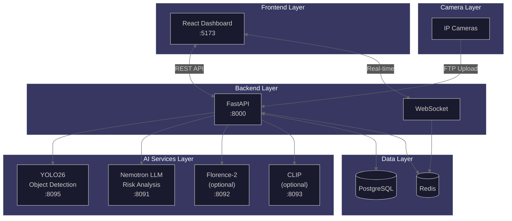

# Documentation

> Home Security Intelligence documentation hub.

---

## System Architecture



_High-level architecture showing cameras, frontend, backend, AI services, and data stores. See [architecture/overview.md](architecture/overview.md) for detailed diagrams._

---

## Start Here

| Role           | Hub                                 | Description                               |
| -------------- | ----------------------------------- | ----------------------------------------- |
| **New Users**  | [Getting Started](getting-started/) | Prerequisites, installation, first run    |
| **End Users**  | [User Guide](user/)                 | Dashboard, alerts, features               |
| **Operators**  | [Operator Guide](operator/)         | Deployment, monitoring, administration    |
| **Developers** | [Developer Guide](developer/)       | Architecture, API, patterns, contributing |

---

## Quick Reference

| Resource              | Location                                                                    |
| --------------------- | --------------------------------------------------------------------------- |
| Environment Variables | [Reference](reference/)                                                     |
| Troubleshooting       | [Troubleshooting](reference/troubleshooting/)                               |
| API Documentation     | [Developer API](developer/api/) or [Swagger UI](http://localhost:8000/docs) |
| Component Library     | [Component Library](components/)                                            |
| Post-MVP Roadmap      | [ROADMAP.md](ROADMAP.md)                                                    |

---

## Documentation Structure

```
docs/
├── README.md           # This file - navigation hub
├── AGENTS.md           # AI assistant navigation
├── ROADMAP.md          # Post-MVP features
│
├── getting-started/    # Installation and setup
├── developer/          # Architecture, API, patterns, contributing
├── operator/           # Deployment, monitoring, admin
├── user/               # End-user dashboard guides
├── reference/          # Env vars, glossary, troubleshooting
├── components/         # React component library documentation
│
├── architecture/       # System design documents
├── benchmarks/         # Performance benchmarks
├── decisions/          # Architectural Decision Records
└── images/             # Diagrams and screenshots
```

---

## AI Assistant Navigation

Every directory contains an `AGENTS.md` file for AI assistant navigation. Start there when exploring a new area.

---

## Technical Documentation

| Category                | Location                                                             | Description                                         |
| ----------------------- | -------------------------------------------------------------------- | --------------------------------------------------- |
| **System Architecture** | [architecture/overview.md](architecture/overview.md)                 | High-level system design and components             |
| **AI Pipeline**         | [architecture/ai-pipeline.md](architecture/ai-pipeline.md)           | Detection and analysis pipeline architecture        |
| **Data Model**          | [architecture/data-model.md](architecture/data-model.md)             | Database schema and relationships                   |
| **Real-time System**    | [architecture/real-time.md](architecture/real-time.md)               | WebSocket and event streaming                       |
| **Security**            | [architecture/security/README.md](architecture/security/README.md)   | Input validation, data protection, network security |
| **Dataflows**           | [architecture/dataflows/README.md](architecture/dataflows/README.md) | End-to-end data traces, pipeline timing             |
| **Decision Records**    | [decisions/README.md](decisions/README.md)                           | Architectural Decision Records (ADRs)               |

### AI Pipeline Quality Assurance

Synthetic data generation and prompt evaluation using NVIDIA NeMo Data Designer improves Nemotron prompt quality through systematic testing.

| Resource                      | Location                                                                             | Description                        |
| ----------------------------- | ------------------------------------------------------------------------------------ | ---------------------------------- |
| **NeMo Data Designer**        | [development/nemo-data-designer.md](development/nemo-data-designer.md)               | Setup, configuration, and workflow |
| **Prompt Evaluation Results** | [development/prompt-evaluation-results.md](development/prompt-evaluation-results.md) | Pre/post metrics tracking          |

**Key benefits:**

- **Ground truth validation** - Risk scores evaluated against expected ranges for each scenario type
- **Prompt template ranking** - Quantitative comparison across 5 templates
- **Context utilization testing** - Verify enrichment data appears in reasoning
- **Edge case coverage** - Systematic testing of ambiguous security scenarios

### Development Workflow

| Resource               | Location                                                               | Description                          |
| ---------------------- | ---------------------------------------------------------------------- | ------------------------------------ |
| **Testing Workflow**   | [development/testing-workflow.md](development/testing-workflow.md)     | TDD cycle, test patterns             |
| **Testing Guide**      | [development/testing.md](development/testing.md)                       | Test infrastructure and fixtures     |
| **Git Workflow**       | [development/git-workflow.md](development/git-workflow.md)             | Git safety, pre-commit rules         |
| **Code Quality**       | [development/code-quality.md](development/code-quality.md)             | Linting, formatting, static analysis |
| **Contributing**       | [development/contributing.md](development/contributing.md)             | PR process and code standards        |
| **Linear Integration** | [development/linear-integration.md](development/linear-integration.md) | Issue tracking MCP tools             |

---

## Project Planning

| Resource                   | Location                                                     | Description                       |
| -------------------------- | ------------------------------------------------------------ | --------------------------------- |
| **Implementation Plans**   | [plans/README.md](plans/README.md)                           | Design and implementation plans   |
| **Performance Benchmarks** | [benchmarks/README.md](benchmarks/README.md)                 | Model and system benchmarks       |
| **Load Profiles**          | [performance/LOAD_PROFILES.md](performance/LOAD_PROFILES.md) | Performance load testing profiles |

---

## Quick Links

- **Interactive API**: http://localhost:8000/docs (Swagger UI)
- **Issue Tracking**: [Linear](https://linear.app/nemotron-v3-home-security/team/NEM/active)
- **Project README**: [../README.md](../README.md)
