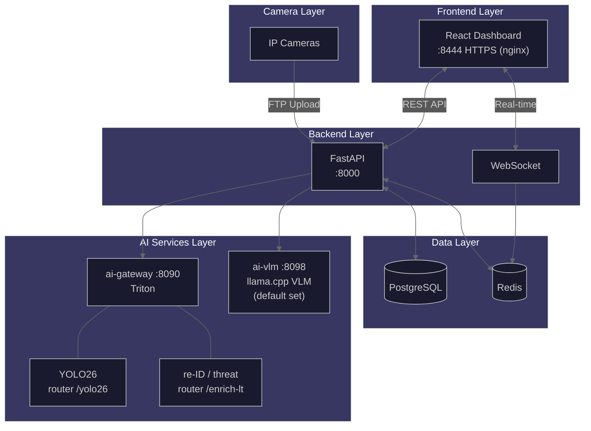

# Documentation

> Home Security Intelligence documentation hub.

---

## System Architecture


```mermaid
%%{init: {
  'theme': 'dark',
  'themeVariables': {
    'primaryColor': '#3B82F6',
    'primaryTextColor': '#FFFFFF',
    'primaryBorderColor': '#60A5FA',
    'secondaryColor': '#A855F7',
    'tertiaryColor': '#009688',
    'background': '#121212',
    'mainBkg': '#1a1a2e',
    'lineColor': '#666666'
  }
}}%%
flowchart TB
    subgraph Cameras["Camera Layer"]
        CAM[IP Cameras]
    end

    subgraph Frontend["Frontend Layer"]
        UI["React Dashboard<br/>:8444 HTTPS (nginx)"]
    end

    subgraph Backend["Backend Layer"]
        API["FastAPI<br/>:8000"]
        WS["WebSocket"]
    end

    subgraph AI["AI Services Layer"]
        GW["ai-gateway :8090<br/>Triton"]
        YOLO["YOLO26<br/>router /yolo26"]
        LT["re-ID / threat<br/>router /enrich-lt"]
        VLM["ai-vlm :8098<br/>llama.cpp VLM<br/>(default set)"]
    end

    subgraph Data["Data Layer"]
        DB[(PostgreSQL)]
        REDIS[(Redis)]
    end

    CAM -->|FTP Upload| API
    UI <-->|REST API| API
    UI <-->|Real-time| WS
    API --> GW
    API --> VLM
    GW --- YOLO
    GW --- LT
    API <--> DB
    API <--> REDIS
    WS --> REDIS
```

_High-level architecture showing cameras, frontend, backend, AI services, and data stores. See [architecture/overview.md](architecture/overview.md) for detailed diagrams._

---

## Start Here

| Role           | Hub                                 | Description                               |
| -------------- | ----------------------------------- | ----------------------------------------- |
| **New Users**  | [Getting Started](getting-started/) | Prerequisites, installation, first run    |
| **End Users**  | [User Guide](user/)                 | Dashboard, alerts, features               |
| **Operators**  | [Operator Guide](operator/)         | Deployment, monitoring, administration    |
| **Developers** | [Developer Guide](developer/)       | Architecture, API, patterns, contributing |

---

## Quick Reference

| Resource              | Location                                                                    |
| --------------------- | --------------------------------------------------------------------------- |
| Environment Variables | [Reference](reference/)                                                     |
| Troubleshooting       | [Troubleshooting](reference/troubleshooting/)                               |
| API Documentation     | [Developer API](developer/api/) or [Swagger UI](http://localhost:8000/docs) |
| Component Library     | [Component Library](components/)                                            |
| Post-MVP Roadmap      | [ROADMAP.md](ROADMAP.md)                                                    |

---

## Documentation Structure

```
docs/
├── README.md           # This file - human navigation hub
├── AGENTS.md           # AI assistant navigation (full directory index)
├── index.md            # MkDocs site home page
├── ROADMAP.md          # Post-MVP features
│
├── getting-started/    # Installation and setup
├── developer/          # Architecture, API, patterns, contributing,
│                       #   testing, git workflow, code quality
├── operator/           # Deployment, monitoring, admin
├── user/               # End-user dashboard guides
├── guides/             # Feature guides (video analytics, zones, faces)
├── reference/          # Env vars, glossary, troubleshooting
├── components/         # React component library documentation
├── ui/                 # Page-by-page UI documentation
│
├── architecture/       # System design documents
├── benchmarks/         # Performance benchmarks
├── decisions/          # Architectural Decision Records
├── performance/        # Load profiles and analyses
├── plans/              # Design and implementation plans
├── operations/         # Operational runbooks
├── deployment/         # Container-orchestration docs
├── archive/            # Archived point-in-time reports and NEM investigations
└── images/             # Diagrams and screenshots
```

For the complete directory list (including research, discoveries, templates,
superpowers and support directories) see [AGENTS.md](AGENTS.md).

---

## AI Assistant Navigation

Every directory contains an `AGENTS.md` file for AI assistant navigation. Start there when exploring a new area.

---

## Technical Documentation

| Category                | Location                                                                               | Description                                         |
| ----------------------- | -------------------------------------------------------------------------------------- | --------------------------------------------------- |
| **System Architecture** | [architecture/overview.md](architecture/overview.md)                                   | High-level system design and components             |
| **AI Pipeline**         | [architecture/ai-pipeline-current-state.md](architecture/ai-pipeline-current-state.md) | The shipped detection and analysis path             |
| **Data Model**          | [architecture/data-model.md](architecture/data-model.md)                               | Database schema and relationships                   |
| **Real-time System**    | [architecture/real-time.md](architecture/real-time.md)                                 | WebSocket and event streaming                       |
| **Security**            | [architecture/security/README.md](architecture/security/README.md)                     | Input validation, data protection, network security |
| **Dataflows**           | [architecture/dataflows/README.md](architecture/dataflows/README.md)                   | End-to-end data traces, pipeline timing             |
| **Decision Records**    | [decisions/README.md](decisions/README.md)                                             | Architectural Decision Records (ADRs)               |

### AI Pipeline Quality Assurance

The Synthbench harness replays a generated corpus against a served VLM and grades the verdict
against ground truth.

| Resource       | Location                                     | Description                             |
| -------------- | -------------------------------------------- | --------------------------------------- |
| **Synthbench** | [synthbench/AGENTS.md](synthbench/AGENTS.md) | export / replay / score command surface |

**Key benefits:**

- **Ground truth validation** - Risk scores evaluated against the declared risk band of each scenario
- **S-metric scoring** - S2 (benign flagged too high), S3 (incident floor), refusals and
  `uncertain` rate, reported with n and a Wilson interval
- **Edge case coverage** - Systematic testing of ambiguous security scenarios

### Development Workflow

| Resource               | Location                                                           | Description                          |
| ---------------------- | ------------------------------------------------------------------ | ------------------------------------ |
| **Testing Workflow**   | [developer/testing-workflow.md](developer/testing-workflow.md)     | TDD cycle, test patterns             |
| **Testing Guide**      | [developer/testing.md](developer/testing.md)                       | Test infrastructure and fixtures     |
| **Git Workflow**       | [developer/git-workflow.md](developer/git-workflow.md)             | Git safety, pre-commit rules         |
| **Code Quality**       | [developer/code-quality.md](developer/code-quality.md)             | Linting, formatting, static analysis |
| **Contributing**       | [developer/contributing.md](developer/contributing.md)             | PR process and code standards        |
| **Linear Integration** | [developer/linear-integration.md](developer/linear-integration.md) | Issue tracking MCP tools             |

---

## Project Planning

| Resource                   | Location                                                     | Description                       |
| -------------------------- | ------------------------------------------------------------ | --------------------------------- |
| **Implementation Plans**   | [plans/README.md](plans/README.md)                           | Design and implementation plans   |
| **Performance Benchmarks** | [benchmarks/README.md](benchmarks/README.md)                 | Model and system benchmarks       |
| **Load Profiles**          | [performance/LOAD_PROFILES.md](performance/LOAD_PROFILES.md) | Performance load testing profiles |

---

## Quick Links

- **Interactive API**: http://localhost:8000/docs (Swagger UI)
- **Issue Tracking**: [Linear](https://linear.app/nemotron-v3-home-security/team/NEM/active)
- **Project README**: [../README.md](../README.md)
