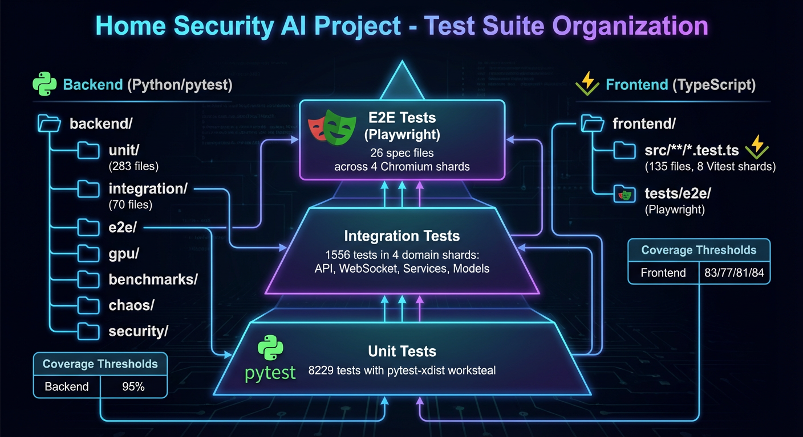
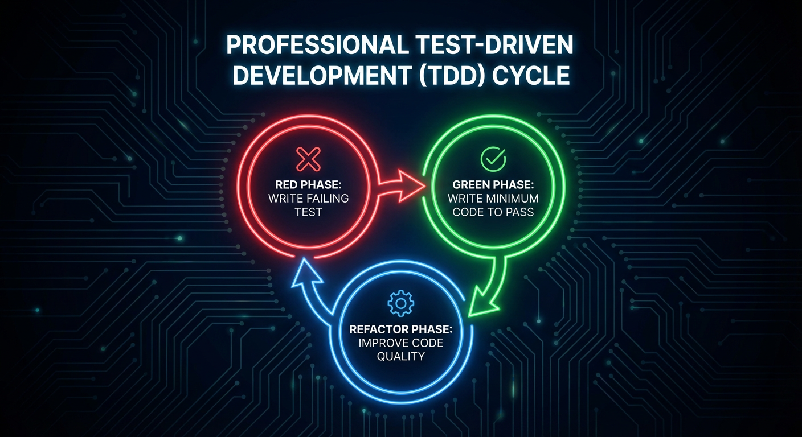
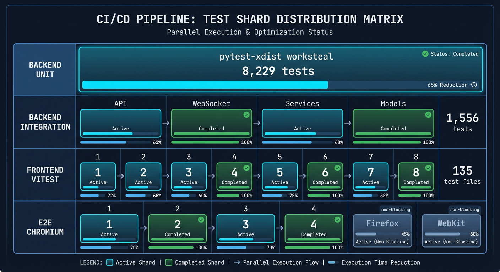

# Testing Guide

**Comprehensive guide to testing patterns, fixtures, and best practices for the Home Security Intelligence project.**

This guide consolidates testing knowledge from across the codebase. For TDD workflow and philosophy, see the [TDD Approach](#tdd-approach) section or the TDD section in `/CLAUDE.md`.

---

## Table of Contents

1. [Quick Reference](#quick-reference)
2. [Test Organization](#test-organization)
3. [Test Categories](#test-categories)
4. [Fixtures Reference](#fixtures-reference)
5. [Common Testing Patterns](#common-testing-patterns)
6. [TDD Approach](#tdd-approach)
7. [Coverage Requirements](#coverage-requirements)
8. [Anti-Patterns to Avoid](#anti-patterns-to-avoid)
9. [Troubleshooting](#troubleshooting)
10. [Performance and CI](#performance-and-ci)

---

## Quick Reference

### Running Tests

```bash
# Backend unit tests (parallel ~60-90s)
uv run pytest backend/tests/unit/ -n auto --dist=worksteal

# Backend integration tests (serial ~60-90s per shard)
uv run pytest backend/tests/integration/ -n0

# Frontend unit/component tests
cd frontend && npm test

# Frontend E2E tests (multi-browser)
cd frontend && npx playwright test

# Full validation (recommended before PRs)
./scripts/validate.sh

# With coverage
uv run pytest backend/tests/ --cov=backend --cov-report=html
cd frontend && npm test -- --coverage
```

### Test Locations

```
backend/tests/
  unit/              # 8,229 unit tests (isolated components)
  integration/       # 1,556 integration tests (multi-component workflows)
  e2e/               # End-to-end pipeline tests
  gpu/               # GPU-specific AI service tests
  benchmarks/        # Performance regression tests
  chaos/             # Chaos engineering tests
  contracts/         # API contract tests
  security/          # Security vulnerability tests

frontend/
  src/**/*.test.tsx  # ~2,000+ unit tests (co-located with source)
  tests/integration/ # WebSocket and cross-component tests
  tests/e2e/specs/   # ~500+ Playwright E2E tests
```

---

## Test Organization



_Test suite organization diagram showing the relationship between unit, integration, and E2E test layers._

### Test Types

| Test Type                | Location                      | Framework                      | Purpose                          |
| ------------------------ | ----------------------------- | ------------------------------ | -------------------------------- |
| **Backend Unit**         | `backend/tests/unit/`         | pytest + Hypothesis            | Component isolation              |
| **Backend Integration**  | `backend/tests/integration/`  | pytest + testcontainers        | Multi-component workflows        |
| **Backend E2E**          | `backend/tests/e2e/`          | pytest                         | Complete pipeline validation     |
| **Frontend Unit**        | `frontend/src/**/*.test.tsx`  | Vitest + React Testing Library | Component/hook isolation         |
| **Frontend Integration** | `frontend/tests/integration/` | Vitest                         | Cross-component, WebSocket tests |
| **Frontend E2E**         | `frontend/tests/e2e/specs/`   | Playwright                     | Full browser workflows           |

### Test Markers (Backend)

```bash
# Run only unit tests
pytest -m unit backend/tests/

# Run only integration tests
pytest -m integration backend/tests/

# Exclude slow tests (faster CI runs)
pytest -m "not slow" backend/tests/

# Run GPU tests only
pytest -m gpu backend/tests/gpu/

# Run everything except GPU and slow tests
pytest -m "not gpu and not slow" backend/tests/
```

### E2E Test Tags (Frontend)

```bash
# Run only smoke tests
npx playwright test --grep @smoke

# Run only critical tests
npx playwright test --grep @critical

# Exclude slow tests for quick feedback
npx playwright test --grep-invert @slow
```

---

## Test Categories

### Backend Unit Tests

**Location:** `backend/tests/unit/` (8,229 tests)

Tests for individual components in isolation with all external dependencies mocked. Includes property-based tests using **Hypothesis** for model invariants.

**Subdirectories:**

- `api/routes/` - API route unit tests
- `api/schemas/` - Pydantic schema validation
- `core/` - Infrastructure (config, database, redis, logging)
- `models/` - ORM model tests
- `services/` - Business logic (AI pipeline, enrichment, etc.)

**Example:**

```python
import pytest
from unittest.mock import AsyncMock
from backend.services.detection import DetectionService

@pytest.mark.asyncio
async def test_process_image_calls_rtdetr_client():
    """RED: Test that service integrates with RT-DETR correctly."""
    mock_rtdetr = AsyncMock()
    mock_rtdetr.detect.return_value = [
        {"label": "person", "confidence": 0.95, "bbox": [100, 200, 300, 400]}
    ]

    service = DetectionService(rtdetr_client=mock_rtdetr)
    result = await service.process_image("/path/to/image.jpg")

    mock_rtdetr.detect.assert_called_once_with("/path/to/image.jpg")
    assert len(result.detections) == 1
    assert result.detections[0].label == "person"
```

### Backend Integration Tests

**Location:** `backend/tests/integration/` (1,556 tests)

Tests for multi-component workflows with real database and mocked Redis. **Now support parallel execution** with pytest-xdist (5x speedup with 8 workers).

**Categories:**

- API endpoints (admin, alerts, cameras, events, etc.)
- WebSocket (connection handling, broadcasting, cleanup)
- Services (batch aggregation, file watcher, health monitor)
- Models and Database (alert models, cascades, operations)
- Error Handling (API errors, database isolation, transactions)

**Example:**

```python
@pytest.mark.asyncio
async def test_create_camera(client, integration_db):
    """Test camera creation via API."""
    response = await client.post(
        "/api/cameras",
        json={"id": "front_door", "name": "Front Door"}
    )
    assert response.status_code == 201
    data = response.json()
    assert data["id"] == "front_door"
    assert data["name"] == "Front Door"
```

### Frontend Unit Tests

**Location:** `frontend/src/**/*.test.tsx` (~2,000+ tests)

Component and hook tests co-located with source files using Vitest + React Testing Library.

**Example:**

```typescript
// frontend/src/components/RiskGauge.test.tsx
import { render, screen } from '@testing-library/react';
import { describe, it, expect } from 'vitest';
import { RiskGauge } from './RiskGauge';

describe('RiskGauge', () => {
  it('displays low risk styling for scores under 30', () => {
    render(<RiskGauge score={25} />);

    const gauge = screen.getByRole('meter');
    expect(gauge).toHaveAttribute('aria-valuenow', '25');
    expect(gauge).toHaveClass('risk-low');
  });

  it('displays high risk styling for scores over 70', () => {
    render(<RiskGauge score={85} />);

    const gauge = screen.getByRole('meter');
    expect(gauge).toHaveClass('risk-high');
    expect(screen.getByText(/high risk/i)).toBeInTheDocument();
  });
});
```

### Frontend E2E Tests

**Location:** `frontend/tests/e2e/specs/` (~500+ tests)

End-to-end browser tests using Playwright with the **Page Object Model** pattern. All backend endpoints are mocked.

**Example:**

```typescript
// frontend/tests/e2e/specs/dashboard.spec.ts
import { test, expect } from '../fixtures';
import { DashboardPage } from '../pages';

test('displays live camera feeds on load', async ({ page }) => {
  const dashboard = new DashboardPage(page);
  await dashboard.goto();

  // Wait for WebSocket connection
  await expect(page.locator('[data-testid="ws-status"]')).toHaveText('Connected');

  // Verify camera grid loads
  const cameraCards = page.locator('[data-testid="camera-card"]');
  await expect(cameraCards).toHaveCount(4);
});
```

---

## Fixtures Reference

### Database Fixtures (Backend)

| Fixture           | Scope    | Description                                        |
| ----------------- | -------- | -------------------------------------------------- |
| `isolated_db`     | function | Function-scoped isolated PostgreSQL database       |
| `test_db`         | function | Callable session factory for unit tests            |
| `integration_env` | function | Sets DATABASE_URL, REDIS_URL, HSI_RUNTIME_ENV_PATH |
| `integration_db`  | function | Initializes PostgreSQL via testcontainers or local |
| `session`         | function | Savepoint-based transaction isolation              |
| `db_session`      | function | Direct AsyncSession access                         |

**Example Usage:**

```python
@pytest.mark.asyncio
async def test_something(isolated_db, session):
    """Test with isolated database and transaction rollback."""
    camera = Camera(id="test_cam", name="Test")
    session.add(camera)
    await session.flush()
    # Test assertions...
    # Data is automatically rolled back after test
```

### Redis Fixtures (Backend)

| Fixture      | Scope    | Description                                             |
| ------------ | -------- | ------------------------------------------------------- |
| `mock_redis` | function | AsyncMock Redis client with pre-configured health_check |
| `real_redis` | function | Real Redis client via testcontainers (flushes DB 15)    |

### HTTP Fixtures (Backend)

| Fixture  | Scope    | Description                                             |
| -------- | -------- | ------------------------------------------------------- |
| `client` | function | httpx AsyncClient with ASGITransport (no server needed) |

### Factory Fixtures (Backend)

| Fixture             | Scope    | Description                                       |
| ------------------- | -------- | ------------------------------------------------- |
| `camera_factory`    | function | CameraFactory for creating Camera instances       |
| `detection_factory` | function | DetectionFactory for creating Detection instances |
| `event_factory`     | function | EventFactory for creating Event instances         |
| `zone_factory`      | function | ZoneFactory for creating Zone instances           |

**Example Usage:**

```python
def test_something(camera_factory, event_factory):
    """Test using factory fixtures from conftest.py."""
    camera = camera_factory(id="test_cam")
    event = event_factory(camera_id=camera.id, high_risk=True)
    # ... test assertions
```

### E2E Fixtures (Frontend)

**Mock Configurations:**

| Configuration         | Purpose                            |
| --------------------- | ---------------------------------- |
| `defaultMockConfig`   | Normal operation with healthy data |
| `emptyMockConfig`     | No data scenarios (empty lists)    |
| `errorMockConfig`     | API failure scenarios (500 errors) |
| `highAlertMockConfig` | High-risk state with many alerts   |

**Example Usage:**

```typescript
import { test, expect } from '../fixtures';
import { errorMockConfig } from '../fixtures';

// Auto-mocked with default config
test('auto-mocked test', async ({ page }) => {
  await page.goto('/');
  // API mocks automatically set up
});

// Custom configuration
test.use({ mockConfig: errorMockConfig });
test('error state test', async ({ page }) => {
  await page.goto('/');
  // Will use error mock config
});
```

---

## Common Testing Patterns

### Async Testing (Backend)

Use utilities from `backend/tests/utils/async_helpers.py`:

**Mock Async Context Managers:**

```python
from backend.tests.utils import AsyncClientMock, create_mock_db_context

# For HTTP clients
mock = AsyncClientMock(
    get_responses={"/health": {"status": "healthy"}},
    post_responses={"/detect": {"detections": []}},
)
async with mock.client() as client:
    response = await client.get("/health")

# For database sessions
mock_session = create_async_session_mock(execute_results=[...])
mock_context = create_mock_db_context(mock_session)
```

**Timeout Protection:**

```python
from backend.tests.utils import async_timeout, with_timeout

# Context manager style
async with async_timeout(5.0, operation="health check"):
    await client.check_health()

# Function wrapper style
result = await with_timeout(
    client.get_data(),
    timeout=5.0,
    operation="fetching data",
)
```

**Concurrent Testing:**

```python
from backend.tests.utils import run_concurrent_tasks, simulate_concurrent_requests

# Run multiple coroutines concurrently
result = await run_concurrent_tasks(
    client.get("/endpoint1"),
    client.get("/endpoint2"),
    client.get("/endpoint3"),
)
assert result.all_succeeded
assert len(result.results) == 3

# Simulate load testing
result = await simulate_concurrent_requests(
    lambda: client.get("/api/health"),
    count=10,
    delay_between=0.01,
)
```

### Property-Based Testing (Backend)

Use Hypothesis strategies from `backend/tests/utils/strategies.py`:

```python
from hypothesis import given
from backend.tests.utils import detection_dict_strategy, risk_scores

@given(detection=detection_dict_strategy())
def test_detection_properties(detection):
    """Test detection invariants hold for any valid detection."""
    assert 0 <= detection["confidence"] <= 1
    assert detection["camera_id"]
    assert detection["object_type"]

@given(score=risk_scores)
def test_risk_score_range(score):
    """Test risk score is always in valid range."""
    assert 0 <= score <= 100
```

**Available Strategies:**

| Category         | Strategies                                                              |
| ---------------- | ----------------------------------------------------------------------- |
| **Basic Types**  | `confidence_scores`, `risk_scores`, `positive_integers`                 |
| **Camera**       | `camera_ids`, `camera_names`, `camera_folder_paths`                     |
| **Detection**    | `detection_dict_strategy`, `detection_list_strategy`, `object_types`    |
| **Event**        | `event_dict_strategy`, `batch_ids`, `risk_levels`                       |
| **Alert**        | `alert_rule_dict_strategy`, `severity_levels`, `dedup_key_strategy`     |
| **Bounding Box** | `bbox_strategy`, `valid_bbox_xyxy_strategy`, `normalized_bbox_strategy` |

### Parameterized Tests

```python
@pytest.mark.parametrize("risk_score,expected_level", [
    (0, "low"),
    (30, "low"),
    (50, "medium"),
    (75, "high"),
    (100, "critical"),
])
def test_risk_level_classification(risk_score, expected_level):
    """Test risk level classification for various scores."""
    assert classify_risk(risk_score) == expected_level
```

### Testing WebSocket Connections (Backend)

```python
async def test_websocket_connection(client):
    """Test WebSocket connection and subscription."""
    async with client.websocket_connect("/ws") as ws:
        await ws.send_json({"type": "subscribe", "channel": "events"})
        response = await ws.receive_json()
        assert response["type"] == "subscribed"
        assert response["channel"] == "events"
```

### Page Object Model (Frontend E2E)

```typescript
// Define page objects in tests/e2e/pages/
export class DashboardPage extends BasePage {
  async goto() {
    await this.page.goto('/');
    await this.waitForLoad();
  }

  async expectAllSectionsVisible() {
    await expect(this.page.locator('[data-testid="risk-gauge"]')).toBeVisible();
    await expect(this.page.locator('[data-testid="camera-grid"]')).toBeVisible();
  }
}

// Use in test specs
test('dashboard loads', async ({ page }) => {
  const dashboard = new DashboardPage(page);
  await dashboard.goto();
  await dashboard.expectAllSectionsVisible();
});
```

### Waiting for API Responses (Frontend E2E)

```typescript
// Wait for a specific endpoint
const response = await basePage.waitForApiResponse('/api/cameras');

// Wait with options
const response = await basePage.waitForApiResponse('/api/events', {
  timeout: 15000,
  status: 200,
  method: 'GET',
});

// Wait for multiple endpoints
const responses = await basePage.waitForMultipleApiResponses([
  '/api/cameras',
  '/api/events',
  '/api/system/stats',
]);

// Perform action and wait for API
const response = await basePage.performActionAndWaitForApi(
  () => page.click('button.refresh'),
  '/api/cameras'
);
```

### Simulating Network Conditions (Frontend E2E)

```typescript
// Simulate slow network
await page.route('**/api/**', async (route) => {
  await new Promise((resolve) => setTimeout(resolve, 400));
  await route.continue();
});

// Simulate network failure
await page.route('**/api/cameras', (route) => route.abort('failed'));

// Simulate intermittent failures (50% failure rate)
await page.route('**/api/**', async (route) => {
  if (Math.random() < 0.5) {
    await route.abort('failed');
  } else {
    await route.continue();
  }
});
```

---

## TDD Approach

This project follows **Test-Driven Development (TDD)** for all feature implementation. Tests are not an afterthought; they drive the design and ensure correctness from the start.

### The TDD Cycle: RED-GREEN-REFACTOR



1. **RED** - Write a failing test that defines the expected behavior
2. **GREEN** - Write the minimum code necessary to make the test pass
3. **REFACTOR** - Improve the code while keeping tests green

### Pre-Implementation Checklist

Before writing any production code, complete this checklist:

- [ ] Understand the acceptance criteria from the Linear issue
- [ ] Identify the code layer(s) involved (API, service, component, E2E)
- [ ] Write test stubs for each acceptance criterion
- [ ] Run tests to confirm they fail (RED phase)
- [ ] Only then begin implementation

### Using the TDD Skill

For complex features, invoke the TDD skill to guide your workflow:

```bash
/superpowers:test-driven-development
```

This skill will:

1. Help identify test cases from requirements
2. Generate test stubs for each layer
3. Guide you through the RED-GREEN-REFACTOR cycle
4. Ensure proper test coverage before completion

### Integration with Linear

Tasks labeled `tdd` are test-focused tasks that pair with feature tasks:
[View TDD issues](https://linear.app/nemotron-v3-home-security/team/NEM/label/tdd)

**Workflow for TDD-labeled issues:**

1. **Claim both tasks** - The feature task and its corresponding TDD task
2. **Start with tests** - Implement tests from the TDD issue first
3. **Verify RED** - Run tests to confirm they fail appropriately
4. **Implement feature** - Write code to make tests pass (GREEN)
5. **Refactor** - Clean up while keeping tests green
6. **Close TDD issue first** - Then close the feature issue

---

## Coverage Requirements

This project enforces strict coverage thresholds:

| Test Type        | Minimum Coverage | Enforcement   |
| ---------------- | ---------------- | ------------- |
| Backend Unit     | 85%              | CI gate       |
| Backend Combined | 95%              | CI gate       |
| Frontend         | 83%/77%/81%/84%  | CI gate       |
| E2E              | Critical paths   | Manual review |

**Note:** Frontend thresholds are statements/branches/functions/lines respectively.

**Coverage Commands:**

```bash
# Backend coverage report
uv run pytest backend/tests/unit/ --cov=backend --cov-report=term-missing

# Frontend coverage report
cd frontend && npm test -- --coverage

# Full coverage report
./scripts/validate.sh --coverage
```

### PR Checklist for TDD Verification

Before creating a PR, verify:

- [ ] All new code has corresponding tests
- [ ] Tests were written BEFORE implementation (TDD)
- [ ] Tests cover happy path AND error cases
- [ ] Coverage thresholds are met (85% backend unit, 95% backend combined)
- [ ] No tests were skipped or disabled
- [ ] E2E tests pass for UI changes

---

## Anti-Patterns to Avoid

### 1. Hard-coded Sleeps

**Don't:**

```python
import time
await asyncio.sleep(5)  # Hope the operation completes
time.sleep(2)
```

**Do:**

```python
# Use explicit timeouts and retries
from backend.tests.utils import with_timeout

result = await with_timeout(
    poll_until_ready(),
    timeout=5.0,
    operation="waiting for service"
)
```

### 2. TRUNCATE in Tests

**Don't:**

```python
await session.execute(text("TRUNCATE TABLE cameras CASCADE"))
# Causes AccessExclusiveLock deadlocks in parallel execution
```

**Do:**

```python
# Use DELETE for parallel-safe cleanup
await session.execute(text("DELETE FROM cameras"))
# Or use savepoint-based transaction rollback (session fixture)
```

### 3. Parallel Integration Tests

**Don't:**

```bash
# Integration tests share database state and cannot run in parallel
pytest backend/tests/integration/ -n8
```

**Do:**

```bash
# Run integration tests serially (or use domain shards in CI)
pytest backend/tests/integration/ -n0
```

### 4. Disabling Tests to Pass CI

**Never:**

- Skip tests with `@pytest.skip` without a documented reason
- Comment out failing tests
- Lower coverage thresholds to pass CI
- Use `--no-verify` flags

**Always:**

- Fix the code or fix the test
- Investigate and resolve test failures
- Maintain coverage thresholds

### 5. Testing Implementation Details

**Don't:**

```typescript
// Testing internal state
expect(component.state.counter).toBe(5);
```

**Do:**

```typescript
// Test user-visible behavior
expect(screen.getByText('Count: 5')).toBeInTheDocument();
```

### 6. Global State Mutations

**Don't:**

```python
# Mutate global state that affects other tests
global_cache = {"key": "value"}

def test_something():
    global_cache["key"] = "modified"
```

**Do:**

```python
# Use fixtures for clean state per test
@pytest.fixture
def cache():
    return {"key": "value"}

def test_something(cache):
    cache["key"] = "modified"
    # Isolated to this test
```

---

## Troubleshooting

### "Database not initialized"

**Cause:** Database fixtures not used or settings cache not cleared.

**Fix:**

```python
# Use isolated_db or integration_db fixture
def test_something(isolated_db):
    ...

# Ensure settings cache is cleared
from backend.core.config import get_settings
get_settings.cache_clear()
```

### Parallel Test Conflicts

**Cause:** Tests sharing database state or using non-unique IDs.

**Fix:**

```python
# Use unique_id() for test data IDs
from backend.tests.conftest import unique_id

camera_id = unique_id("cam")  # "cam_abc12345"

# Or use @pytest.mark.xdist_group for sequential execution
@pytest.mark.xdist_group(name="critical_section")
def test_something():
    ...
```

### Timeout Errors

**Cause:** Test exceeds timeout threshold (1s unit, 5s integration).

**Fix:**

```python
# Add @pytest.mark.slow for tests needing > 1s
@pytest.mark.slow
def test_large_batch_processing():
    ...

# Mock external services (HTTP, Redis)
mock_rtdetr = AsyncMock()
mock_rtdetr.detect.return_value = [...]

# Check for background tasks not properly mocked
with patch("backend.services.foo.background_task"):
    ...
```

### Import Errors

**Cause:** Module path not in sys.path.

**Fix:**

```python
# Backend path is auto-added in conftest.py
# Check module names match file structure
from backend.api.routes.cameras import router
```

### Flaky Tests

**Cause:** Race conditions, timing dependencies, or external state.

**Fix:**

```python
# Mark as flaky (quarantined from failing CI)
@pytest.mark.flaky
def test_timing_sensitive_operation():
    ...

# Use explicit synchronization
await asyncio.wait_for(operation(), timeout=5.0)

# Avoid race conditions
async with lock:
    # Critical section
    ...
```

### Frontend E2E Test Failures

**Cause:** Route registration order, missing mocks, or timing issues.

**Fix:**

```typescript
// Register specific routes BEFORE general routes
await page.route('**/api/system/gpu/history', ...);  // Specific
await page.route('**/api/system/gpu', ...);          // General

// Use waitForApiResponse for reliable tests
await basePage.waitForApiResponse('/api/cameras');

// Increase timeout for slow operations
await expect(element).toBeVisible({ timeout: 15000 });
```

---

## Performance and CI

### CI Parallelization Strategy



_CI test shard distribution matrix showing parallel execution across backend and frontend test suites._

| Suite                         | Parallelization               | CI Jobs             |
| ----------------------------- | ----------------------------- | ------------------- |
| Backend Unit                  | `pytest-xdist` with worksteal | 1 job, auto workers |
| Backend Integration           | Domain-based sharding         | 4 parallel jobs     |
| Frontend Vitest               | Matrix sharding               | 8 parallel shards   |
| Frontend E2E (Chromium)       | Playwright sharding           | 4 parallel shards   |
| Frontend E2E (Firefox/WebKit) | Non-blocking                  | 1 job each          |

**Integration Test Shards:**

- API routes (`integration-tests-api`)
- WebSocket/PubSub (`integration-tests-websocket`)
- Services/Business logic (`integration-tests-services`)
- Database models (`integration-tests-models`)

### Expected CI Duration

| Stage                     | Expected Duration | Notes                 |
| ------------------------- | ----------------- | --------------------- |
| Lint + Typecheck          | ~1-2 min          | Runs in parallel      |
| Backend Unit Tests        | ~1-2 min          | pytest-xdist parallel |
| Backend Integration Tests | ~2-3 min          | 4 shards in parallel  |
| Frontend Vitest           | ~1-2 min          | 8 shards in parallel  |
| Frontend E2E (Chromium)   | ~3-5 min          | 4 shards in parallel  |
| **Total CI time**         | **~8-12 min**     | All jobs parallelized |

**Improvement:** 60-70% reduction from serial execution (~25-35 min).

### Performance Thresholds

| Test Category     | Max Duration | Warning at (80%) |
| ----------------- | ------------ | ---------------- |
| Unit tests        | 1.0s         | 0.8s             |
| Integration tests | 5.0s         | 4.0s             |
| E2E tests         | 5.0s         | 4.0s             |
| Known slow tests  | 60.0s        | 48.0s            |

### Test Count Verification

CI verifies minimum test counts to prevent accidental deletion:

| Suite               | Minimum Count | Current Count |
| ------------------- | ------------- | ------------- |
| Backend Unit        | 2,900         | 8,229         |
| Backend Integration | 600           | 1,556         |
| Frontend Test Files | 50            | 135           |
| Frontend E2E Specs  | 15            | 26            |

### Hypothesis Configuration

Use different profiles for various testing scenarios:

```bash
# Default profile for local development (100 examples)
pytest backend/tests/

# CI profile with more examples (200 examples, extended deadline)
pytest backend/tests/ --hypothesis-profile=ci

# Fast profile for quick smoke tests (10 examples)
pytest backend/tests/ --hypothesis-profile=fast

# Debug profile for investigating failures (verbose, no deadline)
pytest backend/tests/ --hypothesis-profile=debug
```

---

## Related Documentation

### Backend Testing

- `/backend/tests/AGENTS.md` - Test infrastructure overview
- `/backend/tests/conftest.py` - Shared pytest fixtures
- `/backend/tests/utils/AGENTS.md` - Test utilities package
- `/backend/tests/factories.py` - factory_boy factories
- `/backend/tests/unit/AGENTS.md` - Unit test patterns
- `/backend/tests/integration/AGENTS.md` - Integration test architecture

### Frontend Testing

- `/frontend/tests/AGENTS.md` - Test suite overview
- `/frontend/tests/e2e/AGENTS.md` - E2E test overview
- `/frontend/tests/e2e/fixtures/AGENTS.md` - Fixture documentation
- `/frontend/tests/e2e/pages/AGENTS.md` - Page object documentation
- `/frontend/vite.config.ts` - Vitest configuration
- `/frontend/playwright.config.ts` - Playwright configuration

### General

- `/CLAUDE.md` - Project instructions and TDD workflow
- `/docs/TEST_PERFORMANCE_METRICS.md` - Performance baselines
- `/docs/development/testing.md` - Development testing guide

---

## Summary

This guide provides comprehensive coverage of testing patterns, fixtures, and best practices for both backend and frontend testing. Key takeaways:

1. **Follow TDD:** Write tests first (RED), make them pass (GREEN), then refactor
2. **Use fixtures:** Leverage shared fixtures and factories for consistent test data
3. **Avoid anti-patterns:** No hard-coded sleeps, TRUNCATE, or disabled tests
4. **Maintain coverage:** 85% unit, 95% combined backend; 83/77/81/84% frontend
5. **Run validation:** Always run `./scripts/validate.sh` before PRs

For detailed patterns and examples, see the relevant sections above or consult the cross-referenced documentation files.
