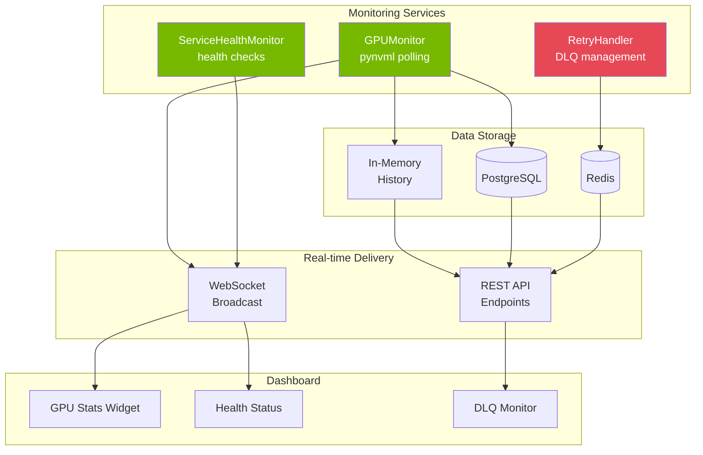
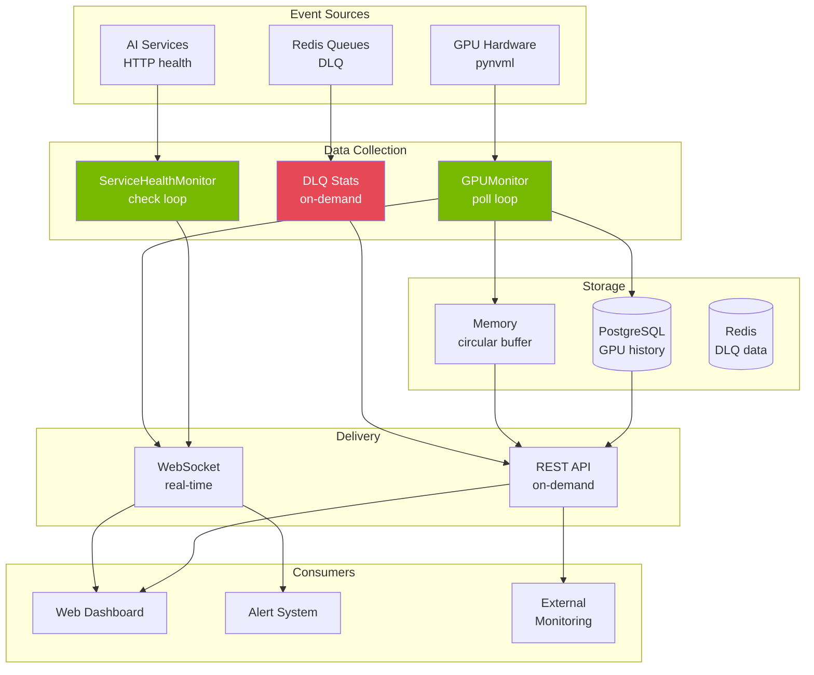

# Monitoring

---

title: Monitoring
source_refs:

- backend/services/gpu_monitor.py:GPUMonitor:23
- backend/services/health_monitor.py:ServiceHealthMonitor:25
- backend/services/retry_handler.py:RetryHandler:128
- backend/services/retry_handler.py:DLQStats:120
- frontend/src/components/settings/DlqMonitor.tsx:51

---

> **Monitor system health, GPU performance, and failed job queues.** Real-time visibility into all system components through dashboards and APIs.

<!-- Nano Banana Pro Prompt:
"Technical illustration of server monitoring dashboard with GPU metrics,
dark background #121212, NVIDIA green #76B900 accent lighting,
health status indicators, graphs and gauges,
clean minimalist style, vertical 2:3 aspect ratio,
no text overlays"
-->

## Overview

The system provides comprehensive monitoring across three domains:

1. **GPU Monitoring** - Utilization, memory, temperature, power
2. **Service Health** - AI services, Redis, database connectivity
3. **Dead Letter Queue** - Failed job inspection and recovery



---

## GPU Monitoring

The [`GPUMonitor`](../../backend/services/gpu_monitor.py:23) service polls NVIDIA GPU statistics using `pynvml`.

### Metrics Collected

| Metric            | Unit    | Description                           |
| ----------------- | ------- | ------------------------------------- |
| `gpu_utilization` | %       | GPU compute utilization               |
| `memory_used`     | MB      | VRAM currently in use                 |
| `memory_total`    | MB      | Total VRAM available                  |
| `temperature`     | Celsius | GPU core temperature                  |
| `power_usage`     | Watts   | Current power draw                    |
| `inference_fps`   | FPS     | Inference throughput (when available) |

**Source:** [`backend/services/gpu_monitor.py:104-159`](../../backend/services/gpu_monitor.py)

### Configuration

| Variable                    | Default | Range    | Description       |
| --------------------------- | ------- | -------- | ----------------- |
| `GPU_POLL_INTERVAL_SECONDS` | `5.0`   | 1.0-60.0 | Polling frequency |
| `GPU_STATS_HISTORY_MINUTES` | `60`    | 1-1440   | In-memory history |

### Polling Interval Guidance

| Interval | DB Writes/min | Use Case                               |
| -------- | ------------- | -------------------------------------- |
| 1-2s     | ~60           | Active debugging, real-time visibility |
| 5s       | ~12           | Normal operation (default)             |
| 15-30s   | ~4            | Heavy AI loads, reduce overhead        |
| 60s      | ~1            | Minimal monitoring, trend analysis     |

### API Endpoints

```bash
# Current GPU stats
curl http://localhost:8000/api/system/gpu

# GPU history (last N minutes)
curl "http://localhost:8000/api/system/gpu/history?minutes=30"
```

Response:

```json
{
  "gpu_name": "NVIDIA RTX A5500",
  "gpu_utilization": 45.0,
  "memory_used": 8192,
  "memory_total": 24576,
  "temperature": 62.0,
  "power_usage": 125.5,
  "recorded_at": "2025-12-30T10:15:00Z"
}
```

### WebSocket Updates

GPU stats are broadcast via WebSocket on the `/ws/system` channel:

```json
{
  "type": "gpu_stats",
  "data": {
    "gpu_name": "NVIDIA RTX A5500",
    "gpu_utilization": 45.0,
    "memory_used": 8192,
    "memory_total": 24576,
    "temperature": 62.0,
    "power_usage": 125.5,
    "recorded_at": "2025-12-30T10:15:00.000Z"
  }
}
```

### Mock Mode

If no NVIDIA GPU is available, the monitor returns mock data:

```json
{
  "gpu_name": "Mock GPU (No NVIDIA GPU Available)",
  "gpu_utilization": null,
  "memory_used": null,
  "memory_total": null,
  "temperature": null,
  "power_usage": null
}
```

---

## Service Health Monitoring

The [`ServiceHealthMonitor`](../../backend/services/health_monitor.py:25) continuously checks dependent services and manages automatic recovery.

### Monitored Services

| Service    | Health Endpoint | Recovery                    |
| ---------- | --------------- | --------------------------- |
| RT-DETRv2  | `GET /health`   | Restart via service manager |
| Nemotron   | `GET /health`   | Restart via service manager |
| Redis      | `PING` command  | Alert only                  |
| PostgreSQL | Connection test | Alert only                  |

### Service Status Values

| Status           | Meaning                                          |
| ---------------- | ------------------------------------------------ |
| `healthy`        | Service responding normally                      |
| `unhealthy`      | Health check failed                              |
| `restarting`     | Restart in progress                              |
| `restart_failed` | Restart attempt failed                           |
| `failed`         | Max retries exceeded, manual intervention needed |

**Source:** [`backend/services/health_monitor.py:25-38`](../../backend/services/health_monitor.py)

### Configuration

The health monitor is configured via service definitions:

```python
ServiceConfig(
    name="rtdetr",
    health_url="http://localhost:8090/health",
    max_retries=3,
    backoff_base=5.0  # seconds
)
```

### Exponential Backoff

Recovery attempts use exponential backoff:

| Attempt | Delay    |
| ------- | -------- |
| 1       | 5s       |
| 2       | 10s      |
| 3       | 20s      |
| 4+      | Gives up |

Formula: `backoff_base * 2^(attempt-1)`

### Health Check API

```bash
# Overall system health
curl http://localhost:8000/api/system/health
```

Response:

```json
{
  "status": "healthy",
  "services": {
    "database": "healthy",
    "redis": "healthy",
    "rtdetr": "healthy",
    "nemotron": "healthy"
  },
  "timestamp": "2025-12-30T10:15:00Z"
}
```

### WebSocket Status Updates

Service status changes are broadcast via WebSocket:

```json
{
  "type": "service_status",
  "data": {
    "service": "rtdetr",
    "status": "unhealthy",
    "message": "Health check failed"
  },
  "timestamp": "2025-12-30T10:15:00Z"
}
```

---

## Dead Letter Queue (DLQ) Monitoring

The [`RetryHandler`](../../backend/services/retry_handler.py:128) manages failed jobs that exceed retry limits.

### DLQ Queues

| Queue                 | Purpose                      |
| --------------------- | ---------------------------- |
| `dlq:detection_queue` | Failed object detection jobs |
| `dlq:analysis_queue`  | Failed LLM analysis jobs     |

### Job Failure Structure

```python
@dataclass
class JobFailure:
    original_job: dict       # Original job payload
    error: str               # Last error message
    attempt_count: int       # Number of attempts made
    first_failed_at: str     # ISO timestamp of first failure
    last_failed_at: str      # ISO timestamp of last failure
    queue_name: str          # Original queue name
```

**Source:** [`backend/services/retry_handler.py:73-105`](../../backend/services/retry_handler.py)

### DLQ Statistics API

```bash
# Get DLQ counts
curl http://localhost:8000/api/system/dlq/stats
```

Response:

```json
{
  "detection_queue_count": 3,
  "analysis_queue_count": 1,
  "total_count": 4
}
```

### DLQ Job Listing

```bash
# List jobs in detection DLQ
curl "http://localhost:8000/api/dlq/jobs/dlq:detection_queue"

# List with pagination
curl "http://localhost:8000/api/dlq/jobs/dlq:detection_queue?start=0&limit=50"
```

**Query Parameters:**

| Name    | Type    | Required | Description                                                     |
| ------- | ------- | -------- | --------------------------------------------------------------- |
| `start` | integer | No       | Start index for pagination (0-based). Default: `0`              |
| `limit` | integer | No       | Maximum number of jobs to return. Range: 1-1000. Default: `100` |

**Response:**

```json
{
  "jobs": [
    {
      "original_job": {
        "file_path": "/export/foscam/front_door/image001.jpg",
        "camera_id": "front_door"
      },
      "error": "Connection timeout to RT-DETRv2",
      "attempt_count": 3,
      "first_failed_at": "2025-12-30T10:00:00Z",
      "last_failed_at": "2025-12-30T10:01:30Z",
      "queue_name": "detection_queue"
    }
  ],
  "queue_name": "dlq:detection_queue",
  "start": 0,
  "limit": 100,
  "total": 1
}
```

**Pagination Example:**

```bash
# Get first 50 failed jobs
curl "http://localhost:8000/api/dlq/jobs/dlq:detection_queue?start=0&limit=50"

# Get next page
curl "http://localhost:8000/api/dlq/jobs/dlq:detection_queue?start=50&limit=50"
```

### DLQ Management Operations

#### Requeue All Jobs

Move all jobs from DLQ back to processing queue:

```bash
curl -X POST "http://localhost:8000/api/system/dlq/requeue-all?queue=dlq:detection_queue"
```

#### Clear DLQ

Permanently delete all jobs from a DLQ:

```bash
curl -X DELETE "http://localhost:8000/api/system/dlq/clear?queue=dlq:detection_queue"
```

### DLQ Monitor Dashboard

The [`DlqMonitor`](../../frontend/src/components/settings/DlqMonitor.tsx:51) component provides a UI for DLQ management.

#### Features

- **Badge** showing total failed job count
- **Expandable panels** for each queue
- **Job details** with error messages and timestamps
- **Requeue All** button with confirmation
- **Clear All** button with confirmation
- **Auto-refresh** every 30 seconds

#### Dashboard Location

Navigate to **Settings** in the web interface to access the DLQ Monitor.

---

## Monitoring Flow



---

## API Reference

### System Health

| Endpoint             | Method | Description                  |
| -------------------- | ------ | ---------------------------- |
| `/api/system/health` | GET    | Overall system health status |
| `/api/system/stats`  | GET    | System statistics and counts |

### GPU Monitoring

| Endpoint                  | Method | Description          |
| ------------------------- | ------ | -------------------- |
| `/api/system/gpu`         | GET    | Current GPU stats    |
| `/api/system/gpu/history` | GET    | Historical GPU stats |

### DLQ Management

| Endpoint                      | Method | Description          |
| ----------------------------- | ------ | -------------------- |
| `/api/system/dlq/stats`       | GET    | DLQ queue counts     |
| `/api/system/dlq/jobs`        | GET    | List jobs in DLQ     |
| `/api/system/dlq/requeue-all` | POST   | Requeue all DLQ jobs |
| `/api/system/dlq/clear`       | DELETE | Clear DLQ            |

### Storage

| Endpoint                      | Method | Description           |
| ----------------------------- | ------ | --------------------- |
| `/api/system/storage/stats`   | GET    | Disk usage statistics |
| `/api/system/cleanup/preview` | GET    | Cleanup dry run       |

---

## Alerting

### Built-in Alerts

The system generates alerts for:

| Condition                    | Severity | Channel                       |
| ---------------------------- | -------- | ----------------------------- |
| Service unhealthy            | WARNING  | WebSocket, logs               |
| Service restart failed       | ERROR    | WebSocket, logs               |
| Service max retries exceeded | CRITICAL | WebSocket, logs, notification |
| DLQ jobs present             | WARNING  | Logs                          |
| GPU temperature > 85C        | WARNING  | Logs                          |
| Disk usage > 90%             | CRITICAL | Logs, notification            |

### External Integration

Export metrics to external monitoring systems via:

1. **REST API polling** - Prometheus-style scraping
2. **WebSocket subscription** - Real-time event streaming
3. **Log aggregation** - Parse structured logs

---

## Best Practices

### GPU Monitoring

1. **Start with default interval** (5s) and adjust based on needs
2. **Monitor temperature trends** - sudden spikes indicate issues
3. **Watch VRAM usage** - AI models need ~6GB combined
4. **Reduce polling during heavy loads** to minimize overhead

### Health Monitoring

1. **Review service logs** when health checks fail
2. **Check network connectivity** before assuming service issues
3. **Monitor restart frequency** - frequent restarts indicate underlying problems
4. **Set up external monitoring** for critical deployments

### DLQ Management

1. **Investigate root cause** before requeuing jobs
2. **Monitor DLQ size trends** - growing queues indicate systemic issues
3. **Clear only after investigation** - don't blindly delete failed jobs
4. **Review job payloads** to understand failure patterns

---

## Troubleshooting

### GPU Stats Not Updating

1. Verify pynvml installation:

   ```bash
   python -c "import pynvml; pynvml.nvmlInit(); print('OK')"
   ```

2. Check NVIDIA driver:

   ```bash
   nvidia-smi
   ```

3. Review GPU monitor logs:
   ```bash
   grep "GPU" data/logs/security.log
   ```

### Health Checks Failing

1. Test service endpoints directly:

   ```bash
   curl http://localhost:8090/health  # RT-DETRv2
   curl http://localhost:8091/health  # Nemotron
   ```

2. Check service logs in their respective terminals

3. Verify network connectivity (especially in Docker)

### DLQ Growing

1. Check error messages in DLQ jobs
2. Verify AI service availability
3. Review retry configuration
4. Check for resource exhaustion (memory, disk)

---

## See Also

- [Configuration](configuration.md) - Monitoring-related settings
- [Storage and Retention](storage-retention.md) - Data cleanup
- [Troubleshooting](troubleshooting.md) - Common issues
- [Security](security.md) - Securing monitoring endpoints
