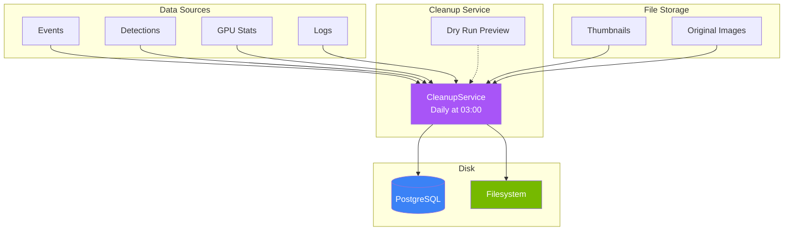

# Storage and Retention

---

title: Storage and Retention
source_refs:

- backend/services/cleanup_service.py:CleanupService:85
- backend/services/cleanup_service.py:CleanupStats:44
- backend/core/config.py:retention_days:88
- backend/core/config.py:log_retention_days:251
- frontend/src/components/settings/StorageDashboard.tsx:48

---

> **Manage disk space and data retention.** The cleanup service automatically prunes old records and files based on configurable retention periods.

<!-- Nano Banana Pro Prompt:
"Technical illustration of data storage and cleanup automation,
hard drives with data flowing, retention timeline visualization,
dark background #121212, storage purple #A855F7 accent,
clean minimalist style, vertical 2:3 aspect ratio,
no text overlays"
-->

## Overview

The system stores several types of data that grow over time:

- **Events** - Security event records with risk scores
- **Detections** - Individual object detections with metadata
- **GPU Stats** - Historical GPU metrics for monitoring
- **Logs** - Application log entries in the database
- **Thumbnails** - Generated preview images for detections
- **Original Images** - Camera uploads (optionally cleaned)

The [`CleanupService`](../../backend/services/cleanup_service.py:85) runs daily to enforce retention policies and reclaim disk space.



---

## Retention Configuration

### Database Records

| Variable             | Default | Description                                    |
| -------------------- | ------- | ---------------------------------------------- |
| `RETENTION_DAYS`     | `30`    | Days to keep events, detections, and GPU stats |
| `LOG_RETENTION_DAYS` | `7`     | Days to keep application logs in database      |

**Source:** [`backend/core/config.py:88-91`](../../backend/core/config.py), [`backend/core/config.py:251-254`](../../backend/core/config.py)

### Cleanup Schedule

The cleanup service runs daily at a configurable time (default: 03:00). Configure in the service initialization:

```python
# backend/services/cleanup_service.py:93
cleanup_service = CleanupService(
    cleanup_time="03:00",        # HH:MM (24-hour format)
    retention_days=30,           # Override config default
    thumbnail_dir="data/thumbnails",
    delete_images=False          # Keep original camera images
)
```

---

## What Gets Cleaned

### Automatic Cleanup

| Data Type  | Retention            | Cascade Behavior                             |
| ---------- | -------------------- | -------------------------------------------- |
| Events     | `RETENTION_DAYS`     | Deleted when older than cutoff               |
| Detections | `RETENTION_DAYS`     | Deleted when older than cutoff               |
| GPU Stats  | `RETENTION_DAYS`     | Deleted when older than cutoff               |
| Logs       | `LOG_RETENTION_DAYS` | Deleted when older than cutoff               |
| Thumbnails | With detection       | Deleted when associated detection is deleted |

### Optional Cleanup

| Data Type       | Default         | Configuration                                   |
| --------------- | --------------- | ----------------------------------------------- |
| Original Images | **Not deleted** | Not currently exposed as an environment setting |

**Warning:** Original camera images are not deleted by default. If you need automated deletion of originals, it currently requires changing how `CleanupService` is initialized (advanced/operator customization).

---

## Cleanup Statistics

Each cleanup operation returns detailed statistics via [`CleanupStats`](../../backend/services/cleanup_service.py:44):

```python
class CleanupStats:
    events_deleted: int = 0
    detections_deleted: int = 0
    gpu_stats_deleted: int = 0
    logs_deleted: int = 0
    thumbnails_deleted: int = 0
    images_deleted: int = 0        # Only if delete_images=True
    space_reclaimed: int = 0       # Estimated bytes freed
```

Statistics are logged after each cleanup:

```
INFO: Cleanup completed: <CleanupStats(events=45, detections=328, gpu_stats=8640, logs=1024, files=328, space=52428800 bytes)>
```

---

## Storage Dashboard

The frontend [`StorageDashboard`](../../frontend/src/components/settings/StorageDashboard.tsx:48) component provides real-time visibility into storage usage.

### Features

- **Disk Usage Overview** - Progress bar showing total disk usage percentage
- **Storage Breakdown** - Size and file count for thumbnails, images, and clips
- **Database Records** - Count of events, detections, GPU stats, and logs
- **Cleanup Preview** - Dry run showing what would be deleted

### Accessing the Dashboard

Navigate to **Settings** in the web interface to view the Storage Dashboard.

### Dashboard Metrics

| Metric                  | Description                   |
| ----------------------- | ----------------------------- |
| `disk_usage_percent`    | Overall disk usage percentage |
| `disk_used_bytes`       | Total bytes used on disk      |
| `disk_total_bytes`      | Total disk capacity           |
| `thumbnails.size_bytes` | Storage used by thumbnails    |
| `thumbnails.file_count` | Number of thumbnail files     |
| `images.size_bytes`     | Storage used by camera images |
| `images.file_count`     | Number of image files         |
| `clips.size_bytes`      | Storage used by video clips   |
| `clips.file_count`      | Number of clip files          |
| `events_count`          | Total events in database      |
| `detections_count`      | Total detections in database  |
| `gpu_stats_count`       | Total GPU stat records        |
| `logs_count`            | Total log entries in database |

---

## Cleanup Preview (Dry Run)

Before running actual cleanup, preview what would be deleted:

### Via API

```bash
# Dry run cleanup preview
# Note: this endpoint requires an API key only when `API_KEY_ENABLED=true`.
curl -X POST "http://localhost:8000/api/system/cleanup?dry_run=true"
```

Response:

```json
{
  "events_deleted": 45,
  "detections_deleted": 328,
  "gpu_stats_deleted": 8640,
  "logs_deleted": 1024,
  "thumbnails_deleted": 328,
  "images_deleted": 0,
  "space_reclaimed": 52428800,
  "retention_days": 30,
  "dry_run": true,
  "timestamp": "2025-12-27T10:30:00Z"
}
```

### Via Dashboard

Click **Preview Cleanup** in the Storage Dashboard to see what would be deleted without actually deleting anything.

### Programmatic Dry Run

```python
from backend.services.cleanup_service import CleanupService

cleanup_service = CleanupService(retention_days=30)
stats = await cleanup_service.dry_run_cleanup()
print(f"Would delete {stats.events_deleted} events")
print(f"Would reclaim {stats.space_reclaimed / 1024 / 1024:.1f} MB")
```

**Source:** [`backend/services/cleanup_service.py:261-353`](../../backend/services/cleanup_service.py)

---

## Manual Cleanup

### Trigger Immediate Cleanup

```bash
# Via API (requires API key only when `API_KEY_ENABLED=true`)
curl -X POST "http://localhost:8000/api/system/cleanup"
```

### Programmatic Cleanup

```python
from backend.services.cleanup_service import CleanupService

cleanup_service = CleanupService(retention_days=30)
stats = await cleanup_service.run_cleanup()
print(f"Deleted {stats.events_deleted} events, reclaimed {stats.space_reclaimed} bytes")
```

**Source:** [`backend/services/cleanup_service.py:176-259`](../../backend/services/cleanup_service.py)

### Cleanup Job Status

To view the latest cleanup status (and whether a cleanup is currently running), use:

```bash
curl http://localhost:8000/api/system/cleanup/status
```

---

## Cleanup Process Flow

```mermaid
flowchart TB
    subgraph Preparation["1. Preparation"]
        CUTOFF[Calculate Cutoff Date<br/>now() - retention_days]
        QUERY[Query Records<br/>Older Than Cutoff]
    end

    subgraph Database["2. Database Cleanup"]
        DEL_DET[Delete Detections]
        DEL_EVT[Delete Events]
        DEL_GPU[Delete GPU Stats]
        DEL_LOG[Delete Logs]
        COMMIT[Commit Transaction]
    end

    subgraph Files["3. File Cleanup"]
        DEL_THM[Delete Thumbnails]
        DEL_IMG[Delete Images<br/>if enabled]
    end

    subgraph Results["4. Results"]
        STATS[Return CleanupStats]
        LOG[Log Summary]
    end

    CUTOFF --> QUERY
    QUERY --> DEL_DET --> DEL_EVT --> DEL_GPU --> DEL_LOG --> COMMIT
    COMMIT --> DEL_THM --> DEL_IMG
    DEL_IMG --> STATS --> LOG

    style CUTOFF fill:#3B82F6,color:#fff
    style COMMIT fill:#76B900,color:#fff
    style STATS fill:#A855F7,color:#fff
```

---

## Storage Directories

| Directory          | Purpose                  | Configuration          |
| ------------------ | ------------------------ | ---------------------- |
| `data/thumbnails/` | Detection preview images | `VIDEO_THUMBNAILS_DIR` |
| `data/clips/`      | Generated event clips    | `CLIPS_DIRECTORY`      |
| `data/logs/`       | Rotating log files       | `LOG_FILE_PATH`        |
| `data/certs/`      | TLS certificates         | `TLS_CERT_DIR`         |
| `/export/foscam/`  | Camera FTP uploads       | `FOSCAM_BASE_PATH`     |

### Disk Space Estimation

| Data Type        | Typical Size | 30-Day Estimate (100 events/day) |
| ---------------- | ------------ | -------------------------------- |
| Event record     | ~1 KB        | ~3 MB                            |
| Detection record | ~500 bytes   | ~15 MB (10 detections/event)     |
| Thumbnail        | ~50 KB       | ~1.5 GB                          |
| GPU stat record  | ~200 bytes   | ~100 MB (5s intervals)           |
| Log entry        | ~300 bytes   | ~50 MB                           |

**Total estimate:** ~2 GB for 30 days with moderate activity.

---

## Monitoring Storage

### API Endpoints

```bash
# Storage statistics
curl http://localhost:8000/api/system/storage

# Database record counts
curl http://localhost:8000/api/system/stats
```

### Alerts

Configure disk space alerts by monitoring `disk_usage_percent`:

| Threshold | Recommended Action                       |
| --------- | ---------------------------------------- |
| < 50%     | Normal operation                         |
| 50-75%    | Monitor, consider reducing retention     |
| 75-90%    | Warning: reduce retention or add storage |
| > 90%     | Critical: immediate action required      |

---

## Best Practices

### Sizing Recommendations

| Deployment     | Cameras | Recommended Disk | Retention  |
| -------------- | ------- | ---------------- | ---------- |
| Small home     | 1-4     | 50 GB            | 30 days    |
| Medium home    | 5-8     | 100 GB           | 30 days    |
| Large property | 8+      | 250+ GB          | 14-30 days |

### Optimization Tips

1. **Reduce thumbnail size** - Thumbnails are the largest storage consumer after images
2. **Increase polling interval** - Reduce GPU stat records with higher `GPU_POLL_INTERVAL_SECONDS`
3. **Enable image cleanup** - If you have backups, enable `delete_images=True`
4. **Shorter retention** - Reduce `RETENTION_DAYS` if disk space is limited
5. **Compress logs** - Log files are already rotated; consider offsite backup

---

## Troubleshooting

### Cleanup Not Running

1. Check cleanup service is started:

   ```bash
   curl http://localhost:8000/api/system/health
   ```

2. Check logs for cleanup activity:

   ```bash
   grep "Cleanup" data/logs/security.log
   ```

3. Verify cleanup time configuration

### Disk Space Not Decreasing

1. Check if images are being deleted (`delete_images` setting)
2. Verify thumbnail paths exist and are accessible
3. Check for orphaned files not tracked in database

### Cleanup Errors

Check logs for transaction failures:

```bash
grep "Cleanup failed" data/logs/security.log
```

---

## See Also

- [Configuration](configuration.md) - Retention and storage settings
- [Monitoring](monitoring.md) - Health checks and service status
- [Troubleshooting](troubleshooting.md) - Common issues
