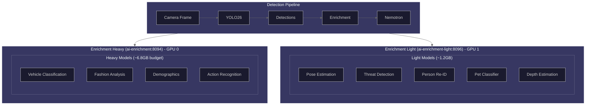
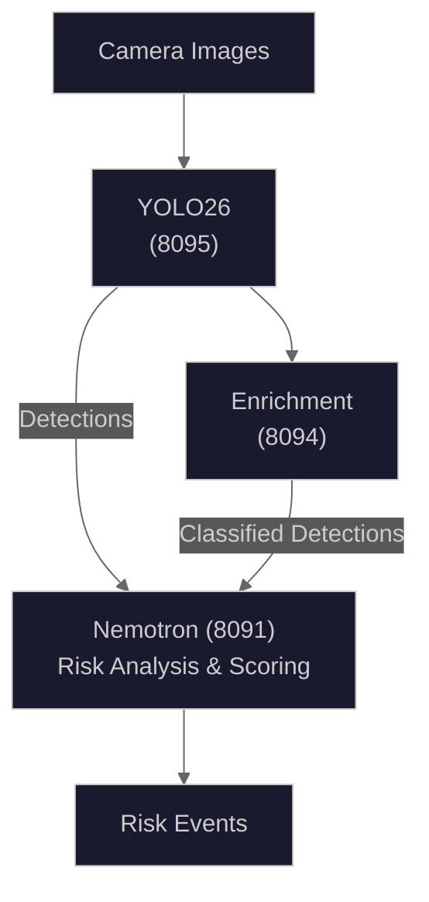

# AI Model Zoo Architecture

## Overview

The AI model zoo provides comprehensive visual analysis for home security through multiple specialized models working together. The system uses VRAM-efficient on-demand loading to maximize capability while respecting GPU memory constraints.

The architecture separates models into two categories:

1. **Always-loaded services** - Core detection and analysis models that run continuously
2. **On-demand models** - Specialized enrichment models loaded dynamically based on detection type

## Architecture Diagram



## Service Architecture

### Core Services (Containerized)

| Service            | Container           | Port | Model                    | VRAM    | Purpose                               |
| ------------------ | ------------------- | ---- | ------------------------ | ------- | ------------------------------------- |
| YOLO26             | ai-yolo26           | 8095 | YOLO26m (TensorRT FP16)  | ~2GB    | Primary object detection              |
| Nemotron           | ai-nemotron         | 8091 | Nemotron-3-Nano-30B-A3B  | ~14.7GB | Risk reasoning and analysis           |
| Florence-2         | ai-florence         | 8092 | Florence-2-Large         | ~1.2GB  | Scene understanding, OCR              |
| CLIP               | ai-clip             | 8093 | CLIP ViT-L/14            | ~800MB  | Embeddings, anomaly detection         |
| Enrichment (Heavy) | ai-enrichment       | 8094 | Transformers (on-demand) | ~6.8GB  | Heavy models (vehicle, fashion, etc.) |
| Enrichment (Light) | ai-enrichment-light | 8096 | Small models (on-demand) | ~1.2GB  | Light models (pose, threat, reid)     |

### Enrichment Service Split

The enrichment models are split across two services based on GPU requirements:

| Service                 | Port | Target GPU   | Models                                |
| ----------------------- | ---- | ------------ | ------------------------------------- |
| **ai-enrichment**       | 8094 | GPU 0 (24GB) | Vehicle, fashion, age, gender, action |
| **ai-enrichment-light** | 8096 | GPU 1 (4GB)  | Pose, threat, reid, pet, depth        |

The backend routes requests to the appropriate service based on `ENRICHMENT_*_SERVICE` environment variables. See [AI Enrichment Light Service](../operator/services/ai-enrichment-light.md) for detailed documentation.

### Data Flow



## Model Details

### Always-Loaded Models

#### YOLO26 (ai-yolo26:8095)

- **Model**: YOLO26m (Ultralytics with TensorRT)
- **Architecture**: YOLO26 object detection with TensorRT FP16 optimization
- **VRAM**: ~2GB (with TensorRT FP16 engine)
- **Inference Time**: 30-50ms per image
- **Output**: Bounding boxes with class labels and confidence scores

**Security Classes (Filtered)**:

```python
SECURITY_CLASSES = {
    "person", "car", "truck", "dog", "cat",
    "bird", "bicycle", "motorcycle", "bus"
}
```

**API Endpoints**:

- `GET /health` - Health status
- `POST /detect` - Single image detection
- `POST /detect/batch` - Batch detection

#### Florence-2-Large (ai-florence:8092)

- **Model**: microsoft/Florence-2-large
- **Architecture**: Vision-language transformer
- **VRAM**: ~1.2GB
- **Inference Time**: 100-300ms per query
- **Tasks**: Caption, Dense Region Caption, OCR, Open Vocabulary Detection

**Supported Prompts**:
| Prompt | Output | Use Case |
| ------ | ------ | -------- |
| `<CAPTION>` | Brief description | Quick scene summary |
| `<DETAILED_CAPTION>` | Detailed paragraph | Event logging |
| `<OD>` | Objects with bboxes | Object localization |
| `<DENSE_REGION_CAPTION>` | Caption per region | Scene understanding |
| `<OCR>` | Detected text | License plates, signs |
| `<OCR_WITH_REGION>` | Text with bboxes | Text localization |

**API Endpoints**:

- `GET /health` - Health status
- `POST /extract` - Generic extraction with prompt
- `POST /ocr` - Text extraction
- `POST /detect` - Object detection
- `POST /dense-caption` - Region captioning

#### CLIP ViT-L/14 (ai-clip:8093)

- **Model**: openai/clip-vit-large-patch14
- **Architecture**: Vision-Language contrastive model
- **VRAM**: ~800MB
- **Embedding Dimension**: 768
- **Output**: Normalized image embeddings, similarity scores

**Use Cases**:

- Entity re-identification across cameras
- Scene anomaly detection via baseline comparison
- Zero-shot classification

**API Endpoints**:

- `GET /health` - Health status
- `POST /embed` - Generate 768-dim embedding
- `POST /anomaly-score` - Compare to baseline
- `POST /classify` - Zero-shot classification
- `POST /similarity` - Image-text similarity
- `POST /batch-similarity` - Batch similarity comparison

#### Nemotron (ai-nemotron:8091)

**Production Model:**

- **Model**: nvidia/Nemotron-3-Nano-30B-A3B-GGUF (Q4_K_M quantization)
- **Architecture**: Large Language Model via llama.cpp with Mixture-of-Experts (MoE) routing
- **Parameters**: 30 billion (A3B active routing variant)
- **VRAM**: ~14.7GB
- **Context Window**: 131,072 tokens (128K)
- **Purpose**: Risk reasoning, threat analysis, natural language generation

**Development Model (resource-constrained environments):**

- **Model**: bartowski/nemotron-mini-4b-instruct-GGUF (Q4_K_M quantization)
- **Parameters**: 4 billion
- **VRAM**: ~3GB
- **Context Window**: 4,096 tokens

**Risk Score Ranges**:
| Score | Level | Description |
| ----- | ----- | ----------- |
| 0-29 | Low | Normal activity |
| 30-59 | Medium | Unusual but not threatening |
| 60-84 | High | Suspicious activity |
| 85-100 | Critical | Potential security threat |

### On-Demand Models (Enrichment Services)

The enrichment models are split across two services:

- **ai-enrichment** (port 8094): Heavy transformer models running on GPU 0 (~6.8GB budget)
- **ai-enrichment-light** (port 8096): Small efficient models running on GPU 1 (~1.2GB budget)

The backend routes requests to the appropriate service based on the `ENRICHMENT_*_SERVICE` environment variables (e.g., `ENRICHMENT_POSE_SERVICE=light`).

#### Threat Detection (CRITICAL Priority)

- **Model**: Subh775/Threat-Detection-YOLOv8n
- **VRAM**: ~300MB (per model_zoo.py)
- **Purpose**: Detect weapons (knives, guns, etc.)
- **Trigger**: All person detections in security-sensitive contexts
- **Eviction**: Never evicted if possible

**Input**: Cropped person image
**Output**:

```json
{
  "detected": true,
  "threat_type": "knife",
  "confidence": 0.89,
  "bbox": [x1, y1, x2, y2]
}
```

#### Pose Estimation (HIGH Priority)

- **Model**: ViTPose+ Small (primary, ~1.5GB), YOLOv8n-pose (fallback, ~200MB)
- **VRAM**: ~1.5GB (ViTPose) or ~200MB (YOLOv8n-pose)
- **Purpose**: Body pose detection, posture classification
- **Trigger**: Person detections
- **Output**: 17 COCO keypoints per person

**COCO Keypoints**:

```python
COCO_KEYPOINT_NAMES = [
    "nose", "left_eye", "right_eye", "left_ear", "right_ear",
    "left_shoulder", "right_shoulder", "left_elbow", "right_elbow",
    "left_wrist", "right_wrist", "left_hip", "right_hip",
    "left_knee", "right_knee", "left_ankle", "right_ankle"
]
```

**Posture Classifications**: standing, walking, running, sitting, crouching, lying_down

**Security Alerts**:

- `crouching` - Potential hiding/break-in behavior
- `lying_down` - Possible medical emergency
- `hands_raised` - Potential surrender/robbery scenario
- `fighting_stance` - Aggressive posture

#### Demographics (HIGH Priority)

- **Model**: ViT Age Classifier (~200MB) + ViT Gender Classifier (~200MB)
- **VRAM**: ~400MB total (200MB each, loaded separately)
- **Purpose**: Age range and gender estimation from face crops
- **Trigger**: Person detections with visible face

**Input**: Cropped face image
**Output**:

```json
{
  "age_range": "25-35",
  "gender": "male",
  "age_confidence": 0.82,
  "gender_confidence": 0.94
}
```

#### Clothing Analysis (HIGH Priority)

- **Model**: Marqo/marqo-fashionSigLIP (FashionSigLIP) - upgraded from FashionCLIP for 57% accuracy improvement
- **VRAM**: ~500MB
- **Purpose**: Identify clothing types, uniforms, suspicious attire
- **Trigger**: Person detections

**Security-Focused Prompts**:

```python
SECURITY_CLOTHING_PROMPTS = [
    "person wearing dark hoodie",
    "person wearing face mask",
    "person wearing ski mask or balaclava",
    "delivery uniform", "Amazon delivery vest",
    "FedEx uniform", "UPS uniform", "USPS postal worker uniform",
    "casual clothing", "business attire or suit", ...
]
```

**Output**:

```json
{
  "clothing_type": "hoodie",
  "color": "dark",
  "style": "suspicious",
  "confidence": 0.85,
  "is_suspicious": true,
  "is_service_uniform": false
}
```

#### Vehicle Classification (MEDIUM Priority)

- **Model**: lxyuan/vit-base-patch16-224-vehicle-segment-classification
- **VRAM**: ~1.5GB
- **Purpose**: Vehicle make, model, type identification
- **Trigger**: Vehicle detections (car, truck, bus, motorcycle, bicycle)

**Vehicle Classes**:

```python
VEHICLE_SEGMENT_CLASSES = [
    "articulated_truck", "background", "bicycle", "bus", "car",
    "motorcycle", "non_motorized_vehicle", "pedestrian",
    "pickup_truck", "single_unit_truck", "work_van"
]
```

**Output**:

```json
{
  "vehicle_type": "pickup_truck",
  "display_name": "pickup truck",
  "confidence": 0.92,
  "is_commercial": false
}
```

#### Pet Classification (MEDIUM Priority)

- **Model**: microsoft/resnet-18
- **VRAM**: ~200MB
- **Purpose**: Cat/dog classification and breed identification
- **Trigger**: Animal detections (dog, cat, bird)

**Output**:

```json
{
  "pet_type": "dog",
  "breed": "unknown",
  "confidence": 0.98,
  "is_household_pet": true
}
```

#### Person Re-ID (MEDIUM Priority)

- **Model**: OSNet-x0.25
- **VRAM**: ~100MB
- **Purpose**: Generate 512-dimensional embeddings for tracking individuals
- **Trigger**: Person detections requiring cross-camera tracking

**Output**:

```json
{
  "embedding": [0.123, -0.456, ...],  // 512 floats
  "embedding_dimension": 512
}
```

#### Vehicle Damage Detection (MEDIUM Priority)

- **Model**: harpreetsahota/car-dd-segmentation-yolov11 (YOLOv11x-seg)
- **VRAM**: ~2GB
- **Purpose**: Detect and segment vehicle damage for security analysis
- **Trigger**: Vehicle detections (car, truck, bus, motorcycle)
- **License**: AGPL-3.0

**Damage Classes**:

```python
DAMAGE_CLASSES = [
    "crack",         # Surface cracks in paint/body
    "dent",          # Impact dents on body panels
    "glass_shatter", # Broken/shattered glass (HIGH SECURITY)
    "lamp_broken",   # Damaged headlights/taillights (HIGH SECURITY)
    "scratch",       # Surface scratches on paint
    "tire_flat",     # Flat or damaged tires
]
```

**High-Security Damage Types**:

| Damage Type     | Security Implication                                  |
| --------------- | ----------------------------------------------------- |
| `glass_shatter` | Possible break-in attempt, vandalism, or collision    |
| `lamp_broken`   | Possible vandalism, hit-and-run, or deliberate damage |

**Input**: Cropped vehicle image from YOLO26 detection

**Output**:

```json
{
  "detections": [
    {
      "damage_type": "glass_shatter",
      "confidence": 0.87,
      "bbox": {
        "x1": 120.5,
        "y1": 80.2,
        "x2": 180.3,
        "y2": 150.8
      },
      "has_mask": true,
      "mask_area": 2450
    }
  ],
  "damage_types": ["glass_shatter", "dent"],
  "has_high_security_damage": true,
  "total_damage_count": 2,
  "highest_confidence": 0.87
}
```

**Security Alert Pattern Detection**:

The model includes pattern analysis for identifying suspicious damage:

```python
# Suspicious patterns that trigger elevated alerts
- glass_shatter + lamp_broken = "break-in pattern"
- Night time (22:00-06:00) + any damage = "elevated risk"
- Multiple damage types (>=2) = "likely incident"
- High-security damage at night = "critical alert"
```

**Context String for LLM**:

```
Vehicle Damage Detected (2 instances):
  - glass_shatter: 1 instance(s) (avg conf: 87%)
  - dent: 1 instance(s) (avg conf: 72%)
  **HIGH SECURITY ALERT**: Suspicious damage types detected
```

**Source Files**:

- Loader: `backend/services/vehicle_damage_loader.py`
- Model Zoo Entry: `backend/services/model_zoo.py`

#### Depth Estimation (LOW Priority)

- **Model**: depth-anything/Depth-Anything-V2-Small-hf
- **VRAM**: ~150MB
- **Purpose**: Spatial reasoning, distance estimation
- **Trigger**: Detections requiring distance context

**Output**:

```json
{
  "depth_map_base64": "<base64-png>",
  "estimated_distance_m": 3.5,
  "relative_depth": 0.35,
  "proximity_label": "close"
}
```

#### Action Recognition (LOW Priority)

- **Model**: microsoft/xclip-base-patch32 (X-CLIP)
- **VRAM**: ~2GB (with float16)
- **Purpose**: Video-based action classification
- **Trigger**: Person detected >3 seconds with multiple frames, unusual pose detected

**Input**: Multiple frames (video clip)
**Output**:

```json
{
  "action": "running",
  "confidence": 0.87,
  "action_scores": {
    "running": 0.87,
    "walking": 0.08,
    "fighting": 0.03,
    "falling": 0.02
  }
}
```

## VRAM Management

### On-Demand Loading Architecture

The `OnDemandModelManager` class manages GPU memory efficiently:

```python
class OnDemandModelManager:
    def __init__(self, vram_budget_gb: float = 6.8):
        self.vram_budget = vram_budget_gb * 1024  # MB
        self.loaded_models = OrderedDict()  # LRU tracking
        self.model_registry = {}
```

### Loading Algorithm

1. Request comes in requiring a model
2. If model loaded, use it and update last-used timestamp
3. If not loaded, check VRAM budget
4. If over budget, evict LRU models (respecting priority)
5. Load requested model

### Priority System

| Priority | Value | Models                       | Eviction Behavior                         |
| -------- | ----- | ---------------------------- | ----------------------------------------- |
| CRITICAL | 0     | Threat Detection             | Never evicted unless absolutely necessary |
| HIGH     | 1     | Pose, Demographics, Clothing | Evicted only when VRAM critical           |
| MEDIUM   | 2     | Vehicle, Pet, Re-ID          | Standard LRU eviction                     |
| LOW      | 3     | Depth, Action                | Evicted first                             |

### Eviction Strategy

Models are sorted by `(priority descending, last_used ascending)`:

- Higher priority numbers (LOW=3) evicted before lower (CRITICAL=0)
- Among same priority, oldest (least recently used) evicted first

```python
candidates = sorted(
    self.loaded_models.items(),
    key=lambda x: (-x[1].priority, x[1].last_used),
)
```

### VRAM Budget Calculation

Based on actual values from `backend/services/model_zoo.py`:

| Category               | Budget     | Models                                                   |
| ---------------------- | ---------- | -------------------------------------------------------- |
| Always Loaded          | ~21.7GB    | Nemotron LLM (production)                                |
| Primary Detection      | ~2GB       | YOLO26 (TensorRT)                                        |
| Model Zoo Budget       | ~1.65GB    | On-demand models (loaded sequentially, not concurrently) |
| **Total (Production)** | **~25GB+** | Full stack with all models                               |

**On-Demand Model VRAM (from model_zoo.py):**

| Model                          | VRAM      |
| ------------------------------ | --------- |
| yolo11-license-plate           | 300MB     |
| yolo11-face                    | 200MB     |
| paddleocr                      | 100MB     |
| clip-vit-l                     | 800MB     |
| florence-2-large               | 1.2GB     |
| yolo-world-s                   | 1.5GB     |
| vitpose-small                  | 1.5GB     |
| depth-anything-v2-small        | 150MB     |
| violence-detection             | 500MB     |
| weather-classification         | 200MB     |
| segformer-b2-clothes           | 1.5GB     |
| xclip-base                     | 2GB       |
| fashion-clip (FashionSigLIP)   | 500MB     |
| brisque-quality                | 0MB (CPU) |
| vehicle-segment-classification | 1.5GB     |
| vehicle-damage-detection       | 2GB       |
| pet-classifier                 | 200MB     |
| osnet-x0-25                    | 100MB     |
| threat-detection-yolov8n       | 300MB     |
| vit-age-classifier             | 200MB     |
| vit-gender-classifier          | 200MB     |
| yolov8n-pose                   | 200MB     |

## API Reference

### Unified Enrichment Endpoint

```
POST http://ai-enrichment:8094/enrich
```

**Request**:

```json
{
  "image": "<base64>",
  "detection_type": "person|vehicle|animal|object",
  "bbox": {"x1": 0, "y1": 0, "x2": 100, "y2": 100},
  "frames": ["<base64>", ...],
  "options": {
    "action_recognition": true,
    "include_depth": true
  }
}
```

**Response**:

```json
{
  "pose": {
    "keypoints": [...],
    "posture": "standing",
    "alerts": []
  },
  "clothing": {
    "type": "hoodie",
    "color": "dark",
    "is_suspicious": true
  },
  "demographics": {
    "age_range": "25-35",
    "gender": "male"
  },
  "threat": {
    "detected": false
  },
  "reid_embedding": [...],
  "vehicle": null,
  "action": {
    "action": "walking",
    "confidence": 0.92
  },
  "depth": {
    "estimated_distance_m": 3.5
  },
  "inference_time_ms": 245.6
}
```

### Model Status Endpoint

```
GET http://ai-enrichment:8094/models/status
```

**Response**:

```json
{
  "vram_budget_mb": 6963.2,
  "vram_used_mb": 2300,
  "vram_available_mb": 4663.2,
  "vram_utilization_percent": 33.0,
  "loaded_models": [
    {
      "name": "fashion_clip",
      "vram_mb": 800,
      "priority": "HIGH",
      "last_used": "2024-01-15T10:30:00Z"
    }
  ],
  "registered_models": [
    {
      "name": "vehicle_classifier",
      "vram_mb": 1500,
      "priority": "MEDIUM",
      "loaded": false
    }
  ],
  "pending_loads": []
}
```

### Model Preload Endpoint

```
POST http://ai-enrichment:8094/models/preload?model_name=threat_detector
```

**Response**:

```json
{
  "success": true,
  "model_name": "threat_detector",
  "vram_mb": 400,
  "load_time_ms": 1250.5
}
```

### Individual Classification Endpoints

| Endpoint             | Method | Purpose                     |
| -------------------- | ------ | --------------------------- |
| `/health`            | GET    | Service health status       |
| `/vehicle-classify`  | POST   | Vehicle type classification |
| `/pet-classify`      | POST   | Pet type classification     |
| `/clothing-classify` | POST   | Clothing analysis           |
| `/depth-estimate`    | POST   | Full depth map              |
| `/object-distance`   | POST   | Object distance estimation  |
| `/pose-analyze`      | POST   | Human pose keypoints        |

## Enrichment Result Schema

The enrichment pipeline returns structured results for each detection. These results are stored alongside detections and used by Nemotron for comprehensive risk analysis.

### EnrichmentResult Structure

The `EnrichmentResult` object aggregates all enrichment outputs for a batch of detections:

```python
class EnrichmentResult:
    threat_detection: ThreatDetectionResult | None
    age_classifications: dict[str, AgeClassificationResult]  # detection_id -> result
    gender_classifications: dict[str, GenderClassificationResult]  # detection_id -> result
    person_embeddings: dict[str, PersonEmbeddingResult]  # detection_id -> result
```

### ThreatDetectionResult

Weapon and threat detection results from the YOLO threat detector model.

```json
{
  "threat_type": "knife",
  "confidence": 0.89,
  "severity": "critical",
  "bbox": [120, 80, 180, 200]
}
```

| Field         | Type   | Description                                               |
| ------------- | ------ | --------------------------------------------------------- |
| `threat_type` | string | Type of threat detected: `knife`, `gun`, `weapon`, `none` |
| `confidence`  | float  | Detection confidence score (0.0-1.0)                      |
| `severity`    | string | Threat severity: `low`, `medium`, `high`, `critical`      |
| `bbox`        | array  | Bounding box `[x1, y1, x2, y2]` of detected threat        |

### AgeClassificationResult

Age range estimation from ViT age classifier.

```json
{
  "age_range": "25-35",
  "confidence": 0.82,
  "raw_prediction": 28.5
}
```

| Field            | Type   | Description                                   |
| ---------------- | ------ | --------------------------------------------- |
| `age_range`      | string | Estimated age range bracket                   |
| `confidence`     | float  | Classification confidence (0.0-1.0)           |
| `raw_prediction` | float  | Raw model prediction (estimated age in years) |

**Age Range Brackets:**

- `0-12` (child)
- `13-17` (teenager)
- `18-24` (young adult)
- `25-35` (adult)
- `36-50` (middle-aged)
- `51-65` (mature adult)
- `65+` (senior)

### GenderClassificationResult

Gender classification from ViT gender classifier.

```json
{
  "gender": "male",
  "confidence": 0.94
}
```

| Field        | Type   | Description                                   |
| ------------ | ------ | --------------------------------------------- |
| `gender`     | string | Predicted gender: `male`, `female`, `unknown` |
| `confidence` | float  | Classification confidence (0.0-1.0)           |

### PersonEmbeddingResult

512-dimensional embedding vector from OSNet for person re-identification across cameras.

```json
{
  "embedding": [0.123, -0.456, 0.789, ...],
  "embedding_dimension": 512,
  "model": "osnet_x0_25"
}
```

| Field                 | Type   | Description                                  |
| --------------------- | ------ | -------------------------------------------- |
| `embedding`           | array  | 512-dimensional float vector (normalized L2) |
| `embedding_dimension` | int    | Embedding vector length (always 512)         |
| `model`               | string | Model used for embedding generation          |

**Use Cases:**

- Cross-camera person tracking
- Person re-identification over time
- Similarity search for matching individuals

### Complete Enrichment Response Example

Full response from the `/enrich` endpoint for a person detection:

```json
{
  "threat_detection": {
    "threat_type": "none",
    "confidence": 0.0,
    "severity": "low",
    "bbox": null
  },
  "age_classifications": {
    "det_abc123": {
      "age_range": "25-35",
      "confidence": 0.82,
      "raw_prediction": 28.5
    }
  },
  "gender_classifications": {
    "det_abc123": {
      "gender": "male",
      "confidence": 0.94
    }
  },
  "person_embeddings": {
    "det_abc123": {
      "embedding": [0.123, -0.456, ...],
      "embedding_dimension": 512,
      "model": "osnet_x0_25"
    }
  },
  "pose": {
    "keypoints": [...],
    "posture": "standing",
    "alerts": []
  },
  "clothing": {
    "type": "casual",
    "color": "blue",
    "is_suspicious": false,
    "is_service_uniform": false
  },
  "inference_time_ms": 312.5
}
```

### Integration with Risk Analysis

The enrichment results feed directly into Nemotron's risk analysis prompt:

1. **Threat Detection**: Weapons trigger immediate critical risk elevation
2. **Demographics**: Age/gender provide context for behavior analysis
3. **Person Embeddings**: Enable tracking individuals across multiple cameras
4. **Pose/Clothing**: Inform behavioral assessment (suspicious posture, face coverings)

The backend stores enrichment results in the detection record and passes the complete context to Nemotron for comprehensive risk scoring.

## Environment Variables

### YOLO26

| Variable            | Default                                       | Description              |
| ------------------- | --------------------------------------------- | ------------------------ |
| `YOLO26_MODEL_PATH` | `/export/ai_models/yolo26v2/yolo26_v2_r101vd` | Model path               |
| `YOLO26_CONFIDENCE` | `0.5`                                         | Min confidence threshold |
| `PORT`              | `8095`                                        | Server port              |

### Nemotron

| Variable     | Default                                       | Description     |
| ------------ | --------------------------------------------- | --------------- |
| `MODEL_PATH` | `/models/Nemotron-3-Nano-30B-A3B-Q4_K_M.gguf` | GGUF model path |
| `PORT`       | `8091`                                        | Server port     |
| `GPU_LAYERS` | `35`                                          | Layers on GPU   |
| `CTX_SIZE`   | `131072`                                      | Context window  |

### Enrichment

| Variable              | Default                                  | Description           |
| --------------------- | ---------------------------------------- | --------------------- |
| `VEHICLE_MODEL_PATH`  | `/models/vehicle-segment-classification` | Vehicle classifier    |
| `PET_MODEL_PATH`      | `/models/pet-classifier`                 | Pet classifier        |
| `CLOTHING_MODEL_PATH` | `/models/fashion-clip`                   | FashionCLIP           |
| `DEPTH_MODEL_PATH`    | `/models/depth-anything-v2-small`        | Depth estimator       |
| `VITPOSE_MODEL_PATH`  | `/models/vitpose-plus-small`             | ViTPose+              |
| `ACTION_MODEL_PATH`   | `microsoft/xclip-base-patch32`           | X-CLIP                |
| `VRAM_BUDGET_GB`      | `6.8`                                    | On-demand VRAM budget |
| `PORT`                | `8094`                                   | Server port           |

## Adding New Models

### Step 1: Create Model Wrapper

Create a new file in `ai/enrichment/models/`:

```python
# ai/enrichment/models/new_model.py
from typing import Any
import torch
from PIL import Image

class NewModelClassifier:
    def __init__(self, model_path: str, device: str = "cuda:0"):
        self.model_path = model_path
        self.device = device
        self.model = None
        self.processor = None

    def load_model(self) -> None:
        """Load model and processor."""
        from transformers import AutoModelForXxx, AutoProcessor
        self.processor = AutoProcessor.from_pretrained(self.model_path)
        self.model = AutoModelForXxx.from_pretrained(self.model_path)
        if "cuda" in self.device and torch.cuda.is_available():
            self.model = self.model.to(self.device)
        self.model.eval()

    def predict(self, image: Image.Image) -> dict:
        """Run inference."""
        inputs = self.processor(images=image, return_tensors="pt")
        if "cuda" in self.device:
            inputs = {k: v.to(self.device) for k, v in inputs.items()}
        with torch.no_grad():
            outputs = self.model(**inputs)
        return self._postprocess(outputs)

    def _postprocess(self, outputs) -> dict:
        """Convert model outputs to API response."""
        return {"result": "..."}
```

### Step 2: Add to Model Registry

Update `ai/enrichment/model_registry.py`:

```python
def create_model_registry(device: str = "cuda:0") -> dict[str, ModelConfig]:
    registry = {}

    # ... existing models ...

    # New Model (~XGB)
    new_model_path = os.environ.get("NEW_MODEL_PATH", "/models/new-model")
    registry["new_model"] = ModelConfig(
        name="new_model",
        vram_mb=1000,  # Estimated VRAM usage
        priority=ModelPriority.MEDIUM,  # Choose appropriate priority
        loader_fn=lambda: _create_and_load_model(
            NewModelClassifier, new_model_path, device
        ),
        unloader_fn=_unload_model,
    )

    return registry
```

### Step 3: Update Detection Type Mapping

Add trigger conditions in `model_registry.py`:

```python
def get_models_for_detection_type(detection_type: str, ...) -> list[str]:
    detection_model_mapping = {
        # ... existing mappings ...
        "new_type": ["new_model", "depth_estimator"],
    }
```

### Step 4: Add API Endpoint (Optional)

Update `ai/enrichment/model.py` if direct endpoint access is needed:

```python
@app.post("/new-classify")
async def new_classify(request: ImageRequest) -> NewClassifyResponse:
    model = await model_manager.get_model("new_model")
    result = model.predict(image)
    return NewClassifyResponse(**result)
```

### Step 5: Update Docker Compose

Add model volume mount in `docker-compose.prod.yml`:

```yaml
ai-enrichment:
  volumes:
    - /export/ai_models/new-model:/models/new-model:ro
```

### Step 6: Update Documentation

1. Add model details to this file (`docs/ai/model-zoo.md`)
2. Update `ai/enrichment/AGENTS.md` with endpoint documentation
3. Add HuggingFace link to model links table

## Hardware Requirements

- **GPU**: NVIDIA with CUDA support (tested on RTX A5500 24GB)
- **Minimum VRAM**: 12GB for basic operation
- **Recommended VRAM**: 24GB for all models simultaneously
- **Container Runtime**: Docker or Podman with NVIDIA Container Toolkit

## Related Documentation

- [AI Pipeline AGENTS.md](../../ai/AGENTS.md) - Service overview
- [Enrichment Service AGENTS.md](../../ai/enrichment/AGENTS.md) - Detailed endpoint docs
- [YOLO26 AGENTS.md](../../ai/yolo26/AGENTS.md) - Detection service
- [Florence-2 AGENTS.md](../../ai/florence/AGENTS.md) - Vision-language service
- [CLIP AGENTS.md](../../ai/clip/AGENTS.md) - Embedding service
