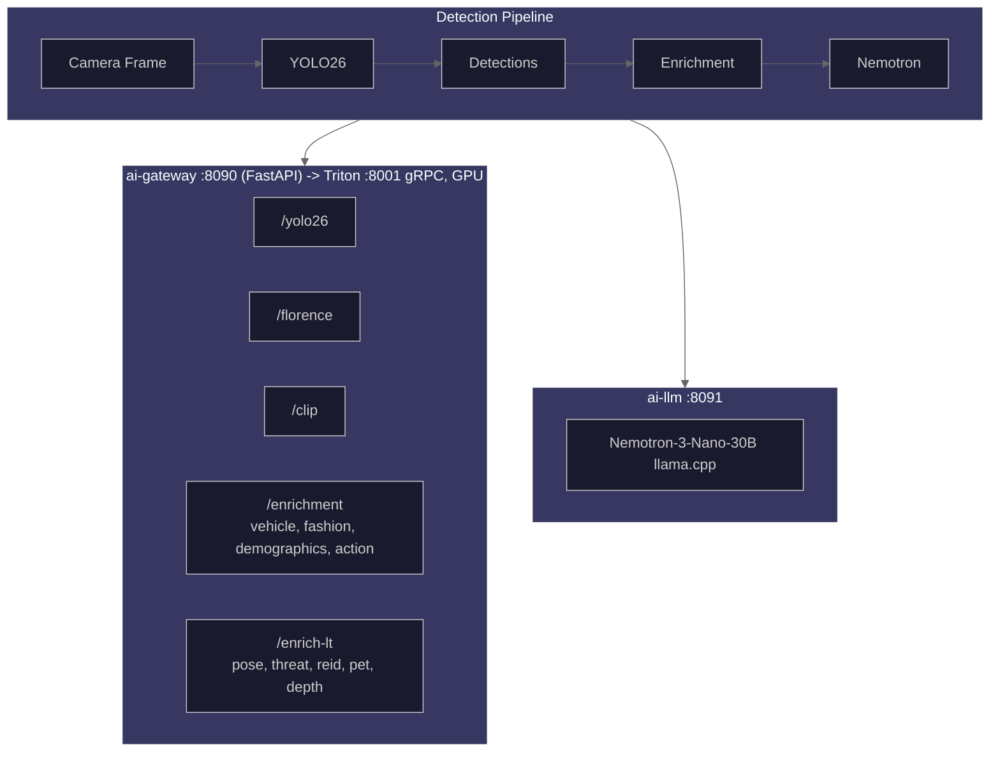
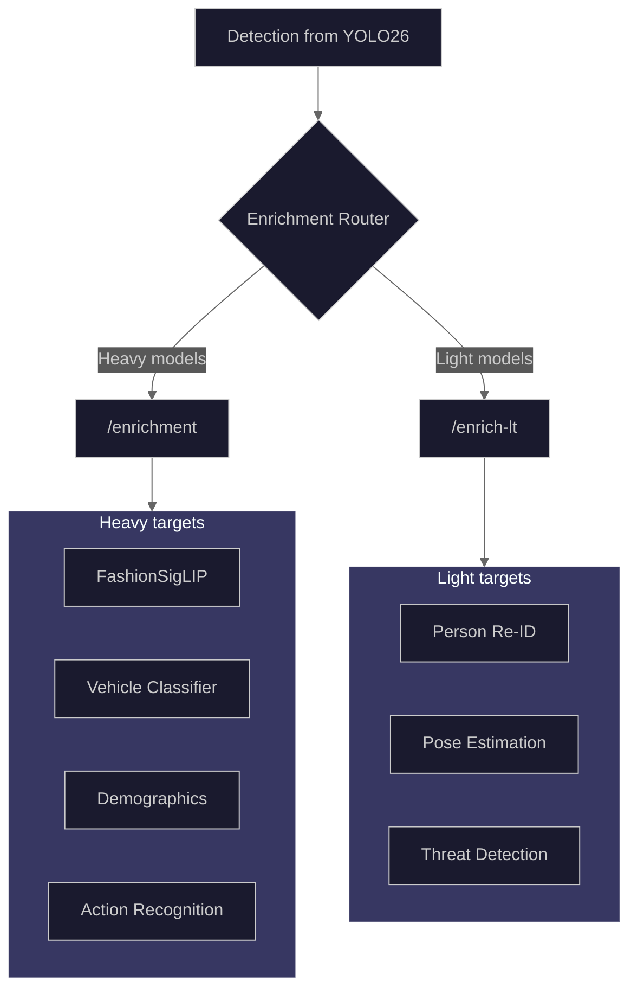
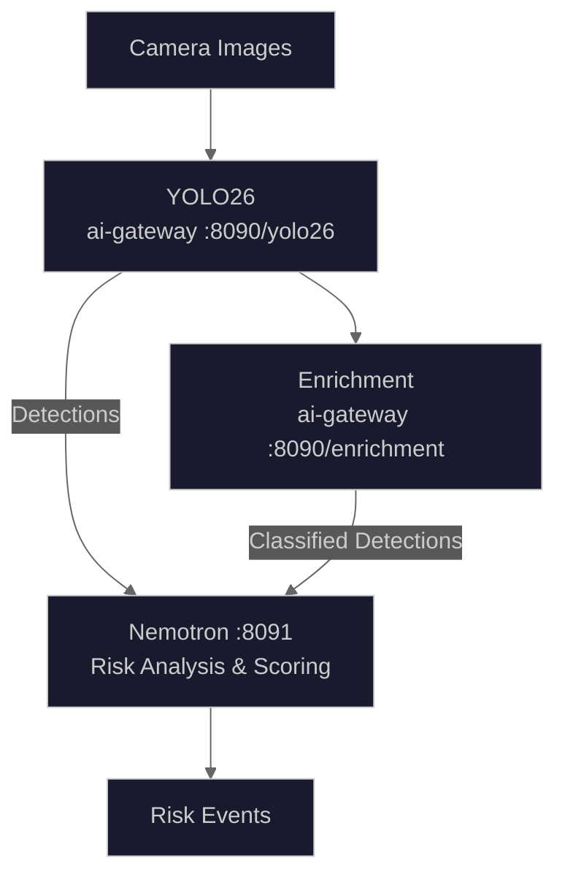
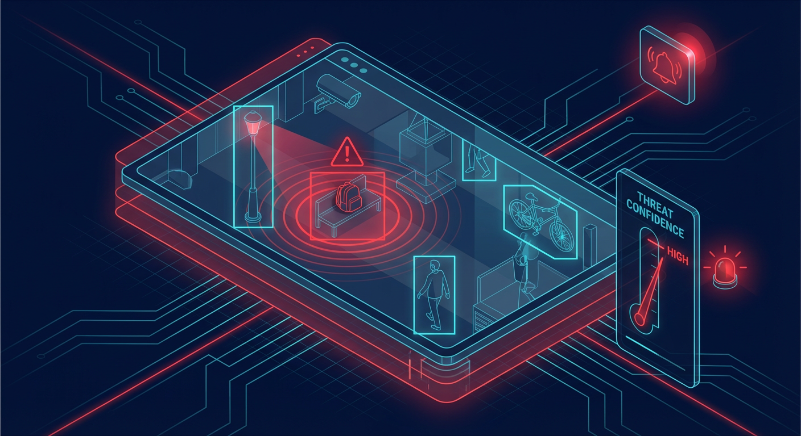
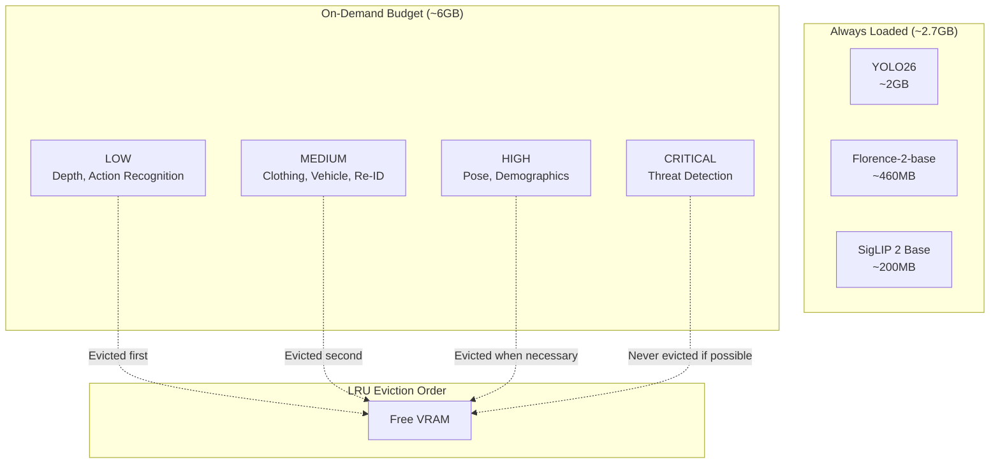

# AI Model Zoo Architecture

## Overview

The AI model zoo provides comprehensive visual analysis for home security through multiple specialized models working together.

Two inference runtimes exist in this repo, and only one runs in production:

1. **`ai-gateway`** — the deployment topology in `docker-compose.prod.yml`. One
   container (port 8090) fronts NVIDIA Triton with a FastAPI translation layer
   and serves YOLO26, Florence-2, CLIP and both enrichment tiers under router
   prefixes. See [ai/gateway/AGENTS.md](../../ai/gateway/AGENTS.md).
2. **Legacy per-model containers** — `ai-florence`, `ai-clip`, `ai-enrichment`
   and `ai-enrichment-light`. Each loads its models on demand under a VRAM
   budget with LRU eviction. The `ai-florence`, `ai-clip` and `ai-enrichment`
   images are still built by `.github/workflows/deploy.yml` (only
   `ai-enrichment-light` survives as a source directory, with no deploy.yml
   matrix entry), but none of these are services in
   `docker-compose.prod.yml`. `ai-yolo26` was in this list until its image was
   retired fully on 2026-09-23 — recipe at `archive/ai-yolo26-image/Dockerfile`.

The sections below give the production router path for each model first, and
note the legacy container's port and response shape where the two differ. The
on-demand loading machinery in [VRAM Management](#vram-management) applies
only to the legacy containers and to the backend's own model zoo.

## Architecture Diagram

Current production topology:


```mermaid
%%{init: {
  'theme': 'dark',
  'themeVariables': {
    'primaryColor': '#3B82F6',
    'primaryTextColor': '#FFFFFF',
    'primaryBorderColor': '#60A5FA',
    'secondaryColor': '#A855F7',
    'tertiaryColor': '#009688',
    'background': '#121212',
    'mainBkg': '#1a1a2e',
    'lineColor': '#666666'
  }
}}%%
flowchart TB
    subgraph Pipeline["Detection Pipeline"]
        CAM[Camera Frame] --> YOLO[YOLO26]
        YOLO --> DET[Detections]
        DET --> ENR[Enrichment]
        ENR --> NEM[Nemotron]
    end

    subgraph GW["ai-gateway :8090 (FastAPI) -> Triton :8001 gRPC, GPU"]
        YR["/yolo26"]
        FR["/florence"]
        CR["/clip"]
        HR["/enrichment<br/>vehicle, fashion, demographics, action"]
        LR["/enrich-lt<br/>pose, threat, reid, pet, depth"]
    end

    subgraph LLM["ai-llm :8091"]
        NEMC[Nemotron-3-Nano-30B llama.cpp]
    end

    Pipeline --> GW
    Pipeline --> LLM
```

## Service Architecture

### Services In Production (`docker-compose.prod.yml`)

| Service            | Container     | Port | Models                                                |
| ------------------ | ------------- | ---- | ----------------------------------------------------- |
| AI Gateway         | `ai-gateway`  | 8090 | YOLO26, Florence-2, SigLIP 2, all enrichment models   |
| AI Gateway metrics | `ai-gateway`  | 8002 | Triton + gateway Prometheus metrics                   |
| LLM                | `ai-llm`      | 8091 | Nemotron-3-Nano-30B-A3B (llama.cpp)                   |
| LLM (optional)     | `ai-llm-vllm` | 8097 | vLLM variant (`VLLM_PORT`), behind the `vllm` profile |

Port variables come from `.env`: `AI_GATEWAY_PORT`,
`AI_GATEWAY_METRICS_PORT` and `LLM_PORT`.

### How The Backend Reaches Each Model

`USE_AI_GATEWAY=true` in `.env.example` and in the compose backend environment
selects the gateway. The base URLs in `.env.example` carry the router prefix:

| Variable               | Default                            |
| ---------------------- | ---------------------------------- |
| `YOLO26_URL`           | `http://localhost:8090/yolo26`     |
| `FLORENCE_URL`         | `http://localhost:8090/florence`   |
| `CLIP_URL`             | `http://localhost:8090/clip`       |
| `ENRICHMENT_URL`       | `http://localhost:8090/enrichment` |
| `ENRICHMENT_LIGHT_URL` | `http://localhost:8090/enrich-lt`  |
| `NEMOTRON_URL`         | `http://localhost:8091`            |

### Legacy Enrichment Split

The legacy containers still split enrichment models across two services by GPU
requirement, and `ENRICHMENT_<TASK>_SERVICE` in `.env` still routes between
heavy and light:

| Service                 | Port | Target GPU   | Models                                |
| ----------------------- | ---- | ------------ | ------------------------------------- |
| **ai-enrichment**       | 8094 | GPU 0 (24GB) | Vehicle, fashion, age, gender, action |
| **ai-enrichment-light** | 8096 | GPU 1 (4GB)  | Pose, threat, reid, pet, depth        |

The same variable names control the gateway, where "heavy" and "light" select
the `/enrichment` and `/enrich-lt` routers rather than separate GPUs. See
[AI Enrichment Light Service](../operator/services/ai-enrichment-light.md) for
the legacy service documentation.

### Enrichment Pipeline Split

The backend routes each detection to either the heavy or the light target. In
the legacy deployment those land on two different GPUs with different VRAM
budgets; in the gateway deployment they are two routers over one Triton
instance.


```mermaid
%%{init: {
  'theme': 'dark',
  'themeVariables': {
    'primaryColor': '#3B82F6',
    'primaryTextColor': '#FFFFFF',
    'primaryBorderColor': '#60A5FA',
    'secondaryColor': '#A855F7',
    'tertiaryColor': '#009688',
    'background': '#121212',
    'mainBkg': '#1a1a2e',
    'lineColor': '#666666'
  }
}}%%
flowchart TB
    DET[Detection from YOLO26] --> ROUTER{Enrichment Router}
    ROUTER -->|Heavy models| HEAVY["/enrichment"]
    ROUTER -->|Light models| LIGHT["/enrich-lt"]
    subgraph HEAVY_SVC["Heavy targets"]
        FC[FashionSigLIP]
        VC[Vehicle Classifier]
        DM[Demographics]
        XC[Action Recognition]
    end
    subgraph LIGHT_SVC["Light targets"]
        PR[Person Re-ID]
        PE[Pose Estimation]
        TD[Threat Detection]
    end
    HEAVY --> HEAVY_SVC
    LIGHT --> LIGHT_SVC
```

### Data Flow


```mermaid
%%{init: {
  'theme': 'dark',
  'themeVariables': {
    'primaryColor': '#3B82F6',
    'primaryTextColor': '#FFFFFF',
    'primaryBorderColor': '#60A5FA',
    'secondaryColor': '#A855F7',
    'tertiaryColor': '#009688',
    'background': '#121212',
    'mainBkg': '#1a1a2e',
    'lineColor': '#666666'
  }
}}%%
flowchart TB
    CAM[Camera Images]
    CAM --> YOLO["YOLO26<br/>ai-gateway :8090/yolo26"]
    YOLO --> ENR["Enrichment<br/>ai-gateway :8090/enrichment"]
    YOLO -->|Detections| NEM
    ENR -->|Classified Detections| NEM
    NEM["Nemotron :8091<br/>Risk Analysis & Scoring"]
    NEM --> EVT[Risk Events]
```

## Model Details

### Always-Loaded Models

#### YOLO26 (gateway router `/yolo26`)

In production the gateway serves this model at
`http://localhost:8090/yolo26` (Triton name `yolo26`). The legacy standalone
container answered on port 8095.

- **Model**: YOLO26m (Ultralytics with TensorRT)
- **Architecture**: YOLO26 object detection with TensorRT FP16 optimization
- **VRAM**: ~2GB (with TensorRT FP16 engine)
- **Inference Time**: 10-20ms (FP16 TensorRT)
- **Output**: Bounding boxes with class labels and confidence scores

**Security Classes (Filtered)**:

```python
SECURITY_CLASSES = {"person", "car", "truck", "dog", "cat", "bird", "bicycle", "motorcycle", "bus"}
```

**API Endpoints** (under the `/yolo26` router):

- `GET /yolo26/health` - Health status
- `POST /yolo26/detect` - Single image detection
- `POST /yolo26/detect/batch` - Batch detection

#### Florence-2 (gateway router `/florence`)

In production the gateway serves `florence-2-base` (`microsoft/Florence-2-base`
in `models.yml`, Triton name `florence2`) at
`http://localhost:8090/florence`. The legacy standalone container loaded
Florence-2-large and answered on port 8092.

- **Architecture**: Vision-language transformer
- **VRAM**: ~1GB download (`size_mb: 1024` in `models.yml`)
- **Inference Time**: 100-300ms per query
- **Tasks**: Caption, Dense Region Caption, OCR, Open Vocabulary Detection

**Supported Prompts**:

| Prompt                   | Output              | Use Case              |
| ------------------------ | ------------------- | --------------------- |
| `<CAPTION>`              | Brief description   | Quick scene summary   |
| `<DETAILED_CAPTION>`     | Detailed paragraph  | Event logging         |
| `<OD>`                   | Objects with bboxes | Object localization   |
| `<DENSE_REGION_CAPTION>` | Caption per region  | Scene understanding   |
| `<OCR>`                  | Detected text       | License plates, signs |
| `<OCR_WITH_REGION>`      | Text with bboxes    | Text localization     |

**API Endpoints** (under the `/florence` router, `ai/gateway/adapters/florence.py`):

- `GET /florence/health` - Health status
- `POST /florence/extract` - Generic extraction with prompt
- `POST /florence/batch-extract` - Multiple prompts in one call
- `POST /florence/ocr` - Text extraction
- `POST /florence/ocr-with-regions` - Text with bounding boxes
- `POST /florence/detect` - Object detection
- `POST /florence/dense-caption` - Region captioning
- `POST /florence/describe-region` - Caption one region
- `POST /florence/phrase-grounding` - Ground a phrase to boxes
- `POST /florence/detect_security_objects` - Pre-formatted security prompt

#### CLIP (gateway router `/clip`)

In production the gateway serves **SigLIP 2 Base**
(`onnx-community/siglip2-base-patch16-224-ONNX`, registered in `models.yml`
under the Triton names `clip` and `clip_text`) at
`http://localhost:8090/clip`. The legacy standalone container loaded
`openai/clip-vit-large-patch14` and answered on port 8093.

- **Architecture**: Vision-Language contrastive model (ONNX)
- **VRAM**: 200MB (`vram_mb` in `models.yml`)
- **Embedding Dimension**: 768
- **Output**: Normalized image embeddings, similarity scores

The `clip_text` half runs on CPU: it is a quantized INT8 model whose
MatMulInteger ops block the CUDA execution provider (comment in `models.yml`).

**Use Cases**:

- Entity re-identification across cameras
- Scene anomaly detection via baseline comparison
- Zero-shot classification

**API Endpoints** (under the `/clip` router, `ai/gateway/adapters/clip.py`):

- `GET /clip/health` - Health status
- `POST /clip/embed` - Generate 768-dim embedding
- `POST /clip/anomaly-score` - Compare to baseline
- `POST /clip/classify` - Zero-shot classification
- `POST /clip/similarity` - Image-text similarity
- `POST /clip/batch-similarity` - Batch similarity comparison

#### Nemotron (ai-llm:8091)

**Production Model:**

- **Model**: nvidia/Nemotron-3-Nano-30B-A3B-GGUF (Q4_K_M quantization)
- **Architecture**: Large Language Model via llama.cpp with Mixture-of-Experts (MoE) routing
- **Parameters**: 30 billion (A3B active routing variant)
- **VRAM**: ~14.7GB
- **Context Window**: `CTX_SIZE=262144` in `.env.example` (llama.cpp splits it
  across `PARALLEL=8` slots of 32,768 tokens each)
- **GPU Layers**: `GPU_LAYERS=auto` — llama.cpp `--fit` decides based on free VRAM
- **Purpose**: Risk reasoning, threat analysis, natural language generation

**Development Model (resource-constrained environments):**

- **Model**: bartowski/nemotron-mini-4b-instruct-GGUF (Q4_K_M quantization)
- **Parameters**: 4 billion
- **VRAM**: ~3GB
- **Context Window**: 4,096 tokens

**Risk Score Ranges**:

<!-- prettier-ignore-start -->
--8<-- "docs/_includes/risk-scoring-levels.md"
<!-- prettier-ignore-end -->

### On-Demand Models (Enrichment Services)

Every model in this section is registered in `models.yml` with
`priority: medium` except `smoke-fire-yolov8n`, which is
`priority: critical` with preload and never-evict set. In the gateway
deployment Triton loads the enrichment models at container start, so the
headings below describe which router answers each request, not a load-on-demand
order. Under the legacy containers the manager evicted models by LRU within a
budget — see [VRAM Management](#vram-management).

The legacy containers split the models across two services:

- **ai-enrichment** (port 8094): Heavy transformer models running on GPU 0 (~6.8GB budget, `VRAM_BUDGET_GB` default in `ai/enrichment/model.py`)
- **ai-enrichment-light** (port 8096): Small efficient models running on GPU 1

In production the same split survives as two routers on one gateway:
`/enrichment` and `/enrich-lt`. The backend still picks between them with the
`ENRICHMENT_*_SERVICE` environment variables (e.g.
`ENRICHMENT_POSE_SERVICE=light` in `docker-compose.prod.yml`).

#### Threat Detection



- **Model**: Subh775/Threat-Detection-YOLOv8n (`triton_name: threat`)
- **VRAM**: 300MB (`vram_mb` in `models.yml`)
- **Served at**: `POST http://localhost:8090/enrich-lt/threat-detect`
- **Purpose**: Detect weapons (knives, guns, bats — classes per the `models.yml`
  description)
- **Trigger**: Person detections in security-sensitive contexts

**Input**: Cropped person image.
**Output** (`ThreatResponse` in `ai/gateway/adapters/enrichment_light.py`):

```json
{
  "threats_detected": [{ "class": "knife", "confidence": 0.89, "bbox": [...] }],
  "is_threat": true,
  "max_confidence": 0.89,
  "inference_time_ms": 12.4
}
```

The legacy container returned a different shape (`detected`, `threat_type`,
`severity` per threat — `ThreatDetectionResult` in
`ai/enrichment/models/threat_detector.py`).

#### Pose Estimation

- **Model**: YOLOv8n-pose (`triton_name: pose`, 200MB in `models.yml`).
  `vitpose-small` also ships in `models.yml` (1.5GB, backend service);
  `ai/enrichment/vitpose.py` is the legacy container's analyzer.
- **Served at**: `POST http://localhost:8090/enrich-lt/pose-analyze` (a second
  `POST /enrichment/pose-analyze` exists on the heavy router)
- **Purpose**: Body pose detection, posture classification
- **Trigger**: Person detections
- **Output**: 17 COCO keypoints per person (`num_people` beside them)

**COCO Keypoints**:

```python
COCO_KEYPOINT_NAMES = [
    "nose",
    "left_eye",
    "right_eye",
    "left_ear",
    "right_ear",
    "left_shoulder",
    "right_shoulder",
    "left_elbow",
    "right_elbow",
    "left_wrist",
    "right_wrist",
    "left_hip",
    "right_hip",
    "left_knee",
    "right_knee",
    "left_ankle",
    "right_ankle",
]
```

**Posture Classifications** (`_derive_posture` in
`ai/gateway/adapters/enrichment_light.py`): standing, crouching, lying,
bending, unknown

**Security Alerts** the gateway emits from a posture:

- `crouching` - "Person is crouching - potentially hiding or concealing activity"
- `lying` - "Person is lying down - possible medical emergency or unusual behavior"

The legacy container classified more postures (running, reaching_up and
others — `ai/enrichment/models/pose_estimator.py`).

#### Demographics

- **Models**: `nateraw/vit-age-classifier` + `rizvandwiki/gender-classification`
  (Triton names `demographics_age` and `demographics_gender`, 200MB each in
  `models.yml`)
- **Served at**: `POST http://localhost:8090/enrichment/demographics`
- **Purpose**: Age range and gender estimation from face crops
- **Trigger**: Person detections with visible face

**Input**: Cropped face image.
**Output**:

```json
{
  "age_range": "21-30",
  "age_confidence": 0.82,
  "gender": "male",
  "gender_confidence": 0.94,
  "inference_time_ms": 22.1
}
```

The gateway maps model class indices onto `0-10, 11-20, 21-30, 31-40, 41-50,
51-60, 61-70, 71+` (`ai/gateway/adapters/enrichment.py`). The legacy
`AGE_RANGES` list in `ai/enrichment/models/demographics.py` is a different
vocabulary (21-35, 36-50, 51-65, 65+ among them).

#### Clothing Analysis

- **Model**: Marqo/marqo-fashionSigLIP (FashionSigLIP) - `models.yml`
  describes the upgrade from FashionCLIP as +57%
- **VRAM**: 500MB (`vram_mb` in `models.yml`)
- **Served at**: `POST http://localhost:8090/enrichment/clothing-classify`
- **Purpose**: Identify clothing types, uniforms, suspicious attire
- **Trigger**: Person detections

**Security-Focused Prompts**:

```python
SECURITY_CLOTHING_PROMPTS = [
    "person wearing dark hoodie",
    "person wearing face mask",
    "person wearing ski mask or balaclava",
    "delivery uniform",
    "Amazon delivery vest",
    "FedEx uniform",
    "UPS uniform",
    "USPS postal worker uniform",
    "casual clothing",
    "business attire or suit",
    ...,
]
```

**Output**:

```json
{
  "clothing_type": "hoodie",
  "color": "dark",
  "style": "suspicious",
  "confidence": 0.85,
  "is_suspicious": true,
  "is_service_uniform": false
}
```

#### Vehicle Classification

- **Model**: AventIQ-AI/ResNet-50-Vehicle-Segment-classification (`models.yml`;
  Triton name `vehicle`) — ResNet-50 over the MIO-TCD segments
- **VRAM**: 1.5GB (`vram_mb` in `models.yml`)
- **Served at**: `POST http://localhost:8090/enrichment/vehicle-classify`
- **Purpose**: Vehicle type identification
- **Trigger**: Vehicle detections (car, truck, bus, motorcycle, bicycle)

**Vehicle Classes**:

```python
VEHICLE_SEGMENT_CLASSES = [
    "articulated_truck",
    "background",
    "bicycle",
    "bus",
    "car",
    "motorcycle",
    "non_motorized_vehicle",
    "pedestrian",
    "pickup_truck",
    "single_unit_truck",
    "work_van",
]
```

**Output**:

```json
{
  "vehicle_type": "pickup_truck",
  "display_name": "pickup truck",
  "confidence": 0.92,
  "is_commercial": false
}
```

#### Pet Classification

- **Model**: microsoft/resnet-18 (`triton_name: pet`)
- **VRAM**: 200MB (`vram_mb` in `models.yml`)
- **Served at**: `POST http://localhost:8090/enrichment/pet-classify`
  (also `POST /enrich-lt/pet-classify`)
- **Purpose**: Dog/cat classification for false positive reduction (breed is a
  passthrough field the classifier does not infer)
- **Trigger**: Animal detections (dog, cat)

**Output**:

```json
{
  "pet_type": "dog",
  "breed": "unknown",
  "confidence": 0.98,
  "is_household_pet": true
}
```

#### Person Re-ID

- **Model**: OSNet-AIN x1.0 (`osnet-ain-x1-0` in `models.yml`, Triton name
  `reid`)
- **VRAM**: 100MB (`vram_mb` in `models.yml`)
- **Served at**: `POST http://localhost:8090/enrich-lt/person-reid`
- **Purpose**: Generate 512-dimensional embeddings for tracking individuals
- **Trigger**: Person detections requiring cross-camera tracking

**Output**:

```json
{
  "embedding": [0.123, -0.456, ...],  // 512 floats
  "embedding_dimension": 512
}
```

#### Vehicle Damage Detection

- **Model**: harpreetsahota/car-dd-segmentation-yolov11 (YOLOv11x-seg)
- **VRAM**: 2GB (`vram_mb` in `models.yml`)
- **Where it runs**: the backend model zoo — `service: backend` in `models.yml`,
  so the gateway does not serve it
- **Purpose**: Detect and segment vehicle damage for security analysis
- **Trigger**: Vehicle detections (car, truck, bus, motorcycle)
- **License**: AGPL-3.0

**Damage Classes**:

```python
DAMAGE_CLASSES = [
    "crack",  # Surface cracks in paint/body
    "dent",  # Impact dents on body panels
    "glass_shatter",  # Broken/shattered glass (HIGH SECURITY)
    "lamp_broken",  # Damaged headlights/taillights (HIGH SECURITY)
    "scratch",  # Surface scratches on paint
    "tire_flat",  # Flat or damaged tires
]
```

**High-Security Damage Types**:

| Damage Type     | Security Implication                                  |
| --------------- | ----------------------------------------------------- |
| `glass_shatter` | Possible break-in attempt, vandalism, or collision    |
| `lamp_broken`   | Possible vandalism, hit-and-run, or deliberate damage |

**Input**: Cropped vehicle image from YOLO26 detection

**Output**:

```json
{
  "detections": [
    {
      "damage_type": "glass_shatter",
      "confidence": 0.87,
      "bbox": {
        "x1": 120.5,
        "y1": 80.2,
        "x2": 180.3,
        "y2": 150.8
      },
      "has_mask": true,
      "mask_area": 2450
    }
  ],
  "damage_types": ["glass_shatter", "dent"],
  "has_high_security_damage": true,
  "total_damage_count": 2,
  "highest_confidence": 0.87
}
```

**Security Alert Pattern Detection**:

The model includes pattern analysis for identifying suspicious damage:

```python
# Suspicious patterns that trigger elevated alerts
- glass_shatter + lamp_broken = "break-in pattern"
- Night time (22:00-06:00) + any damage = "elevated risk"
- Multiple damage types (>=2) = "likely incident"
- High-security damage at night = "critical alert"
```

**Context String for LLM**:

```
Vehicle Damage Detected (2 instances):
  - glass_shatter: 1 instance(s) (avg conf: 87%)
  - dent: 1 instance(s) (avg conf: 72%)
  **HIGH SECURITY ALERT**: Suspicious damage types detected
```

**Source Files**:

- Loader: `backend/services/vehicle_damage_loader.py`
- Model Zoo Entry: `backend/services/model_zoo.py`

#### Depth Estimation

- **Model**: `depth-anything/Depth-Anything-V2-Small-hf`, shipped as
  `depth-anything-v2-tiny` in `models.yml` (Triton name `depth`)
- **VRAM**: 100MB (`vram_mb` in `models.yml`)
- **Served at**: `POST http://localhost:8090/enrich-lt/depth-estimate`
- **Purpose**: Spatial reasoning, distance estimation
- **Trigger**: Detections requiring distance context

**Output** (`DepthResponse` in `ai/gateway/adapters/enrichment_light.py`):

```json
{
  "depth_map_base64": "<base64-png>",
  "min_depth": 0.8,
  "max_depth": 12.4,
  "mean_depth": 3.5,
  "inference_time_ms": 18.2
}
```

The legacy container returned `estimated_distance_m`, `relative_depth` and
`proximity_label` instead (`/object-distance` and `/depth-estimate` in
`ai/enrichment/model.py`).

#### Action Recognition

- **Model**: `stgcn-plus-plus` in `models.yml` — ONNX export of pyskl ST-GCN++
  (`stgcnpp_ntu60_xsub_hrnet_j.pth`, OpenMMLab), served by Triton as
  `stgcn_action` (`ai/triton/model_repository/stgcn_action/config.pbtxt`,
  ONNX Runtime, `KIND_CPU`). Skeleton-based: it classifies the 60 NTU RGB+D 60
  action classes from COCO 17-joint pose tracks, not from image features.
  `models.yml` still carries the superseded `xclip-base` entry with
  `enabled: false` and a "replaced by stgcn-plus-plus" note.
- **Footprint**: ~14MB ONNX weights (`size_mb: 20`, `vram_mb: 20`,
  `triton_kind: KIND_CPU` in `models.yml` — CPU-only, no GPU allocation)
- **Served at**: `POST http://localhost:8090/enrichment/action-classify`
  (the `enrichment` router, mounted under the `/enrichment` prefix in
  `ai/gateway/main.py`; `ALL_MODELS` waits for `stgcn_action`). The backend
  reaches it via `EnrichmentClient.classify_action()`
  (`backend/services/enrichment_client.py`).
- **Purpose**: Temporal action classification from a buffered frame sequence
- **Trigger**: Person detection with `action_recognition_enabled` and more than
  one buffered frame (`backend/services/enrichment_pipeline.py`)

**Input**: `{"frames": ["<base64>", …], "top_k": 5}` — a JSON array of base64
frames. `_infer_action()` (`ai/gateway/adapters/enrichment.py`) runs each frame
through the Triton `pose` model, keeps the highest-confidence person's 17 COCO
keypoints per frame, resamples the track to 100 frames and pads a second
person slot with zeros, then feeds the resulting `(1, 2, 100, 17, 3)` tensor to
`stgcn_action`. The label set is fixed to NTU RGB+D 60 — the endpoint accepts no
zero-shot prompts. Frames with no person anywhere in the sequence return
`action: "unknown"` with `risk_weight: 0.2` and skip inference.

**Output** shape (`ActionClassifyResponse`; `all_scores` holds the `top_k`
classes, `is_suspicious` and `risk_weight: 0.8` mark the security-relevant
classes — falling plus the violence/pickpocketing indices):

```json
{
  "action": "falling",
  "confidence": 0.87,
  "is_suspicious": true,
  "risk_weight": 0.8,
  "all_scores": {
    "falling": 0.87,
    "staggering": 0.08,
    "nod head/bow": 0.03,
    "pickup": 0.02
  },
  "inference_time_ms": 12.4
}
```

**Retired**: The X-CLIP Triton model `xclip_action` has been retired from
`ai/triton/model_repository/` — its `config.pbtxt` and model directory now live
at `archive/triton-model-repository/xclip_action/` pending a provenance ruling.
It is absent from `ALL_MODELS` and from the gateway adapters, so the gateway's
serving path is fully on `stgcn_action`. No live X-CLIP code remains anywhere
else either: the enrichment container's `action_recognizer` was retired to
`archive/ai-enrichment/` (NEM-5563) and the backend-side
`xclip_loader.py` / `action_recognition_service.py` chain — including its
deprecated pipeline fallback and the `/api/action-events` analyze endpoint —
was archived to `archive/xclip-backend-chain/` on 2026-09-23. What's left is
configuration provenance only: the `xclip-base` entry in `models.yml`
(`enabled: false`, owner-owned) and the independent X-CLIP _prompt_ subsystem
(`prompt_management`/`prompt_storage` still serve stored X-CLIP class lists,
which is a prompt-config surface, not an inference path).

## VRAM Management


This section describes the on-demand loading machinery in
`ai/enrichment/model_manager.py` (legacy containers) and
`backend/services/model_zoo.py` (backend). The gateway does not run it: Triton
loads `ALL_MODELS` (in `ai/gateway/main.py`) at container start.

### On-Demand Loading Architecture

The `OnDemandModelManager` class manages GPU memory efficiently:

```python
class OnDemandModelManager:
    def __init__(self, vram_budget_gb: float = 6.8):
        self.vram_budget = vram_budget_gb * 1024  # MB
        self.loaded_models = OrderedDict()  # LRU tracking
        self.model_registry = {}
```

### Loading Algorithm

1. Request comes in requiring a model
2. If model loaded, use it and update last-used timestamp
3. If not loaded, check VRAM budget
4. If over budget, evict LRU models (respecting priority)
5. Load requested model

### Priority System

Priorities below are the ones in the legacy registry
(`ai/enrichment/model_registry.py`). The `priority` field in `models.yml`
(which drives backend model_zoo eviction) is `medium` for every model except
`smoke-fire-yolov8n`, which is `critical`.

| Priority | Value | Legacy Registry Models          | Eviction Behavior                         |
| -------- | ----- | ------------------------------- | ----------------------------------------- |
| CRITICAL | 0     | Threat Detection                | Never evicted unless absolutely necessary |
| HIGH     | 1     | Pose, Demographics              | Evicted only when VRAM critical           |
| MEDIUM   | 2     | Vehicle, Pet, Re-ID, Clothing   | Standard LRU eviction                     |
| LOW      | 3     | Depth, Action, YOLO26 secondary | Evicted first                             |

### VRAM Allocation and Eviction Overview

The following diagram shows the two-tier VRAM architecture: always-loaded core models consume a fixed budget, while on-demand models share a dynamic budget and are evicted in LRU order respecting priority levels.


```mermaid
flowchart TB
    subgraph Always["Always Loaded (~2.7GB)"]
        Y["YOLO26<br/>~2GB"]
        F["Florence-2-base<br/>~460MB"]
        C["SigLIP 2 Base<br/>~200MB"]
    end
    subgraph Budget["On-Demand Budget (~6GB)"]
        CRIT["CRITICAL<br/>Threat Detection"]
        HIGH["HIGH<br/>Pose, Demographics"]
        MED["MEDIUM<br/>Clothing, Vehicle, Re-ID"]
        LOW["LOW<br/>Depth, Action Recognition"]
    end
    subgraph Eviction["LRU Eviction Order"]
        LOW -.->|Evicted first| FREE[Free VRAM]
        MED -.->|Evicted second| FREE
        HIGH -.->|Evicted when necessary| FREE
        CRIT -.->|Never evicted if possible| FREE
    end
```

### Eviction Strategy

Models are sorted by `(priority descending, last_used ascending)`:

- Higher priority numbers (LOW=3) evicted before lower (CRITICAL=0)
- Among same priority, oldest (least recently used) evicted first

```python
candidates = sorted(
    self.loaded_models.items(),
    key=lambda x: (-x[1].priority, x[1].last_used),
)
```

### VRAM Budget Calculation

Based on actual values from `backend/services/model_zoo.py`:

The header of `backend/services/model_zoo.py` states the backend's own budget:
Nemotron LLM 21,700 MB and YOLO26v2 650 MB always loaded, ~1,650 MB left for
model-zoo models, loaded sequentially rather than concurrently.

**Backend model-zoo VRAM (`vram_mb` in `models.yml`):**

| Model                          | VRAM                                                       |
| ------------------------------ | ---------------------------------------------------------- |
| siglip2-base-patch16-224       | 200MB                                                      |
| vehicle-segment-classification | 1.5GB                                                      |
| pet-classifier                 | 200MB                                                      |
| depth-anything-v2-tiny         | 100MB                                                      |
| osnet-ain-x1-0                 | 100MB                                                      |
| yolov8n-pose                   | 200MB                                                      |
| threat-detection-yolov8n       | 300MB                                                      |
| vit-age-classifier             | 200MB                                                      |
| vit-gender-classifier          | 200MB                                                      |
| stgcn-plus-plus                | 20MB                                                       |
| xclip-base                     | 0 (`enabled: false`, superseded by `stgcn-plus-plus`)      |
| weather-classification         | 200MB                                                      |
| violence-detection             | 500MB                                                      |
| fashion-clip (FashionSigLIP)   | 500MB                                                      |
| yolo11-face                    | 200MB                                                      |
| yolo11-license-plate           | 300MB                                                      |
| smoke-fire-yolov8n             | 350MB                                                      |
| yolo-world-s                   | 1.5GB                                                      |
| zero-dce-plus-plus             | 5MB (`enabled: false`)                                     |
| vitpose-small                  | 1.5GB                                                      |
| segformer-b2-clothes           | 1.5GB                                                      |
| vehicle-damage-detection       | 2GB                                                        |
| brisque-quality                | 0MB (CPU)                                                  |
| fast-alpr                      | 28MB                                                       |
| paddleocr                      | 100MB                                                      |
| florence-2-large               | 1.2GB (`enabled: false` - runs as a gateway model instead) |

## API Reference

### Unified Enrichment Endpoint

Production (gateway):

```
POST http://localhost:8090/enrich/enrich
```

**Request** (`EnrichRequest` in `ai/gateway/adapters/enrichment.py`):

```json
{
  "image": "<base64>",
  "detection_type": "person",
  "bbox": { "x": 0, "y": 0, "width": 100, "height": 100 },
  "extra": {}
}
```

**Response** (`EnrichmentResponse`): a `detection_type`, an `enrichments` object
whose keys depend on the detection type, and `inference_time_ms`.

Legacy container (`POST http://ai-enrichment:8094/enrich`, still built):

**Request** takes `image`, `detection_type`, `bbox`, `frames` and an `options`
object (`action_recognition`, `include_depth`). Its response has one named field
per result (`pose`, `clothing`, `demographics`, `threat`, `reid_embedding`,
`vehicle`, `pet`, `action`, `depth`, `models_used`, `inference_time_ms` -
`EnrichmentResponse` in `ai/enrichment/model.py`).

### Model Status Endpoint

```
GET http://ai-enrichment:8094/models/status
```

Legacy container only (`SystemStatus` in `ai/enrichment/model.py`). In a
gateway deployment the backend exposes model status instead:
`GET http://localhost:8000/api/system/models` and
`/api/system/models/vram-summary`.

**Response**:

```json
{
  "vram_budget_mb": 6963.2,
  "vram_used_mb": 2300,
  "vram_available_mb": 4663.2,
  "vram_utilization_percent": 33.0,
  "loaded_models": [
    {
      "name": "fashion_clip",
      "vram_mb": 800,
      "priority": "HIGH",
      "last_used": "2024-01-15T10:30:00Z"
    }
  ],
  "registered_models": [
    {
      "name": "vehicle_classifier",
      "vram_mb": 1500,
      "priority": "MEDIUM",
      "loaded": false
    }
  ],
  "pending_loads": []
}
```

### Model Preload Endpoint

Legacy container only.

```
POST http://ai-enrichment:8094/models/preload?model_name=threat_detector
```

**Response**:

```json
{
  "success": true,
  "model_name": "threat_detector",
  "vram_mb": 400,
  "load_time_ms": 1250.5
}
```

### Individual Classification Endpoints

Gateway routers (base `http://localhost:8090`, adapters in
`ai/gateway/adapters/`):

| Endpoint                        | Method | Purpose                                 |
| ------------------------------- | ------ | --------------------------------------- |
| `/health`                       | GET    | Gateway health (Triton model readiness) |
| `/enrichment/vehicle-classify`  | POST   | Vehicle type classification             |
| `/enrichment/clothing-classify` | POST   | Clothing analysis                       |
| `/enrichment/demographics`      | POST   | Age + gender estimation                 |
| `/enrichment/action-classify`   | POST   | Video action recognition                |
| `/enrichment/pet-classify`      | POST   | Pet type classification                 |
| `/enrichment/depth-estimate`    | POST   | Depth map                               |
| `/enrichment/pose-analyze`      | POST   | Human pose keypoints                    |
| `/enrich-lt/pose-analyze`       | POST   | Pose + posture + alerts                 |
| `/enrich-lt/threat-detect`      | POST   | Weapon detection                        |
| `/enrich-lt/person-reid`        | POST   | 512-dim re-ID embedding                 |
| `/enrich-lt/pet-classify`       | POST   | Pet type classification                 |
| `/enrich-lt/depth-estimate`     | POST   | Depth map (min/max/mean)                |

The legacy container answers the same names un-prefixed on port 8094, plus
`/object-distance`, `/models/unload` and `/models/registry`, which have no
gateway equivalent. The gateway has no `/models/status` or preload route:
Triton owns loading there.

## Enrichment Result Schema

The enrichment pipeline returns structured results for each detection. These results are stored alongside detections and used by Nemotron for comprehensive risk analysis.

### EnrichmentResult Structure

The backend's `EnrichmentResult` (`backend/services/enrichment_pipeline.py`)
aggregates per-batch enrichment outputs: `license_plates`, `faces`,
`vision_extraction` (Florence-2), `person_reid_matches`,
`vehicle_reid_matches`, `person_household_matches`,
`vehicle_household_matches`, `scene_change`, `violence_detection`,
`weather_classification`, structured error lists and `processing_time_ms`.
Per-detection model results (pose, demographics, embeddings, ...) are stored
on the detection's `enrichment_data` rather than on this object.

### ThreatDetectionResult

Weapon and threat detection results from the YOLO threat detector model.
These fields come from `ThreatDetection.to_dict()` in the legacy
`ai/enrichment/models/threat_detector.py`; the gateway's
`/enrich-lt/threat-detect` response instead reports `threats_detected`,
`is_threat` and `max_confidence`.

```json
{
  "threat_type": "knife",
  "confidence": 0.89,
  "severity": "high",
  "bbox": [120, 80, 180, 200]
}
```

| Field         | Type   | Description                                                                                               |
| ------------- | ------ | --------------------------------------------------------------------------------------------------------- |
| `threat_type` | string | Threat class name (`knife`, `gun`, `rifle`, `pistol`, `bat`, `crowbar`, ... per `THREAT_CLASSES_BY_NAME`) |
| `confidence`  | float  | Detection confidence score (0.0-1.0)                                                                      |
| `severity`    | string | Mapped severity: `critical` (firearms), `high` (blades), `medium` (blunt objects)                         |
| `bbox`        | array  | Bounding box `[x1, y1, x2, y2]` of detected threat                                                        |

### AgeClassificationResult

Age-group classification from the ViT age classifier, as returned by the
**backend** loader (`AgeClassificationResult` in
`backend/services/age_classifier_loader.py`). The AI services return a
different shape — the gateway reports `age_range`/`age_confidence` (see
[Demographics](#demographics)) and the legacy module a
`DemographicsResult` with `age_range`/`age_confidence`.

```json
{
  "age_group": "teenager",
  "confidence": 0.82,
  "display_name": "teenager (13-19 years)",
  "all_scores": { "teenager": 0.82, "child": 0.12, "young_adult": 0.04 },
  "is_minor": true
}
```

| Field          | Type   | Description                                 |
| -------------- | ------ | ------------------------------------------- |
| `age_group`    | string | Classified group from the `AGE_GROUPS` list |
| `confidence`   | float  | Classification confidence (0.0-1.0)         |
| `display_name` | string | Human-readable description                  |
| `all_scores`   | object | Per-class scores (top 3)                    |
| `is_minor`     | bool   | True for `infant`, `child` or `teenager`    |

### GenderClassificationResult

Gender classification from the ViT gender classifier, as returned by the
**backend** loader (`GenderClassificationResult` in
`backend/services/gender_classifier_loader.py`).

```json
{
  "gender": "male",
  "confidence": 0.94,
  "male_score": 0.94,
  "female_score": 0.06
}
```

| Field          | Type   | Description                          |
| -------------- | ------ | ------------------------------------ |
| `gender`       | string | Predicted gender: `male` or `female` |
| `confidence`   | float  | Classification confidence (0.0-1.0)  |
| `male_score`   | float  | Raw score for the male class         |
| `female_score` | float  | Raw score for the female class       |

### PersonEmbeddingResult

512-dimensional embedding vector from OSNet-AIN x1.0 for person
re-identification across cameras (`PersonEmbeddingResult.to_dict()` in
`backend/services/osnet_loader.py`).

```json
{
  "embedding": [0.123, -0.456, 0.789, "..."],
  "detection_id": "det_abc123",
  "confidence": 1.0,
  "embedding_dim": 512
}
```

| Field           | Type   | Description                                   |
| --------------- | ------ | --------------------------------------------- |
| `embedding`     | array  | 512-dimensional float vector (normalized L2)  |
| `detection_id`  | string | Detection the embedding was extracted from    |
| `confidence`    | float  | Embedding quality estimate from input quality |
| `embedding_dim` | int    | Embedding vector length (512)                 |

**Use Cases:**

- Cross-camera person tracking
- Person re-identification over time
- Similarity search for matching individuals

### Complete Enrichment Response Example

Full response from the `/enrich` endpoint for a person detection:

The legacy container's `POST /enrich` (port 8094) response for a person
detection aggregates its model results directly — the gateway's
`/enrichment/enrich` returns a `detection_type` / `enrichments` /
`inference_time_ms` envelope instead (see the API Reference above). Shape, per
the named fields of `EnrichmentResponse` in `ai/enrichment/model.py`:

```json
{
  "pose": { "keypoints": ["..."], "posture": "standing", "alerts": [] },
  "clothing": { "clothing_type": "casual", "confidence": 0.7 },
  "demographics": { "age_range": "21-30", "gender": "male" },
  "threat": { "has_threat": false, "threats": [] },
  "reid_embedding": [0.123, -0.456, "..."],
  "vehicle": null,
  "pet": null,
  "action": { "action": "walking", "confidence": 0.92 },
  "depth": { "mean_depth": 3.5 },
  "models_used": ["pose_estimator", "threat_detector"],
  "inference_time_ms": 312.5
}
```

### Integration with Risk Analysis

Enrichment results feed directly into Nemotron's risk analysis prompt:

1. **Threat Detection**: Weapons trigger immediate critical risk elevation
2. **Demographics**: Age/gender provide context for behavior analysis
3. **Person Embeddings**: Enable tracking individuals across multiple cameras
4. **Pose/Clothing**: Inform behavioral assessment (suspicious posture, face coverings)

The backend stores enrichment results in the detection record and passes the complete context to Nemotron for comprehensive risk scoring.

## Environment Variables

### YOLO26

Legacy standalone container only (`ai/yolo26/model.py`):

| Variable            | Default                                      | Description              |
| ------------------- | -------------------------------------------- | ------------------------ |
| `YOLO26_MODEL_PATH` | `/models/yolo26/exports/yolo26m_fp16.engine` | TensorRT engine path     |
| `YOLO26_CONFIDENCE` | `0.5`                                        | Min confidence threshold |
| `PORT`              | `8095`                                       | Server port              |

### Nemotron

From the `ai-llm` service in `docker-compose.prod.yml`:

| Variable     | Default                                                          | Description                       |
| ------------ | ---------------------------------------------------------------- | --------------------------------- |
| `MODEL_PATH` | `${LLM_MODEL_PATH:-/models/Nemotron-3-Nano-30B-A3B-Q4_K_M.gguf}` | GGUF model path                   |
| `PORT`       | `8091`                                                           | Server port                       |
| `GPU_LAYERS` | `auto`                                                           | llama.cpp `--fit` picks the count |
| `CTX_SIZE`   | `262144`                                                         | Total context (8 slots x 32K)     |
| `PARALLEL`   | `8`                                                              | Parallel inference slots          |

### Enrichment

Legacy enrichment container only (`ai/enrichment/model.py`). The gateway
ignores these; its model paths and devices come from `models.yml`
(`ai/gateway/entrypoint.sh` exports the device variables,
`ai/gateway/patch_triton_configs.py` rewrites Triton instance groups at
startup).

| Variable              | Default                                  | Description           |
| --------------------- | ---------------------------------------- | --------------------- |
| `VEHICLE_MODEL_PATH`  | `/models/vehicle-segment-classification` | Vehicle classifier    |
| `PET_MODEL_PATH`      | `/models/pet-classifier`                 | Pet classifier        |
| `CLOTHING_MODEL_PATH` | `/models/fashion-clip`                   | FashionSigLIP         |
| `DEPTH_MODEL_PATH`    | `/models/depth-anything-v2-tiny`         | Depth estimator       |
| `VRAM_BUDGET_GB`      | `6.8`                                    | On-demand VRAM budget |
| `PORT`                | `8094`                                   | Server port           |

## Adding New Models

The steps below are for the legacy enrichment container
(`ai/enrichment/`). To add a model to the production gateway instead, add an
entry to `models.yml` (its `triton_name` must match a model directory under
`ai/triton/model_repository/` and an entry in `ALL_MODELS` in
`ai/gateway/main.py`), export it to ONNX if applicable
(`ai/gateway/export/`), and wire a router call in the matching adapter under
`ai/gateway/adapters/`. `models.yml` is the single source of truth for
GPU/CPU placement — `ai/gateway/patch_triton_configs.py` rewrites the Triton
`config.pbtxt` files from it at boot.

### Step 1: Create Model Wrapper

Create a new file in `ai/enrichment/models/`:

```python
# ai/enrichment/models/new_model.py
from typing import Any
import torch
from PIL import Image


class NewModelClassifier:
    def __init__(self, model_path: str, device: str = "cuda:0"):
        self.model_path = model_path
        self.device = device
        self.model = None
        self.processor = None

    def load_model(self) -> None:
        """Load model and processor."""
        from transformers import AutoModelForXxx, AutoProcessor

        self.processor = AutoProcessor.from_pretrained(self.model_path)
        self.model = AutoModelForXxx.from_pretrained(self.model_path)
        if "cuda" in self.device and torch.cuda.is_available():
            self.model = self.model.to(self.device)
        self.model.eval()

    def predict(self, image: Image.Image) -> dict:
        """Run inference."""
        inputs = self.processor(images=image, return_tensors="pt")
        if "cuda" in self.device:
            inputs = {k: v.to(self.device) for k, v in inputs.items()}
        with torch.no_grad():
            outputs = self.model(**inputs)
        return self._postprocess(outputs)

    def _postprocess(self, outputs) -> dict:
        """Convert model outputs to API response."""
        return {"result": "..."}
```

### Step 2: Add to Model Registry

Update `ai/enrichment/model_registry.py`:

```python
def create_model_registry(device: str = "cuda:0") -> dict[str, ModelConfig]:
    registry = {}

    # ... existing models ...

    # New Model (~XGB)
    new_model_path = os.environ.get("NEW_MODEL_PATH", "/models/new-model")
    registry["new_model"] = ModelConfig(
        name="new_model",
        vram_mb=1000,  # Estimated VRAM usage
        priority=ModelPriority.MEDIUM,  # Choose appropriate priority
        loader_fn=lambda: _create_and_load_model(NewModelClassifier, new_model_path, device),
        unloader_fn=_unload_model,
    )

    return registry
```

### Step 3: Update Detection Type Mapping

Add trigger conditions in `model_registry.py`:

```python
def get_models_for_detection_type(detection_type: str, ...) -> list[str]:
    detection_model_mapping = {
        # ... existing mappings ...
        "new_type": ["new_model", "depth_estimator"],
    }
```

### Step 4: Add API Endpoint (Optional)

Update `ai/enrichment/model.py` if direct endpoint access is needed:

```python
@app.post("/new-classify")
async def new_classify(request: ImageRequest) -> NewClassifyResponse:
    model = await model_manager.get_model("new_model")
    result = model.predict(image)
    return NewClassifyResponse(**result)
```

### Step 5: Update Docker Compose

For the legacy service, add the model volume mount in
`docker-compose.prod.yml`:

```yaml
ai-enrichment:
  volumes:
    - /export/ai_models/new-model:/models/new-model:ro
```

### Step 6: Update Documentation

1. Add model details to this file (`docs/ai/model-zoo.md`)
2. Update `ai/enrichment/AGENTS.md` with endpoint documentation
3. Add the HuggingFace link where that service's `AGENTS.md` names the model
   (for gateway models, the HF repo goes in the `hf_repo` field of `models.yml`)

## Hardware Requirements

The compose files size GPU placement around a two-GPU host: the LLM gets one
GPU and Triton the other (the comments in `docker-compose.prod.yml` describe an
RTX A5500 24GB for the LLM side and an NVIDIA A400 4GB class card for the light
enrichment side; `GPU_LLM`/`GPU_AI` in `.env` pick the devices).

- **GPU**: NVIDIA with CUDA support, via the NVIDIA Container Toolkit
- **Container Runtime**: Podman (this project standard) or Docker

## Related Documentation

- [AI Pipeline AGENTS.md](../../ai/AGENTS.md) - Service overview
- [AI Gateway AGENTS.md](../../ai/gateway/AGENTS.md) - Current production inference service
- [Enrichment Service AGENTS.md](../../ai/enrichment/AGENTS.md) - Detailed endpoint docs (legacy container)
- [YOLO26 AGENTS.md](../../ai/yolo26/AGENTS.md) - Detection service
- [Florence-2 AGENTS.md](../../ai/florence/AGENTS.md) - Vision-language service
- [CLIP AGENTS.md](../../ai/clip/AGENTS.md) - Embedding service
