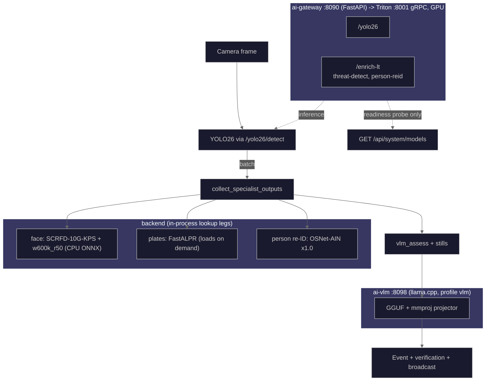

# AI Model Zoo Architecture

The model zoo is the inventory of every AI model the system runs, the two
services that serve them, and the one registry — `models.yml` at the repo root —
that decides where each model lives and how much VRAM it costs.

## Overview

Two AI services run in production:

| Container    | Port | Runtime                    | Serves                                             |
| ------------ | ---- | -------------------------- | -------------------------------------------------- |
| `ai-gateway` | 8090 | FastAPI in front of Triton | `/yolo26` detection, `/enrich-lt` resident lookups |
| `ai-vlm`     | 8098 | llama.cpp `llama-server`   | `POST /v1/chat/completions` (multimodal reasoning) |

The backend also runs three in-process lookup legs (face, plate, person re-ID)
on ONNX Runtime / torch — they are not separate services. `ai-gateway` publishes
a second host port, 8002, for Triton's native Prometheus metrics.

Host-side ports come from `.env`: `AI_GATEWAY_PORT` (8090),
`AI_GATEWAY_METRICS_PORT` (8002) and `AI_VLM_PORT` (8098). The `ai-vlm`
container's own listen port is fixed at 8098 so the internal URL
`http://ai-vlm:8098` never depends on the host mapping. `ai-vlm` is the system's
only LLM service.

`ai-vlm` sits behind the `vlm` compose profile — `podman compose -f
docker-compose.prod.yml --profile vlm up -d ai-vlm` starts it — and the backend
reaches it at `AI_VLM_URL` (compose default `http://ai-vlm:8098`).

## Architecture Diagram


```mermaid
%%{init: {
  'theme': 'dark',
  'themeVariables': {
    'primaryColor': '#3B82F6',
    'primaryTextColor': '#FFFFFF',
    'primaryBorderColor': '#60A5FA',
    'secondaryColor': '#A855F7',
    'tertiaryColor': '#009688',
    'background': '#121212',
    'mainBkg': '#1a1a2e',
    'lineColor': '#666666'
  }
}}%%
flowchart TB
    subgraph GW["ai-gateway :8090 (FastAPI) -> Triton :8001 gRPC, GPU"]
        YR["/yolo26"]
        LR["/enrich-lt<br/>threat-detect, person-reid"]
    end

    subgraph VLM["ai-vlm :8098 (llama.cpp, profile vlm)"]
        QWEN[GGUF + mmproj projector]
    end

    subgraph BE["backend (in-process lookup legs)"]
        FACE["face: SCRFD-10G-KPS + w600k_r50 (CPU ONNX)"]
        PLATE["plates: FastALPR (loads on demand)"]
        REID["person re-ID: OSNet-AIN x1.0"]
    end

    CAM[Camera frame] --> YOLO[YOLO26 via /yolo26/detect]
    YOLO -->|batch| SPEC[collect_specialist_outputs]
    SPEC --> FACE
    SPEC --> PLATE
    SPEC --> REID
    SPEC --> VLMCALL[vlm_assess + stills]
    VLMCALL --> QWEN
    QWEN --> EVT[Event + verification + broadcast]
    GW -.->|readiness probe only| READY[GET /api/system/models]
    GW -.->|inference| YOLO
```

## How The Backend Reaches Each Model

`USE_AI_GATEWAY=true` selects the gateway, and the backend's compose block sets
`AI_GATEWAY_URL=http://ai-gateway:8090`. The URL settings and their compose
values (`docker-compose.prod.yml` backend environment; `Settings` field defaults
from `backend/core/config.py` in parentheses):

| Setting                | Compose value                                          |
| ---------------------- | ------------------------------------------------------ |
| `AI_GATEWAY_URL`       | `http://ai-gateway:8090`                               |
| `YOLO26_URL`           | `http://ai-gateway:8090/yolo26`                        |
| `ENRICHMENT_LIGHT_URL` | `http://ai-gateway:8090/enrich-lt`                     |
| `AI_VLM_URL`           | `http://ai-vlm:8098` (default `http://localhost:8098`) |

With the gateway enabled, `DetectorClient` builds its detection URL as
`{AI_GATEWAY_URL}/yolo26` and falls back to `YOLO26_URL` otherwise
(`backend/services/detector_client.py`). `ENRICHMENT_LIGHT_URL` is consumed by
the model-management readiness probe
(`backend/api/routes/model_management.py`), not by inference: the live re-ID leg
runs in-process, so no backend module calls `/enrich-lt` for a prediction.

## Model Details

### Always-Loaded Models

#### YOLO26 (gateway router `/yolo26`)

The gateway serves this model at `http://localhost:8090/yolo26` under the Triton
name `yolo26`.

- **Model**: YOLO26 (Ultralytics), exported under `ai/gateway/export/`
- **VRAM**: `models.yml` `vram_mb: 0` — the row describes a library model the
  backend reaches over HTTP, not a model the backend loads into VRAM
- **Output**: bounding boxes with class labels and confidence scores

Detection runs through `DetectorClient.detect_objects`, which dials
`{YOLO26_URL}/detect` when the gateway is enabled.

**API Endpoints** (under the `/yolo26` router, `ai/gateway/adapters/yolo26.py`):

- `GET /yolo26/health` — health status
- `POST /yolo26/detect` — single-image detection
- `POST /yolo26/detect/batch` — batch detection
- `POST /yolo26/segment` — segmentation

#### VLM engine (`ai-vlm`, llama.cpp)

The reasoning engine is llama.cpp's `llama-server` serving a GGUF pair whose
identity is **config, not a fact of this page**: `VLM_MODEL_PATH` (weights) plus
`VLM_MMPROJ_PATH` (the multimodal projector). Both are operator-placed under the
`vlm` models mount, never baked into the image and never fetched by
`ai/download_models.sh`.

- **Endpoint**: `POST http://ai-vlm:8098/v1/chat/completions` (llama.cpp also
  exposes `/health` and `/props`)
- **GPU layers**: `VLM_GPU_LAYERS` → container `GPU_LAYERS` (default `auto`,
  llama.cpp `--fit` decides)
- **Context**: `VLM_CTX_SIZE` 32768 across `VLM_PARALLEL` 2 slots, so a served
  request has a 16384-token slot
- **Idle residency**: `VLM_SLEEP_IDLE_SECONDS` (default 300) releases the
  weights to CPU RAM when the serve goes quiet

The projector is load-bearing. A serve started without one answers `200` on
`/health` and reads every still as text, so both the compose healthcheck and the
image's own `HEALTHCHECK` pass while `vlm_assess` degrades silently — the
`/health` probe cannot tell a seeing server from a blind one.

The verdict's shape is pinned by a JSON schema, not by prompt prose. Each
request carries up to four base64 stills, a detector-rows table, the household
context and the three specialist outputs; the reply is the verdict object:

Risk score ranges the verdict is measured against:

<!-- prettier-ignore-start -->
--8<-- "docs/_includes/risk-scoring-levels.md"
<!-- prettier-ignore-end -->

### Lookup Legs (in-process, backend)

The three legs run inside the backend, beside the analyzer, as part of
`collect_specialist_outputs` (`backend/services/vlm_specialists.py`). Each
produces a text line the VLM is told is detector evidence rather than its own
finding, and `SPECIALIST_KEYS` is exactly `{faces, plates, person_reid}`.

| Leg           | Loader                                       | Weights                                   | Runs                 |
| ------------- | -------------------------------------------- | ----------------------------------------- | -------------------- |
| `faces`       | `backend/services/face_recognizer_loader.py` | `scrfd_10g_bnkps.onnx` + `w600k_r50.onnx` | CPU ONNX Runtime     |
| `plates`      | `backend/services/fast_alpr_loader.py`       | FastALPR's own ONNX pair                  | loads on demand      |
| `person_reid` | `backend/services/osnet_loader.py`           | `osnet_ain_x1_0_msmt17.pth` (torchreid)   | resident via preload |

- **faces**: SCRFD-10G-KPS gives boxes plus five landmarks; `w600k_r50` turns an
  aligned 112×112 crop into an L2-normalised 512-dimensional vector for the
  gallery lookup.
- **plates**: FastALPR is end-to-end detection plus OCR (~28 MB). It is the
  one leg that loads itself on first use.
- **person_reid**: OSNet-AIN x1.0 gives the 512-dimensional person vector for
  cross-camera matching against the gallery.

The face and re-ID legs are **residency-gated**: `get_reid_handle()` and
`get_face_leg_handles()` are membership reads that never trigger a load. The
handle exists only if the boot preload sweep put it there, and that sweep is
gated on `BACKEND_MODEL_PRELOAD`, which ships `false` (setup.py turns it on only
where detected VRAM is ≥ 24 GB). On a host with the flag off, those two legs
read `unavailable: specialist did not run` on every event and nothing fails —
the degradation is honest. `hsi_specialist_unavailable_total` (with a bounded
reason code) is the query that answers "has this ever run".

## The Triton Model Repository

`ai/triton/model_repository/` holds exactly `{yolo26, reid, threat}`.

| Directory | What it is                         | Router       | Default residency |
| --------- | ---------------------------------- | ------------ | ----------------- |
| `yolo26`  | the detection gate                 | `/yolo26`    | resident          |
| `reid`    | OSNet ONNX under ONNX Runtime      | `/enrich-lt` | resident          |
| `threat`  | YOLOv8n weapon detector (TensorRT) | `/enrich-lt` | opt-in            |

`GATEWAY_MODEL_SET` accepts only `vlm` — an unset or unknown value raises at
container start. The `vlm` set is `{yolo26, reid}`, plus `threat` when
`GATEWAY_ENABLE_THREAT=true`; that flag ships `false`.

Residency is decided by **which model directories sit in the repository when
Triton scans it**, not by a load RPC. The gateway runs Triton with
`--model-control-mode=none`. Before Triton starts, the entrypoint runs
`python -m ai.gateway.residency`, which prunes the live repository to the
selected set by **moving** excluded directories into a sibling
`<repository>.retired` tree and moving them back when a later start selects a
wider set. Switching sets is therefore idempotent and needs no rebuild.

The `/enrich-lt` router (`ai/gateway/adapters/enrichment_light.py`) serves the
two non-yolo26 members and nothing else:

| Endpoint                   | Method | Purpose                        |
| -------------------------- | ------ | ------------------------------ |
| `/enrich-lt/health`        | GET    | readiness of `threat` + `reid` |
| `/enrich-lt/threat-detect` | POST   | weapon detection               |
| `/enrich-lt/person-reid`   | POST   | 512-dim re-ID embedding        |

The threat lane is off by ruling, not by accident. `SPECIALIST_KEYS` excludes it
because the threat card reports an identical 83.0% recall for every class on an
unnamed dataset and published CCTV weapon AP50 collapses across datasets — the
F12 ruling is recorded in the `SPECIALIST_KEYS` comment in
`backend/services/vlm_specialists.py`. `run_threat` is a live parameter on
`collect_specialist_outputs` that adds a fourth prompt key when true, so the
exclusion is a call-site default, not a structural wall. Weapon hints are
scheduled to return as a later YOLOE-26 feature, not by re-enabling this flag.

## Backend Model Registry (`models.yml`)

`models.yml` at the repo root is the single source of truth. Four consumers read
it (`models.yml` header):

- `setup_lib/model_downloader.py` — download orchestration (`setup.py deploy`)
- `backend/services/model_zoo.py` — runtime model loading in the backend
- `ai/gateway/entrypoint.sh` — exports per-model device env vars
- `ai/gateway/patch_triton_configs.py` — rewrites Triton `instance_group` from
  `triton_kind` at startup

The catalogue holds 10 rows:

| Row                        | `service` | `vram_mb` | `enabled` | `preload` | Triton name |
| -------------------------- | --------- | --------- | --------- | --------- | ----------- |
| `yolo26`                   | backend   | 0         | false     | false     | `yolo26`    |
| `osnet-ain-x1-0`           | both      | 100       | true      | true      | `reid`      |
| `face-detector-scrfd`      | backend   | 0         | true      | true      | —           |
| `face-recognizer`          | backend   | 0         | true      | true      | —           |
| `threat-detection-yolov8n` | both      | 300       | true      | false     | `threat`    |
| `yolo11-face`              | both      | 200       | true      | false     | —           |
| `yolo11-license-plate`     | both      | 300       | true      | false     | —           |
| `fast-alpr`                | backend   | 28        | true      | false     | —           |
| `paddleocr`                | backend   | 100       | true      | false     | —           |
| `yolo26-general`           | backend   | 400       | false     | false     | —           |

The enabled rows sum to **1028 MB** of `vram_mb`. Provenance, not enabled state,
decides disk provisioning: `ai/download_models.sh` derives its fetch list from
`models.yml` with the rule `download_method != "skip" AND (hf_repo OR
download_method)`, which yields **5 of the 10 rows** and **763 MB** of
`size_mb` estimates; the five `skip` rows (face-detector-scrfd, face-recognizer,
fast-alpr, paddleocr, yolo26-general) let their libraries fetch what they need at
runtime. `yolo26` is `enabled: false` and still fetched, because the gateway
loads it and the backend never does.

## VRAM Management

Two rules cover the whole budget.

**On the gateway, models are resident.** Triton loads the active set at
container start with `--model-control-mode=none`, so there is nothing to evict
and no budget to enforce. The HTTP lifecycle endpoints therefore answer **501**
by design: `POST /api/system/models/{name}/load`, `/unload`, `/reload` and
`/api/system/models/unload-all` (see the module docstring of
`backend/api/routes/model_management.py`). Model status comes from the backend
instead:

```bash
curl http://localhost:8000/api/system/models
curl http://localhost:8000/api/system/models/vram-summary
curl http://localhost:8090/health          # Triton readiness per ACTIVE_MODELS
```

**In the backend, the model zoo loads and never evicts.**
`ModelManager` (`backend/services/model_zoo.py`) loads a row through
`manager.load("...")`, holds it under a reference count for nested loads, and
releases it only when the count reaches zero; a preloaded row stays resident for
the life of the process. **There is no eviction pass and no budget**, so the
`never_evict` and `priority` fields in `models.yml` are parsed and consulted by
nothing — `select_preload_candidates` in `backend/main.py` says so in its own
docstring. The boot sweep loads the rows that are `enabled: true` **and**
`preload: true` — three today, `osnet-ain-x1-0`, `face-detector-scrfd` and
`face-recognizer` — and the whole sweep is gated on `BACKEND_MODEL_PRELOAD`.
`gpu_config_service.py` still writes a `VRAM_BUDGET_GB` override into a service's
environment when a GPU assignment declares one; the gateway ignores it.

The VLM sizes itself: `VLM_GPU_LAYERS=auto` lets llama.cpp fit the card, and the
GGUF pair's disk size and layer count set the floor. Budget the gateway's Triton
process and ~1.0 GB of lookup headroom on top.

## Adding New Models

There is one procedure per surface.

**A backend model-zoo (lookup) model:**

1. Add the row to `models.yml` — `size_mb`, `vram_mb`, `download_phase`,
   `download_method` and, for the boot sweep, `enabled` plus `preload`
2. Implement the loader in `backend/services/` beside the existing lookups
3. Give it an unavailable path — a missing weight or package must degrade to
   `unavailable` with a reason code, never to an empty result
4. (Optional) Add the trigger to the specialist gather
5. Update `docker-compose.prod.yml` volumes if the artifact needs a new mount
6. Update documentation

**A Triton model on the gateway:** a `models.yml` entry whose `triton_name`
matches a directory under `ai/triton/model_repository/`, an export recipe under
`ai/gateway/export/`, a name in `FULL_MODEL_SET` in `ai/gateway/residency.py`
(which `ai/gateway/main.py` derives `ALL_MODELS` from), a route in the matching
adapter under `ai/gateway/adapters/`, and a `triton_kind` for
`patch_triton_configs.py` to write into the `config.pbtxt`. A directory outside
`FULL_MODEL_SET` is a foreign object: residency pruning will not move it, and
Triton will serve it. `models.yml` is where GPU/CPU placement is decided — do
not hand-edit the `config.pbtxt` files.

## Environment Variables

| Variable                        | Shipped default                                         | Read by  |
| ------------------------------- | ------------------------------------------------------- | -------- |
| `AI_GATEWAY_PORT`               | `8090`                                                  | compose  |
| `AI_GATEWAY_METRICS_PORT`       | `8002`                                                  | compose  |
| `AI_VLM_PORT`                   | `8098`                                                  | compose  |
| `USE_AI_GATEWAY`                | `true`                                                  | backend  |
| `YOLO26_URL`                    | `http://ai-gateway:8090/yolo26`                         | backend  |
| `AI_GATEWAY_URL`                | unset                                                   | backend  |
| `ENRICHMENT_LIGHT_URL`          | `http://ai-gateway:8090/enrich-lt`                      | backend  |
| `AI_VLM_URL`                    | `http://localhost:8098` (compose: `http://ai-vlm:8098`) | backend  |
| `PIPELINE_MODE`                 | `vlm` — the only accepted value                         | backend  |
| `GATEWAY_MODEL_SET`             | `vlm` — the only accepted value                         | gateway  |
| `GATEWAY_ENABLE_THREAT`         | `false`                                                 | gateway  |
| `BACKEND_MODEL_PRELOAD`         | `false`                                                 | backend  |
| `VLM_MODEL_PATH`                | `/models/Qwen3VL-8B-Instruct-Q4_K_M.gguf`               | `ai-vlm` |
| `VLM_MMPROJ_PATH`               | `/models/mmproj-Qwen3VL-8B-Instruct-Q8_0.gguf`          | `ai-vlm` |
| `VLM_MODEL_ALIAS`               | `Qwen3VL-8B`                                            | `ai-vlm` |
| `VLM_GPU_LAYERS`                | `auto`                                                  | `ai-vlm` |
| `VLM_CTX_SIZE` / `VLM_PARALLEL` | `32768` / `2`                                           | `ai-vlm` |
| `VLM_SLEEP_IDLE_SECONDS`        | `300`                                                   | `ai-vlm` |

`PIPELINE_MODE` and `GATEWAY_MODEL_SET` both hard-raise on any other value, and
the compose and `.env.example` defaults are pinned to agree
(`backend/tests/unit/core/test_gateway_model_set_compose.py`).
`BACKEND_MODEL_PRELOAD` is pinned to `Settings.model_fields`, so changing that
default is a gate edit, not a config edit.

## Hardware Requirements

The compose files place GPU work by device variable: `GPU_LLM` (default `0`)
selects the card `ai-vlm` runs on and `GPU_AI_SERVICES` (default `1`) the one
`ai-gateway` runs on. Sizing is dominated by the configured VLM identity — see
[VRAM Management](#vram-management).

- **GPU**: NVIDIA with CUDA support, via the NVIDIA Container Toolkit
- **Container runtime**: Podman (this project's standard) or Docker

## Related Documentation

- [docs/ai/AGENTS.md](AGENTS.md) — navigation for this directory
- [ai/AGENTS.md](../../ai/AGENTS.md) — AI service implementation
- [ai/gateway/AGENTS.md](../../ai/gateway/AGENTS.md) — the gateway itself
- [ai/vlm/](../../ai/vlm/) — the shipped LLM engine
- [docs/reference/models.md](../reference/models.md) — per-model reference
- [docs/architecture/ai-pipeline-current-state.md](../architecture/ai-pipeline-current-state.md)
  — the measured end-to-end path
