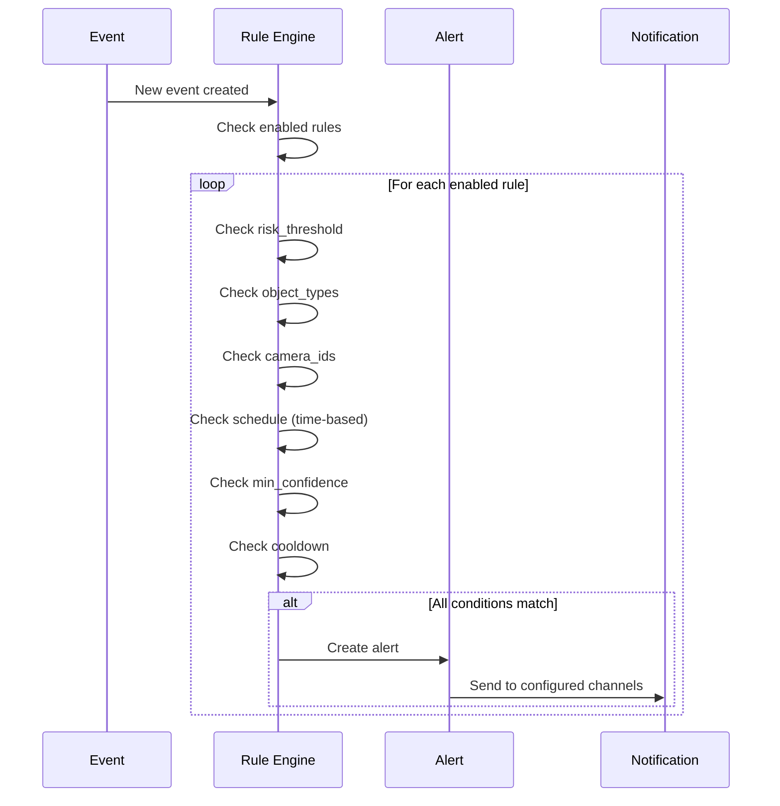

# Alerts API

The Alerts API provides endpoints for managing alert rules and notification configuration. Alert rules define when notifications should be triggered based on security events.

## Endpoints Overview

### Alert Rules

| Method | Endpoint                           | Description              |
| ------ | ---------------------------------- | ------------------------ |
| GET    | `/api/alerts/rules`                | List all alert rules     |
| POST   | `/api/alerts/rules`                | Create alert rule        |
| GET    | `/api/alerts/rules/{rule_id}`      | Get alert rule           |
| PUT    | `/api/alerts/rules/{rule_id}`      | Update alert rule        |
| DELETE | `/api/alerts/rules/{rule_id}`      | Delete alert rule        |
| POST   | `/api/alerts/rules/{rule_id}/test` | Test rule against events |

### Notification

| Method | Endpoint                   | Description                    |
| ------ | -------------------------- | ------------------------------ |
| GET    | `/api/notification/config` | Get notification configuration |
| POST   | `/api/notification/test`   | Test notification delivery     |

---

## GET /api/alerts/rules

List all alert rules with optional filtering and pagination.

**Source:** [`list_rules`](../../backend/api/routes/alerts.py:64)

**Parameters:**

| Name       | Type    | In    | Required | Description                       |
| ---------- | ------- | ----- | -------- | --------------------------------- |
| `enabled`  | boolean | query | No       | Filter by enabled status          |
| `severity` | string  | query | No       | Filter by severity level          |
| `limit`    | integer | query | No       | Max results (1-1000, default: 50) |
| `offset`   | integer | query | No       | Results to skip (default: 0)      |

**Response:** `200 OK`

```json
{
  "rules": [
    {
      "id": "550e8400-e29b-41d4-a716-446655440000",
      "name": "High Risk Person Detection",
      "description": "Alert when person detected with high risk score",
      "enabled": true,
      "severity": "high",
      "risk_threshold": 75,
      "object_types": ["person"],
      "camera_ids": null,
      "zone_ids": null,
      "min_confidence": 0.8,
      "schedule": {
        "days": ["mon", "tue", "wed", "thu", "fri"],
        "start_time": "22:00",
        "end_time": "06:00"
      },
      "conditions": null,
      "dedup_key_template": "{camera_id}:{object_type}",
      "cooldown_seconds": 300,
      "channels": ["email", "webhook"],
      "created_at": "2025-12-23T10:00:00Z",
      "updated_at": "2025-12-23T10:00:00Z"
    }
  ],
  "count": 1,
  "limit": 50,
  "offset": 0
}
```

**Example Request:**

```bash
# List all enabled rules
curl "http://localhost:8000/api/alerts/rules?enabled=true"

# List high severity rules
curl "http://localhost:8000/api/alerts/rules?severity=high"
```

---

## POST /api/alerts/rules

Create a new alert rule.

**Source:** [`create_rule`](../../backend/api/routes/alerts.py:116)

**Request Body:**

```json
{
  "name": "Critical Person Detection",
  "description": "Alert for any person detection at night",
  "enabled": true,
  "severity": "critical",
  "risk_threshold": 85,
  "object_types": ["person"],
  "camera_ids": ["camera-1", "camera-2"],
  "zone_ids": null,
  "min_confidence": 0.9,
  "schedule": {
    "days": ["sun", "mon", "tue", "wed", "thu", "fri", "sat"],
    "start_time": "00:00",
    "end_time": "06:00"
  },
  "conditions": null,
  "dedup_key_template": "{camera_id}:{object_type}:{hour}",
  "cooldown_seconds": 600,
  "channels": ["email", "webhook"]
}
```

**Request Fields:**

| Field                | Type    | Required | Description                                         |
| -------------------- | ------- | -------- | --------------------------------------------------- |
| `name`               | string  | Yes      | Rule name (1-255 chars)                             |
| `description`        | string  | No       | Rule description                                    |
| `enabled`            | boolean | No       | Enable rule (default: true)                         |
| `severity`           | string  | Yes      | Alert severity: `low`, `medium`, `high`, `critical` |
| `risk_threshold`     | integer | No       | Minimum risk score to trigger (0-100)               |
| `object_types`       | array   | No       | Object types to match (e.g., ["person", "vehicle"]) |
| `camera_ids`         | array   | No       | Camera IDs to match (null = all cameras)            |
| `zone_ids`           | array   | No       | Zone IDs to match                                   |
| `min_confidence`     | float   | No       | Minimum detection confidence (0-1)                  |
| `schedule`           | object  | No       | Time-based schedule (see below)                     |
| `conditions`         | object  | No       | Additional matching conditions                      |
| `dedup_key_template` | string  | No       | Template for deduplication key                      |
| `cooldown_seconds`   | integer | No       | Cooldown between alerts (default: 300)              |
| `channels`           | array   | No       | Notification channels: `email`, `webhook`, `push`   |

**Schedule Object:**

| Field        | Type   | Description                                                   |
| ------------ | ------ | ------------------------------------------------------------- |
| `days`       | array  | Days of week: `sun`, `mon`, `tue`, `wed`, `thu`, `fri`, `sat` |
| `start_time` | string | Start time in HH:MM format                                    |
| `end_time`   | string | End time in HH:MM format                                      |

**Response:** `201 Created`

Returns the created rule.

---

## GET /api/alerts/rules/{rule_id}

Get a specific alert rule by ID.

**Source:** [`get_rule`](../../backend/api/routes/alerts.py:167)

**Parameters:**

| Name      | Type   | In   | Required | Description |
| --------- | ------ | ---- | -------- | ----------- |
| `rule_id` | string | path | Yes      | Rule UUID   |

**Response:** `200 OK`

Returns the alert rule object.

**Errors:**

| Code | Description                            |
| ---- | -------------------------------------- |
| 404  | Alert rule with specified ID not found |

---

## PUT /api/alerts/rules/{rule_id}

Update an existing alert rule.

**Source:** [`update_rule`](../../backend/api/routes/alerts.py:237)

**Parameters:**

| Name      | Type   | In   | Required | Description |
| --------- | ------ | ---- | -------- | ----------- |
| `rule_id` | string | path | Yes      | Rule UUID   |

**Request Body:**

All fields from AlertRuleCreate are supported (all optional for update).

**Response:** `200 OK`

Returns the updated rule.

**Errors:**

| Code | Description          |
| ---- | -------------------- |
| 404  | Alert rule not found |
| 422  | Validation error     |

**Example Request:**

```bash
curl -X PUT http://localhost:8000/api/alerts/rules/550e8400-e29b-41d4-a716-446655440000 \
  -H "Content-Type: application/json" \
  -d '{"enabled": false}'
```

---

## DELETE /api/alerts/rules/{rule_id}

Delete an alert rule.

**Source:** [`delete_rule`](../../backend/api/routes/alerts.py:275)

**Parameters:**

| Name      | Type   | In   | Required | Description |
| --------- | ------ | ---- | -------- | ----------- |
| `rule_id` | string | path | Yes      | Rule UUID   |

**Response:** `204 No Content`

**Errors:**

| Code | Description          |
| ---- | -------------------- |
| 404  | Alert rule not found |

---

## POST /api/alerts/rules/{rule_id}/test

Test a rule against historical events.

**Source:** [`test_rule`](../../backend/api/routes/alerts.py:302)

**Parameters:**

| Name      | Type   | In   | Required | Description |
| --------- | ------ | ---- | -------- | ----------- |
| `rule_id` | string | path | Yes      | Rule UUID   |

**Request Body:**

```json
{
  "event_ids": [1, 2, 3],
  "test_time": "2025-12-23T03:00:00Z",
  "limit": 50
}
```

**Request Fields:**

| Field       | Type     | Required | Description                        |
| ----------- | -------- | -------- | ---------------------------------- |
| `event_ids` | array    | No       | Specific event IDs to test against |
| `test_time` | datetime | No       | Override time for schedule testing |
| `limit`     | integer  | No       | Max events to test (default: 50)   |

**Response:** `200 OK`

```json
{
  "rule_id": "550e8400-e29b-41d4-a716-446655440000",
  "rule_name": "High Risk Person Detection",
  "events_tested": 10,
  "events_matched": 3,
  "match_rate": 0.3,
  "results": [
    {
      "event_id": 1,
      "camera_id": "camera-1",
      "risk_score": 85,
      "object_types": ["person"],
      "matches": true,
      "matched_conditions": ["risk_threshold", "object_type", "schedule"],
      "started_at": "2025-12-23T03:15:00Z"
    },
    {
      "event_id": 2,
      "camera_id": "camera-2",
      "risk_score": 45,
      "object_types": ["person"],
      "matches": false,
      "matched_conditions": ["object_type", "schedule"],
      "started_at": "2025-12-23T03:20:00Z"
    }
  ]
}
```

**Use Cases:**

- Test rule before enabling to see how often it would trigger
- Debug why a rule is not matching expected events
- Validate schedule configuration with specific time overrides
- Compare different rule configurations

---

## GET /api/notification/config

Get notification configuration status.

**Source:** [`get_notification_config`](../../backend/api/routes/notification.py:35)

**Response:** `200 OK`

```json
{
  "notification_enabled": true,
  "email_configured": true,
  "webhook_configured": true,
  "push_configured": false,
  "available_channels": ["email", "webhook"],
  "smtp_host": "smtp.example.com",
  "smtp_port": 587,
  "smtp_from_address": "alerts@example.com",
  "smtp_use_tls": true,
  "default_webhook_url": "https://hooks.example.com/alerts",
  "webhook_timeout_seconds": 30,
  "default_email_recipients": ["security@example.com"]
}
```

**Response Fields:**

| Field                      | Type    | Description                                |
| -------------------------- | ------- | ------------------------------------------ |
| `notification_enabled`     | boolean | Whether notifications are enabled globally |
| `email_configured`         | boolean | Whether email is properly configured       |
| `webhook_configured`       | boolean | Whether webhook is configured              |
| `push_configured`          | boolean | Whether push notifications are configured  |
| `available_channels`       | array   | List of available notification channels    |
| `smtp_host`                | string  | SMTP server hostname (nullable)            |
| `smtp_port`                | integer | SMTP server port (nullable)                |
| `smtp_from_address`        | string  | Sender email address (nullable)            |
| `smtp_use_tls`             | boolean | Whether TLS is enabled (nullable)          |
| `default_webhook_url`      | string  | Default webhook URL (nullable)             |
| `webhook_timeout_seconds`  | integer | Webhook timeout (nullable)                 |
| `default_email_recipients` | array   | Default email recipients (nullable)        |

**Note:** Sensitive fields like SMTP password are NOT returned.

---

## POST /api/notification/test

Test notification delivery for a specific channel.

**Source:** [`test_notification`](../../backend/api/routes/notification.py:134)

**Request Body:**

```json
{
  "channel": "email",
  "email_recipients": ["test@example.com"],
  "webhook_url": null
}
```

**Request Fields:**

| Field              | Type   | Required | Description                                 |
| ------------------ | ------ | -------- | ------------------------------------------- |
| `channel`          | string | Yes      | Channel to test: `email`, `webhook`, `push` |
| `email_recipients` | array  | No       | Override default email recipients           |
| `webhook_url`      | string | No       | Override default webhook URL                |

**Response:** `200 OK`

```json
{
  "channel": "email",
  "success": true,
  "error": null,
  "message": "Test email sent successfully to test@example.com"
}
```

**Error Response:**

```json
{
  "channel": "email",
  "success": false,
  "error": "Email is not configured (missing SMTP settings)",
  "message": "Please configure SMTP settings (host, from address) to enable email notifications"
}
```

**Example Requests:**

```bash
# Test email notification
curl -X POST http://localhost:8000/api/notification/test \
  -H "Content-Type: application/json" \
  -d '{"channel": "email", "email_recipients": ["test@example.com"]}'

# Test webhook notification
curl -X POST http://localhost:8000/api/notification/test \
  -H "Content-Type: application/json" \
  -d '{"channel": "webhook", "webhook_url": "https://example.com/webhook"}'
```

**Audit Log:** Creates audit entry with action `notification_test` on success.

---

## Data Models

### AlertRuleResponse

Full alert rule response model.

| Field                | Type     | Description                             |
| -------------------- | -------- | --------------------------------------- |
| `id`                 | string   | Rule UUID                               |
| `name`               | string   | Rule name                               |
| `description`        | string   | Rule description (nullable)             |
| `enabled`            | boolean  | Whether rule is enabled                 |
| `severity`           | string   | Alert severity level                    |
| `risk_threshold`     | integer  | Minimum risk score (nullable)           |
| `object_types`       | array    | Object types to match (nullable)        |
| `camera_ids`         | array    | Camera IDs to match (nullable)          |
| `zone_ids`           | array    | Zone IDs to match (nullable)            |
| `min_confidence`     | float    | Minimum detection confidence (nullable) |
| `schedule`           | object   | Time-based schedule (nullable)          |
| `conditions`         | object   | Additional conditions (nullable)        |
| `dedup_key_template` | string   | Deduplication key template (nullable)   |
| `cooldown_seconds`   | integer  | Cooldown between alerts                 |
| `channels`           | array    | Notification channels                   |
| `created_at`         | datetime | Creation timestamp                      |
| `updated_at`         | datetime | Last update timestamp                   |

### Severity Levels

| Level      | Priority | Description                       |
| ---------- | -------- | --------------------------------- |
| `critical` | 0        | Immediate attention required      |
| `high`     | 1        | Concerning activity, review soon  |
| `medium`   | 2        | Notable activity, worth reviewing |
| `low`      | 3        | Routine activity, no concern      |

### Notification Channels

| Channel   | Description                           |
| --------- | ------------------------------------- |
| `email`   | Send email via configured SMTP server |
| `webhook` | POST to configured webhook URL        |
| `push`    | Push notification (planned)           |

---

## Alert Rule Matching Logic



**Matching Criteria:**

1. **risk_threshold** - Event risk score must be >= threshold
2. **object_types** - At least one detection must match
3. **camera_ids** - Event must be from a listed camera (or null = all)
4. **schedule** - Current time must be within schedule window
5. **min_confidence** - At least one detection must meet confidence threshold
6. **cooldown** - Time since last alert for same dedup key must exceed cooldown

---

## Related Documentation

- [Events API](events.md) - Events trigger alert rules
- [System API](system.md) - System configuration
- [WebSocket API](websocket.md) - Real-time alert notifications
