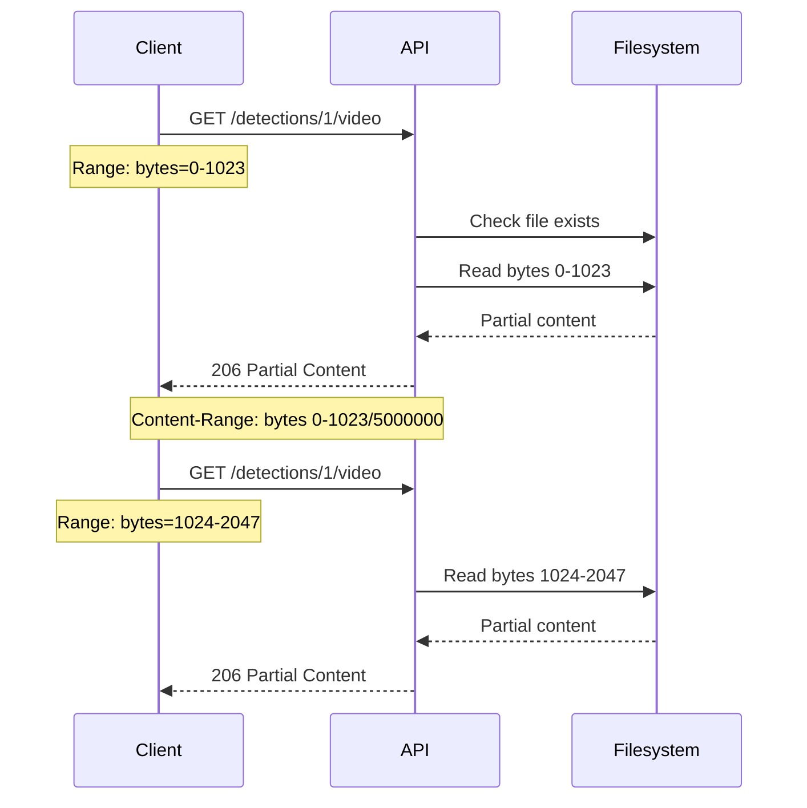

# Detections API

The Detections API provides endpoints for accessing object detections from the AI pipeline. Detections represent individual objects identified in camera images or videos by the RT-DETRv2 model.

## Endpoints Overview

| Method | Endpoint                                         | Description                               |
| ------ | ------------------------------------------------ | ----------------------------------------- |
| GET    | `/api/detections`                                | List detections with filtering            |
| GET    | `/api/detections/{detection_id}`                 | Get detection by ID                       |
| GET    | `/api/detections/{detection_id}/image`           | Get detection thumbnail with bounding box |
| GET    | `/api/detections/{detection_id}/video`           | Stream detection video                    |
| GET    | `/api/detections/{detection_id}/video/thumbnail` | Get video thumbnail frame                 |

---

## GET /api/detections

List detections with optional filtering and pagination.

**Source:** [`list_detections`](../backend/api/routes/detections.py:28)

**Parameters:**

| Name             | Type     | In    | Required | Description                                                       |
| ---------------- | -------- | ----- | -------- | ----------------------------------------------------------------- |
| `camera_id`      | string   | query | No       | Filter by camera UUID                                             |
| `object_type`    | string   | query | No       | Filter by object type: `person`, `car`, `vehicle`, `animal`, etc. |
| `start_date`     | datetime | query | No       | Filter detections after this date (ISO 8601)                      |
| `end_date`       | datetime | query | No       | Filter detections before this date (ISO 8601)                     |
| `min_confidence` | float    | query | No       | Minimum confidence score (0.0-1.0)                                |
| `limit`          | integer  | query | No       | Max results (1-1000, default: 50)                                 |
| `offset`         | integer  | query | No       | Results to skip (default: 0)                                      |

**Response:** `200 OK`

```json
{
  "detections": [
    {
      "id": 1,
      "camera_id": "123e4567-e89b-12d3-a456-426614174000",
      "file_path": "/export/foscam/front_door/20251223_120000.jpg",
      "file_type": "image/jpeg",
      "detected_at": "2025-12-23T12:00:00Z",
      "object_type": "person",
      "confidence": 0.95,
      "bbox_x": 100,
      "bbox_y": 150,
      "bbox_width": 200,
      "bbox_height": 400,
      "thumbnail_path": "/data/thumbnails/1_thumb.jpg",
      "media_type": "image",
      "duration": null,
      "video_codec": null,
      "video_width": null,
      "video_height": null
    }
  ],
  "count": 1,
  "limit": 50,
  "offset": 0
}
```

**Example Requests:**

```bash
# List all detections
curl http://localhost:8000/api/detections

# Filter by camera and object type
curl "http://localhost:8000/api/detections?camera_id=123e4567&object_type=person"

# Filter by confidence
curl "http://localhost:8000/api/detections?min_confidence=0.8"

# Filter by date range
curl "http://localhost:8000/api/detections?start_date=2025-12-23T00:00:00Z&end_date=2025-12-24T00:00:00Z"
```

---

## GET /api/detections/{detection_id}

Get a specific detection by ID.

**Source:** [`get_detection`](../backend/api/routes/detections.py:94)

**Parameters:**

| Name           | Type    | In   | Required | Description  |
| -------------- | ------- | ---- | -------- | ------------ |
| `detection_id` | integer | path | Yes      | Detection ID |

**Response:** `200 OK`

```json
{
  "id": 1,
  "camera_id": "123e4567-e89b-12d3-a456-426614174000",
  "file_path": "/export/foscam/front_door/20251223_120000.jpg",
  "file_type": "image/jpeg",
  "detected_at": "2025-12-23T12:00:00Z",
  "object_type": "person",
  "confidence": 0.95,
  "bbox_x": 100,
  "bbox_y": 150,
  "bbox_width": 200,
  "bbox_height": 400,
  "thumbnail_path": "/data/thumbnails/1_thumb.jpg",
  "media_type": "image",
  "duration": null,
  "video_codec": null,
  "video_width": null,
  "video_height": null
}
```

**Response Fields:**

| Field            | Type     | Description                                    |
| ---------------- | -------- | ---------------------------------------------- |
| `id`             | integer  | Detection ID                                   |
| `camera_id`      | string   | Camera UUID                                    |
| `file_path`      | string   | Path to source image or video file             |
| `file_type`      | string   | MIME type of source file (nullable)            |
| `detected_at`    | datetime | Timestamp when detection was made              |
| `object_type`    | string   | Type of detected object (nullable)             |
| `confidence`     | float    | Detection confidence score 0-1 (nullable)      |
| `bbox_x`         | integer  | Bounding box X coordinate (nullable)           |
| `bbox_y`         | integer  | Bounding box Y coordinate (nullable)           |
| `bbox_width`     | integer  | Bounding box width (nullable)                  |
| `bbox_height`    | integer  | Bounding box height (nullable)                 |
| `thumbnail_path` | string   | Path to thumbnail with bbox overlay (nullable) |
| `media_type`     | string   | Media type: `image` or `video`                 |
| `duration`       | float    | Video duration in seconds (video only)         |
| `video_codec`    | string   | Video codec (e.g., h264, hevc) (video only)    |
| `video_width`    | integer  | Video resolution width (video only)            |
| `video_height`   | integer  | Video resolution height (video only)           |

**Errors:**

| Code | Description                           |
| ---- | ------------------------------------- |
| 404  | Detection with specified ID not found |

**Example Request:**

```bash
curl http://localhost:8000/api/detections/1
```

---

## GET /api/detections/{detection_id}/image

Get the thumbnail image with bounding box overlay.

**Source:** [`get_detection_image`](../backend/api/routes/detections.py:124)

**Parameters:**

| Name           | Type    | In   | Required | Description  |
| -------------- | ------- | ---- | -------- | ------------ |
| `detection_id` | integer | path | Yes      | Detection ID |

**Response:** `200 OK`

Returns binary JPEG image data.

**Response Headers:**

| Header          | Value                  |
| --------------- | ---------------------- |
| `Content-Type`  | `image/jpeg`           |
| `Cache-Control` | `public, max-age=3600` |

**Behavior:**

1. If a thumbnail already exists, returns the cached thumbnail
2. If no thumbnail exists, generates one on-the-fly:
   - Loads the source image
   - Draws bounding box overlay
   - Saves to thumbnail path
   - Updates detection record with thumbnail path

**Errors:**

| Code | Description                                |
| ---- | ------------------------------------------ |
| 404  | Detection not found                        |
| 404  | Source image file not found                |
| 500  | Failed to generate or read thumbnail image |

**Example Request:**

```bash
# Download thumbnail
curl -o thumbnail.jpg http://localhost:8000/api/detections/1/image

# View in browser
# http://localhost:8000/api/detections/1/image
```

---

## GET /api/detections/{detection_id}/video

Stream detection video with HTTP Range request support.

**Source:** [`stream_detection_video`](../backend/api/routes/detections.py:260)

**Parameters:**

| Name           | Type    | In   | Required | Description  |
| -------------- | ------- | ---- | -------- | ------------ |
| `detection_id` | integer | path | Yes      | Detection ID |

**Request Headers:**

| Header  | Description                                                  |
| ------- | ------------------------------------------------------------ |
| `Range` | HTTP Range header for partial content (e.g., `bytes=0-1023`) |

**Response:** `200 OK` or `206 Partial Content`

Returns binary video data as a streaming response.

**Response Headers (Full Content):**

| Header           | Description                         |
| ---------------- | ----------------------------------- |
| `Content-Type`   | Video MIME type (e.g., `video/mp4`) |
| `Content-Length` | File size in bytes                  |
| `Accept-Ranges`  | `bytes`                             |
| `Cache-Control`  | `public, max-age=3600`              |

**Response Headers (Partial Content - 206):**

| Header           | Description             |
| ---------------- | ----------------------- |
| `Content-Type`   | Video MIME type         |
| `Content-Range`  | `bytes start-end/total` |
| `Content-Length` | Chunk size in bytes     |
| `Accept-Ranges`  | `bytes`                 |
| `Cache-Control`  | `public, max-age=3600`  |

**Range Request Formats:**

| Format         | Description    | Example               |
| -------------- | -------------- | --------------------- |
| `bytes=0-1023` | Explicit range | First 1024 bytes      |
| `bytes=1024-`  | Open-ended     | From byte 1024 to end |
| `bytes=-500`   | Suffix range   | Last 500 bytes        |

**Errors:**

| Code | Description                                      |
| ---- | ------------------------------------------------ |
| 400  | Detection is not a video (media_type != "video") |
| 404  | Detection not found                              |
| 404  | Video file not found                             |
| 416  | Range not satisfiable (invalid Range header)     |

**Example Requests:**

```bash
# Stream full video
curl -o video.mp4 http://localhost:8000/api/detections/1/video

# Request partial content (first 1MB)
curl -H "Range: bytes=0-1048575" http://localhost:8000/api/detections/1/video

# Stream in HTML5 video element (browser handles Range requests automatically)
```

```html
<video controls>
  <source src="http://localhost:8000/api/detections/1/video" type="video/mp4" />
</video>
```

---

## GET /api/detections/{detection_id}/video/thumbnail

Get a thumbnail frame extracted from a video detection.

**Source:** [`get_video_thumbnail`](../backend/api/routes/detections.py:373)

**Parameters:**

| Name           | Type    | In   | Required | Description  |
| -------------- | ------- | ---- | -------- | ------------ |
| `detection_id` | integer | path | Yes      | Detection ID |

**Response:** `200 OK`

Returns binary JPEG image data.

**Response Headers:**

| Header          | Value                  |
| --------------- | ---------------------- |
| `Content-Type`  | `image/jpeg`           |
| `Cache-Control` | `public, max-age=3600` |

**Behavior:**

1. If a thumbnail already exists, returns the cached thumbnail
2. If no thumbnail exists, extracts a frame from the video using ffmpeg:
   - Extracts frame from early in the video
   - Saves as JPEG thumbnail
   - Updates detection record with thumbnail path

**Errors:**

| Code | Description                                      |
| ---- | ------------------------------------------------ |
| 400  | Detection is not a video (media_type != "video") |
| 404  | Detection not found                              |
| 404  | Video file not found                             |
| 500  | Failed to generate or read video thumbnail       |

**Example Request:**

```bash
# Download video thumbnail
curl -o video_thumb.jpg http://localhost:8000/api/detections/1/video/thumbnail
```

---

## Data Models

### DetectionResponse

Full detection response model.

**Source:** [`DetectionResponse`](../backend/api/schemas/detections.py:8)

| Field            | Type     | Description                        |
| ---------------- | -------- | ---------------------------------- |
| `id`             | integer  | Detection ID                       |
| `camera_id`      | string   | Camera UUID                        |
| `file_path`      | string   | Path to source image or video file |
| `file_type`      | string   | MIME type of source file           |
| `detected_at`    | datetime | Detection timestamp                |
| `object_type`    | string   | Type of detected object            |
| `confidence`     | float    | Detection confidence (0-1)         |
| `bbox_x`         | integer  | Bounding box X coordinate          |
| `bbox_y`         | integer  | Bounding box Y coordinate          |
| `bbox_width`     | integer  | Bounding box width                 |
| `bbox_height`    | integer  | Bounding box height                |
| `thumbnail_path` | string   | Path to thumbnail image            |
| `media_type`     | string   | `image` or `video`                 |
| `duration`       | float    | Video duration in seconds          |
| `video_codec`    | string   | Video codec                        |
| `video_width`    | integer  | Video width in pixels              |
| `video_height`   | integer  | Video height in pixels             |

### DetectionListResponse

Response model for detection list.

**Source:** [`DetectionListResponse`](../backend/api/schemas/detections.py:58)

| Field        | Type                     | Description                  |
| ------------ | ------------------------ | ---------------------------- |
| `detections` | array[DetectionResponse] | List of detection objects    |
| `count`      | integer                  | Total count matching filters |
| `limit`      | integer                  | Applied limit                |
| `offset`     | integer                  | Applied offset               |

---

## Object Types

The following object types are commonly detected by RT-DETRv2:

| Type         | Description           |
| ------------ | --------------------- |
| `person`     | Human being           |
| `car`        | Automobile            |
| `truck`      | Truck or van          |
| `motorcycle` | Motorcycle or scooter |
| `bicycle`    | Bicycle               |
| `bus`        | Bus                   |
| `dog`        | Dog                   |
| `cat`        | Cat                   |
| `bird`       | Bird                  |
| `horse`      | Horse                 |

The full list depends on the COCO dataset labels used by the model.

---

## Video Streaming Architecture



The video streaming endpoint supports:

- **Seeking**: HTML5 video players can seek to any position
- **Progressive download**: Content is streamed in 64KB chunks
- **Caching**: 1-hour cache headers for efficient playback

---

## Related Documentation

- [Events API](events.md) - Events contain multiple detections
- [Cameras API](cameras.md) - Detections are linked to cameras
- [System API](system.md) - Detection counts in system stats
