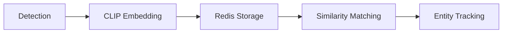
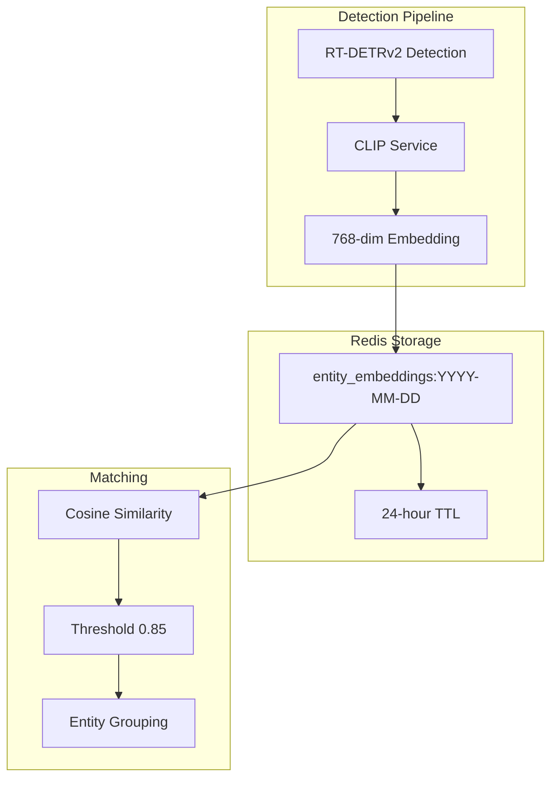

# Entities API

The Entities API provides endpoints for tracking and querying entities (persons and vehicles) across multiple cameras using CLIP-based re-identification. Entities are tracked via embedding similarity in Redis, allowing the system to recognize when the same person or vehicle appears at different cameras over time.

## Overview

### What are Entities?

Entities represent tracked objects that have been detected and identified across camera views:

- **Persons**: Human beings detected by RT-DETRv2
- **Vehicles**: Cars, trucks, motorcycles, and other vehicles

Unlike raw detections (which are single observations), entities aggregate appearances of the same object across time and cameras using CLIP ViT-L embeddings for re-identification.

### How Re-identification Works



1. When a person or vehicle is detected, a 768-dimensional CLIP embedding is generated
2. Embeddings are stored in Redis with 24-hour TTL
3. New detections are compared against existing embeddings using cosine similarity
4. Matches above the threshold (default 0.85) are grouped as the same entity

---

## Endpoints Overview

| Method | Endpoint                            | Description                    |
| ------ | ----------------------------------- | ------------------------------ |
| GET    | `/api/entities`                     | List tracked entities          |
| GET    | `/api/entities/{entity_id}`         | Get entity details             |
| GET    | `/api/entities/{entity_id}/history` | Get entity appearance timeline |

---

## GET /api/entities

List tracked entities with optional filtering and pagination.

**Source:** [`list_entities`](../../backend/api/routes/entities.py:101)

**Parameters:**

| Name          | Type     | In    | Required | Description                                     |
| ------------- | -------- | ----- | -------- | ----------------------------------------------- |
| `entity_type` | string   | query | No       | Filter by entity type: `person` or `vehicle`    |
| `camera_id`   | string   | query | No       | Filter by camera ID                             |
| `since`       | datetime | query | No       | Filter entities seen since this time (ISO 8601) |
| `limit`       | integer  | query | No       | Max results (1-1000, default: 50)               |
| `offset`      | integer  | query | No       | Results to skip (default: 0)                    |

**Response:** `200 OK`

```json
{
  "entities": [
    {
      "id": "entity_abc123",
      "entity_type": "person",
      "first_seen": "2025-12-23T10:00:00Z",
      "last_seen": "2025-12-23T14:30:00Z",
      "appearance_count": 5,
      "cameras_seen": ["front_door", "backyard", "driveway"],
      "thumbnail_url": "/api/detections/123/image"
    }
  ],
  "count": 1,
  "limit": 50,
  "offset": 0
}
```

**Response Fields:**

| Field      | Type                 | Description                  |
| ---------- | -------------------- | ---------------------------- |
| `entities` | array[EntitySummary] | List of tracked entities     |
| `count`    | integer              | Total count matching filters |
| `limit`    | integer              | Applied limit                |
| `offset`   | integer              | Applied offset               |

**Behavior:**

- Returns entities sorted by `last_seen` (newest first)
- Queries both today's and yesterday's Redis keys (24-hour rolling window)
- If Redis is unavailable, returns empty list with count 0

**Example Requests:**

```bash
# List all entities
curl http://localhost:8000/api/entities

# Filter by entity type
curl "http://localhost:8000/api/entities?entity_type=person"

# Filter by camera
curl "http://localhost:8000/api/entities?camera_id=front_door"

# Filter entities seen in the last hour
curl "http://localhost:8000/api/entities?since=2025-12-23T13:00:00Z"

# Combine filters with pagination
curl "http://localhost:8000/api/entities?entity_type=vehicle&limit=10&offset=20"
```

---

## GET /api/entities/{entity_id}

Get detailed information about a specific entity, including all recorded appearances.

**Source:** [`get_entity`](../../backend/api/routes/entities.py:192)

**Parameters:**

| Name        | Type   | In   | Required | Description                             |
| ----------- | ------ | ---- | -------- | --------------------------------------- |
| `entity_id` | string | path | Yes      | Unique entity identifier (detection_id) |

**Response:** `200 OK`

```json
{
  "id": "entity_abc123",
  "entity_type": "person",
  "first_seen": "2025-12-23T10:00:00Z",
  "last_seen": "2025-12-23T14:30:00Z",
  "appearance_count": 3,
  "cameras_seen": ["front_door", "backyard"],
  "thumbnail_url": "/api/detections/123/image",
  "appearances": [
    {
      "detection_id": "det_001",
      "camera_id": "front_door",
      "camera_name": "Front Door",
      "timestamp": "2025-12-23T10:00:00Z",
      "thumbnail_url": "/api/detections/1/image",
      "similarity_score": 1.0,
      "attributes": {
        "clothing": "blue jacket"
      }
    },
    {
      "detection_id": "det_002",
      "camera_id": "backyard",
      "camera_name": "Backyard",
      "timestamp": "2025-12-23T12:15:00Z",
      "thumbnail_url": "/api/detections/2/image",
      "similarity_score": 0.94,
      "attributes": {
        "clothing": "blue jacket",
        "carrying": "bag"
      }
    }
  ]
}
```

**Response Fields (EntityDetail):**

| Field              | Type                    | Description                              |
| ------------------ | ----------------------- | ---------------------------------------- |
| `id`               | string                  | Unique entity identifier                 |
| `entity_type`      | string                  | Type: `person` or `vehicle`              |
| `first_seen`       | datetime                | Timestamp of first appearance            |
| `last_seen`        | datetime                | Timestamp of most recent appearance      |
| `appearance_count` | integer                 | Total number of appearances              |
| `cameras_seen`     | array[string]           | List of camera IDs where entity was seen |
| `thumbnail_url`    | string                  | URL to most recent thumbnail             |
| `appearances`      | array[EntityAppearance] | Full list of appearances                 |

**Errors:**

| Code | Description               |
| ---- | ------------------------- |
| 404  | Entity not found          |
| 503  | Redis service unavailable |

**Example Request:**

```bash
curl http://localhost:8000/api/entities/det_abc123
```

---

## GET /api/entities/{entity_id}/history

Get the appearance timeline for a specific entity, showing all sightings in chronological order.

**Source:** [`get_entity_history`](../../backend/api/routes/entities.py:275)

**Parameters:**

| Name        | Type   | In   | Required | Description                             |
| ----------- | ------ | ---- | -------- | --------------------------------------- |
| `entity_id` | string | path | Yes      | Unique entity identifier (detection_id) |

**Response:** `200 OK`

```json
{
  "entity_id": "entity_abc123",
  "entity_type": "person",
  "appearances": [
    {
      "detection_id": "det_001",
      "camera_id": "front_door",
      "camera_name": "Front Door",
      "timestamp": "2025-12-23T10:00:00Z",
      "thumbnail_url": "/api/detections/1/image",
      "similarity_score": 1.0,
      "attributes": {}
    }
  ],
  "count": 1
}
```

**Response Fields (EntityHistoryResponse):**

| Field         | Type                    | Description                        |
| ------------- | ----------------------- | ---------------------------------- |
| `entity_id`   | string                  | Entity identifier                  |
| `entity_type` | string                  | Type: `person` or `vehicle`        |
| `appearances` | array[EntityAppearance] | Appearances in chronological order |
| `count`       | integer                 | Total number of appearances        |

**Errors:**

| Code | Description               |
| ---- | ------------------------- |
| 404  | Entity not found          |
| 503  | Redis service unavailable |

**Example Request:**

```bash
curl http://localhost:8000/api/entities/det_abc123/history
```

---

## Data Models

### EntitySummary

Summary information for an entity in list responses.

**Source:** [`EntitySummary`](../../backend/api/schemas/entities.py:48)

| Field              | Type          | Description                              |
| ------------------ | ------------- | ---------------------------------------- |
| `id`               | string        | Unique entity identifier                 |
| `entity_type`      | string        | Type: `person` or `vehicle`              |
| `first_seen`       | datetime      | Timestamp of first appearance            |
| `last_seen`        | datetime      | Timestamp of most recent appearance      |
| `appearance_count` | integer       | Total number of appearances              |
| `cameras_seen`     | array[string] | List of camera IDs where entity was seen |
| `thumbnail_url`    | string        | URL to most recent thumbnail (nullable)  |

### EntityDetail

Detailed entity information including appearances. Extends EntitySummary.

**Source:** [`EntityDetail`](../../backend/api/schemas/entities.py:79)

| Field         | Type                    | Description                   |
| ------------- | ----------------------- | ----------------------------- |
| _inherited_   | _EntitySummary fields_  | All fields from EntitySummary |
| `appearances` | array[EntityAppearance] | Full list of appearances      |

### EntityAppearance

A single sighting of an entity at a specific time and camera.

**Source:** [`EntityAppearance`](../../backend/api/schemas/entities.py:13)

| Field              | Type     | Description                                      |
| ------------------ | -------- | ------------------------------------------------ |
| `detection_id`     | string   | Detection ID from original detection             |
| `camera_id`        | string   | Camera ID where entity was seen                  |
| `camera_name`      | string   | Human-readable camera name (nullable)            |
| `timestamp`        | datetime | When the entity was detected                     |
| `thumbnail_url`    | string   | URL to thumbnail image (nullable)                |
| `similarity_score` | float    | Cosine similarity to reference (0-1, nullable)   |
| `attributes`       | object   | Additional attributes (clothing, carrying, etc.) |

### EntityListResponse

Response model for entity list.

**Source:** [`EntityListResponse`](../../backend/api/schemas/entities.py:124)

| Field      | Type                 | Description                  |
| ---------- | -------------------- | ---------------------------- |
| `entities` | array[EntitySummary] | List of tracked entities     |
| `count`    | integer              | Total count matching filters |
| `limit`    | integer              | Applied limit                |
| `offset`   | integer              | Applied offset               |

### EntityHistoryResponse

Response model for entity history.

**Source:** [`EntityHistoryResponse`](../../backend/api/schemas/entities.py:154)

| Field         | Type                    | Description                        |
| ------------- | ----------------------- | ---------------------------------- |
| `entity_id`   | string                  | Entity identifier                  |
| `entity_type` | string                  | Type of entity                     |
| `appearances` | array[EntityAppearance] | Appearances in chronological order |
| `count`       | integer                 | Total number of appearances        |

---

## Entity Types

| Type      | Description                                   |
| --------- | --------------------------------------------- |
| `person`  | Human being detected by RT-DETRv2             |
| `vehicle` | Cars, trucks, motorcycles, and other vehicles |

---

## Entity Attributes

Attributes are extracted from detections by vision models and vary by entity type:

### Person Attributes

| Attribute  | Type   | Description                                   |
| ---------- | ------ | --------------------------------------------- |
| `clothing` | string | Description of clothing (e.g., "blue jacket") |
| `carrying` | string | Items being carried (e.g., "backpack")        |

### Vehicle Attributes

| Attribute      | Type   | Description                            |
| -------------- | ------ | -------------------------------------- |
| `color`        | string | Vehicle color                          |
| `vehicle_type` | string | Type of vehicle (e.g., "sedan", "SUV") |

---

## Re-identification Architecture



### Storage Pattern

Embeddings are stored in Redis with daily keys:

```
Key: entity_embeddings:{YYYY-MM-DD}
TTL: 86400 seconds (24 hours)

Value: {
  "persons": [
    {
      "entity_type": "person",
      "embedding": [...768 floats...],
      "camera_id": "front_door",
      "timestamp": "2025-12-23T10:00:00Z",
      "detection_id": "det_001",
      "attributes": {"clothing": "blue jacket"}
    }
  ],
  "vehicles": [...]
}
```

### Similarity Matching

- **Algorithm**: Cosine similarity between CLIP embeddings
- **Default threshold**: 0.85 (configurable)
- **Optimization**: Batch matrix operations for efficient comparison (NEM-1071)
- **Scope**: Searches today's and yesterday's embeddings

---

## Rate Limiting

The re-identification service implements concurrency-based rate limiting:

| Setting                        | Default | Description                           |
| ------------------------------ | ------- | ------------------------------------- |
| `REID_MAX_CONCURRENT_REQUESTS` | 10      | Max concurrent re-ID operations       |
| `REID_EMBEDDING_TIMEOUT`       | 30.0s   | Timeout for embedding generation      |
| `REID_MAX_RETRIES`             | 3       | Retry attempts for transient failures |

---

## Error Handling

### Common Errors

| Code | Condition                    | Response                                     |
| ---- | ---------------------------- | -------------------------------------------- |
| 404  | Entity ID not found in Redis | `{"detail": "Entity with id 'X' not found"}` |
| 503  | Redis service unavailable    | `{"detail": "Redis service unavailable"}`    |

### Graceful Degradation

When Redis is unavailable:

- `GET /api/entities` returns empty list with `count: 0`
- `GET /api/entities/{id}` returns 503 error
- `GET /api/entities/{id}/history` returns 503 error

---

## Related Documentation

- [Detections API](detections.md) - Raw detection data
- [Events API](events.md) - Security events containing detections
- [Enrichment API](enrichment.md) - Vision model attributes
- [Model Zoo API](model-zoo.md) - CLIP model status
- [Cameras API](cameras.md) - Camera configuration
