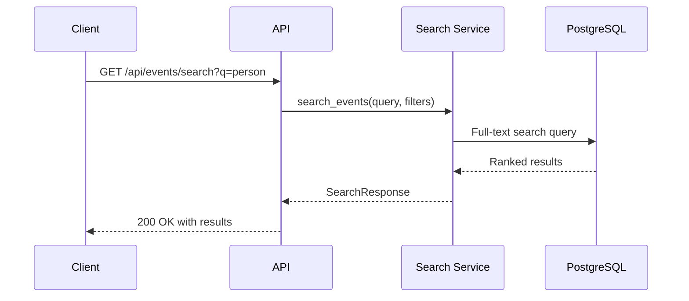

# Events API

The Events API provides endpoints for managing security events. Events are aggregated from detections within time windows and contain LLM-generated risk assessments.

## Endpoints Overview

| Method | Endpoint                            | Description                         |
| ------ | ----------------------------------- | ----------------------------------- |
| GET    | `/api/events`                       | List events with filtering          |
| GET    | `/api/events/stats`                 | Get aggregated event statistics     |
| GET    | `/api/events/search`                | Full-text search events             |
| GET    | `/api/events/export`                | Export events as CSV                |
| GET    | `/api/events/{event_id}`            | Get event by ID                     |
| PATCH  | `/api/events/{event_id}`            | Update event (review status, notes) |
| GET    | `/api/events/{event_id}/detections` | Get detections for event            |

---

## GET /api/events

List events with optional filtering and pagination.

**Source:** [`list_events`](../backend/api/routes/events.py:55)

**Parameters:**

| Name          | Type     | In    | Required | Description                                                   |
| ------------- | -------- | ----- | -------- | ------------------------------------------------------------- |
| `camera_id`   | string   | query | No       | Filter by camera UUID                                         |
| `risk_level`  | string   | query | No       | Filter by risk level: `low`, `medium`, `high`, `critical`     |
| `start_date`  | datetime | query | No       | Filter events starting after this date (ISO 8601)             |
| `end_date`    | datetime | query | No       | Filter events starting before this date (ISO 8601)            |
| `reviewed`    | boolean  | query | No       | Filter by reviewed status                                     |
| `object_type` | string   | query | No       | Filter by detected object type: `person`, `vehicle`, `animal` |
| `limit`       | integer  | query | No       | Max results (1-1000, default: 50)                             |
| `offset`      | integer  | query | No       | Results to skip (default: 0)                                  |

**Response:** `200 OK`

```json
{
  "events": [
    {
      "id": 1,
      "camera_id": "123e4567-e89b-12d3-a456-426614174000",
      "started_at": "2025-12-23T12:00:00Z",
      "ended_at": "2025-12-23T12:02:30Z",
      "risk_score": 75,
      "risk_level": "medium",
      "summary": "Person detected near front entrance",
      "reasoning": "Person approaching entrance during daytime, no suspicious behavior",
      "reviewed": false,
      "detection_count": 5,
      "detection_ids": [1, 2, 3, 4, 5]
    }
  ],
  "count": 1,
  "limit": 50,
  "offset": 0
}
```

**Example Requests:**

```bash
# List all events
curl http://localhost:8000/api/events

# Filter by camera and risk level
curl "http://localhost:8000/api/events?camera_id=123e4567&risk_level=high"

# Filter by date range
curl "http://localhost:8000/api/events?start_date=2025-12-23T00:00:00Z&end_date=2025-12-24T00:00:00Z"

# Filter by object type
curl "http://localhost:8000/api/events?object_type=person"

# Filter unreviewed events
curl "http://localhost:8000/api/events?reviewed=false"
```

---

## GET /api/events/stats

Get aggregated event statistics.

**Source:** [`get_event_stats`](../backend/api/routes/events.py:181)

**Parameters:**

| Name         | Type     | In    | Required | Description                             |
| ------------ | -------- | ----- | -------- | --------------------------------------- |
| `start_date` | datetime | query | No       | Filter events starting after this date  |
| `end_date`   | datetime | query | No       | Filter events starting before this date |

**Response:** `200 OK`

```json
{
  "total_events": 44,
  "events_by_risk_level": {
    "critical": 2,
    "high": 5,
    "medium": 12,
    "low": 25
  },
  "events_by_camera": [
    {
      "camera_id": "123e4567-e89b-12d3-a456-426614174000",
      "camera_name": "Front Door",
      "event_count": 30
    },
    {
      "camera_id": "456e7890-e89b-12d3-a456-426614174001",
      "camera_name": "Back Door",
      "event_count": 14
    }
  ]
}
```

**Example Request:**

```bash
# Get overall statistics
curl http://localhost:8000/api/events/stats

# Get statistics for specific date range
curl "http://localhost:8000/api/events/stats?start_date=2025-12-01T00:00:00Z&end_date=2025-12-31T23:59:59Z"
```

---

## GET /api/events/search

Full-text search events using PostgreSQL full-text search.

**Source:** [`search_events_endpoint`](../backend/api/routes/events.py:258)

**Parameters:**

| Name          | Type     | In    | Required | Description                       |
| ------------- | -------- | ----- | -------- | --------------------------------- |
| `q`           | string   | query | Yes      | Search query string (min 1 char)  |
| `camera_id`   | string   | query | No       | Comma-separated camera IDs        |
| `start_date`  | datetime | query | No       | Filter by start date              |
| `end_date`    | datetime | query | No       | Filter by end date                |
| `severity`    | string   | query | No       | Comma-separated risk levels       |
| `object_type` | string   | query | No       | Comma-separated object types      |
| `reviewed`    | boolean  | query | No       | Filter by reviewed status         |
| `limit`       | integer  | query | No       | Max results (1-1000, default: 50) |
| `offset`      | integer  | query | No       | Results to skip (default: 0)      |

**Search Query Syntax:**

| Syntax            | Description        | Example               |
| ----------------- | ------------------ | --------------------- |
| `word1 word2`     | Implicit AND       | `person vehicle`      |
| `"phrase"`        | Exact phrase match | `"suspicious person"` |
| `word1 OR word2`  | Boolean OR         | `person OR animal`    |
| `word1 NOT word2` | Boolean NOT        | `person NOT cat`      |
| `word1 AND word2` | Explicit AND       | `person AND vehicle`  |

**Response:** `200 OK`

```json
{
  "results": [
    {
      "id": 1,
      "camera_id": "123e4567-e89b-12d3-a456-426614174000",
      "camera_name": "Front Door",
      "started_at": "2025-12-23T12:00:00Z",
      "ended_at": "2025-12-23T12:02:30Z",
      "risk_score": 75,
      "risk_level": "medium",
      "summary": "Person detected near front entrance",
      "reasoning": "Person approaching entrance during daytime",
      "reviewed": false,
      "detection_count": 5,
      "detection_ids": [1, 2, 3, 4, 5],
      "object_types": ["person"],
      "relevance_score": 0.85
    }
  ],
  "total_count": 1,
  "limit": 50,
  "offset": 0
}
```

**Example Requests:**

```bash
# Basic search
curl "http://localhost:8000/api/events/search?q=person"

# Search with filters
curl "http://localhost:8000/api/events/search?q=suspicious&severity=high,critical&object_type=person"

# Phrase search
curl "http://localhost:8000/api/events/search?q=\"suspicious%20person\""

# Boolean search
curl "http://localhost:8000/api/events/search?q=person%20NOT%20delivery"
```



---

## GET /api/events/export

Export events as a CSV file.

**Source:** [`export_events`](../backend/api/routes/events.py:355)

**Parameters:**

| Name         | Type     | In    | Required | Description               |
| ------------ | -------- | ----- | -------- | ------------------------- |
| `camera_id`  | string   | query | No       | Filter by camera ID       |
| `risk_level` | string   | query | No       | Filter by risk level      |
| `start_date` | datetime | query | No       | Filter by start date      |
| `end_date`   | datetime | query | No       | Filter by end date        |
| `reviewed`   | boolean  | query | No       | Filter by reviewed status |

**Response:** `200 OK`

Returns a CSV file as `StreamingResponse` with `Content-Type: text/csv`.

**CSV Columns:**

| Column            | Description                      |
| ----------------- | -------------------------------- |
| `event_id`        | Event ID                         |
| `camera_name`     | Camera display name              |
| `started_at`      | Event start timestamp (ISO 8601) |
| `ended_at`        | Event end timestamp (ISO 8601)   |
| `risk_score`      | Risk score (0-100)               |
| `risk_level`      | Risk level                       |
| `summary`         | Event summary                    |
| `detection_count` | Number of detections             |
| `reviewed`        | "Yes" or "No"                    |

**Response Headers:**

```
Content-Type: text/csv
Content-Disposition: attachment; filename="events_export_20251223_120000.csv"
```

**Example Request:**

```bash
# Export all events
curl -o events.csv http://localhost:8000/api/events/export

# Export filtered events
curl -o high_risk.csv "http://localhost:8000/api/events/export?risk_level=high&risk_level=critical"
```

**Audit Log:**

This operation creates an audit log entry with action `media_exported`.

---

## GET /api/events/{event_id}

Get a specific event by ID.

**Source:** [`get_event`](../backend/api/routes/events.py:490)

**Parameters:**

| Name       | Type    | In   | Required | Description |
| ---------- | ------- | ---- | -------- | ----------- |
| `event_id` | integer | path | Yes      | Event ID    |

**Response:** `200 OK`

```json
{
  "id": 1,
  "camera_id": "123e4567-e89b-12d3-a456-426614174000",
  "started_at": "2025-12-23T12:00:00Z",
  "ended_at": "2025-12-23T12:02:30Z",
  "risk_score": 75,
  "risk_level": "medium",
  "summary": "Person detected near front entrance",
  "reasoning": "Person approaching entrance during daytime, no suspicious behavior",
  "reviewed": false,
  "notes": null,
  "detection_count": 5,
  "detection_ids": [1, 2, 3, 4, 5]
}
```

**Errors:**

| Code | Description                       |
| ---- | --------------------------------- |
| 404  | Event with specified ID not found |

**Example Request:**

```bash
curl http://localhost:8000/api/events/1
```

---

## PATCH /api/events/{event_id}

Update an event's review status and/or notes.

**Source:** [`update_event`](../backend/api/routes/events.py:536)

**Parameters:**

| Name       | Type    | In   | Required | Description |
| ---------- | ------- | ---- | -------- | ----------- |
| `event_id` | integer | path | Yes      | Event ID    |

**Request Body:**

```json
{
  "reviewed": true,
  "notes": "Verified - delivery person"
}
```

**Request Fields:**

| Field      | Type    | Required | Description                            |
| ---------- | ------- | -------- | -------------------------------------- |
| `reviewed` | boolean | No       | Mark event as reviewed or not reviewed |
| `notes`    | string  | No       | User notes for the event               |

**Response:** `200 OK`

```json
{
  "id": 1,
  "camera_id": "123e4567-e89b-12d3-a456-426614174000",
  "started_at": "2025-12-23T12:00:00Z",
  "ended_at": "2025-12-23T12:02:30Z",
  "risk_score": 75,
  "risk_level": "medium",
  "summary": "Person detected near front entrance",
  "reasoning": "Person approaching entrance during daytime",
  "reviewed": true,
  "notes": "Verified - delivery person",
  "detection_count": 5,
  "detection_ids": [1, 2, 3, 4, 5]
}
```

**Errors:**

| Code | Description                       |
| ---- | --------------------------------- |
| 404  | Event with specified ID not found |
| 422  | Validation error                  |

**Example Request:**

```bash
curl -X PATCH http://localhost:8000/api/events/1 \
  -H "Content-Type: application/json" \
  -d '{"reviewed": true, "notes": "False alarm - neighbor"}'
```

**Audit Log:**

This operation creates an audit log entry with:

- Action `event_reviewed` when marking as reviewed
- Action `event_dismissed` when unmarking as reviewed

---

## GET /api/events/{event_id}/detections

Get all detections associated with an event.

**Source:** [`get_event_detections`](../backend/api/routes/events.py:628)

**Parameters:**

| Name       | Type    | In    | Required | Description                       |
| ---------- | ------- | ----- | -------- | --------------------------------- |
| `event_id` | integer | path  | Yes      | Event ID                          |
| `limit`    | integer | query | No       | Max results (1-1000, default: 50) |
| `offset`   | integer | query | No       | Results to skip (default: 0)      |

**Response:** `200 OK`

```json
{
  "detections": [
    {
      "id": 1,
      "camera_id": "123e4567-e89b-12d3-a456-426614174000",
      "file_path": "/export/foscam/front_door/20251223_120000.jpg",
      "file_type": "image/jpeg",
      "detected_at": "2025-12-23T12:00:00Z",
      "object_type": "person",
      "confidence": 0.95,
      "bbox_x": 100,
      "bbox_y": 150,
      "bbox_width": 200,
      "bbox_height": 400,
      "thumbnail_path": "/data/thumbnails/1_thumb.jpg"
    }
  ],
  "count": 1,
  "limit": 50,
  "offset": 0
}
```

**Errors:**

| Code | Description                       |
| ---- | --------------------------------- |
| 404  | Event with specified ID not found |

**Example Request:**

```bash
curl http://localhost:8000/api/events/1/detections
```

---

## Data Models

### EventResponse

Full event response model.

**Source:** [`EventResponse`](../backend/api/schemas/events.py:8)

| Field             | Type           | Description                                     |
| ----------------- | -------------- | ----------------------------------------------- |
| `id`              | integer        | Event ID                                        |
| `camera_id`       | string         | Camera UUID                                     |
| `started_at`      | datetime       | Event start timestamp                           |
| `ended_at`        | datetime       | Event end timestamp (nullable)                  |
| `risk_score`      | integer        | Risk score 0-100 (nullable)                     |
| `risk_level`      | string         | Risk level: `low`, `medium`, `high`, `critical` |
| `summary`         | string         | LLM-generated event summary (nullable)          |
| `reasoning`       | string         | LLM reasoning for risk score (nullable)         |
| `reviewed`        | boolean        | Whether event has been reviewed                 |
| `notes`           | string         | User notes for the event (nullable)             |
| `detection_count` | integer        | Number of detections in this event              |
| `detection_ids`   | array[integer] | List of detection IDs                           |

### EventUpdate

Request model for updating an event.

**Source:** [`EventUpdate`](../backend/api/schemas/events.py:47)

| Field      | Type    | Required | Description            |
| ---------- | ------- | -------- | ---------------------- |
| `reviewed` | boolean | No       | Mark event as reviewed |
| `notes`    | string  | No       | User notes             |

### EventStatsResponse

Response model for event statistics.

**Source:** [`EventStatsResponse`](../backend/api/schemas/events.py:136)

| Field                  | Type    | Description                  |
| ---------------------- | ------- | ---------------------------- |
| `total_events`         | integer | Total number of events       |
| `events_by_risk_level` | object  | Counts by risk level         |
| `events_by_camera`     | array   | Events per camera with names |

### SearchResultResponse

Search result with relevance score.

| Field                    | Type          | Description                  |
| ------------------------ | ------------- | ---------------------------- |
| All EventResponse fields | -             | Inherited from event         |
| `camera_name`            | string        | Camera display name          |
| `object_types`           | array[string] | Detected object types        |
| `relevance_score`        | float         | Search relevance score (0-1) |

---

## Related Documentation

- [Cameras API](cameras.md) - Events are linked to cameras
- [Detections API](detections.md) - Events contain multiple detections
- [WebSocket API](websocket.md) - Real-time event streaming
