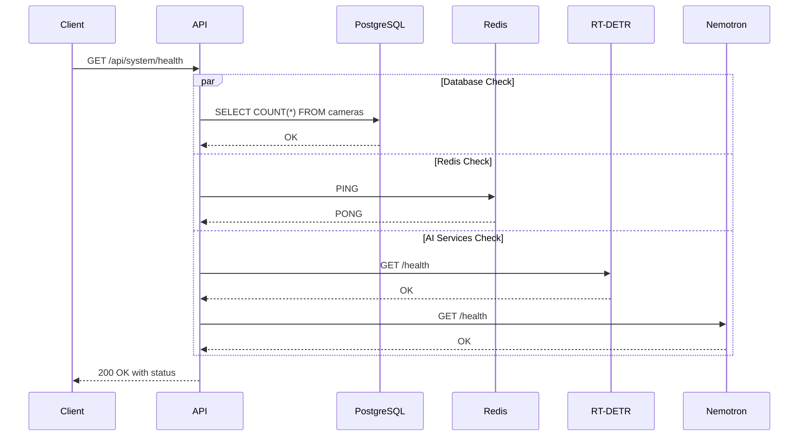

# System API

The System API provides endpoints for monitoring system health, GPU statistics, configuration management, telemetry, and storage metrics.

## Endpoints Overview

| Method | Endpoint                       | Description                |
| ------ | ------------------------------ | -------------------------- |
| GET    | `/api/system/health`           | Detailed health check      |
| GET    | `/health` (root level)         | Kubernetes liveness probe  |
| GET    | `/api/system/health/ready`     | Kubernetes readiness probe |
| GET    | `/api/system/gpu`              | Current GPU statistics     |
| GET    | `/api/system/gpu/history`      | GPU stats time series      |
| GET    | `/api/system/stats`            | System statistics          |
| GET    | `/api/system/config`           | Get configuration          |
| PATCH  | `/api/system/config`           | Update configuration       |
| GET    | `/api/system/telemetry`        | Pipeline telemetry         |
| GET    | `/api/system/pipeline-latency` | Pipeline latency metrics   |
| POST   | `/api/system/cleanup`          | Trigger data cleanup       |
| GET    | `/api/system/severity`         | Severity definitions       |
| GET    | `/api/system/storage`          | Storage statistics         |

---

## GET /api/system/health

Get detailed system health check.

**Source:** [`get_health`](../../backend/api/routes/system.py:665)

**Response:** `200 OK` (healthy) or `503 Service Unavailable` (degraded/unhealthy)

```json
{
  "status": "healthy",
  "services": {
    "database": {
      "status": "healthy",
      "message": "Database operational",
      "details": null
    },
    "redis": {
      "status": "healthy",
      "message": "Redis connected",
      "details": { "redis_version": "7.0.0" }
    },
    "ai": {
      "status": "healthy",
      "message": "AI services operational",
      "details": { "rtdetr": "healthy", "nemotron": "healthy" }
    }
  },
  "timestamp": "2025-12-23T10:30:00Z"
}
```

**Response Fields:**

| Field       | Type     | Description                                        |
| ----------- | -------- | -------------------------------------------------- |
| `status`    | string   | Overall status: `healthy`, `degraded`, `unhealthy` |
| `services`  | object   | Individual service status objects                  |
| `timestamp` | datetime | Health check timestamp                             |

**Service Status Values:**

| Status      | Description                               |
| ----------- | ----------------------------------------- |
| `healthy`   | Service is functioning normally           |
| `degraded`  | Service has issues but system can operate |
| `unhealthy` | Service is down or not responding         |

**Health Check Flow:**



---

## GET /health (Root Level)

Kubernetes-style liveness probe.

**Source:** [`health`](../../backend/main.py:297)

**Response:** `200 OK`

```json
{
  "status": "alive"
}
```

**Purpose:** Indicates whether the process is running. Always returns 200 if the HTTP server is responding. Used by container orchestrators to determine if the process needs to be restarted.

**Note:** This is a root-level endpoint (not under `/api/system/`). The previous `/api/system/health/live` endpoint was removed to consolidate duplicate functionality.

---

## GET /api/system/health/ready

Kubernetes-style readiness probe with detailed status.

**Source:** [`get_readiness`](../../backend/api/routes/system.py:774)

**Response:** `200 OK` (ready) or `503 Service Unavailable` (not ready)

```json
{
  "ready": true,
  "status": "ready",
  "services": {
    "database": {
      "status": "healthy",
      "message": "Database operational",
      "details": null
    },
    "redis": {
      "status": "healthy",
      "message": "Redis connected",
      "details": { "redis_version": "7.0.0" }
    },
    "ai": {
      "status": "healthy",
      "message": "AI services operational",
      "details": null
    }
  },
  "workers": [
    { "name": "gpu_monitor", "running": true, "message": null },
    { "name": "cleanup_service", "running": true, "message": null },
    { "name": "detection_worker", "running": true, "message": null },
    { "name": "analysis_worker", "running": true, "message": null }
  ],
  "timestamp": "2025-12-23T10:30:00Z"
}
```

**Response Fields:**

| Field       | Type     | Description                         |
| ----------- | -------- | ----------------------------------- |
| `ready`     | boolean  | Whether system can process requests |
| `status`    | string   | `ready`, `degraded`, or `not_ready` |
| `services`  | object   | Infrastructure service statuses     |
| `workers`   | array    | Background worker statuses          |
| `timestamp` | datetime | Check timestamp                     |

**Readiness Criteria:**

- Database must be healthy
- Redis must be healthy
- Pipeline workers (detection, analysis) must be running

---

## GET /api/system/gpu

Get current GPU statistics.

**Source:** [`get_gpu_stats`](../../backend/api/routes/system.py:893)

**Response:** `200 OK`

```json
{
  "gpu_name": "NVIDIA RTX A5500",
  "utilization": 75.5,
  "memory_used": 12000,
  "memory_total": 24000,
  "temperature": 65.0,
  "power_usage": 150.0,
  "inference_fps": 30.5
}
```

**Response Fields:**

| Field           | Type    | Description                                 |
| --------------- | ------- | ------------------------------------------- |
| `gpu_name`      | string  | GPU device name (nullable)                  |
| `utilization`   | float   | GPU utilization percentage 0-100 (nullable) |
| `memory_used`   | integer | Memory used in MB (nullable)                |
| `memory_total`  | integer | Total memory in MB (nullable)               |
| `temperature`   | float   | Temperature in Celsius (nullable)           |
| `power_usage`   | float   | Power usage in watts (nullable)             |
| `inference_fps` | float   | Inference frames per second (nullable)      |

---

## GET /api/system/gpu/history

Get GPU statistics time series for charting.

**Source:** [`get_gpu_stats_history`](../../backend/api/routes/system.py:933)

**Parameters:**

| Name    | Type     | In    | Required | Description                                     |
| ------- | -------- | ----- | -------- | ----------------------------------------------- |
| `since` | datetime | query | No       | Lower bound for recorded_at (ISO datetime)      |
| `limit` | integer  | query | No       | Max samples to return (default: 300, max: 5000) |

**Response:** `200 OK`

```json
{
  "samples": [
    {
      "recorded_at": "2025-12-23T10:00:00Z",
      "gpu_name": "NVIDIA RTX A5500",
      "utilization": 72.0,
      "memory_used": 11500,
      "memory_total": 24000,
      "temperature": 64.0,
      "power_usage": 145.0,
      "inference_fps": 28.5
    }
  ],
  "count": 1,
  "limit": 300
}
```

**Example Request:**

```bash
# Get last 100 samples
curl "http://localhost:8000/api/system/gpu/history?limit=100"

# Get samples since specific time
curl "http://localhost:8000/api/system/gpu/history?since=2025-12-23T09:00:00Z"
```

---

## GET /api/system/stats

Get system statistics.

**Source:** [`get_stats`](../../backend/api/routes/system.py:1100)

**Response:** `200 OK`

```json
{
  "total_cameras": 4,
  "total_events": 156,
  "total_detections": 892,
  "uptime_seconds": 86400.5
}
```

**Response Fields:**

| Field              | Type    | Description                   |
| ------------------ | ------- | ----------------------------- |
| `total_cameras`    | integer | Total number of cameras       |
| `total_events`     | integer | Total number of events        |
| `total_detections` | integer | Total number of detections    |
| `uptime_seconds`   | float   | Application uptime in seconds |

---

## GET /api/system/config

Get public configuration settings.

**Source:** [`get_config`](../../backend/api/routes/system.py:976)

**Response:** `200 OK`

```json
{
  "app_name": "Home Security Intelligence",
  "version": "0.1.0",
  "retention_days": 30,
  "batch_window_seconds": 90,
  "batch_idle_timeout_seconds": 30,
  "detection_confidence_threshold": 0.5
}
```

**Response Fields:**

| Field                            | Type    | Description                    |
| -------------------------------- | ------- | ------------------------------ |
| `app_name`                       | string  | Application name               |
| `version`                        | string  | Application version            |
| `retention_days`                 | integer | Data retention period (1-365)  |
| `batch_window_seconds`           | integer | Detection batch window         |
| `batch_idle_timeout_seconds`     | integer | Batch idle timeout             |
| `detection_confidence_threshold` | float   | Min confidence threshold (0-1) |

**Note:** This endpoint does NOT expose secrets like database URLs or API keys.

---

## PATCH /api/system/config

Update runtime configuration settings.

**Source:** [`patch_config`](../../backend/api/routes/system.py:1023)

**Authentication:** Required when `api_key_enabled=true` (via `X-API-Key` header)

**Request Body:**

```json
{
  "retention_days": 14,
  "batch_window_seconds": 60,
  "batch_idle_timeout_seconds": 20,
  "detection_confidence_threshold": 0.6
}
```

**Request Fields:**

| Field                            | Type    | Required | Constraints | Description              |
| -------------------------------- | ------- | -------- | ----------- | ------------------------ |
| `retention_days`                 | integer | No       | 1-365       | Data retention period    |
| `batch_window_seconds`           | integer | No       | >= 1        | Detection batch window   |
| `batch_idle_timeout_seconds`     | integer | No       | >= 1        | Batch idle timeout       |
| `detection_confidence_threshold` | float   | No       | 0.0-1.0     | Min confidence threshold |

**Response:** `200 OK`

Returns updated configuration (same format as GET).

**Errors:**

| Code | Description                 |
| ---- | --------------------------- |
| 401  | API key required or invalid |
| 422  | Validation error            |

**Example Request:**

```bash
curl -X PATCH http://localhost:8000/api/system/config \
  -H "Content-Type: application/json" \
  -H "X-API-Key: your-api-key" \
  -d '{"retention_days": 14}'
```

**Audit Log:** Creates audit entry with action `settings_changed`.

---

## GET /api/system/telemetry

Get pipeline telemetry data.

**Source:** [`get_telemetry`](../../backend/api/routes/system.py:1271)

**Response:** `200 OK`

```json
{
  "queues": {
    "detection_queue": 5,
    "analysis_queue": 2
  },
  "latencies": {
    "watch": {
      "avg_ms": 10.0,
      "min_ms": 5.0,
      "max_ms": 50.0,
      "p50_ms": 8.0,
      "p95_ms": 40.0,
      "p99_ms": 48.0,
      "sample_count": 500
    },
    "detect": {
      "avg_ms": 200.0,
      "min_ms": 100.0,
      "max_ms": 800.0,
      "p50_ms": 180.0,
      "p95_ms": 600.0,
      "p99_ms": 750.0,
      "sample_count": 500
    },
    "batch": null,
    "analyze": null
  },
  "timestamp": "2025-12-27T10:30:00Z"
}
```

**Response Fields:**

| Field                    | Type     | Description                     |
| ------------------------ | -------- | ------------------------------- |
| `queues.detection_queue` | integer  | Items in detection queue        |
| `queues.analysis_queue`  | integer  | Items in analysis queue         |
| `latencies.watch`        | object   | File watcher latency stats      |
| `latencies.detect`       | object   | Object detection latency stats  |
| `latencies.batch`        | object   | Batch aggregation latency stats |
| `latencies.analyze`      | object   | LLM analysis latency stats      |
| `timestamp`              | datetime | Telemetry snapshot timestamp    |

---

## GET /api/system/pipeline-latency

Get detailed pipeline latency metrics with percentiles.

**Source:** [`get_pipeline_latency`](../../backend/api/routes/system.py:1344)

**Parameters:**

| Name             | Type    | In    | Required | Description                         |
| ---------------- | ------- | ----- | -------- | ----------------------------------- |
| `window_minutes` | integer | query | No       | Time window for stats (default: 60) |

**Response:** `200 OK`

```json
{
  "watch_to_detect": {
    "avg_ms": 50.0,
    "min_ms": 10.0,
    "max_ms": 200.0,
    "p50_ms": 40.0,
    "p95_ms": 150.0,
    "p99_ms": 180.0,
    "sample_count": 500
  },
  "detect_to_batch": {
    "avg_ms": 100.0,
    "min_ms": 20.0,
    "max_ms": 500.0,
    "p50_ms": 80.0,
    "p95_ms": 400.0,
    "p99_ms": 480.0,
    "sample_count": 500
  },
  "batch_to_analyze": {
    "avg_ms": 5000.0,
    "min_ms": 2000.0,
    "max_ms": 15000.0,
    "p50_ms": 4500.0,
    "p95_ms": 12000.0,
    "p99_ms": 14000.0,
    "sample_count": 100
  },
  "total_pipeline": {
    "avg_ms": 35000.0,
    "min_ms": 10000.0,
    "max_ms": 120000.0,
    "p50_ms": 30000.0,
    "p95_ms": 100000.0,
    "p99_ms": 110000.0,
    "sample_count": 100
  },
  "window_minutes": 60,
  "timestamp": "2025-12-28T10:30:00Z"
}
```

---

## POST /api/system/cleanup

Trigger manual data cleanup.

**Source:** [`trigger_cleanup`](../../backend/api/routes/system.py:1391)

**Authentication:** Required when `api_key_enabled=true` (via `X-API-Key` header)

**Parameters:**

| Name      | Type    | In    | Required | Description                                         |
| --------- | ------- | ----- | -------- | --------------------------------------------------- |
| `dry_run` | boolean | query | No       | Preview deletion without executing (default: false) |

**Response:** `200 OK`

```json
{
  "events_deleted": 15,
  "detections_deleted": 89,
  "gpu_stats_deleted": 2880,
  "logs_deleted": 150,
  "thumbnails_deleted": 89,
  "images_deleted": 0,
  "space_reclaimed": 524288000,
  "retention_days": 30,
  "dry_run": false,
  "timestamp": "2025-12-27T10:30:00Z"
}
```

**Response Fields:**

| Field                | Type     | Description                  |
| -------------------- | -------- | ---------------------------- |
| `events_deleted`     | integer  | Events deleted (or would be) |
| `detections_deleted` | integer  | Detections deleted           |
| `gpu_stats_deleted`  | integer  | GPU stat records deleted     |
| `logs_deleted`       | integer  | Log records deleted          |
| `thumbnails_deleted` | integer  | Thumbnail files deleted      |
| `images_deleted`     | integer  | Original images deleted      |
| `space_reclaimed`    | integer  | Bytes freed (estimated)      |
| `retention_days`     | integer  | Retention period used        |
| `dry_run`            | boolean  | Whether this was a dry run   |
| `timestamp`          | datetime | Operation timestamp          |

**Example Requests:**

```bash
# Preview what would be deleted
curl -X POST "http://localhost:8000/api/system/cleanup?dry_run=true" \
  -H "X-API-Key: your-api-key"

# Execute cleanup
curl -X POST http://localhost:8000/api/system/cleanup \
  -H "X-API-Key: your-api-key"
```

---

## GET /api/system/severity

Get severity level definitions and thresholds.

**Source:** [`get_severity_metadata`](../../backend/api/routes/system.py:1495)

**Response:** `200 OK`

```json
{
  "definitions": [
    {
      "severity": "low",
      "label": "Low",
      "description": "Routine activity, no concern",
      "color": "#22c55e",
      "priority": 3,
      "min_score": 0,
      "max_score": 29
    },
    {
      "severity": "medium",
      "label": "Medium",
      "description": "Notable activity, worth reviewing",
      "color": "#eab308",
      "priority": 2,
      "min_score": 30,
      "max_score": 59
    },
    {
      "severity": "high",
      "label": "High",
      "description": "Concerning activity, review soon",
      "color": "#f97316",
      "priority": 1,
      "min_score": 60,
      "max_score": 84
    },
    {
      "severity": "critical",
      "label": "Critical",
      "description": "Immediate attention required",
      "color": "#ef4444",
      "priority": 0,
      "min_score": 85,
      "max_score": 100
    }
  ],
  "thresholds": {
    "low_max": 29,
    "medium_max": 59,
    "high_max": 84
  }
}
```

---

## GET /api/system/storage

Get storage statistics and disk usage.

**Source:** [`get_storage_stats`](../../backend/api/routes/system.py:1583)

**Response:** `200 OK`

```json
{
  "disk_used_bytes": 107374182400,
  "disk_total_bytes": 536870912000,
  "disk_free_bytes": 429496729600,
  "disk_usage_percent": 20.0,
  "thumbnails": {
    "file_count": 1500,
    "size_bytes": 75000000
  },
  "images": {
    "file_count": 10000,
    "size_bytes": 5000000000
  },
  "clips": {
    "file_count": 50,
    "size_bytes": 500000000
  },
  "events_count": 156,
  "detections_count": 892,
  "gpu_stats_count": 2880,
  "logs_count": 5000,
  "timestamp": "2025-12-30T10:30:00Z"
}
```

**Response Fields:**

| Field                | Type     | Description                   |
| -------------------- | -------- | ----------------------------- |
| `disk_used_bytes`    | integer  | Total disk space used         |
| `disk_total_bytes`   | integer  | Total disk capacity           |
| `disk_free_bytes`    | integer  | Free disk space               |
| `disk_usage_percent` | float    | Disk usage percentage (0-100) |
| `thumbnails`         | object   | Thumbnail storage stats       |
| `images`             | object   | Original image storage stats  |
| `clips`              | object   | Video clip storage stats      |
| `events_count`       | integer  | Total events in database      |
| `detections_count`   | integer  | Total detections in database  |
| `gpu_stats_count`    | integer  | Total GPU stat records        |
| `logs_count`         | integer  | Total log entries             |
| `timestamp`          | datetime | Snapshot timestamp            |

---

## Related Documentation

- [Events API](events.md) - Event statistics
- [Detections API](detections.md) - Detection counts
- [Cameras API](cameras.md) - Camera management
- [WebSocket API](websocket.md) - Real-time system status
