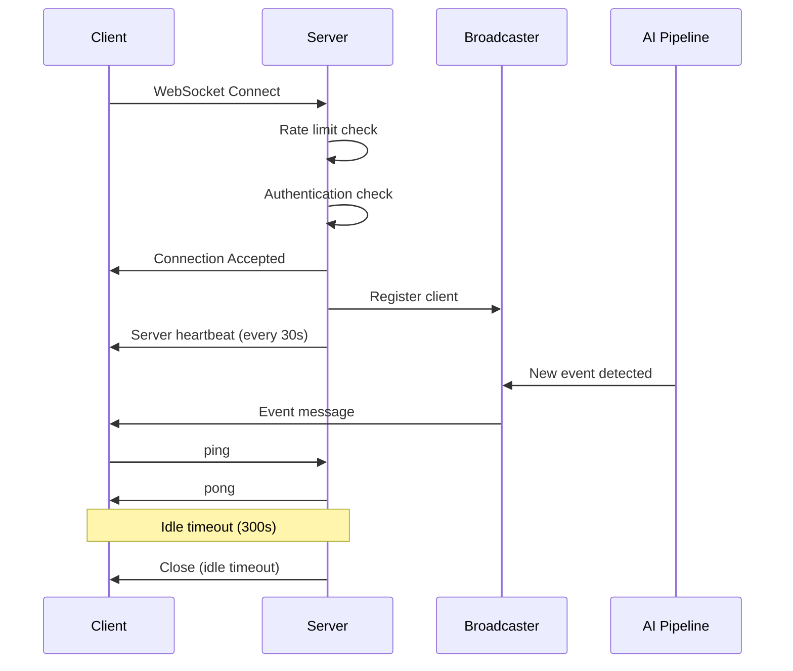

# WebSocket API

The WebSocket API provides real-time streaming of security events and system status updates. Clients connect via WebSocket to receive push notifications as events occur.

## Endpoints Overview

| Protocol | Endpoint     | Description                      |
| -------- | ------------ | -------------------------------- |
| WS       | `/ws/events` | Real-time security events stream |
| WS       | `/ws/system` | Real-time system status updates  |

---

## WS /ws/events

Stream security events in real-time as they are detected and analyzed.

**Source:** [`websocket_events_endpoint`](../../backend/api/routes/websocket.py:174)

### Connection

**URL:** `ws://localhost:8000/ws/events`

**Authentication:** Required when `api_key_enabled=true`

Provide API key via:

1. **Query parameter:** `ws://localhost:8000/ws/events?api_key=YOUR_KEY`
2. **Sec-WebSocket-Protocol header:** `api-key.YOUR_KEY`

### Connection Lifecycle



### Server-Sent Messages

#### Event Message

Sent when a new security event is created:

```json
{
  "type": "event",
  "data": {
    "id": 1,
    "event_id": 1,
    "batch_id": "batch_abc123",
    "camera_id": "123e4567-e89b-12d3-a456-426614174000",
    "risk_score": 75,
    "risk_level": "high",
    "summary": "Person detected at front door",
    "started_at": "2025-12-23T12:00:00"
  }
}
```

**Event Data Fields:**

| Field        | Type    | Description                                     |
| ------------ | ------- | ----------------------------------------------- |
| `id`         | integer | Unique event identifier                         |
| `event_id`   | integer | Legacy alias for id (backward compatibility)    |
| `batch_id`   | string  | Detection batch identifier                      |
| `camera_id`  | string  | UUID of camera that captured event              |
| `risk_score` | integer | Risk assessment score (0-100)                   |
| `risk_level` | string  | Risk level: `low`, `medium`, `high`, `critical` |
| `summary`    | string  | Human-readable event description                |
| `started_at` | string  | ISO 8601 timestamp when event started           |

#### Server Heartbeat

Sent periodically (every 30 seconds) to keep connection alive:

```json
{ "type": "ping" }
```

### Client-Sent Messages

#### Ping (Keep-Alive)

Send to keep connection alive and reset idle timeout:

**JSON format:**

```json
{ "type": "ping" }
```

**Legacy format (deprecated):**

```
ping
```

**Server Response:**

```json
{ "type": "pong" }
```

#### Subscribe (Future)

Subscribe to specific event channels:

```json
{
  "type": "subscribe",
  "channels": ["events", "detections"]
}
```

#### Unsubscribe (Future)

Unsubscribe from channels:

```json
{
  "type": "unsubscribe",
  "channels": ["detections"]
}
```

### Error Messages

Sent when client message validation fails:

```json
{
  "type": "error",
  "error": "invalid_json",
  "message": "Message must be valid JSON",
  "details": { "raw_data_preview": "invalid{json" }
}
```

**Error Codes:**

| Code                     | Description                            |
| ------------------------ | -------------------------------------- |
| `invalid_json`           | Message is not valid JSON              |
| `invalid_message_format` | Message does not match expected schema |
| `unknown_message_type`   | Unrecognized message type              |
| `validation_error`       | Schema validation failed               |

### Connection Settings

| Setting                           | Default | Description                                              |
| --------------------------------- | ------- | -------------------------------------------------------- |
| `websocket_idle_timeout_seconds`  | 300     | Close connection after N seconds without client messages |
| `websocket_ping_interval_seconds` | 30      | Server heartbeat interval                                |

### Close Codes

| Code | Reason                                               |
| ---- | ---------------------------------------------------- |
| 1000 | Normal close (idle timeout)                          |
| 1008 | Policy violation (authentication failed, rate limit) |

### JavaScript Example

```javascript
// Connect with API key
const ws = new WebSocket("ws://localhost:8000/ws/events?api_key=YOUR_KEY");

ws.onopen = () => {
  console.log("Connected to event stream");

  // Send periodic pings to keep connection alive
  setInterval(() => {
    ws.send(JSON.stringify({ type: "ping" }));
  }, 60000);
};

ws.onmessage = (event) => {
  const data = JSON.parse(event.data);

  if (data.type === "event") {
    console.log("New security event:", data.data);
    // Handle new event
  } else if (data.type === "pong") {
    console.log("Keepalive acknowledged");
  }
};

ws.onerror = (error) => {
  console.error("WebSocket error:", error);
};

ws.onclose = (event) => {
  console.log(`Connection closed: ${event.code} - ${event.reason}`);
  // Implement reconnection logic
};
```

---

## WS /ws/system

Stream real-time system status updates including GPU metrics, queue status, and health.

**Source:** [`websocket_system_status`](../../backend/api/routes/websocket.py:317)

### Connection

**URL:** `ws://localhost:8000/ws/system`

**Authentication:** Same as `/ws/events`

### Server-Sent Messages

#### System Status Message

Sent periodically with current system metrics:

```json
{
  "type": "system_status",
  "data": {
    "gpu": {
      "utilization": 45.5,
      "memory_used": 8192,
      "memory_total": 24576,
      "temperature": 65.0,
      "inference_fps": 30.5
    },
    "cameras": {
      "active": 4,
      "total": 6
    },
    "queue": {
      "pending": 2,
      "processing": 1
    },
    "health": "healthy"
  },
  "timestamp": "2025-12-23T10:30:00.000Z"
}
```

**System Data Fields:**

| Field               | Type    | Description                                        |
| ------------------- | ------- | -------------------------------------------------- |
| `gpu.utilization`   | float   | GPU utilization percentage                         |
| `gpu.memory_used`   | integer | GPU memory used (MB)                               |
| `gpu.memory_total`  | integer | GPU total memory (MB)                              |
| `gpu.temperature`   | float   | GPU temperature (Celsius)                          |
| `gpu.inference_fps` | float   | Inference frames per second                        |
| `cameras.active`    | integer | Number of active cameras                           |
| `cameras.total`     | integer | Total configured cameras                           |
| `queue.pending`     | integer | Items pending in queue                             |
| `queue.processing`  | integer | Items currently processing                         |
| `health`            | string  | Overall health: `healthy`, `degraded`, `unhealthy` |
| `timestamp`         | string  | ISO 8601 timestamp                                 |

#### Service Status Message

Sent when a service status changes:

```json
{
  "type": "service_status",
  "data": {
    "service": "redis",
    "status": "healthy",
    "message": "Service responding normally"
  },
  "timestamp": "2025-12-23T12:00:00.000Z"
}
```

**Service Status Values:**

| Status           | Description                       |
| ---------------- | --------------------------------- |
| `healthy`        | Service is operating normally     |
| `unhealthy`      | Service is down or not responding |
| `restarting`     | Service is restarting             |
| `restart_failed` | Service restart attempt failed    |
| `failed`         | Service has failed                |

### JavaScript Example

```javascript
const ws = new WebSocket("ws://localhost:8000/ws/system?api_key=YOUR_KEY");

ws.onmessage = (event) => {
  const data = JSON.parse(event.data);

  if (data.type === "system_status") {
    // Update GPU dashboard
    updateGpuStats(data.data.gpu);
    // Update queue indicator
    updateQueueStatus(data.data.queue);
    // Update health badge
    updateHealthBadge(data.data.health);
  } else if (data.type === "service_status") {
    // Handle service status change
    showServiceAlert(data.data);
  }
};
```

---

## Reconnection Strategy

Implement exponential backoff for reconnection:

```javascript
class ReconnectingWebSocket {
  constructor(url) {
    this.url = url;
    this.reconnectDelay = 1000; // Start with 1 second
    this.maxDelay = 30000; // Max 30 seconds
    this.connect();
  }

  connect() {
    this.ws = new WebSocket(this.url);

    this.ws.onopen = () => {
      console.log("Connected");
      this.reconnectDelay = 1000; // Reset delay on success
    };

    this.ws.onclose = (event) => {
      if (event.code !== 1000) {
        // Abnormal close, attempt reconnect
        console.log(`Reconnecting in ${this.reconnectDelay}ms...`);
        setTimeout(() => this.connect(), this.reconnectDelay);
        // Exponential backoff
        this.reconnectDelay = Math.min(this.reconnectDelay * 2, this.maxDelay);
      }
    };

    this.ws.onerror = (error) => {
      console.error("WebSocket error:", error);
    };
  }
}
```

---

## Rate Limiting

WebSocket connections are rate-limited to prevent abuse. If rate limit is exceeded, connection is rejected with close code 1008 (Policy Violation).

---

## Message Schema Reference

### WebSocketMessage (Client to Server)

Base message structure for client-sent messages:

| Field  | Type   | Required | Description               |
| ------ | ------ | -------- | ------------------------- |
| `type` | string | Yes      | Message type (1-50 chars) |
| `data` | object | No       | Optional payload data     |

### WebSocketPingMessage

Keep-alive ping message:

```json
{ "type": "ping" }
```

### WebSocketPongResponse

Server response to ping:

```json
{ "type": "pong" }
```

### WebSocketErrorResponse

Error response for invalid messages:

| Field     | Type   | Description                |
| --------- | ------ | -------------------------- |
| `type`    | string | Always "error"             |
| `error`   | string | Error code                 |
| `message` | string | Human-readable description |
| `details` | object | Additional error context   |

### WebSocketEventMessage

Security event broadcast:

| Field  | Type               | Description    |
| ------ | ------------------ | -------------- |
| `type` | string             | Always "event" |
| `data` | WebSocketEventData | Event payload  |

### WebSocketServiceStatusMessage

Service status update:

| Field       | Type                       | Description             |
| ----------- | -------------------------- | ----------------------- |
| `type`      | string                     | Always "service_status" |
| `data`      | WebSocketServiceStatusData | Status payload          |
| `timestamp` | string                     | ISO 8601 timestamp      |

---

## Related Documentation

- [Events API](events.md) - REST endpoint for events
- [System API](system.md) - REST endpoint for system status
- [Alerts API](alerts.md) - Alert notifications may use WebSocket
