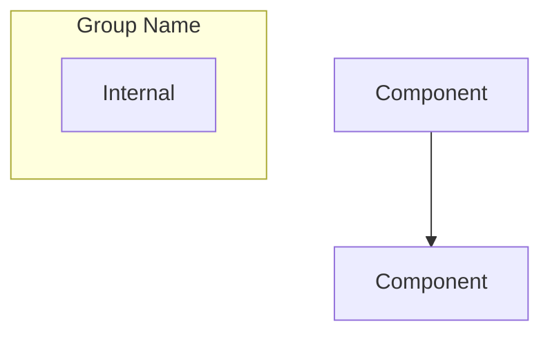

# Architecture Directory - Agent Guide

## Purpose

This directory contains comprehensive architecture documentation for the Home Security Intelligence system. These documents provide deep technical understanding of system design, data models, AI pipeline, and key architectural decisions.

## Directory Contents

```
architecture/
  AGENTS.md         # This file
  overview.md       # High-level system architecture
  ai-pipeline.md    # AI processing pipeline details
  data-model.md     # Database schema and data flow
  decisions.md      # Architectural decisions and rationale
```

## Key Files

### overview.md

**Purpose:** Comprehensive system architecture documentation for technical contributors.

**Sections:**

| Section                    | Description                                            |
| -------------------------- | ------------------------------------------------------ |
| System Purpose             | Problem solved, key value proposition                  |
| High-Level Architecture    | Mermaid diagram showing component relationships        |
| Technology Stack           | Complete tech stack with version numbers and rationale |
| Component Responsibilities | Backend, frontend, AI services breakdown               |
| Communication Patterns     | REST API, WebSocket, Redis Pub/Sub, internal HTTP      |
| Deployment Topology        | Docker vs native deployment, port assignments          |
| Data Flow                  | Camera-to-dashboard pipeline with sequence diagrams    |
| Database Schema            | Entity-relationship diagram with all tables            |
| Error Handling             | Graceful degradation, retry logic, dead-letter queues  |
| Security Model             | Current state and production hardening recommendations |
| Performance                | Latency characteristics and resource usage             |
| Configuration Summary      | Key environment variables                              |
| Image Generation Prompts   | AI prompts for generating architecture diagrams        |

**Key Diagrams:**

- System architecture flowchart (Mermaid)
- Deployment topology with Docker and native services
- Complete pipeline sequence diagram (camera to dashboard)
- Batching logic and fast path flows
- Entity-relationship database schema
- Component interaction diagram

**When to use:** Understanding overall system design, onboarding new developers, making architectural decisions.

### ai-pipeline.md

**Purpose:** Detailed documentation of the AI processing pipeline.

**Topics Covered:**

- FileWatcher service and debouncing
- RT-DETRv2 object detection integration
- Batch aggregator timing and logic
- Nemotron LLM risk analysis
- Fast path vs normal path processing
- Queue management (detection_queue, analysis_queue)
- Error handling and retry strategies

**When to use:** Implementing or debugging AI pipeline features, understanding detection-to-event flow.

### data-model.md

**Purpose:** Database schema documentation and data relationships.

**Topics Covered:**

- SQLAlchemy model definitions with PostgreSQL-specific types (JSONB, TSVECTOR, UUID)
- Table relationships (cameras, detections, events, gpu_stats, logs, zones, alerts, alert_rules)
- Redis data structures for queues and pub/sub
- Index strategy for performance (including GIN indexes for full-text search)
- Data retention and cleanup policies
- Migration strategies with Alembic

**When to use:** Writing database queries, modifying schema, understanding data relationships.

### decisions.md

**Purpose:** Architectural Decision Records (ADRs) specific to architecture choices.

**Topics Covered:**

- ADR-001: PostgreSQL for Database (originally SQLite, migrated due to concurrency)
- ADR-002: Redis for Queues and Pub/Sub
- ADR-003: Detection Batching Strategy (90s window + 30s idle)
- ADR-004: Hybrid Deployment Architecture (Docker + native GPU)
- ADR-005: No Authentication (single-user MVP)
- ADR-006: RT-DETRv2 for Object Detection
- ADR-007: Nemotron for Risk Analysis
- ADR-008: FastAPI + React Stack
- ADR-009: WebSocket for Real-time Updates
- ADR-010: LLM-Determined Risk Scoring
- ADR-011: Native Tremor Charts over Grafana Embeds

**When to use:** Understanding why the system is designed this way, evaluating alternatives.

## Important Patterns

### Hybrid Deployment Model

```
Docker Compose:          Native Processes:
- Frontend (React)       - RT-DETRv2 (GPU)
- Backend (FastAPI)      - Nemotron LLM (GPU)
- Redis
- PostgreSQL
```

AI services run natively because Docker GPU access is complex. Services communicate via `host.docker.internal`.

### Batch Processing Strategy

1. **Normal Path:** Detections accumulate for 90 seconds (or 30s idle timeout)
2. **Fast Path:** High-confidence person detections (>90%) bypass batching
3. **Rationale:** Better LLM context from grouped detections

### Queue-Based Architecture

```
FileWatcher --> detection_queue --> DetectionWorker --> RT-DETRv2
                                         |
                                         v
                               BatchAggregator
                                         |
                                         v
                               analysis_queue --> AnalysisWorker --> Nemotron
```

## Entry Points for Agents

### Understanding System Design

1. Start with `overview.md` for high-level architecture
2. Review Mermaid diagrams for visual understanding
3. Check technology stack table for component choices

### Working on AI Features

1. Read `ai-pipeline.md` for processing flow details
2. Understand batch aggregation timing
3. Review fast path logic for critical detections

### Database Changes

1. Read `data-model.md` for current schema
2. Check entity relationships
3. Review index strategy before adding queries

### Evaluating Alternatives

1. Read `decisions.md` for rationale behind choices
2. Understand constraints that led to current design
3. Check related ADRs in `docs/decisions/`

## Diagram Conventions

All architecture diagrams use Mermaid syntax for version control and easy updates:



## Related Documentation

- **docs/AGENTS.md:** Documentation directory overview
- **docs/plans/:** Implementation plans with design specs
- **docs/decisions/:** Architecture Decision Records
- **backend/AGENTS.md:** Backend implementation details
- **frontend/AGENTS.md:** Frontend implementation details
- **ai/AGENTS.md:** AI services implementation details
