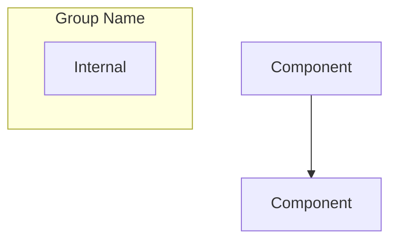

# Architecture Directory - Agent Guide

## Purpose

This directory contains comprehensive architecture documentation for the Home Security Intelligence system. These documents provide deep technical understanding of system design, data models, AI pipeline, and key architectural decisions.

## Directory Contents

```
architecture/
  AGENTS.md         # This file
  README.md         # Hub documentation with navigation
  STANDARDS.md      # Documentation standards and formatting rules
  overview.md       # High-level system architecture
  ai-pipeline.md    # AI processing pipeline details
  data-model.md     # Database schema and data flow (legacy reference)
  decisions.md      # Architectural decisions and rationale
  frontend-hooks.md # Frontend React hooks architecture
  real-time.md      # WebSocket channels, Redis pub/sub, event broadcasting
  resilience.md     # Circuit breakers, retries, DLQ, health monitoring
  system-page-pipeline-visualization.md  # System page pipeline visualization components

  # Hub Subdirectories (each contains README.md and topic-specific docs)
  ai-orchestration/       # AI Model Zoo, inference clients, enrichment pipeline
  api-reference/          # REST endpoint documentation
  background-services/    # Async tasks and workers
  data-model/             # Database schema and relationships (hub)
  dataflows/              # End-to-end data traces
  detection-pipeline/     # Image processing and object detection
  frontend/               # React UI architecture
  middleware/             # Request processing pipeline
  observability/          # Logging, metrics, and monitoring
  realtime-system/        # WebSocket and live updates
  resilience-patterns/    # Error handling and recovery (hub)
  security/               # Security considerations
  system-overview/        # High-level architecture and design decisions
  templates/              # Document templates for new content
  testing/                # Test infrastructure and patterns
```

## Key Files

### overview.md

**Purpose:** Comprehensive system architecture documentation for technical contributors.

**Sections:**

| Section                    | Description                                            |
| -------------------------- | ------------------------------------------------------ |
| System Purpose             | Problem solved, key value proposition                  |
| High-Level Architecture    | Mermaid diagram showing component relationships        |
| Technology Stack           | Complete tech stack with version numbers and rationale |
| Component Responsibilities | Backend, frontend, AI services breakdown               |
| Communication Patterns     | REST API, WebSocket, Redis Pub/Sub, internal HTTP      |
| Deployment Topology        | Docker vs native deployment, port assignments          |
| Data Flow                  | Camera-to-dashboard pipeline with sequence diagrams    |
| Database Schema            | Entity-relationship diagram with all tables            |
| Error Handling             | Graceful degradation, retry logic, dead-letter queues  |
| Security Model             | Current state and production hardening recommendations |
| Performance                | Latency characteristics and resource usage             |
| Configuration Summary      | Key environment variables                              |
| Image Generation Prompts   | AI prompts for generating architecture diagrams        |

**Key Diagrams:**

- System architecture flowchart (Mermaid)
- Deployment topology with Docker and native services
- Complete pipeline sequence diagram (camera to dashboard)
- Batching logic and fast path flows
- Entity-relationship database schema
- Component interaction diagram

**When to use:** Understanding overall system design, onboarding new developers, making architectural decisions.

### ai-pipeline.md

**Purpose:** Detailed documentation of the AI processing pipeline.

**Topics Covered:**

- FileWatcher service and debouncing
- YOLO26 object detection integration
- Batch aggregator timing and logic
- Nemotron LLM risk analysis
- Fast path vs normal path processing
- Queue management (detection_queue, analysis_queue)
- Error handling and retry strategies

**When to use:** Implementing or debugging AI pipeline features, understanding detection-to-event flow.

### data-model.md

**Purpose:** Database schema documentation and data relationships.

**Topics Covered:**

- SQLAlchemy model definitions with PostgreSQL-specific types (JSONB, TSVECTOR, UUID)
- Table relationships (cameras, detections, events, gpu_stats, logs, zones, alerts, alert_rules)
- Redis data structures for queues and pub/sub
- Index strategy for performance (including GIN indexes for full-text search)
- Data retention and cleanup policies
- Migration strategies with Alembic

**When to use:** Writing database queries, modifying schema, understanding data relationships.

### resilience.md

**Purpose:** Documentation of resilience patterns for service reliability.

**Topics Covered:**

- Circuit breaker pattern implementation
- Circuit breaker states (CLOSED, OPEN, HALF_OPEN)
- Retry handler with exponential backoff
- Dead-letter queue (DLQ) management
- Service health monitoring and auto-recovery
- Graceful degradation strategies
- Recovery procedures

**Key Source Files:**

- `backend/services/circuit_breaker.py` - CircuitBreaker, CircuitBreakerConfig, CircuitBreakerRegistry
- `backend/services/retry_handler.py` - RetryHandler, RetryConfig, DLQStats
- `backend/services/health_monitor.py` - ServiceHealthMonitor
- `backend/services/degradation_manager.py` - DegradationManager

**When to use:** Implementing error handling, debugging service failures, understanding failure recovery.

### real-time.md

**Purpose:** Documentation of real-time communication architecture.

**Topics Covered:**

- WebSocket channel architecture (/ws/events, /ws/system)
- Redis pub/sub backbone for multi-instance scaling
- EventBroadcaster for security event distribution
- SystemBroadcaster for health status updates
- Message formats and envelope structure
- Frontend React hook integration
- Connection lifecycle management
- Scaling considerations with sticky sessions

**Key Source Files:**

- `backend/services/event_broadcaster.py` - EventBroadcaster, get_broadcaster
- `backend/services/system_broadcaster.py` - SystemBroadcaster
- `frontend/src/hooks/useWebSocket.ts` - Base WebSocket hook
- `frontend/src/hooks/useEventStream.ts` - Event stream hook
- `frontend/src/hooks/useSystemStatus.ts` - System status hook

**When to use:** Implementing real-time features, debugging WebSocket issues, understanding event flow.

### decisions.md

**Purpose:** Architectural Decision Records (ADRs) specific to architecture choices.

**Topics Covered:**

- ADR-001: PostgreSQL for Database (chosen for concurrent write support)
- ADR-002: Redis for Queues and Pub/Sub
- ADR-003: Detection Batching Strategy (90s window + 30s idle)
- ADR-004: Fully Containerized Deployment (Podman + GPU passthrough)
- ADR-005: No Authentication (single-user MVP)
- ADR-006: YOLO26 for Object Detection
- ADR-007: Nemotron for Risk Analysis
- ADR-008: FastAPI + React Stack
- ADR-009: WebSocket for Real-time Updates
- ADR-010: LLM-Determined Risk Scoring
- ADR-011: Native Tremor Charts over Grafana Embeds

**When to use:** Understanding why the system is designed this way, evaluating alternatives.

### frontend-hooks.md

**Purpose:** Documentation of frontend React hooks architecture.

**Topics Covered:**

- Custom hook patterns and conventions
- Data fetching hooks (useEvents, useDetections, useCameras)
- WebSocket hooks (useWebSocket, useEventStream, useSystemStatus)
- State management hooks
- Error handling and loading states
- Hook composition patterns

**Key Source Files:**

- `frontend/src/hooks/useWebSocket.ts` - Base WebSocket hook
- `frontend/src/hooks/useEventStream.ts` - Event stream hook
- `frontend/src/hooks/useSystemStatus.ts` - System status hook
- `frontend/src/hooks/useEventsQuery.ts` - Events data fetching
- `frontend/src/hooks/useCamerasQuery.ts` - Cameras data fetching

**When to use:** Implementing new frontend features, understanding data flow in components.

### system-page-pipeline-visualization.md

**Purpose:** Documentation of the System page pipeline visualization components.

**Topics Covered:**

- PipelineFlowVisualization component architecture
- Pipeline stages (Files, Detect, Batch, Analyze)
- Health status indicators and color coding
- Background workers grid and status monitoring
- PipelineMetricsPanel with queue depths, latencies, and throughput
- Data sources and refresh rates
- WebSocket and polling integration
- Related system monitoring components

**Key Source Files:**

- `frontend/src/components/system/PipelineFlowVisualization.tsx` - Pipeline flow diagram
- `frontend/src/components/system/PipelineMetricsPanel.tsx` - Detailed metrics panel
- `frontend/src/components/system/SystemMonitoringPage.tsx` - Parent page component
- `frontend/src/components/system/SystemHealthIndicator.tsx` - Summary indicators
- `frontend/src/hooks/usePerformanceMetrics.ts` - Performance data hook
- `backend/api/routes/system.py` - Telemetry API endpoint

**When to use:** Understanding system page components, implementing pipeline monitoring, debugging visualization issues.

## Important Patterns

### Fully Containerized Deployment

```
Podman Containers (all services):
- Frontend (React)
- Backend (FastAPI)
- Redis
- PostgreSQL
- YOLO26 (GPU via CDI)
- Nemotron LLM (GPU via CDI)
```

All services run in OCI containers (Docker or Podman). GPU access is provided via NVIDIA Container Toolkit.

### Batch Processing Strategy

1. **Normal Path:** Detections accumulate for 90 seconds (or 30s idle timeout)
2. **Fast Path:** High-confidence person detections (>90%) bypass batching
3. **Rationale:** Better LLM context from grouped detections

### Queue-Based Architecture

```
FileWatcher --> detection_queue --> DetectionWorker --> YOLO26
                                         |
                                         v
                               BatchAggregator
                                         |
                                         v
                               analysis_queue --> AnalysisWorker --> Nemotron
```

## Entry Points for Agents

### Understanding System Design

1. Start with `overview.md` for high-level architecture
2. Review Mermaid diagrams for visual understanding
3. Check technology stack table for component choices

### Working on AI Features

1. Read `ai-pipeline.md` for processing flow details
2. Read `ai-orchestration/README.md` for model inventory and VRAM allocation
3. Understand batch aggregation timing
4. Review fast path logic for critical detections

### Working on AI Services

1. Read `ai-orchestration/` hub for comprehensive AI documentation:
   - `model-zoo.md` - Model registry, VRAM management, LRU eviction
   - `nemotron-analyzer.md` - LLM-based risk analysis service
   - `enrichment-pipeline.md` - Multi-model enrichment flow
   - `fallback-strategies.md` - Graceful degradation patterns
2. Review source files in `backend/services/` for implementation details:
   - `backend/services/detector_client.py` - YOLO26 detector client implementation
3. Check `ai/enrichment/` for enrichment service models

### Database Changes

1. Read `data-model.md` for current schema
2. Check entity relationships
3. Review index strategy before adding queries

### Evaluating Alternatives

1. Read `decisions.md` for rationale behind choices
2. Understand constraints that led to current design
3. Check related ADRs in `docs/decisions/`

### Implementing Resilience Patterns

1. Read `resilience.md` for circuit breaker and retry patterns
2. Understand DLQ management for failed jobs
3. Review health monitoring for auto-recovery

### Working on Real-time Features

1. Read `real-time.md` for WebSocket architecture
2. Understand Redis pub/sub for event distribution
3. Review message formats and frontend hooks

### Working on Pipeline Visualization

1. Read `system-page-pipeline-visualization.md` for component architecture
2. Understand pipeline stages and health status indicators
3. Review data sources and refresh rates
4. Check telemetry API endpoint for backend integration

## Diagram Conventions

All architecture diagrams use Mermaid syntax for version control and easy updates:



## Related Documentation

- **docs/AGENTS.md:** Documentation directory overview
- **docs/plans/:** Implementation plans with design specs
- **docs/decisions/:** Architecture Decision Records
- **backend/AGENTS.md:** Backend implementation details
- **frontend/AGENTS.md:** Frontend implementation details
- **ai/AGENTS.md:** AI services implementation details
