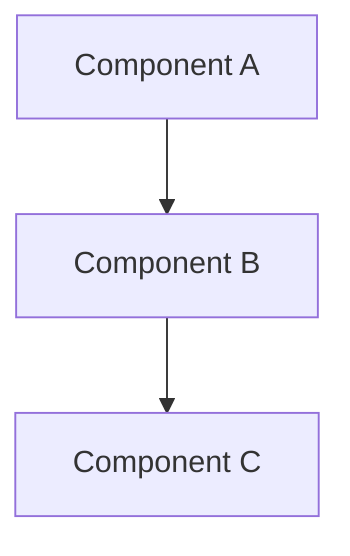

# Documentation Standards

> Formatting rules and conventions for architecture documentation

## Code Citation Format

All code references must use precise file paths with line numbers.

### Single Line Reference

```
backend/services/file_watcher.py:67
```

### Line Range Reference

```
backend/services/file_watcher.py:67-89
```

### Multiple Files

When referencing multiple files, list each on its own line:

```
**Key Files:**
- `backend/services/file_watcher.py:67-89` - File watching implementation
- `backend/services/detection_service.py:45-102` - Detection processing
- `backend/api/routes/events.py:23-45` - Event API endpoints
```

### In-Text Citations

Use backticks for inline code references:

> The `FileWatcher` class (`backend/services/file_watcher.py:15-120`) monitors the camera directory for new images.

## Diagram Standards

### Preferred: Mermaid

Use Mermaid for most diagrams due to its GitHub rendering support and text-based format.

````markdown

````

````

### Complex Diagrams: PlantUML
For diagrams requiring advanced features not available in Mermaid, PlantUML is acceptable:
- Complex sequence diagrams with nested fragments
- Detailed class diagrams with full UML notation
- State machines with complex transitions

### Diagram Requirements
1. **Title**: Every diagram must have a descriptive title
2. **Labels**: All nodes and edges must be labeled
3. **Code References**: Include file:line in node labels where applicable
4. **Legend**: Include legend for non-obvious symbols

### Diagram Types by Use Case

| Use Case | Diagram Type | Tool |
|----------|--------------|------|
| System architecture | flowchart/graph | Mermaid |
| Data flow | flowchart | Mermaid |
| Request sequence | sequenceDiagram | Mermaid |
| Entity relationships | erDiagram | Mermaid |
| State transitions | stateDiagram-v2 | Mermaid |
| Class structure | classDiagram | Mermaid/PlantUML |

## Document Structure Requirements

### Required Sections

Every document must include:

1. **Title** (H1) - Document name
2. **One-line description** (blockquote) - Brief summary
3. **Key Files** - Primary implementation files with line numbers
4. **Overview** - 2-3 paragraph explanation
5. **Related Documents** - Links to connected topics

### Optional Sections (as applicable)

- Architecture (with diagram)
- Implementation Details
- Configuration
- Error Handling
- Testing
- Examples

### Heading Hierarchy

```markdown
# Document Title (H1 - one per document)

## Major Section (H2)

### Subsection (H3)

#### Detail (H4 - use sparingly)
````

## Cross-Reference Format

### Internal Links (within architecture docs)

```markdown
See [Real-time System](../realtime-system/README.md) for WebSocket details.
```

### Hub Links

```markdown
- [Detection Pipeline](../detection-pipeline/README.md)
```

### Document Links

```markdown
For batch processing details, see [Batch Aggregation](./batch-aggregation.md).
```

### External Links

```markdown
See the [FastAPI documentation](https://fastapi.tiangolo.com/) for framework details.
```

## Writing Style

### Voice and Tone

- Use active voice: "The service processes events" not "Events are processed by the service"
- Be direct and concise
- Avoid jargon without explanation
- Write for developers who are new to the codebase

### Technical Writing Guidelines

1. **Define acronyms** on first use: "Real-Time Detection Transformer (RT-DETR)"
2. **Use consistent terminology** throughout all documents
3. **Include examples** for complex concepts
4. **Show, don't just tell** - include code snippets and diagrams

### Code Snippets

- Include language identifier for syntax highlighting
- Keep snippets focused and minimal
- Add comments explaining non-obvious parts
- Reference the source file

```python
# From backend/services/detection_service.py:45-52
async def process_detection(self, image_path: str) -> Detection:
    """Process a single image through the detection pipeline."""
    # Validate image exists
    if not Path(image_path).exists():
        raise FileNotFoundError(f"Image not found: {image_path}")

    # Send to RT-DETR for object detection
    return await self.rtdetr_client.detect(image_path)
```

## Tables

### Standard Table Format

```markdown
| Column 1 | Column 2 | Column 3 |
| -------- | -------- | -------- |
| Data 1   | Data 2   | Data 3   |
```

### Component Reference Table

```markdown
| Component        | File                                       | Purpose                  |
| ---------------- | ------------------------------------------ | ------------------------ |
| FileWatcher      | `backend/services/file_watcher.py:15`      | Monitor camera directory |
| DetectionService | `backend/services/detection_service.py:23` | Process detections       |
```

## File Naming

### Document Files

- Use lowercase with hyphens: `batch-aggregation.md`
- Be descriptive: `websocket-connection-management.md` not `ws.md`
- Hub index files are always `README.md`

### Template Files

- Suffix with `-template`: `document-template.md`
- Store in `templates/` directory

## Validation Checklist

Before committing documentation:

- [ ] All code citations include file paths and line numbers
- [ ] All code citations reference existing files
- [ ] All internal links are valid
- [ ] Mermaid diagrams render correctly
- [ ] Document follows required section structure
- [ ] No broken cross-references
- [ ] Spelling and grammar checked
- [ ] Run `python -m scripts.validate_docs docs/architecture/`

## Version History

When making significant updates to a document, add a note at the bottom:

```markdown
---

_Last updated: 2024-01-15 - Added retry configuration section_
```
