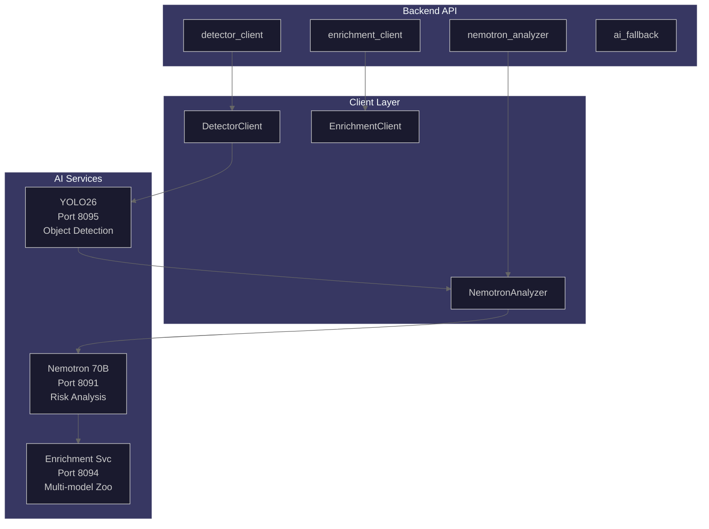

# AI Orchestration Hub

This hub documents the AI model infrastructure that powers the home security intelligence system. The system uses a multi-model architecture with dedicated services for object detection, risk analysis, and context enrichment.

## Model Inventory

| Model              | Port | Container       | VRAM            | Purpose                     |
| ------------------ | ---- | --------------- | --------------- | --------------------------- |
| YOLO26             | 8095 | `ai-yolo26`     | ~650MB          | Primary object detection    |
| Nemotron 30B       | 8091 | `ai-nemotron`   | ~14.7GB         | Risk analysis and reasoning |
| Florence-2         | 8092 | `ai-florence`   | ~1.2GB          | Vision-language captioning  |
| Enrichment Service | 8094 | `ai-enrichment` | ~6.8GB (budget) | Multi-model enrichment      |

## Architecture Overview



## VRAM Budget Allocation

Total GPU VRAM: ~24GB (RTX 3090/4090)

| Component                      | VRAM      | Notes                               |
| ------------------------------ | --------- | ----------------------------------- |
| Nemotron 70B (4-bit quantized) | 21,700 MB | Always loaded via llama.cpp         |
| YOLO26                         | 650 MB    | Always loaded                       |
| Enrichment Model Zoo           | 1,650 MB  | On-demand loading with LRU eviction |

The enrichment service manages its own VRAM budget of ~6.8GB with LRU eviction for its internal models. See [model-zoo.md](./model-zoo.md) for details.

## Documents

| Document                                           | Purpose                                       |
| -------------------------------------------------- | --------------------------------------------- |
| [model-zoo.md](./model-zoo.md)                     | Model registry, VRAM management, LRU eviction |
| [nemotron-analyzer.md](./nemotron-analyzer.md)     | LLM-based risk analysis service               |
| [enrichment-pipeline.md](./enrichment-pipeline.md) | Multi-model enrichment flow                   |
| [fallback-strategies.md](./fallback-strategies.md) | Graceful degradation patterns                 |

## Key Source Files

| File                                    | Purpose                             |
| --------------------------------------- | ----------------------------------- |
| `backend/services/model_zoo.py`         | Backend-side model zoo registry     |
| `backend/services/detector_client.py`   | YOLO26 HTTP client                  |
| `backend/services/nemotron_analyzer.py` | Nemotron LLM analyzer               |
| `backend/services/enrichment_client.py` | Enrichment service client           |
| `backend/services/ai_fallback.py`       | Fallback and degradation management |
| `ai/enrichment/model_manager.py`        | On-demand model manager             |
| `ai/enrichment/model_registry.py`       | Enrichment model configurations     |

## Processing Pipeline

1. **Detection Phase**: Images sent to YOLO26 for object detection
2. **Enrichment Phase**: Detections enriched with additional context (pose, clothing, vehicle type, etc.)
3. **Analysis Phase**: Nemotron LLM analyzes enriched detections and assigns risk scores
4. **Fallback Phase**: If any service fails, graceful degradation provides default values

## Circuit Breaker Integration

All AI clients integrate with the circuit breaker pattern to prevent cascade failures:

- **Closed**: Normal operation, requests pass through
- **Open**: Service unhealthy, requests rejected immediately
- **Half-Open**: Recovery testing with limited requests

See [fallback-strategies.md](./fallback-strategies.md) for detailed degradation behavior.

## Metrics and Observability

Key Prometheus metrics:

```
# Detection pipeline
hsi_detection_processed_total
hsi_detection_filtered_total
hsi_ai_request_duration_seconds{service="yolo26|nemotron|enrichment"}

# Model management
enrichment_vram_usage_bytes
enrichment_vram_utilization_percent
enrichment_model_evictions_total{model_name, priority}
enrichment_model_load_time_seconds{model_name}

# Circuit breakers
hsi_circuit_breaker_state{service}
hsi_circuit_breaker_trips_total{service}
```
