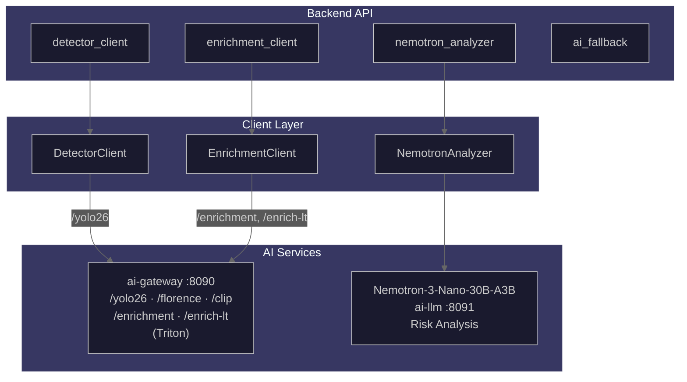

# AI Orchestration Hub

This hub documents the AI model infrastructure that powers the home security intelligence system.
Detection, vision-language, embedding and enrichment models run inside a single `ai-gateway` container
(FastAPI + Triton, port 8090, routers `/yolo26` `/florence` `/clip` `/enrichment` `/enrich-lt`). The
Nemotron LLM runs separately in `ai-llm` (llama.cpp, port 8091).

## Model Inventory

| Model             | Port / route                                 | Container    | VRAM            | Purpose                     |
| ----------------- | -------------------------------------------- | ------------ | --------------- | --------------------------- |
| YOLO26            | `ai-gateway:8090/yolo26`                     | `ai-gateway` | always loaded   | Primary object detection    |
| Nemotron 30B      | `ai-llm:8091`                                | `ai-llm`     | ~14.7GB         | Risk analysis and reasoning |
| Florence-2        | `ai-gateway:8090/florence`                   | `ai-gateway` | on-demand       | Vision-language captioning  |
| Enrichment models | `ai-gateway:8090/enrichment` (+`/enrich-lt`) | `ai-gateway` | ~6.8GB (budget) | Multi-model enrichment      |

## Architecture Overview


```mermaid
%%{init: {
  'theme': 'dark',
  'themeVariables': {
    'primaryColor': '#3B82F6',
    'primaryTextColor': '#FFFFFF',
    'primaryBorderColor': '#60A5FA',
    'secondaryColor': '#A855F7',
    'tertiaryColor': '#009688',
    'background': '#121212',
    'mainBkg': '#1a1a2e',
    'lineColor': '#666666'
  }
}}%%
flowchart TB
    subgraph Backend["Backend API"]
        DC[detector_client]
        NA[nemotron_analyzer]
        EC[enrichment_client]
        AF[ai_fallback]
    end

    subgraph Clients["Client Layer"]
        DCL[DetectorClient]
        NAL[NemotronAnalyzer]
        ECL[EnrichmentClient]
    end

    subgraph AI["AI Services"]
        GW["ai-gateway :8090<br/>/yolo26 · /florence · /clip<br/>/enrichment · /enrich-lt<br/>(Triton)"]
        NEM["Nemotron-3-Nano-30B-A3B<br/>ai-llm :8091<br/>Risk Analysis"]
    end

    DC --> DCL
    NA --> NAL
    EC --> ECL

    DCL -->|/yolo26| GW
    ECL -->|/enrichment, /enrich-lt| GW
    NAL --> NEM
```

## VRAM Budget Allocation

VRAM sizes depend on your GPU (check `nvidia-smi`) and on `GPU_LLM` / `GPU_AI_SERVICES` in `.env.example`,
which assign the LLM and the ai-gateway to specific cards.

| Component                        | VRAM       | Notes                                                                                                                               |
| -------------------------------- | ---------- | ----------------------------------------------------------------------------------------------------------------------------------- |
| Nemotron-3-Nano-30B-A3B (Q4_K_M) | ~14,700 MB | Always loaded in `ai-llm` via llama.cpp                                                                                             |
| ai-gateway model set             | per-model  | YOLO26 always loaded; Florence-2, CLIP and enrichment models load on demand with LRU eviction (per-model `vram_mb` in `models.yml`) |

The enrichment model manager defaults to a 6.8 GB VRAM budget with LRU eviction
(`ai/enrichment/model_manager.py`, `vram_budget_gb=6.8`). See [model-zoo.md](./model-zoo.md) for details.

## Documents

| Document                                           | Purpose                                       |
| -------------------------------------------------- | --------------------------------------------- |
| [model-zoo.md](./model-zoo.md)                     | Model registry, VRAM management, LRU eviction |
| [yolo26-client.md](./yolo26-client.md)             | YOLO26 detection client interface             |
| [nemotron-analyzer.md](./nemotron-analyzer.md)     | LLM-based risk analysis service               |
| [enrichment-pipeline.md](./enrichment-pipeline.md) | Multi-model enrichment flow                   |
| [fallback-strategies.md](./fallback-strategies.md) | Graceful degradation patterns                 |

## Key Source Files

| File                                    | Purpose                             |
| --------------------------------------- | ----------------------------------- |
| `backend/services/model_zoo.py`         | Backend-side model zoo registry     |
| `backend/services/detector_client.py`   | YOLO26 HTTP client                  |
| `backend/services/nemotron_analyzer.py` | Nemotron LLM analyzer               |
| `backend/services/enrichment_client.py` | Enrichment service client           |
| `backend/services/ai_fallback.py`       | Fallback and degradation management |
| `ai/enrichment/model_manager.py`        | On-demand model manager             |
| `ai/enrichment/model_registry.py`       | Enrichment model configurations     |

## Processing Pipeline

1. **Detection Phase**: Images sent to YOLO26 for object detection
2. **Enrichment Phase**: Detections enriched with additional context (pose, clothing, vehicle type, etc.)
3. **Analysis Phase**: Nemotron LLM analyzes enriched detections and assigns risk scores
4. **Fallback Phase**: If any service fails, graceful degradation provides default values

## Circuit Breaker Integration

All AI clients integrate with the circuit breaker pattern to prevent cascade failures:

- **Closed**: Normal operation, requests pass through
- **Open**: Service unhealthy, requests rejected immediately
- **Half-Open**: Recovery testing with limited requests

See [fallback-strategies.md](./fallback-strategies.md) for detailed degradation behavior.

## Metrics and Observability

Key Prometheus metrics:

```
# Detection pipeline
hsi_detection_processed_total
hsi_detection_filtered_total
hsi_ai_request_duration_seconds{service="yolo26|nemotron|enrichment"}

# Model management
enrichment_vram_usage_bytes
enrichment_vram_utilization_percent
enrichment_model_evictions_total{model_name, priority}
enrichment_model_load_time_seconds{model_name}

# Circuit breakers
hsi_circuit_breaker_state{service}
hsi_circuit_breaker_trips_total{service}
```
