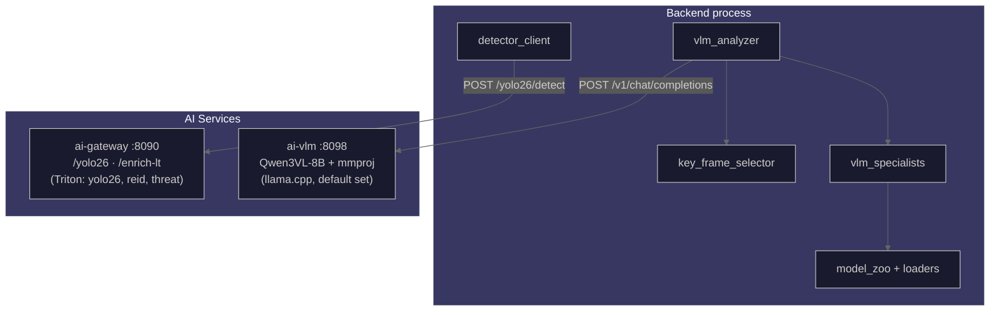

# AI Orchestration Hub

This hub documents the AI model infrastructure that powers the home security intelligence system.
Object detection runs inside the `ai-gateway` container (FastAPI + Triton, port 8090, routers
`/yolo26` and `/enrich-lt`). Vision-language verification runs in `ai-vlm` (llama.cpp
`llama-server`, port 8098, in the default compose set). ai-vlm is the only LLM service.

The three specialist legs — face recognition, license plates, and person re-identification — are
not services. They are Python loaded in the backend process and read against the gallery tables
(see below).

## Service Inventory

| Service    | Port | Container    | What it serves                                                            |
| ---------- | ---- | ------------ | ------------------------------------------------------------------------- |
| ai-gateway | 8090 | `ai-gateway` | Triton models `yolo26`, `reid`, `threat`; routers `/yolo26`, `/enrich-lt` |
| ai-vlm     | 8098 | `ai-vlm`     | `Qwen3VL-8B-Instruct-Q4_K_M` + its mmproj projector, llama.cpp            |

`ai-vlm` ships in the default compose set (`docker-compose.prod.yml:141`), so a plain `up -d`
starts it (until UR-18 it sat behind a `vlm` profile that had to be named explicitly).
Its weights are operator-placed — `ai/download_models.sh`
creates `${AI_MODELS_PATH}/vlm` and names the files, and never fetches them
(`ai/download_models.sh:311-315`, `:493-500`).

The Triton repository holds exactly `{yolo26, reid, threat}`
(`ai/triton/model_repository/`), and `GATEWAY_MODEL_SET` accepts only the value `vlm`
(`ai/gateway/residency.py:84`). `GATEWAY_ENABLE_THREAT` ships `false`, which leaves the served set
`{yolo26, reid}` (`ai/gateway/residency.py:57,78-82`).

## Specialist Legs (in-process, not services)

`collect_specialist_outputs()` runs three legs concurrently over the key-frame picks before the VLM
call, and each leg answers a short text that goes into the prompt
(`backend/services/vlm_specialists.py:884`).

| Leg           | Backing loader                           | Store it reads           | Residency         |
| ------------- | ---------------------------------------- | ------------------------ | ----------------- |
| `faces`       | `face_recognizer_loader` (SCRFD + w600k) | face gallery             | boot preload only |
| `plates`      | `fast_alpr_loader`                       | registered-vehicle table | loads on demand   |
| `person_reid` | `osnet_loader` (OSNet-AIN x1.0)          | person gallery           | boot preload only |

`SPECIALIST_KEYS` is exactly those three (`backend/services/vlm_specialists.py:881`). The face and
re-ID handles are membership reads that never trigger a load
(`osnet_loader.get_reid_handle():182`, `face_recognizer_loader.get_face_leg_handles():466`), and
the boot sweep that would have placed them is gated on `BACKEND_MODEL_PRELOAD`, which ships `false`
(`backend/main.py:1214`, `.env.example:231`). On such a host both legs answer `unavailable` on
every event; the plate leg is the one that still runs, because `load_fast_alpr` loads on demand.

A degraded leg is honest, not silent: `_unavailable_line()`
(`backend/services/vlm_specialists.py:93`) increments `hsi_specialist_unavailable_total` with a
bounded reason code (`backend/core/metrics.py:2394`) — that counter is the query that answers "has
this leg ever run".

## Architecture Overview


```mermaid
%%{init: {
  'theme': 'dark',
  'themeVariables': {
    'primaryColor': '#3B82F6',
    'primaryTextColor': '#FFFFFF',
    'primaryBorderColor': '#60A5FA',
    'secondaryColor': '#A855F7',
    'tertiaryColor': '#009688',
    'background': '#121212',
    'mainBkg': '#1a1a2e',
    'lineColor': '#666666'
  }
}}%%
flowchart TB
    subgraph Backend["Backend process"]
        DC[detector_client]
        VA[vlm_analyzer]
        KS[key_frame_selector]
        SP[vlm_specialists]
        MM[model_zoo + loaders]
    end

    subgraph AI["AI Services"]
        GW["ai-gateway :8090<br/>/yolo26 · /enrich-lt<br/>(Triton: yolo26, reid, threat)"]
        VLM["ai-vlm :8098<br/>Qwen3VL-8B + mmproj<br/>(llama.cpp, default set)"]
    end

    DC -->|POST /yolo26/detect| GW
    VA --> KS
    VA --> SP
    SP --> MM
    VA -->|POST /v1/chat/completions| VLM
```

## VRAM Budget Allocation

GPU placement comes from `GPU_LLM` (the ai-vlm card) and `GPU_AI_SERVICES` (the ai-gateway card),
both in `.env.example:554` and `:946`. On a single-GPU box both are `0`.

| Component                                      | VRAM                                                              |
| ---------------------------------------------- | ----------------------------------------------------------------- |
| ai-vlm (`Qwen3VL-8B-Instruct-Q4_K_M` + mmproj) | weights + KV pool; `--sleep-idle-seconds` releases them when idle |
| Triton `yolo26` (TensorRT engine)              | resident in ai-gateway                                            |
| Triton `reid`                                  | resident (see the note below)                                     |
| Backend lookup legs                            | face + re-ID resident only when `BACKEND_MODEL_PRELOAD=true`      |

Two shipped facts worth knowing before you budget:

- **Residency pays for `reid`, and nothing calls it for inference.** `ai/gateway/residency.py:57` keeps `reid`
  in the `vlm` set, but no backend module uses `/enrich-lt`'s `/person-reid` route — the live re-ID
  leg is the in-process OSNet handle. `/enrich-lt` is read as a readiness probe target only
  (`backend/api/routes/model_management.py:172`).
- **The VLM's KV pool is sized by `VLM_CTX_SIZE` / `VLM_PARALLEL`**, shipped `32768 / 2`, so one
  `vlm_assess` request occupies one 16,384-token slot
  (`docker-compose.prod.yml:204-205`, `.env.example`).

## Documents

| Document                                           | Purpose                                            |
| -------------------------------------------------- | -------------------------------------------------- |
| [model-zoo.md](./model-zoo.md)                     | Backend model registry and the models.yml contract |
| [yolo26-client.md](./yolo26-client.md)             | YOLO26 detection client interface                  |
| [fallback-strategies.md](./fallback-strategies.md) | Degradation levels and what each failure costs     |

## Key Source Files

| File                                      | Purpose                                          |
| ----------------------------------------- | ------------------------------------------------ |
| `backend/services/detector_client.py`     | YOLO26 HTTP client                               |
| `backend/services/vlm_analyzer.py`        | per-event analyzer (`VlmAnalyzer.analyze_batch`) |
| `backend/services/vlm_client.py`          | llama.cpp `chat/completions` client              |
| `backend/services/vlm_specialists.py`     | the three lookup legs                            |
| `backend/services/key_frame_selector.py`  | 1-4 still selection                              |
| `backend/services/model_zoo.py`           | backend model registry from `models.yml`         |
| `backend/services/pipeline_factory.py`    | the one analyzer construction point              |
| `ai/gateway/adapters/yolo26.py`           | gateway `/yolo26` route                          |
| `ai/gateway/adapters/enrichment_light.py` | gateway `/enrich-lt` route                       |

## Processing Pipeline

1. **Detection phase**: each image is posted to `/yolo26/detect` and stored as `Detection` rows.
2. **Batching phase**: detections aggregate per camera and the batch closes on a 90 s window, a 30 s
   idle gap, or 500 detections (`backend/core/config.py:925,930,964`).
3. **Key-frame phase**: `select_key_frames()` picks 1-4 distinct stills
   (`backend/services/key_frame_selector.py:73`).
4. **Specialist phase**: the three lookup legs produce one short text each.
5. **Verification phase**: `VlmClient.assess()` posts the stills and the fitted prompt to ai-vlm and
   gets back a verdict, a score, a summary and a reasoning.
6. **Degradation**: a leg that cannot run writes an `unavailable` line; a VLM that cannot answer
   writes `verdict='verification_failed'` with a NULL score and the event row still lands
   (`backend/services/vlm_analyzer.py:255`).

## Circuit Breaker Integration

Both AI clients use the same breaker machinery (`backend/services/circuit_breaker.py`):

- **Closed**: normal operation, requests pass through
- **Open**: service unhealthy, requests rejected immediately
- **Half-Open**: recovery testing with limited requests

The detector's breaker is `detector_yolo26` with `failure_threshold=5, recovery_timeout=60.0`
(`backend/services/detector_client.py:336`). The VLM client's breaker is named `ai-vlm` with the
same threshold and timeout (`backend/services/vlm_client.py:82,247`).

See [fallback-strategies.md](./fallback-strategies.md) for what the shipped path does with each
failure.

## Metrics and Observability

```
# Detection
hsi_detections_processed_total
hsi_detections_filtered_low_confidence_total
hsi_ai_request_duration_seconds{service="yolo26"}

# Verification / pipeline
hsi_events_by_risk_level_total
hsi_pipeline_errors_total
hsi_specialist_unavailable_total{specialist, reason}

# Backend model residency
hsi_model_load_duration_seconds
hsi_model_warmup_duration_seconds

# Circuit breakers
hsi_circuit_breaker_state{service}
hsi_circuit_breaker_trips_total{service}
```

`hsi_specialist_unavailable_total` is the only signal that distinguishes "a leg never ran" from
"a scene had nothing to find" — specialist degradation never produces a `verification_failed` row,
because a degraded leg degrades into prompt text by design.
