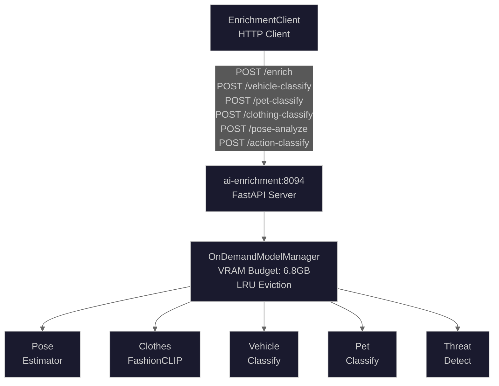
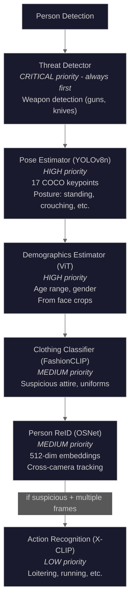
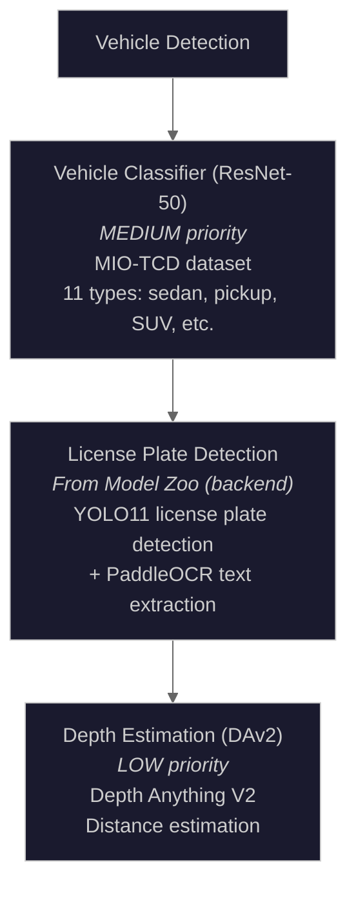
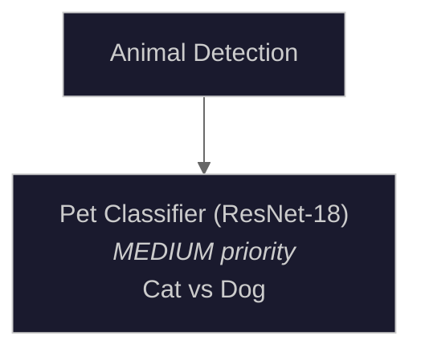

# Enrichment Pipeline

The enrichment pipeline extracts additional context from detections using a multi-model architecture. It runs specialized models for person analysis, vehicle classification, and other enrichment tasks.

## Source Files

- **HTTP Client**: `backend/services/enrichment_client.py`
- **Model Manager**: `ai/enrichment/model_manager.py`
- **Model Registry**: `ai/enrichment/model_registry.py`
- **Individual Models**: `ai/enrichment/models/`

## Architecture Overview



## Service Endpoints

| Endpoint             | Method | Purpose                         |
| -------------------- | ------ | ------------------------------- |
| `/health`            | GET    | Service health check            |
| `/enrich`            | POST   | Unified enrichment (all models) |
| `/vehicle-classify`  | POST   | Vehicle type classification     |
| `/pet-classify`      | POST   | Cat/dog classification          |
| `/clothing-classify` | POST   | FashionCLIP clothing attributes |
| `/pose-analyze`      | POST   | ViTPose+ body keypoints         |
| `/depth-estimate`    | POST   | Depth Anything V2 depth map     |
| `/object-distance`   | POST   | Distance from depth map         |
| `/action-classify`   | POST   | X-CLIP temporal action          |

## Enrichment Client

```python
class EnrichmentClient:
    """Client for interacting with combined enrichment service.

    The enrichment service provides:
    - Vehicle type classification (ResNet-50)
    - Pet classification (ResNet-18 cat/dog)
    - Clothing classification (FashionCLIP)
    - Pose analysis (ViTPose+ Small)
    - Action classification (X-CLIP temporal video understanding)
    """
```

### Configuration

| Setting                           | Default                     | Description               |
| --------------------------------- | --------------------------- | ------------------------- |
| `ENRICHMENT_URL`                  | `http://ai-enrichment:8094` | Service URL               |
| `AI_CONNECT_TIMEOUT`              | 10.0s                       | Connection timeout        |
| `ENRICHMENT_READ_TIMEOUT`         | 60.0s                       | Read timeout              |
| `ENRICHMENT_MAX_RETRIES`          | 3                           | Maximum retry attempts    |
| `ENRICHMENT_CB_FAILURE_THRESHOLD` | 5                           | Circuit breaker threshold |
| `ENRICHMENT_CB_RECOVERY_TIMEOUT`  | 60.0s                       | Circuit breaker recovery  |

## Person Enrichment Pipeline

For person detections, the following models are applied:



### Result Types

```python
@dataclass(slots=True)
class UnifiedPoseResult:
    keypoints: list[dict]  # [{name, x, y, confidence}, ...]
    pose_class: str        # standing, crouching, bending_over, etc.
    confidence: float      # 0-1
    is_suspicious: bool    # True if crouching, lying_down, etc.

@dataclass(slots=True)
class UnifiedClothingResult:
    categories: list[dict]  # Top matching categories
    is_suspicious: bool     # Dark hoodie, face mask, etc.

@dataclass(slots=True)
class UnifiedDemographicsResult:
    age_range: str          # "25-35", "child", "senior"
    age_confidence: float
    gender: str             # "male", "female", "unknown"
    gender_confidence: float

@dataclass(slots=True)
class UnifiedThreatResult:
    threats: list[dict]     # [{type, confidence, bbox}, ...]
    has_threat: bool
    max_severity: str       # "none", "low", "medium", "high", "critical"
```

## Vehicle Enrichment Pipeline

For vehicle detections (car, truck, bus, motorcycle, bicycle):



### Result Types

```python
@dataclass(slots=True)
class VehicleClassificationResult:
    vehicle_type: str       # "pickup_truck", "sedan", etc.
    display_name: str       # Human-readable name
    confidence: float       # 0-1
    is_commercial: bool     # Delivery van, truck, etc.
    all_scores: dict        # Top 3 class scores
    inference_time_ms: float

@dataclass(slots=True)
class UnifiedVehicleResult:
    make: str | None        # "Toyota", "Ford", etc.
    model: str | None       # "Camry", "F-150", etc.
    color: str | None       # "red", "black", etc.
    type: str               # "sedan", "pickup_truck", etc.
    confidence: float
```

## Pet/Animal Enrichment Pipeline

For animal detections (cat, dog):



### Result Types

```python
@dataclass(slots=True)
class PetClassificationResult:
    pet_type: str           # "cat" or "dog"
    breed: str              # Breed if identifiable
    confidence: float       # 0-1
    is_household_pet: bool  # Always True for this classifier
    inference_time_ms: float
```

## Parallel Processing

The enrichment pipeline processes multiple detections in parallel:

```python
async def enrich_batch_with_tracking(
    self,
    detections: list[DetectionInput],
    images: dict[int | None, Image | Path | str],
    camera_id: str | None = None,
) -> EnrichmentTrackingResult:
    """Enrich a batch of detections with tracking for partial failures."""

    # Group detections by type for efficient model loading
    person_detections = [d for d in detections if d.class_name == "person"]
    vehicle_detections = [d for d in detections if d.class_name in VEHICLE_CLASSES]
    animal_detections = [d for d in detections if d.class_name in ANIMAL_CLASSES]

    # Process each group with appropriate models
    # Models are loaded on-demand and evicted LRU when VRAM is constrained
```

## Tracking Partial Failures

The pipeline tracks which models succeeded/failed:

```python
@dataclass(slots=True)
class EnrichmentTrackingResult:
    status: EnrichmentStatus       # SUCCESS, PARTIAL, FAILED
    successful_models: list[str]   # Models that completed
    failed_models: list[str]       # Models that failed
    errors: dict[str, str]         # Error messages by model
    data: EnrichmentResult | None  # Actual enrichment data

    @property
    def is_partial(self) -> bool:
        """True if some models succeeded and some failed."""
        return self.status == EnrichmentStatus.PARTIAL

    @property
    def success_rate(self) -> float:
        """Percentage of models that succeeded."""
        total = len(self.successful_models) + len(self.failed_models)
        return len(self.successful_models) / total if total > 0 else 0.0
```

## Context String Generation

Each result type can generate context strings for the LLM prompt:

```python
# Pose context
def to_context_string(self) -> str:
    lines = [f"Pose: {self.pose_class} (confidence: {self.confidence:.0%})"]
    if self.is_suspicious:
        lines.append("  [ALERT: Suspicious posture detected]")
    return "\n".join(lines)

# Clothing context
def to_context_string(self) -> str:
    lines = [f"Clothing: {self.description}"]
    if self.is_suspicious:
        lines.append("  [ALERT: Potentially suspicious attire detected]")
    elif self.is_service_uniform:
        lines.append("  [Service/delivery worker uniform detected]")
    return "\n".join(lines)

# Threat context
def to_context_string(self) -> str:
    if not self.has_threat:
        return "Threat detection: No threats detected"
    threat_types = [t.get("type", "unknown") for t in self.threats]
    return f"THREAT DETECTED: {', '.join(threat_types)} (severity: {self.max_severity})"
```

## Retry Logic

Exponential backoff for transient failures:

```python
def _calculate_backoff_delay(self, attempt: int) -> float:
    """Calculate exponential backoff delay with jitter."""
    base_delay = float(2**attempt)  # 1s, 2s, 4s, 8s, ...
    jitter = random.uniform(-0.1, 0.1)
    delay = base_delay * (1 + jitter)
    return min(delay, 30.0)  # Cap at 30 seconds

def _is_retryable_error(self, error: Exception) -> bool:
    """Check if error should trigger retry."""
    if isinstance(error, httpx.ConnectError):
        return True
    if isinstance(error, httpx.TimeoutException):
        return True
    if isinstance(error, httpx.HTTPStatusError):
        return error.response.status_code >= 500
    return False
```

## Circuit Breaker

```python
self._circuit_breaker = CircuitBreaker(
    name="enrichment",
    failure_threshold=settings.enrichment_cb_failure_threshold,
    recovery_timeout=settings.enrichment_cb_recovery_timeout,
    half_open_max_calls=settings.enrichment_cb_half_open_max_calls,
)

# Check before request
if not self._circuit_breaker.allow_request():
    raise EnrichmentUnavailableError("Circuit open - requests blocked")

# Record outcome
self._circuit_breaker.record_success()  # On success
self._circuit_breaker.record_failure()  # On failure
```

## Model Triggering Logic

Models are loaded based on detection type:

```python
def get_models_for_detection_type(
    detection_type: str,
    is_suspicious: bool = False,
    has_multiple_frames: bool = False,
) -> list[str]:
    """Get model names for a detection type."""

    detection_model_mapping = {
        "person": [
            "threat_detector",   # CRITICAL: always first
            "fashion_clip",
            "pose_estimator",
            "person_reid",
            "depth_estimator",
        ],
        "car": ["vehicle_classifier", "depth_estimator"],
        "truck": ["vehicle_classifier", "depth_estimator"],
        "dog": ["pet_classifier", "depth_estimator"],
        "cat": ["pet_classifier", "depth_estimator"],
    }

    models = detection_model_mapping.get(detection_type.lower(), [])

    # Add action recognition for suspicious persons with video frames
    if detection_type == "person" and is_suspicious and has_multiple_frames:
        models.append("action_recognizer")

    return models
```

## Unified Enrichment Result

The unified `/enrich` endpoint returns all applicable enrichments:

```python
@dataclass(slots=True)
class UnifiedEnrichmentResult:
    pose: UnifiedPoseResult | None = None
    clothing: UnifiedClothingResult | None = None
    demographics: UnifiedDemographicsResult | None = None
    vehicle: UnifiedVehicleResult | None = None
    pet: dict | None = None
    threat: UnifiedThreatResult | None = None
    reid_embedding: list[float] | None = None
    action: dict | None = None
    depth: dict | None = None
    models_loaded: list[str] | None = None
    inference_time_ms: float = 0.0

    def has_security_alerts(self) -> bool:
        """Check if any security alerts are present."""
        if self.threat and self.threat.has_threat:
            return True
        if self.pose and self.pose.is_suspicious:
            return True
        if self.clothing and self.clothing.is_suspicious:
            return True
        return False
```

## Metrics

```python
# Request duration by model type
observe_ai_request_duration("enrichment_vehicle", duration)
observe_ai_request_duration("enrichment_pet", duration)
observe_ai_request_duration("enrichment_clothing", duration)
observe_ai_request_duration("enrichment_pose", duration)

# Retry tracking
increment_enrichment_retry(endpoint_name)

# Pipeline errors
record_pipeline_error("enrichment_circuit_open")
record_pipeline_error("enrichment_vehicle_timeout")
record_pipeline_error("enrichment_unexpected_error")
```

## Usage Example

```python
from backend.services.enrichment_client import EnrichmentClient
from PIL import Image

# Initialize client
client = EnrichmentClient()

# Check health
health = await client.check_health()
if health.get("status") == "healthy":
    # Classify vehicle
    image = Image.open("vehicle.jpg")
    result = await client.classify_vehicle(image)
    print(f"Vehicle type: {result.display_name}")
    print(f"Commercial: {result.is_commercial}")

    # Analyze pose
    person_image = Image.open("person.jpg")
    pose = await client.analyze_pose(person_image)
    print(f"Posture: {pose.posture}")
    print(f"Alerts: {pose.alerts}")

# Clean up
await client.close()
```
