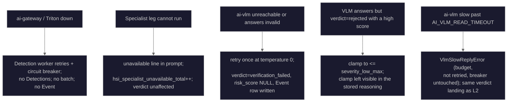

# Fallback Strategies

This document describes what the shipped path does when an AI dependency is missing, degraded, or
down. Each failure has a named landing point, and none of them fabricate a score.

## The Shipped Failure Ladder



Every rung keeps the event. The pipeline never answers an infrastructure failure with a made-up
low score — a run of `verdict='verification_failed'` rows with NULL `risk_score` is the signature
that the VLM is unreachable or blind, not that the camera saw nothing.

## VLM Client Fallback

`VlmClient.assess()` classifies every failure it can hit as a distinct exception, because the
retry calculus differs (`backend/services/vlm_client.py:171-232`):

| Class                     | Meaning                                                       | §6 retry?                    |
| ------------------------- | ------------------------------------------------------------- | ---------------------------- |
| `VlmTransportError`       | connection refused, ConnectTimeout, HTTP 5xx                  | once, temp 0                 |
| `VlmSchemaError`          | reply arrives complete but fails schema validation            | once, temp 0                 |
| `VlmTruncatedError`       | model hit its token budget mid-object (subclass of the above) | no — re-ask at same budget   |
| `VlmSlowReplyError`       | read or write outran `AI_VLM_READ_TIMEOUT`                    | no — same bytes, same budget |
| `VlmContextOverflowError` | server refuses the prompt length (HTTP 400)                   | no — same bytes fail         |
| `VlmUnavailableError`     | breaker OPEN, refusing without I/O                            | no                           |
| `VlmImageError`           | the stills could not be encoded                               | no                           |

The two budget rungs (`VlmTruncatedError`, `VlmSlowReplyError`) are the ones a reader is likeliest to
expect a retry on, so note the ruling: both raise on the first attempt rather than fall through to
the §6 re-ask. A truncated object never closes on a second send at the same `max_tokens`, and a
slow reply re-asks the identical question at the identical speed — both burn a second charge against
`ai_vlm_read_timeout` (and used to charge the breaker) to reach the same outcome. The breaker asks
"stop calling this engine?"; a budget that we set answers no. See `VlmSlowReplyError`'s own
docstring and `_note_budget_exhausted` (`backend/services/vlm_client.py:1093-1113`).

The breaker is named `ai-vlm` with `failure_threshold=5, recovery_timeout=60.0`
(`backend/services/vlm_client.py:93,318`). When it opens, subsequent calls refuse without I/O
rather than piling onto the same dead endpoint.

### Prompt Fitting

A batch that overflows the served slot is a designed-for case, not an error.
`_fitted_prompt()` drops the weakest detection rows until the prompt fits the slot the request will
actually land in and records that it did (`backend/services/vlm_client.py:938`). The slot budget is
`VLM_CTX_SIZE // VLM_PARALLEL` (`config.py vlm_context_window`), shipped 32768 / 2 = 16384 tokens.
Each still is capped at `LLAMA_ARG_IMAGE_MAX_TOKENS=1280` (`docker-compose.prod.yml:212`) so
uncapped image vision tokens cannot push a fitted batch over.

## Verdict Invariants

Even on a well-formed verdict, `apply_verdict_invariants()`
(`backend/services/vlm_analyzer.py:255`) enforces one last contract before anything is written:

- `verdict=None` (the ladder bottomed out) → `verdict='verification_failed'`, `risk_score` NULL,
  `risk_level` NULL, honest summary text, **the event row is still written** so the UI shows "needs
  review".
- `verdict='rejected'` with a score above `severity_low_max` → clamp to `severity_low_max` and
  leave the clamp visible in the stored reasoning ("log the clamp", spec §6).
- Any other score → `risk_level` re-derived from the current `SeverityService`, not the model's
  own label.

## Specialist Leg Degradation

Each leg has one failure funnel, `_unavailable_line()`
(`backend/services/vlm_specialists.py:93`). Reasons are bounded codes: `weights_absent`,
`package_absent`, `inference_failed`, `gallery_unreadable`, `space_mismatch`, `stage_error`,
`leg_failed`, `not_included`. Every leg is on the fail-soft side of a belt-and-braces contract:

- The face and re-ID legs read the model manager's resident handles. Absent is legal
  (`osnet_loader.get_reid_handle():182`, `face_recognizer_loader.get_face_leg_handles():466`);
  residency ships off (`.env.example:231`).
- The plate leg loads on demand and catches its own loader errors
  (`backend/services/fast_alpr_loader.py:66`, `backend/services/vlm_specialists.py:588`).
- Even a stage bug lands as all-unavailable texts on the same keys
  (`backend/services/vlm_specialists.py:936`) and the analyzer's own belt catch
  (`backend/services/vlm_analyzer.py:518`) means the batch proceeds.

Owner doctrine (F11 ruling 3): `not_identifiable` stays distinct from `unknown`. A degraded leg
never masquerades as an empty scene.

## Detector Client

The detection path is the one place a hard failure is allowed to stop the pipeline — no
Detections means no batch, which means no Event.

- Circuit breaker `detector_yolo26` (`backend/services/detector_client.py:336`): `failure_threshold=5,
recovery_timeout=60.0, half_open_max_calls=3, success_threshold=2, excluded_exceptions=(ValueError,)`
  so HTTP 4xx never trips the breaker.
- Retry: `DETECTOR_MAX_RETRIES=3` (`backend/core/config.py:1201`) with 2^attempt backoff capped at
  30 s.
- Timeout: connect 10 s (`config.py ai_connect_timeout`), read
  `YOLO26_READ_TIMEOUT` default 30 s (`backend/core/config.py:1105`), and the client adds an
  explicit `read_timeout + connect_timeout` ceiling around the whole attempt
  (`backend/services/detector_client.py:637`).
- In-flight concurrency: `ai_max_concurrent_inferences`, default 4 (20 on free-threaded Python)
  (`backend/core/config.py:1411`).

## Degradation Manager

`DegradationManager` (`backend/services/degradation_manager.py:350`) is the module that lets
non-critical work keep landing while an AI dependency is unhealthy. It runs a background health
loop, tracks per-service `ServiceHealth` (including the alertable `set_ai_service_degraded`
gauge), and offers a `FallbackQueue` — memory-capped with an on-disk overflow — where a
`queue_job_for_later` call parks the work until the service recovers
(`degradation_manager.py:610,730,786`).

`VlmClient` is the shipped consumer on the AI side: when the §6 ladder marks the serve unhealthy,
`_push_unhealthy()` calls `get_degradation_manager().update_service_health(...)` and
`set_ai_service_degraded("ai-vlm", True)` (`backend/services/vlm_client.py:1115-1125`).

## Degradation Status API

The operator's view is `GET /api/system/ai-services/health`
(`backend/api/schemas/ai_services_health.py`). Its `services` block reports
`yolo26` and `ai-vlm` — the two shipped services — with `status`, `circuit_state`,
`last_health_check`, `error_rate_1h`, `latency_p99_ms`, `url`, and `error`, plus queue depths
for `detection_queue` and `analysis_queue`. `ai_fallback.AIService` is `{yolo26}` only
(`backend/services/ai_fallback.py:57`); ai-vlm appears via the endpoint's own service map, not that
enum.

## Diagnosing Degradation

The order that answers the question:

```bash
# 1. Is ai-vlm up?
curl -s http://127.0.0.1:8098/health

# 2. Is it MULTIMODAL? health alone passes on a projector-less server —
#    ai/vlm/Dockerfile:144 builds --mmproj conditionally, so both this
#    healthcheck and compose's own pass blind.
podman exec ai-vlm sh -c 'echo "MODEL_PATH=$MODEL_PATH"; echo "MMPROJ_PATH=$MMPROJ_PATH"'
podman logs ai-vlm 2>&1 | grep -i mmproj

# 3. Is anything landing?
#    SELECT verdict, count(*), max(created_at) FROM events e
#      JOIN event_verifications ev ON ev.event_id = e.id
#      GROUP BY verdict ORDER BY max(created_at) DESC;

# 4. Have the face / re-ID legs ever run?
curl -s http://127.0.0.1:8000/metrics | grep hsi_specialist_unavailable_total
```

A stalled pipeline and a healthy one look identical in the `alerts` table — no event auto-creates an
Alert (`docs/architecture/ai-pipeline-current-state.md` §2.4). Diagnose from `events`, not `alerts`.

## Recovery

- **Breaker recovery**: OPEN → HALF_OPEN after `recovery_timeout`; HALF_OPEN → CLOSED after
  `success_threshold` successes; any HALF_OPEN failure returns to OPEN.
- **Residency fix**: on a host with >= 24 GB, `BACKEND_MODEL_PRELOAD=true` puts the face and re-ID
  handles in place at boot (`setup.py:461-464` sets it from detected VRAM). The shipped default is
  pinned by a gate (`backend/tests/unit/core/test_ai_vlm_compose_service.py:402-409`), so changing
  the _default_ is a gate edit — set the value in the host `.env` instead.
- **VLM weights**: place the GGUF + mmproj pair under `${AI_MODELS_PATH}/vlm` matching
  `VLM_MODEL_PATH` + `VLM_MMPROJ_PATH` and restart `ai-vlm` with
  `up -d ai-vlm` — no flag, it is in the default compose set
  (`docker-compose.prod.yml:141`).
