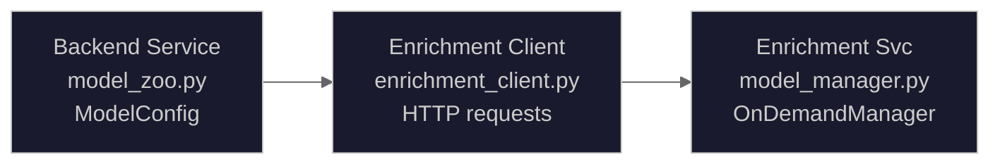
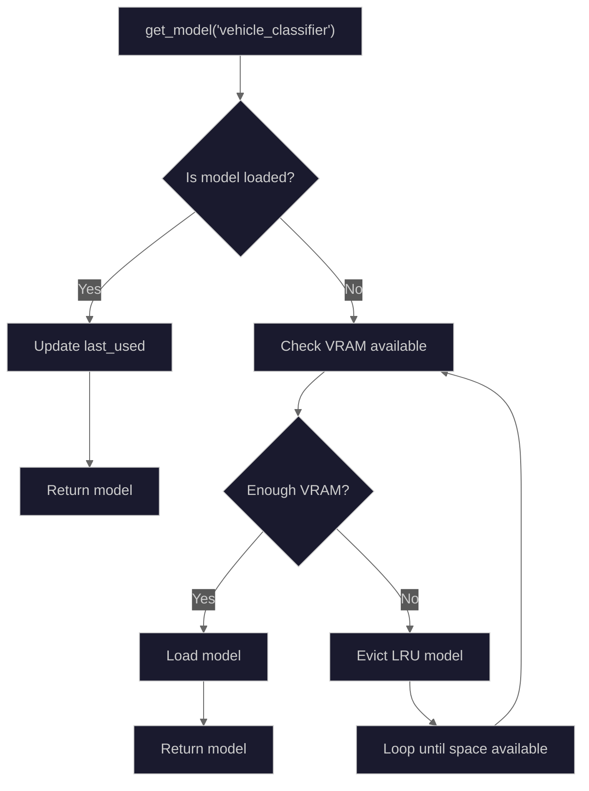

# Model Zoo

The Model Zoo provides on-demand loading of AI models for detection enrichment. It manages VRAM efficiently through LRU eviction and reference counting.

## Source Files

- **Backend Registry**: `backend/services/model_zoo.py`
- **Enrichment Manager**: `ai/enrichment/model_manager.py`
- **Enrichment Registry**: `ai/enrichment/model_registry.py`

## Architecture Overview

The system has two model management layers:

1. **Backend Model Zoo** (`model_zoo.py`): Defines available models and their configurations for the backend service
2. **Enrichment Model Manager** (`model_manager.py`): Manages actual model loading/unloading in the enrichment container



## Backend Model Registry

The backend maintains a registry of available models in `MODEL_ZOO`:

```python
# From backend/services/model_zoo.py

@dataclass(slots=True)
class ModelConfig:
    """Configuration for a Model Zoo model."""
    name: str           # Unique identifier (e.g., "yolo11-license-plate")
    path: str           # HuggingFace repo path or local file path
    category: str       # Model category ("detection", "recognition", "ocr")
    vram_mb: int        # Estimated VRAM usage in megabytes
    load_fn: Callable   # Async callable that loads the model
    enabled: bool       # Whether the model is enabled for use
    available: bool     # Set to True after successful initial load
```

### Available Models (Backend)

| Model                            | Category       | VRAM (MB) | Purpose                      |
| -------------------------------- | -------------- | --------- | ---------------------------- |
| `yolo11-license-plate`           | detection      | 300       | License plate detection      |
| `yolo11-face`                    | detection      | 200       | Face detection               |
| `paddleocr`                      | ocr            | 100       | OCR text extraction          |
| `clip-vit-l`                     | embedding      | 800       | Re-identification embeddings |
| `yolo-world-s`                   | detection      | 1500      | Open-vocabulary detection    |
| `vitpose-small`                  | pose           | 1500      | Human pose keypoints         |
| `depth-anything-v2-small`        | depth          | 150       | Depth estimation             |
| `violence-detection`             | classification | 500       | Violence detection           |
| `weather-classification`         | classification | 200       | Weather conditions           |
| `segformer-b2-clothes`           | segmentation   | 1500      | Clothing segmentation        |
| `xclip-base`                     | action         | 2000      | Temporal action recognition  |
| `fashion-clip`                   | classification | 500       | Clothing classification      |
| `brisque-quality`                | quality        | 0         | Image quality (CPU-based)    |
| `vehicle-segment-classification` | classification | 1500      | Vehicle type                 |
| `vehicle-damage-detection`       | detection      | 2000      | Vehicle damage segmentation  |
| `pet-classifier`                 | classification | 200       | Cat/dog classification       |
| `osnet-x0-25`                    | embedding      | 100       | Person re-identification     |
| `threat-detection-yolov8n`       | detection      | 300       | Weapon detection             |
| `vit-age-classifier`             | classification | 200       | Age estimation               |
| `vit-gender-classifier`          | classification | 200       | Gender classification        |
| `yolov8n-pose`                   | pose           | 200       | Alternative pose model       |

## Enrichment Model Manager

The enrichment service uses `OnDemandModelManager` for VRAM-efficient model loading:

```python
# From ai/enrichment/model_manager.py

class OnDemandModelManager:
    """Manages on-demand model loading with VRAM budget constraints."""

    def __init__(self, vram_budget_gb: float = 6.8) -> None:
        self.vram_budget: float = vram_budget_gb * 1024  # Convert to MB
        self.loaded_models: OrderedDict[str, ModelInfo] = OrderedDict()
        self.model_registry: dict[str, ModelConfig] = {}
        self._lock = asyncio.Lock()
```

### VRAM Budget Management

The enrichment service has a configurable VRAM budget (default: 6.8GB):

```python
# Budget allocation within enrichment container
Total Budget: 6,800 MB

# Models load on-demand, evicted when budget exceeded
# Never concurrent loading - sequential to prevent OOM
```

### Model Priority Levels

Models have priority levels that affect eviction order:

```python
class ModelPriority(IntEnum):
    """Priority levels for model loading decisions.

    Lower values = higher priority = evicted last.
    """
    CRITICAL = 0  # Threat detection - never evict if possible
    HIGH = 1      # Pose, demographics, clothing
    MEDIUM = 2    # Vehicle, pet, re-ID
    LOW = 3       # Depth, action recognition
```

### Model Lifecycle State Machine


_State machine diagram showing model lifecycle transitions: unloaded, loading, loaded, and eviction states with VRAM budget constraints._

### LRU Eviction Algorithm

When VRAM is constrained, models are evicted in order of:

1. **Priority** (higher number = evicted first): LOW before CRITICAL
2. **Last used time** (older = evicted first)

```python
async def _evict_lru_model(self) -> bool:
    """Evict the least recently used model, respecting priority."""
    # Sort candidates: higher priority number first, then older first
    candidates = sorted(
        self.loaded_models.items(),
        key=lambda x: (-x[1].priority, x[1].last_used),
    )

    # Evict first candidate (highest priority number, oldest)
    name, info = candidates[0]
    await self._unload_model_internal(name)
    return True
```

## Model Loading Flow



## Reference Counting

The `ModelManager` supports nested loads with reference counting:

```python
async with manager.load("yolo11-face") as face_model:
    # Increment reference count
    # Load if not already loaded

    async with manager.load("yolo11-face") as same_model:
        # Same model, increment reference count only
        pass
    # Decrement reference count (still > 0)

# Decrement reference count (now 0)
# Model unloaded, CUDA cache cleared
```

## CUDA Cache Management

After unloading models, CUDA cache is explicitly cleared:

```python
async def _unload_model_internal(self, model_name: str) -> None:
    """Internal method to unload a model."""
    info = self.loaded_models.pop(model_name)
    config = self.model_registry[model_name]

    # Run unloader in thread pool
    await loop.run_in_executor(None, config.unloader_fn, info.model)

    # Clear CUDA cache to actually free VRAM
    if torch.cuda.is_available():
        torch.cuda.empty_cache()
```

## Prometheus Metrics

The model manager exports metrics for monitoring:

```python
# VRAM usage gauges
enrichment_vram_usage_bytes        # Current VRAM usage
enrichment_vram_budget_bytes       # Configured budget
enrichment_vram_utilization_percent # Usage percentage

# Model count gauge
enrichment_models_loaded           # Number of loaded models

# Model eviction counter
enrichment_model_evictions_total{model_name, priority}

# Model load time histogram
enrichment_model_load_time_seconds{model_name}
# Buckets: [0.1, 0.25, 0.5, 1.0, 2.5, 5.0, 10.0, 30.0, 60.0]
```

## Status Reporting

Get current manager status for health checks:

```python
status = manager.get_status()
# Returns:
{
    "vram_budget_mb": 6963.2,
    "vram_used_mb": 2100,
    "vram_available_mb": 4863.2,
    "vram_utilization_percent": 30.2,
    "loaded_models": [
        {
            "name": "vehicle_classifier",
            "vram_mb": 1500,
            "priority": "MEDIUM",
            "last_used": "2024-01-15T10:30:00Z"
        }
    ],
    "registered_models": [...],
    "pending_loads": []
}
```

## Idle Model Cleanup

Periodic cleanup of unused models:

```python
# Unload models idle for > 5 minutes
unloaded = await manager.cleanup_idle_models(idle_seconds=300.0)
# Returns list of model names that were unloaded
```

## Thread Safety

All operations are protected by an asyncio lock:

```python
async with self._lock:
    # Check if loaded
    # Ensure VRAM available
    # Load model
    # Return model
```

This ensures safe concurrent access from multiple request handlers.
