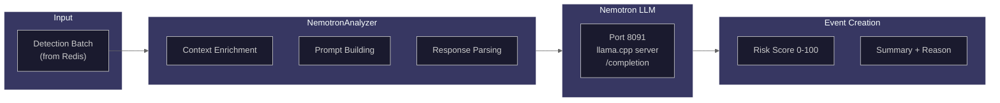

# Nemotron Analyzer

The `NemotronAnalyzer` service uses the Nemotron 70B LLM (via llama.cpp server) to analyze detection batches and generate risk assessments with natural language reasoning.

## Source Files

- **Main Analyzer**: `backend/services/nemotron_analyzer.py`
- **Prompt Templates**: `backend/services/prompts.py`

## Architecture Overview



## Class Definition

```python
class NemotronAnalyzer:
    """Analyzes detection batches using Nemotron LLM for risk assessment.

    Features:
        - Retry logic with exponential backoff for transient failures
        - Configurable timeouts and retry attempts via settings
        - Context enrichment with zone, baseline, and cross-camera data
        - Enrichment pipeline for license plates, faces, and OCR
        - A/B testing support for prompt experimentation
    """
```

## Configuration

| Setting                      | Default                   | Description                    |
| ---------------------------- | ------------------------- | ------------------------------ |
| `NEMOTRON_URL`               | `http://ai-nemotron:8091` | LLM service URL                |
| `NEMOTRON_API_KEY`           | None                      | Optional API key               |
| `NEMOTRON_MAX_RETRIES`       | 3                         | Maximum retry attempts         |
| `AI_CONNECT_TIMEOUT`         | 10.0s                     | Connection timeout             |
| `NEMOTRON_READ_TIMEOUT`      | 120.0s                    | Read timeout for LLM inference |
| `NEMOTRON_MAX_OUTPUT_TOKENS` | 512                       | Maximum output tokens          |

## Analysis Flow

```
1. analyze_batch(batch_id, camera_id, detection_ids)
   |
   +-- Idempotency check (NEM-1725)
   |
2. SESSION 1 (READ): Fetch data
   |
   +-- Load camera details
   +-- Fetch detections
   +-- Enrich context (zones, baselines, cross-camera)
   +-- Query scene changes for camera health
   +-- Fetch auto-tuning context
   +-- Extract detection data for enrichment
   |
3. EXTERNAL CALLS (NO SESSION):
   |
   +-- Run enrichment pipeline (license plates, faces, OCR)
   +-- Household matching (reduce risk for known members)
   +-- Call LLM for risk analysis
   |
4. SESSION 2 (WRITE): Persist results
   |
   +-- Create Event record
   +-- Link detections via junction table
   +-- Store enrichment data on detections
   +-- Set idempotency key
   +-- Create audit record
```

## Prompt Building

### System Prompt

The LLM receives a calibrated system prompt emphasizing that most detections are NOT threats:

```
CRITICAL PRINCIPLE: Most detections are NOT threats. Residents, family members,
delivery workers, and pets represent normal household activity. Your job is to
identify genuine anomalies, not flag everyday life.

CALIBRATION: In a typical day, expect:
- 80% of events to be LOW risk (0-29): Normal activity
- 15% to be MEDIUM risk (30-59): Worth noting but not alarming
- 4% to be HIGH risk (60-84): Genuinely suspicious, warrants review
- 1% to be CRITICAL (85-100): Immediate threats only
```

### Scoring Reference

```
| Scenario | Score | Reasoning |
|----------|-------|-----------|
| Resident arriving home | 5-15 | Expected activity |
| Delivery driver at door | 15-25 | Normal service visit |
| Unknown person on sidewalk | 20-35 | Public area, passive |
| Unknown person lingering | 45-60 | Warrants attention |
| Person testing door handles | 70-85 | Clear suspicious intent |
| Active break-in or violence | 85-100 | Immediate threat |
```

### Prompt Templates

Multiple prompt templates support different enrichment levels:

| Template                                  | Use Case                      |
| ----------------------------------------- | ----------------------------- |
| `RISK_ANALYSIS_PROMPT`                    | Basic detection-only analysis |
| `ENRICHED_RISK_ANALYSIS_PROMPT`           | With zone/baseline context    |
| `FULL_ENRICHED_RISK_ANALYSIS_PROMPT`      | With enrichment pipeline data |
| `MODEL_ZOO_ENHANCED_RISK_ANALYSIS_PROMPT` | With all model zoo enrichment |
| `VISION_ENHANCED_RISK_ANALYSIS_PROMPT`    | With Florence-2 captions      |

### Context Sections

The prompt includes multiple context sections:

```python
# Zone context
{zone_context}  # "Detection in zone 'Front Porch' (entry zone)"

# Baseline deviation
{baseline_context}  # "Activity is 3.2x above baseline for this hour"

# Cross-camera activity
{cross_camera_context}  # "Same person seen at Back Door 2 minutes ago"

# Camera health alerts
{camera_health_context}  # "WARNING: Camera tamper detected 5 minutes ago"

# Household matching
{household_context}  # "KNOWN: Matches household member 'John' (confidence: 92%)"

# Enrichment data
{enrichment_context}  # Pose, clothing, vehicle type, license plate, etc.
```

## Response Parsing

The LLM outputs JSON with optional `<think>` reasoning blocks:

```python
def _parse_llm_response(self, text: str) -> dict[str, Any]:
    """Parse JSON response from LLM completion.

    Handles Nemotron output which includes <think>...</think> reasoning
    blocks before the actual JSON response.
    """
    # Strip <think>...</think> blocks
    cleaned_text = _THINK_PATTERN.sub("", text).strip()

    # Handle incomplete think blocks
    if "<think>" in cleaned_text:
        # Find content after the last </think>
        ...

    # Extract JSON object
    matches = _JSON_PATTERN.findall(cleaned_text)
```

### Expected Response Format

```json
{
  "risk_score": 25,
  "risk_level": "low",
  "summary": "Delivery driver detected at front door during business hours",
  "reasoning": "Amazon delivery uniform visible, package in hand, brief visit typical of deliveries"
}
```

### Risk Score Validation

```python
def _validate_risk_data(self, risk_data: dict[str, Any]) -> dict[str, Any]:
    """Validate and normalize risk data."""
    # Clamp risk_score to 0-100
    risk_score = risk_data.get("risk_score", 50)
    risk_score = max(0, min(100, int(risk_score)))

    # Determine risk_level from score if not provided
    if "risk_level" not in risk_data:
        if risk_score < 30:
            risk_level = "low"
        elif risk_score < 60:
            risk_level = "medium"
        elif risk_score < 85:
            risk_level = "high"
        else:
            risk_level = "critical"
```

## Risk Scoring Guidelines

| Risk Level | Score Range | Description                |
| ---------- | ----------- | -------------------------- |
| Low        | 0-29        | Normal household activity  |
| Medium     | 30-59       | Worth noting, not alarming |
| High       | 60-84       | Genuinely suspicious       |
| Critical   | 85-100      | Immediate threat           |

### Factors That Lower Risk

- Known household member match
- Recognized vehicle (registered plate)
- Delivery uniform detected
- Expected schedule match
- Pet classification (household animal)
- Normal activity zone

### Factors That Raise Risk

- Unknown person at sensitive location
- Suspicious pose (crouching, hiding)
- Weapon detected
- Unusual time of day
- Tampering detected
- Violence indicators
- Extended loitering

## A/B Testing Support

The analyzer supports prompt A/B testing and experimentation:

```python
def set_ab_test_config(self, config: ABTestConfig) -> None:
    """Configure A/B testing for prompt versions."""
    self._ab_config = config
    self._ab_tester = PromptABTester(config)

async def get_prompt_version(self) -> tuple[int, bool]:
    """Get the prompt version to use for this request."""
    if self._ab_tester is not None:
        return self._ab_tester.select_prompt_version()
    return (1, False)  # Default version
```

### Shadow Mode

Run both V1 and V2 prompts but return V1 results:

```python
async def run_shadow_analysis(self, camera_id: str, context: str) -> dict:
    """Run both prompts, return V1, log V2 for comparison."""
    v1_result = await self._call_llm_with_version(context, "v1_original")
    v2_result = await self._call_llm_with_version(context, "v2_calibrated")

    # Log comparison for analysis
    await self._log_shadow_result(camera_id, v1_result, v2_result)

    return {"primary_result": v1_result, "shadow_result": v2_result}
```

## Idempotency Handling

Prevent duplicate Events on retry:

```python
async def _check_idempotency(self, batch_id: str) -> int | None:
    """Check if Event already exists for this batch."""
    key = f"batch_event:{batch_id}"
    event_id = await self._redis.get(key)
    return int(event_id) if event_id else None

async def _set_idempotency(self, batch_id: str, event_id: int) -> None:
    """Store idempotency key after Event creation."""
    key = f"batch_event:{batch_id}"
    await self._redis.set(key, str(event_id), expire=3600)  # 1 hour TTL
```

## Cold Start and Warmup

```python
async def warmup(self) -> bool:
    """Perform model warmup by running a test inference."""
    was_cold = self.is_cold()
    self._is_warming = True

    result = await self.model_readiness_probe()  # Simple prompt

    if result:
        self._track_inference()
        if was_cold:
            record_model_cold_start("nemotron")
        set_model_warmth_state("nemotron", "warm")
        return True

    return False

async def model_readiness_probe(self) -> bool:
    """Send test prompt to verify model is loaded."""
    response = await client.post(
        f"{self._llm_url}/v1/completions",
        json={
            "prompt": self._warmup_prompt,
            "max_tokens": 50,
            "temperature": 0.1,
        },
    )
    return response.status_code == 200
```

## Metrics

```python
# LLM metrics
observe_ai_request_duration("nemotron", llm_duration_seconds)
record_nemotron_tokens(token_count)  # If available in response

# Risk metrics
observe_risk_score(event.risk_score)
record_event_by_camera(camera_id)
record_event_by_risk_level(event.risk_level)
record_event_created()

# Prompt metrics
record_prompt_template_used(template_name)
record_prompt_latency(f"v{prompt_version}", latency_seconds)

# Pipeline errors
record_pipeline_error("nemotron_analysis_error")
```

## Error Handling and Fallback

When LLM analysis fails:

```python
except Exception as e:
    # Create fallback risk data
    risk_data = {
        "risk_score": 50,
        "risk_level": "medium",
        "summary": "Analysis unavailable - LLM service error",
        "reasoning": "Failed to analyze detections due to service error",
    }
```

## Usage Example

```python
from backend.services.nemotron_analyzer import NemotronAnalyzer
from backend.core.redis import RedisClient

# Initialize analyzer
redis_client = RedisClient()
analyzer = NemotronAnalyzer(
    redis_client=redis_client,
    use_enriched_context=True,
    use_enrichment_pipeline=True,
)

# Perform warmup on startup
await analyzer.warmup()

# Analyze a batch
event = await analyzer.analyze_batch(
    batch_id="batch_abc123",
    camera_id="camera1",
    detection_ids=[1, 2, 3, 4, 5],
)

print(f"Risk Score: {event.risk_score}")
print(f"Summary: {event.summary}")
print(f"Reasoning: {event.reasoning}")
```
