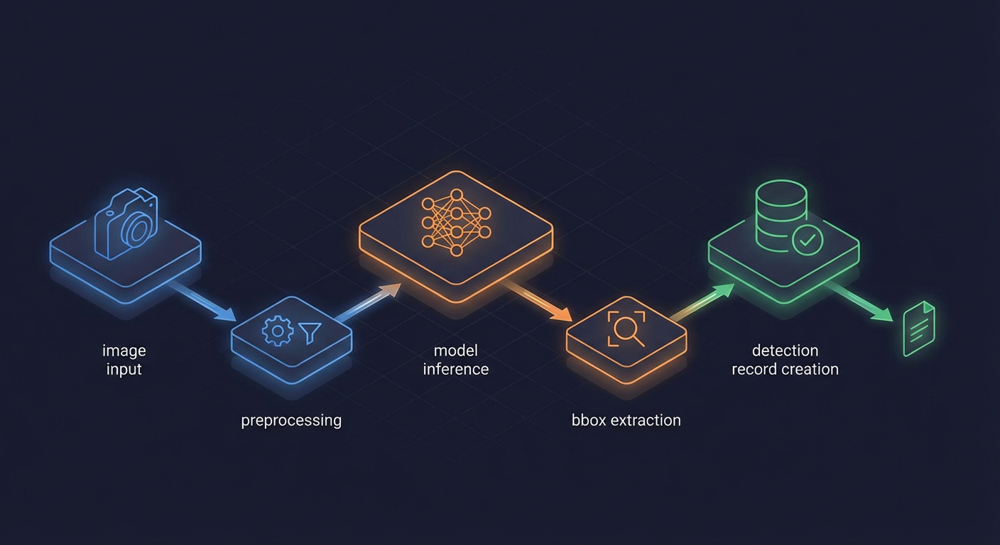
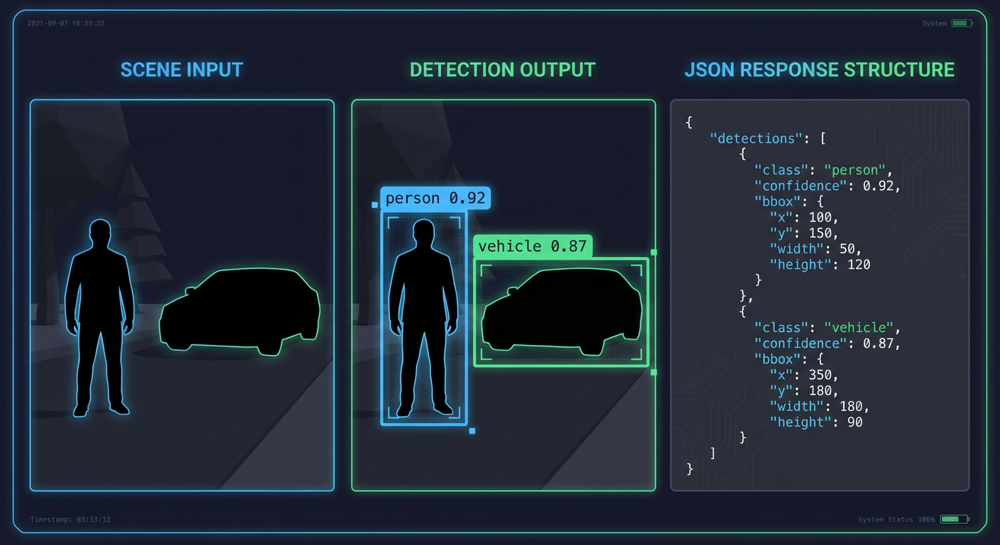

# RT-DETRv2 Detector Client


The `DetectorClient` provides HTTP communication with the RT-DETRv2 object detection service. It handles image preprocessing, request/response flow, retry logic, and circuit breaker integration.

## Source File

`backend/services/detector_client.py`

## Architecture Overview

```
+----------------+     +------------------+     +----------------+
| Image File     |     | DetectorClient   |     | RT-DETRv2 Svc  |
| (FTP upload)   |---->| Preprocessing    |---->| Port 8090      |
|                |     | Retry Logic      |     | /detect        |
|                |     | Circuit Breaker  |     | /health        |
+----------------+     +------------------+     +----------------+
```

## Class Definition

```python
class DetectorClient:
    """Client for interacting with RT-DETRv2 object detection service.

    Features:
        - Retry logic with exponential backoff for transient failures
        - Configurable timeouts and retry attempts via settings
        - API key authentication via X-API-Key header when configured
        - Concurrency limiting via semaphore to prevent GPU overload
        - Parallel preprocessing with ThreadPoolExecutor
    """
```

## Configuration

| Setting                          | Default                 | Description                         |
| -------------------------------- | ----------------------- | ----------------------------------- |
| `RTDETR_URL`                     | `http://ai-rtdetr:8090` | Detector service URL                |
| `RTDETR_API_KEY`                 | None                    | Optional API key for authentication |
| `DETECTION_CONFIDENCE_THRESHOLD` | 0.5                     | Minimum confidence for detections   |
| `DETECTOR_MAX_RETRIES`           | 3                       | Maximum retry attempts              |
| `AI_CONNECT_TIMEOUT`             | 10.0s                   | Connection timeout                  |
| `RTDETR_READ_TIMEOUT`            | 60.0s                   | Read timeout for inference          |

## Detection Flow



```
1. validate_image_for_detection()
   |
   +-- Check file size >= 10KB (catches truncated uploads)
   +-- PIL load() to verify image integrity
   |
2. detect_objects()
   |
   +-- Read image bytes asynchronously
   +-- Buffer frame for X-CLIP (if frame_buffer configured)
   |
3. _send_detection_request()
   |
   +-- Acquire inference semaphore
   +-- Check circuit breaker state
   +-- POST to /detect with multipart/form-data
   +-- Parse JSON response
   +-- Release semaphore
   |
4. Process detections
   |
   +-- Filter by confidence threshold
   +-- Create Detection model instances
   +-- Store in database
   +-- Update camera last_seen_at
   +-- Update baseline statistics
```

## Image Validation

Images are validated before detection to catch corrupt/truncated uploads:

```python
MIN_DETECTION_IMAGE_SIZE = 10 * 1024  # 10KB

def _validate_image_for_detection(self, image_path: str, camera_id: str) -> bool:
    """Validate image file is suitable for detection."""
    # Check file size - very small images are likely truncated
    file_size = image_file.stat().st_size
    if file_size < MIN_DETECTION_IMAGE_SIZE:
        return False

    # Try to load the image to catch truncation/corruption
    with Image.open(image_path) as img:
        img.load()  # Forces full decompression

    return True
```

## Request/Response Flow



### Request Format

```python
files = {"file": (image_name, image_data, "image/jpeg")}
response = await self._http_client.post(
    f"{self._detector_url}/detect",
    files=files,
    headers=self._get_auth_headers(),  # Includes X-API-Key if configured
)
```

### Response Format

```json
{
  "detections": [
    {
      "class": "person",
      "confidence": 0.95,
      "bbox": {
        "x": 100,
        "y": 200,
        "width": 150,
        "height": 300
      }
    }
  ],
  "inference_time_ms": 45.2
}
```

### Bounding Box Handling

The client handles both dict and array bbox formats:

```python
# Dict format: {"x", "y", "width", "height"}
if isinstance(bbox, dict):
    bbox_x = int(bbox["x"])
    bbox_y = int(bbox["y"])
    bbox_width = int(bbox["width"])
    bbox_height = int(bbox["height"])

# Array format: [x, y, width, height]
elif isinstance(bbox, list | tuple) and len(bbox) == 4:
    bbox_x, bbox_y, bbox_width, bbox_height = bbox[:4]
```

## Retry Logic

Exponential backoff for transient failures:

```python
async def _send_detection_request(self, ...) -> dict[str, Any]:
    """Send detection request with retry logic and concurrency limiting."""
    for attempt in range(self._max_retries):
        try:
            async with semaphore:
                async with asyncio.timeout(explicit_timeout):
                    response = await self._http_client.post(...)
                    return response.json()

        except httpx.ConnectError as e:
            # Retry with exponential backoff
            delay = min(2**attempt, 30)  # Cap at 30 seconds
            await asyncio.sleep(delay)

        except httpx.TimeoutException as e:
            # Retry with exponential backoff
            delay = min(2**attempt, 30)
            await asyncio.sleep(delay)

        except httpx.HTTPStatusError as e:
            if e.response.status_code >= 500:
                # Server error - retry
                delay = min(2**attempt, 30)
                await asyncio.sleep(delay)
            else:
                # Client error (4xx) - don't retry
                raise ValueError(f"Detector client error {e.response.status_code}")

    raise DetectorUnavailableError("Detection failed after retries")
```

### Retryable Errors

| Error Type         | Retried | Reason                      |
| ------------------ | ------- | --------------------------- |
| `ConnectError`     | Yes     | Network connectivity issues |
| `TimeoutException` | Yes     | Request/response timeouts   |
| HTTP 5xx           | Yes     | Server-side errors          |
| HTTP 4xx           | No      | Client errors (bad request) |
| `JSONDecodeError`  | Yes     | Malformed response          |

## Circuit Breaker Integration

The client integrates with the circuit breaker pattern:

```python
self._circuit_breaker = CircuitBreaker(
    name="rtdetr",
    config=CircuitBreakerConfig(
        failure_threshold=5,      # Open after 5 consecutive failures
        recovery_timeout=60.0,    # Wait 60 seconds before half-open
        half_open_max_calls=3,    # Allow 3 test calls in half-open
        success_threshold=2,      # Close after 2 successes
        excluded_exceptions=(ValueError,),  # HTTP 4xx don't trip circuit
    ),
)

# Usage
result = await self._circuit_breaker.call(
    self._send_detection_request,
    image_data=image_data,
    image_name=image_file.name,
    camera_id=camera_id,
    image_path=image_path,
)
```

## Concurrency Control

Two levels of concurrency control:

### 1. Class-Level Semaphore

```python
# Limits concurrent requests to prevent GPU overload
_request_semaphore: asyncio.Semaphore | None = None
_semaphore_limit: int = 0

@classmethod
def _get_semaphore(cls) -> asyncio.Semaphore:
    """Get or create shared semaphore for concurrency limiting."""
    settings = get_settings()
    limit = settings.ai_max_concurrent_inferences
    # Default: 4 for standard Python, 20 for free-threaded
```

### 2. Shared Inference Semaphore

```python
# From backend/services/inference_semaphore.py
# Shared across all AI clients (DetectorClient, NemotronAnalyzer, etc.)
inference_semaphore = get_inference_semaphore()
async with inference_semaphore:
    result = await self._circuit_breaker.call(...)
```

## Free-Threading Support

The client adapts to Python's threading capabilities:

```python
def _is_free_threaded() -> bool:
    """Check if running free-threaded Python (GIL disabled)."""
    if hasattr(sys, "_is_gil_enabled"):
        return not sys._is_gil_enabled()
    return False

def _get_default_inference_limit() -> int:
    """Get default inference limit based on Python capabilities."""
    if _is_free_threaded():
        return 20  # Higher limit with true parallelism
    return 4       # Conservative limit with GIL

def _get_preprocess_worker_count() -> int:
    """Get preprocessing workers based on Python capabilities."""
    if _is_free_threaded():
        return 8   # More workers with true parallelism
    return 2       # Fewer workers with GIL
```

## Cold Start and Warmup

Track model warmth state and perform warmup:

```python
async def warmup(self) -> bool:
    """Perform model warmup by running a test inference."""
    if not self._warmup_enabled:
        return True

    was_cold = self.is_cold()
    self._is_warming = True

    result = await self.model_readiness_probe()  # 32x32 black test image

    if result:
        self._track_inference()
        if was_cold:
            record_model_cold_start("rtdetr")
        set_model_warmth_state("rtdetr", "warm")
        return True

    return False
```

## Health Check

```python
async def health_check(self) -> bool:
    """Check if detector service is healthy and reachable."""
    try:
        response = await self._health_http_client.get(
            f"{self._detector_url}/health",
            headers=self._get_auth_headers(),
        )
        response.raise_for_status()
        return True
    except (httpx.ConnectError, httpx.TimeoutException, httpx.HTTPStatusError):
        return False
```

## Metrics

```python
# Detection metrics
record_detection_processed(count=len(detections))
record_detection_by_class(object_class)
observe_detection_confidence(confidence)
record_detection_filtered()  # Low confidence

# Pipeline metrics
observe_ai_request_duration("rtdetr", ai_duration)
record_pipeline_error("rtdetr_connection_error")
record_pipeline_error("rtdetr_timeout")
record_pipeline_error("rtdetr_server_error")
```

## Frame Buffering

When configured with a `FrameBuffer`, frames are stored for X-CLIP temporal action recognition:

```python
def __init__(self, ..., frame_buffer: FrameBuffer | None = None) -> None:
    self._frame_buffer = frame_buffer

# In detect_objects()
if self._frame_buffer is not None:
    frame_timestamp = datetime.now(UTC)
    await self._frame_buffer.add_frame(camera_id, image_data, frame_timestamp)
```

## Error Handling

```python
# Custom exception for detector unavailability
class DetectorUnavailableError(Exception):
    """Raised when detector service is unavailable after retries."""
    def __init__(self, message: str, original_error: Exception | None = None):
        super().__init__(message)
        self.original_error = original_error
```

## Usage Example

```python
from backend.services.detector_client import DetectorClient

# Initialize client
client = DetectorClient(max_retries=3)

# Perform warmup on startup
await client.warmup()

# Detect objects in image
async with get_session() as session:
    detections = await client.detect_objects(
        image_path="/data/images/camera1/2024-01-15_10-30-00.jpg",
        camera_id="camera1",
        session=session,
    )

# Clean up
await client.close()
```
