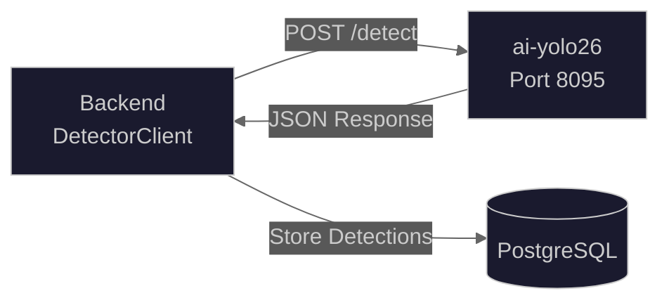
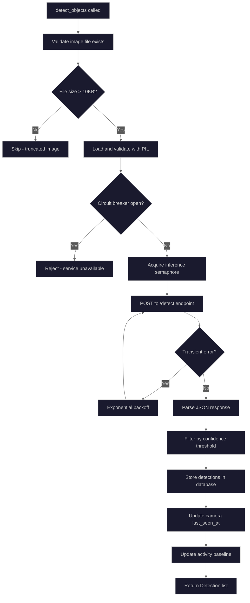

# YOLO26 Client

The YOLO26 client (`backend/services/detector_client.py`) provides the HTTP interface for communicating with the YOLO26 TensorRT object detection server. It handles image submission, response parsing, retry logic, and circuit breaker integration.

## Source Files

- **Client Implementation**: `backend/services/detector_client.py`
- **YOLO26 Server**: `ai/yolo26/` directory
- **Detection Model**: `backend/models/detection.py`

## Architecture Overview



## Configuration

The client is configured via environment variables:

| Variable                         | Default                 | Description                           |
| -------------------------------- | ----------------------- | ------------------------------------- |
| `YOLO26_URL`                     | `http://ai-yolo26:8095` | URL of the YOLO26 detection server    |
| `YOLO26_API_KEY`                 | -                       | Optional API key for authentication   |
| `YOLO26_READ_TIMEOUT`            | `60.0`                  | Request timeout in seconds            |
| `DETECTOR_MAX_RETRIES`           | `3`                     | Maximum retry attempts                |
| `DETECTION_CONFIDENCE_THRESHOLD` | `0.5`                   | Minimum confidence for detections     |
| `AI_MAX_CONCURRENT_INFERENCES`   | `4`                     | Maximum concurrent inference requests |

## API Endpoints

### POST /detect

Primary detection endpoint. Accepts an image and returns detected objects.

**Request:**

```http
POST /detect HTTP/1.1
Content-Type: multipart/form-data

file: <image_bytes>
```

**Response:**

```json
{
  "detections": [
    {
      "class": "person",
      "confidence": 0.95,
      "bbox": {
        "x": 100,
        "y": 150,
        "width": 200,
        "height": 400
      }
    },
    {
      "class": "car",
      "confidence": 0.87,
      "bbox": {
        "x": 300,
        "y": 200,
        "width": 350,
        "height": 250
      }
    }
  ],
  "inference_time_ms": 25.3,
  "image_width": 1920,
  "image_height": 1080
}
```

### POST /segment

Instance segmentation endpoint. Returns both bounding boxes and segmentation masks.

**Response:**

```json
{
  "detections": [
    {
      "class": "person",
      "confidence": 0.95,
      "bbox": {"x": 100, "y": 150, "width": 200, "height": 400},
      "mask_rle": {"counts": [...], "size": [1080, 1920]},
      "mask_polygon": [[x1, y1, x2, y2, ...]]
    }
  ],
  "inference_time_ms": 45.2,
  "image_width": 1920,
  "image_height": 1080
}
```

### GET /health

Health check endpoint for readiness probes.

**Response:**

```json
{
  "status": "healthy",
  "model_loaded": true,
  "gpu_available": true
}
```

## Detection Flow



## Error Handling

### Retry Logic

The client implements exponential backoff for transient failures:

| Error Type         | Retried | Backoff                     |
| ------------------ | ------- | --------------------------- |
| Connection errors  | Yes     | 2^attempt seconds (max 30s) |
| Timeouts           | Yes     | 2^attempt seconds (max 30s) |
| HTTP 5xx errors    | Yes     | 2^attempt seconds (max 30s) |
| HTTP 4xx errors    | No      | Immediate failure           |
| JSON decode errors | Yes     | 2^attempt seconds (max 30s) |

### Circuit Breaker

Prevents retry storms when the detector is unavailable:

- **Failure Threshold**: 5 consecutive failures
- **Recovery Timeout**: 60 seconds
- **Half-Open Max Calls**: 3
- **Success Threshold**: 2 (to close circuit)

```python
# Circuit breaker states
CLOSED   # Normal operation
OPEN     # Service unhealthy, requests rejected
HALF_OPEN # Testing recovery with limited requests
```

## Concurrency Control

### Inference Semaphore

Limits concurrent AI inference operations to prevent GPU overload:

```python
# Shared semaphore limits concurrent requests
async with inference_semaphore:
    result = await self._send_detection_request(...)
```

Default limit: 4 concurrent inferences (20 for free-threaded Python 3.13t+)

### Request Semaphore

Per-client semaphore for additional rate limiting:

```python
# Class-level semaphore
semaphore = self._get_semaphore()
async with semaphore:
    response = await self._http_client.post(...)
```

## Image Validation

Before sending to the detector, images are validated:

1. **File size check**: Minimum 10KB (catches truncated FTP uploads)
2. **PIL validation**: Full decompression to catch corruption
3. **Format conversion**: Ensures JPEG format for transmission

```python
def _validate_image_for_detection(self, image_path: str, camera_id: str) -> bool:
    # Check file size
    if file_size < MIN_DETECTION_IMAGE_SIZE:  # 10KB
        return False

    # Validate with PIL (full decompression)
    with Image.open(image_path) as img:
        img.load()  # Forces decompression

    return True
```

## Cold Start and Warmup

The client tracks model warmth state and supports warmup probes:

```python
# Check if model is cold (not recently used)
if detector_client.is_cold():
    await detector_client.warmup()

# Get warmth state for monitoring
state = detector_client.get_warmth_state()
# Returns: {"state": "warm", "last_inference_seconds_ago": 5.2}
```

### Warmup Behavior

- **Cold Start Threshold**: 300 seconds (configurable)
- **Warmup Image**: 32x32 black JPEG
- **Metrics**: `hsi_model_warmup_duration_seconds{model="yolo26"}`

## Authentication

The client supports API key authentication:

```python
# Headers automatically include API key if configured
headers = self._get_auth_headers()
# Returns: {"X-API-Key": "<api_key>", "X-Correlation-ID": "..."}
```

## Distributed Tracing

W3C Trace Context headers are propagated for distributed tracing:

```python
# Correlation headers included in all requests
headers.update(get_correlation_headers())
# Adds: traceparent, tracestate, X-Correlation-ID
```

### Span Attributes

Traces include AI-specific semantic attributes:

| Attribute                  | Example       |
| -------------------------- | ------------- |
| `ai.model.name`            | `yolo26`      |
| `ai.model.version`         | `yolo26m`     |
| `ai.model.provider`        | `huggingface` |
| `ai.inference.device`      | `cuda:0`      |
| `ai.inference.batch_size`  | `1`           |
| `ai.detection.count`       | `3`           |
| `ai.inference.duration_ms` | `25.3`        |

## Prometheus Metrics

| Metric                                                 | Type      | Description                           |
| ------------------------------------------------------ | --------- | ------------------------------------- |
| `hsi_detection_processed_total`                        | Counter   | Total detections processed            |
| `hsi_detection_filtered_total`                         | Counter   | Detections below confidence threshold |
| `hsi_ai_request_duration_seconds{service="yolo26"}`    | Histogram | Detection request latency             |
| `hsi_circuit_breaker_state{service="detector_yolo26"}` | Gauge     | Circuit breaker state                 |
| `hsi_pipeline_error_total{error_type}`                 | Counter   | Pipeline errors by type               |

## Usage Example

```python
from backend.services.detector_client import DetectorClient

# Initialize client
client = DetectorClient(max_retries=3)

# Perform detection
async with get_db_session() as session:
    detections = await client.detect_objects(
        image_path="/cameras/frontyard/20240115_103000.jpg",
        camera_id="frontyard",
        session=session,
    )

    for detection in detections:
        print(f"{detection.object_type}: {detection.confidence:.0%}")
        print(f"  bbox: ({detection.bbox_x}, {detection.bbox_y}, "
              f"{detection.bbox_width}, {detection.bbox_height})")

# Cleanup
await client.close()
```

## Free-Threading Support

On Python 3.13t+ (free-threaded Python without GIL), the client automatically increases concurrency:

| Setting            | Standard Python | Free-Threaded |
| ------------------ | --------------- | ------------- |
| Inference limit    | 4               | 20            |
| Preprocess workers | 2               | 8             |

```python
# Automatic detection
if sys._is_gil_enabled():  # Python 3.13+
    return 4  # Standard GIL-enabled
else:
    return 20  # Free-threaded, true parallelism
```
