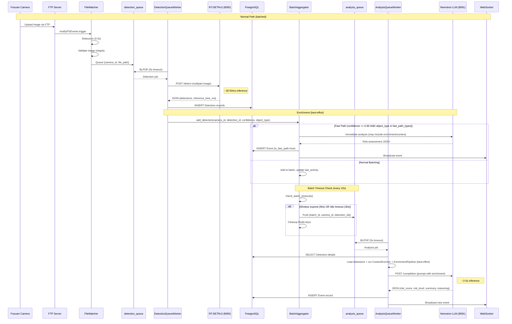
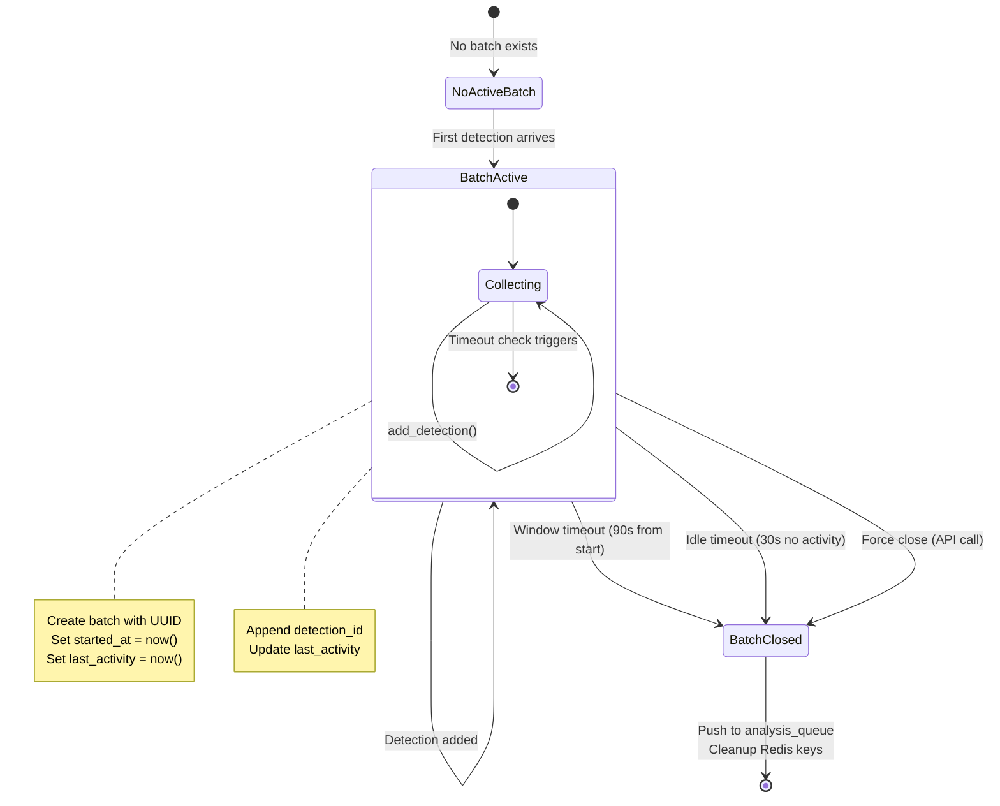
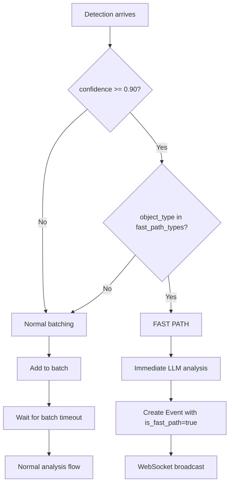
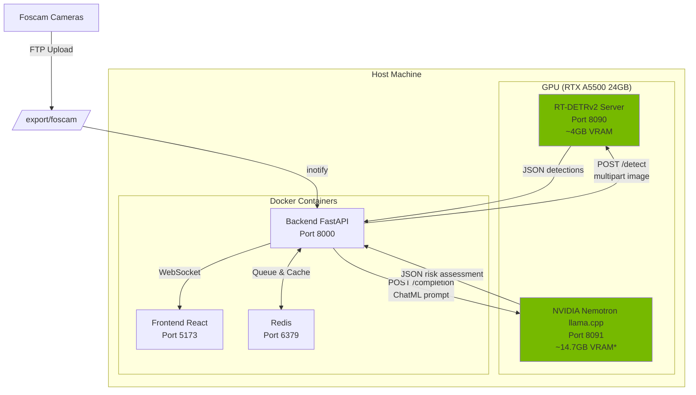

# AI Pipeline Architecture

This document provides comprehensive technical documentation for the AI-powered detection and analysis pipeline in the Home Security Intelligence system. It is intended for maintainers who need to debug, extend, or optimize the AI processing flow.

## Table of Contents

1. [Pipeline Overview](#pipeline-overview)
2. [File Watcher](#file-watcher)
3. [RT-DETRv2 Integration](#rt-detrv2-integration)
4. [Batching Logic](#batching-logic)
5. [Nemotron Analysis](#nemotron-analysis)
6. [Risk Score Calculation](#risk-score-calculation)
7. [Error Handling](#error-handling)
8. [Data Models](#data-models)
9. [Configuration Reference](#configuration-reference)
10. [Image Generation Prompts](#image-generation-prompts)

---

## Pipeline Overview

The AI pipeline transforms raw camera images into risk-scored security events through a multi-stage process. The pipeline is designed for efficiency (batching similar detections) and responsiveness (fast-path for critical detections).

### High-Level Flow


The pipeline processes images through two paths:

- **Normal Path:** Detections are batched over 30-90 second windows before LLM analysis
- **Fast Path:** High-confidence (≥90%) critical detections bypass batching for immediate analysis

### Complete Pipeline Sequence Diagram



### Pipeline Timing Characteristics

| Stage                       | Typical Duration | Notes                                              |
| --------------------------- | ---------------- | -------------------------------------------------- |
| File upload detection       | ~10ms            | Native filesystem notifications (inotify/FSEvents) |
| Debounce delay              | 500ms            | Configurable, prevents duplicate processing        |
| Image validation            | ~5-10ms          | PIL verify()                                       |
| RT-DETRv2 inference         | 30-50ms          | GPU accelerated, RTX A5500                         |
| Database write (detections) | ~5-10ms          | PostgreSQL async                                   |
| Batch aggregation           | ~1ms             | Redis operations                                   |
| **Batch window**            | **30-90s**       | Collects related detections                        |
| Nemotron LLM inference      | 2-5s             | GPU accelerated                                    |
| Event creation + broadcast  | ~10ms            | Database + WebSocket                               |

**Total latency:**

- Fast path (critical detections): ~3-6 seconds
- Normal path: 30-95 seconds (dominated by batch window)

---

## File Watcher

The FileWatcher service monitors camera upload directories for new images and initiates the processing pipeline.

### Source Files

- `/backend/services/file_watcher.py` - Main watcher implementation
- `/backend/services/dedupe.py` - Duplicate file prevention

### How It Works

1. **Filesystem Monitoring**: Uses [watchdog](https://github.com/gorakhargosh/watchdog) library with native OS backends:

   - Linux: inotify (kernel-level notifications)
   - macOS: FSEvents
   - Windows: ReadDirectoryChangesW

2. **Event Handling**: Monitors `on_created` and `on_modified` events for image files (.jpg, .jpeg, .png)

3. **Debounce Logic**: Waits 0.5 seconds after the last modification before processing. This handles:

   - FTP uploads that write in chunks
   - Multiple watchdog events for same file
   - Incomplete file writes

4. **Thread-Safe Async Bridge**: Watchdog runs in a separate thread, so events are scheduled to the asyncio event loop via `asyncio.run_coroutine_threadsafe()`

### Directory Structure

```
/export/foscam/                    # FOSCAM_BASE_PATH
    front_door/                    # Camera ID = "front_door"
        MDAlarm_20251228_120000.jpg
        MDAlarm_20251228_120030.jpg
    backyard/                      # Camera ID = "backyard"
        snap_20251228_120015.jpg
```

### Deduplication

Files are deduplicated using SHA256 content hashes stored in Redis:

```
Redis Key: dedupe:{sha256_hash}
Value: file_path
TTL: 300 seconds (5 minutes, configurable)
```

This prevents duplicate processing from:

- Watchdog create/modify event bursts
- Service restarts during file processing
- FTP upload retries

### Queue Output Format

```json
{
  "camera_id": "front_door",
  "file_path": "/export/foscam/front_door/MDAlarm_20251228_120000.jpg",
  "timestamp": "2025-12-28T12:00:00.500000",
  "file_hash": "a3f9c8b2d1e4..."
}
```

---

## RT-DETRv2 Integration

RT-DETRv2 (Real-Time Detection Transformer v2) performs object detection on camera images, identifying security-relevant objects with bounding boxes and confidence scores.

### Source Files

- `/ai/rtdetr/model.py` - FastAPI inference server
- `/backend/services/detector_client.py` - HTTP client

### What It Does

RT-DETRv2 is a state-of-the-art transformer-based object detector that combines DETR's end-to-end detection approach with real-time inference speeds:

1. Receives camera images via HTTP POST
2. Preprocesses images (RGB conversion, normalization)
3. Runs inference on GPU with PyTorch
4. Post-processes outputs to extract bounding boxes
5. Filters to security-relevant classes only
6. Returns JSON with detections

### API Format

**Endpoint:** `POST http://localhost:8090/detect`

**Request (multipart/form-data):**

```
file: <image binary>
```

**Request (JSON with base64):**

```json
{
  "image_base64": "<base64 encoded image>"
}
```

**Response:**

```json
{
  "detections": [
    {
      "class": "person",
      "confidence": 0.95,
      "bbox": {
        "x": 100,
        "y": 150,
        "width": 200,
        "height": 400
      }
    },
    {
      "class": "car",
      "confidence": 0.87,
      "bbox": {
        "x": 500,
        "y": 300,
        "width": 350,
        "height": 200
      }
    }
  ],
  "inference_time_ms": 45.2,
  "image_width": 1920,
  "image_height": 1080
}
```

### Confidence Scores and Thresholds

| Parameter                        | Default | Description                    |
| -------------------------------- | ------- | ------------------------------ |
| `RTDETR_CONFIDENCE`              | 0.5     | Server-side minimum confidence |
| `DETECTION_CONFIDENCE_THRESHOLD` | 0.5     | Backend filtering threshold    |

Detections below the threshold are discarded. Higher thresholds reduce false positives but may miss legitimate detections.

### Bounding Box Format

Bounding boxes use **top-left origin with width/height**:

```
(x, y) --------+
   |           |
   |  Object   | height
   |           |
   +-----------+
      width
```

- `x`: Top-left X coordinate (pixels from left edge)
- `y`: Top-left Y coordinate (pixels from top edge)
- `width`: Box width in pixels
- `height`: Box height in pixels

### Security-Relevant Classes

Only these 9 COCO classes are returned (all others filtered):

| Class        | Description       |
| ------------ | ----------------- |
| `person`     | Human detection   |
| `car`        | Passenger vehicle |
| `truck`      | Large vehicle     |
| `dog`        | Canine            |
| `cat`        | Feline            |
| `bird`       | Avian             |
| `bicycle`    | Bike              |
| `motorcycle` | Motorbike         |
| `bus`        | Public transport  |

### Performance Characteristics

| Metric           | Value                            |
| ---------------- | -------------------------------- |
| Inference time   | 30-50ms per image                |
| VRAM usage       | ~4GB                             |
| Throughput       | ~20-30 images/second             |
| Model warmup     | ~1-2 seconds (3 iterations)      |
| Batch processing | Sequential (one image at a time) |

### Health Check

```bash
curl http://localhost:8090/health
```

```json
{
  "status": "healthy",
  "model_loaded": true,
  "device": "cuda:0",
  "cuda_available": true,
  "model_name": "/export/ai_models/rt-detrv2/rtdetr_v2_r101vd",
  "vram_used_gb": 4.2
}
```

---

## Batching Logic

The BatchAggregator groups related detections into batches before sending them to the LLM for analysis. This provides better context and reduces noise.

### Source Files

- `/backend/services/batch_aggregator.py` - Batch management
- `/backend/services/pipeline_workers.py` - BatchTimeoutWorker

### Why We Batch

1. **Better LLM Context**: A "person approaching door" event might span 30 seconds across 15 images. Analyzing them together gives the LLM full context.

2. **Reduced Noise**: Individual frame detections can be noisy. Batching smooths out false positives and provides a clearer picture.

3. **Efficiency**: One LLM call for 10 detections is more efficient than 10 separate calls.

4. **Meaningful Events**: Users want to see "Person at front door for 45 seconds" not "15 separate person detections."

### Batch Lifecycle State Machine



### Timing Parameters

| Parameter      | Default | Environment Variable         | Description                                 |
| -------------- | ------- | ---------------------------- | ------------------------------------------- |
| Window timeout | 90s     | `BATCH_WINDOW_SECONDS`       | Maximum batch duration from first detection |
| Idle timeout   | 30s     | `BATCH_IDLE_TIMEOUT_SECONDS` | Close batch if no new detections            |
| Check interval | 10s     | (hardcoded)                  | How often BatchTimeoutWorker runs           |

### Redis Key Structure

All batch keys have a 1-hour TTL for orphan cleanup if service crashes:

```
batch:{camera_id}:current       -> batch_id (string)
batch:{batch_id}:camera_id      -> camera_id (string)
batch:{batch_id}:detections     -> ["det_1", "det_2", ...] (JSON array)
batch:{batch_id}:started_at     -> 1703764800.123 (Unix timestamp float)
batch:{batch_id}:last_activity  -> 1703764845.456 (Unix timestamp float)
```

### Fast-Path for Critical Detections

High-confidence detections of critical object types bypass normal batching for immediate analysis:



**Fast-Path Configuration:**

| Parameter            | Default      | Environment Variable             |
| -------------------- | ------------ | -------------------------------- |
| Confidence threshold | 0.90         | `FAST_PATH_CONFIDENCE_THRESHOLD` |
| Object types         | `["person"]` | `FAST_PATH_OBJECT_TYPES`         |

**When Fast-Path Triggers:**

- Detection confidence >= 0.90
- AND object_type is in the fast_path_types list
- Creates event with `is_fast_path=True` flag
- Returns `fast_path_{detection_id}` as batch_id

### Analysis Queue Output

When a batch closes, it's pushed to the analysis queue:

```json
{
  "batch_id": "a3f9c8b2d1e4f5g6h7i8j9k0",
  "camera_id": "front_door",
  "detection_ids": ["1", "2", "3", "4", "5"],
  "timestamp": 1703764890.123
}
```

---

## NVIDIA Nemotron Analysis

[NVIDIA Nemotron](https://huggingface.co/nvidia/Nemotron-3-Nano-30B-A3B-GGUF) (via llama.cpp server) is the LLM that analyzes detections and generates risk assessments with natural language explanations.

### Model Options

| Deployment      | Model                                                                                        | VRAM     | Context |
| --------------- | -------------------------------------------------------------------------------------------- | -------- | ------- |
| **Production**  | [NVIDIA Nemotron-3-Nano-30B-A3B](https://huggingface.co/nvidia/Nemotron-3-Nano-30B-A3B-GGUF) | ~14.7 GB | 131,072 |
| **Development** | [Nemotron Mini 4B Instruct](https://huggingface.co/bartowski/nemotron-mini-4b-instruct-GGUF) | ~3 GB    | 4,096   |

See `docker-compose.prod.yml` and `docs/RUNTIME_CONFIG.md` for deployment configuration.

### Source Files

- `/ai/nemotron/AGENTS.md` - Comprehensive model documentation
- `/ai/nemotron/` - Model files and configuration
- `/backend/services/nemotron_analyzer.py` - Analysis service
- `/backend/services/prompts.py` - Prompt templates (5 tiers)

### What It Does

1. Receives batch of detections with context (camera name, time window)
2. Enriches context with zone analysis, baselines, cross-camera data (when available)
3. Formats a ChatML-structured prompt with detection details
4. Generates a risk assessment as JSON
5. Strips `<think>...</think>` reasoning blocks and validates response
6. Creates an Event record in the database
7. Broadcasts via WebSocket for real-time updates

### Prompt Structure (ChatML Format)

NVIDIA Nemotron uses ChatML format for message structuring:

```
<|im_start|>system
{system message}
<|im_end|>
<|im_start|>user
{user message with detection context}
<|im_end|>
<|im_start|>assistant
{model response begins here}
```

The backend uses 5 prompt templates with increasing sophistication (see `/backend/services/prompts.py`):

| Template        | When Used                                  |
| --------------- | ------------------------------------------ |
| `basic`         | Fallback when no enrichment available      |
| `enriched`      | Zone/baseline/cross-camera context         |
| `full_enriched` | Enriched + license plates/faces            |
| `vision`        | Florence-2 extraction + context enrichment |
| `model_zoo`     | Full model zoo (violence, weather, etc.)   |

### Context Provided to LLM

The formatted prompt includes (depending on template):

**Basic Context:**

1. **Camera Name**: Human-readable camera identifier (e.g., "Front Door")
2. **Time Window**: ISO format timestamps for batch start and end
3. **Detection List**: Timestamps, object types, confidence scores

**Enriched Context Additions:** 4. **Zone Analysis**: Entry points, high-security areas 5. **Baseline Comparison**: Expected vs. actual activity patterns 6. **Deviation Score**: Statistical anomaly measure (0=normal, 1=unusual) 7. **Cross-Camera Activity**: Correlated detections across cameras

**Model Zoo Context Additions:** 8. **Violence Detection**: ViT violence classifier alerts 9. **Weather/Visibility**: Environmental conditions 10. **Clothing Analysis**: FashionCLIP + SegFormer (suspicious attire, face coverings) 11. **Vehicle/Pet Classification**: Type identification, false positive filtering

### LLM API Call

**Endpoint:** `POST http://localhost:8091/completion`

**Request:**

```json
{
  "prompt": "<ChatML formatted prompt>",
  "temperature": 0.7,
  "top_p": 0.95,
  "max_tokens": 1536,
  "stop": ["<|im_end|>", "<|im_start|>"]
}
```

**Response:**

```json
{
  "content": "<think>Analyzing detection patterns...</think>{\"risk_score\": 65, \"risk_level\": \"high\", ...}",
  "model": "Nemotron-3-Nano-30B-A3B-Q4_K_M.gguf",
  "tokens_predicted": 287,
  "tokens_evaluated": 1245
}
```

**Note:** NVIDIA Nemotron-3-Nano outputs `<think>...</think>` reasoning blocks before the JSON response. The backend strips these before parsing.

### Output Format

The LLM produces JSON with these fields:

```json
{
  "risk_score": 65,
  "risk_level": "high",
  "summary": "Unknown person detected approaching front door at night",
  "reasoning": "Single person detection at 2:15 AM is unusual. The person appeared to be approaching the entrance. Time of day and approach pattern warrant elevated concern.",
  "recommended_action": "Review camera footage and verify identity"
}
```

### Performance Characteristics

| Metric              | Production (30B)      | Development (4B)       |
| ------------------- | --------------------- | ---------------------- |
| Inference time      | 2-5 seconds per batch | 1-3 seconds per batch  |
| Token generation    | ~50-100 tokens/second | ~100-200 tokens/second |
| Context processing  | ~1000 tokens/second   | ~2000 tokens/second    |
| Concurrent requests | 1-2 (configured)      | 2-4 (configurable)     |
| VRAM usage          | ~14.7 GB              | ~3 GB                  |
| Context window      | 131,072 tokens (128K) | 4,096 tokens           |

The production 30B model's 128K context enables analyzing hours of detection history in a single prompt.

---

## Risk Score Calculation

The risk score is determined entirely by the LLM based on the prompt guidelines. The backend validates and normalizes the output.

### Risk Level Mapping

> See [Risk Levels Reference](../reference/config/risk-levels.md) for the canonical definition.

| Score Range | Level      | Description                                        |
| ----------- | ---------- | -------------------------------------------------- |
| 0-29        | `low`      | Normal activity, no concern                        |
| 30-59       | `medium`   | Unusual but not threatening                        |
| 60-84       | `high`     | Suspicious activity requiring attention            |
| 85-100      | `critical` | Potential security threat, immediate action needed |

### Validation and Normalization

The `_validate_risk_data()` method ensures valid output:

```python
def _validate_risk_data(self, data: dict) -> dict:
    # Validate risk_score (0-100, integer)
    risk_score = data.get("risk_score", 50)
    risk_score = max(0, min(100, int(risk_score)))

    # Validate risk_level
    valid_levels = ["low", "medium", "high", "critical"]
    risk_level = str(data.get("risk_level", "medium")).lower()

    if risk_level not in valid_levels:
        # Infer from risk_score
        if risk_score <= 25:
            risk_level = "low"
        elif risk_score <= 50:
            risk_level = "medium"
        elif risk_score <= 75:
            risk_level = "high"
        else:
            risk_level = "critical"

    return {
        "risk_score": risk_score,
        "risk_level": risk_level,
        "summary": data.get("summary", "Risk analysis completed"),
        "reasoning": data.get("reasoning", "No detailed reasoning provided"),
    }
```

### JSON Extraction from LLM Output

LLM output may contain extra text. The analyzer uses regex to extract JSON:

```python
json_pattern = r"\{[^{}]*(?:\{[^{}]*\}[^{}]*)*\}"
matches = re.findall(json_pattern, text, re.DOTALL)
```

---

## Error Handling

The pipeline is designed for graceful degradation - failures at any stage should not crash the system.

### Detection Errors Diagram

```mermaid
flowchart TD
    A[Detection Request] --> B{File exists?}
    B -->|No| C[Log error, return []]
    B -->|Yes| D{RT-DETRv2 reachable?}
    D -->|No| E[Log connection error, return []]
    D -->|Yes| F{Request timeout?}
    F -->|Yes| G[Log timeout, return []]
    F -->|No| H{HTTP 200?}
    H -->|No| I[Log HTTP error, return []]
    H -->|Yes| J{Valid JSON?}
    J -->|No| K[Log parse error, return []]
    J -->|Yes| L[Process detections]
    L --> M{Above confidence threshold?}
    M -->|No| N[Filter out, continue]
    M -->|Yes| O[Create Detection record]
```

### Error Scenarios and Responses

| Error                   | Stage              | Response                   | Recovery                |
| ----------------------- | ------------------ | -------------------------- | ----------------------- |
| File not found          | DetectorClient     | Return `[]`, log error     | Skip this image         |
| RT-DETRv2 unreachable   | DetectorClient     | Return `[]`, log error     | Retry next image        |
| RT-DETRv2 timeout (30s) | DetectorClient     | Return `[]`, log error     | Skip this image         |
| HTTP error (non-200)    | DetectorClient     | Return `[]`, log error     | Skip this image         |
| Invalid JSON response   | DetectorClient     | Return `[]`, log error     | Skip this image         |
| Redis unavailable       | FileWatcher/Dedupe | Fail open (process anyway) | Service recovers        |
| Batch not found         | NemotronAnalyzer   | Raise `ValueError`         | Log warning, skip batch |
| Nemotron unreachable    | NemotronAnalyzer   | Use fallback risk data     | Event still created     |
| Nemotron timeout (60s)  | NemotronAnalyzer   | Use fallback risk data     | Event still created     |
| Invalid LLM JSON        | NemotronAnalyzer   | Use fallback risk data     | Event still created     |

### Fallback Risk Data

When LLM analysis fails, the analyzer creates an event with default values:

```python
{
    "risk_score": 50,
    "risk_level": "medium",
    "summary": "Analysis unavailable - LLM service error",
    "reasoning": "Failed to analyze detections due to service error"
}
```

### Dead Letter Queue (DLQ)

Failed jobs can be moved to a DLQ for later inspection:

```
dlq:detection_queue  - Failed detection jobs
dlq:analysis_queue   - Failed LLM analysis jobs
```

DLQ job format:

```json
{
    "original_job": {...},
    "error": "error message",
    "attempt_count": 3,
    "first_failed_at": "2025-12-28T10:30:00",
    "last_failed_at": "2025-12-28T10:30:30",
    "queue_name": "detection_queue"
}
```

---

## Data Models

### Detection Model

Database table: `detections`

| Field            | Type     | Description                         |
| ---------------- | -------- | ----------------------------------- |
| `id`             | INTEGER  | Primary key, auto-increment         |
| `camera_id`      | STRING   | Foreign key to cameras              |
| `file_path`      | STRING   | Path to source image                |
| `file_type`      | STRING   | MIME type (e.g., "image/jpeg")      |
| `detected_at`    | DATETIME | Detection timestamp                 |
| `object_type`    | STRING   | Detected class (person, car, etc.)  |
| `confidence`     | FLOAT    | Detection confidence (0.0-1.0)      |
| `bbox_x`         | INTEGER  | Bounding box X coordinate           |
| `bbox_y`         | INTEGER  | Bounding box Y coordinate           |
| `bbox_width`     | INTEGER  | Bounding box width                  |
| `bbox_height`    | INTEGER  | Bounding box height                 |
| `thumbnail_path` | STRING   | Path to thumbnail with bbox overlay |

### Event Model

Database table: `events`

| Field           | Type     | Description                               |
| --------------- | -------- | ----------------------------------------- |
| `id`            | INTEGER  | Primary key, auto-increment               |
| `batch_id`      | STRING   | Batch identifier                          |
| `camera_id`     | STRING   | Foreign key to cameras                    |
| `started_at`    | DATETIME | Batch start time                          |
| `ended_at`      | DATETIME | Batch end time                            |
| `risk_score`    | INTEGER  | Risk score (0-100)                        |
| `risk_level`    | STRING   | Risk level (low/medium/high/critical)     |
| `summary`       | TEXT     | LLM-generated summary                     |
| `reasoning`     | TEXT     | LLM-generated reasoning                   |
| `detection_ids` | TEXT     | JSON array of detection IDs               |
| `reviewed`      | BOOLEAN  | Whether event was reviewed by user        |
| `notes`         | TEXT     | User-added notes                          |
| `is_fast_path`  | BOOLEAN  | Whether event was processed via fast path |

### Detection to Event Transformation

```mermaid
flowchart TB
    subgraph "Raw Detections"
        D1[Detection 1<br/>person, 0.95]
        D2[Detection 2<br/>person, 0.92]
        D3[Detection 3<br/>car, 0.87]
        D4[Detection 4<br/>person, 0.89]
        D5[Detection 5<br/>person, 0.91]
    end

    subgraph "Batch"
        B[Batch<br/>batch_id: abc123<br/>camera_id: front_door<br/>started_at: 14:30:00<br/>ended_at: 14:31:30<br/>detection_ids: [1,2,3,4,5]]
    end

    subgraph "Event"
        E[Event<br/>id: 42<br/>batch_id: abc123<br/>risk_score: 65<br/>risk_level: high<br/>summary: Multiple persons...<br/>reasoning: Activity pattern...]
    end

    D1 --> B
    D2 --> B
    D3 --> B
    D4 --> B
    D5 --> B
    B --> E
```

---

## Configuration Reference

### Environment Variables

| Variable                         | Default                 | Description                            |
| -------------------------------- | ----------------------- | -------------------------------------- |
| `FOSCAM_BASE_PATH`               | `/export/foscam`        | Camera FTP upload directory            |
| `RTDETR_URL`                     | `http://localhost:8090` | RT-DETRv2 service URL                  |
| `NEMOTRON_URL`                   | `http://localhost:8091` | Nemotron LLM service URL               |
| `FLORENCE_URL`                   | `http://localhost:8092` | Florence-2 vision-language service URL |
| `CLIP_URL`                       | `http://localhost:8093` | CLIP embedding service URL             |
| `ENRICHMENT_URL`                 | `http://localhost:8094` | Enrichment service URL                 |
| `DETECTION_CONFIDENCE_THRESHOLD` | `0.5`                   | Minimum confidence to store detection  |
| `BATCH_WINDOW_SECONDS`           | `90`                    | Maximum batch duration                 |
| `BATCH_IDLE_TIMEOUT_SECONDS`     | `30`                    | Idle timeout before closing batch      |
| `FAST_PATH_CONFIDENCE_THRESHOLD` | `0.90`                  | Confidence threshold for fast path     |
| `FAST_PATH_OBJECT_TYPES`         | `["person"]`            | Object types eligible for fast path    |
| `DEDUPE_TTL_SECONDS`             | `300`                   | File hash deduplication TTL            |

### Enrichment Feature Toggles

| Variable                    | Default | Description                         |
| --------------------------- | ------- | ----------------------------------- |
| `VISION_EXTRACTION_ENABLED` | `true`  | Enable Florence-2 based extraction  |
| `REID_ENABLED`              | `true`  | Enable CLIP-based re-identification |
| `SCENE_CHANGE_ENABLED`      | `true`  | Enable scene change detection       |

### AI Service Ports

| Service         | Port | Protocol | Description        |
| --------------- | ---- | -------- | ------------------ |
| RT-DETRv2       | 8090 | HTTP     | Object detection   |
| NVIDIA Nemotron | 8091 | HTTP     | LLM risk analysis  |
| Florence        | 8092 | HTTP     | Vision-language    |
| CLIP            | 8093 | HTTP     | Embeddings / re-ID |
| Enrichment      | 8094 | HTTP     | Enrichment helpers |

### VRAM Requirements

VRAM varies by model choice and enabled enrichment. For “minimal dev” vs “full prod” guidance, see `docs/AI_SETUP.md`
and `ai/AGENTS.md`.

---

## AI Service Interaction Diagram



\*Production uses NVIDIA Nemotron-3-Nano-30B-A3B (~14.7GB); development uses Nemotron Mini 4B (~3GB).

---

## Image Generation Prompts

The following prompts can be used with AI image generators (e.g., DALL-E, Midjourney, Stable Diffusion) to create visual documentation for the AI pipeline.

### 1. AI Pipeline Flow Visualization

**Prompt:**

```
Technical documentation diagram showing an AI-powered security camera processing pipeline. Clean, minimalist style with a white background. Flow from left to right:

1. Security camera icon (simple, line-art style)
2. Arrow to a folder/filesystem icon labeled "FTP"
3. Arrow to a CPU/server icon labeled "File Watcher"
4. Arrow to a GPU chip icon with "RT-DETRv2" label showing green glow
5. Arrow to stacked rectangles representing "Batch Queue"
6. Arrow to a brain/neural network icon with "NVIDIA Nemotron" label showing green glow
7. Arrow to a database cylinder icon
8. Arrow to a monitor/dashboard icon

Use corporate blue (#3B82F6) for regular components and NVIDIA green (#76B900) for GPU components. Include subtle connection lines between components. Technical documentation style, vector graphics aesthetic.

Dimensions: 1200x400 pixels, landscape format
```

### 2. Batching Concept Diagram

**Prompt:**

```
Technical diagram illustrating the concept of image batching for AI analysis. White background, clean line-art style.

Left side: Multiple small image frames (6-8) scattered, each containing a simple person silhouette icon, with timestamps below each (14:30:00, 14:30:15, etc.)

Center: A large curved bracket or funnel shape collecting all the small frames, with "90 second window" label

Right side: A single larger document/report icon showing:
- "Event #42" header
- Risk meter gauge showing 65/100
- Text lines representing summary

Use blue (#3B82F6) for frames, orange (#FFB800) for the collection funnel, and red (#E74856) for the risk indicator. Include dotted timeline arrow at bottom.

Dimensions: 800x600 pixels
```

### 3. RT-DETRv2 Detection Visualization

**Prompt:**

```
Technical diagram showing object detection on a security camera image. Professional documentation style.

Background: Simplified representation of a front door/entrance scene (line art style, grayscale)

Overlays:
- Red bounding box (#E74856) around a person figure with label "person 0.95"
- Blue bounding box (#3B82F6) around a car shape with label "car 0.87"
- Green bounding box (#76B900) around a dog shape with label "dog 0.72"

Corner annotation panel showing:
- "RT-DETRv2 Output"
- "Inference: 42ms"
- "Resolution: 1920x1080"

Clean, minimal style suitable for technical documentation. Use dashed lines for bounding boxes with rounded corners.

Dimensions: 800x500 pixels
```

### 4. Risk Analysis Concept

**Prompt:**

```
Technical flowchart diagram showing LLM-based risk analysis. Clean documentation style, white background.

Left column (Input):
- Stack of 5 small detection cards, each showing:
  - Time icon + "14:30:xx"
  - Object icon (person/car)
  - Confidence bar

Center:
- Large brain/AI icon with circuit patterns
- "NVIDIA Nemotron" label
- Subtle green (#76B900) glow effect
- Thought bubble containing "Analyzing patterns..."

Right column (Output):
- Risk gauge semicircle (0-100 scale)
  - Green zone (0-29)
  - Yellow zone (30-59)
  - Orange zone (60-84)
  - Red zone (85-100)
  - Needle pointing to 65
- Text box with:
  - "Risk Level: HIGH"
  - Summary text lines
  - Reasoning text lines

Arrows connecting left -> center -> right with labels "Context" and "Assessment"

Dimensions: 1000x600 pixels
```

### General Style Guidelines for All Images

- **Color Palette:**

  - Primary Blue: #3B82F6
  - NVIDIA Green: #76B900
  - Warning Orange: #FFB800
  - Alert Red: #E74856
  - Background: White (#FFFFFF)
  - Text/Lines: Dark Gray (#374151)

- **Typography:** Sans-serif, clean, technical feel (like Inter or Roboto)

- **Style:** Flat design, minimal shadows, clean lines, suitable for technical documentation

- **Icons:** Simple, recognizable, consistent line weight (2px)

- **Annotations:** Use leader lines and labels, keep text concise
