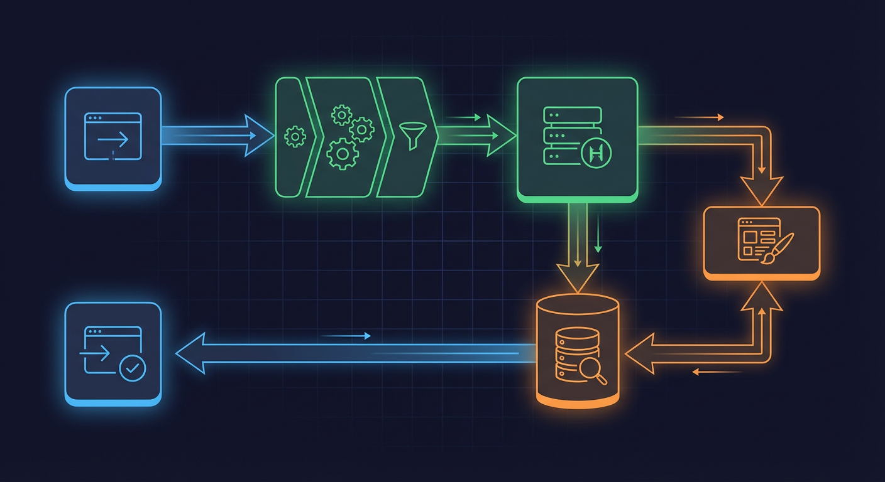
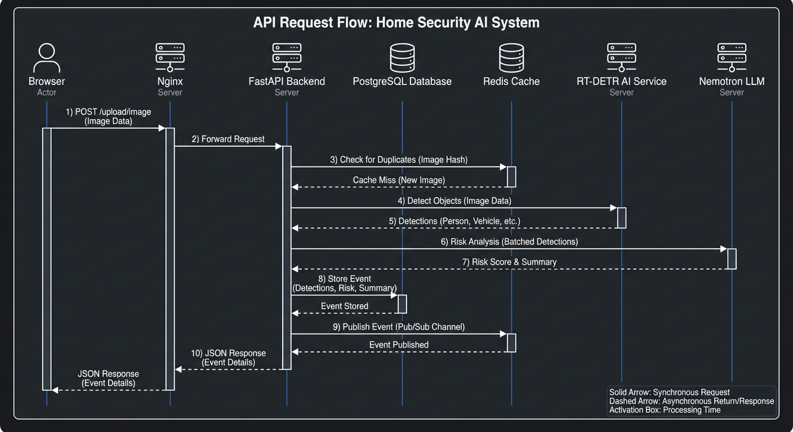

# API Reference Hub

This section provides comprehensive documentation for all REST API endpoints in the NEM home security monitoring system.

## Quick Reference

| API Domain | Base Path         | Description                         | Documentation                          |
| ---------- | ----------------- | ----------------------------------- | -------------------------------------- |
| Events     | `/api/events`     | Security event lifecycle management | [events-api.md](events-api.md)         |
| Cameras    | `/api/cameras`    | Camera CRUD and media operations    | [cameras-api.md](cameras-api.md)       |
| Detections | `/api/detections` | Object detection data and media     | [detections-api.md](detections-api.md) |
| System     | `/api/system`     | Health, monitoring, configuration   | [system-api.md](system-api.md)         |


## Cross-Cutting Concerns

| Topic                    | Documentation                                              |
| ------------------------ | ---------------------------------------------------------- |
| Request/Response Schemas | [request-response-schemas.md](request-response-schemas.md) |
| Error Handling           | [error-handling.md](error-handling.md)                     |

## Endpoint Summary

### Events API (`/api/events`)

| Method | Endpoint                         | Description                               | Source                                 |
| ------ | -------------------------------- | ----------------------------------------- | -------------------------------------- |
| GET    | `/api/events`                    | List events with filtering and pagination | `backend/api/routes/events.py:224-468` |
| GET    | `/api/events/stats`              | Get aggregated event statistics           | `backend/api/routes/events.py:471-603` |
| GET    | `/api/events/timeline-summary`   | Get bucketed timeline data                | `backend/api/routes/events.py:621-779` |
| GET    | `/api/events/search`             | Full-text search events                   | `backend/api/routes/events.py:782-892` |
| GET    | `/api/events/export`             | Export events as CSV/Excel                | `backend/api/routes/events.py:895-999` |
| GET    | `/api/events/deleted`            | List soft-deleted events                  | `backend/api/routes/events.py`         |
| GET    | `/api/events/{event_id}`         | Get single event by ID                    | `backend/api/routes/events.py`         |
| PATCH  | `/api/events/{event_id}`         | Update event (reviewed, notes)            | `backend/api/routes/events.py`         |
| DELETE | `/api/events/{event_id}`         | Soft-delete an event                      | `backend/api/routes/events.py`         |
| POST   | `/api/events/{event_id}/restore` | Restore soft-deleted event                | `backend/api/routes/events.py`         |
| POST   | `/api/events/bulk`               | Bulk create events                        | `backend/api/routes/events.py`         |
| PATCH  | `/api/events/bulk`               | Bulk update events                        | `backend/api/routes/events.py`         |
| DELETE | `/api/events/bulk`               | Bulk delete events                        | `backend/api/routes/events.py`         |

### Cameras API (`/api/cameras`)

| Method | Endpoint                                                  | Description               | Source                                    |
| ------ | --------------------------------------------------------- | ------------------------- | ----------------------------------------- |
| GET    | `/api/cameras`                                            | List all cameras          | `backend/api/routes/cameras.py:106-221`   |
| POST   | `/api/cameras`                                            | Create new camera         | `backend/api/routes/cameras.py:362-453`   |
| GET    | `/api/cameras/deleted`                                    | List soft-deleted cameras | `backend/api/routes/cameras.py:231-282`   |
| GET    | `/api/cameras/validation/paths`                           | Validate camera paths     | `backend/api/routes/cameras.py:912-996`   |
| GET    | `/api/cameras/{camera_id}`                                | Get camera by ID          | `backend/api/routes/cameras.py:342-359`   |
| PATCH  | `/api/cameras/{camera_id}`                                | Update camera             | `backend/api/routes/cameras.py:456-532`   |
| DELETE | `/api/cameras/{camera_id}`                                | Delete camera             | `backend/api/routes/cameras.py:535-589`   |
| POST   | `/api/cameras/{camera_id}/restore`                        | Restore deleted camera    | `backend/api/routes/cameras.py:285-339`   |
| GET    | `/api/cameras/{camera_id}/snapshot`                       | Get camera snapshot       | `backend/api/routes/cameras.py:799-909`   |
| GET    | `/api/cameras/{camera_id}/baseline`                       | Get camera baseline       | `backend/api/routes/cameras.py:999-1048`  |
| GET    | `/api/cameras/{camera_id}/baseline/anomalies`             | Get baseline anomalies    | `backend/api/routes/cameras.py:1051-1086` |
| GET    | `/api/cameras/{camera_id}/baseline/activity`              | Get activity baseline     | `backend/api/routes/cameras.py:1089-1160` |
| GET    | `/api/cameras/{camera_id}/baseline/classes`               | Get class baseline        | `backend/api/routes/cameras.py:1163-1222` |
| GET    | `/api/cameras/{camera_id}/scene-changes`                  | Get scene changes         | `backend/api/routes/cameras.py:1225-1319` |
| POST   | `/api/cameras/{camera_id}/scene-changes/{id}/acknowledge` | Acknowledge scene change  | `backend/api/routes/cameras.py:1322-1421` |

### Detections API (`/api/detections`)

| Method | Endpoint                                         | Description                    | Source                                       |
| ------ | ------------------------------------------------ | ------------------------------ | -------------------------------------------- |
| GET    | `/api/detections`                                | List detections with filtering | `backend/api/routes/detections.py:172-360`   |
| GET    | `/api/detections/stats`                          | Get detection statistics       | `backend/api/routes/detections.py:363-502`   |
| GET    | `/api/detections/search`                         | Search detections              | `backend/api/routes/detections.py:505-576`   |
| GET    | `/api/detections/labels`                         | Get unique detection labels    | `backend/api/routes/detections.py:579-588`   |
| GET    | `/api/detections/{detection_id}`                 | Get detection by ID            | `backend/api/routes/detections.py:591-608`   |
| GET    | `/api/detections/{detection_id}/thumbnail`       | Get detection thumbnail        | `backend/api/routes/detections.py:611-720`   |
| GET    | `/api/detections/{detection_id}/enrichment`      | Get enrichment data            | `backend/api/routes/detections.py:993-1026`  |
| GET    | `/api/detections/{detection_id}/image`           | Get detection image            | `backend/api/routes/detections.py:1185-1313` |
| GET    | `/api/detections/{detection_id}/video`           | Stream detection video         | `backend/api/routes/detections.py:1361-1508` |
| GET    | `/api/detections/{detection_id}/video/thumbnail` | Get video thumbnail            | `backend/api/routes/detections.py:1511-1624` |
| POST   | `/api/detections/bulk`                           | Bulk create detections         | `backend/api/routes/detections.py:1638-1762` |
| PATCH  | `/api/detections/bulk`                           | Bulk update detections         | `backend/api/routes/detections.py:1765-1881` |
| DELETE | `/api/detections/bulk`                           | Bulk delete detections         | `backend/api/routes/detections.py:1884-1997` |

### System API (`/api/system`)

| Method | Endpoint                         | Description                  | Source                                   |
| ------ | -------------------------------- | ---------------------------- | ---------------------------------------- |
| GET    | `/api/system/health`             | Detailed health check        | `backend/api/routes/system.py:1049-1181` |
| GET    | `/api/system/health/ready`       | Readiness probe              | `backend/api/routes/system.py:1188-1328` |
| GET    | `/api/system/health/websocket`   | WebSocket health             | `backend/api/routes/system.py:1331-1394` |
| GET    | `/api/system/health/full`        | Full health with AI services | `backend/api/routes/system.py`           |
| GET    | `/api/system/monitoring/health`  | Prometheus-style health      | `backend/api/routes/system.py`           |
| GET    | `/api/system/monitoring/targets` | Monitoring targets           | `backend/api/routes/system.py`           |
| GET    | `/api/system/gpu/stats`          | GPU statistics               | `backend/api/routes/system.py:634-683`   |
| GET    | `/api/system/config`             | System configuration         | `backend/api/routes/system.py`           |
| PATCH  | `/api/system/config`             | Update configuration         | `backend/api/routes/system.py`           |

## Authentication

The API supports optional API key authentication via the `X-API-Key` header.

```bash
# With API key authentication enabled
curl -H "X-API-Key: your-api-key" https://api.example.com/api/events

# Endpoints exempt from authentication (media serving):
# - GET /api/cameras/{camera_id}/snapshot
# - GET /api/detections/{detection_id}/thumbnail
# - GET /api/detections/{detection_id}/image
# - GET /api/detections/{detection_id}/video
```

**Source:** `backend/api/routes/system.py:261-291`

## Pagination

The API supports two pagination strategies:

### Cursor-Based Pagination (Recommended)

```json
{
  "items": [...],
  "pagination": {
    "total": 150,
    "limit": 50,
    "offset": 0,
    "next_cursor": "eyJpZCI6IDUwLCAiY3JlYXRlZF9hdCI6ICIyMDI2LTAxLTIzVDEyOjAwOjAwWiJ9",  // pragma: allowlist secret
    "has_more": true
  }
}
```

### Offset Pagination (Deprecated)

```
GET /api/events?limit=50&offset=100
```

**Warning:** Offset pagination is deprecated. The API returns a `deprecation_warning` field and HTTP `Deprecation` header when offset pagination is used.

**Source:** `backend/api/pagination.py`

## Rate Limiting

Rate limits are applied per endpoint tier:

| Tier    | Rate    | Burst | Endpoints           |
| ------- | ------- | ----- | ------------------- |
| DEFAULT | 100/min | 10    | Most API endpoints  |
| MEDIA   | 30/min  | 5     | Image/video serving |
| BULK    | 10/min  | 2     | Bulk operations     |
| EXPORT  | 5/min   | 1     | Data export         |

**Source:** `backend/api/middleware/rate_limit.py`

## Response Envelope





All list endpoints use a standardized response envelope:

```json
{
  "items": [...],
  "pagination": {
    "total": 100,
    "limit": 50,
    "offset": 0,
    "next_cursor": "...",
    "has_more": true
  }
}
```

**Source:** `backend/api/schemas/pagination.py`

## Related Documentation

- [Architecture Overview](../overview.md) - System architecture and design
- [Data Model](../data-model/README.md) - Database schema documentation
- [Background Services](../background-services/README.md) - Worker and service documentation
