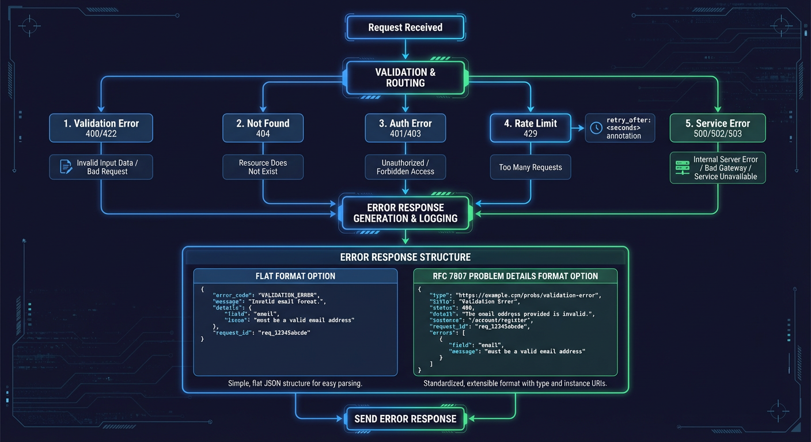
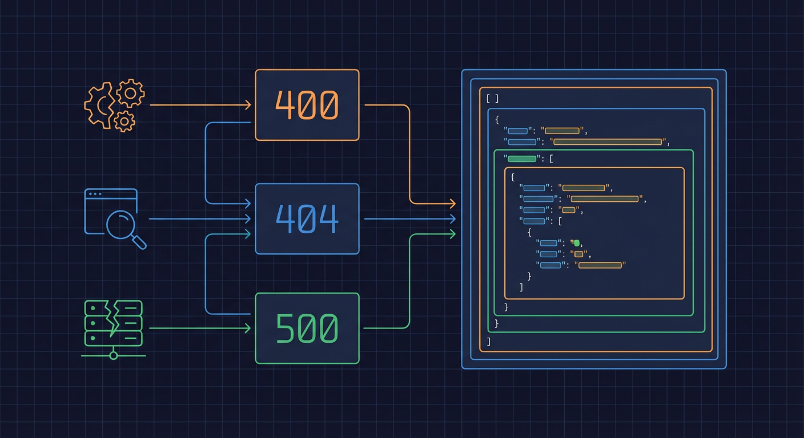

# Error Handling

This document describes the error handling patterns and response formats used in the NEM home security monitoring API.

## Overview



The API uses standardized error responses to ensure consistent error handling across all endpoints. Two formats are supported:

1. **Flat Error Response** (recommended) - Used by `raise_http_error()` helper
2. **RFC 7807 Problem Details** - Standards-compliant format

**Source:** `backend/api/schemas/errors.py`

## Error Response Formats

### Flat Error Response (Primary)

Used by most endpoints via the `raise_http_error()` helper function.

**Source:** `backend/api/schemas/errors.py:198-252`

```json
{
  "error_code": "CAMERA_NOT_FOUND",
  "message": "Camera 'front_door' not found in database",
  "details": {
    "camera_id": "front_door"
  },
  "request_id": "req-123-456"
}
```

| Field        | Type   | Required | Description                 |
| ------------ | ------ | -------- | --------------------------- |
| `error_code` | string | Yes      | Machine-readable error code |
| `message`    | string | Yes      | Human-readable description  |
| `details`    | object | No       | Additional context          |
| `request_id` | string | No       | Request correlation ID      |

---

### RFC 7807 Problem Details

Standards-compliant format for HTTP APIs.

**Source:** `backend/api/schemas/problem_details.py:139-249`

```json
{
  "type": "about:blank",
  "title": "Not Found",
  "status": 404,
  "detail": "Camera 'front_door' does not exist",
  "instance": "/api/cameras/front_door"
}
```

| Field      | Type    | Required | Description                                           |
| ---------- | ------- | -------- | ----------------------------------------------------- |
| `type`     | string  | No       | URI identifying problem type (default: "about:blank") |
| `title`    | string  | Yes      | Short summary (e.g., "Not Found")                     |
| `status`   | integer | Yes      | HTTP status code                                      |
| `detail`   | string  | Yes      | Specific explanation                                  |
| `instance` | string  | No       | URI identifying this occurrence                       |

**Media Type:** `application/problem+json`

---

## Error Codes



### Resource Not Found (404)

**Source:** `backend/api/schemas/errors.py:59-72`

| Code                     | Description                           |
| ------------------------ | ------------------------------------- |
| `CAMERA_NOT_FOUND`       | Camera with specified ID not found    |
| `EVENT_NOT_FOUND`        | Event with specified ID not found     |
| `DETECTION_NOT_FOUND`    | Detection with specified ID not found |
| `ZONE_NOT_FOUND`         | Zone with specified ID not found      |
| `ALERT_NOT_FOUND`        | Alert with specified ID not found     |
| `ALERT_RULE_NOT_FOUND`   | Alert rule not found                  |
| `SCENE_CHANGE_NOT_FOUND` | Scene change not found                |
| `LOG_NOT_FOUND`          | Log entry not found                   |
| `AUDIT_LOG_NOT_FOUND`    | Audit log entry not found             |
| `ENTITY_NOT_FOUND`       | Generic entity not found              |
| `CLIP_NOT_FOUND`         | Video clip not found                  |
| `PROMPT_NOT_FOUND`       | Prompt template not found             |
| `RESOURCE_NOT_FOUND`     | Generic resource not found            |

---

### Validation Errors (400, 422)

**Source:** `backend/api/schemas/errors.py:74-85`

| Code                           | Description                      |
| ------------------------------ | -------------------------------- |
| `VALIDATION_ERROR`             | Generic validation failure       |
| `INVALID_DATE_RANGE`           | Start date after end date        |
| `INVALID_PAGINATION`           | Invalid pagination parameters    |
| `INVALID_FILTER`               | Invalid filter parameter         |
| `INVALID_REQUEST_BODY`         | Malformed request body           |
| `INVALID_QUERY_PARAMETER`      | Invalid query parameter          |
| `INVALID_PATH_PARAMETER`       | Invalid path parameter           |
| `INVALID_CAMERA_ID`            | Invalid camera ID format         |
| `INVALID_COORDINATES`          | Invalid bounding box coordinates |
| `INVALID_CONFIDENCE_THRESHOLD` | Confidence outside 0-1 range     |

---

### Conflict Errors (409)

**Source:** `backend/api/schemas/errors.py:87-91`

| Code                        | Description                       |
| --------------------------- | --------------------------------- |
| `RESOURCE_ALREADY_EXISTS`   | Generic resource conflict         |
| `CAMERA_ALREADY_EXISTS`     | Camera with same name/path exists |
| `ZONE_ALREADY_EXISTS`       | Zone with same name exists        |
| `ALERT_RULE_ALREADY_EXISTS` | Alert rule already exists         |
| `DUPLICATE_ENTRY`           | Duplicate database entry          |

---

### Authentication/Authorization (401, 403)

**Source:** `backend/api/schemas/errors.py:93-98`

| Code                       | Description                       |
| -------------------------- | --------------------------------- |
| `AUTHENTICATION_REQUIRED`  | API key required but not provided |
| `INVALID_API_KEY`          | Invalid API key                   |
| `EXPIRED_TOKEN`            | Token has expired                 |
| `ACCESS_DENIED`            | Access denied                     |
| `INSUFFICIENT_PERMISSIONS` | Insufficient permissions          |

---

### Rate Limiting (429)

**Source:** `backend/api/schemas/errors.py:100-102`

| Code                  | Description                 |
| --------------------- | --------------------------- |
| `RATE_LIMIT_EXCEEDED` | Request rate limit exceeded |
| `QUOTA_EXCEEDED`      | Usage quota exceeded        |

---

### Service Errors (500, 502, 503)

**Source:** `backend/api/schemas/errors.py:104-118`

| Code                             | Description                    |
| -------------------------------- | ------------------------------ |
| `INTERNAL_ERROR`                 | Generic internal error         |
| `DATABASE_ERROR`                 | Database operation failed      |
| `CACHE_ERROR`                    | Cache operation failed         |
| `QUEUE_ERROR`                    | Queue operation failed         |
| `DETECTOR_UNAVAILABLE`           | Detection service unavailable  |
| `RTDETR_UNAVAILABLE`             | RT-DETR service unavailable    |
| `NEMOTRON_UNAVAILABLE`           | Nemotron LLM unavailable       |
| `FLORENCE_UNAVAILABLE`           | Florence model unavailable     |
| `ENRICHMENT_SERVICE_UNAVAILABLE` | Enrichment service unavailable |
| `AI_SERVICE_TIMEOUT`             | AI service request timed out   |
| `MODEL_LOAD_FAILED`              | AI model failed to load        |
| `INFERENCE_FAILED`               | AI inference failed            |

---

### File/Media Errors

**Source:** `backend/api/schemas/errors.py:120-128`

| Code                          | Description                  |
| ----------------------------- | ---------------------------- |
| `FILE_NOT_FOUND`              | File not found on disk       |
| `FILE_ACCESS_DENIED`          | Permission denied for file   |
| `INVALID_FILE_TYPE`           | Unsupported file type        |
| `FILE_TOO_LARGE`              | File exceeds size limit      |
| `MEDIA_PROCESSING_FAILED`     | Media processing failed      |
| `THUMBNAIL_GENERATION_FAILED` | Thumbnail creation failed    |
| `CLIP_GENERATION_FAILED`      | Video clip generation failed |

---

### WebSocket Errors

**Source:** `backend/api/schemas/errors.py:130-133`

| Code                          | Description                      |
| ----------------------------- | -------------------------------- |
| `WEBSOCKET_CONNECTION_FAILED` | WebSocket connection failed      |
| `INVALID_WEBSOCKET_MESSAGE`   | Invalid WebSocket message format |
| `SUBSCRIPTION_FAILED`         | Subscription operation failed    |

---

### Operation Errors

**Source:** `backend/api/schemas/errors.py:138-141`

| Code                  | Description               |
| --------------------- | ------------------------- |
| `OPERATION_FAILED`    | Generic operation failure |
| `OPERATION_TIMEOUT`   | Operation timed out       |
| `OPERATION_CANCELLED` | Operation was cancelled   |

---

## Using raise_http_error()

The `raise_http_error()` helper function creates standardized error responses.

**Source:** `backend/api/schemas/errors.py:144-195`

### Basic Usage

```python
from fastapi import status
from backend.api.schemas.errors import ErrorCode, raise_http_error

@router.get("/{camera_id}")
async def get_camera(camera_id: str, db: AsyncSession = Depends(get_db)):
    camera = await db.get(Camera, camera_id)
    if not camera:
        raise_http_error(
            status_code=status.HTTP_404_NOT_FOUND,
            error_code=ErrorCode.CAMERA_NOT_FOUND,
            message=f"Camera '{camera_id}' not found in database",
        )
    return camera
```

### With Details

```python
raise_http_error(
    status_code=status.HTTP_400_BAD_REQUEST,
    error_code=ErrorCode.INVALID_DATE_RANGE,
    message="Start date must be before end date",
    details={
        "start_date": "2026-01-15",
        "end_date": "2026-01-10"
    },
    request_id="req-123-456",
)
```

---

## Specialized Error Responses

### ValidationErrorResponse

For requests with multiple validation errors.

**Source:** `backend/api/schemas/errors.py:335-404`

```json
{
  "error": {
    "code": "VALIDATION_ERROR",
    "message": "Request validation failed",
    "errors": [
      {
        "field": "body.start_date",
        "message": "start_date must be before end_date",
        "value": "2026-12-01"
      },
      {
        "field": "body.limit",
        "message": "ensure this value is less than or equal to 1000",
        "value": 5000
      }
    ],
    "request_id": "550e8400-e29b-41d4-a716-446655440000"
  }
}
```

---

### RateLimitErrorResponse

For rate limit exceeded errors.

**Source:** `backend/api/schemas/errors.py:407-450`

```json
{
  "error": {
    "code": "RATE_LIMIT_EXCEEDED",
    "message": "Rate limit exceeded. Please wait before retrying.",
    "retry_after": 60,
    "limit": 100,
    "window_seconds": 60,
    "request_id": "550e8400-e29b-41d4-a716-446655440000"
  }
}
```

| Field            | Type    | Description                      |
| ---------------- | ------- | -------------------------------- |
| `retry_after`    | integer | Seconds until rate limit resets  |
| `limit`          | integer | The rate limit that was exceeded |
| `window_seconds` | integer | Time window for the rate limit   |

---

### ServiceUnavailableResponse

For service unavailability errors.

**Source:** `backend/api/schemas/errors.py:453-491`

```json
{
  "error": {
    "code": "AI_SERVICE_UNAVAILABLE",
    "message": "Object detection service temporarily unavailable",
    "service": "rtdetr",
    "retry_after": 30,
    "request_id": "550e8400-e29b-41d4-a716-446655440000"
  }
}
```

---

## Common Error Responses for OpenAPI

Predefined responses for OpenAPI documentation.

**Source:** `backend/api/schemas/errors.py:495-531`

```python
COMMON_ERROR_RESPONSES = {
    400: {
        "model": ValidationErrorResponse,
        "description": "Validation error - request data is invalid",
    },
    401: {
        "model": ErrorResponse,
        "description": "Authentication required",
    },
    403: {
        "model": ErrorResponse,
        "description": "Access denied",
    },
    404: {
        "model": ErrorResponse,
        "description": "Resource not found",
    },
    409: {
        "model": ErrorResponse,
        "description": "Conflict - resource already exists",
    },
    429: {
        "model": RateLimitErrorResponse,
        "description": "Rate limit exceeded",
    },
    500: {
        "model": ErrorResponse,
        "description": "Internal server error",
    },
    502: {
        "model": ServiceUnavailableResponse,
        "description": "Bad gateway - upstream service error",
    },
    503: {
        "model": ServiceUnavailableResponse,
        "description": "Service unavailable",
    },
}
```

---

## HTTP Status Phrases

Standard HTTP status phrases are provided for RFC 7807 responses.

**Source:** `backend/api/schemas/problem_details.py:42-110`

```python
from backend.api.schemas.problem_details import get_status_phrase

get_status_phrase(404)  # "Not Found"
get_status_phrase(500)  # "Internal Server Error"
get_status_phrase(429)  # "Too Many Requests"
get_status_phrase(999)  # "Unknown Error"
```

---

## Error Handling Best Practices

### 1. Use Specific Error Codes

```python
# Good - specific error code
raise_http_error(
    status_code=404,
    error_code=ErrorCode.CAMERA_NOT_FOUND,
    message="Camera not found",
)

# Avoid - generic error code
raise_http_error(
    status_code=404,
    error_code=ErrorCode.RESOURCE_NOT_FOUND,
    message="Camera not found",
)
```

### 2. Provide Helpful Details

```python
raise_http_error(
    status_code=400,
    error_code=ErrorCode.INVALID_DATE_RANGE,
    message="Start date must be before end date",
    details={
        "start_date": str(start_date),
        "end_date": str(end_date),
        "suggestion": "Swap the date values"
    },
)
```

### 3. Sanitize Sensitive Information

Never include sensitive data in error details:

```python
# Good - sanitized
raise_http_error(
    status_code=401,
    error_code=ErrorCode.INVALID_API_KEY,
    message="Invalid API key",
)

# Bad - exposes key
raise_http_error(
    status_code=401,
    error_code=ErrorCode.INVALID_API_KEY,
    message="Invalid API key",
    details={"provided_key": api_key},  # Never do this!
)
```

### 4. Use Request IDs for Debugging

```python
import uuid

request_id = str(uuid.uuid4())
raise_http_error(
    status_code=500,
    error_code=ErrorCode.INTERNAL_ERROR,
    message="An unexpected error occurred",
    request_id=request_id,
)
# Log the request_id for debugging
logger.error(f"Internal error for request {request_id}", exc_info=True)
```

---

## Related Documentation

- [Events API](events-api.md) - Event endpoint errors
- [Cameras API](cameras-api.md) - Camera endpoint errors
- [Detections API](detections-api.md) - Detection endpoint errors
- [System API](system-api.md) - System endpoint errors
- [Request/Response Schemas](request-response-schemas.md) - Schema details
