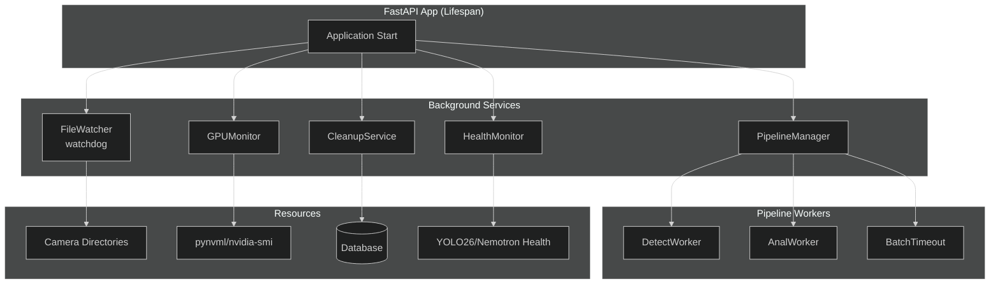
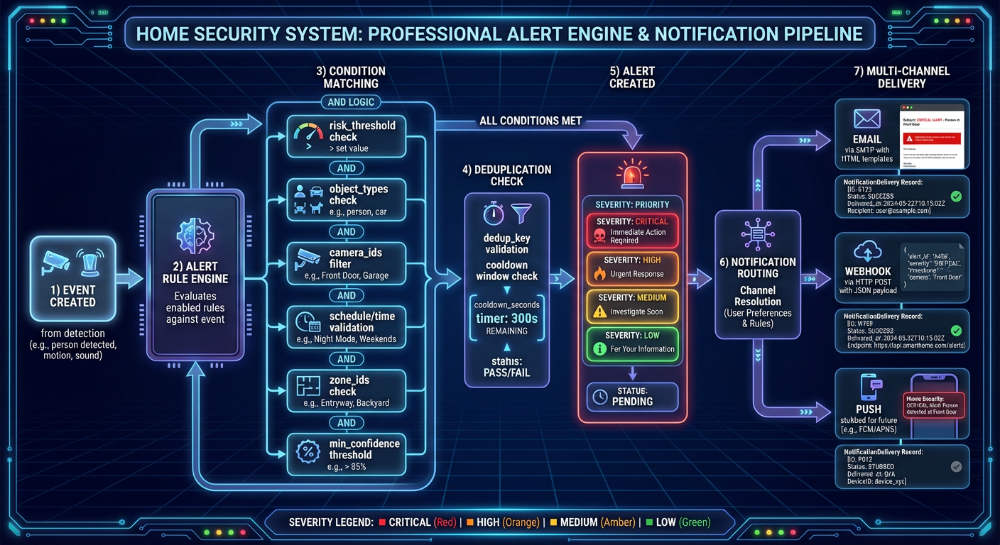

# Background Services Hub

This documentation covers the background services that power the AI-powered home security monitoring system. These services run continuously during application runtime, handling file monitoring, detection batching, GPU statistics collection, data retention, and service health checks.

## Services Overview

| Service                                          | Source File                            | Purpose                                     | Startup Order           |
| ------------------------------------------------ | -------------------------------------- | ------------------------------------------- | ----------------------- |
| [FileWatcher](./file-watcher.md)                 | `backend/services/file_watcher.py`     | Monitors camera directories for new uploads | 3                       |
| [BatchAggregator](./batch-aggregator.md)         | `backend/services/batch_aggregator.py` | Groups detections into time-based batches   | 4 (via PipelineManager) |
| [GPUMonitor](./gpu-monitor.md)                   | `backend/services/gpu_monitor.py`      | Collects NVIDIA GPU statistics              | 5                       |
| [CleanupService](./retention-cleanup.md)         | `backend/services/cleanup_service.py`  | Enforces data retention policies            | 6                       |
| [ServiceHealthMonitor](./health-check-worker.md) | `backend/services/health_monitor.py`   | Monitors AI service health                  | 7                       |

## Architecture Overview



## Lifespan Management

All background services are managed through FastAPI's lifespan context in `backend/main.py:461-929`. The lifespan manager handles:

1. **Startup**: Initialize services in dependency order
2. **Signal Handling**: Install SIGTERM/SIGINT handlers for graceful shutdown
3. **Shutdown**: Stop services in reverse order, ensuring clean resource cleanup

### Startup Sequence

The following services are started during application lifespan initialization:

```python
# backend/main.py:579-584
file_watcher = FileWatcher(
    redis_client=redis_client,
    camera_creator=create_camera_callback,
)
await file_watcher.start()

# backend/main.py:587-591
pipeline_manager = await get_pipeline_manager(redis_client)
await pipeline_manager.start()

# backend/main.py:671-673
gpu_monitor = GPUMonitor(broadcaster=None)
await gpu_monitor.start()

# backend/main.py:676-678
cleanup_service = CleanupService()
await cleanup_service.start()

# backend/main.py:750-756
service_health_monitor = ServiceHealthMonitor(
    manager=service_manager,
    services=service_configs,
    broadcaster=event_broadcaster,
    check_interval=15.0,
)
await service_health_monitor.start()
```

### Shutdown Sequence

Services are stopped in reverse dependency order:

```python
# backend/main.py:832-878
# 1. Stop ServiceHealthMonitor
# 2. Stop BackgroundEvaluator
# 3. Stop SummaryJobScheduler
# 4. Stop CleanupService
# 5. Stop GPUMonitor
# 6. Stop WorkerSupervisor
# 7. Drain queues (30s timeout)
# 8. Stop PipelineManager
# 9. Stop FileWatcher
# 10. Stop broadcasters
```

## Common Patterns

### Async Context Manager Pattern

All background services implement the async context manager protocol for resource cleanup:

```python
# Example from backend/services/file_watcher.py:1018-1050
async def __aenter__(self) -> FileWatcher:
    await self.start()
    return self

async def __aexit__(self, exc_type, exc_val, exc_tb) -> None:
    await self.stop()
```

### Idempotent Start/Stop

All services use idempotent start/stop methods with running state checks:

```python
# Example from backend/services/gpu_monitor.py:1137-1152
async def start(self) -> None:
    if self.running:
        logger.warning("GPUMonitor already running")
        return

    self.running = True
    self._poll_task = asyncio.create_task(self._poll_loop())
```

### Graceful Task Cancellation

Background tasks are cancelled gracefully with timeout handling:

```python
# Example from backend/services/cleanup_service.py:596-615
async def stop(self) -> None:
    self.running = False

    if self._cleanup_task:
        self._cleanup_task.cancel()
        with contextlib.suppress(asyncio.CancelledError):
            await self._cleanup_task

    self._cleanup_task = None
```

## Configuration

Background service intervals and timeouts are configured via environment variables in `backend/core/config.py`:

| Setting                         | Default | Description                       |
| ------------------------------- | ------- | --------------------------------- |
| `RETENTION_DAYS`                | 30      | Data retention period in days     |
| `GPU_POLL_INTERVAL_SECONDS`     | 5.0     | GPU stats polling interval        |
| `BATCH_WINDOW_SECONDS`          | 90      | Maximum batch window duration     |
| `BATCH_IDLE_TIMEOUT_SECONDS`    | 30      | Batch idle timeout                |
| `BATCH_CHECK_INTERVAL_SECONDS`  | 5.0     | How often to check batch timeouts |
| `FILE_WATCHER_POLLING`          | False   | Use polling observer (for Docker) |
| `FILE_WATCHER_POLLING_INTERVAL` | 1.0     | Polling interval in seconds       |

## Observability

### Health Registry

Services register with the health registry for `/api/system/health` endpoint:

```python
# backend/main.py:795-804
health_registry.register_gpu_monitor(gpu_monitor)
health_registry.register_cleanup_service(cleanup_service)
health_registry.register_system_broadcaster(system_broadcaster)
health_registry.register_file_watcher(file_watcher)
health_registry.register_pipeline_manager(pipeline_manager)
health_registry.register_service_health_monitor(service_health_monitor)
```

### Prometheus Metrics

Workers expose metrics via Prometheus endpoints:

- `pipeline_queue_depth{queue="detection|analysis"}` - Queue depths
- `pipeline_stage_duration_seconds{stage="detect|batch|analyze"}` - Processing times
- `pipeline_errors_total{error_type="..."}` - Error counts

### Structured Logging

All services use structured logging with consistent context:

```python
logger.info(
    "Batch closed",
    extra={
        "batch_id": batch_id,
        "camera_id": camera_id,
        "detection_count": len(detections),
        "duration_ms": batch_duration_ms,
    },
)
```

## Alert Engine Architecture



The alert engine provides the notification pipeline for security events, integrating with the background services to deliver timely alerts based on risk thresholds and user preferences.

## Related Documentation

- [Detection Pipeline](../detection-pipeline/README.md) - Detection and analysis pipeline
- [Testing Guide](../../development/testing.md) - Testing background services
- [Observability](../observability/README.md) - Monitoring and alerting
