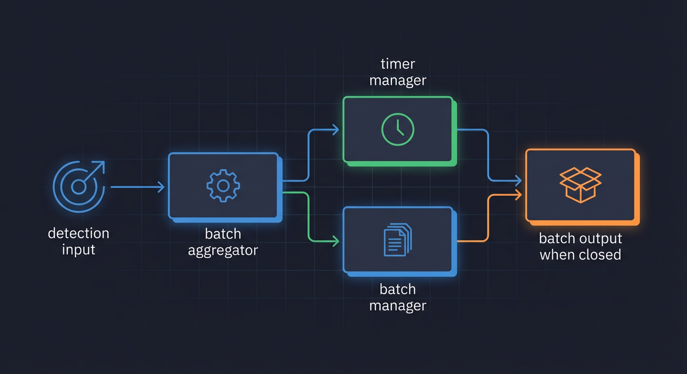
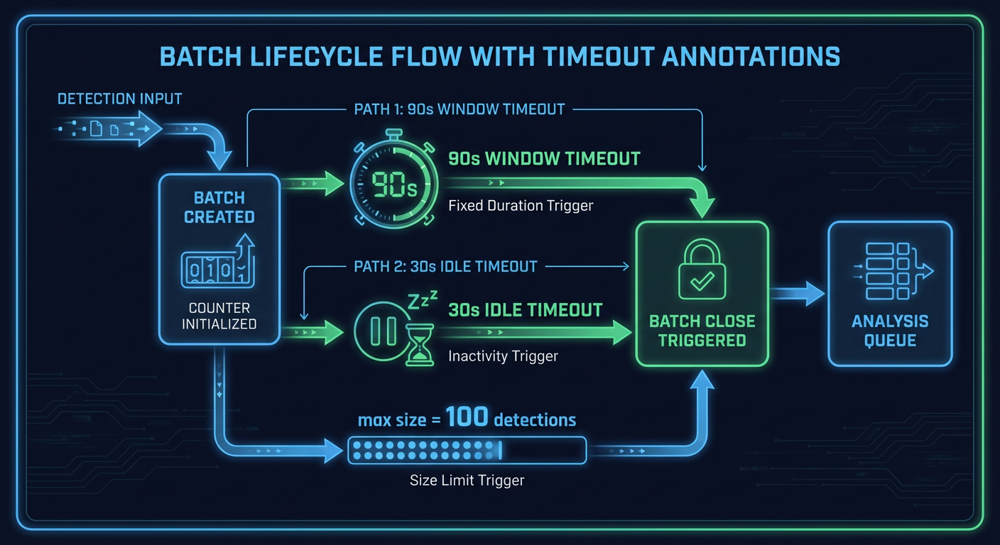

# BatchAggregator Service

The `BatchAggregator` groups detections from the same camera into time-based batches before sending them to the Nemotron LLM for analysis. This reduces API calls and allows the LLM to understand detection context across multiple frames.

**Source File:** `backend/services/batch_aggregator.py`



## Overview

The BatchAggregator service:

- Groups detections by camera into time-based windows
- Closes batches on window timeout (90s) or idle timeout (30s)
- Implements fast path for high-confidence detections
- Uses atomic Redis operations for distributed safety
- Tracks batch lifecycle via unique batch IDs

## Configuration

| Environment Variable             | Default      | Description                         |
| -------------------------------- | ------------ | ----------------------------------- |
| `BATCH_WINDOW_SECONDS`           | 90           | Maximum batch window duration       |
| `BATCH_IDLE_TIMEOUT_SECONDS`     | 30           | Batch idle timeout                  |
| `BATCH_CHECK_INTERVAL_SECONDS`   | 5.0          | How often to check batch timeouts   |
| `BATCH_MAX_DETECTIONS`           | 100          | Maximum detections per batch        |
| `FAST_PATH_CONFIDENCE_THRESHOLD` | 0.95         | Confidence threshold for fast path  |
| `FAST_PATH_OBJECT_TYPES`         | `["person"]` | Object types eligible for fast path |

## Batch Lifecycle



```
+------------------+
| First detection  |
| for camera       |
+--------+---------+
         |
         v
+--------+---------+
| Create new batch |
| batch_id =       |
| batch-XXXXXXXX   |
+--------+---------+
         |
         v
+--------+---------+
| Add detection    |
| to batch         |
+--------+---------+
         |
    +----+----+
    |         |
    v         v
More      Timeout?
detections  (idle or window)
    |         |
    v         v
Add to    +--------+--------+
batch     | Close batch     |
    |     +--------+--------+
    |              |
    +------+-------+
           |
           v
+----------+-----------+
| Push to analysis_queue|
| with batch_id,       |
| camera_id,           |
| detection_ids        |
+----------------------+
```

## Timing Diagram

The following diagram shows batch timing for a camera with intermittent activity:

```
Time (seconds)
0        30       60       90       120      150
|--------|--------|--------|--------|--------|
|                                            |
v                                            v
Detection 1                           Detection 8
|                                            |
| <- Batch Window (90s max) ->               |
|                                            |
|  D1  D2    D3      D4 D5        D6  D7    |
|  |   |     |       |  |          |   |    |
|  0   5    15      40 42         70  75    |
|                                   |        |
|                   <- 30s idle --> X        |
|                                   |        |
|                              Batch closed  |
|                              (idle timeout)|
|                                            |
|                                     New batch starts
|                                     for Detection 8
```

### Batch Close Conditions

1. **Window Timeout**: Batch reaches 90 seconds from creation
2. **Idle Timeout**: No new detections for 30 seconds
3. **Max Size**: Batch reaches `batch_max_detections` (default 100)

## Initialization

The `BatchAggregator` is initialized with Redis client (`backend/services/batch_aggregator.py:135-161`):

```python
def __init__(self, redis_client: RedisClient | None = None, analyzer: Any | None = None):
    self._redis = redis_client
    self._analyzer = analyzer
    settings = get_settings()
    self._batch_window = settings.batch_window_seconds
    self._idle_timeout = settings.batch_idle_timeout_seconds
    self._analysis_queue = ANALYSIS_QUEUE
    self._fast_path_threshold = settings.fast_path_confidence_threshold
    self._fast_path_types = settings.fast_path_object_types
    self._batch_max_detections = settings.batch_max_detections

    # Per-camera locks to prevent race conditions
    self._camera_locks: defaultdict[str, asyncio.Lock] = defaultdict(asyncio.Lock)

    # Global lock for batch timeout checking and closing
    self._batch_close_lock = asyncio.Lock()
```

## Redis Key Schema

All batch keys have a 1-hour TTL for orphan cleanup:

| Key Pattern                            | Type   | Description                        |
| -------------------------------------- | ------ | ---------------------------------- |
| `batch:{camera_id}:current`            | STRING | Current batch ID for camera        |
| `batch:{batch_id}:camera_id`           | STRING | Camera ID for batch                |
| `batch:{batch_id}:detections`          | LIST   | Detection IDs (Redis LIST)         |
| `batch:{batch_id}:started_at`          | STRING | Batch start timestamp              |
| `batch:{batch_id}:last_activity`       | STRING | Last activity timestamp            |
| `batch:{batch_id}:pipeline_start_time` | STRING | ISO timestamp for latency tracking |
| `batch:{batch_id}:closing`             | STRING | Closing flag (prevents races)      |

## Adding Detections

The `add_detection()` method (`backend/services/batch_aggregator.py:393-547`):

```python
async def add_detection(
    self,
    camera_id: str,
    detection_id: int | str,
    _file_path: str,
    confidence: float | None = None,
    object_type: str | None = None,
    pipeline_start_time: str | None = None,
) -> str:
```

### Detection Flow

```
+------------------+
| add_detection()  |
+--------+---------+
         |
         v
+--------+---------+
| Fast path check  |
| (confidence >    |
| threshold AND    |
| object in list)  |
+--------+---------+
         |
    Yes  |  No
    |    |
    v    v
Fast   +--------+---------+
path   | Acquire camera  |
       | lock            |
       +--------+---------+
                |
                v
       +--------+---------+
       | Get current      |
       | batch for camera |
       +--------+---------+
                |
           +----+----+
           |         |
        Exists    None
           |         |
           v         v
       +---+---+ +---+---+
       |Check  | |Create |
       |max    | |new    |
       |size   | |batch  |
       +---+---+ +---+---+
           |         |
           v         |
       At max?       |
       |    |        |
      Yes   No       |
       |    |        |
       v    +--------+
    Close            |
    batch            |
       |             |
       v             v
    Create      +----+----+
    new batch   | Atomic  |
                | RPUSH   |
                | detection|
                +----+----+
                     |
                     v
                +----+----+
                | Update  |
                | last_   |
                | activity|
                +---------+
```

### Atomic Batch Metadata Creation

Uses Redis MULTI/EXEC for atomic batch creation (`backend/services/batch_aggregator.py:333-391`):

```python
async def _create_batch_metadata_atomic(
    self,
    batch_key: str,
    batch_id: str,
    camera_id: str,
    current_time: float,
    ttl: int,
    pipeline_start_time: str | None = None,
) -> None:
    # Use Redis pipeline with transaction=True for MULTI/EXEC
    async with client.pipeline(transaction=True) as pipe:
        pipe.set(batch_key, batch_id, ex=ttl)
        pipe.set(f"batch:{batch_id}:camera_id", camera_id, ex=ttl)
        pipe.set(f"batch:{batch_id}:started_at", str(current_time), ex=ttl)
        pipe.set(f"batch:{batch_id}:last_activity", str(current_time), ex=ttl)

        if pipeline_start_time:
            pipe.set(f"batch:{batch_id}:pipeline_start_time", pipeline_start_time, ex=ttl)

        await pipe.execute()
```

### Atomic Detection List Append

Uses Redis RPUSH for safe concurrent appends (`backend/services/batch_aggregator.py:282-304`):

```python
async def _atomic_list_append(self, key: str, value: int, ttl: int) -> int:
    client = self._redis._client
    # RPUSH is atomic - multiple processes can safely append
    length: int = await client.rpush(key, str(value))
    # Refresh TTL
    await client.expire(key, ttl)
    return length
```

## Checking Batch Timeouts

The `check_batch_timeouts()` method (`backend/services/batch_aggregator.py:549-703`) is called periodically by the `BatchTimeoutWorker`:

```python
async def check_batch_timeouts(self) -> list[str]:
    current_time = time.time()
    closed_batches: list[str] = []

    # Find all active batch keys using SCAN
    async for key in redis_client.scan_iter(match="batch:*:current", count=100):
        batch_keys.append(key)

    # Phase 1: Fetch all batch IDs in parallel
    batch_id_pipe = redis_client.pipeline()
    for batch_key in batch_keys:
        batch_id_pipe.get(batch_key)
    batch_ids = await batch_id_pipe.execute()

    # Phase 2: Fetch all batch metadata in parallel
    metadata_pipe = redis_client.pipeline()
    for _batch_key, batch_id in valid_batches:
        metadata_pipe.get(f"batch:{batch_id}:started_at")
        metadata_pipe.get(f"batch:{batch_id}:last_activity")
    metadata_results = await metadata_pipe.execute()

    # Check for timeouts
    for i, (batch_key, batch_id) in enumerate(valid_batches):
        started_at = float(started_at_str)
        last_activity = float(last_activity_str)

        window_elapsed = current_time - started_at
        idle_time = current_time - last_activity

        if window_elapsed >= self._batch_window:
            await self.close_batch(batch_id)
            closed_batches.append(batch_id)
        elif idle_time >= self._idle_timeout:
            await self.close_batch(batch_id)
            closed_batches.append(batch_id)

    return closed_batches
```

## Closing Batches

The `close_batch()` method (`backend/services/batch_aggregator.py:705-896`):

### Locking Strategy

```python
# Acquire global batch close lock
async with self._batch_close_lock:
    camera_id = await self._redis.get(f"batch:{batch_id}:camera_id")

    # Acquire camera lock
    camera_lock = await self._get_camera_lock(camera_id)
    async with camera_lock:
        # Set closing flag with TTL
        await self._redis._client.set(
            f"batch:{batch_id}:closing",
            "1",
            ex=BATCH_CLOSING_FLAG_TTL_SECONDS,  # 5 minutes
        )

        # Fetch batch data using TaskGroup
        async with asyncio.TaskGroup() as tg:
            tg.create_task(fetch_detections())
            tg.create_task(fetch_started_at())
            tg.create_task(fetch_pipeline_time())

        # Push to analysis queue
        await self._redis.add_to_queue_safe(
            self._analysis_queue,
            queue_item,
            overflow_policy=QueueOverflowPolicy.DLQ,
        )

        # Cleanup Redis keys
        await self._redis.delete(
            f"batch:{camera_id}:current",
            f"batch:{batch_id}:camera_id",
            f"batch:{batch_id}:detections",
            f"batch:{batch_id}:started_at",
            f"batch:{batch_id}:last_activity",
            f"batch:{batch_id}:pipeline_start_time",
            f"batch:{batch_id}:closing",
        )
```

## Fast Path Processing

High-confidence detections skip batching (`backend/services/batch_aggregator.py:1028-1081`):

```python
def _should_use_fast_path(self, confidence: float | None, object_type: str | None) -> bool:
    if confidence is None or object_type is None:
        return False

    if confidence < self._fast_path_threshold:
        return False

    return object_type.lower() in [t.lower() for t in self._fast_path_types]
```

```
Fast Path Flow:
+------------------+
| confidence > 95% |
| AND              |
| object = person  |
+--------+---------+
         |
         v
+--------+---------+
| Skip batching    |
| Immediate        |
| analysis         |
+------------------+
```

## Max Size Protection

Batches are closed when reaching max detections (`backend/services/batch_aggregator.py:468-491`):

```python
if batch_id:
    current_size: int = await self._redis._client.llen(detections_key)

    if current_size >= self._batch_max_detections:
        logger.info(
            "Batch reached max size, closing",
            extra={
                "camera_id": camera_id,
                "batch_id": batch_id,
                "current_size": current_size,
                "max_size": self._batch_max_detections,
            },
        )
        record_batch_max_reached(camera_id)

        await self._close_batch_for_size_limit(batch_id)
        batch_id = None  # Create new batch
```

## Memory Pressure Backpressure

The aggregator can throttle based on GPU memory (`backend/services/batch_aggregator.py:1087-1118`):

```python
async def should_apply_backpressure(self) -> bool:
    from backend.services.gpu_monitor import MemoryPressureLevel

    pressure_level = await get_memory_pressure_level()
    should_throttle: bool = pressure_level == MemoryPressureLevel.CRITICAL

    if should_throttle:
        logger.warning(
            "Backpressure active due to critical GPU memory pressure"
        )

    return should_throttle
```

## WebSocket Broadcasting

Batch events are broadcast for real-time UI updates (`backend/services/batch_aggregator.py:213-264`):

- `detection.new` - When detection is added to batch
- `detection.batch` - When batch is closed

## Batch ID Format

Human-readable batch IDs for tracing (`backend/services/batch_aggregator.py:63-77`):

```python
def generate_batch_id() -> str:
    """Generate batch ID like 'batch-a1b2c3d4'."""
    return f"batch-{uuid.uuid4().hex[:8]}"
```

## Concurrency Safety

### Per-Camera Locks

Prevents race conditions for same camera (`backend/services/batch_aggregator.py:266-280`):

```python
async def _get_camera_lock(self, camera_id: str) -> asyncio.Lock:
    async with self._locks_lock:
        return self._camera_locks[camera_id]
```

### Atomic Redis Operations

- **RPUSH**: Atomic list append (no read-modify-write race)
- **MULTI/EXEC**: Atomic batch metadata creation
- **Closing flag**: Prevents concurrent close_batch calls

## Related Documentation

- [FileWatcher](./file-watcher.md) - Upstream detection source
- [Pipeline Workers](./README.md) - BatchTimeoutWorker integration
- [GPU Monitor](./gpu-monitor.md) - Memory pressure signals
