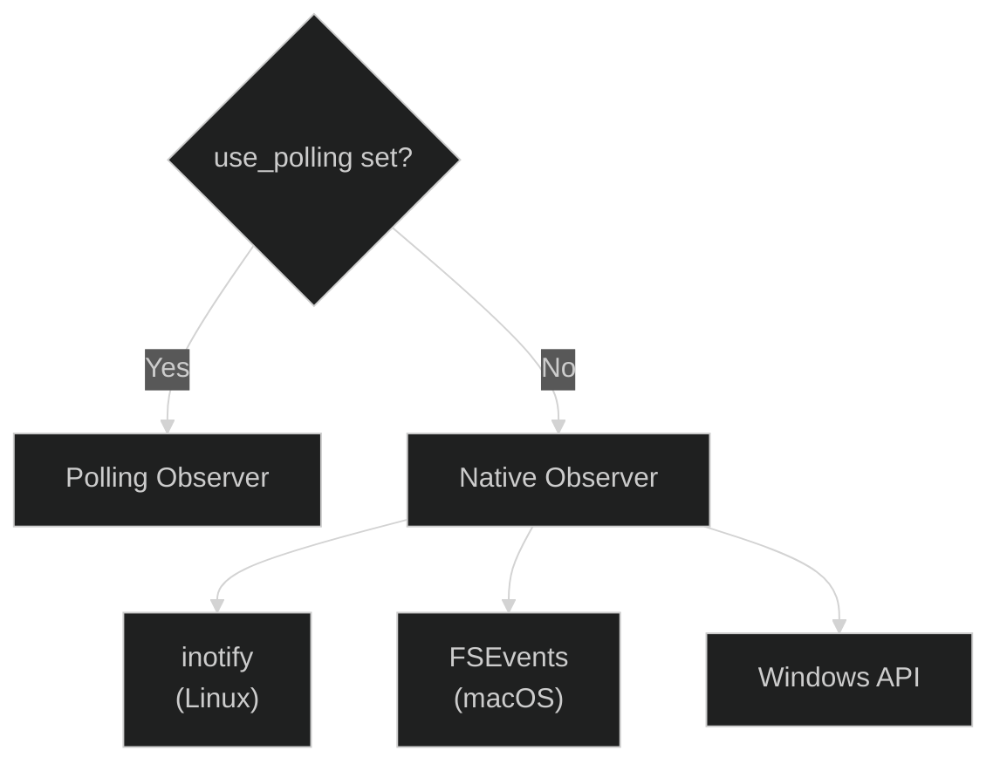
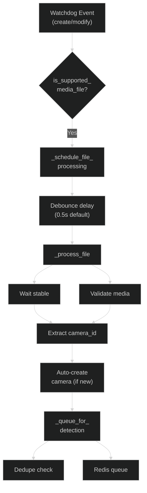

# FileWatcher Service

The `FileWatcher` monitors camera upload directories for new image and video files, validates them, and queues them for AI processing. It uses the `watchdog` library for filesystem event monitoring with debounce logic to handle incomplete uploads.

**Source File:** `backend/services/file_watcher.py`

## Overview

The FileWatcher service:

- Monitors camera directories for new media uploads (FTP)
- Validates image/video integrity before processing
- Debounces file events to wait for upload completion
- Deduplicates files using content hashes (SHA256)
- Auto-creates camera records for new upload directories
- Queues valid files to Redis for detection processing

## Configuration

| Environment Variable                | Default          | Description                           |
| ----------------------------------- | ---------------- | ------------------------------------- |
| `FOSCAM_BASE_PATH`                  | `/export/foscam` | Root directory for camera uploads     |
| `FILE_WATCHER_POLLING`              | `False`          | Use polling observer (for Docker)     |
| `FILE_WATCHER_POLLING_INTERVAL`     | `1.0`            | Polling interval in seconds           |
| `FILE_WATCHER_MAX_CONCURRENT_QUEUE` | `10`             | Max concurrent Redis queue operations |
| `FILE_WATCHER_QUEUE_DELAY_MS`       | `50`             | Delay between queue operations (ms)   |

## Supported File Types

```python
# backend/services/file_watcher.py:67-70
IMAGE_EXTENSIONS = {".jpg", ".jpeg", ".png"}
VIDEO_EXTENSIONS = {".mp4", ".mkv", ".avi", ".mov"}
SUPPORTED_EXTENSIONS = IMAGE_EXTENSIONS | VIDEO_EXTENSIONS
```

## Initialization

The `FileWatcher` is initialized with configurable parameters (`backend/services/file_watcher.py:351-454`):

```python
def __init__(
    self,
    camera_root: str | None = None,       # Root directory containing camera folders
    redis_client: Any | None = None,       # Redis client for queueing
    debounce_delay: float = 0.5,           # Delay after last file modification
    queue_name: str = DETECTION_QUEUE,     # Redis queue name
    dedupe_service: DedupeService | None = None,  # File deduplication
    auto_create_cameras: bool = True,      # Auto-create camera records
    camera_creator: Callable | None = None, # Callback to create cameras
    use_polling: bool | None = None,       # Use polling observer
    polling_interval: float | None = None, # Polling interval
    stability_time: float = 2.0,           # File stability wait time
):
```

### Observer Selection

The FileWatcher selects the best observer for the platform (`backend/services/file_watcher.py:414-420`):



- **Native Observer**: Uses inotify (Linux), FSEvents (macOS), or Windows API
- **Polling Observer**: For Docker Desktop/macOS mounts or network filesystems

## Startup and Shutdown

### Startup

The FileWatcher is started during application lifespan (`backend/main.py:579-584`):

```python
file_watcher = FileWatcher(
    redis_client=redis_client,
    camera_creator=create_camera_callback,
)
await file_watcher.start()
```

The `start()` method (`backend/services/file_watcher.py:875-972`):

1. Validates running in async context (requires event loop)
2. Captures event loop reference for thread-safe task scheduling
3. Initializes rate limiting semaphore
4. Creates camera root directory if missing
5. Schedules recursive directory watch
6. Starts watchdog observer

```python
async def start(self) -> None:
    if self.running:
        logger.warning("FileWatcher already running")
        return

    # Capture event loop for thread-safe scheduling
    self._loop = asyncio.get_running_loop()

    # Initialize rate limiting
    self._queue_semaphore = asyncio.Semaphore(self._max_concurrent_queue)

    # Watch camera root recursively
    self.observer.schedule(
        self._event_handler,
        str(camera_root_path),
        recursive=True,
    )

    self.observer.start()
    self.running = True
```

### Shutdown

The shutdown sequence (`backend/services/file_watcher.py:974-1016`):

1. Cancels all pending debounce tasks
2. Stops watchdog observer
3. Joins observer thread (with timeout)
4. Shuts down hash executor

```python
async def stop(self) -> None:
    if not self.running:
        return

    # Cancel pending tasks
    for task in self._pending_tasks.values():
        task.cancel()

    await asyncio.gather(*self._pending_tasks.values(), return_exceptions=True)
    self._pending_tasks.clear()

    # Stop observer
    self.observer.stop()
    await loop.run_in_executor(None, lambda: self.observer.join(timeout=5))

    # Shutdown hash executor
    await loop.run_in_executor(
        None, lambda: self._hash_executor.shutdown(wait=True, cancel_futures=False)
    )

    self._loop = None
    self.running = False
```

## File Processing Flow



## Debounce Logic

The FileWatcher implements debouncing to handle file write events (`backend/services/file_watcher.py:667-712`):

### Problem

Watchdog emits multiple events during file upload:

- `created` when file appears
- Multiple `modified` as data is written
- Final `modified` when upload completes

### Solution

```python
async def _schedule_file_processing(self, file_path: str) -> None:
    # Cancel existing pending task for this file
    if file_path in self._pending_tasks:
        self._pending_tasks[file_path].cancel()

    # Create new debounced task
    task = asyncio.create_task(self._debounced_process(file_path))
    self._pending_tasks[file_path] = task

    # Cleanup callback
    def cleanup_task(t: asyncio.Task) -> None:
        if self._pending_tasks.get(file_path) is t:
            self._pending_tasks.pop(file_path, None)

    task.add_done_callback(cleanup_task)
```

### Timing Diagram

```
Time -->
Event:  create  modify  modify  modify  (silence)
        |       |       |       |       |
        |       |       |       |       |
Task:   [cancel][cancel][cancel][wait 0.5s + stability]
                                        |
                                        v
                                    Process file
```

## File Stability Check

For FTP uploads, the FileWatcher waits for file size to stabilize (`backend/services/file_watcher.py:560-621`):

```python
async def _wait_for_file_stability(
    self, file_path: str, stability_time: float | None = None
) -> bool:
    last_size: int = -1
    stable_since: float | None = None
    check_interval: float = 0.5  # Check every 0.5 seconds
    max_checks: int = 20  # Maximum ~10 seconds total wait

    for _ in range(max_checks):
        current_size = Path(file_path).stat().st_size

        if current_size == last_size:
            # Size unchanged - check if stable long enough
            if stable_since is not None and time.monotonic() - stable_since >= stability_time:
                return True
        else:
            # Size changed - reset stability timer
            last_size = current_size
            stable_since = time.monotonic()

        await asyncio.sleep(check_interval)

    return False  # Never stabilized
```

## File Validation

### Image Validation

Uses PIL to verify image integrity (`backend/services/file_watcher.py:131-204`):

```python
def _validate_image_sync(file_path: str) -> bool:
    # Verify image header
    with Image.open(file_path) as img:
        img.verify()

    # Fully load image to catch truncation
    with Image.open(file_path) as img:
        img.load()  # Forces full decompression

    return True
```

Minimum file size check:

```python
# backend/services/file_watcher.py:126-128
MIN_IMAGE_FILE_SIZE = 10 * 1024  # 10KB
```

### Video Validation

Basic existence and size check (`backend/services/file_watcher.py:257-288`):

```python
def is_valid_video(file_path: str) -> bool:
    file_path_obj = Path(file_path)
    if not file_path_obj.exists():
        return False

    file_size = file_path_obj.stat().st_size
    if file_size < 1024:  # Minimum 1KB
        return False

    return True
```

## Deduplication

File deduplication prevents duplicate processing (`backend/services/file_watcher.py:809-818`):

```python
if self._dedupe_service:
    is_duplicate, file_hash = await self._dedupe_service.is_duplicate_and_mark(file_path)
    if is_duplicate:
        logger.info(
            f"Skipping duplicate file: {file_path} (hash={file_hash[:16]}...)"
        )
        return
```

The `DedupeService` uses SHA256 content hashes stored in Redis with TTL.

## Camera ID Contract

Camera IDs are derived from upload directory names (`backend/services/file_watcher.py:524-558`):

```python
def _get_camera_id_from_path(self, file_path: str) -> tuple[str | None, str | None]:
    path = Path(file_path)
    camera_root_path = Path(self.camera_root)

    # Get relative path from camera root
    relative_path = path.relative_to(camera_root_path)

    # First component is the folder name
    folder_name = relative_path.parts[0]

    # Normalize to camera ID
    camera_id = normalize_camera_id(folder_name)

    return camera_id, folder_name
```

Example:

- Upload path: `/export/foscam/Front Door/image.jpg`
- folder_name: `"Front Door"`
- camera_id: `"front_door"` (normalized)

## Auto-Camera Creation

When a new directory is detected, a camera record is auto-created (`backend/services/file_watcher.py:623-665`):

```python
async def _ensure_camera_exists(self, camera_id: str, folder_name: str) -> None:
    # Skip if already processed
    if camera_id in self._known_cameras:
        return

    self._known_cameras.add(camera_id)

    if not self._camera_creator:
        return

    # Create camera instance
    folder_path = str(Path(self.camera_root) / folder_name)
    camera = Camera.from_folder_name(folder_name, folder_path)

    await self._camera_creator(camera)
```

## Rate Limiting

Queue operations are rate-limited to prevent Redis exhaustion (`backend/services/file_watcher.py:834-848`):

```python
# Use semaphore to limit concurrent queue operations
semaphore = self._queue_semaphore or asyncio.Semaphore(self._max_concurrent_queue)
async with semaphore:
    result = await self.redis_client.add_to_queue_safe(
        self.queue_name,
        detection_data,
        overflow_policy=QueueOverflowPolicy.DLQ,
    )

    # Add delay between queue operations
    if self._queue_delay_ms > 0:
        await asyncio.sleep(self._queue_delay_ms / 1000.0)
```

## Thread Safety

Watchdog runs in a separate thread. Task scheduling is thread-safe (`backend/services/file_watcher.py:488-520`):

```python
def _schedule_async_task(self, file_path: str) -> None:
    if self.watcher._loop and self.watcher._loop.is_running():
        # Schedule task in event loop (thread-safe from watchdog thread)
        asyncio.run_coroutine_threadsafe(
            self.watcher._schedule_file_processing(file_path),
            self.watcher._loop,
        )
    else:
        logger.error(
            f"CRITICAL: Event loop not available for processing {file_path}"
        )
```

## Error Handling

File processing errors are logged but don't stop the watcher (`backend/services/file_watcher.py:779-789`):

```python
except Exception as e:
    duration_ms = int((time.time() - start_time) * 1000)
    logger.error(
        f"Failed to queue {media_type} {file_path}: {e}",
        extra={
            "camera_id": camera_id,
            "file_path": file_path,
            "media_type": media_type,
            "duration_ms": duration_ms,
        },
    )
```

## Related Documentation

- [Batch Aggregator](./batch-aggregator.md) - Next stage in pipeline
- [Pipeline Architecture](../pipeline/README.md) - Full pipeline flow
- [Testing Guide](../../development/testing.md) - Testing FileWatcher
