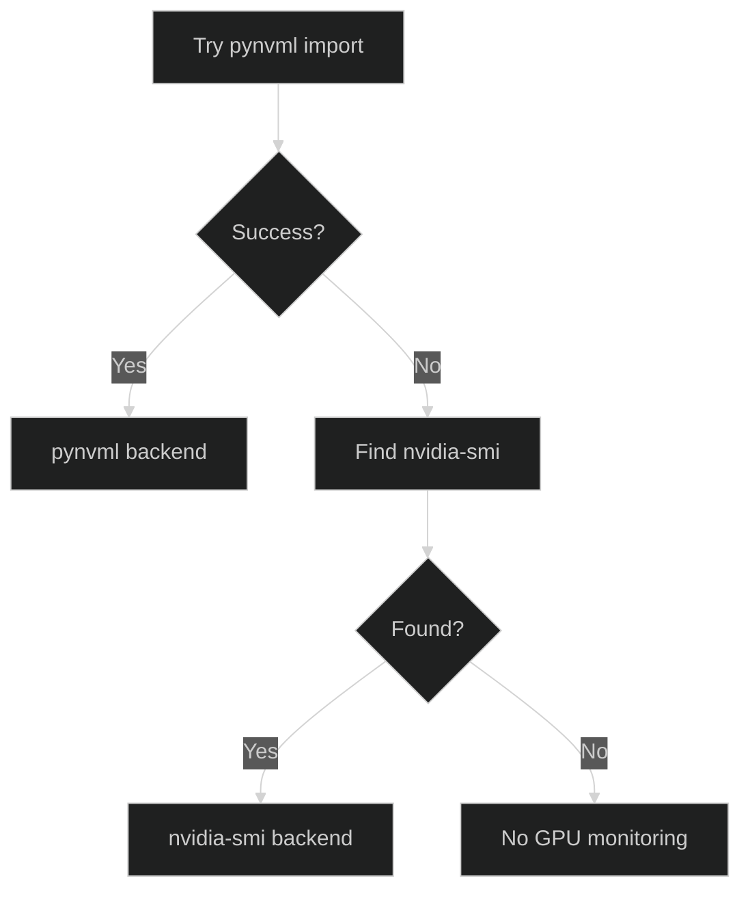
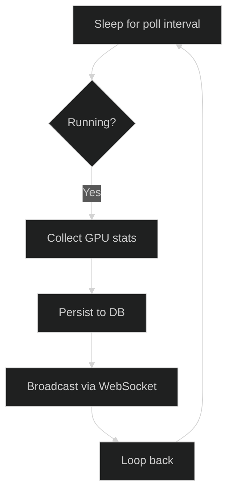

# GPU Monitor Service

The `GPUMonitor` service collects NVIDIA GPU statistics at regular intervals for performance monitoring and capacity planning. It supports both the `pynvml` library and `nvidia-smi` fallback.

**Source File:** `backend/services/gpu_monitor.py`

## Overview

The GPU monitor:

- Polls NVIDIA GPUs at configurable intervals
- Collects temperature, power, memory, and utilization metrics
- Persists stats to the database for historical analysis
- Broadcasts real-time updates via WebSocket
- Falls back to `nvidia-smi` when `pynvml` is unavailable

## Configuration

| Environment Variable        | Default | Description                           |
| --------------------------- | ------- | ------------------------------------- |
| `GPU_POLL_INTERVAL_SECONDS` | 5.0     | Interval between GPU stat collections |

Configuration is loaded via `backend/core/config.py:1070-1076`:

```python
gpu_poll_interval_seconds: float = Field(
    default=5.0,
    gt=0,
    description="Interval for polling GPU stats in seconds"
)
```

## Initialization

The `GPUMonitor` is initialized with an optional broadcaster:

```python
# backend/services/gpu_monitor.py:1096-1120
def __init__(
    self,
    broadcaster: EventBroadcaster | None = None,
    poll_interval: float | None = None,
) -> None:
    settings = get_settings()
    self._poll_interval = poll_interval or settings.gpu_poll_interval_seconds
    self._broadcaster = broadcaster

    self._pynvml_available = False
    self._nvidia_smi_path: str | None = None
    self.running = False
    self._poll_task: asyncio.Task | None = None
    self._nvml_initialized = False

    self._init_gpu_backend()
```

### GPU Backend Selection

The service selects the best available backend (`backend/services/gpu_monitor.py:1122-1145`):



```python
def _init_gpu_backend(self) -> None:
    # Try pynvml first (more efficient)
    try:
        import pynvml
        pynvml.nvmlInit()
        self._pynvml_available = True
        self._nvml_initialized = True
        logger.info("GPU monitoring: Using pynvml backend")
        return
    except (ImportError, pynvml.NVMLError):
        pass

    # Fall back to nvidia-smi
    nvidia_smi_path = shutil.which("nvidia-smi")
    if nvidia_smi_path:
        self._nvidia_smi_path = nvidia_smi_path
        logger.info("GPU monitoring: Using nvidia-smi backend")
    else:
        logger.warning("GPU monitoring: No backend available")
```

## Startup and Shutdown

### Startup

The GPU monitor is started during application lifespan:

```python
# backend/main.py:671-673
gpu_monitor = GPUMonitor(broadcaster=None)
await gpu_monitor.start()
```

The `start()` method (`backend/services/gpu_monitor.py:1147-1160`):

```python
async def start(self) -> None:
    if self.running:
        logger.warning("GPUMonitor already running")
        return

    logger.info("Starting GPUMonitor", extra={"poll_interval": self._poll_interval})
    self.running = True
    self._poll_task = asyncio.create_task(self._poll_loop())
    logger.info("GPUMonitor started successfully")
```

### Shutdown

The shutdown sequence (`backend/services/gpu_monitor.py:1162-1183`):

```python
async def stop(self) -> None:
    if not self.running:
        return

    logger.info("Stopping GPUMonitor")
    self.running = False

    if self._poll_task:
        self._poll_task.cancel()
        with contextlib.suppress(asyncio.CancelledError):
            await self._poll_task
        self._poll_task = None

    # Cleanup pynvml if initialized
    if self._nvml_initialized:
        try:
            import pynvml
            pynvml.nvmlShutdown()
        except Exception:
            pass

    logger.info("GPUMonitor stopped")
```

## Poll Loop

The main poll loop (`backend/services/gpu_monitor.py:1185-1225`):



```python
async def _poll_loop(self) -> None:
    logger.info("GPUMonitor poll loop started")

    while self.running:
        try:
            await asyncio.sleep(self._poll_interval)

            if not self.running:
                break

            gpu_stats = await self._collect_gpu_stats()

            if gpu_stats:
                await self._persist_stats(gpu_stats)
                await self._broadcast_stats(gpu_stats)

        except asyncio.CancelledError:
            logger.info("GPUMonitor poll loop cancelled")
            break
        except Exception as e:
            logger.error(f"Error in GPUMonitor poll loop: {e}", exc_info=True)
            await asyncio.sleep(self._poll_interval)

    logger.info("GPUMonitor poll loop stopped")
```

## Data Collection

### Using pynvml

The `_collect_gpu_stats_pynvml()` method (`backend/services/gpu_monitor.py:1227-1290`) queries NVML:

```python
async def _collect_gpu_stats_pynvml(self) -> list[GPUStatsData]:
    import pynvml

    stats_list = []
    device_count = pynvml.nvmlDeviceGetCount()

    for i in range(device_count):
        handle = pynvml.nvmlDeviceGetHandleByIndex(i)

        # Get device info
        name = pynvml.nvmlDeviceGetName(handle)

        # Get temperature
        temperature = pynvml.nvmlDeviceGetTemperature(
            handle, pynvml.NVML_TEMPERATURE_GPU
        )

        # Get power usage
        power_mw = pynvml.nvmlDeviceGetPowerUsage(handle)
        power_w = power_mw / 1000.0

        # Get memory info
        memory_info = pynvml.nvmlDeviceGetMemoryInfo(handle)
        memory_used_mb = memory_info.used / (1024 * 1024)
        memory_total_mb = memory_info.total / (1024 * 1024)

        # Get utilization
        utilization = pynvml.nvmlDeviceGetUtilizationRates(handle)
        gpu_utilization = utilization.gpu
        memory_utilization = utilization.memory

        stats_list.append(GPUStatsData(
            gpu_index=i,
            gpu_name=name,
            temperature_celsius=temperature,
            power_watts=power_w,
            memory_used_mb=memory_used_mb,
            memory_total_mb=memory_total_mb,
            gpu_utilization_percent=gpu_utilization,
            memory_utilization_percent=memory_utilization,
        ))

    return stats_list
```

### Using nvidia-smi

The `_collect_gpu_stats_nvidia_smi()` method (`backend/services/gpu_monitor.py:1292-1360`) parses CSV output:

```python
async def _collect_gpu_stats_nvidia_smi(self) -> list[GPUStatsData]:
    # Run nvidia-smi with CSV output
    cmd = [
        self._nvidia_smi_path,
        "--query-gpu=index,name,temperature.gpu,power.draw,memory.used,memory.total,utilization.gpu,utilization.memory",
        "--format=csv,noheader,nounits",
    ]

    proc = await asyncio.create_subprocess_exec(
        *cmd,
        stdout=asyncio.subprocess.PIPE,
        stderr=asyncio.subprocess.PIPE,
    )

    stdout, _ = await asyncio.wait_for(proc.communicate(), timeout=5.0)
    output = stdout.decode("utf-8").strip()

    stats_list = []
    for line in output.split("\n"):
        parts = [p.strip() for p in line.split(",")]
        if len(parts) != 8:
            continue

        stats_list.append(GPUStatsData(
            gpu_index=int(parts[0]),
            gpu_name=parts[1],
            temperature_celsius=float(parts[2]),
            power_watts=float(parts[3]),
            memory_used_mb=float(parts[4]),
            memory_total_mb=float(parts[5]),
            gpu_utilization_percent=float(parts[6]),
            memory_utilization_percent=float(parts[7]),
        ))

    return stats_list
```

## Data Persistence

Stats are persisted to the database (`backend/services/gpu_monitor.py:1362-1392`):

```python
async def _persist_stats(self, stats_list: list[GPUStatsData]) -> None:
    async with get_session() as session:
        for stats in stats_list:
            gpu_stats = GPUStats(
                gpu_index=stats.gpu_index,
                gpu_name=stats.gpu_name,
                temperature_celsius=stats.temperature_celsius,
                power_watts=stats.power_watts,
                memory_used_mb=stats.memory_used_mb,
                memory_total_mb=stats.memory_total_mb,
                gpu_utilization_percent=stats.gpu_utilization_percent,
                memory_utilization_percent=stats.memory_utilization_percent,
                recorded_at=datetime.now(UTC),
            )
            session.add(gpu_stats)

        await session.commit()
```

## WebSocket Broadcasting

Real-time stats are broadcast to connected clients (`backend/services/gpu_monitor.py:1394-1420`):

```python
async def _broadcast_stats(self, stats_list: list[GPUStatsData]) -> None:
    if self._broadcaster is None:
        return

    for stats in stats_list:
        await self._broadcaster.broadcast({
            "type": "gpu_stats",
            "data": {
                "gpu_index": stats.gpu_index,
                "gpu_name": stats.gpu_name,
                "temperature_celsius": stats.temperature_celsius,
                "power_watts": stats.power_watts,
                "memory_used_mb": stats.memory_used_mb,
                "memory_total_mb": stats.memory_total_mb,
                "gpu_utilization_percent": stats.gpu_utilization_percent,
                "memory_utilization_percent": stats.memory_utilization_percent,
                "timestamp": datetime.now(UTC).isoformat(),
            },
        })
```

## Metrics Schema

The `GPUStatsData` dataclass (`backend/services/gpu_monitor.py:1062-1093`):

| Field                        | Type    | Description                          |
| ---------------------------- | ------- | ------------------------------------ |
| `gpu_index`                  | `int`   | GPU device index (0, 1, ...)         |
| `gpu_name`                   | `str`   | GPU model name                       |
| `temperature_celsius`        | `float` | GPU temperature in Celsius           |
| `power_watts`                | `float` | Current power draw in watts          |
| `memory_used_mb`             | `float` | Used VRAM in megabytes               |
| `memory_total_mb`            | `float` | Total VRAM in megabytes              |
| `gpu_utilization_percent`    | `float` | GPU compute utilization (0-100)      |
| `memory_utilization_percent` | `float` | Memory bandwidth utilization (0-100) |

## Error Handling

The poll loop includes error handling that continues operation:

```python
except Exception as e:
    logger.error(f"Error in GPUMonitor poll loop: {e}", exc_info=True)
    # Continue polling even after errors
    await asyncio.sleep(self._poll_interval)
```

Specific error handling for NVML:

```python
# backend/services/gpu_monitor.py:1255-1260
except pynvml.NVMLError as e:
    logger.warning(f"NVML error reading GPU {i}: {e}")
    continue
```

## Status API

GPU stats are available via:

- `GET /api/system/gpu-stats` - Current GPU statistics
- `GET /api/system/gpu-stats/history` - Historical GPU statistics
- WebSocket `/ws` - Real-time `gpu_stats` events

## Related Documentation

- [Retention Cleanup](./retention-cleanup.md) - GPU stats retention policy
- [Observability Hub](../observability/README.md) - Metrics dashboards
- [Operations Guide](../../operations/monitoring.md) - GPU monitoring alerts
