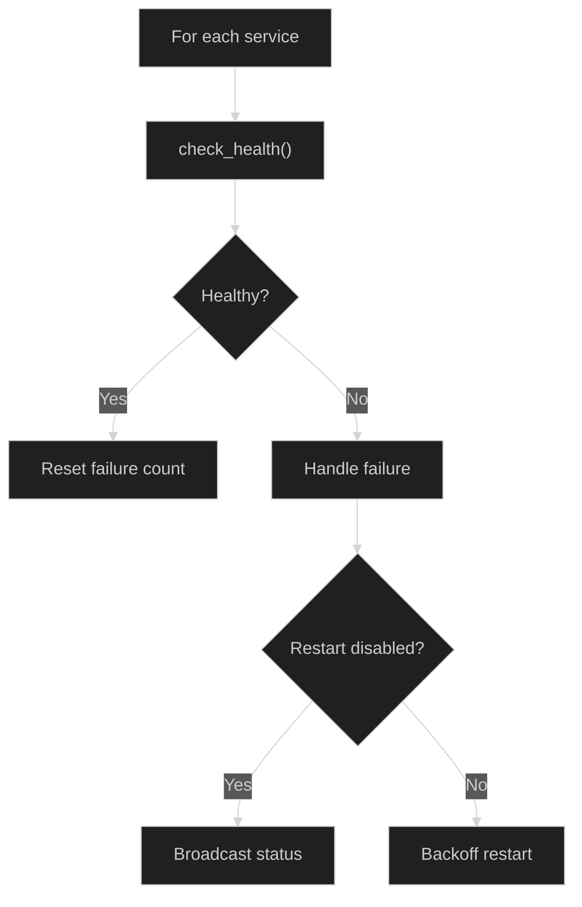
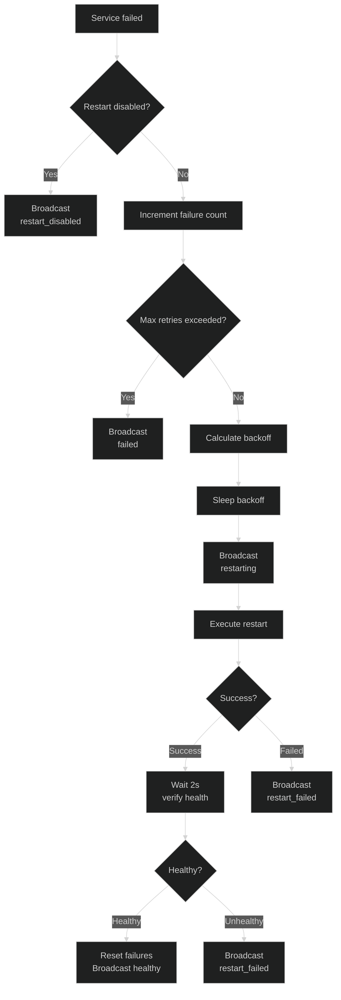

# Service Health Monitor

The `ServiceHealthMonitor` performs periodic health checks on dependent services (Redis, YOLO26, Nemotron) and automatically attempts recovery with exponential backoff when failures are detected.

**Source File:** `backend/services/health_monitor.py`

## Overview

The ServiceHealthMonitor:

- Periodically checks health of all configured services
- Automatically restarts services with exponential backoff on failure
- Configurable max retries before giving up
- Broadcasts service status changes via WebSocket
- Maintains health event history for debugging
- Supports graceful shutdown

## Configuration

The health monitor is configured per-service via `ServiceConfig`:

| Parameter         | Type    | Description                                     |
| ----------------- | ------- | ----------------------------------------------- | -------------------------------------------------- |
| `name`            | `str`   | Service name (e.g., "redis", "yolo26")          |
| `health_endpoint` | `str`   | URL for health check                            |
| `restart_cmd`     | `str    | None`                                           | Command to restart service (None disables restart) |
| `max_retries`     | `int`   | Maximum restart attempts before giving up       |
| `backoff_base`    | `float` | Base delay for exponential backoff (seconds)    |
| `check_interval`  | `float` | Interval between health checks (default: 15.0s) |

## Initialization

The `ServiceHealthMonitor` is initialized with a service manager and list of services to monitor (`backend/services/health_monitor.py:59-89`):

```python
def __init__(
    self,
    manager: ServiceManager,
    services: list[ServiceConfig],
    broadcaster: EventBroadcaster | None = None,
    check_interval: float = 15.0,
    max_events: int = 100,
) -> None:
    self._manager = manager
    self._services = services
    self._broadcaster = broadcaster
    self._check_interval = check_interval
    self._failure_counts: dict[str, int] = {}
    self._running = False
    self._task: asyncio.Task[None] | None = None
    self._health_events: deque[HealthEvent] = deque(maxlen=max_events)
```

## Service Status Values

| Status             | Description                            |
| ------------------ | -------------------------------------- |
| `healthy`          | Service responding normally            |
| `unhealthy`        | Health check failed                    |
| `restarting`       | Restart in progress                    |
| `restart_failed`   | Restart attempt failed                 |
| `restart_disabled` | Service unhealthy but restart disabled |
| `failed`           | Max retries exceeded, giving up        |

## Startup and Shutdown

### Startup

The ServiceHealthMonitor is started during application lifespan (`backend/main.py:750-756`):

```python
service_health_monitor = ServiceHealthMonitor(
    manager=service_manager,
    services=service_configs,
    broadcaster=event_broadcaster,
    check_interval=15.0,
)
await service_health_monitor.start()
```

The `start()` method (`backend/services/health_monitor.py:91-107`):

```python
async def start(self) -> None:
    if self._running:
        logger.warning("ServiceHealthMonitor already running")
        return

    logger.info("Starting ServiceHealthMonitor")
    self._running = True
    self._failure_counts.clear()

    # Start health check loop in background
    self._task = asyncio.create_task(self._health_check_loop())

    logger.info("ServiceHealthMonitor started successfully")
```

### Shutdown

The shutdown sequence (`backend/services/health_monitor.py:109-128`):

```python
async def stop(self) -> None:
    if not self._running:
        return

    logger.info("Stopping ServiceHealthMonitor")
    self._running = False

    if self._task:
        self._task.cancel()
        with contextlib.suppress(asyncio.CancelledError):
            await self._task
        self._task = None

    logger.info("ServiceHealthMonitor stopped")
```

## Health Check Loop

The main monitoring loop (`backend/services/health_monitor.py:130-185`):



```python
async def _health_check_loop(self) -> None:
    while self._running:
        for service in self._services:
            if not self._running:
                break

            try:
                is_healthy = await self._manager.check_health(service)

                if is_healthy:
                    # Service recovered or still healthy
                    if service.name in self._failure_counts and self._failure_counts[service.name] > 0:
                        logger.info(f"Service {service.name} recovered")
                        self._failure_counts[service.name] = 0
                        await self._broadcast_status(service, "healthy", "Service recovered")
                else:
                    # Service is unhealthy
                    await self._broadcast_status(service, "unhealthy", "Health check failed")
                    await self._handle_failure(service)

            except Exception as e:
                logger.error(f"Error checking health of {service.name}: {e}")
                await self._broadcast_status(service, "unhealthy", f"Health check error: {e}")
                await self._handle_failure(service)

        # Wait for next check cycle
        await asyncio.sleep(self._check_interval)
```

## Failure Handling with Exponential Backoff

The `_handle_failure()` method (`backend/services/health_monitor.py:187-287`):

### Exponential Backoff Formula

```
backoff_delay = backoff_base * 2^(failures - 1)
```

Example with `backoff_base=5`:

- Attempt 1: 5 seconds
- Attempt 2: 10 seconds
- Attempt 3: 20 seconds
- Attempt 4: 40 seconds

### Failure Handling Flow



```python
async def _handle_failure(self, service: ServiceConfig) -> None:
    # Check if restart is disabled
    if service.restart_cmd is None:
        logger.warning(f"Service {service.name} is unhealthy but restart is disabled")
        await self._broadcast_status(service, "restart_disabled", ...)
        return

    # Increment failure count
    current_failures = self._failure_counts.get(service.name, 0) + 1
    self._failure_counts[service.name] = current_failures

    # Check if max retries exceeded
    if current_failures > service.max_retries:
        logger.error(f"Service {service.name} exceeded max retries, giving up")
        await self._broadcast_status(service, "failed", ...)
        return

    # Calculate exponential backoff
    backoff_delay = service.backoff_base * (2 ** (current_failures - 1))

    logger.info(
        f"Attempting restart of {service.name} "
        f"(attempt {current_failures}/{service.max_retries}) "
        f"after {backoff_delay}s backoff"
    )

    # Wait for backoff period
    await asyncio.sleep(backoff_delay)

    # Broadcast restarting status
    await self._broadcast_status(service, "restarting", ...)

    # Attempt restart
    restart_success = await self._manager.restart(service)

    if restart_success:
        # Verify health after restart
        await asyncio.sleep(2)
        is_healthy = await self._manager.check_health(service)

        if is_healthy:
            self._failure_counts[service.name] = 0
            await self._broadcast_status(service, "healthy", "Service restarted successfully")
        else:
            await self._broadcast_status(service, "restart_failed", ...)
    else:
        await self._broadcast_status(service, "restart_failed", ...)
```

## Health Event Tracking

The monitor maintains a history of health events (`backend/services/health_monitor.py:27-41`):

```python
@dataclass(slots=True)
class HealthEvent:
    timestamp: datetime
    service: str
    event_type: str  # "failure", "recovery", "restart"
    message: str | None = None
```

Events are stored in a deque with configurable max size (default 100).

### Recording Events

Events are recorded via `_record_event()` (`backend/services/health_monitor.py:289-308`):

```python
def _record_event(
    self,
    service: str,
    event_type: str,
    message: str | None = None,
) -> None:
    event = HealthEvent(
        timestamp=datetime.now(UTC),
        service=service,
        event_type=event_type,
        message=message,
    )
    self._health_events.append(event)
```

### Retrieving Events

```python
def get_recent_events(self, limit: int = 50) -> list[HealthEvent]:
    events = list(self._health_events)
    events.reverse()  # Most recent first
    return events[:limit]
```

## WebSocket Broadcasting

Status changes are broadcast via WebSocket (`backend/services/health_monitor.py:310-368`):

```python
async def _broadcast_status(
    self,
    service: ServiceConfig,
    status: str,
    message: str | None = None,
) -> None:
    if self._broadcaster is None:
        return

    event_data = {
        "type": "service_status",
        "data": {
            "service": service.name,
            "status": status,
            "message": message,
        },
        "timestamp": datetime.now(UTC).isoformat(),
    }

    await self._broadcaster.broadcast_service_status(event_data)
```

## Status API

The current status of all monitored services (`backend/services/health_monitor.py:370-382`):

```python
def get_status(self) -> dict[str, dict[str, int | str]]:
    return {
        service.name: {
            "failure_count": self._failure_counts.get(service.name, 0),
            "max_retries": service.max_retries,
        }
        for service in self._services
    }
```

## Running State

The monitor exposes a running property (`backend/services/health_monitor.py:398-401`):

```python
@property
def is_running(self) -> bool:
    return self._running
```

## Service Configuration Example

```python
# backend/main.py (example configuration)
service_configs = [
    ServiceConfig(
        name="redis",
        health_endpoint="redis://localhost:6379",
        restart_cmd="systemctl restart redis",
        max_retries=5,
        backoff_base=5.0,
    ),
    ServiceConfig(
        name="yolo26",
        health_endpoint="http://localhost:8001/health",
        restart_cmd="docker restart yolo26",
        max_retries=3,
        backoff_base=10.0,
    ),
    ServiceConfig(
        name="nemotron",
        health_endpoint="http://localhost:8002/health",
        restart_cmd=None,  # Restart disabled
        max_retries=3,
        backoff_base=15.0,
    ),
]
```

## Error Handling

The health check loop continues running even after errors (`backend/services/health_monitor.py:177-183`):

```python
except Exception as e:
    logger.error(f"Error in health check loop: {e}", exc_info=True)
    # Continue running even after errors, wait before retrying
    await asyncio.sleep(self._check_interval)
```

## Related Documentation

- [GPU Monitor](./gpu-monitor.md) - GPU health monitoring
- [Pipeline Workers](./README.md) - Worker health status
- [Operations Guide](../../operations/monitoring.md) - Service alerts
