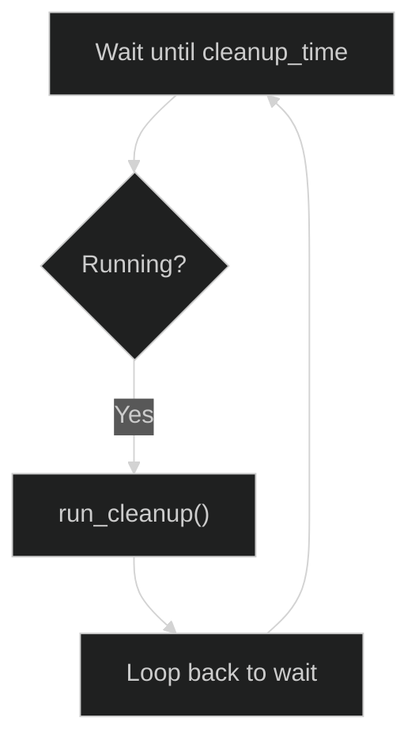

# Data Retention and Cleanup Service

The `CleanupService` automatically enforces data retention policies by deleting old records and files. It runs daily at a configured time to maintain database size and free up disk space.

**Source File:** `backend/services/cleanup_service.py`

## Overview

The cleanup service handles:

- Deleting events older than the retention period
- Cascade deletion of associated detections
- Removing GPU stats older than retention period
- Cleaning up thumbnail files for deleted detections
- Optionally deleting original image files
- Transaction-safe deletions with rollback support

## Configuration

| Environment Variable | Default | Description                   |
| -------------------- | ------- | ----------------------------- |
| `RETENTION_DAYS`     | 30      | Number of days to retain data |
| `LOG_RETENTION_DAYS` | 7       | Number of days to retain logs |

Configuration is loaded via `backend/core/config.py:619-631`:

```python
retention_days: int = Field(
    default=30,
    ge=1,
    description="Number of days to retain data before cleanup"
)

log_retention_days: int = Field(
    default=7,
    ge=1,
    description="Number of days to retain logs"
)
```

## Initialization

The `CleanupService` is initialized with configurable parameters:

```python
# backend/services/cleanup_service.py:113-154
def __init__(
    self,
    cleanup_time: str = "03:00",          # Time to run daily cleanup (HH:MM)
    retention_days: int | None = None,     # Days to retain (default from settings)
    thumbnail_dir: str = "data/thumbnails", # Thumbnail directory
    delete_images: bool = False,           # Delete original images?
    batch_size: int = 1000,                # Records per batch
    redis_client: RedisClient | None = None, # For job tracking
):
```

### Parameters

| Parameter        | Type          | Default               | Description                                |
| ---------------- | ------------- | --------------------- | ------------------------------------------ |
| `cleanup_time`   | `str`         | `"03:00"`             | Time to run daily cleanup (24-hour format) |
| `retention_days` | `int`         | Settings default (30) | Days to retain data                        |
| `thumbnail_dir`  | `str`         | `"data/thumbnails"`   | Directory containing thumbnails            |
| `delete_images`  | `bool`        | `False`               | Whether to delete original image files     |
| `batch_size`     | `int`         | `1000`                | Number of records to process per batch     |
| `redis_client`   | `RedisClient` | `None`                | Redis client for job status tracking       |

## Startup and Shutdown

### Startup

The cleanup service is started during application lifespan:

```python
# backend/main.py:676-678
cleanup_service = CleanupService()
await cleanup_service.start()
```

The `start()` method (`backend/services/cleanup_service.py:579-594`):

1. Checks if already running (idempotent)
2. Sets `running = True`
3. Creates background task for cleanup loop

```python
async def start(self) -> None:
    if self.running:
        logger.warning("CleanupService already running")
        return

    logger.info("Starting CleanupService")
    self.running = True
    self._cleanup_task = asyncio.create_task(self._cleanup_loop())
    logger.info("CleanupService started successfully")
```

### Shutdown

The shutdown sequence (`backend/services/cleanup_service.py:596-615`):

1. Sets `running = False`
2. Cancels the cleanup task
3. Suppresses `CancelledError` during task cleanup

```python
async def stop(self) -> None:
    if not self.running:
        return

    logger.info("Stopping CleanupService")
    self.running = False

    if self._cleanup_task:
        self._cleanup_task.cancel()
        with contextlib.suppress(asyncio.CancelledError):
            await self._cleanup_task

    self._cleanup_task = None
    logger.info("CleanupService stopped")
```

## Cleanup Loop

The main cleanup loop (`backend/services/cleanup_service.py:555-577`) runs continuously:



### Schedule Calculation

The service calculates the next cleanup time (`backend/services/cleanup_service.py:206-222`):

```python
def _calculate_next_cleanup(self) -> datetime:
    hours, minutes = self._parse_cleanup_time()
    now = datetime.now(UTC)

    next_cleanup = now.replace(hour=hours, minute=minutes, second=0, microsecond=0)

    # If time has already passed today, schedule for tomorrow
    if next_cleanup <= now:
        next_cleanup += timedelta(days=1)

    return next_cleanup
```

## Cleanup Operations

The `run_cleanup()` method (`backend/services/cleanup_service.py:233-345`) performs cleanup in this order:

### Step 1: Scan for File Paths

Uses streaming queries to avoid loading all records into memory:

```python
# backend/services/cleanup_service.py:347-374
async def _get_detection_file_paths_streaming(
    self, session: AsyncSession, cutoff_date: datetime
) -> tuple[list[str], list[str]]:
    thumbnail_paths: list[str] = []
    image_paths: list[str] = []

    # Use streaming to avoid loading all detections into memory
    detections_query = select(Detection).where(Detection.detected_at < cutoff_date)

    async for detection in await session.stream_scalars(detections_query):
        if detection.thumbnail_path:
            thumbnail_paths.append(detection.thumbnail_path)
        if self.delete_images and detection.file_path:
            image_paths.append(detection.file_path)

    return thumbnail_paths, image_paths
```

### Step 2: Delete Old Detections

```python
# backend/services/cleanup_service.py:277-282
delete_detections_stmt = delete(Detection).where(
    Detection.detected_at < cutoff_date
)
detections_result = await session.execute(delete_detections_stmt)
stats.detections_deleted = detections_result.rowcount or 0
```

### Step 3: Delete Old Events

```python
# backend/services/cleanup_service.py:288-291
delete_events_stmt = delete(Event).where(Event.started_at < cutoff_date)
events_result = await session.execute(delete_events_stmt)
stats.events_deleted = events_result.rowcount or 0
```

### Step 4: Delete Old GPU Stats

```python
# backend/services/cleanup_service.py:297-300
delete_gpu_stats_stmt = delete(GPUStats).where(GPUStats.recorded_at < cutoff_date)
gpu_stats_result = await session.execute(delete_gpu_stats_stmt)
stats.gpu_stats_deleted = gpu_stats_result.rowcount or 0
```

### Step 5: Delete Old Logs

Uses a separate method with its own session (`backend/services/cleanup_service.py:496-513`):

```python
async def cleanup_old_logs(self) -> int:
    settings = get_settings()
    cutoff = datetime.now(UTC) - timedelta(days=settings.log_retention_days)

    async with get_session() as session:
        result = await session.execute(delete(Log).where(Log.timestamp < cutoff))
        await session.commit()
        deleted = result.rowcount or 0

    if deleted > 0:
        logger.info(f"Cleaned up {deleted} logs older than {settings.log_retention_days} days")

    return deleted
```

### Step 6: Delete Thumbnail Files

```python
# backend/services/cleanup_service.py:316-320
for thumbnail_path in thumbnail_paths:
    if self._delete_file(thumbnail_path):
        stats.thumbnails_deleted += 1

logger.info(f"Deleted {stats.thumbnails_deleted} thumbnail files")
```

### Step 7: Delete Original Images (if enabled)

```python
# backend/services/cleanup_service.py:323-331
if self.delete_images:
    for image_path in image_paths:
        if self._delete_file(image_path):
            stats.images_deleted += 1

    logger.info(f"Deleted {stats.images_deleted} original image files")
```

## Cleanup Statistics

The `CleanupStats` class (`backend/services/cleanup_service.py:64-102`) tracks:

| Metric               | Description                        |
| -------------------- | ---------------------------------- |
| `events_deleted`     | Number of events removed           |
| `detections_deleted` | Number of detections removed       |
| `gpu_stats_deleted`  | Number of GPU stat records removed |
| `logs_deleted`       | Number of log records removed      |
| `thumbnails_deleted` | Number of thumbnail files removed  |
| `images_deleted`     | Number of original images removed  |
| `space_reclaimed`    | Estimated disk space freed (bytes) |

## Dry Run Mode

The `dry_run_cleanup()` method (`backend/services/cleanup_service.py:376-470`) performs the same queries but uses `COUNT` instead of `DELETE`:

```python
async def dry_run_cleanup(self) -> CleanupStats:
    """Calculate what would be deleted without actually deleting."""
    stats = CleanupStats()
    cutoff_date = datetime.now(UTC) - timedelta(days=self.retention_days)

    async with get_session() as session:
        # Count detections
        detections_count_query = (
            select(func.count())
            .select_from(Detection)
            .where(Detection.detected_at < cutoff_date)
        )
        result = await session.execute(detections_count_query)
        stats.detections_deleted = result.scalar_one()

        # ... similar for events and GPU stats ...

    return stats
```

## Job Status Tracking

When a Redis client is provided, cleanup progress is tracked via `JobStatusService`:

```python
# backend/services/cleanup_service.py:250-257
job_service = self._get_job_status_service()
job_id: str | None = None
if job_service is not None:
    job_id = await job_service.start_job(
        job_id=f"cleanup-{datetime.now(UTC).strftime('%Y%m%d-%H%M%S')}",
        job_type="data_cleanup",
        metadata={"retention_days": self.retention_days},
    )
```

Progress updates are sent at each stage (5%, 15%, 30%, 45%, 55%, 70%, 85%):

```python
if job_service is not None and job_id is not None:
    await job_service.update_progress(job_id, 15, "Deleting old detections")
```

## Orphaned File Cleanup

The `OrphanedFileCleanup` class (`backend/services/cleanup_service.py:711-925`) handles files that exist on disk but are not referenced in the database:

### Process

1. Query all referenced files from database
2. Scan storage directories recursively
3. Compare to find orphaned files
4. Optionally delete orphaned files (when `dry_run=False`)

```python
# backend/services/cleanup_service.py:862-919
async def run_cleanup(self, dry_run: bool = True) -> OrphanedFileCleanupStats:
    # Step 1: Get all referenced files from database
    referenced_files = await self._get_referenced_files()

    # Step 2: Scan storage directories
    all_files = self._scan_storage_directories()

    # Step 3: Find orphaned files
    orphaned_files: list[tuple[str, int]] = []
    for file_path, file_size in all_files:
        if file_path not in referenced_files:
            orphaned_files.append((file_path, file_size))

    # Step 4: Delete orphaned files if not dry run
    if not dry_run and orphaned_files:
        deleted_count = self._delete_orphaned_files(orphaned_files)

    return stats
```

## Error Handling

All cleanup operations are wrapped in try/except with:

1. Transaction rollback on database errors
2. Job status marked as failed
3. Detailed error logging

```python
# backend/services/cleanup_service.py:340-345
except Exception as e:
    logger.error(f"Cleanup failed: {e}", exc_info=True)
    if job_service is not None and job_id is not None:
        await job_service.fail_job(job_id, str(e))
    raise
```

## API Endpoints

The cleanup service status is available via:

- `GET /api/system/workers` - Shows cleanup service status
- `GET /api/admin/cleanup/status` - Detailed cleanup statistics

## Related Documentation

- [GPU Monitor](./gpu-monitor.md) - GPU stats being cleaned up
- [Data Model](../data-model/README.md) - Database schema for retained data
- [Operations Guide](../../operations/backup.md) - Backup before cleanup
