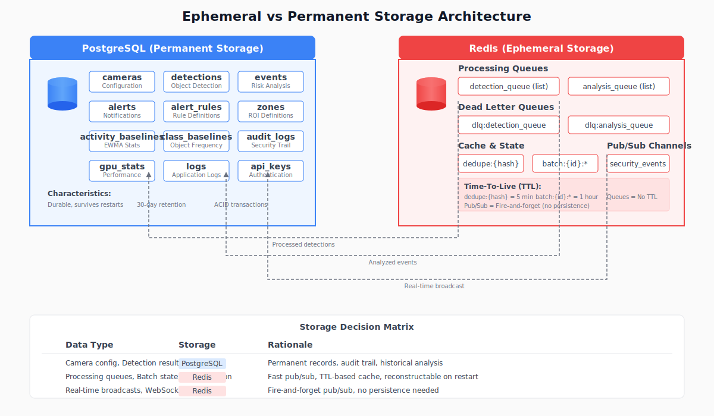
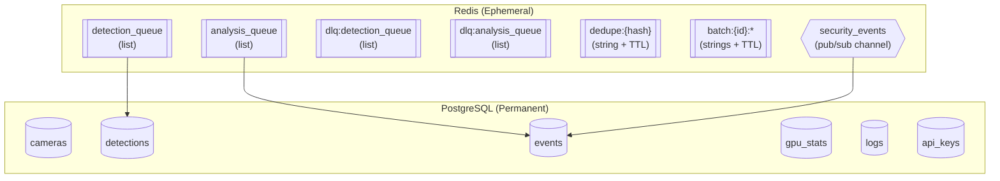
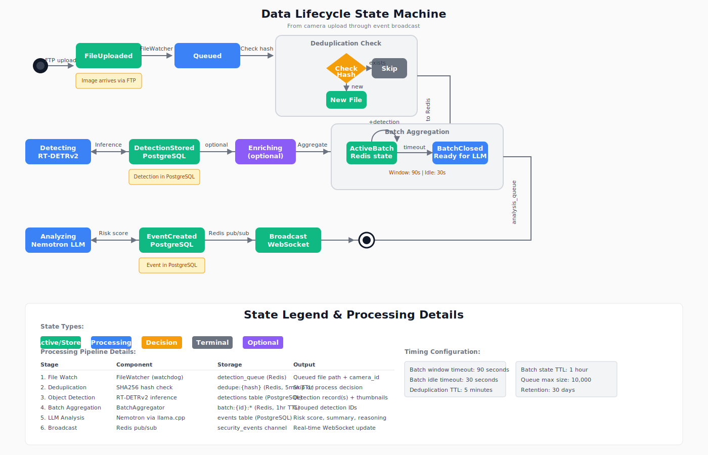
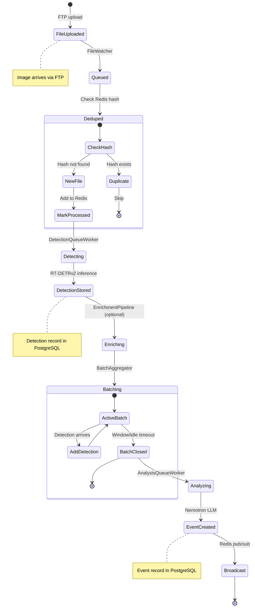
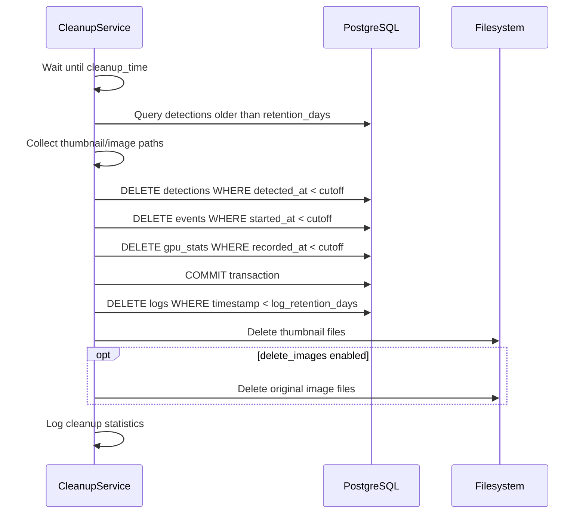

# Data Model Reference

> **Audience:** Future maintainers who need to understand what data is stored, where, and why.

This document describes the complete data model for the Home Security Intelligence system, including PostgreSQL tables, Redis data structures, and the data lifecycle from camera capture to event analysis.

---

## Table of Contents

1. [Storage Overview](#storage-overview)
2. [Entity Relationship Diagram](#entity-relationship-diagram)
3. [PostgreSQL Tables](#postgresql-tables)
   - [cameras](#cameras)
   - [detections](#detections)
   - [events](#events)
   - [gpu_stats](#gpu_stats)
   - [logs](#logs)
   - [api_keys](#api_keys)
   - [alerts](#alerts)
   - [alert_rules](#alert_rules)
   - [zones](#zones)
   - [activity_baselines](#activity_baselines)
   - [class_baselines](#class_baselines)
   - [audit_logs](#audit_logs)
   - [entities](#entities)
   - [prompt_configs](#prompt_configs)
   - [prompt_versions](#prompt_versions)
   - [scene_changes](#scene_changes)
   - [user_calibrations](#user_calibrations)
4. [Key Relationships](#key-relationships)
5. [Ephemeral vs Permanent Storage](#ephemeral-vs-permanent-storage)
6. [Redis Data Structures](#redis-data-structures)
7. [Data Lifecycle](#data-lifecycle)
8. [Indexes and Query Patterns](#indexes-and-query-patterns)
9. [Retention and Cleanup](#retention-and-cleanup)
10. [Image Generation Prompts](#image-generation-prompts)

---

## Entity Relationship Diagram


The three core entities (Camera, Detection, Event) form the backbone of the system's data model. Cameras produce detections, which are grouped into events by the batch aggregator.

---

## Storage Overview

The system uses two complementary storage backends optimized for their respective strengths:

| Storage                    | Technology                     | Purpose                                         | Data Persistence           |
| -------------------------- | ------------------------------ | ----------------------------------------------- | -------------------------- |
| **Primary Database**       | PostgreSQL (async via asyncpg) | Permanent records, historical data, audit trail | Durable, survives restarts |
| **Message Broker / Cache** | Redis                          | Queues, pub/sub, deduplication, batch state     | Ephemeral, reconstructable |

### Design Rationale

- **PostgreSQL:** Chosen for robust concurrent write support required by the AI pipeline's parallel workers. Provides JSONB for flexible metadata storage and proper transaction isolation.
- **Redis:** Provides fast pub/sub for real-time WebSocket updates, reliable queues for pipeline processing, and TTL-based caching for deduplication.

---

## Entity Relationship Diagram


### Diagram: Entity Relationship

```mermaid
erDiagram
    cameras ||--o{ detections : "has many"
    cameras ||--o{ events : "has many"
    cameras ||--o{ zones : "has many"
    cameras ||--o{ activity_baselines : "has many"
    cameras ||--o{ class_baselines : "has many"
    events ||--o{ detections : "groups"
    events ||--o{ alerts : "triggers"
    alert_rules ||--o{ alerts : "generates"

    cameras {
        string id PK "UUID primary key"
        string name "Display name"
        string folder_path "FTP upload path"
        string status "online|offline|error"
        datetime created_at "Creation timestamp"
        datetime last_seen_at "Last activity (nullable)"
    }

    detections {
        int id PK "Auto-increment"
        string camera_id FK "References cameras.id"
        string file_path "Source image path"
        string file_type "MIME type (nullable)"
        datetime detected_at "Detection timestamp"
        string object_type "person|car|etc (nullable)"
        float confidence "0.0-1.0 (nullable)"
        int bbox_x "Bounding box X (nullable)"
        int bbox_y "Bounding box Y (nullable)"
        int bbox_width "Bounding box width (nullable)"
        int bbox_height "Bounding box height (nullable)"
        string thumbnail_path "Generated thumbnail (nullable)"
    }

    events {
        int id PK "Auto-increment"
        string batch_id "Batch grouping ID"
        string camera_id FK "References cameras.id"
        datetime started_at "Event start time"
        datetime ended_at "Event end time (nullable)"
        int risk_score "0-100 (nullable)"
        string risk_level "low|medium|high|critical (nullable)"
        text summary "LLM-generated summary (nullable)"
        text reasoning "LLM reasoning (nullable)"
        text detection_ids "JSON array of detection IDs (nullable)"
        bool reviewed "User reviewed flag"
        text notes "User notes (nullable)"
        bool is_fast_path "Fast path flag"
    }

    alerts {
        uuid id PK "UUID primary key"
        int event_id FK "References events.id"
        uuid rule_id FK "References alert_rules.id (nullable)"
        enum severity "low|medium|high|critical"
        enum status "pending|delivered|acknowledged|dismissed"
        datetime created_at "Creation timestamp"
        datetime updated_at "Last update timestamp"
        datetime delivered_at "Delivery timestamp (nullable)"
        json channels "Notification channels (nullable)"
        string dedup_key "Deduplication key"
        json metadata "Additional metadata (nullable)"
    }

    alert_rules {
        uuid id PK "UUID primary key"
        string name "Rule name"
        text description "Rule description (nullable)"
        bool enabled "Active status"
        enum severity "low|medium|high|critical"
        int risk_threshold "Minimum risk score (nullable)"
        json object_types "Object types to match (nullable)"
        json camera_ids "Camera IDs to apply (nullable)"
        json zone_ids "Zone IDs to match (nullable)"
        float min_confidence "Minimum confidence (nullable)"
        json schedule "Time-based conditions (nullable)"
        json conditions "Legacy conditions (nullable)"
        string dedup_key_template "Dedup key template"
        int cooldown_seconds "Cooldown period"
        json channels "Notification channels (nullable)"
        datetime created_at "Creation timestamp"
        datetime updated_at "Last update timestamp"
    }

    zones {
        string id PK "Zone ID"
        string camera_id FK "References cameras.id"
        string name "Zone name"
        enum zone_type "entry_point|driveway|sidewalk|yard|other"
        json coordinates "Normalized coordinate points"
        enum shape "rectangle|polygon"
        string color "Display color"
        bool enabled "Active status"
        int priority "Zone priority"
        datetime created_at "Creation timestamp"
        datetime updated_at "Last update timestamp"
    }

    activity_baselines {
        int id PK "Auto-increment"
        string camera_id FK "References cameras.id"
        int hour "Hour of day (0-23)"
        int day_of_week "Day of week (0-6)"
        float avg_count "EWMA activity count"
        int sample_count "Number of samples"
        datetime last_updated "Last update timestamp"
    }

    class_baselines {
        int id PK "Auto-increment"
        string camera_id FK "References cameras.id"
        string detection_class "Object class"
        int hour "Hour of day (0-23)"
        float frequency "EWMA frequency"
        int sample_count "Number of samples"
        datetime last_updated "Last update timestamp"
    }

    audit_logs {
        int id PK "Auto-increment"
        datetime timestamp "Log timestamp"
        string action "Auditable action"
        string resource_type "Resource type"
        string resource_id "Resource ID (nullable)"
        string actor "Actor identifier"
        string ip_address "Client IP (nullable)"
        text user_agent "Browser UA (nullable)"
        json details "Additional details (nullable)"
        string status "success|failure"
    }

    gpu_stats {
        int id PK "Auto-increment"
        datetime recorded_at "Sample timestamp"
        string gpu_name "GPU model name (nullable)"
        float gpu_utilization "0-100% (nullable)"
        int memory_used "MB (nullable)"
        int memory_total "MB (nullable)"
        float temperature "Celsius (nullable)"
        float power_usage "Watts (nullable)"
        float inference_fps "Frames per second (nullable)"
    }

    logs {
        int id PK "Auto-increment"
        datetime timestamp "Log timestamp"
        string level "DEBUG|INFO|WARNING|ERROR|CRITICAL"
        string component "Module/service name"
        text message "Log message"
        string camera_id "Associated camera (nullable)"
        int event_id "Associated event (nullable)"
        string request_id "Request correlation (nullable)"
        int detection_id "Associated detection (nullable)"
        int duration_ms "Operation duration (nullable)"
        json extra "Additional context (nullable)"
        string source "backend|frontend"
        text user_agent "Browser UA (nullable)"
    }

    api_keys {
        int id PK "Auto-increment"
        string key_hash UK "SHA256 of API key"
        string name "Key display name"
        datetime created_at "Creation timestamp"
        bool is_active "Active/revoked status"
    }
```



---

## PostgreSQL Tables

### cameras

**Purpose:** Tracks registered security cameras and their configuration.

| Column         | Type     | Nullable | Default    | Description                                 |
| -------------- | -------- | -------- | ---------- | ------------------------------------------- |
| `id`           | STRING   | NO       | -          | Primary key (UUID format)                   |
| `name`         | STRING   | NO       | -          | Human-readable camera name                  |
| `folder_path`  | STRING   | NO       | -          | Filesystem path where FTP uploads arrive    |
| `status`       | STRING   | NO       | `"online"` | Camera status: `online`, `offline`, `error` |
| `created_at`   | DATETIME | NO       | `utcnow()` | When camera was registered                  |
| `last_seen_at` | DATETIME | YES      | NULL       | Last image received timestamp               |

**Relationships:**

- One-to-many with `detections` (cascade delete)
- One-to-many with `events` (cascade delete)

**Usage:**

- Created when a new camera directory is detected or manually registered
- Updated when new images arrive (`last_seen_at`)
- Status changes based on file watcher health monitoring

---

### detections

**Purpose:** Stores individual object detection results from RT-DETRv2.

| Column           | Type     | Nullable | Default    | Description                             |
| ---------------- | -------- | -------- | ---------- | --------------------------------------- |
| `id`             | INTEGER  | NO       | Auto       | Primary key                             |
| `camera_id`      | STRING   | NO       | -          | Foreign key to `cameras.id`             |
| `file_path`      | STRING   | NO       | -          | Full path to source image               |
| `file_type`      | STRING   | YES      | NULL       | MIME type (e.g., `image/jpeg`)          |
| `detected_at`    | DATETIME | NO       | `utcnow()` | When detection was processed            |
| `object_type`    | STRING   | YES      | NULL       | Detected class (person, car, dog, etc.) |
| `confidence`     | FLOAT    | YES      | NULL       | Detection confidence score (0.0-1.0)    |
| `bbox_x`         | INTEGER  | YES      | NULL       | Bounding box top-left X coordinate      |
| `bbox_y`         | INTEGER  | YES      | NULL       | Bounding box top-left Y coordinate      |
| `bbox_width`     | INTEGER  | YES      | NULL       | Bounding box width in pixels            |
| `bbox_height`    | INTEGER  | YES      | NULL       | Bounding box height in pixels           |
| `thumbnail_path` | STRING   | YES      | NULL       | Path to cropped detection thumbnail     |

**Indexes:**

- `idx_detections_camera_id` - Filter by camera
- `idx_detections_detected_at` - Time-range queries
- `idx_detections_camera_time` - Combined camera + time (common query pattern)

**Usage:**

- Created by `DetectionQueueWorker` after RT-DETRv2 inference
- One detection record per detected object (multiple per image possible)
- Linked to events via `batch_id` matching

---

### events

**Purpose:** Aggregated security events analyzed by Nemotron LLM for risk assessment.

| Column          | Type     | Nullable | Default | Description                                        |
| --------------- | -------- | -------- | ------- | -------------------------------------------------- |
| `id`            | INTEGER  | NO       | Auto    | Primary key                                        |
| `batch_id`      | STRING   | NO       | -       | Batch grouping identifier (UUID)                   |
| `camera_id`     | STRING   | NO       | -       | Foreign key to `cameras.id`                        |
| `started_at`    | DATETIME | NO       | -       | First detection timestamp in batch                 |
| `ended_at`      | DATETIME | YES      | NULL    | Last detection timestamp in batch                  |
| `risk_score`    | INTEGER  | YES      | NULL    | LLM-assigned risk score (0-100)                    |
| `risk_level`    | STRING   | YES      | NULL    | Risk category: `low`, `medium`, `high`, `critical` |
| `summary`       | TEXT     | YES      | NULL    | LLM-generated event description                    |
| `reasoning`     | TEXT     | YES      | NULL    | LLM reasoning for risk assessment                  |
| `detection_ids` | TEXT     | YES      | NULL    | JSON array of detection IDs in this event          |
| `reviewed`      | BOOLEAN  | NO       | `False` | Whether user has reviewed the event                |
| `notes`         | TEXT     | YES      | NULL    | User-added notes/annotations                       |
| `is_fast_path`  | BOOLEAN  | NO       | `False` | Whether event bypassed batching                    |

**Indexes:**

- `idx_events_camera_id` - Filter by camera
- `idx_events_started_at` - Time-range queries
- `idx_events_risk_score` - Filter by risk level
- `idx_events_reviewed` - Find unreviewed events
- `idx_events_batch_id` - Lookup by batch

**Usage:**

- Created by `NemotronAnalyzer` after LLM completes risk analysis
- `detection_ids` stored as JSON string for flexibility (avoids junction table)
- Fast path events have `is_fast_path=True` (single high-confidence detection)

---

### gpu_stats

**Purpose:** Time-series GPU performance metrics for monitoring AI inference load.

| Column            | Type        | Nullable | Default    | Description                          |
| ----------------- | ----------- | -------- | ---------- | ------------------------------------ |
| `id`              | INTEGER     | NO       | Auto       | Primary key                          |
| `recorded_at`     | DATETIME    | NO       | `utcnow()` | Sample timestamp                     |
| `gpu_name`        | STRING(255) | YES      | NULL       | GPU model (e.g., "NVIDIA RTX A5500") |
| `gpu_utilization` | FLOAT       | YES      | NULL       | GPU compute utilization (0-100%)     |
| `memory_used`     | INTEGER     | YES      | NULL       | VRAM used in MB                      |
| `memory_total`    | INTEGER     | YES      | NULL       | Total VRAM in MB                     |
| `temperature`     | FLOAT       | YES      | NULL       | GPU temperature in Celsius           |
| `power_usage`     | FLOAT       | YES      | NULL       | Power consumption in Watts           |
| `inference_fps`   | FLOAT       | YES      | NULL       | Inference throughput                 |

**Indexes:**

- `idx_gpu_stats_recorded_at` - Time-series queries

**Usage:**

- Populated by `GPUMonitor` service at configurable intervals (default: 5 seconds)
- Used for dashboard visualization and performance monitoring
- Subject to same retention policy as events/detections

---

### logs

**Purpose:** Structured application logs with rich metadata for debugging and audit.

| Column         | Type        | Nullable | Default      | Description                                  |
| -------------- | ----------- | -------- | ------------ | -------------------------------------------- |
| `id`           | INTEGER     | NO       | Auto         | Primary key                                  |
| `timestamp`    | DATETIME    | NO       | `func.now()` | Log timestamp                                |
| `level`        | STRING(10)  | NO       | -            | Log level: DEBUG/INFO/WARNING/ERROR/CRITICAL |
| `component`    | STRING(50)  | NO       | -            | Module or service name                       |
| `message`      | TEXT        | NO       | -            | Log message text                             |
| `camera_id`    | STRING(100) | YES      | NULL         | Associated camera ID                         |
| `event_id`     | INTEGER     | YES      | NULL         | Associated event ID                          |
| `request_id`   | STRING(36)  | YES      | NULL         | Request correlation ID (UUID)                |
| `detection_id` | INTEGER     | YES      | NULL         | Associated detection ID                      |
| `duration_ms`  | INTEGER     | YES      | NULL         | Operation duration in milliseconds           |
| `extra`        | JSON        | YES      | NULL         | Additional structured context                |
| `source`       | STRING(10)  | NO       | `"backend"`  | Log source: `backend` or `frontend`          |
| `user_agent`   | TEXT        | YES      | NULL         | Browser user agent (frontend logs)           |

**Indexes:**

- `idx_logs_timestamp` - Time-range queries
- `idx_logs_level` - Filter by severity
- `idx_logs_component` - Filter by module
- `idx_logs_camera_id` - Camera-specific logs
- `idx_logs_source` - Separate backend/frontend logs

**Usage:**

- Backend logs written by `DatabaseLogHandler`
- Frontend logs submitted via `POST /api/logs`
- Separate retention period (`log_retention_days`, default: 7 days)

---

### api_keys

**Purpose:** API key management for authentication (optional, disabled by default).

| Column       | Type        | Nullable | Default       | Description                |
| ------------ | ----------- | -------- | ------------- | -------------------------- |
| `id`         | INTEGER     | NO       | Auto          | Primary key                |
| `key_hash`   | STRING(64)  | NO       | -             | SHA256 hash of the API key |
| `name`       | STRING(100) | NO       | -             | Human-readable key name    |
| `created_at` | DATETIME    | NO       | `utcnow(UTC)` | Key creation timestamp     |
| `is_active`  | BOOLEAN     | NO       | `True`        | Active/revoked status      |

**Indexes:**

- Unique index on `key_hash` for fast lookups

**Usage:**

- Keys hashed on startup from `API_KEYS` environment variable
- Authentication disabled by default (`API_KEY_ENABLED=False`)

---

### alerts

**Purpose:** Stores notifications generated from security events based on alert rules.

| Column         | Type         | Nullable | Default    | Description                                                       |
| -------------- | ------------ | -------- | ---------- | ----------------------------------------------------------------- |
| `id`           | UUID         | NO       | uuid4()    | Primary key                                                       |
| `event_id`     | INTEGER      | NO       | -          | Foreign key to `events.id`                                        |
| `rule_id`      | UUID         | YES      | NULL       | Foreign key to `alert_rules.id`                                   |
| `severity`     | ENUM         | NO       | `MEDIUM`   | Alert severity: `low`, `medium`, `high`, `critical`               |
| `status`       | ENUM         | NO       | `PENDING`  | Alert status: `pending`, `delivered`, `acknowledged`, `dismissed` |
| `created_at`   | DATETIME(tz) | NO       | `utcnow()` | When alert was created                                            |
| `updated_at`   | DATETIME(tz) | NO       | `utcnow()` | When alert was last updated                                       |
| `delivered_at` | DATETIME(tz) | YES      | NULL       | When alert was delivered                                          |
| `channels`     | JSON         | YES      | NULL       | Notification channels used                                        |
| `dedup_key`    | STRING(255)  | NO       | -          | Deduplication key for preventing duplicates                       |
| `metadata`     | JSON         | YES      | NULL       | Additional alert context                                          |

**Indexes:**

- `idx_alerts_event_id` - Filter by event
- `idx_alerts_rule_id` - Filter by rule
- `idx_alerts_severity` - Filter by severity
- `idx_alerts_status` - Filter by status
- `idx_alerts_created_at` - Time-range queries
- `idx_alerts_dedup_key` - Deduplication lookups
- `idx_alerts_dedup_key_created_at` - Combined dedup + time queries

**Usage:**

- Created by `AlertEngine` when events match alert rule conditions
- Tracks delivery status across notification channels
- Supports deduplication via `dedup_key` within cooldown windows

---

### alert_rules

**Purpose:** Defines conditions for generating alerts from security events.

| Column               | Type         | Nullable | Default                 | Description                                |
| -------------------- | ------------ | -------- | ----------------------- | ------------------------------------------ |
| `id`                 | UUID         | NO       | uuid4()                 | Primary key                                |
| `name`               | STRING(255)  | NO       | -                       | Human-readable rule name                   |
| `description`        | TEXT         | YES      | NULL                    | Rule description                           |
| `enabled`            | BOOLEAN      | NO       | `True`                  | Whether rule is active                     |
| `severity`           | ENUM         | NO       | `MEDIUM`                | Severity for triggered alerts              |
| `risk_threshold`     | INTEGER      | YES      | NULL                    | Minimum risk score (0-100)                 |
| `object_types`       | JSON         | YES      | NULL                    | Object types to match (e.g., `["person"]`) |
| `camera_ids`         | JSON         | YES      | NULL                    | Camera IDs to apply to (empty = all)       |
| `zone_ids`           | JSON         | YES      | NULL                    | Zone IDs to match (empty = any)            |
| `min_confidence`     | FLOAT        | YES      | NULL                    | Minimum detection confidence (0.0-1.0)     |
| `schedule`           | JSON         | YES      | NULL                    | Time-based conditions                      |
| `conditions`         | JSON         | YES      | NULL                    | Legacy conditions (backward compatibility) |
| `dedup_key_template` | STRING(255)  | NO       | `{camera_id}:{rule_id}` | Template for generating dedup keys         |
| `cooldown_seconds`   | INTEGER      | NO       | `300`                   | Cooldown period (default: 5 minutes)       |
| `channels`           | JSON         | YES      | NULL                    | Notification channels to use               |
| `created_at`         | DATETIME(tz) | NO       | `utcnow()`              | When rule was created                      |
| `updated_at`         | DATETIME(tz) | NO       | `utcnow()`              | When rule was last updated                 |

**Indexes:**

- `idx_alert_rules_name` - Search by name
- `idx_alert_rules_enabled` - Filter active rules
- `idx_alert_rules_severity` - Filter by severity

**Usage:**

- All conditions in a rule must match (AND logic)
- Multiple rules can trigger for the same event
- Higher severity rule takes precedence for same event
- Cooldown prevents duplicate alerts within the specified window

---

### zones

**Purpose:** Defines regions of interest on camera views for detection context.

| Column        | Type         | Nullable | Default     | Description                                                       |
| ------------- | ------------ | -------- | ----------- | ----------------------------------------------------------------- |
| `id`          | STRING       | NO       | -           | Primary key (user-defined ID)                                     |
| `camera_id`   | STRING       | NO       | -           | Foreign key to `cameras.id`                                       |
| `name`        | STRING(255)  | NO       | -           | Human-readable zone name                                          |
| `zone_type`   | ENUM         | NO       | `OTHER`     | Zone type: `entry_point`, `driveway`, `sidewalk`, `yard`, `other` |
| `coordinates` | JSONB        | NO       | -           | Normalized coordinates (0-1 range) as `[[x,y],...]`               |
| `shape`       | ENUM         | NO       | `RECTANGLE` | Zone shape: `rectangle`, `polygon`                                |
| `color`       | STRING(7)    | NO       | `#3B82F6`   | Display color (hex)                                               |
| `enabled`     | BOOLEAN      | NO       | `True`      | Whether zone is active                                            |
| `priority`    | INTEGER      | NO       | `0`         | Zone priority for overlapping zones                               |
| `created_at`  | DATETIME(tz) | NO       | `utcnow()`  | When zone was created                                             |
| `updated_at`  | DATETIME(tz) | NO       | `utcnow()`  | When zone was last updated                                        |

**Indexes:**

- `idx_zones_camera_id` - Filter by camera
- `idx_zones_enabled` - Filter active zones
- `idx_zones_camera_enabled` - Combined camera + enabled filter

**Usage:**

- Coordinates are normalized (0-1) relative to image dimensions
- Zone type provides semantic context (e.g., driveway vs sidewalk)
- Used by `ZoneService` to determine which detections fall within zones
- Zone context can influence risk assessment

---

### activity_baselines

**Purpose:** Tracks baseline activity rates per camera for anomaly detection.

| Column         | Type         | Nullable | Default    | Description                                       |
| -------------- | ------------ | -------- | ---------- | ------------------------------------------------- |
| `id`           | INTEGER      | NO       | Auto       | Primary key                                       |
| `camera_id`    | STRING       | NO       | -          | Foreign key to `cameras.id`                       |
| `hour`         | INTEGER      | NO       | -          | Hour of day (0-23)                                |
| `day_of_week`  | INTEGER      | NO       | -          | Day of week (0=Monday, 6=Sunday)                  |
| `avg_count`    | FLOAT        | NO       | `0.0`      | Exponentially weighted moving average of activity |
| `sample_count` | INTEGER      | NO       | `0`        | Number of samples used                            |
| `last_updated` | DATETIME(tz) | NO       | `utcnow()` | When baseline was last updated                    |

**Constraints:**

- Unique constraint on `(camera_id, hour, day_of_week)`

**Indexes:**

- `idx_activity_baseline_camera` - Filter by camera
- `idx_activity_baseline_slot` - Combined camera + hour + day lookup

**Usage:**

- Tracks typical activity levels by time slot (168 slots per camera)
- Uses exponential decay for seasonal drift handling
- Used by `BaselineService` to detect unusual activity patterns

---

### class_baselines

**Purpose:** Tracks frequency of specific object classes per camera for anomaly detection.

| Column            | Type         | Nullable | Default    | Description                                        |
| ----------------- | ------------ | -------- | ---------- | -------------------------------------------------- |
| `id`              | INTEGER      | NO       | Auto       | Primary key                                        |
| `camera_id`       | STRING       | NO       | -          | Foreign key to `cameras.id`                        |
| `detection_class` | STRING       | NO       | -          | Object class (e.g., "person", "vehicle")           |
| `hour`            | INTEGER      | NO       | -          | Hour of day (0-23)                                 |
| `frequency`       | FLOAT        | NO       | `0.0`      | Exponentially weighted moving average of frequency |
| `sample_count`    | INTEGER      | NO       | `0`        | Number of samples used                             |
| `last_updated`    | DATETIME(tz) | NO       | `utcnow()` | When baseline was last updated                     |

**Constraints:**

- Unique constraint on `(camera_id, detection_class, hour)`

**Indexes:**

- `idx_class_baseline_camera` - Filter by camera
- `idx_class_baseline_class` - Combined camera + class lookup
- `idx_class_baseline_slot` - Combined camera + class + hour lookup

**Usage:**

- Tracks how often specific objects appear by hour (e.g., "vehicles rare after midnight")
- Uses exponential decay for seasonal drift handling
- Used by `BaselineService` to detect unusual object patterns

---

### audit_logs

**Purpose:** Records security-sensitive operations for compliance and debugging.

| Column          | Type         | Nullable | Default    | Description                                          |
| --------------- | ------------ | -------- | ---------- | ---------------------------------------------------- |
| `id`            | INTEGER      | NO       | Auto       | Primary key                                          |
| `timestamp`     | DATETIME(tz) | NO       | `utcnow()` | When action occurred                                 |
| `action`        | STRING(50)   | NO       | -          | Action type (e.g., `event_reviewed`, `rule_created`) |
| `resource_type` | STRING(50)   | NO       | -          | Type of resource affected                            |
| `resource_id`   | STRING(255)  | YES      | NULL       | ID of affected resource                              |
| `actor`         | STRING(100)  | NO       | -          | Who performed the action                             |
| `ip_address`    | STRING(45)   | YES      | NULL       | Client IP address                                    |
| `user_agent`    | TEXT         | YES      | NULL       | Browser user agent                                   |
| `details`       | JSONB        | YES      | NULL       | Additional structured context                        |
| `status`        | STRING(20)   | NO       | `success`  | Action status: `success`, `failure`                  |

**Indexes:**

- `idx_audit_logs_timestamp` - Time-range queries
- `idx_audit_logs_action` - Filter by action type
- `idx_audit_logs_resource_type` - Filter by resource type
- `idx_audit_logs_actor` - Filter by actor
- `idx_audit_logs_status` - Filter by status
- `idx_audit_logs_resource` - Combined resource type + ID lookup

**Usage:**

- Records all security-sensitive operations (login, settings changes, rule modifications)
- Supports audit trail requirements for compliance
- Subject to same retention policy as other logs

---

### entities

**Purpose:** Tracks unique persons/objects for re-identification across cameras.

| Column                 | Type         | Nullable | Default    | Description                                             |
| ---------------------- | ------------ | -------- | ---------- | ------------------------------------------------------- |
| `id`                   | UUID         | NO       | uuid4()    | Primary key                                             |
| `entity_type`          | STRING(20)   | NO       | `person`   | Type: `person`, `vehicle`, `animal`, `package`, `other` |
| `trust_status`         | STRING(20)   | NO       | `unknown`  | Status: `trusted`, `untrusted`, `unknown`               |
| `embedding_vector`     | JSONB        | YES      | NULL       | Feature vector for re-identification                    |
| `first_seen_at`        | DATETIME(tz) | NO       | `utcnow()` | Timestamp of first detection                            |
| `last_seen_at`         | DATETIME(tz) | NO       | `utcnow()` | Timestamp of most recent detection                      |
| `detection_count`      | INTEGER      | NO       | `0`        | Total number of detections linked to this entity        |
| `entity_metadata`      | JSONB        | YES      | NULL       | Flexible metadata (clothing color, vehicle make/model)  |
| `primary_detection_id` | INTEGER      | YES      | NULL       | Reference to primary/best detection (no FK constraint)  |

**Indexes:**

- `idx_entities_entity_type` - Filter by type
- `idx_entities_trust_status` - Filter by trust level
- `idx_entities_first_seen_at` - Time-range queries
- `idx_entities_last_seen_at` - Recent activity queries
- `idx_entities_type_last_seen` - Composite type + time filter
- `ix_entities_entity_metadata_gin` - GIN index for JSONB queries

**Usage:**

- Created when a new unique individual/object is detected
- Uses embedding vectors for re-identification matching
- Trust status affects alert handling (trusted entities may skip alerts)

---

### prompt_configs

**Purpose:** Stores current prompt configurations for AI models.

| Column          | Type         | Nullable | Default    | Description                             |
| --------------- | ------------ | -------- | ---------- | --------------------------------------- |
| `id`            | INTEGER      | NO       | Auto       | Primary key                             |
| `model`         | STRING(50)   | NO       | -          | Model name (nemotron, florence-2, etc.) |
| `system_prompt` | TEXT         | NO       | -          | Full system prompt text                 |
| `temperature`   | FLOAT        | NO       | `0.7`      | LLM temperature (0-2)                   |
| `max_tokens`    | INTEGER      | NO       | `2048`     | Maximum tokens in response (100-8192)   |
| `version`       | INTEGER      | NO       | `1`        | Auto-incrementing version number        |
| `created_at`    | DATETIME(tz) | NO       | `utcnow()` | Creation timestamp                      |
| `updated_at`    | DATETIME(tz) | NO       | `utcnow()` | Last update timestamp                   |

**Indexes:**

- `idx_prompt_configs_model` - Unique index on model
- `idx_prompt_configs_updated_at` - Time-range queries

**Usage:**

- Stores active prompt configuration per model
- Version increments on each update for tracking

---

### prompt_versions

**Purpose:** Version tracking for AI model prompt configurations with rollback support.

| Column               | Type         | Nullable | Default    | Description                               |
| -------------------- | ------------ | -------- | ---------- | ----------------------------------------- |
| `id`                 | INTEGER      | NO       | Auto       | Primary key                               |
| `model`              | ENUM         | NO       | -          | AI model enum (nemotron, florence2, etc.) |
| `version`            | INTEGER      | NO       | -          | Version number                            |
| `created_at`         | DATETIME(tz) | NO       | `utcnow()` | Creation timestamp                        |
| `created_by`         | STRING(255)  | YES      | NULL       | User who created the version              |
| `config_json`        | TEXT         | NO       | -          | Configuration content (JSON)              |
| `change_description` | TEXT         | YES      | NULL       | Description of changes                    |
| `is_active`          | BOOLEAN      | NO       | `false`    | Whether this is the active version        |
| `row_version`        | INTEGER      | NO       | `1`        | Optimistic locking counter                |

**Indexes:**

- `idx_prompt_versions_model` - Filter by model
- `idx_prompt_versions_model_version` - Combined model + version
- `idx_prompt_versions_model_active` - Combined model + active status
- `idx_prompt_versions_created_at` - Time-range queries

**Constraints:**

- Unique constraint on `(model, version)`

**Usage:**

- Stores historical versions for rollback capability
- Uses optimistic locking to prevent race conditions

---

### scene_changes

**Purpose:** Records detected scene changes for camera tamper detection.

| Column        | Type         | Nullable | Default    | Description                                 |
| ------------- | ------------ | -------- | ---------- | ------------------------------------------- |
| `id`          | INTEGER      | NO       | Auto       | Primary key                                 |
| `camera_id`   | STRING       | NO       | -          | Foreign key to `cameras.id`                 |
| `change_type` | STRING       | NO       | -          | Type: `lighting`, `obstruction`, `movement` |
| `severity`    | STRING       | NO       | -          | Severity level                              |
| `detected_at` | DATETIME(tz) | NO       | `utcnow()` | When change was detected                    |
| `resolved_at` | DATETIME(tz) | YES      | NULL       | When change was resolved                    |
| `details`     | JSONB        | YES      | NULL       | Additional context                          |

**Usage:**

- Created when scene monitoring detects significant changes
- Used for camera tamper detection and maintenance alerts

---

### user_calibrations

**Purpose:** Stores user-provided calibration data for camera zones.

| Column             | Type         | Nullable | Default    | Description                 |
| ------------------ | ------------ | -------- | ---------- | --------------------------- |
| `id`               | INTEGER      | NO       | Auto       | Primary key                 |
| `camera_id`        | STRING       | NO       | -          | Foreign key to `cameras.id` |
| `calibration_type` | STRING       | NO       | -          | Type of calibration         |
| `calibration_data` | JSONB        | NO       | -          | Calibration parameters      |
| `created_at`       | DATETIME(tz) | NO       | `utcnow()` | Creation timestamp          |
| `updated_at`       | DATETIME(tz) | NO       | `utcnow()` | Last update timestamp       |

**Usage:**

- Stores user-defined calibration for camera perspectives
- Used for zone detection and distance estimation

---

## Key Relationships

### Detection to Event Association

Detections are grouped into events through the batch aggregation process:

```
Detection 1 ─┐
Detection 2 ─┼── Batch "abc123" ── Event (risk_score=75)
Detection 3 ─┘
```

- **Batch ID:** Shared identifier linking detections to their event
- **Detection IDs:** Stored as JSON array in `events.detection_ids` field
- **No Foreign Key:** Intentional design choice for flexibility (soft link via batch_id)

### Camera as Parent Entity

```
Camera (front_door)
  ├── Detection 1
  ├── Detection 2
  ├── Detection 3
  ├── Event 1 (groups Detection 1, 2)
  └── Event 2 (groups Detection 3)
```

- Camera deletion cascades to all detections and events
- Ensures data integrity and simplifies cleanup

---

## Ephemeral vs Permanent Storage



### Diagram: Storage Architecture



### What Goes Where

| Data Type            | Storage    | Rationale                        |
| -------------------- | ---------- | -------------------------------- |
| Camera config        | PostgreSQL | Permanent configuration          |
| Detection results    | PostgreSQL | Historical record, audit trail   |
| Events + risk scores | PostgreSQL | Primary business data            |
| GPU metrics          | PostgreSQL | Performance history              |
| Logs                 | PostgreSQL | Debugging, compliance            |
| Processing queues    | Redis      | Fast pub/sub, rebuilt on restart |
| Batch state          | Redis      | Short-lived, TTL-protected       |
| Deduplication        | Redis      | TTL-based cache (5 min default)  |
| Real-time broadcasts | Redis      | Fire-and-forget pub/sub          |

---

## Redis Data Structures

### Processing Queues

```

detection_queue (Redis List)
├── RPUSH: FileWatcher adds new images
├── BLPOP: DetectionQueueWorker consumes
└── Max size: 10,000 (auto-trimmed)

analysis_queue (Redis List)
├── RPUSH: BatchAggregator adds completed batches
├── BLPOP: AnalysisQueueWorker consumes
└── Max size: 10,000 (auto-trimmed)

```

**Queue Item Schema (detection_queue):**

```json
{
  "camera_id": "front_door",
  "file_path": "/export/foscam/front_door/image_001.jpg",
  "timestamp": "2025-12-23T10:30:00.000000"
}
```

**Queue Item Schema (analysis_queue):**

```json
{
  "batch_id": "abc123-def456",
  "camera_id": "front_door",
  "detection_ids": [1, 2, 3]
}
```

### Dead Letter Queues

```
dlq:detection_queue (Redis List)
├── Failed detection jobs after max retries
└── Manual requeue via API

dlq:analysis_queue (Redis List)
├── Failed LLM analysis jobs
└── Manual requeue via API
```

**DLQ Item Schema:**

```json
{
  "original_job": {
    /* original queue item */
  },
  "error": "Connection refused: detector service unavailable",
  "attempt_count": 3,
  "first_failed_at": "2025-12-23T10:30:05.000000",
  "last_failed_at": "2025-12-23T10:30:15.000000",
  "queue_name": "detection_queue"
}
```

### Batch Aggregation State

```
batch:{camera_id}:current   -> current batch ID (string, 1h TTL)
batch:{batch_id}:camera_id  -> camera ID (string, 1h TTL)
batch:{batch_id}:detections -> JSON list of detection IDs (string, 1h TTL)
batch:{batch_id}:started_at -> timestamp as float (string, 1h TTL)
batch:{batch_id}:last_activity -> timestamp as float (string, 1h TTL)
```

### Deduplication Cache

```
dedupe:{sha256_hash} -> file_path (string, 5 min TTL default)
```

- Prevents duplicate processing of same image content
- TTL configurable via `DEDUPE_TTL_SECONDS`
- Key is SHA256 hash of file content

### Pub/Sub Channel

```
security_events (channel)
├── Event broadcasts on analysis completion
└── WebSocket clients subscribe via backend relay

system_status (channel)
├── Periodic system status/health broadcasts
└── WebSocket clients subscribe via backend relay
```

**Message Schema:**

```json
{
  "type": "event",
  "data": {
    "id": 1,
    "event_id": 1,
    "batch_id": "abc123",
    "camera_id": "front_door",
    "risk_score": 75,
    "risk_level": "high",
    "summary": "Person detected at front door",
    "started_at": "2025-12-23T12:00:00"
  }
}
```

---

## Data Lifecycle

### State Diagram



### Diagram: Data Lifecycle State Machine



### Record Creation Flow

1. **Image Arrival:**

   - Foscam camera uploads via FTP to `/export/foscam/{camera_name}/`
   - FileWatcher detects new file via watchdog

2. **Deduplication:**

   - SHA256 hash computed for file content
   - Redis checked for existing `dedupe:{hash}` key
   - If duplicate, file is skipped
   - If new, hash added to Redis with TTL

3. **Detection Queue:**

   - File path + camera ID pushed to `detection_queue`
   - DetectionQueueWorker pops from queue (BLPOP)

4. **Object Detection:**

   - Image sent to RT-DETRv2 service
   - Results filtered by confidence threshold
   - Detection record(s) created in PostgreSQL
   - Thumbnail generated and stored

5. **Optional Enrichment (Best-Effort):**

   - If enabled, detections can be enriched with additional attributes/entities
   - This stage may use backend-side model-zoo enrichers and/or optional AI services
   - Failures should not block detection storage or event analysis

6. **Batch Aggregation:**

   - Detection added to camera's active batch
   - Batch state tracked in Redis keys
   - Batch closed on window timeout (90s) or idle timeout (30s)
   - Completed batch pushed to `analysis_queue`

7. **LLM Analysis:**

   - AnalysisQueueWorker pops batch from queue
   - Detection data sent to Nemotron LLM
   - Risk score, level, summary generated
   - Event record created in PostgreSQL

8. **Real-time Broadcast:**
   - Event published to `security_events` channel
   - WebSocket clients receive update
   - Dashboard updates in real-time

### Record Update Patterns

| Entity    | Update Triggers      | Fields Updated                  |
| --------- | -------------------- | ------------------------------- |
| Camera    | New detection        | `last_seen_at`                  |
| Camera    | Manual status change | `status`                        |
| Event     | User review          | `reviewed`, `notes`             |
| Event     | Never                | Risk analysis is immutable      |
| Detection | Never                | Detection results are immutable |

### Retention Policy

Data is automatically cleaned up based on age:

| Data Type       | Retention Period      | Configuration         |
| --------------- | --------------------- | --------------------- |
| Events          | 30 days               | `RETENTION_DAYS`      |
| Detections      | 30 days               | `RETENTION_DAYS`      |
| GPU Stats       | 30 days               | `RETENTION_DAYS`      |
| Logs            | 7 days                | `LOG_RETENTION_DAYS`  |
| Thumbnails      | With parent detection | Cascade delete        |
| Original images | Never (by default)    | `delete_images=False` |

---

## Indexes and Query Patterns

### Common Query Patterns

| Query                        | Tables     | Indexes Used                                    |
| ---------------------------- | ---------- | ----------------------------------------------- |
| Events by camera (last 24h)  | events     | `idx_events_camera_id`, `idx_events_started_at` |
| Unreviewed high-risk events  | events     | `idx_events_reviewed`, `idx_events_risk_score`  |
| Detection timeline for event | detections | `idx_detections_camera_time`                    |
| GPU stats history            | gpu_stats  | `idx_gpu_stats_recorded_at`                     |
| Error logs (today)           | logs       | `idx_logs_level`, `idx_logs_timestamp`          |

### Index Summary

```sql
-- cameras (no additional indexes, small table)

-- detections
CREATE INDEX idx_detections_camera_id ON detections(camera_id);
CREATE INDEX idx_detections_detected_at ON detections(detected_at);
CREATE INDEX idx_detections_camera_time ON detections(camera_id, detected_at);

-- events
CREATE INDEX idx_events_camera_id ON events(camera_id);
CREATE INDEX idx_events_started_at ON events(started_at);
CREATE INDEX idx_events_risk_score ON events(risk_score);
CREATE INDEX idx_events_reviewed ON events(reviewed);
CREATE INDEX idx_events_batch_id ON events(batch_id);

-- gpu_stats
CREATE INDEX idx_gpu_stats_recorded_at ON gpu_stats(recorded_at);

-- logs
CREATE INDEX idx_logs_timestamp ON logs(timestamp);
CREATE INDEX idx_logs_level ON logs(level);
CREATE INDEX idx_logs_component ON logs(component);
CREATE INDEX idx_logs_camera_id ON logs(camera_id);
CREATE INDEX idx_logs_source ON logs(source);

-- api_keys
CREATE UNIQUE INDEX ix_api_keys_key_hash ON api_keys(key_hash);
```

### PostgreSQL Configuration

The system uses these PostgreSQL settings for performance and reliability:

- **Connection pooling:** SQLAlchemy async pool with configurable size
- **Transaction isolation:** READ COMMITTED (default)
- **Statement timeout:** Configurable via connection string
- **Foreign keys:** Enforced by default in PostgreSQL

---

## Retention and Cleanup

### CleanupService Operation

The `CleanupService` runs daily at a configurable time (default: 03:00 AM):


### Diagram: Cleanup Service Sequence



### Cleanup Statistics

After each run, the service logs:

- `events_deleted`: Events removed
- `detections_deleted`: Detections removed
- `gpu_stats_deleted`: GPU stat records removed
- `logs_deleted`: Log entries removed
- `thumbnails_deleted`: Thumbnail files removed
- `images_deleted`: Original images removed (if enabled)
- `space_reclaimed`: Estimated bytes freed

### Dry Run Mode

The cleanup API supports a dry-run mode (`GET /api/system/cleanup?dry_run=true`) that returns counts without actually deleting:

```json
{
  "events_deleted": 15,
  "detections_deleted": 89,
  "gpu_stats_deleted": 2880,
  "logs_deleted": 150,
  "thumbnails_deleted": 89,
  "images_deleted": 0,
  "space_reclaimed": 524288000,
  "retention_days": 30,
  "dry_run": true,
  "timestamp": "2025-12-27T10:30:00Z"
}
```

---

## Image Generation Prompts

### ERD Diagram Prompt

```
Create a professional database entity-relationship diagram (ERD) for a home security
monitoring system.

Style: Clean, technical documentation style with a white background. Use crow's foot
notation for relationships. Include primary key (PK), foreign key (FK), and unique (UK)
indicators.

Entities to include:
1. cameras (id PK, name, folder_path, status, created_at, last_seen_at)
2. detections (id PK, camera_id FK, file_path, file_type, detected_at, object_type,
   confidence, bbox_x, bbox_y, bbox_width, bbox_height, thumbnail_path)
3. events (id PK, batch_id, camera_id FK, started_at, ended_at, risk_score, risk_level,
   summary, reasoning, detection_ids, reviewed, notes, is_fast_path)
4. gpu_stats (id PK, recorded_at, gpu_name, gpu_utilization, memory_used, memory_total,
   temperature, power_usage, inference_fps)
5. logs (id PK, timestamp, level, component, message, camera_id, event_id, request_id,
   detection_id, duration_ms, extra, source, user_agent)
6. api_keys (id PK, key_hash UK, name, created_at, is_active)

Relationships:
- cameras 1:N detections (cascade delete)
- cameras 1:N events (cascade delete)
- events contains detection_ids as JSON array (soft relationship, shown with dotted line)

Color scheme: Blue headers for tables, white cells, gray borders.
Font: Sans-serif, readable at small sizes.
Dimensions: 1600x1200 pixels, high resolution for documentation.
```

### Data Flow Diagram Prompt

```
Create a technical data flow diagram showing the dual-storage architecture of a home
security AI system.

Style: Modern, clean diagram with clear separation between permanent (PostgreSQL) and
ephemeral (Redis) storage. Use rounded rectangles for processes, cylinders for
databases, and parallelograms for queues.

Components to show:

Left side (Data Sources):
- Camera icon labeled "Foscam FTP Upload"
- Arrow to FileWatcher process

Center (Processing Pipeline):
- FileWatcher -> detection_queue (Redis)
- DetectionQueueWorker -> detections table (PostgreSQL)
- BatchAggregator with batch state (Redis)
- analysis_queue (Redis)
- AnalysisQueueWorker -> events table (PostgreSQL)

Right side (Storage):
- PostgreSQL cylinder containing: cameras, detections, events, gpu_stats, logs
- Redis cylinder containing: detection_queue, analysis_queue, dedupe:{hash},
  batch:{id}:*, security_events channel

Additional elements:
- Dead letter queues (dlq:*) shown as secondary Redis storage
- WebSocket broadcast arrow from events to frontend
- GPU monitor arrow to gpu_stats

Color coding:
- PostgreSQL/permanent: Blue tones
- Redis/ephemeral: Orange/red tones
- Processing: Gray boxes
- Data flow arrows: Dark gray with direction indicators

Labels: Include queue depths, TTLs where relevant
Dimensions: 1920x1080 pixels, presentation quality
```

### Retention Lifecycle Diagram Prompt

```
Create a timeline-based lifecycle diagram showing data retention and cleanup for a
security monitoring system.

Style: Horizontal timeline with stacked swim lanes for different data types.
Clean, professional documentation style.

Timeline (X-axis): Day 0 to Day 35, with markers at Day 7, Day 30

Swim lanes (Y-axis):
1. Events & Detections: Show data accumulating from Day 0, with cleanup at Day 30
2. GPU Stats: Same pattern as events
3. Logs: Show shorter retention, cleanup at Day 7
4. Thumbnails: Tied to detections, deleted when parent is deleted
5. Original Images: Show as "retained indefinitely" unless manual deletion

Key events to mark:
- Day 0: "Image captured, detection created, event generated"
- Day 7: "Logs cleaned up (log_retention_days)"
- Day 30: "Events, detections, GPU stats cleaned up (retention_days)"
- Daily at 03:00: "CleanupService runs"

Visual elements:
- Green bars for active/retained data
- Red markers for deletion points
- Dotted lines showing cascade relationships
- Clock icon at 03:00 cleanup time

Statistics callout box:
- Show example cleanup stats: "89 detections, 15 events, 2880 GPU stats, 524MB freed"

Color scheme:
- Active data: Green
- Pending cleanup: Yellow
- Deleted: Red/crossed out
- Background: Light gray grid

Dimensions: 1400x900 pixels, documentation quality
Include legend explaining color coding and symbols
```
