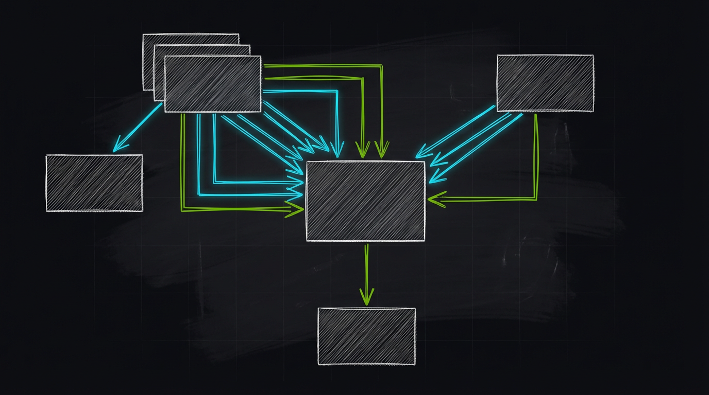
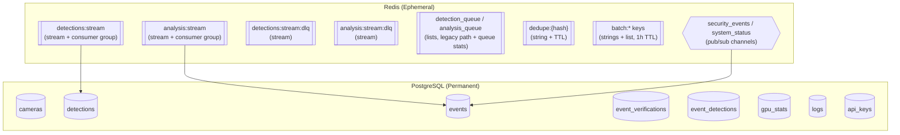
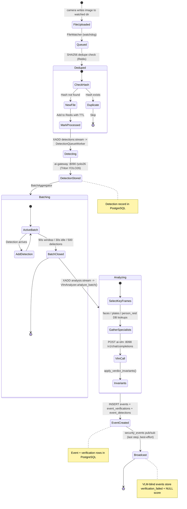
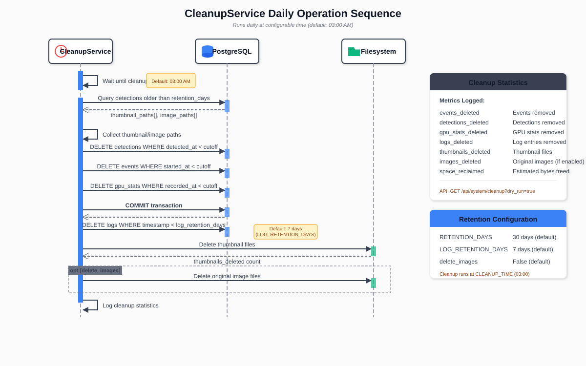
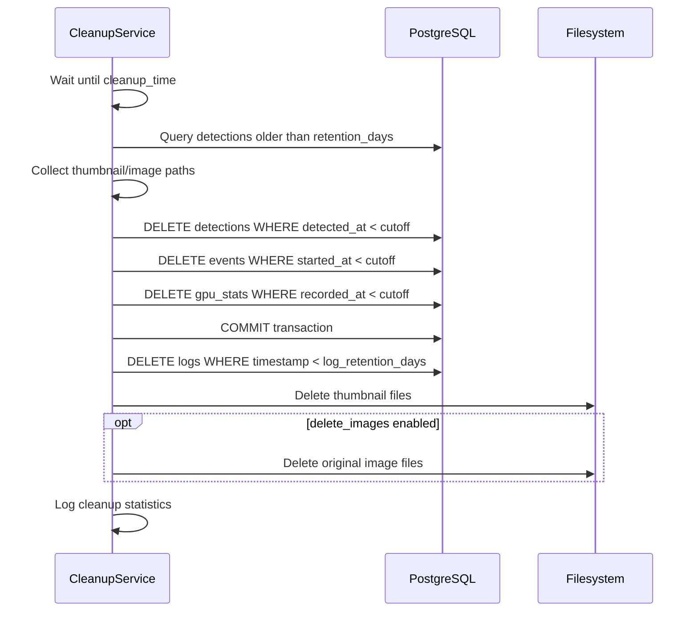

# Data Model Reference



> **Audience:** Future maintainers who need to understand what data is stored, where, and why.

This document describes the complete data model for the Home Security Intelligence system, including PostgreSQL tables, Redis data structures, and the data lifecycle from camera capture to VLM analysis.

---

## Table of Contents

1. [Storage Overview](#storage-overview)
2. [Entity Relationship Diagram](#entity-relationship-diagram)
3. [PostgreSQL Tables](#postgresql-tables)
   - [cameras](#cameras)
   - [detections](#detections)
   - [events](#events)
   - [event_verifications](#event_verifications)
   - [event_detections](#event_detections)
   - [gpu_stats](#gpu_stats)
   - [logs](#logs)
   - [api_keys](#api_keys)
   - [alerts](#alerts)
   - [alert_rules](#alert_rules)
   - [camera_zones](#camera_zones)
   - [activity_baselines](#activity_baselines)
   - [class_baselines](#class_baselines)
   - [audit_logs](#audit_logs)
   - [entities](#entities)
   - [known_persons / face_embeddings / plate_reads](#known_persons--face_embeddings--plate_reads)
   - [prompt_configs](#prompt_configs)
   - [prompt_versions](#prompt_versions)
   - [scene_changes](#scene_changes)
   - [user_calibration](#user_calibration)
4. [Key Relationships](#key-relationships)
5. [Ephemeral vs Permanent Storage](#ephemeral-vs-permanent-storage)
6. [Redis Data Structures](#redis-data-structures)
7. [Data Lifecycle](#data-lifecycle)
8. [Indexes and Query Patterns](#indexes-and-query-patterns)
9. [Retention and Cleanup](#retention-and-cleanup)

---

## Storage Overview

The system uses two complementary storage backends optimized for their respective strengths:

| Storage                    | Technology                     | Purpose                                         | Data Persistence           |
| -------------------------- | ------------------------------ | ----------------------------------------------- | -------------------------- |
| **Primary Database**       | PostgreSQL (async via asyncpg) | Permanent records, historical data, audit trail | Durable, survives restarts |
| **Message Broker / Cache** | Redis                          | Streams, pub/sub, deduplication, batch state    | Ephemeral, reconstructable |

### Design Rationale

- **PostgreSQL:** Chosen for robust concurrent write support required by the AI pipeline's parallel workers. Provides JSONB for flexible metadata storage and proper transaction isolation.
- **Redis:** Provides fast pub/sub for real-time WebSocket updates, Streams (with consumer groups and per-stream DLQs) for pipeline processing, and TTL-based caching for deduplication.

---

## Entity Relationship Diagram

The three core entities (Camera, Detection, Event) form the backbone of the system's data model. Cameras produce detections, which are grouped into events by the batch aggregator; each event carries the VLM's verdict in `event_verifications` and its member detections in the `event_detections` join table.


```mermaid
erDiagram
    cameras ||--o{ detections : "has many"
    cameras ||--o{ events : "has many"
    cameras ||--o{ camera_zones : "has many"
    cameras ||--o{ activity_baselines : "has many"
    cameras ||--o{ class_baselines : "has many"
    cameras ||--o{ scene_changes : "has many"
    events ||--o{ event_verifications : "verified by"
    events ||--o{ event_detections : "groups"
    detections ||--o{ event_detections : "members of"
    events ||--o{ alerts : "may raise"
    alert_rules ||--o{ alerts : "defines"

    cameras {
        string id PK "UUID-string primary key"
        string name UK "Display name (unique)"
        string folder_path UK "Watched directory (unique)"
        string status "online|offline|error|unknown"
        datetime created_at "Creation timestamp"
        datetime last_seen_at "Last activity (nullable)"
        datetime deleted_at "Soft delete (nullable)"
    }

    detections {
        int id PK "Auto-increment"
        string camera_id FK "References cameras.id (CASCADE)"
        string file_path "Source image path"
        datetime detected_at "Detection timestamp"
        string object_type "person|car|etc (nullable)"
        float confidence "0.0-1.0 (nullable)"
        int bbox_x "Bounding box X (nullable)"
        int bbox_y "Bounding box Y (nullable)"
        int bbox_width "Bounding box width (nullable)"
        int bbox_height "Bounding box height (nullable)"
        string thumbnail_path "Generated thumbnail (nullable)"
    }

    events {
        int id PK "Auto-increment"
        string batch_id UK "Batch grouping ID (unique)"
        string camera_id FK "References cameras.id (CASCADE)"
        datetime started_at "Event start time"
        datetime ended_at "Event end time (nullable)"
        int risk_score "0-100 (nullable)"
        string risk_level "low|medium|high|critical (nullable)"
        text summary "VLM summary (nullable)"
        text reasoning "VLM reasoning (nullable)"
        bool reviewed "User reviewed flag"
        bool flagged "User flagged flag"
        text notes "User notes (nullable)"
        bool is_fast_path "Fast path flag (feature disabled)"
    }

    event_verifications {
        int id PK "Auto-increment"
        int event_id FK "References events.id"
        string verdict "confirmed|rejected|uncertain|verification_failed"
        text scene_description "VLM scene description (nullable)"
        jsonb criteria "Per-criterion verdicts (nullable)"
        jsonb key_frame_detection_ids "Detections shown to the VLM (nullable)"
        string engine "Verifier label + build"
        string model_id "Served model id"
        int latency_ms "VLM call latency (nullable)"
    }

    event_detections {
        int event_id PK "Composite PK, FK events.id"
        int detection_id PK "Composite PK, FK detections.id"
        datetime created_at "Membership timestamp"
    }

    alerts {
        uuid id PK "UUID primary key"
        int event_id FK "References events.id"
        uuid rule_id FK "References alert_rules.id (nullable)"
        enum severity "low|medium|high|critical"
        enum status "pending|delivered|acknowledged|dismissed"
        datetime created_at "Creation timestamp"
        datetime delivered_at "Delivery timestamp (nullable)"
        jsonb channels "Notification channels (nullable)"
        string dedup_key "Deduplication key"
    }

    alert_rules {
        uuid id PK "UUID primary key"
        string name "Rule name"
        bool enabled "Active status"
        enum severity "low|medium|high|critical"
        int risk_threshold "Minimum risk score (nullable)"
        jsonb object_types "Object types to match (nullable)"
        string dedup_key_template "Dedup key template"
        int cooldown_seconds "Cooldown period"
    }

    camera_zones {
        string id PK "Zone ID"
        string camera_id FK "References cameras.id (CASCADE)"
        string name "Zone name"
        enum zone_type "entry_point|driveway|sidewalk|yard|other"
        jsonb coordinates "Normalized coordinate points"
        enum shape "rectangle|polygon"
        bool enabled "Active status"
        int priority "Zone priority"
    }

    activity_baselines {
        int id PK "Auto-increment"
        string camera_id FK "References cameras.id"
        int hour "Hour of day (0-23)"
        int day_of_week "Day of week (0-6)"
        float avg_count "EWMA activity count"
        int sample_count "Number of samples"
        datetime last_updated "Last update timestamp"
    }

    class_baselines {
        int id PK "Auto-increment"
        string camera_id FK "References cameras.id"
        string detection_class "Object class"
        int hour "Hour of day (0-23)"
        float frequency "EWMA frequency"
        int sample_count "Number of samples"
        datetime last_updated "Last update timestamp"
    }

    gpu_stats {
        int id PK "Auto-increment"
        datetime recorded_at "Sample timestamp"
        string gpu_name "GPU model name (nullable)"
        float gpu_utilization "0-100% (nullable)"
        int memory_used "MB (nullable)"
        float temperature "Celsius (nullable)"
        float inference_fps "Frames per second (nullable)"
    }

    logs {
        int id PK "Auto-increment"
        datetime timestamp "Log timestamp"
        string level "DEBUG|INFO|WARNING|ERROR|CRITICAL"
        string component "Module/service name"
        text message "Log message"
        string camera_id "Associated camera (nullable)"
        int event_id "Associated event (nullable)"
        string source "backend|frontend"
    }

    api_keys {
        string id PK "String primary key"
        string key_hash UK "SHA256 hash, unique"
        string prefix "Key prefix for display"
        string name "Key display name"
        bool is_active "Active/revoked status"
    }
```

---

## PostgreSQL Tables

### cameras

**Model:** `backend/models/camera.py:61` (table `cameras`)

**Purpose:** Tracks registered security cameras and their configuration.

| Column               | Type         | Nullable | Default    | Description                                          |
| -------------------- | ------------ | -------- | ---------- | ---------------------------------------------------- |
| `id`                 | STRING       | NO       | -          | Primary key (UUID-string, via `normalize_camera_id`) |
| `name`               | STRING       | NO       | -          | Human-readable camera name (unique index)            |
| `folder_path`        | STRING       | NO       | -          | Filesystem path where camera uploads arrive          |
| `status`             | STRING       | NO       | `"online"` | `online`, `offline`, `error`, `unknown` (CHECK)      |
| `created_at`         | DATETIME(tz) | NO       | `utcnow()` | When camera was registered                           |
| `last_seen_at`       | DATETIME(tz) | YES      | NULL       | Last image received timestamp                        |
| `deleted_at`         | DATETIME(tz) | YES      | NULL       | Soft-delete marker                                   |
| `property_id`        | INTEGER      | YES      | NULL       | FK to the property hierarchy (nullable)              |
| `ingestion_mode`     | STRING       | NO       | `"ftp"`    | How frames arrive: `ftp`, `rtsp`, `onvif` (CHECK)    |
| `rtsp_url`           | STRING       | YES      | NULL       | RTSP source URL for stream cameras                   |
| `rtsp_username`      | STRING       | YES      | NULL       | RTSP credentials                                     |
| `rtsp_password`      | STRING       | YES      | NULL       | RTSP credentials                                     |
| `stream_profile`     | STRING       | YES      | NULL       | `main`, `sub`, `both`, or NULL (CHECK)               |
| `motion_sensitivity` | FLOAT        | NO       | `0.5`      | Motion gating threshold                              |
| `calibration_data`   | JSONB        | YES      | NULL       | Per-camera calibration payload                       |

**Indexes:** unique on `name` and `folder_path`, plus `idx_cameras_property_id` (`backend/models/camera.py:81-88`).

**Relationships:**

- One-to-many with `detections`, `events`, `camera_zones`, `activity_baselines`, `class_baselines`, `scene_changes` - all with `ondelete="CASCADE"`
- Optional FK to `properties`; relationships to tracks, areas, line/polygon zones, plate reads (`backend/models/camera.py:179-231`)

**Usage:**

- Created when a new camera directory is detected or manually registered; camera IDs are normalized through `normalize_camera_id` (`backend/models/camera.py:29`)
- Updated when new images arrive (`last_seen_at`)

---

### detections

**Model:** `backend/models/detection.py:23` (table `detections`)

**Purpose:** Stores individual object detection results from YOLO26.

| Column             | Type         | Nullable | Default    | Description                                          |
| ------------------ | ------------ | -------- | ---------- | ---------------------------------------------------- |
| `id`               | INTEGER      | NO       | Auto       | Primary key                                          |
| `camera_id`        | STRING       | NO       | -          | Foreign key to `cameras.id` (CASCADE)                |
| `file_path`        | STRING       | NO       | -          | Full path to source image                            |
| `file_type`        | STRING       | YES      | NULL       | MIME type (e.g., `image/jpeg`)                       |
| `detected_at`      | DATETIME(tz) | NO       | `utcnow()` | When detection was processed                         |
| `object_type`      | STRING       | YES      | NULL       | Detected class (person, car, dog, etc.)              |
| `confidence`       | FLOAT        | YES      | NULL       | Detection confidence score (0.0-1.0)                 |
| `bbox_x`           | INTEGER      | YES      | NULL       | Bounding box top-left X coordinate                   |
| `bbox_y`           | INTEGER      | YES      | NULL       | Bounding box top-left Y coordinate                   |
| `bbox_width`       | INTEGER      | YES      | NULL       | Bounding box width in pixels                         |
| `bbox_height`      | INTEGER      | YES      | NULL       | Bounding box height in pixels                        |
| `thumbnail_path`   | STRING       | YES      | NULL       | Path to cropped detection thumbnail                  |
| `media_type`       | STRING       | YES      | `"image"`  | `image` or video-derived media                       |
| `duration`         | FLOAT        | YES      | NULL       | Clip duration for video media                        |
| `video_codec`      | STRING       | YES      | NULL       | Video metadata columns (`:58-61`)                    |
| `video_width`      | INTEGER      | YES      | NULL       | Video metadata                                       |
| `video_height`     | INTEGER      | YES      | NULL       | Video metadata                                       |
| `track_id`         | INTEGER      | YES      | NULL       | Multi-object tracking association                    |
| `track_confidence` | FLOAT        | YES      | NULL       | Tracker confidence                                   |
| `enrichment_data`  | JSONB        | YES      | NULL       | Deferred lookup payloads (specialist lines, context) |
| `labels`           | JSONB        | YES      | NULL       | Additional label payload                             |
| `search_vector`    | TSVECTOR     | YES      | NULL       | Full-text search column                              |

**Indexes:** `idx_detections_camera_id`, `idx_detections_detected_at`, `idx_detections_camera_time` (`camera_id, detected_at`), `idx_detections_camera_object_type` (`backend/models/detection.py:124-127`).

**Usage:**

- Created by `DetectionQueueWorker` after inference via `DetectorClient` -> `ai-gateway` `/yolo26`
- One detection record per detected object (multiple per image possible)
- Membership in an event is recorded in the `event_detections` join table - detections have no direct event FK column

---

### events

**Model:** `backend/models/event.py:36` (table `events`)

**Purpose:** Aggregated security events analyzed by the VLM (`ai-vlm`) for risk assessment.

| Column               | Type         | Nullable | Default | Description                                                      |
| -------------------- | ------------ | -------- | ------- | ---------------------------------------------------------------- |
| `id`                 | INTEGER      | NO       | Auto    | Primary key                                                      |
| `batch_id`           | STRING       | NO       | -       | Batch grouping identifier (UNIQUE)                               |
| `camera_id`          | STRING       | NO       | -       | Foreign key to `cameras.id` (CASCADE)                            |
| `started_at`         | DATETIME(tz) | NO       | -       | First detection timestamp in batch                               |
| `ended_at`           | DATETIME(tz) | YES      | NULL    | Last detection timestamp in batch                                |
| `risk_score`         | INTEGER      | YES      | NULL    | VLM-assigned risk score (0-100); NULL on `verification_failed`   |
| `risk_level`         | STRING       | YES      | NULL    | `low`, `medium`, `high`, `critical`; NULL alongside a NULL score |
| `version`            | INTEGER      | NO       | `1`     | Optimistic-locking counter                                       |
| `summary`            | TEXT         | YES      | NULL    | VLM-generated event description                                  |
| `reasoning`          | TEXT         | YES      | NULL    | VLM reasoning for risk assessment (deferred load)                |
| `llm_prompt`         | TEXT         | YES      | NULL    | Prompt text stored for reproducibility (deferred)                |
| `reviewed`           | BOOLEAN      | NO       | `False` | Whether user has reviewed the event                              |
| `flagged`            | BOOLEAN      | NO       | `False` | Whether user flagged the event                                   |
| `notes`              | TEXT         | YES      | NULL    | User-added notes/annotations                                     |
| `is_fast_path`       | BOOLEAN      | NO       | `False` | Legacy flag; the fast path is disabled by shipped defaults       |
| `object_types`       | TEXT         | YES      | NULL    | Object types in the batch                                        |
| `clip_path`          | STRING       | YES      | NULL    | Generated event clip (nullable)                                  |
| `entities`           | JSONB        | YES      | NULL    | Entity payload (GIN-indexed)                                     |
| `flags`              | JSONB        | YES      | NULL    | Event flags payload (GIN-indexed)                                |
| `confidence_factors` | JSONB        | YES      | NULL    | Contributing confidence factors                                  |
| `recommended_action` | TEXT         | YES      | NULL    | VLM-recommended follow-up                                        |
| `deleted_at`         | DATETIME(tz) | YES      | NULL    | Soft-delete marker                                               |
| `snooze_until`       | DATETIME(tz) | YES      | NULL    | Snooze window end                                                |
| `search_vector`      | TSVECTOR     | YES      | NULL    | Full-text search column                                          |

There is **no** `detection_ids` column: event membership is the `event_detections` join table, and the set of detections actually shown to the VLM is recorded per-verification in `event_verifications.key_frame_detection_ids`.

**Indexes:** `idx_events_camera_id`, `idx_events_started_at`, `idx_events_risk_score`, `idx_events_reviewed`, `idx_events_batch_id`, GIN indexes on `search_vector`, `entities`, `flags` and `confidence_factors`, plus composite/partial indexes (`idx_events_risk_level_started_at`, `idx_events_export_covering`, `idx_events_unreviewed`, `idx_events_active`) (`backend/models/event.py:204-246`).

**Usage:**

- Created by `VlmAnalyzer.analyze_batch()` after the VLM call completes; the WebSocket broadcast is the last step of that method
- A VLM failure stores `risk_score`/`risk_level` as NULL with verdict `verification_failed` in the verification row - never a fabricated score

---

### event_verifications

**Model:** `backend/models/event_verification.py:94` (table `event_verifications`)

**Purpose:** One row per VLM verdict attempt - what the model actually decided, on which frames, with which engine.

| Column                    | Type         | Nullable | Default | Description                                                                           |
| ------------------------- | ------------ | -------- | ------- | ------------------------------------------------------------------------------------- |
| `id`                      | INTEGER      | NO       | Auto    | Primary key                                                                           |
| `event_id`                | INTEGER      | NO       | -       | Foreign key to `events.id`                                                            |
| `verdict`                 | STRING       | NO       | -       | `confirmed`, `rejected`, `uncertain`, `verification_failed` (`VerdictLiteral`, `:51`) |
| `scene_description`       | TEXT         | YES      | NULL    | VLM's description of the scene                                                        |
| `criteria`                | JSONB        | YES      | NULL    | Per-criterion verdict payload from the schema                                         |
| `key_frame_detection_ids` | JSONB        | YES      | NULL    | The 1-4 detection IDs selected as key frames                                          |
| `engine`                  | STRING       | NO       | -       | Verifier label plus the `/props` build string                                         |
| `model_id`                | STRING       | NO       | -       | Served model file stem (client-derived, never model-derived)                          |
| `latency_ms`              | INTEGER      | YES      | NULL    | Measured VLM call latency                                                             |
| `created_at`              | DATETIME(tz) | NO       | -       | Row timestamp                                                                         |

The engine/model pair is written by `VlmClient._served_provenance()` from the client's own view of the server (`backend/services/vlm_client.py:252-266`) - the schema forces the model to emit provenance, and the client refuses to trust it.

---

### event_detections

**Model:** `backend/models/event_detection.py:45` (table `event_detections`)

**Purpose:** The join between events and their member detections - an event's full detection set (as opposed to the key frames the VLM saw).

| Column         | Type         | Nullable | Description                               |
| -------------- | ------------ | -------- | ----------------------------------------- |
| `event_id`     | INTEGER      | NO       | Composite primary key; FK `events.id`     |
| `detection_id` | INTEGER      | NO       | Composite primary key; FK `detections.id` |
| `created_at`   | DATETIME(tz) | NO       | Membership timestamp                      |

---

### gpu_stats

**Model:** `backend/models/gpu_stats.py:11` (table `gpu_stats`)

**Purpose:** Time-series GPU performance metrics for monitoring AI inference load.

| Column                | Type         | Nullable | Default    | Description                          |
| --------------------- | ------------ | -------- | ---------- | ------------------------------------ |
| `id`                  | INTEGER      | NO       | Auto       | Primary key                          |
| `recorded_at`         | DATETIME(tz) | NO       | `utcnow()` | Sample timestamp                     |
| `gpu_name`            | STRING(255)  | YES      | NULL       | GPU model (e.g., "NVIDIA RTX A5500") |
| `gpu_utilization`     | FLOAT        | YES      | NULL       | GPU compute utilization (0-100%)     |
| `memory_used`         | INTEGER      | YES      | NULL       | VRAM used in MB                      |
| `memory_total`        | INTEGER      | YES      | NULL       | Total VRAM in MB                     |
| `temperature`         | FLOAT        | YES      | NULL       | GPU temperature in Celsius           |
| `power_usage`         | FLOAT        | YES      | NULL       | Power consumption in Watts           |
| `inference_fps`       | FLOAT        | YES      | NULL       | Inference throughput                 |
| `fan_speed`           | INTEGER      | YES      | NULL       | Extended NVML telemetry (`:57-76`)   |
| `sm_clock`            | INTEGER      | YES      | NULL       | Extended NVML telemetry              |
| `pstate`              | INTEGER      | YES      | NULL       | Extended NVML telemetry              |
| `throttle_reasons`    | INTEGER      | YES      | NULL       | Extended NVML telemetry              |
| `pcie_replay_counter` | INTEGER      | YES      | NULL       | Extended NVML telemetry              |

(Full column list at `backend/models/gpu_stats.py:45-76`.)

**Indexes:** `ix_gpu_stats_recorded_at_brin` (BRIN - the time-series scan pattern) and `ix_gpu_stats_recorded_at_btree` (`backend/models/gpu_stats.py:86-94`).

**Usage:**

- Populated by `GPUMonitor` (`backend/services/gpu_monitor.py:131`) polling at `gpu_poll_interval_seconds` (default 5.0, `backend/core/config.py:1911-1912`)
- Subject to the same retention policy as events/detections

---

### logs

**Model:** `backend/models/log.py:13` (table `logs`)

**Purpose:** Structured application logs with rich metadata for debugging and audit.

| Column         | Type         | Nullable | Default      | Description                                  |
| -------------- | ------------ | -------- | ------------ | -------------------------------------------- |
| `id`           | INTEGER      | NO       | Auto         | Primary key                                  |
| `timestamp`    | DATETIME(tz) | NO       | `func.now()` | Log timestamp                                |
| `level`        | STRING(10)   | NO       | -            | Log level: DEBUG/INFO/WARNING/ERROR/CRITICAL |
| `component`    | STRING(50)   | NO       | -            | Module or service name                       |
| `message`      | TEXT         | NO       | -            | Log message text                             |
| `camera_id`    | STRING(100)  | YES      | NULL         | Associated camera ID                         |
| `event_id`     | INTEGER      | YES      | NULL         | Associated event ID                          |
| `request_id`   | STRING(36)   | YES      | NULL         | Request correlation ID (UUID)                |
| `detection_id` | INTEGER      | YES      | NULL         | Associated detection ID                      |
| `duration_ms`  | INTEGER      | YES      | NULL         | Operation duration in milliseconds           |
| `extra`        | JSONB        | YES      | NULL         | Additional structured context                |
| `source`       | STRING(10)   | NO       | `"backend"`  | Log source: `backend` or `frontend`          |
| `user_agent`   | TEXT         | YES      | NULL         | Browser user agent (frontend logs)           |

**Indexes:** `idx_logs_timestamp`, `idx_logs_level`, `idx_logs_component`, `idx_logs_camera_id`, `idx_logs_source` (`backend/models/log.py:54-58`).

**Usage:**

- Backend logs written by `DatabaseHandler` (`backend/core/logging.py:699`)
- Frontend logs submitted via `POST /api/logs/frontend` (router prefix at `backend/api/routes/logs.py:72`, endpoint at `:210`)
- Separate retention period (`log_retention_days`, default: 7 days, `backend/core/config.py:2083-2084`)

---

### api_keys

**Model:** `backend/models/api_key.py:22` (table `api_keys`)

**Purpose:** API key management for per-route authentication (optional, disabled by default).

| Column         | Type         | Nullable | Default | Description                  |
| -------------- | ------------ | -------- | ------- | ---------------------------- |
| `id`           | STRING(64)   | NO       | -       | Primary key                  |
| `user_id`      | STRING       | NO       | -       | Owner user (FK to users)     |
| `prefix`       | STRING(32)   | NO       | -       | Display prefix               |
| `key_hash`     | STRING(255)  | NO       | -       | Hash of the API key (UNIQUE) |
| `name`         | STRING(100)  | NO       | -       | Human-readable key name      |
| `created_at`   | DATETIME(tz) | NO       | -       | Key creation timestamp       |
| `last_used_at` | DATETIME(tz) | YES      | NULL    | Last successful use          |
| `expires_at`   | DATETIME(tz) | YES      | NULL    | Optional expiry              |
| `is_active`    | BOOLEAN      | NO       | `True`  | Active/revoked status        |

**Usage:**

- `API_KEY_ENABLED` (default `False`, `backend/core/config.py:1932-1935`) gates key checks; `verify_api_key` protects admin/destructive endpoints (e.g. the cleanup trigger, `backend/api/routes/system.py:3284`)
- Bootstrap keys from the `API_KEYS` setting are hashed on startup (`backend/core/config.py:1936-1938`)

---

### alerts

**Model:** `backend/models/alert.py:73` (table `alerts`)

**Purpose:** Notification records associated with security events. The rule engine that evaluates `alert_rules` is `AlertRuleEngine` (`backend/services/alert_engine.py`); in the shipped pipeline no event auto-creates an Alert row - alerts are created through the rule-test path and the alert/notification APIs.

| Column             | Type         | Nullable | Default    | Description                                                                   |
| ------------------ | ------------ | -------- | ---------- | ----------------------------------------------------------------------------- |
| `id`               | UUID         | NO       | uuid7()    | Primary key                                                                   |
| `event_id`         | INTEGER      | NO       | -          | Foreign key to `events.id`                                                    |
| `rule_id`          | UUID         | YES      | NULL       | Foreign key to `alert_rules.id`                                               |
| `severity`         | ENUM         | NO       | `MEDIUM`   | `low`, `medium`, `high`, `critical`                                           |
| `status`           | ENUM         | NO       | `PENDING`  | `pending`, `delivered`, `acknowledged`, `dismissed`                           |
| `created_at`       | DATETIME(tz) | NO       | `utcnow()` | When alert was created                                                        |
| `updated_at`       | DATETIME(tz) | NO       | `utcnow()` | When alert was last updated                                                   |
| `delivered_at`     | DATETIME(tz) | YES      | NULL       | When alert was delivered                                                      |
| `channels`         | JSONB        | YES      | NULL       | Notification channels used                                                    |
| `dedup_key`        | STRING(255)  | NO       | -          | Deduplication key for preventing duplicates                                   |
| `metadata`         | JSONB        | YES      | NULL       | Additional alert context (column `alert_metadata` maps to `metadata`, `:121`) |
| `version_id`       | INTEGER      | NO       | `1`        | Row version                                                                   |
| `is_high_priority` | BOOLEAN      | NO       | `False`    | High-priority marker                                                          |

**Indexes:** `idx_alerts_event_id`, `idx_alerts_rule_id`, `idx_alerts_severity`, `idx_alerts_status`, `idx_alerts_created_at`, `idx_alerts_dedup_key`, `idx_alerts_dedup_key_created_at`, `idx_alerts_delivered_at`, `idx_alerts_event_rule_delivered` (`backend/models/alert.py:137-146`).

---

### alert_rules

**Model:** `backend/models/alert.py:228` (table `alert_rules`)

**Purpose:** Defines conditions for generating alerts from security events.

| Column                                                                                              | Type                         | Nullable | Default                 | Description                                |
| --------------------------------------------------------------------------------------------------- | ---------------------------- | -------- | ----------------------- | ------------------------------------------ |
| `id`                                                                                                | UUID                         | NO       | uuid7()                 | Primary key                                |
| `name`                                                                                              | STRING(255)                  | NO       | -                       | Human-readable rule name                   |
| `description`                                                                                       | TEXT                         | YES      | NULL                    | Rule description                           |
| `enabled`                                                                                           | BOOLEAN                      | NO       | `True`                  | Whether rule is active                     |
| `severity`                                                                                          | ENUM                         | NO       | `MEDIUM`                | Severity for triggered alerts              |
| `risk_threshold`                                                                                    | INTEGER                      | YES      | NULL                    | Minimum risk score (0-100)                 |
| `object_types`                                                                                      | JSONB                        | YES      | NULL                    | Object types to match (e.g., `["person"]`) |
| `camera_ids`                                                                                        | JSONB                        | YES      | NULL                    | Camera IDs to apply to (empty = all)       |
| `zone_ids`                                                                                          | JSONB                        | YES      | NULL                    | Zone IDs to match (empty = any)            |
| `min_confidence`                                                                                    | FLOAT                        | YES      | NULL                    | Minimum detection confidence (0.0-1.0)     |
| `schedule`                                                                                          | JSONB                        | YES      | NULL                    | Time-based conditions                      |
| `dwell_time_enabled`                                                                                | BOOLEAN                      | NO       | `False`                 | Dwell-time condition switch                |
| `dwell_threshold_seconds`                                                                           | INTEGER                      | YES      | NULL                    | Dwell threshold                            |
| `exclude_household_members`                                                                         | BOOLEAN                      | NO       | `False`                 | Household exclusion switch                 |
| `conditions`                                                                                        | JSONB                        | YES      | NULL                    | Legacy conditions (backward compatibility) |
| `pose_types` / `pose_confidence_threshold`                                                          | JSONB / FLOAT                | YES      | NULL                    | Pose conditions (`:307-312`)               |
| `action_types` / `action_confidence_threshold`                                                      | JSONB / FLOAT                | YES      | NULL                    | Action conditions                          |
| `threat_detection_enabled` + `threat_types` / `threat_min_severity` / `threat_confidence_threshold` | BOOLEAN + JSONB/STRING/FLOAT | -        | `False`/NULL            | Threat conditions (`:315-319`)             |
| `smoke_fire_detection_enabled` + related                                                            | BOOLEAN + INTEGER/FLOAT      | -        | `False`                 | Smoke/fire conditions (`:322-326`)         |
| `dedup_key_template`                                                                                | STRING(255)                  | NO       | `{camera_id}:{rule_id}` | Template for generating dedup keys         |
| `cooldown_seconds`                                                                                  | INTEGER                      | NO       | `300`                   | Cooldown period (default: 5 minutes)       |
| `channels`                                                                                          | JSONB                        | YES      | NULL                    | Notification channels to use               |
| `created_at`                                                                                        | DATETIME(tz)                 | NO       | `utcnow()`              | When rule was created                      |
| `updated_at`                                                                                        | DATETIME(tz)                 | NO       | `utcnow()`              | When rule was last updated                 |

**Indexes:** `idx_alert_rules_name`, `idx_alert_rules_enabled`, `idx_alert_rules_severity` (`backend/models/alert.py:354-356`).

**Usage:**

- All conditions in a rule must match (AND logic); cooldown prevents duplicate alerts within the specified window
- Rules are evaluated by `AlertRuleEngine` when invoked through the alert APIs' rule-test path; no shipped pipeline stage evaluates rules automatically per event

---

### camera_zones

**Model:** `backend/models/camera_zone.py:53` (table `camera_zones`; the `Zone` name is a re-export alias in `backend/models/zone.py`)

**Purpose:** Defines regions of interest on camera views for detection context.

| Column        | Type         | Nullable | Default     | Description                                                       |
| ------------- | ------------ | -------- | ----------- | ----------------------------------------------------------------- |
| `id`          | STRING       | NO       | -           | Primary key (user-defined ID)                                     |
| `camera_id`   | STRING       | NO       | -           | Foreign key to `cameras.id` (CASCADE)                             |
| `name`        | STRING(255)  | NO       | -           | Human-readable zone name                                          |
| `zone_type`   | ENUM         | NO       | `OTHER`     | `entry_point`, `driveway`, `sidewalk`, `yard`, `other` (`:31-38`) |
| `coordinates` | JSONB        | NO       | -           | Normalized coordinates (0-1 range) as `[[x,y],...]`               |
| `shape`       | ENUM         | NO       | `RECTANGLE` | `rectangle`, `polygon` (`:41-45`)                                 |
| `color`       | STRING(7)    | NO       | `#3B82F6`   | Display color (hex)                                               |
| `enabled`     | BOOLEAN      | NO       | `True`      | Whether zone is active                                            |
| `priority`    | INTEGER      | NO       | `0`         | Zone priority for overlapping zones                               |
| `created_at`  | DATETIME(tz) | NO       | `utcnow()`  | When zone was created                                             |
| `updated_at`  | DATETIME(tz) | NO       | `utcnow()`  | When zone was last updated                                        |

**Indexes:** `idx_camera_zones_camera_id`, `idx_camera_zones_enabled`, `idx_camera_zones_camera_enabled` (`backend/models/camera_zone.py:132-134`).

**Usage:**

- Coordinates are normalized (0-1) relative to image dimensions
- Zone membership is computed with `point_in_zone`/`bbox_center` from `backend/services/zone_service.py` (imported at `backend/services/context_enricher.py:33`)
- Managed via the zone API routes under `/api/cameras/{camera_id}/zones` (`backend/api/routes/zones.py:21`)

> **Note:** `camera_zones` uses types `entry_point`, `driveway`, `sidewalk`, `yard`, `other`. The analytics models in `backend/models/analytics_zone.py` (`line_zones`, `polygon_zones`) serve the analytics subsystem and are separate tables.

---

### activity_baselines

**Model:** `backend/models/baseline.py:35` (table `activity_baselines`)

**Purpose:** Tracks baseline activity rates per camera for anomaly detection.

| Column         | Type         | Nullable | Default    | Description                                       |
| -------------- | ------------ | -------- | ---------- | ------------------------------------------------- |
| `id`           | INTEGER      | NO       | Auto       | Primary key                                       |
| `camera_id`    | STRING       | NO       | -          | Foreign key to `cameras.id`                       |
| `hour`         | INTEGER      | NO       | -          | Hour of day (0-23)                                |
| `day_of_week`  | INTEGER      | NO       | -          | Day of week (0=Monday, 6=Sunday)                  |
| `avg_count`    | FLOAT        | NO       | `0.0`      | Exponentially weighted moving average of activity |
| `sample_count` | INTEGER      | NO       | `0`        | Number of samples used                            |
| `last_updated` | DATETIME(tz) | NO       | `utcnow()` | When baseline was last updated                    |

**Constraints:** unique `(camera_id, hour, day_of_week)` (`uq_activity_baseline_slot`, `backend/models/baseline.py:71`).
**Indexes:** `idx_activity_baseline_camera`, `idx_activity_baseline_slot` (`:72-73`).

**Usage:**

- Tracks typical activity levels by time slot (168 slots per camera)
- Read/written by `BaselineService` (`backend/services/baseline.py`)

---

### class_baselines

**Model:** `backend/models/baseline.py:89` (table `class_baselines`)

**Purpose:** Tracks frequency of specific object classes per camera for anomaly detection.

| Column            | Type         | Nullable | Default    | Description                                        |
| ----------------- | ------------ | -------- | ---------- | -------------------------------------------------- |
| `id`              | INTEGER      | NO       | Auto       | Primary key                                        |
| `camera_id`       | STRING       | NO       | -          | Foreign key to `cameras.id`                        |
| `detection_class` | STRING       | NO       | -          | Object class (e.g., "person", "car")               |
| `hour`            | INTEGER      | NO       | -          | Hour of day (0-23)                                 |
| `frequency`       | FLOAT        | NO       | `0.0`      | Exponentially weighted moving average of frequency |
| `sample_count`    | INTEGER      | NO       | `0`        | Number of samples used                             |
| `last_updated`    | DATETIME(tz) | NO       | `utcnow()` | When baseline was last updated                     |

**Constraints:** unique `(camera_id, detection_class, hour)` (`uq_class_baseline_slot`, `backend/models/baseline.py:124`).
**Indexes:** `idx_class_baseline_camera`, `idx_class_baseline_class`, `idx_class_baseline_slot` (`:125-127`).

---

### audit_logs

**Model:** `backend/models/audit.py:89` (table `audit_logs`)

**Purpose:** Records security-sensitive operations for compliance and debugging.

| Column          | Type         | Nullable | Default    | Description                                          |
| --------------- | ------------ | -------- | ---------- | ---------------------------------------------------- |
| `id`            | INTEGER      | NO       | Auto       | Primary key                                          |
| `timestamp`     | DATETIME(tz) | NO       | `utcnow()` | When action occurred                                 |
| `action`        | STRING(50)   | NO       | -          | Action type (e.g., `event_reviewed`, `rule_created`) |
| `resource_type` | STRING(50)   | NO       | -          | Type of resource affected                            |
| `resource_id`   | STRING(255)  | YES      | NULL       | ID of affected resource                              |
| `actor`         | STRING(100)  | NO       | -          | Who performed the action                             |
| `ip_address`    | STRING(45)   | YES      | NULL       | Client IP address                                    |
| `user_agent`    | TEXT         | YES      | NULL       | Browser user agent                                   |
| `details`       | JSONB        | YES      | NULL       | Additional structured context                        |
| `status`        | STRING(20)   | NO       | `success`  | Action status: `success`, `failure`                  |

**Indexes:** `idx_audit_logs_timestamp`, `idx_audit_logs_action`, `idx_audit_logs_resource_type`, `idx_audit_logs_actor`, `idx_audit_logs_status`, `idx_audit_logs_resource` (`backend/models/audit.py:115-121`).

---

### entities

**Model:** `backend/models/entity.py:40` (table `entities`)

**Purpose:** Tracks unique persons/objects for re-identification across cameras; written through `EntityClusteringService` (`backend/services/entity_clustering_service.py`) and related services.

| Column                 | Type         | Nullable | Default    | Description                                             |
| ---------------------- | ------------ | -------- | ---------- | ------------------------------------------------------- |
| `id`                   | UUID         | NO       | uuid7()    | Primary key                                             |
| `entity_type`          | STRING(20)   | NO       | `person`   | Type: `person`, `vehicle`, `animal`, `package`, `other` |
| `trust_status`         | STRING(20)   | NO       | `unknown`  | Status: `trusted`, `untrusted`, `unknown`               |
| `embedding_vector`     | JSONB        | YES      | NULL       | Feature vector for re-identification                    |
| `first_seen_at`        | DATETIME(tz) | NO       | `utcnow()` | Timestamp of first detection                            |
| `last_seen_at`         | DATETIME(tz) | NO       | `utcnow()` | Timestamp of most recent detection                      |
| `detection_count`      | INTEGER      | NO       | `0`        | Total number of detections linked to this entity        |
| `entity_metadata`      | JSONB        | YES      | NULL       | Flexible metadata payload                               |
| `primary_detection_id` | INTEGER      | YES      | NULL       | Reference to primary/best detection (no FK constraint)  |

**Indexes:** `idx_entities_entity_type`, `idx_entities_trust_status`, `idx_entities_first_seen_at`, `idx_entities_last_seen_at`, `idx_entities_type_last_seen`, plus a GIN index on `entity_metadata` (`backend/models/entity.py:114-124`).

---

### known_persons / face_embeddings / plate_reads

**Purpose:** The enrollment galleries that the pipeline's three in-process lookup legs read alongside every VLM call - faces, license plates, and person re-identification vectors come from these tables as database lookups, not from a perception service.

| Table             | Model                                 | Role                                                       |
| ----------------- | ------------------------------------- | ---------------------------------------------------------- |
| `known_persons`   | `backend/models/face_identity.py:63`  | Enrolled person identities                                 |
| `face_embeddings` | `backend/models/face_identity.py:120` | Stored face embedding vectors (with `model_id` provenance) |
| `plate_reads`     | `backend/models/plate_read.py:27`     | License-plate read history                                 |

The specialist gather in `backend/services/vlm_specialists.py` (`SPECIALIST_KEYS = frozenset({"faces", "plates", "person_reid"})`, `:881`) queries these galleries through the loader-backed legs and folds the results into the VLM prompt as context lines.

---

### prompt_configs

**Model:** `backend/models/prompt_config.py:15` (table `prompt_configs`)

**Purpose:** Stores current prompt configurations for AI models.

| Column          | Type         | Nullable | Default    | Description                           |
| --------------- | ------------ | -------- | ---------- | ------------------------------------- |
| `id`            | INTEGER      | NO       | Auto       | Primary key                           |
| `model`         | STRING(50)   | NO       | -          | Model name key (UNIQUE index)         |
| `system_prompt` | TEXT         | NO       | -          | Full system prompt text               |
| `temperature`   | FLOAT        | NO       | `0.7`      | LLM temperature (0-2)                 |
| `max_tokens`    | INTEGER      | NO       | `2048`     | Maximum tokens in response (100-8192) |
| `version`       | INTEGER      | NO       | `1`        | Auto-incrementing version number      |
| `created_at`    | DATETIME(tz) | NO       | `utcnow()` | Creation timestamp                    |
| `updated_at`    | DATETIME(tz) | NO       | `utcnow()` | Last update timestamp                 |

**Indexes:** `idx_prompt_configs_model` (unique) and `idx_prompt_configs_updated_at` (`backend/models/prompt_config.py:35-36`).

---

### prompt_versions

**Model:** `backend/models/prompt_version.py:28` (table `prompt_versions`)

**Purpose:** Version tracking for AI model prompt configurations with rollback support.

| Column               | Type         | Nullable | Default    | Description                        |
| -------------------- | ------------ | -------- | ---------- | ---------------------------------- |
| `id`                 | INTEGER      | NO       | Auto       | Primary key                        |
| `model`              | ENUM         | NO       | -          | `AIModel` enum (`:15-25`)          |
| `version`            | INTEGER      | NO       | -          | Version number                     |
| `created_at`         | DATETIME(tz) | NO       | `utcnow()` | Creation timestamp                 |
| `created_by`         | STRING(255)  | YES      | NULL       | User who created the version       |
| `config_json`        | TEXT         | NO       | -          | Configuration content (JSON)       |
| `change_description` | TEXT         | YES      | NULL       | Description of changes             |
| `is_active`          | BOOLEAN      | NO       | `false`    | Whether this is the active version |
| `row_version`        | INTEGER      | NO       | `1`        | Optimistic locking counter         |

The `AIModel` enum values are a fixed schema surface:

```python
# backend/models/prompt_version.py:18
class AIModel(str, Enum):
    """Supported AI models that have configurable prompts."""

    NEMOTRON = "nemotron"
    FLORENCE2 = "florence2"
    YOLO_WORLD = "yolo_world"
    XCLIP = "xclip"
    FASHION_CLIP = "fashion_clip"
```

> **Note:** These enum spellings predate the current stack - the live verifier is `ai-vlm`. The enum values are part of the stored-data contract (renaming them rewrites stored enum rows), so treat them as a wire/schema surface, not as a list of services that exist.

**Constraints:** unique `(model, version)` (`backend/models/prompt_version.py:76`); indexes `idx_prompt_versions_model`, `idx_prompt_versions_model_version`, `idx_prompt_versions_model_active` (`:71-73`).

---

### scene_changes

**Model:** `backend/models/scene_change.py:39` (table `scene_changes`)

**Purpose:** Records detected scene changes for camera tamper detection.

| Column             | Type         | Nullable | Default    | Description                                                            |
| ------------------ | ------------ | -------- | ---------- | ---------------------------------------------------------------------- |
| `id`               | INTEGER      | NO       | Auto       | Primary key                                                            |
| `camera_id`        | STRING       | NO       | -          | Foreign key to `cameras.id` (CASCADE)                                  |
| `detected_at`      | DATETIME(tz) | NO       | `utcnow()` | When change was detected                                               |
| `change_type`      | ENUM         | NO       | -          | `view_blocked`, `angle_changed`, `view_tampered`, `unknown` (`:30-37`) |
| `similarity_score` | FLOAT        | NO       | -          | SSIM between current view and baseline (1 = identical)                 |
| `acknowledged`     | BOOLEAN      | NO       | `False`    | User acknowledgement flag                                              |
| `acknowledged_at`  | DATETIME(tz) | YES      | NULL       | Acknowledgement timestamp                                              |
| `file_path`        | STRING       | YES      | NULL       | Image that triggered the detection                                     |

**Usage:**

- Written when the SSIM comparison of the current view against the stored baseline drops below threshold
- Used for camera tamper detection and maintenance alerts

---

### user_calibration

**Model:** `backend/models/user_calibration.py:11` (table `user_calibration`)

**Purpose:** Stores user-provided calibration data - personalized risk thresholds adjusted by event feedback.

| Column                 | Type         | Nullable | Default    | Description                              |
| ---------------------- | ------------ | -------- | ---------- | ---------------------------------------- |
| `id`                   | INTEGER      | NO       | Auto       | Primary key                              |
| `user_id`              | STRING       | NO       | -          | UNIQUE - one calibration record per user |
| `low_threshold`        | INTEGER      | NO       | `30`       | Score at/below which events are low risk |
| `medium_threshold`     | INTEGER      | NO       | `60`       | Medium boundary (0-29 low, 30-59 medium) |
| `high_threshold`       | INTEGER      | NO       | `85`       | 60-84 high, 85-100 critical              |
| `decay_factor`         | FLOAT        | NO       | `0.1`      | Feedback adjustment speed (0.0-1.0)      |
| `correct_count`        | INTEGER      | NO       | `0`        | Feedback tallies (`:54-57`)              |
| `false_positive_count` | INTEGER      | NO       | `0`        | Feedback tallies                         |
| `missed_threat_count`  | INTEGER      | NO       | `0`        | Feedback tallies                         |
| `severity_wrong_count` | INTEGER      | NO       | `0`        | Feedback tallies                         |
| `created_at`           | DATETIME(tz) | NO       | `utcnow()` | Row timestamp                            |
| `updated_at`           | DATETIME(tz) | NO       | `utcnow()` | Row timestamp                            |

These thresholds are the same bands `Severity` documents in `backend/models/enums.py:66-73` (LOW 0-29, MEDIUM 30-59, HIGH 60-84, CRITICAL 85-100); feedback shifts the per-user copy.

---

## Key Relationships

### Detection to Event Association

Detections are grouped into events through the batch aggregation process:

```
Detection 1 ─┐
Detection 2 ─┼── Batch "abc123" ── Event (risk_score=75)
Detection 3 ─┘
```

- **Batch ID:** `events.batch_id` is UNIQUE - one event per closed batch
- **Membership:** recorded as rows in `event_detections` (composite key `event_id + detection_id`)
- **Key frames:** the 1-4 detections actually shown to the VLM are stored per-verification in `event_verifications.key_frame_detection_ids`

### Camera as Parent Entity

```
Camera (front_door)
  ├── Detection 1
  ├── Detection 2
  ├── Detection 3
  ├── Event 1 (groups Detection 1, 2 via event_detections)
  └── Event 2 (groups Detection 3)
```

- Camera deletion cascades to all detections and events
- Ensures data integrity and simplifies cleanup

---

## Ephemeral vs Permanent Storage

### Diagram: Storage Architecture


```mermaid
flowchart TB
    subgraph Permanent["PostgreSQL (Permanent)"]
        cameras[(cameras)]
        detections[(detections)]
        events[(events)]
        event_verifications[(event_verifications)]
        event_detections[(event_detections)]
        gpu_stats[(gpu_stats)]
        logs[(logs)]
        api_keys[(api_keys)]
    end

    subgraph Ephemeral["Redis (Ephemeral)"]
        ds[["detections:stream<br/>(stream + consumer group)"]]
        as[["analysis:stream<br/>(stream + consumer group)"]]
        sdlq[["detections:stream:dlq<br/>(stream)"]]
        adlq[["analysis:stream:dlq<br/>(stream)"]]
        lists[["detection_queue / analysis_queue<br/>(lists, legacy path + queue stats)"]]
        dedupe[["dedupe:{hash}<br/>(string + TTL)"]]
        batch[["batch:* keys<br/>(strings + list, 1h TTL)"]]
        pubsub{{"security_events / system_status<br/>(pub/sub channels)"}}
    end

    ds --> detections
    as --> events
    pubsub --> events
```

### What Goes Where

| Data Type            | Storage    | Rationale                      |
| -------------------- | ---------- | ------------------------------ |
| Camera config        | PostgreSQL | Permanent configuration        |
| Detection results    | PostgreSQL | Historical record, audit trail |
| Events + verdicts    | PostgreSQL | Primary business data          |
| GPU metrics          | PostgreSQL | Performance history            |
| Logs                 | PostgreSQL | Debugging, compliance          |
| Processing streams   | Redis      | Consumer groups + PEL, rebuilt |
| Batch state          | Redis      | Short-lived, TTL-protected     |
| Deduplication        | Redis      | TTL-based cache (300s default) |
| Real-time broadcasts | Redis      | Fire-and-forget pub/sub        |

---

## Redis Data Structures

### Processing Queues (Streams, the shipped path)

With `USE_REDIS_STREAMS` (default true, `backend/core/config.py:2239`), the pipeline queues are Redis Streams with consumer groups:

```
detections:stream (Redis Stream, maxlen ~10000 approximate)
├── XADD: FileWatcher enqueues each new image via DetectionStreamService.add_detection
│        (backend/services/file_watcher.py:900 -> redis_streams.py:332)
├── XREADGROUP: DetectionQueueWorker consumes via consumer group (pipeline_workers.py:222)
├── XACK on success; pending entries are redelivered
└── >3 deliveries (DEFAULT_MAX_DELIVERY_COUNT, redis_streams.py:82) -> detections:stream:dlq

analysis:stream (Redis Stream)
├── XADD: BatchAggregator publishes closed batches via AnalysisStreamService
│        (backend/services/batch_aggregator.py:949, :1120)
├── XREADGROUP: AnalysisQueueWorker consumes via consumer group (pipeline_workers.py:765)
└── exhausted deliveries -> analysis:stream:dlq
```

Stream keys and per-stream DLQ streams are defined at `backend/services/redis_streams.py:73-74` and `:873-874`; message shapes are the dataclasses `DetectionStreamMessage` (`:155`) - `id, camera_id, detection_id, file_path, confidence, object_type, timestamp, delivery_count` - and `AnalysisStreamMessage` (`:879`) - `batch_id, camera_id, detection_ids, pipeline_start_time`.

### Legacy List Queues (still live in the stats path)

The list names `detection_queue` and `analysis_queue` and the DLQ constants `dlq:detection_queue` / `dlq:analysis_queue` are defined in `backend/core/constants.py:146-177`. They back the fallback code path (`FileWatcher` falls back to `add_to_queue_safe` with a DLQ overflow policy when streams are off, `backend/services/file_watcher.py:922`), and `SystemBroadcaster._get_queue_stats` reads their lengths for the queue block of `system_status` messages (`backend/services/system_broadcaster.py:965`), so they remain visible on the dashboard regardless of mode. The `/api/dlq` management API lists and requeues the list-shaped DLQs (see [resilience.md](resilience.md)).

### Batch Aggregation State

`BatchAggregator` (`backend/services/batch_aggregator.py:172`) tracks open batches in Redis with TTL `BATCH_KEY_TTL_SECONDS = 3600` (`:183`):

```
batch:{camera_id}:current      -> current batch ID (string, backend/services/batch_aggregator.py:424)
batch:{batch_id}:camera_id     -> camera ID (string, :425)
batch:{batch_id}:detections    -> Redis LIST of detection IDs (RPUSH, atomic append, :353)
batch:{batch_id}:started_at    -> timestamp as float (string, :426)
batch:{batch_id}:last_activity -> timestamp as float (string, :427)
```

### Deduplication Cache

```
dedupe:{sha256_hash} -> file_path (string, 300s TTL default)
```

- Prevents duplicate processing of same image content (`backend/services/dedupe.py:11-13`)
- Key prefix `dedupe:` at `backend/services/dedupe.py:167`; TTL from `dedupe_ttl_seconds` (default 300, `backend/core/config.py:1942-1943`)
- Key is SHA256 hash of file content; if Redis is unavailable the check falls back to a database lookup, and if the database is unavailable too it fails open (the file is processed)

### Pub/Sub Channels

```
security_events (channel; name from settings.redis_event_channel, backend/core/config.py:509)
├── Event broadcasts - published by EventBroadcaster.broadcast_event
│   (backend/services/event_broadcaster.py:820), invoked by VlmAnalyzer as the
│   last step of analyze_batch()
└── WebSocket clients subscribe via backend relay (EventBroadcaster)

system_status (channel)
├── Periodic system status/health broadcasts (SystemBroadcaster)
└── WebSocket clients subscribe via backend relay

job:{job_id}:logs (channel)
├── Per-job log tail emitted by JobLogEmitter
└── Relayed to clients by the job-log WebSocket
```

**Message Schema (`security_events`):**

```json
{
  "type": "event",
  "data": {
    "id": 1,
    "event_id": 1,
    "batch_id": "abc123",
    "camera_id": "front_door",
    "risk_score": 75,
    "risk_level": "high",
    "summary": "Person detected at front door",
    "started_at": "2025-12-23T12:00:00"
  }
}
```

---

## Data Lifecycle

### State Diagram


```mermaid
stateDiagram-v2
    [*] --> FileUploaded: camera writes image to watched dir

    FileUploaded --> Queued: FileWatcher (watchdog)
    Queued --> Deduped: SHA256 dedupe check (Redis)

    state Deduped {
        [*] --> CheckHash
        CheckHash --> Duplicate: Hash exists
        CheckHash --> NewFile: Hash not found
        NewFile --> MarkProcessed: Add to Redis with TTL
        Duplicate --> [*]: Skip
    }

    MarkProcessed --> Detecting: XADD detections:stream -> DetectionQueueWorker
    Detecting --> DetectionStored: ai-gateway :8090 /yolo26 (Triton YOLO26)
    DetectionStored --> Batching: BatchAggregator

    state Batching {
        [*] --> ActiveBatch
        ActiveBatch --> AddDetection: Detection arrives
        AddDetection --> ActiveBatch
        ActiveBatch --> BatchClosed: 90s window / 30s idle / 500 detections
        BatchClosed --> [*]
    }

    BatchClosed --> Analyzing: XADD analysis:stream -> VlmAnalyzer.analyze_batch()

    state Analyzing {
        [*] --> SelectKeyFrames
        SelectKeyFrames --> GatherSpecialists: faces / plates / person_reid DB lookups
        GatherSpecialists --> VlmCall: POST ai-vlm :8098 /v1/chat/completions
        VlmCall --> Invariants: apply_verdict_invariants()
    }

    Analyzing --> EventCreated: INSERT events + event_verifications + event_detections
    EventCreated --> Broadcast: security_events pub/sub (last step, best-effort)
    Broadcast --> [*]

    note right of DetectionStored: Detection record in PostgreSQL
    note right of EventCreated: Event + verification rows in PostgreSQL
    note right of Broadcast: VLM-blind events store verification_failed + NULL score
```

### Record Creation Flow

1. **Image Arrival:**

   - Camera uploads (or RTSP ingestion writes) images into the watched directory for the camera
   - FileWatcher (`backend/services/file_watcher.py:379`) detects the new file via watchdog

2. **Deduplication:**

   - SHA256 hash computed for file content
   - Redis checked for existing `dedupe:{hash}` key
   - If duplicate, file is skipped; if new, hash added with TTL

3. **Detection Stream:**

   - Payload (camera_id, file_path, timestamp, media_type, hash) XADDed to `detections:stream`
   - DetectionQueueWorker consumes via `XREADGROUP`

4. **Object Detection:**

   - `DetectorClient` posts the image to `ai-gateway` at `/yolo26` (`settings.yolo26_url` default `http://ai-gateway:8090/yolo26`, `backend/core/config.py:1036`)
   - Results filtered by confidence threshold (`DETECTION_CONFIDENCE_THRESHOLD`, `.env.example:631` ships 0.5)
   - Detection record(s) created in PostgreSQL; thumbnail generated and stored

5. **Batch Aggregation:**

   - Detection added to the camera's active batch (Redis keys above)
   - Batch closed on window timeout (90s), idle timeout (30s), or size cap (500 detections) (`backend/core/config.py:925`, `:930`, `:964`)
   - Completed batch XADDed to `analysis:stream`

6. **VLM Analysis (`VlmAnalyzer.analyze_batch()`, `backend/services/vlm_analyzer.py`):**

   - `key_frame_selector` picks 1-4 stills from the batch
   - `collect_specialist_outputs` runs the three in-process lookup legs (faces, plates, person re-ID) as gallery DB queries
   - `vlm_client` POSTs to `http://ai-vlm:8098/v1/chat/completions` (llama.cpp llama-server, Qwen3VL-8B-Instruct)
   - `apply_verdict_invariants()` maps the verdict to score/level, or to `verification_failed` + NULL on failure

7. **Event Persistence and Broadcast:**

   - `Event` + `EventVerification` + `event_detections` rows written in one flow
   - Event published to `security_events`; the WebSocket broadcast is the LAST step of `analyze_batch()` and is best-effort - a broadcast failure never rolls back the event

### Record Update Patterns

| Entity    | Update Triggers      | Fields Updated                  |
| --------- | -------------------- | ------------------------------- |
| Camera    | New detection        | `last_seen_at`                  |
| Camera    | Manual status change | `status`                        |
| Event     | User review/flag     | `reviewed`, `flagged`, `notes`  |
| Event     | Never                | Risk analysis is immutable      |
| Detection | Never                | Detection results are immutable |

### Retention Policy

Data is automatically cleaned up based on age:

| Data Type       | Retention Period      | Configuration                                                     |
| --------------- | --------------------- | ----------------------------------------------------------------- |
| Events          | 30 days               | `RETENTION_DAYS` (default 30, `backend/core/config.py:918`)       |
| Detections      | With parent retention | `RETENTION_DAYS`                                                  |
| GPU Stats       | 30 days               | `RETENTION_DAYS`                                                  |
| Logs            | 7 days                | `LOG_RETENTION_DAYS` (default 7, `backend/core/config.py:2083`)   |
| Thumbnails      | With parent detection | Cascade delete                                                    |
| Original images | Never (by default)    | `delete_images=False` (`backend/services/cleanup_service.py:124`) |

---

## Indexes and Query Patterns

### Common Query Patterns

| Query                        | Tables                                     | Indexes Used                                            |
| ---------------------------- | ------------------------------------------ | ------------------------------------------------------- |
| Events by camera (last 24h)  | events                                     | `idx_events_camera_id`, `idx_events_started_at`         |
| Unreviewed high-risk events  | events                                     | `idx_events_reviewed`, `idx_events_risk_score`          |
| Detection timeline for event | events -> `event_detections` -> detections | join on composite PK, then `idx_detections_camera_time` |
| GPU stats history            | gpu_stats                                  | `ix_gpu_stats_recorded_at_brin` (BRIN range scan)       |
| Error logs (today)           | logs                                       | `idx_logs_level`, `idx_logs_timestamp`                  |

### Index Summary

```sql
-- cameras
CREATE UNIQUE INDEX idx_cameras_name_unique ON cameras(name);
CREATE UNIQUE INDEX idx_cameras_folder_path_unique ON cameras(folder_path);

-- detections
CREATE INDEX idx_detections_camera_id ON detections(camera_id);
CREATE INDEX idx_detections_detected_at ON detections(detected_at);
CREATE INDEX idx_detections_camera_time ON detections(camera_id, detected_at);
CREATE INDEX idx_detections_camera_object_type ON detections(camera_id, object_type);

-- events
CREATE INDEX idx_events_camera_id ON events(camera_id);
CREATE INDEX idx_events_started_at ON events(started_at);
CREATE INDEX idx_events_risk_score ON events(risk_score);
CREATE INDEX idx_events_reviewed ON events(reviewed);
CREATE INDEX idx_events_batch_id ON events(batch_id);

-- event_detections: the (event_id, detection_id) composite primary key
-- serves the event -> detections traversal directly

-- gpu_stats
CREATE INDEX ix_gpu_stats_recorded_at_brin ON gpu_stats USING brin(recorded_at);

-- logs
CREATE INDEX idx_logs_timestamp ON logs(timestamp);
CREATE INDEX idx_logs_level ON logs(level);
CREATE INDEX idx_logs_component ON logs(component);
CREATE INDEX idx_logs_camera_id ON logs(camera_id);
CREATE INDEX idx_logs_source ON logs(source);

-- api_keys
CREATE UNIQUE INDEX ix_api_keys_key_hash ON api_keys(key_hash);
```

(The model `__table_args__` blocks cited throughout the table sections above are the source of truth for the full index lists.)

### PostgreSQL Configuration

- **Connection pooling:** SQLAlchemy async pool, initialized via `init_db` (`backend/core/database.py:189`)
- **Transaction isolation:** READ COMMITTED (default)
- **Foreign keys:** Enforced by default in PostgreSQL; pipeline-critical FKs use `ondelete="CASCADE"`

---

## Retention and Cleanup

### CleanupService Operation

The `CleanupService` (`backend/services/cleanup_service.py:111`) runs daily at a configurable time (default `03:00`, `:121`); the backend starts it during lifespan startup (`backend/main.py:1047-1048`).



### Diagram: Cleanup Service Sequence


```mermaid
sequenceDiagram
    participant CS as CleanupService
    participant DB as PostgreSQL
    participant FS as Filesystem

    CS->>CS: Wait until cleanup_time
    CS->>DB: Query detections older than retention_days
    CS->>CS: Collect thumbnail/image paths
    CS->>DB: DELETE detections WHERE detected_at < cutoff
    CS->>DB: DELETE events WHERE started_at < cutoff
    CS->>DB: DELETE gpu_stats WHERE recorded_at < cutoff
    CS->>DB: COMMIT transaction
    CS->>DB: DELETE logs WHERE timestamp < log_retention_days
    CS->>FS: Delete thumbnail files
    opt delete_images enabled
        CS->>FS: Delete original image files
    end
    CS->>CS: Log cleanup statistics
```

### Cleanup Statistics

After each run, the service logs (`backend/services/cleanup_service.py:20-25`, `:75-93`):

- `events_deleted`: Events removed
- `detections_deleted`: Detections removed
- `gpu_stats_deleted`: GPU stat records removed
- `logs_deleted`: Log entries removed
- `thumbnails_deleted`: Thumbnail files removed
- `images_deleted`: Original images removed (if enabled)
- `space_reclaimed`: Estimated bytes freed

### Manual Trigger and Dry Run

The cleanup trigger endpoint is `POST /api/system/cleanup?dry_run=true` (protected by `verify_api_key`, `backend/api/routes/system.py:3284`); schedule status is `GET /api/system/cleanup/status` (`:3925`). With `dry_run=True` the response schema (`CleanupResponse`, `backend/api/schemas/system.py:1270`) returns the same count fields as what would be deleted:

```json
{
  "events_deleted": 15,
  "detections_deleted": 89,
  "gpu_stats_deleted": 2880,
  "logs_deleted": 150,
  "thumbnails_deleted": 89,
  "images_deleted": 0,
  "space_reclaimed": 524288000,
  "retention_days": 30,
  "dry_run": true,
  "timestamp": "2025-12-27T10:30:00Z"
}
```

---

## Related Documentation

| Document                                                   | Purpose                                                              |
| ---------------------------------------------------------- | -------------------------------------------------------------------- |
| [AI Pipeline: Current State](ai-pipeline-current-state.md) | Hop-by-hop shipped pipeline that writes these rows                   |
| [Resilience](resilience.md)                                | DLQ layout, retry semantics, and the queue stats that read list keys |
| [Real-Time](real-time.md)                                  | Pub/sub channels and WebSocket message schemas                       |
| `Backend Models AGENTS.md`                                 | Model-layer implementation notes                                     |
