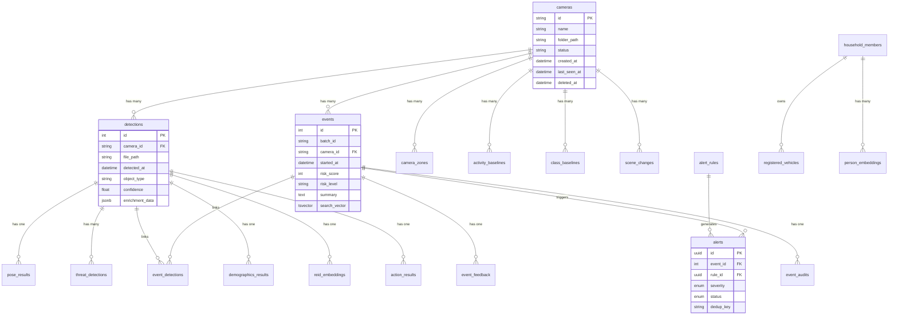
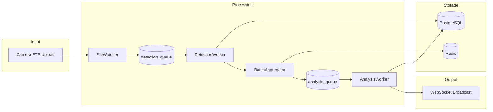

# Data Model Hub

> Documentation hub for the Home Security Intelligence System database architecture.

This directory contains comprehensive documentation for the data model, including PostgreSQL tables, Redis data structures, indexes, and migration patterns.

## Quick Navigation

| Document                                                | Description                                   |
| ------------------------------------------------------- | --------------------------------------------- |
| [Core Entities](./core-entities.md)                     | Camera, Detection, Event models               |
| [Auxiliary Tables](./auxiliary-tables.md)               | GPUStats, AuditLog, Jobs, Baselines           |
| [Indexes and Performance](./indexes-and-performance.md) | GIN indexes, BRIN indexes, query optimization |
| [Migrations](./migrations.md)                           | Alembic patterns and examples                 |
| [Redis Data Structures](./redis-data-structures.md)     | Queues, batch state, pub/sub channels         |

## Entity Relationship Overview

## Storage Architecture

The system uses a dual-storage architecture optimized for different workloads:

| Storage        | Technology | Purpose                                     | Persistence           |
| -------------- | ---------- | ------------------------------------------- | --------------------- |
| **Primary DB** | PostgreSQL | Permanent records, audit trail, analytics   | Durable               |
| **Cache/MQ**   | Redis      | Queues, pub/sub, batch state, deduplication | Ephemeral (TTL-based) |

### Data Flow

## Key Design Decisions

### Junction Table for Event-Detection Relationships

Events and Detections have a many-to-many relationship managed through the `event_detections` junction table (`backend/models/event_detection.py:10-30`). This provides:

- Proper foreign key constraints with cascade deletes
- Efficient querying of detections per event
- Database-enforced referential integrity

### Soft Deletes

Camera and Event models support soft deletion via `deleted_at` timestamp columns:

- Preserves referential integrity with related records
- Enables audit trail and potential recovery
- See `backend/models/camera.py:102-104` and `backend/models/event.py:64-67`

### Full-Text Search

Events support PostgreSQL full-text search via `search_vector` TSVECTOR column:

- Combines summary, reasoning, and object_types
- GIN-indexed for efficient searching
- See `backend/models/event.py:61-62`

## Table Summary

### Core Tables

| Table              | Purpose                    | Primary Key | Source                                 |
| ------------------ | -------------------------- | ----------- | -------------------------------------- |
| `cameras`          | Camera configuration       | `id` (str)  | `backend/models/camera.py:63-92`       |
| `detections`       | Object detection results   | `id` (int)  | `backend/models/detection.py:28-141`   |
| `events`           | Aggregated security events | `id` (int)  | `backend/models/event.py:21-155`       |
| `event_detections` | Event-Detection junction   | composite   | `backend/models/event_detection.py:10` |

### Alerting Tables

| Table         | Purpose                     | Primary Key | Source                    |
| ------------- | --------------------------- | ----------- | ------------------------- |
| `alerts`      | Generated notifications     | `id` (uuid) | `backend/models/alert.py` |
| `alert_rules` | Alert condition definitions | `id` (uuid) | `backend/models/alert.py` |

### Enrichment Tables

| Table                  | Purpose                  | Primary Key | Source                         |
| ---------------------- | ------------------------ | ----------- | ------------------------------ |
| `pose_results`         | Body posture detection   | `id` (int)  | `backend/models/enrichment.py` |
| `threat_detections`    | Weapon detection         | `id` (int)  | `backend/models/enrichment.py` |
| `demographics_results` | Age/gender estimation    | `id` (int)  | `backend/models/enrichment.py` |
| `reid_embeddings`      | Person re-identification | `id` (int)  | `backend/models/enrichment.py` |
| `action_results`       | Action recognition       | `id` (int)  | `backend/models/enrichment.py` |

### System Tables

| Table        | Purpose                 | Primary Key | Source                        |
| ------------ | ----------------------- | ----------- | ----------------------------- |
| `gpu_stats`  | GPU performance metrics | `id` (int)  | `backend/models/gpu_stats.py` |
| `audit_logs` | Security audit trail    | `id` (int)  | `backend/models/audit.py`     |
| `logs`       | Application logs        | `id` (int)  | `backend/models/log.py`       |
| `jobs`       | Background job tracking | `id` (str)  | `backend/models/job.py`       |

### Zone Intelligence Tables

| Table                     | Purpose                                | Primary Key | Source                                    |
| ------------------------- | -------------------------------------- | ----------- | ----------------------------------------- |
| `zone_activity_baselines` | Zone activity patterns and statistics  | `id` (uuid) | `backend/models/zone_baseline.py`         |
| `zone_anomalies`          | Detected zone activity anomalies       | `id` (str)  | `backend/models/zone_anomaly.py`          |
| `zone_household_configs`  | Zone-household linkage and permissions | `id` (int)  | `backend/models/zone_household_config.py` |

### Tracking Tables

| Table                | Purpose                           | Primary Key | Source                         |
| -------------------- | --------------------------------- | ----------- | ------------------------------ |
| `tracks`             | Object movement trajectories      | `id` (int)  | `backend/models/track.py`      |
| `entities`           | Unique persons/objects for re-ID  | `id` (uuid) | `backend/models/entity.py`     |
| `dwell_time_records` | Object presence duration in zones | `id` (int)  | `backend/models/dwell_time.py` |

### Face Recognition Tables

| Table                   | Purpose                        | Primary Key | Source                            |
| ----------------------- | ------------------------------ | ----------- | --------------------------------- |
| `known_persons`         | Registered persons for face ID | `id` (int)  | `backend/models/face_identity.py` |
| `face_embeddings`       | ArcFace embeddings per person  | `id` (int)  | `backend/models/face_identity.py` |
| `face_detection_events` | Face detection event records   | `id` (int)  | `backend/models/face_identity.py` |

### Action Recognition Tables

| Table           | Purpose                           | Primary Key | Source                           |
| --------------- | --------------------------------- | ----------- | -------------------------------- |
| `action_events` | X-CLIP action recognition results | `id` (int)  | `backend/models/action_event.py` |

### Visualization Tables

| Table          | Purpose                      | Primary Key | Source                      |
| -------------- | ---------------------------- | ----------- | --------------------------- |
| `heatmap_data` | Aggregated activity heatmaps | `id` (int)  | `backend/models/heatmap.py` |

### Configuration Tables

| Table             | Purpose                    | Primary Key | Source                             |
| ----------------- | -------------------------- | ----------- | ---------------------------------- |
| `prompt_versions` | AI prompt version tracking | `id` (int)  | `backend/models/prompt_version.py` |

## Related Documentation

- [Database Configuration](../../../backend/core/database.py) - Connection pooling, async setup
- [Redis Configuration](../../../backend/core/redis.py) - Queue management, pub/sub
- [Existing Data Model Reference](../data-model.md) - Legacy comprehensive reference

## Related Hubs

- [Detection Pipeline](../detection-pipeline/README.md) - Detection creation
- [AI Orchestration](../ai-orchestration/README.md) - Event creation
- [API Reference](../api-reference/README.md) - Data access endpoints
