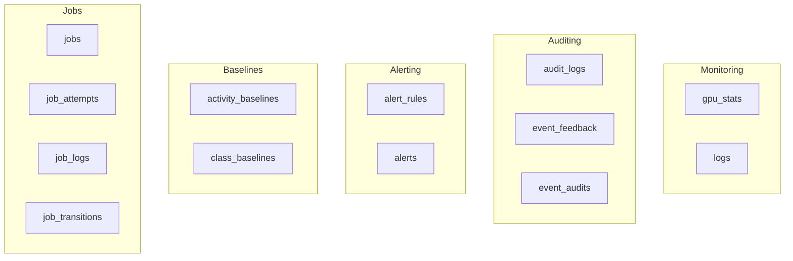

# Auxiliary Tables

> GPUStats, AuditLog, Jobs, Baselines, and other supporting tables.

## Overview

Auxiliary tables support system monitoring, auditing, alerting, and machine learning baseline tracking.



---

## GPU Stats

**Source:** `backend/models/gpu_stats.py`

**Table Name:** `gpu_stats`

### Schema Definition

| Column                         | Type           | Nullable | Default | Description                     |
| ------------------------------ | -------------- | -------- | ------- | ------------------------------- |
| `id`                           | `Integer`      | NO       | Auto    | Primary key                     |
| `recorded_at`                  | `DateTime(tz)` | NO       | `now()` | Sample timestamp                |
| `gpu_name`                     | `String(255)`  | YES      | `NULL`  | GPU model name                  |
| `gpu_utilization`              | `Float`        | YES      | `NULL`  | GPU compute utilization (0-100) |
| `memory_used`                  | `Integer`      | YES      | `NULL`  | VRAM used in MB                 |
| `memory_total`                 | `Integer`      | YES      | `NULL`  | Total VRAM in MB                |
| `temperature`                  | `Float`        | YES      | `NULL`  | GPU temperature (Celsius)       |
| `power_usage`                  | `Float`        | YES      | `NULL`  | Power consumption (Watts)       |
| `inference_fps`                | `Float`        | YES      | `NULL`  | Inference throughput            |
| `fan_speed`                    | `Integer`      | YES      | `NULL`  | Fan speed percentage            |
| `sm_clock`                     | `Integer`      | YES      | `NULL`  | SM clock (MHz)                  |
| `memory_bandwidth_utilization` | `Float`        | YES      | `NULL`  | Memory bandwidth (0-100)        |
| `pstate`                       | `Integer`      | YES      | `NULL`  | Performance state               |
| `throttle_reasons`             | `Integer`      | YES      | `NULL`  | Throttle reason bitmask         |
| `power_limit`                  | `Float`        | YES      | `NULL`  | Power limit (Watts)             |
| `sm_clock_max`                 | `Integer`      | YES      | `NULL`  | Max SM clock (MHz)              |
| `compute_processes_count`      | `Integer`      | YES      | `NULL`  | Active compute processes        |
| `pcie_replay_counter`          | `Integer`      | YES      | `NULL`  | PCIe replay counter             |
| `temp_slowdown_threshold`      | `Float`        | YES      | `NULL`  | Thermal throttle threshold      |
| `memory_clock`                 | `Integer`      | YES      | `NULL`  | Memory clock (MHz)              |
| `memory_clock_max`             | `Integer`      | YES      | `NULL`  | Max memory clock (MHz)          |
| `pcie_link_gen`                | `Integer`      | YES      | `NULL`  | PCIe generation                 |
| `pcie_link_width`              | `Integer`      | YES      | `NULL`  | PCIe lane width                 |
| `pcie_tx_throughput`           | `Integer`      | YES      | `NULL`  | PCIe TX throughput (KB/s)       |
| `pcie_rx_throughput`           | `Integer`      | YES      | `NULL`  | PCIe RX throughput (KB/s)       |
| `encoder_utilization`          | `Integer`      | YES      | `NULL`  | Video encoder utilization       |
| `decoder_utilization`          | `Integer`      | YES      | `NULL`  | Video decoder utilization       |
| `bar1_used`                    | `Integer`      | YES      | `NULL`  | BAR1 memory used (MB)           |

### Indexes

| Index Name                      | Columns       | Type | Purpose                   |
| ------------------------------- | ------------- | ---- | ------------------------- |
| `ix_gpu_stats_recorded_at_brin` | `recorded_at` | BRIN | Time-series range queries |

**Source:** `backend/alembic/versions/e36700c35af6_initial_schema.py:251-253`

---

## Audit Logs

**Source:** `backend/models/audit.py`

**Table Name:** `audit_logs`

### Schema Definition

| Column          | Type           | Nullable | Default     | Description                   |
| --------------- | -------------- | -------- | ----------- | ----------------------------- |
| `id`            | `Integer`      | NO       | Auto        | Primary key                   |
| `timestamp`     | `DateTime(tz)` | NO       | `now()`     | When action occurred          |
| `action`        | `String(50)`   | NO       | -           | Action type                   |
| `resource_type` | `String(50)`   | NO       | -           | Type of resource affected     |
| `resource_id`   | `String(255)`  | YES      | `NULL`      | ID of affected resource       |
| `actor`         | `String(100)`  | NO       | -           | Who performed the action      |
| `ip_address`    | `String(45)`   | YES      | `NULL`      | Client IP address             |
| `user_agent`    | `Text`         | YES      | `NULL`      | Browser user agent            |
| `details`       | `JSONB`        | YES      | `NULL`      | Additional structured context |
| `status`        | `String(20)`   | NO       | `"success"` | Action status                 |

### Constraints

```sql
CHECK (status IN ('success', 'failure'))
```

**Source:** `backend/alembic/versions/e36700c35af6_initial_schema.py:168`

### Indexes

| Index Name                     | Columns                      | Type   | Purpose                   |
| ------------------------------ | ---------------------------- | ------ | ------------------------- |
| `idx_audit_logs_timestamp`     | `timestamp`                  | B-tree | Time-range queries        |
| `idx_audit_logs_action`        | `action`                     | B-tree | Filter by action type     |
| `idx_audit_logs_resource_type` | `resource_type`              | B-tree | Filter by resource type   |
| `idx_audit_logs_actor`         | `actor`                      | B-tree | Filter by actor           |
| `idx_audit_logs_status`        | `status`                     | B-tree | Filter by status          |
| `idx_audit_logs_resource`      | `resource_type, resource_id` | B-tree | Combined resource lookup  |
| `ix_audit_logs_timestamp_brin` | `timestamp`                  | BRIN   | Time-series range queries |

**Source:** `backend/alembic/versions/e36700c35af6_initial_schema.py:170-178`

---

## Application Logs

**Source:** `backend/models/log.py`

**Table Name:** `logs`

### Schema Definition

| Column          | Type           | Nullable | Default     | Description                   |
| --------------- | -------------- | -------- | ----------- | ----------------------------- |
| `id`            | `Integer`      | NO       | Auto        | Primary key                   |
| `timestamp`     | `DateTime(tz)` | NO       | `now()`     | Log timestamp                 |
| `level`         | `String(10)`   | NO       | -           | Log level                     |
| `component`     | `String(50)`   | NO       | -           | Module/service name           |
| `message`       | `Text`         | NO       | -           | Log message text              |
| `camera_id`     | `String(100)`  | YES      | `NULL`      | Associated camera ID          |
| `event_id`      | `Integer`      | YES      | `NULL`      | Associated event ID           |
| `request_id`    | `String(36)`   | YES      | `NULL`      | Request correlation ID        |
| `detection_id`  | `Integer`      | YES      | `NULL`      | Associated detection ID       |
| `duration_ms`   | `Integer`      | YES      | `NULL`      | Operation duration (ms)       |
| `extra`         | `JSONB`        | YES      | `NULL`      | Additional structured context |
| `source`        | `String(10)`   | NO       | `"backend"` | Log source                    |
| `user_agent`    | `Text`         | YES      | `NULL`      | Browser user agent            |
| `search_vector` | `TSVECTOR`     | YES      | `NULL`      | Full-text search vector       |

### Constraints

```sql
CHECK (level IN ('DEBUG', 'INFO', 'WARNING', 'ERROR', 'CRITICAL'))
CHECK (source IN ('backend', 'frontend'))
```

**Source:** `backend/alembic/versions/e36700c35af6_initial_schema.py:201-203`

### Indexes

| Index Name               | Columns         | Type   | Purpose                   |
| ------------------------ | --------------- | ------ | ------------------------- |
| `idx_logs_timestamp`     | `timestamp`     | B-tree | Time-range queries        |
| `idx_logs_level`         | `level`         | B-tree | Filter by severity        |
| `idx_logs_component`     | `component`     | B-tree | Filter by module          |
| `idx_logs_camera_id`     | `camera_id`     | B-tree | Camera-specific logs      |
| `idx_logs_source`        | `source`        | B-tree | Separate backend/frontend |
| `ix_logs_timestamp_brin` | `timestamp`     | BRIN   | Time-series range queries |
| `idx_logs_search_vector` | `search_vector` | GIN    | Full-text search          |

**Source:** `backend/alembic/versions/e36700c35af6_initial_schema.py:205-211`

---

## Alert Rules

**Source:** `backend/models/alert.py`

**Table Name:** `alert_rules`

### Schema Definition

| Column               | Type           | Nullable | Default                   | Description                   |
| -------------------- | -------------- | -------- | ------------------------- | ----------------------------- |
| `id`                 | `UUID`         | NO       | -                         | Primary key                   |
| `name`               | `String(255)`  | NO       | -                         | Rule name                     |
| `description`        | `Text`         | YES      | `NULL`                    | Rule description              |
| `enabled`            | `Boolean`      | NO       | `True`                    | Whether rule is active        |
| `severity`           | `ENUM`         | NO       | `"medium"`                | Severity for triggered alerts |
| `risk_threshold`     | `Integer`      | YES      | `NULL`                    | Minimum risk score (0-100)    |
| `object_types`       | `JSON`         | YES      | `NULL`                    | Object types to match         |
| `camera_ids`         | `JSON`         | YES      | `NULL`                    | Camera IDs to apply to        |
| `zone_ids`           | `JSON`         | YES      | `NULL`                    | Zone IDs to match             |
| `min_confidence`     | `Float`        | YES      | `NULL`                    | Minimum detection confidence  |
| `schedule`           | `JSON`         | YES      | `NULL`                    | Time-based conditions         |
| `conditions`         | `JSON`         | YES      | `NULL`                    | Legacy conditions             |
| `dedup_key_template` | `String(255)`  | NO       | `"{camera_id}:{rule_id}"` | Deduplication key template    |
| `cooldown_seconds`   | `Integer`      | NO       | `300`                     | Cooldown period (seconds)     |
| `channels`           | `JSON`         | YES      | `NULL`                    | Notification channels         |
| `created_at`         | `DateTime(tz)` | NO       | `now()`                   | Creation timestamp            |
| `updated_at`         | `DateTime(tz)` | NO       | `now()`                   | Last update timestamp         |

### Constraints

```sql
CHECK (risk_threshold IS NULL OR (risk_threshold >= 0 AND risk_threshold <= 100))
CHECK (min_confidence IS NULL OR (min_confidence >= 0.0 AND min_confidence <= 1.0))
CHECK (cooldown_seconds >= 0)
```

**Source:** `backend/alembic/versions/e36700c35af6_initial_schema.py:139-146`

### Indexes

| Index Name                 | Columns    | Type   | Purpose             |
| -------------------------- | ---------- | ------ | ------------------- |
| `idx_alert_rules_name`     | `name`     | B-tree | Search by name      |
| `idx_alert_rules_enabled`  | `enabled`  | B-tree | Filter active rules |
| `idx_alert_rules_severity` | `severity` | B-tree | Filter by severity  |

**Source:** `backend/alembic/versions/e36700c35af6_initial_schema.py:148-150`

---

## Alerts

**Source:** `backend/models/alert.py`

**Table Name:** `alerts`

### Schema Definition

| Column         | Type           | Nullable | Default     | Description                 |
| -------------- | -------------- | -------- | ----------- | --------------------------- |
| `id`           | `UUID`         | NO       | -           | Primary key                 |
| `event_id`     | `Integer` (FK) | NO       | -           | Reference to events.id      |
| `rule_id`      | `UUID` (FK)    | YES      | `NULL`      | Reference to alert_rules.id |
| `severity`     | `ENUM`         | NO       | `"medium"`  | Alert severity              |
| `status`       | `ENUM`         | NO       | `"pending"` | Alert status                |
| `created_at`   | `DateTime(tz)` | NO       | `now()`     | Creation timestamp          |
| `updated_at`   | `DateTime(tz)` | NO       | `now()`     | Last update timestamp       |
| `delivered_at` | `DateTime(tz)` | YES      | `NULL`      | Delivery timestamp          |
| `channels`     | `JSON`         | YES      | `NULL`      | Notification channels used  |
| `dedup_key`    | `String(255)`  | NO       | -           | Deduplication key           |
| `metadata`     | `JSON`         | YES      | `NULL`      | Additional alert context    |
| `version_id`   | `Integer`      | NO       | `1`         | Optimistic locking version  |

### Enum Values

```sql
-- Severity
CREATE TYPE alert_severity AS ENUM ('low', 'medium', 'high', 'critical');

-- Status
CREATE TYPE alert_status AS ENUM ('pending', 'delivered', 'acknowledged', 'dismissed');
```

**Source:** `backend/alembic/versions/e36700c35af6_initial_schema.py:46-51`

### Indexes

| Index Name                        | Columns                           | Type   | Purpose                       |
| --------------------------------- | --------------------------------- | ------ | ----------------------------- |
| `idx_alerts_event_id`             | `event_id`                        | B-tree | Filter by event               |
| `idx_alerts_rule_id`              | `rule_id`                         | B-tree | Filter by rule                |
| `idx_alerts_severity`             | `severity`                        | B-tree | Filter by severity            |
| `idx_alerts_status`               | `status`                          | B-tree | Filter by status              |
| `idx_alerts_created_at`           | `created_at`                      | B-tree | Time-range queries            |
| `idx_alerts_dedup_key`            | `dedup_key`                       | B-tree | Deduplication lookups         |
| `idx_alerts_dedup_key_created_at` | `dedup_key, created_at`           | B-tree | Combined dedup + time queries |
| `idx_alerts_delivered_at`         | `delivered_at`                    | B-tree | Delivery tracking             |
| `idx_alerts_event_rule_delivered` | `event_id, rule_id, delivered_at` | B-tree | Combined lookup               |

**Source:** `backend/alembic/versions/e36700c35af6_initial_schema.py:1111-1121`

---

## Activity Baselines

**Source:** `backend/models/baseline.py`

**Table Name:** `activity_baselines`

### Schema Definition

| Column         | Type           | Nullable | Default | Description                      |
| -------------- | -------------- | -------- | ------- | -------------------------------- |
| `id`           | `Integer`      | NO       | Auto    | Primary key                      |
| `camera_id`    | `String` (FK)  | NO       | -       | Reference to cameras.id          |
| `hour`         | `Integer`      | NO       | -       | Hour of day (0-23)               |
| `day_of_week`  | `Integer`      | NO       | -       | Day of week (0=Monday, 6=Sunday) |
| `avg_count`    | `Float`        | NO       | `0.0`   | EWMA of activity count           |
| `sample_count` | `Integer`      | NO       | `0`     | Number of samples                |
| `last_updated` | `DateTime(tz)` | NO       | `now()` | Last update timestamp            |

### Constraints

```sql
UNIQUE (camera_id, hour, day_of_week)
CHECK (hour >= 0 AND hour <= 23)
CHECK (day_of_week >= 0 AND day_of_week <= 6)
```

**Source:** `backend/alembic/versions/e36700c35af6_initial_schema.py:900-904`

### Indexes

| Index Name                     | Columns                        | Type   | Purpose              |
| ------------------------------ | ------------------------------ | ------ | -------------------- |
| `idx_activity_baseline_camera` | `camera_id`                    | B-tree | Filter by camera     |
| `idx_activity_baseline_slot`   | `camera_id, hour, day_of_week` | B-tree | Combined slot lookup |

**Source:** `backend/alembic/versions/e36700c35af6_initial_schema.py:906-909`

---

## Class Baselines

**Source:** `backend/models/baseline.py`

**Table Name:** `class_baselines`

### Schema Definition

| Column            | Type           | Nullable | Default | Description                          |
| ----------------- | -------------- | -------- | ------- | ------------------------------------ |
| `id`              | `Integer`      | NO       | Auto    | Primary key                          |
| `camera_id`       | `String` (FK)  | NO       | -       | Reference to cameras.id              |
| `detection_class` | `String`       | NO       | -       | Object class (person, vehicle, etc.) |
| `hour`            | `Integer`      | NO       | -       | Hour of day (0-23)                   |
| `frequency`       | `Float`        | NO       | `0.0`   | EWMA of detection frequency          |
| `sample_count`    | `Integer`      | NO       | `0`     | Number of samples                    |
| `last_updated`    | `DateTime(tz)` | NO       | `now()` | Last update timestamp                |

### Constraints

```sql
UNIQUE (camera_id, detection_class, hour)
CHECK (hour >= 0 AND hour <= 23)
```

**Source:** `backend/alembic/versions/e36700c35af6_initial_schema.py:928-929`

### Indexes

| Index Name                  | Columns                            | Type   | Purpose                 |
| --------------------------- | ---------------------------------- | ------ | ----------------------- |
| `idx_class_baseline_camera` | `camera_id`                        | B-tree | Filter by camera        |
| `idx_class_baseline_class`  | `camera_id, detection_class`       | B-tree | Combined camera + class |
| `idx_class_baseline_slot`   | `camera_id, detection_class, hour` | B-tree | Combined slot lookup    |

**Source:** `backend/alembic/versions/e36700c35af6_initial_schema.py:931-935`

---

## Camera Zones

**Source:** `backend/models/camera_zone.py`

**Table Name:** `camera_zones`

### Schema Definition

| Column        | Type           | Nullable | Default       | Description                  |
| ------------- | -------------- | -------- | ------------- | ---------------------------- |
| `id`          | `String`       | NO       | -             | Primary key (user-defined)   |
| `camera_id`   | `String` (FK)  | NO       | -             | Reference to cameras.id      |
| `name`        | `String(255)`  | NO       | -             | Zone name                    |
| `zone_type`   | `ENUM`         | NO       | `"other"`     | Zone type                    |
| `coordinates` | `JSONB`        | NO       | -             | Normalized coordinates (0-1) |
| `shape`       | `ENUM`         | NO       | `"rectangle"` | Zone shape                   |
| `color`       | `String(7)`    | NO       | `"#3B82F6"`   | Display color (hex)          |
| `enabled`     | `Boolean`      | NO       | `True`        | Whether zone is active       |
| `priority`    | `Integer`      | NO       | `0`           | Zone priority                |
| `created_at`  | `DateTime(tz)` | NO       | `now()`       | Creation timestamp           |
| `updated_at`  | `DateTime(tz)` | NO       | `now()`       | Last update timestamp        |

### Enum Values

```sql
CREATE TYPE camera_zone_type_enum AS ENUM ('entry_point', 'driveway', 'sidewalk', 'yard', 'other');
CREATE TYPE camera_zone_shape_enum AS ENUM ('rectangle', 'polygon');
```

**Source:** `backend/alembic/versions/f1231ed7e32d_rename_zones_to_camera_zones.py:47-48`

### Constraints

```sql
CHECK (priority >= 0)
CHECK (color ~ '^#[0-9A-Fa-f]{6}$')
```

**Source:** `backend/alembic/versions/e36700c35af6_initial_schema.py:758-759`

### Indexes

| Index Name                        | Columns              | Type   | Purpose                   |
| --------------------------------- | -------------------- | ------ | ------------------------- |
| `idx_camera_zones_camera_id`      | `camera_id`          | B-tree | Filter by camera          |
| `idx_camera_zones_enabled`        | `enabled`            | B-tree | Filter active zones       |
| `idx_camera_zones_camera_enabled` | `camera_id, enabled` | B-tree | Combined camera + enabled |

**Source:** `backend/alembic/versions/e36700c35af6_initial_schema.py:761-763`

---

## Jobs

**Source:** `backend/models/job.py`

**Table Name:** `jobs`

### Schema Definition

| Column             | Type           | Nullable | Default    | Description              |
| ------------------ | -------------- | -------- | ---------- | ------------------------ |
| `id`               | `String(36)`   | NO       | -          | Primary key (UUID)       |
| `job_type`         | `String(50)`   | NO       | -          | Job type identifier      |
| `status`           | `String(20)`   | NO       | `"queued"` | Job status               |
| `queue_name`       | `String(100)`  | YES      | `NULL`     | Queue name               |
| `priority`         | `Integer`      | NO       | `2`        | Job priority (0-4)       |
| `created_at`       | `DateTime(tz)` | NO       | `now()`    | Creation timestamp       |
| `started_at`       | `DateTime(tz)` | YES      | `NULL`     | Start timestamp          |
| `completed_at`     | `DateTime(tz)` | YES      | `NULL`     | Completion timestamp     |
| `progress_percent` | `Integer`      | NO       | `0`        | Progress (0-100)         |
| `current_step`     | `String(255)`  | YES      | `NULL`     | Current step description |
| `result`           | `JSONB`        | YES      | `NULL`     | Job result data          |
| `error_message`    | `Text`         | YES      | `NULL`     | Error message            |
| `error_traceback`  | `Text`         | YES      | `NULL`     | Error traceback          |
| `attempt_number`   | `Integer`      | NO       | `1`        | Current attempt number   |
| `max_attempts`     | `Integer`      | NO       | `3`        | Maximum retry attempts   |
| `next_retry_at`    | `DateTime(tz)` | YES      | `NULL`     | Next retry timestamp     |

### Constraints

```sql
CHECK (status IN ('queued', 'running', 'completed', 'failed', 'cancelled'))
CHECK (progress_percent >= 0 AND progress_percent <= 100)
CHECK (priority >= 0 AND priority <= 4)
CHECK (attempt_number >= 1)
CHECK (max_attempts >= 1)
CHECK (completed_at IS NULL OR completed_at >= created_at)
CHECK (started_at IS NULL OR started_at >= created_at)
```

**Source:** `backend/alembic/versions/e36700c35af6_initial_schema.py:281-296`

### Indexes

| Index Name                   | Columns              | Type   | Purpose                   |
| ---------------------------- | -------------------- | ------ | ------------------------- |
| `idx_jobs_status`            | `status`             | B-tree | Filter by status          |
| `idx_jobs_job_type`          | `job_type`           | B-tree | Filter by type            |
| `idx_jobs_created_at`        | `created_at`         | B-tree | Time-range queries        |
| `idx_jobs_queue_name`        | `queue_name`         | B-tree | Filter by queue           |
| `idx_jobs_priority`          | `priority`           | B-tree | Priority ordering         |
| `idx_jobs_status_created_at` | `status, created_at` | B-tree | Combined status + time    |
| `idx_jobs_job_type_status`   | `job_type, status`   | B-tree | Combined type + status    |
| `ix_jobs_created_at_brin`    | `created_at`         | BRIN   | Time-series range queries |

**Source:** `backend/alembic/versions/e36700c35af6_initial_schema.py:298-305`

---

## Job Attempts

**Source:** `backend/models/job_attempt.py`

**Table Name:** `job_attempts`

Tracks individual execution attempts for each job. A job can have multiple attempts due to retries.

### Schema Definition

| Column            | Type           | Nullable | Default      | Description                         |
| ----------------- | -------------- | -------- | ------------ | ----------------------------------- |
| `id`              | `UUID`         | NO       | Auto (UUID7) | Primary key                         |
| `job_id`          | `UUID`         | NO       | -            | Reference to parent job             |
| `attempt_number`  | `Integer`      | NO       | `1`          | Sequential attempt number (1-based) |
| `started_at`      | `DateTime(tz)` | NO       | `now()`      | When this attempt started           |
| `ended_at`        | `DateTime(tz)` | YES      | `NULL`       | When this attempt ended             |
| `status`          | `String(20)`   | NO       | `"started"`  | Attempt status                      |
| `worker_id`       | `String(100)`  | YES      | `NULL`       | Worker that processed this attempt  |
| `error_message`   | `Text`         | YES      | `NULL`       | Error message if failed             |
| `error_traceback` | `Text`         | YES      | `NULL`       | Full traceback if failed            |
| `result`          | `JSONB`        | YES      | `NULL`       | Result data if successful           |

### Constraints

```sql
CHECK (status IN ('started', 'succeeded', 'failed', 'cancelled'))
CHECK (attempt_number >= 1)
CHECK (ended_at IS NULL OR ended_at >= started_at)
```

### Indexes

| Index Name                        | Columns                  | Type   | Purpose                   |
| --------------------------------- | ------------------------ | ------ | ------------------------- |
| `idx_job_attempts_job_id`         | `job_id`                 | B-tree | Filter by job             |
| `idx_job_attempts_job_attempt`    | `job_id, attempt_number` | B-tree | Composite job + attempt   |
| `idx_job_attempts_status`         | `status`                 | B-tree | Filter by status          |
| `ix_job_attempts_started_at_brin` | `started_at`             | BRIN   | Time-series range queries |

---

## Job Logs

**Source:** `backend/models/job_log.py`

**Table Name:** `job_logs`

Stores log entries generated during job execution for debugging and audit trails.

### Schema Definition

| Column           | Type           | Nullable | Default      | Description                 |
| ---------------- | -------------- | -------- | ------------ | --------------------------- |
| `id`             | `UUID`         | NO       | Auto (UUID7) | Primary key                 |
| `job_id`         | `UUID`         | NO       | -            | Reference to parent job     |
| `attempt_number` | `Integer`      | NO       | `1`          | Which attempt generated log |
| `timestamp`      | `DateTime(tz)` | NO       | `now()`      | Log entry timestamp         |
| `level`          | `String(10)`   | NO       | `"info"`     | Log level                   |
| `message`        | `Text`         | NO       | -            | Log message                 |
| `context`        | `JSONB`        | YES      | `NULL`       | Optional structured context |

### Constraints

```sql
CHECK (level IN ('debug', 'info', 'warning', 'error'))
CHECK (attempt_number >= 1)
```

### Indexes

| Index Name                   | Columns                  | Type   | Purpose                   |
| ---------------------------- | ------------------------ | ------ | ------------------------- |
| `idx_job_logs_job_id`        | `job_id`                 | B-tree | Filter by job             |
| `idx_job_logs_job_attempt`   | `job_id, attempt_number` | B-tree | Composite job + attempt   |
| `idx_job_logs_level`         | `level`                  | B-tree | Filter by log level       |
| `idx_job_logs_job_timestamp` | `job_id, timestamp`      | B-tree | Combined job + time       |
| `ix_job_logs_timestamp_brin` | `timestamp`              | BRIN   | Time-series range queries |

---

## Job Transitions

**Source:** `backend/models/job_transition.py`

**Table Name:** `job_transitions`

Records all state transitions for jobs, enabling audit trails and debugging of job lifecycle issues.

### Schema Definition

| Column            | Type           | Nullable | Default      | Description                   |
| ----------------- | -------------- | -------- | ------------ | ----------------------------- |
| `id`              | `UUID`         | NO       | Auto (UUID7) | Primary key                   |
| `job_id`          | `String(36)`   | NO       | -            | Reference to parent job       |
| `from_status`     | `String(50)`   | NO       | -            | Previous status               |
| `to_status`       | `String(50)`   | NO       | -            | New status                    |
| `transitioned_at` | `DateTime(tz)` | NO       | `now()`      | When transition occurred      |
| `triggered_by`    | `String(50)`   | NO       | `"worker"`   | What triggered the transition |
| `metadata_json`   | `Text`         | YES      | `NULL`       | Optional transition metadata  |

### Trigger Types

| Trigger   | Description                            |
| --------- | -------------------------------------- |
| `worker`  | Background worker initiated transition |
| `user`    | User action (cancel, retry)            |
| `timeout` | Timeout-based transition               |
| `retry`   | Retry mechanism initiated transition   |
| `system`  | System-initiated (cleanup, recovery)   |

### Indexes

| Index Name                                   | Columns                   | Type   | Purpose             |
| -------------------------------------------- | ------------------------- | ------ | ------------------- |
| `idx_job_transitions_job_id`                 | `job_id`                  | B-tree | Filter by job       |
| `idx_job_transitions_transitioned_at`        | `transitioned_at`         | B-tree | Time-range queries  |
| `idx_job_transitions_job_id_transitioned_at` | `job_id, transitioned_at` | B-tree | Combined job + time |

---

## Export Jobs

**Source:** `backend/models/export_job.py`

**Table Name:** `export_jobs`

Tracks background export jobs including events, alerts, and full backup exports with compliance features.

### Schema Definition

| Column                     | Type           | Nullable | Default      | Description                          |
| -------------------------- | -------------- | -------- | ------------ | ------------------------------------ |
| `id`                       | `UUID`         | NO       | Auto (UUID7) | Primary key                          |
| `status`                   | `ENUM`         | NO       | `"pending"`  | Job status                           |
| `export_type`              | `String(50)`   | NO       | -            | Type (events, alerts, full_backup)   |
| `export_format`            | `String(20)`   | NO       | `"csv"`      | Format (csv, json, zip, excel)       |
| `total_items`              | `Integer`      | YES      | `NULL`       | Total items to export                |
| `processed_items`          | `Integer`      | NO       | `0`          | Items processed so far               |
| `progress_percent`         | `Integer`      | NO       | `0`          | Progress (0-100)                     |
| `current_step`             | `String(255)`  | YES      | `NULL`       | Current step description             |
| `created_at`               | `DateTime(tz)` | NO       | `now()`      | Creation timestamp                   |
| `started_at`               | `DateTime(tz)` | YES      | `NULL`       | Start timestamp                      |
| `completed_at`             | `DateTime(tz)` | YES      | `NULL`       | Completion timestamp                 |
| `estimated_completion`     | `DateTime(tz)` | YES      | `NULL`       | Estimated completion time            |
| `output_path`              | `String(512)`  | YES      | `NULL`       | Path to output file                  |
| `output_size_bytes`        | `Integer`      | YES      | `NULL`       | Output file size                     |
| `error_message`            | `Text`         | YES      | `NULL`       | Error message if failed              |
| `filter_params`            | `Text`         | YES      | `NULL`       | Filter parameters (JSON)             |
| `expires_at`               | `DateTime(tz)` | YES      | +7 days      | File expiration (compliance)         |
| `download_count`           | `Integer`      | NO       | `0`          | Download tracking                    |
| `last_downloaded_at`       | `DateTime(tz)` | YES      | `NULL`       | Last download timestamp              |
| `sensitivity_acknowledged` | `Boolean`      | NO       | `False`      | Data sensitivity acknowledged        |
| `acknowledged_at`          | `DateTime(tz)` | YES      | `NULL`       | Acknowledgment timestamp             |
| `retention_days`           | `Integer`      | YES      | `NULL`       | Custom retention (overrides default) |
| `legal_hold`               | `Boolean`      | NO       | `False`      | Prevents automatic deletion          |
| `compliance_metadata`      | `JSONB`        | YES      | `NULL`       | Audit trail info                     |

### Constraints

```sql
CHECK (progress_percent >= 0 AND progress_percent <= 100)
CHECK (processed_items >= 0)
CHECK (total_items IS NULL OR total_items >= 0)
CHECK (output_size_bytes IS NULL OR output_size_bytes >= 0)
CHECK (download_count >= 0)
CHECK (retention_days IS NULL OR retention_days > 0)
```

### Indexes

| Index Name                          | Columns              | Type   | Purpose                |
| ----------------------------------- | -------------------- | ------ | ---------------------- |
| `idx_export_jobs_status`            | `status`             | B-tree | Filter by status       |
| `idx_export_jobs_export_type`       | `export_type`        | B-tree | Filter by type         |
| `idx_export_jobs_created_at`        | `created_at`         | B-tree | Time-range queries     |
| `idx_export_jobs_status_created_at` | `status, created_at` | B-tree | Combined status + time |
| `idx_export_jobs_expires_at`        | `expires_at`         | B-tree | Expired files cleanup  |
| `idx_export_jobs_legal_hold`        | `legal_hold`         | B-tree | Legal hold queries     |

---

## Backup Jobs

**Source:** `backend/models/backup_job.py`

**Table Name:** `backup_jobs`

Tracks full system backup job progress and results.

### Schema Definition

| Column             | Type           | Nullable | Default      | Description              |
| ------------------ | -------------- | -------- | ------------ | ------------------------ |
| `id`               | `UUID`         | NO       | Auto (UUID7) | Primary key              |
| `status`           | `ENUM`         | NO       | `"pending"`  | Job status               |
| `total_tables`     | `Integer`      | NO       | `8`          | Total tables to backup   |
| `completed_tables` | `Integer`      | NO       | `0`          | Tables backed up         |
| `progress_percent` | `Integer`      | NO       | `0`          | Progress (0-100)         |
| `current_step`     | `String(255)`  | YES      | `NULL`       | Current step description |
| `created_at`       | `DateTime(tz)` | NO       | `now()`      | Creation timestamp       |
| `started_at`       | `DateTime(tz)` | YES      | `NULL`       | Start timestamp          |
| `completed_at`     | `DateTime(tz)` | YES      | `NULL`       | Completion timestamp     |
| `file_path`        | `String(512)`  | YES      | `NULL`       | Path to backup file      |
| `file_size_bytes`  | `Integer`      | YES      | `NULL`       | Backup file size         |
| `manifest_json`    | `JSONB`        | YES      | `NULL`       | Backup manifest          |
| `error_message`    | `Text`         | YES      | `NULL`       | Error message if failed  |

### Constraints

```sql
CHECK (progress_percent >= 0 AND progress_percent <= 100)
```

### Indexes

| Index Name                   | Columns      | Type   | Purpose            |
| ---------------------------- | ------------ | ------ | ------------------ |
| `idx_backup_jobs_status`     | `status`     | B-tree | Filter by status   |
| `idx_backup_jobs_created_at` | `created_at` | B-tree | Time-range queries |

---

## Restore Jobs

**Source:** `backend/models/backup_job.py`

**Table Name:** `restore_jobs`

Tracks system restore job progress from backup files.

### Schema Definition

| Column              | Type           | Nullable | Default      | Description              |
| ------------------- | -------------- | -------- | ------------ | ------------------------ |
| `id`                | `UUID`         | NO       | Auto (UUID7) | Primary key              |
| `status`            | `ENUM`         | NO       | `"pending"`  | Job status               |
| `backup_id`         | `String(64)`   | YES      | `NULL`       | Source backup ID         |
| `backup_created_at` | `DateTime(tz)` | YES      | `NULL`       | Source backup timestamp  |
| `total_tables`      | `Integer`      | NO       | `8`          | Total tables to restore  |
| `completed_tables`  | `Integer`      | NO       | `0`          | Tables restored          |
| `progress_percent`  | `Integer`      | NO       | `0`          | Progress (0-100)         |
| `current_step`      | `String(255)`  | YES      | `NULL`       | Current step description |
| `created_at`        | `DateTime(tz)` | NO       | `now()`      | Creation timestamp       |
| `started_at`        | `DateTime(tz)` | YES      | `NULL`       | Start timestamp          |
| `completed_at`      | `DateTime(tz)` | YES      | `NULL`       | Completion timestamp     |
| `items_restored`    | `JSONB`        | YES      | `NULL`       | Items restored per table |
| `error_message`     | `Text`         | YES      | `NULL`       | Error message if failed  |

### Status Flow

```
pending -> validating -> restoring -> completed
                     \            \-> failed
                      \-> failed
```

### Constraints

```sql
CHECK (progress_percent >= 0 AND progress_percent <= 100)
```

### Indexes

| Index Name                    | Columns      | Type   | Purpose            |
| ----------------------------- | ------------ | ------ | ------------------ |
| `idx_restore_jobs_status`     | `status`     | B-tree | Filter by status   |
| `idx_restore_jobs_created_at` | `created_at` | B-tree | Time-range queries |

---

## Event Feedback

**Source:** `backend/models/event_feedback.py`

**Table Name:** `event_feedback`

### Schema Definition

| Column              | Type           | Nullable | Description                     |
| ------------------- | -------------- | -------- | ------------------------------- |
| `id`                | `Integer`      | NO       | Primary key                     |
| `event_id`          | `Integer` (FK) | NO       | Reference to events.id (unique) |
| `feedback_type`     | `String`       | NO       | Type of feedback                |
| `notes`             | `Text`         | YES      | User notes                      |
| `expected_severity` | `String`       | YES      | User's expected severity        |
| `created_at`        | `DateTime(tz)` | NO       | Feedback timestamp              |

### Constraints

```sql
UNIQUE (event_id)  -- One feedback per event
CHECK (feedback_type IN ('accurate', 'correct', 'false_positive', 'missed_threat', 'severity_wrong'))
CHECK (expected_severity IS NULL OR expected_severity IN ('low', 'medium', 'high', 'critical'))
```

**Source:** `backend/alembic/versions/e36700c35af6_initial_schema.py:1217-1224`

### Indexes

| Index Name                      | Columns         | Type   | Purpose            |
| ------------------------------- | --------------- | ------ | ------------------ |
| `idx_event_feedback_event_id`   | `event_id`      | B-tree | Lookup by event    |
| `idx_event_feedback_type`       | `feedback_type` | B-tree | Filter by type     |
| `idx_event_feedback_created_at` | `created_at`    | B-tree | Time-range queries |

**Source:** `backend/alembic/versions/e36700c35af6_initial_schema.py:1226-1228`

---

## Event Audits

**Source:** `backend/models/event_audit.py`

**Table Name:** `event_audits`

### Schema Definition

| Column                      | Type           | Nullable | Description                       |
| --------------------------- | -------------- | -------- | --------------------------------- |
| `id`                        | `Integer`      | NO       | Primary key                       |
| `event_id`                  | `Integer` (FK) | NO       | Reference to events.id (unique)   |
| `audited_at`                | `DateTime(tz)` | NO       | Audit timestamp                   |
| `has_yolo26`                | `Boolean`      | NO       | Has YOLO26 results                |
| `has_florence`              | `Boolean`      | NO       | Has Florence-2 results            |
| `has_clip`                  | `Boolean`      | NO       | Has CLIP results                  |
| `has_violence`              | `Boolean`      | NO       | Has violence detection            |
| `has_clothing`              | `Boolean`      | NO       | Has clothing analysis             |
| `has_vehicle`               | `Boolean`      | NO       | Has vehicle analysis              |
| `has_pet`                   | `Boolean`      | NO       | Has pet classification            |
| `has_weather`               | `Boolean`      | NO       | Has weather analysis              |
| `has_image_quality`         | `Boolean`      | NO       | Has image quality metrics         |
| `has_zones`                 | `Boolean`      | NO       | Has zone data                     |
| `has_baseline`              | `Boolean`      | NO       | Has baseline comparison           |
| `has_cross_camera`          | `Boolean`      | NO       | Has cross-camera tracking         |
| `prompt_length`             | `Integer`      | NO       | LLM prompt length (chars)         |
| `prompt_token_estimate`     | `Integer`      | NO       | Estimated token count             |
| `enrichment_utilization`    | `Float`        | NO       | Enrichment utilization (0-1)      |
| `context_usage_score`       | `Float`        | YES      | Context usage quality (1-5)       |
| `reasoning_coherence_score` | `Float`        | YES      | Reasoning coherence (1-5)         |
| `risk_justification_score`  | `Float`        | YES      | Risk justification (1-5)          |
| `consistency_score`         | `Float`        | YES      | Consistency score (1-5)           |
| `overall_quality_score`     | `Float`        | YES      | Overall quality (1-5)             |
| `consistency_risk_score`    | `Integer`      | YES      | Risk score from consistency check |
| `consistency_diff`          | `Integer`      | YES      | Risk score difference             |
| `self_eval_critique`        | `Text`         | YES      | Self-evaluation critique          |
| `self_eval_prompt`          | `Text`         | YES      | Self-evaluation prompt            |
| `self_eval_response`        | `Text`         | YES      | Self-evaluation response          |
| `missing_context`           | `Text`         | YES      | Missing context notes             |
| `confusing_sections`        | `Text`         | YES      | Confusing sections notes          |
| `unused_data`               | `Text`         | YES      | Unused data notes                 |
| `format_suggestions`        | `Text`         | YES      | Format improvement suggestions    |
| `model_gaps`                | `Text`         | YES      | Model gap analysis                |

### Constraints

```sql
UNIQUE (event_id)  -- One audit per event
CHECK (enrichment_utilization >= 0.0 AND enrichment_utilization <= 1.0)
CHECK (context_usage_score IS NULL OR (context_usage_score >= 1.0 AND context_usage_score <= 5.0))
CHECK (reasoning_coherence_score IS NULL OR (reasoning_coherence_score >= 1.0 AND reasoning_coherence_score <= 5.0))
CHECK (risk_justification_score IS NULL OR (risk_justification_score >= 1.0 AND risk_justification_score <= 5.0))
CHECK (consistency_score IS NULL OR (consistency_score >= 1.0 AND consistency_score <= 5.0))
CHECK (overall_quality_score IS NULL OR (overall_quality_score >= 1.0 AND overall_quality_score <= 5.0))
```

**Source:** `backend/alembic/versions/e36700c35af6_initial_schema.py:1171-1191`

### Indexes

| Index Name                       | Columns                 | Type   | Purpose                 |
| -------------------------------- | ----------------------- | ------ | ----------------------- |
| `idx_event_audits_event_id`      | `event_id`              | B-tree | Lookup by event         |
| `idx_event_audits_audited_at`    | `audited_at`            | B-tree | Time-range queries      |
| `idx_event_audits_overall_score` | `overall_quality_score` | B-tree | Quality score filtering |

**Source:** `backend/alembic/versions/e36700c35af6_initial_schema.py:1196-1198`

---

## Enrichment Result Tables

### Pose Results

**Table Name:** `pose_results`

| Column          | Type       | Description                             |
| --------------- | ---------- | --------------------------------------- |
| `id`            | `Integer`  | Primary key                             |
| `detection_id`  | `Integer`  | FK to detections.id (unique)            |
| `keypoints`     | `JSONB`    | 17 COCO keypoints [[x, y, conf], ...]   |
| `pose_class`    | `String`   | standing, crouching, bending_over, etc. |
| `confidence`    | `Float`    | Pose confidence (0-1)                   |
| `is_suspicious` | `Boolean`  | Suspicious pose flag                    |
| `created_at`    | `DateTime` | Creation timestamp                      |

**Source:** `backend/alembic/versions/e36700c35af6_initial_schema.py:1322-1366`

### Threat Detections

**Table Name:** `threat_detections`

| Column         | Type       | Description                            |
| -------------- | ---------- | -------------------------------------- |
| `id`           | `Integer`  | Primary key                            |
| `detection_id` | `Integer`  | FK to detections.id                    |
| `threat_type`  | `String`   | gun, knife, grenade, explosive, weapon |
| `confidence`   | `Float`    | Detection confidence (0-1)             |
| `severity`     | `String`   | critical, high, medium, low            |
| `bbox`         | `JSONB`    | Bounding box [x1, y1, x2, y2]          |
| `created_at`   | `DateTime` | Creation timestamp                     |

**Source:** `backend/alembic/versions/e36700c35af6_initial_schema.py:1369-1426`

### Demographics Results

**Table Name:** `demographics_results`

| Column              | Type       | Description                  |
| ------------------- | ---------- | ---------------------------- |
| `id`                | `Integer`  | Primary key                  |
| `detection_id`      | `Integer`  | FK to detections.id (unique) |
| `age_range`         | `String`   | 0-10, 11-20, 21-30, etc.     |
| `age_confidence`    | `Float`    | Age confidence (0-1)         |
| `gender`            | `String`   | male, female, unknown        |
| `gender_confidence` | `Float`    | Gender confidence (0-1)      |
| `created_at`        | `DateTime` | Creation timestamp           |

**Source:** `backend/alembic/versions/e36700c35af6_initial_schema.py:1429-1482`

### ReID Embeddings

**Table Name:** `reid_embeddings`

| Column           | Type       | Description                  |
| ---------------- | ---------- | ---------------------------- |
| `id`             | `Integer`  | Primary key                  |
| `detection_id`   | `Integer`  | FK to detections.id (unique) |
| `embedding`      | `JSONB`    | 512-dim feature vector       |
| `embedding_hash` | `String`   | SHA256 hash for quick lookup |
| `created_at`     | `DateTime` | Creation timestamp           |

**Source:** `backend/alembic/versions/e36700c35af6_initial_schema.py:1485-1518`

### Action Results

**Table Name:** `action_results`

| Column          | Type       | Description                      |
| --------------- | ---------- | -------------------------------- |
| `id`            | `Integer`  | Primary key                      |
| `detection_id`  | `Integer`  | FK to detections.id (unique)     |
| `action`        | `String`   | walking, running, fighting, etc. |
| `confidence`    | `Float`    | Action confidence (0-1)          |
| `is_suspicious` | `Boolean`  | Suspicious action flag           |
| `all_scores`    | `JSONB`    | Dict of action -> score          |
| `created_at`    | `DateTime` | Creation timestamp               |

**Source:** `backend/alembic/versions/e36700c35af6_initial_schema.py:1521-1561`
