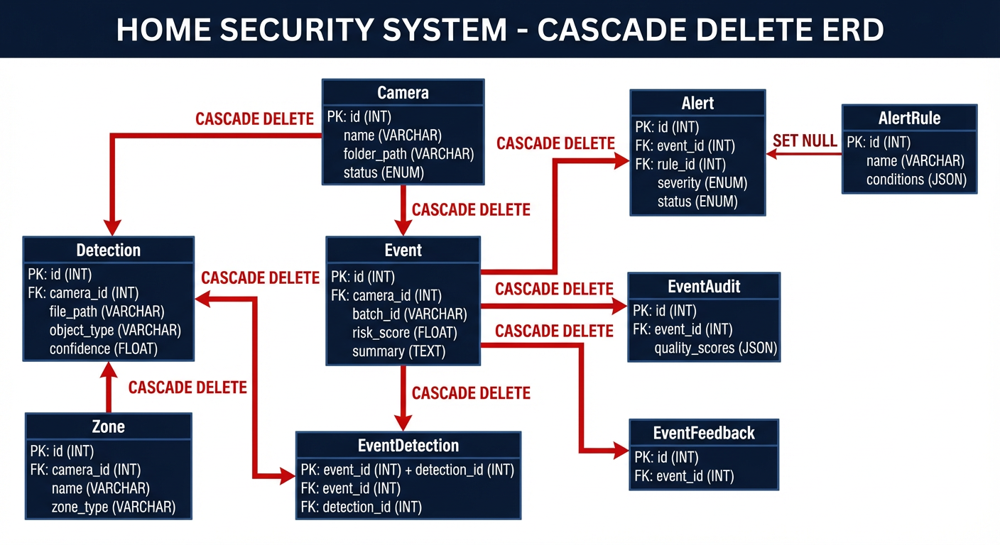
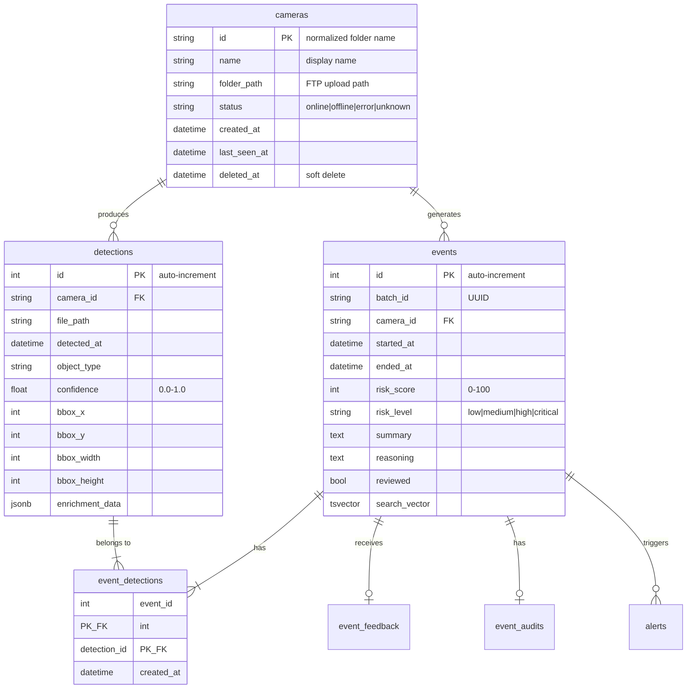

# Core Entities

> Camera, Detection, and Event models form the backbone of the security monitoring system.

## Overview

The three core entities represent the primary data flow:

1. **Camera** - The source of all security footage
2. **Detection** - Individual object detections from YOLO26
3. **Event** - Aggregated security events analyzed by Nemotron LLM


---

## Camera Model

**Source:** `backend/models/camera.py:68-218`

**Table Name:** `cameras`

### Schema Definition

| Column         | Type           | Nullable | Default    | Description                          |
| -------------- | -------------- | -------- | ---------- | ------------------------------------ |
| `id`           | `String`       | NO       | -          | Primary key (normalized folder name) |
| `name`         | `String`       | NO       | -          | Human-readable display name          |
| `folder_path`  | `String`       | NO       | -          | Full path to FTP upload directory    |
| `status`       | `String`       | NO       | `"online"` | Camera status (enum-like)            |
| `created_at`   | `DateTime(tz)` | NO       | `now()`    | Registration timestamp               |
| `last_seen_at` | `DateTime(tz)` | YES      | `NULL`     | Last image received timestamp        |
| `deleted_at`   | `DateTime(tz)` | YES      | `NULL`     | Soft delete timestamp                |
| `property_id`  | `Integer` (FK) | YES      | `NULL`     | Reference to properties table        |

### Status Values

Defined in `backend/models/enums.py`:

```python
class CameraStatus(str, Enum):
    ONLINE = "online"
    OFFLINE = "offline"
    ERROR = "error"
    UNKNOWN = "unknown"
```

### Constraints

```sql
-- Check constraint for status values (backend/models/camera.py:93-96)
CHECK (status IN ('online', 'offline', 'error', 'unknown'))
```

### Indexes

| Index Name                       | Columns       | Type   | Source                        |
| -------------------------------- | ------------- | ------ | ----------------------------- |
| `idx_cameras_name_unique`        | `name`        | UNIQUE | `backend/models/camera.py:89` |
| `idx_cameras_folder_path_unique` | `folder_path` | UNIQUE | `backend/models/camera.py:90` |
| `idx_cameras_property_id`        | `property_id` | B-tree | `backend/models/camera.py:91` |

### Relationships

```python
# backend/models/camera.py:114-163
detections: Mapped[list[Detection]]     # One-to-many, cascade delete
events: Mapped[list[Event]]              # One-to-many, cascade delete
camera_zones: Mapped[list[CameraZone]]   # One-to-many, cascade delete
activity_baselines: Mapped[list[ActivityBaseline]]  # One-to-many
class_baselines: Mapped[list[ClassBaseline]]        # One-to-many
scene_changes: Mapped[list[SceneChange]]            # One-to-many
```

### ID Normalization

Camera IDs are normalized from folder names using `normalize_camera_id()` (`backend/models/camera.py:27-59`):

```python
def normalize_camera_id(folder_name: str) -> str:
    """
    "Front Door" -> "front_door"
    "back-yard"  -> "back_yard"
    "Garage"     -> "garage"
    """
```

### Soft Delete Support

```python
# backend/models/camera.py:165-184
@property
def is_deleted(self) -> bool:
    return self.deleted_at is not None

def soft_delete(self) -> None:
    self.deleted_at = datetime.now(UTC)

def restore(self) -> None:
    self.deleted_at = None
```

---

## Detection Model

**Source:** `backend/models/detection.py:28-206`

**Table Name:** `detections`

### Schema Definition

| Column            | Type           | Nullable | Default   | Description                        |
| ----------------- | -------------- | -------- | --------- | ---------------------------------- |
| `id`              | `Integer`      | NO       | Auto      | Primary key (auto-increment)       |
| `camera_id`       | `String` (FK)  | NO       | -         | Reference to cameras.id            |
| `file_path`       | `String`       | NO       | -         | Full path to source image/video    |
| `file_type`       | `String`       | YES      | `NULL`    | MIME type (e.g., "image/jpeg")     |
| `detected_at`     | `DateTime(tz)` | NO       | `now()`   | Detection timestamp                |
| `object_type`     | `String`       | YES      | `NULL`    | Detected class (person, car, etc.) |
| `confidence`      | `Float`        | YES      | `NULL`    | Detection confidence (0.0-1.0)     |
| `bbox_x`          | `Integer`      | YES      | `NULL`    | Bounding box top-left X            |
| `bbox_y`          | `Integer`      | YES      | `NULL`    | Bounding box top-left Y            |
| `bbox_width`      | `Integer`      | YES      | `NULL`    | Bounding box width                 |
| `bbox_height`     | `Integer`      | YES      | `NULL`    | Bounding box height                |
| `thumbnail_path`  | `String`       | YES      | `NULL`    | Path to cropped thumbnail          |
| `media_type`      | `String`       | YES      | `"image"` | Media type: "image" or "video"     |
| `duration`        | `Float`        | YES      | `NULL`    | Video duration in seconds          |
| `video_codec`     | `String`       | YES      | `NULL`    | Video codec (h264, hevc, etc.)     |
| `video_width`     | `Integer`      | YES      | `NULL`    | Video resolution width             |
| `video_height`    | `Integer`      | YES      | `NULL`    | Video resolution height            |
| `enrichment_data` | `JSONB`        | YES      | `NULL`    | Vision model enrichment results    |
| `search_vector`   | `TSVECTOR`     | YES      | `NULL`    | Full-text search vector            |
| `labels`          | `JSONB`        | YES      | `NULL`    | User-assigned labels               |

### Constraints

```sql
-- backend/models/detection.py:141-152
CHECK (media_type IS NULL OR media_type IN ('image', 'video'))
CHECK (confidence IS NULL OR (confidence >= 0.0 AND confidence <= 1.0))
```

### Indexes

| Index Name                              | Columns                    | Type   | Purpose                        |
| --------------------------------------- | -------------------------- | ------ | ------------------------------ |
| `idx_detections_camera_id`              | `camera_id`                | B-tree | Filter by camera               |
| `idx_detections_detected_at`            | `detected_at`              | B-tree | Time-range queries             |
| `idx_detections_camera_time`            | `camera_id, detected_at`   | B-tree | Combined camera + time filter  |
| `idx_detections_camera_object_type`     | `camera_id, object_type`   | B-tree | Camera-specific class queries  |
| `ix_detections_object_type_detected_at` | `object_type, detected_at` | B-tree | Class-based analytics          |
| `ix_detections_enrichment_data_gin`     | `enrichment_data`          | GIN    | JSONB containment queries (@>) |
| `ix_detections_detected_at_brin`        | `detected_at`              | BRIN   | Time-series range queries      |

**Source:** `backend/models/detection.py:111-139`

### Enrichment Data Structure

The `enrichment_data` JSONB column stores results from 18+ vision models:

```json
{
  "license_plates": [{"text": "ABC123", "confidence": 0.95}],
  "faces": [{"bbox": [10, 20, 100, 120], "embedding": [...]}],
  "clothing": {"upper_color": "blue", "lower_color": "black"},
  "vehicle": {"make": "Toyota", "model": "Camry", "color": "silver"},
  "weather": {"condition": "clear", "visibility": "good"},
  "image_quality": {"blur": 0.1, "brightness": 0.7}
}
```

### Relationships

```python
# backend/models/detection.py:81-108
camera: Mapped[Camera]                      # Many-to-one
event_records: Mapped[list[EventDetection]] # Junction table records

# Enrichment result relationships
pose_result: Mapped[PoseResult | None]
threat_detections: Mapped[list[ThreatDetection]]
demographics_result: Mapped[DemographicsResult | None]
reid_embedding: Mapped[ReIDEmbedding | None]
action_result: Mapped[ActionResult | None]
```

---

## Event Model

**Source:** `backend/models/event.py:34-398`

**Table Name:** `events`

### Schema Definition

| Column          | Type           | Nullable | Default | Description                         |
| --------------- | -------------- | -------- | ------- | ----------------------------------- |
| `id`            | `Integer`      | NO       | Auto    | Primary key (auto-increment)        |
| `batch_id`      | `String`       | NO       | -       | Batch grouping identifier (UUID)    |
| `camera_id`     | `String` (FK)  | NO       | -       | Reference to cameras.id             |
| `started_at`    | `DateTime(tz)` | NO       | -       | First detection timestamp in batch  |
| `ended_at`      | `DateTime(tz)` | YES      | `NULL`  | Last detection timestamp in batch   |
| `risk_score`    | `Integer`      | YES      | `NULL`  | LLM-assigned risk score (0-100)     |
| `risk_level`    | `String`       | YES      | `NULL`  | Risk category (enum-like)           |
| `summary`       | `Text`         | YES      | `NULL`  | LLM-generated event description     |
| `reasoning`     | `Text`         | YES      | `NULL`  | LLM reasoning for risk assessment   |
| `llm_prompt`    | `Text`         | YES      | `NULL`  | Full prompt sent to Nemotron        |
| `reviewed`      | `Boolean`      | NO       | `False` | User review status                  |
| `notes`         | `Text`         | YES      | `NULL`  | User-added notes                    |
| `is_fast_path`  | `Boolean`      | NO       | `False` | Whether event bypassed batching     |
| `object_types`  | `Text`         | YES      | `NULL`  | Cached comma-separated object types |
| `clip_path`     | `String`       | YES      | `NULL`  | Path to generated video clip        |
| `search_vector` | `TSVECTOR`     | YES      | `NULL`  | Full-text search vector             |
| `deleted_at`    | `DateTime(tz)` | YES      | `NULL`  | Soft delete timestamp               |
| `snooze_until`  | `DateTime(tz)` | YES      | `NULL`  | Alert snooze timestamp              |

### Risk Level Values

```python
# backend/models/enums.py
class Severity(str, Enum):
    LOW = "low"
    MEDIUM = "medium"
    HIGH = "high"
    CRITICAL = "critical"
```

### Constraints

```sql
-- backend/models/event.py:211-222
CHECK (risk_level IS NULL OR risk_level IN ('low', 'medium', 'high', 'critical'))
CHECK (risk_score IS NULL OR (risk_score >= 0 AND risk_score <= 100))
CHECK (ended_at IS NULL OR ended_at >= started_at)
```

### Indexes

| Index Name                         | Columns                  | Type    | Purpose                     |
| ---------------------------------- | ------------------------ | ------- | --------------------------- |
| `idx_events_camera_id`             | `camera_id`              | B-tree  | Filter by camera            |
| `idx_events_started_at`            | `started_at`             | B-tree  | Time-range queries          |
| `idx_events_risk_score`            | `risk_score`             | B-tree  | Filter by risk              |
| `idx_events_reviewed`              | `reviewed`               | B-tree  | Find unreviewed events      |
| `idx_events_batch_id`              | `batch_id`               | B-tree  | Lookup by batch             |
| `idx_events_search_vector`         | `search_vector`          | GIN     | Full-text search            |
| `idx_events_risk_level_started_at` | `risk_level, started_at` | B-tree  | Combined risk + time filter |
| `idx_events_export_covering`       | 8 columns                | B-tree  | Covering index for exports  |
| `idx_events_unreviewed`            | `id`                     | Partial | WHERE reviewed = false      |
| `ix_events_started_at_brin`        | `started_at`             | BRIN    | Time-series range queries   |

**Source:** `backend/models/event.py:173-230`

### Relationships

```python
# backend/models/event.py:126-168
camera: Mapped[Camera]                          # Many-to-one
alerts: Mapped[list[Alert]]                     # One-to-many, cascade delete
audit: Mapped[EventAudit | None]                # One-to-one
detection_records: Mapped[list[EventDetection]] # Junction table records
feedback: Mapped[EventFeedback | None]          # One-to-one
detections: Mapped[list[Detection]]             # Many-to-many via junction
```

### Cascade Delete Behavior



When a parent entity is deleted, all related child entities are automatically removed through PostgreSQL's `ON DELETE CASCADE` foreign key constraints. This ensures referential integrity without requiring application-level cleanup.

### Helper Properties

```python
# backend/models/event.py:316-335
@property
def detection_id_list(self) -> list[int]:
    """Get list of detection IDs from the relationship."""
    return [d.id for d in self.detections]

@property
def detection_count(self) -> int:
    """Get count of detections associated with this event."""
    return len(self.detections)
```

---

## Event-Detection Junction Table

**Source:** `backend/models/event_detection.py:10-30`

**Table Name:** `event_detections`

### Schema Definition

| Column         | Type           | Nullable | Description                |
| -------------- | -------------- | -------- | -------------------------- |
| `event_id`     | `Integer` (FK) | NO       | Reference to events.id     |
| `detection_id` | `Integer` (FK) | NO       | Reference to detections.id |
| `created_at`   | `DateTime(tz)` | NO       | Association timestamp      |

**Primary Key:** Composite (`event_id`, `detection_id`)

### Relationships

```python
# backend/models/event_detection.py
event: Mapped[Event] = relationship("Event", back_populates="detection_records")
detection: Mapped[Detection] = relationship("Detection", back_populates="event_records")
```

### Foreign Key Cascade Behavior

Both foreign keys use `ON DELETE CASCADE`:

```python
ForeignKey("events.id", ondelete="CASCADE")
ForeignKey("detections.id", ondelete="CASCADE")
```

---

## Entity Relationship Diagram



---

## Usage Examples

### Creating a Camera

```python
from backend.models.camera import Camera, normalize_camera_id

# Factory method (recommended)
camera = Camera.from_folder_name("Front Door", "/export/foscam/Front Door")
# camera.id = "front_door"
# camera.name = "Front Door"

# Direct creation
camera = Camera(
    id=normalize_camera_id("Back Yard"),
    name="Back Yard",
    folder_path="/export/foscam/Back Yard",
    status="online"
)
```

### Creating a Detection

```python
from backend.models.detection import Detection

detection = Detection(
    camera_id="front_door",
    file_path="/export/foscam/Front Door/image_001.jpg",
    file_type="image/jpeg",
    object_type="person",
    confidence=0.92,
    bbox_x=100, bbox_y=50, bbox_width=200, bbox_height=400
)
```

### Creating an Event with Detections

```python
from backend.models.event import Event
from backend.models.event_detection import EventDetection

event = Event(
    batch_id="abc123-def456",
    camera_id="front_door",
    started_at=datetime.now(UTC),
    risk_score=75,
    risk_level="high",
    summary="Person detected at front door"
)

# Link detections via junction table
for detection_id in [1, 2, 3]:
    event.detection_records.append(
        EventDetection(detection_id=detection_id)
    )
```

### Querying Events with Detections

```python
from sqlalchemy import select
from sqlalchemy.orm import selectinload

# Eager load detections to avoid N+1
stmt = (
    select(Event)
    .options(selectinload(Event.detections))
    .where(Event.camera_id == "front_door")
    .order_by(Event.started_at.desc())
    .limit(10)
)

events = await session.execute(stmt)
for event in events.scalars():
    print(f"Event {event.id}: {event.detection_count} detections")
```
