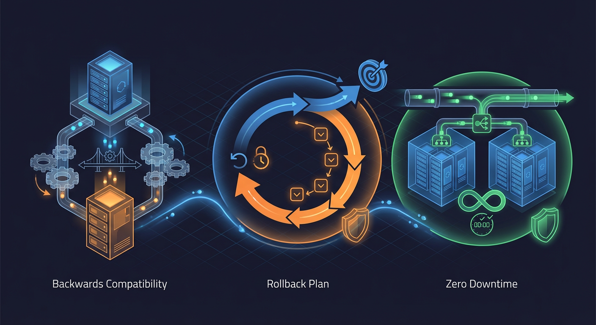

# Migrations

> Alembic patterns, migration examples, and best practices.

## Overview


Database migrations are managed using Alembic with PostgreSQL-specific features. The migration environment is configured in `backend/alembic/env.py`.

### Migration Directory Structure

```
backend/alembic/
├── env.py                 # Alembic environment configuration
├── script.py.mako         # Migration template
├── README                  # Alembic readme
└── versions/              # Migration files
    ├── e36700c35af6_initial_schema.py
    ├── a1b2c3d4e5f6_add_household_organization_model.py
    ├── b2c3d4e5f6g7_add_property_and_area_models.py
    ├── c3d4e5f6g7h8_add_zone_activity_baselines.py
    ├── c3d4e5f6g7h8_add_zone_household_config.py
    ├── d4e5f6g7h8i9_add_zone_anomalies.py
    ├── e5f6g7h8i9j0_enhance_event_feedback_model.py
    ├── f1231ed7e32d_rename_zones_to_camera_zones.py
    ├── f6g7h8i9j0k1_add_dashboard_materialized_views.py
    ├── g7h8i9j0k1l2_add_json_table_enrichment_views.py
    └── h8i9j0k1l2m3_add_pg_notify_triggers_and_partitioning.py
```

---

## Environment Configuration

**Source:** `backend/alembic/env.py:1-310`

The migration environment provides:

- **Transaction Management:** Automatic rollback on failure
- **Error Handling:** Comprehensive logging for debugging
- **Pre-migration Verification:** Database connection health check
- **Post-migration Verification:** State logging after migration

### Database URL Resolution

```python
# backend/alembic/env.py:62-91
def get_database_url() -> str:
    """Get database URL from centralized config or fallback.

    Priority:
    1. Centralized config (Settings.database_url)
    2. alembic.ini sqlalchemy.url setting
    3. Default development URL
    """
    try:
        settings = get_settings()
        url = settings.database_url
        if url:
            # Convert async URL (asyncpg) to sync (psycopg2)
            if "+asyncpg" in url:
                url = url.replace("+asyncpg", "")
            return url
    except Exception:
        pass  # Fall back to alembic.ini

    ini_url = config.get_main_option("sqlalchemy.url")
    return ini_url if ini_url else DEFAULT_DATABASE_URL
```

### Migration Error Handling

```python
# backend/alembic/env.py:245-295
try:
    with context.begin_transaction():
        context.run_migrations()
except IntegrityError as e:
    logger.error(f"Migration failed due to integrity constraint: {e}")
    raise MigrationFailedError(...)
except OperationalError as e:
    logger.error(f"Migration failed due to operational error: {e}")
    raise MigrationFailedError(...)
except ProgrammingError as e:
    logger.error(f"Migration failed due to programming error: {e}")
    raise MigrationFailedError(...)
```

---

## Running Migrations

### Apply All Migrations

```bash
cd backend
uv run alembic upgrade head
```

### Apply Specific Migration

```bash
uv run alembic upgrade e36700c35af6
```

### Rollback One Migration

```bash
uv run alembic downgrade -1
```

### Rollback to Specific Revision

```bash
uv run alembic downgrade e36700c35af6
```

### Show Current Revision

```bash
uv run alembic current
```

### Show Migration History

```bash
uv run alembic history --verbose
```

### Generate New Migration

```bash
# Auto-generate from model changes
uv run alembic revision --autogenerate -m "add_new_feature"

# Empty migration for manual editing
uv run alembic revision -m "add_custom_migration"
```

---

## Migration Patterns

### Pattern 1: Creating Tables with Indexes

**Example:** `backend/alembic/versions/e36700c35af6_initial_schema.py:73-93`

```python
def upgrade() -> None:
    # Create table
    op.create_table(
        "cameras",
        sa.Column("id", sa.String(), nullable=False),
        sa.Column("name", sa.String(), nullable=False),
        sa.Column("folder_path", sa.String(), nullable=False),
        sa.Column("status", sa.String(), nullable=False, server_default="online"),
        sa.Column(
            "created_at",
            sa.DateTime(timezone=True),
            nullable=False,
            server_default=sa.text("now()"),
        ),
        sa.Column("last_seen_at", sa.DateTime(timezone=True), nullable=True),
        sa.Column("deleted_at", sa.DateTime(timezone=True), nullable=True),
        sa.PrimaryKeyConstraint("id"),
        sa.CheckConstraint(
            "status IN ('online', 'offline', 'error', 'unknown')",
            name="ck_cameras_status",
        ),
    )
    # Create indexes
    op.create_index("idx_cameras_name_unique", "cameras", ["name"], unique=True)
    op.create_index("idx_cameras_folder_path_unique", "cameras", ["folder_path"], unique=True)

def downgrade() -> None:
    op.drop_table("cameras")
```

---

### Pattern 2: Creating Enum Types

**Example:** `backend/alembic/versions/e36700c35af6_initial_schema.py:46-67`

```python
def upgrade() -> None:
    # Create enum types BEFORE creating tables that use them
    op.execute("CREATE TYPE alert_severity AS ENUM ('low', 'medium', 'high', 'critical')")
    op.execute(
        "CREATE TYPE alert_status AS ENUM ('pending', 'delivered', 'acknowledged', 'dismissed')"
    )
    op.execute(
        "CREATE TYPE zone_type_enum AS ENUM ('entry_point', 'driveway', 'sidewalk', 'yard', 'other')"
    )
    op.execute("CREATE TYPE zone_shape_enum AS ENUM ('rectangle', 'polygon')")

def downgrade() -> None:
    # Drop enum types AFTER dropping tables that use them
    op.execute("DROP TYPE IF EXISTS zone_shape_enum")
    op.execute("DROP TYPE IF EXISTS zone_type_enum")
    op.execute("DROP TYPE IF EXISTS alert_status")
    op.execute("DROP TYPE IF EXISTS alert_severity")
```

---

### Pattern 3: Creating GIN Indexes for JSONB

**Example:** `backend/alembic/versions/e36700c35af6_initial_schema.py:812-817`

```python
def upgrade() -> None:
    # GIN index with jsonb_path_ops for containment queries (@>)
    op.create_index(
        "ix_detections_enrichment_data_gin",
        "detections",
        ["enrichment_data"],
        postgresql_using="gin",
        postgresql_ops={"enrichment_data": "jsonb_path_ops"},
    )

def downgrade() -> None:
    op.drop_index("ix_detections_enrichment_data_gin", table_name="detections")
```

---

### Pattern 4: Creating BRIN Indexes

**Example:** `backend/alembic/versions/e36700c35af6_initial_schema.py:819-820`

```python
def upgrade() -> None:
    # BRIN index for time-series data (append-only tables)
    op.create_index(
        "ix_detections_detected_at_brin",
        "detections",
        ["detected_at"],
        postgresql_using="brin",
    )

def downgrade() -> None:
    op.drop_index("ix_detections_detected_at_brin", table_name="detections")
```

---

### Pattern 5: Creating Partial Indexes

**Example:** `backend/alembic/versions/e36700c35af6_initial_schema.py:879-880`

```python
def upgrade() -> None:
    # Partial index for unreviewed events only
    op.create_index(
        "idx_events_unreviewed",
        "events",
        ["id"],
        postgresql_where=sa.text("reviewed = false"),
    )

def downgrade() -> None:
    op.drop_index("idx_events_unreviewed", table_name="events")
```

---

### Pattern 6: Renaming Tables and Constraints

**Example:** `backend/alembic/versions/f1231ed7e32d_rename_zones_to_camera_zones.py:25-48`

```python
def upgrade() -> None:
    """Rename zones table to camera_zones with all constraints and indexes."""

    # Step 1: Rename the table
    op.rename_table("zones", "camera_zones")

    # Step 2: Rename indexes
    op.execute("ALTER INDEX idx_zones_camera_id RENAME TO idx_camera_zones_camera_id")
    op.execute("ALTER INDEX idx_zones_enabled RENAME TO idx_camera_zones_enabled")
    op.execute("ALTER INDEX idx_zones_camera_enabled RENAME TO idx_camera_zones_camera_enabled")

    # Step 3: Rename CHECK constraints
    op.execute(
        "ALTER TABLE camera_zones "
        "RENAME CONSTRAINT ck_zones_priority_non_negative "
        "TO ck_camera_zones_priority_non_negative"
    )
    op.execute(
        "ALTER TABLE camera_zones "
        "RENAME CONSTRAINT ck_zones_color_hex "
        "TO ck_camera_zones_color_hex"
    )

    # Step 4: Rename the enum types
    op.execute("ALTER TYPE zone_type_enum RENAME TO camera_zone_type_enum")
    op.execute("ALTER TYPE zone_shape_enum RENAME TO camera_zone_shape_enum")

def downgrade() -> None:
    # Reverse all operations in reverse order
    op.execute("ALTER TYPE camera_zone_type_enum RENAME TO zone_type_enum")
    op.execute("ALTER TYPE camera_zone_shape_enum RENAME TO zone_shape_enum")
    # ... (remaining reversals)
    op.rename_table("camera_zones", "zones")
```

---

### Pattern 7: Adding Columns with Defaults

```python
def upgrade() -> None:
    # Add column with server-side default
    op.add_column(
        "events",
        sa.Column(
            "snooze_until",
            sa.DateTime(timezone=True),
            nullable=True,
            default=None,
        ),
    )

def downgrade() -> None:
    op.drop_column("events", "snooze_until")
```

---

### Pattern 8: Creating Junction Tables

**Example:** `backend/alembic/versions/e36700c35af6_initial_schema.py:1299-1315`

```python
def upgrade() -> None:
    op.create_table(
        "event_detections",
        sa.Column("event_id", sa.Integer(), nullable=False),
        sa.Column("detection_id", sa.Integer(), nullable=False),
        sa.Column(
            "created_at",
            sa.DateTime(timezone=True),
            nullable=False,
            server_default=sa.text("now()"),
        ),
        sa.PrimaryKeyConstraint("event_id", "detection_id"),
        sa.ForeignKeyConstraint(["event_id"], ["events.id"], ondelete="CASCADE"),
        sa.ForeignKeyConstraint(["detection_id"], ["detections.id"], ondelete="CASCADE"),
    )
    op.create_index("idx_event_detections_event_id", "event_detections", ["event_id"])
    op.create_index("idx_event_detections_detection_id", "event_detections", ["detection_id"])
    op.create_index("idx_event_detections_created_at", "event_detections", ["created_at"])

def downgrade() -> None:
    op.drop_table("event_detections")
```

---

### Pattern 9: Using SAVEPOINT for Safe Queries

**Example:** `backend/alembic/env.py:118-147`

```python
def get_current_revision(connection: Connection) -> str | None:
    """Get current migration revision using SAVEPOINT for safety."""
    try:
        # Use savepoint to isolate this query
        connection.execute(text("SAVEPOINT revision_check"))
        result = connection.execute(text("SELECT version_num FROM alembic_version LIMIT 1"))
        row = result.fetchone()
        connection.execute(text("RELEASE SAVEPOINT revision_check"))
        return row[0] if row else None
    except (ProgrammingError, SQLAlchemyError):
        # Table doesn't exist - rollback savepoint to clear failed state
        try:
            connection.execute(text("ROLLBACK TO SAVEPOINT revision_check"))
        except SQLAlchemyError:
            pass
        return None
```

---

## Best Practices



### 1. Always Include Downgrade

Every `upgrade()` function must have a corresponding `downgrade()` that reverses all operations.

```python
def upgrade() -> None:
    op.add_column("events", sa.Column("new_field", sa.String()))

def downgrade() -> None:
    op.drop_column("events", "new_field")
```

### 2. Use Server Defaults

Use `server_default` instead of Python-side defaults for consistency:

```python
# Good
sa.Column("created_at", sa.DateTime(timezone=True), server_default=sa.text("now()"))

# Avoid
sa.Column("created_at", sa.DateTime(timezone=True), default=datetime.now)
```

### 3. Create Dependencies in Order

Create tables in dependency order (parent tables first):

```python
def upgrade() -> None:
    # 1. Create parent tables first
    op.create_table("cameras", ...)

    # 2. Create child tables that reference parent
    op.create_table(
        "detections",
        sa.Column("camera_id", sa.String(), nullable=False),
        sa.ForeignKeyConstraint(["camera_id"], ["cameras.id"], ondelete="CASCADE"),
        ...
    )

def downgrade() -> None:
    # Drop in reverse order
    op.drop_table("detections")
    op.drop_table("cameras")
```

### 4. Use Descriptive Migration Names

```bash
# Good
uv run alembic revision -m "add_snooze_until_to_events"
uv run alembic revision -m "create_enrichment_result_tables"
uv run alembic revision -m "rename_zones_to_camera_zones"

# Avoid
uv run alembic revision -m "update"
uv run alembic revision -m "changes"
```

### 5. Test Migrations Both Ways

```bash
# Test upgrade
uv run alembic upgrade head

# Test downgrade
uv run alembic downgrade -1

# Test upgrade again
uv run alembic upgrade head
```

### 6. Document Complex Migrations

```python
"""rename zones to camera_zones

Revision ID: f1231ed7e32d
Revises: a1b2c3d4e5f6
Create Date: 2026-01-20 11:37:20.414157

This migration renames the 'zones' table to 'camera_zones' and updates all
related indexes, constraints, and enum types to distinguish detection polygons
from logical Areas in the organizational hierarchy.

Related: NEM-3130, NEM-3113 (Orphaned Infrastructure Integration)
"""
```

### 7. Handle Data Migrations Carefully

For migrations that modify existing data:

```python
def upgrade() -> None:
    # Add column with nullable
    op.add_column("events", sa.Column("risk_level", sa.String(), nullable=True))

    # Backfill data
    op.execute("""
        UPDATE events
        SET risk_level = CASE
            WHEN risk_score >= 85 THEN 'critical'
            WHEN risk_score >= 60 THEN 'high'
            WHEN risk_score >= 30 THEN 'medium'
            ELSE 'low'
        END
        WHERE risk_score IS NOT NULL AND risk_level IS NULL
    """)

    # Make non-nullable if needed (only after backfill)
    # op.alter_column("events", "risk_level", nullable=False)
```

---

## Troubleshooting

### Migration Stuck or Failed

```bash
# Check current state
uv run alembic current

# Check history
uv run alembic history

# Stamp to specific revision (use with caution)
uv run alembic stamp head
```

### Conflict Resolution

When two developers create migrations with the same down_revision:

```python
# Option 1: Merge heads
uv run alembic merge heads -m "merge_migrations"

# Option 2: Manually edit down_revision
# Edit the newer migration to reference the correct parent
```

### Database Out of Sync

```bash
# Compare database to models (dry run)
uv run alembic revision --autogenerate -m "check_differences" --sql

# If no differences, stamp to current
uv run alembic stamp head
```
