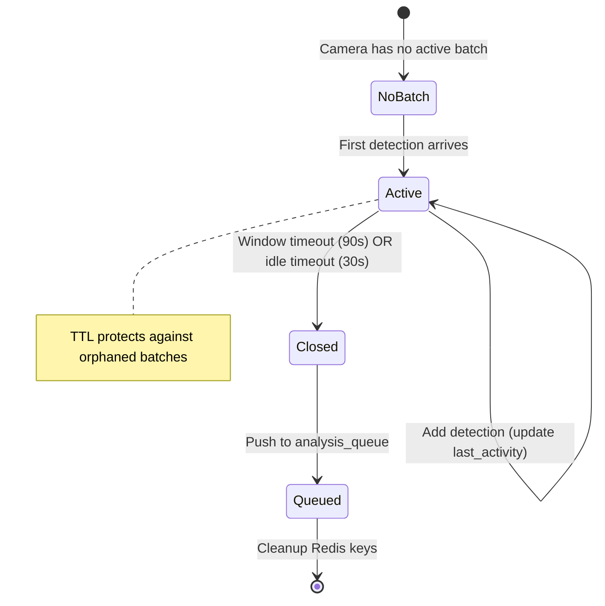

# Redis Data Structures

> Queue formats, batch state, pub/sub keys, and caching patterns.

## Overview

Redis provides ephemeral storage for the AI pipeline, handling queues, pub/sub messaging, batch state management, and deduplication caching. All Redis data is reconstructable from PostgreSQL, allowing recovery after Redis restarts.

**Source:** `backend/core/redis.py:1-2566`

### Connection Pools

The Redis client supports dedicated connection pools for different workload types (`backend/core/redis.py:55-71`):

| Pool Type   | Purpose                             | Typical Config     |
| ----------- | ----------------------------------- | ------------------ |
| `CACHE`     | Get/set/delete operations           | Fast, high avail   |
| `QUEUE`     | BLPOP/RPUSH operations (can block)  | Tolerates blocking |
| `PUBSUB`    | Long-lived subscription connections | Dedicated conn     |
| `RATELIMIT` | High-frequency rate limiting        | Fast, high freq    |
| `DEFAULT`   | Fallback when dedicated disabled    | General purpose    |

---

## Processing Queues

### Detection Queue

**Key:** `detection_queue`

**Type:** Redis List (FIFO)

**Purpose:** Holds image paths waiting for YOLO26 object detection.

**Operations:**

- **Producer:** FileWatcher (`RPUSH`)
- **Consumer:** DetectionQueueWorker (`BLPOP`)

**Item Schema:**

```json
{
  "camera_id": "front_door",
  "file_path": "/export/foscam/Front Door/image_001.jpg",
  "timestamp": "2026-01-24T10:30:00.000000"
}
```

**Configuration:**

| Setting                        | Default  | Description                   |
| ------------------------------ | -------- | ----------------------------- |
| `queue_max_size`               | `10000`  | Maximum items before overflow |
| `queue_overflow_policy`        | `reject` | Overflow handling policy      |
| `queue_backpressure_threshold` | `0.8`    | Warning threshold (80%)       |

---

### Analysis Queue

**Key:** `analysis_queue`

**Type:** Redis List (FIFO)

**Purpose:** Holds completed batches waiting for Nemotron LLM risk analysis.

**Operations:**

- **Producer:** BatchAggregator (`RPUSH`)
- **Consumer:** AnalysisQueueWorker (`BLPOP`)

**Item Schema:**

```json
{
  "batch_id": "abc123-def456",
  "camera_id": "front_door",
  "detection_ids": [1, 2, 3],
  "started_at": "2026-01-24T10:30:00.000000",
  "ended_at": "2026-01-24T10:31:30.000000"
}
```

---

## Dead Letter Queues

Failed items are moved to dead letter queues for manual review and reprocessing.

### Detection DLQ

**Key:** `dlq:detection_queue`

**Type:** Redis List

**Purpose:** Stores detection jobs that failed after max retries.

### Analysis DLQ

**Key:** `dlq:analysis_queue`

**Type:** Redis List

**Purpose:** Stores analysis jobs that failed after max retries.

### DLQ Item Schema

```json
{
  "original_job": {
    "camera_id": "front_door",
    "file_path": "/export/foscam/Front Door/image_001.jpg",
    "timestamp": "2026-01-24T10:30:00.000000"
  },
  "error": "Connection refused: detector service unavailable",
  "attempt_count": 3,
  "first_failed_at": "2026-01-24T10:30:05.000000",
  "last_failed_at": "2026-01-24T10:30:15.000000",
  "queue_name": "detection_queue"
}
```

### Overflow DLQ

**Key:** `dlq:overflow:{queue_name}`

**Type:** Redis List

**Purpose:** Stores items moved from main queues due to overflow when using `dlq` policy.

**Source:** `backend/core/redis.py:794-836`

---

## Queue Overflow Policies

**Source:** `backend/core/redis.py:74-79`

| Policy        | Behavior                                        |
| ------------- | ----------------------------------------------- |
| `REJECT`      | Return error when queue full, item NOT added    |
| `DLQ`         | Move oldest items to DLQ before adding new item |
| `DROP_OLDEST` | Log warning and trim oldest items (legacy)      |

### Safe Queue Add

The `add_to_queue_safe()` method (`backend/core/redis.py:701-875`) provides backpressure handling:

```python
result = await redis.add_to_queue_safe(
    queue_name="detection_queue",
    data={"camera_id": "front_door", "file_path": "/path/to/image.jpg"},
    max_size=10000,
    overflow_policy="dlq",
)
# result.success, result.queue_length, result.moved_to_dlq_count
```

---

## Batch Aggregation State

Batch state is stored in Redis with TTL protection to prevent orphaned batches.

### Key Patterns

| Key Pattern                      | Type   | TTL  | Description                     |
| -------------------------------- | ------ | ---- | ------------------------------- |
| `batch:{camera_id}:current`      | String | 1 hr | Current batch ID for camera     |
| `batch:{batch_id}:camera_id`     | String | 1 hr | Camera ID for batch             |
| `batch:{batch_id}:detections`    | String | 1 hr | JSON list of detection IDs      |
| `batch:{batch_id}:started_at`    | String | 1 hr | Batch start timestamp (float)   |
| `batch:{batch_id}:last_activity` | String | 1 hr | Last activity timestamp (float) |

### Batch Lifecycle



---

## Deduplication Cache

Prevents duplicate processing of the same image content.

### Key Pattern

**Key:** `dedupe:{sha256_hash}`

**Type:** String

**Value:** File path

**TTL:** 5 minutes (configurable via `DEDUPE_TTL_SECONDS`)

### Usage

```python
# Check if image was already processed
hash_key = f"dedupe:{sha256_hash}"
existing = await redis.get(hash_key)

if existing:
    # Skip duplicate
    return

# Mark as processed
await redis.set(hash_key, file_path, expire=300)
```

---

## Pub/Sub Channels

Redis pub/sub provides real-time event broadcasting to WebSocket clients.

### Security Events Channel

**Channel:** `security_events`

**Purpose:** Broadcasts new security events after LLM analysis completes.

**Message Schema:**

```json
{
  "type": "event",
  "data": {
    "id": 1,
    "event_id": 1,
    "batch_id": "abc123",
    "camera_id": "front_door",
    "risk_score": 75,
    "risk_level": "high",
    "summary": "Person detected at front door",
    "started_at": "2026-01-24T12:00:00.000000",
    "detection_count": 3
  }
}
```

### System Status Channel

**Channel:** `system_status`

**Purpose:** Broadcasts periodic system health and status updates.

**Message Schema:**

```json
{
  "type": "status",
  "data": {
    "timestamp": "2026-01-24T12:00:00.000000",
    "queue_depths": {
      "detection_queue": 5,
      "analysis_queue": 2
    },
    "gpu_utilization": 45.2,
    "cameras_online": 4
  }
}
```

### Subscribing to Channels

**Source:** `backend/core/redis.py:1101-1138`

```python
# Shared PubSub (for simple cases)
pubsub = await redis.subscribe("security_events")

# Dedicated PubSub (for long-lived listeners)
pubsub = await redis.subscribe_dedicated("security_events", "system_status")
try:
    async for message in redis.listen(pubsub):
        handle_message(message)
finally:
    await pubsub.unsubscribe("security_events", "system_status")
    await pubsub.close()
```

---

## Compression

Large queue payloads are automatically compressed using Zstd (`backend/core/redis.py:118-191`).

### Compression Format

- **Prefix:** `Z:` (identifies compressed data)
- **Encoding:** Base64-encoded Zstd compressed data
- **Threshold:** Configurable (default: payloads > 1KB)

### Backward Compatibility

The decompression logic (`_decompress_payload`) automatically handles both compressed and uncompressed data:

```python
def _decompress_payload(self, data: str) -> str:
    if data.startswith(self.COMPRESSION_PREFIX):
        # Decompress: strip prefix -> base64 decode -> zstd decompress
        compressed_b64 = data[len(self.COMPRESSION_PREFIX):]
        compressed = base64.b64decode(compressed_b64)
        return zstd.decompress(compressed).decode("utf-8")
    return data  # Return uncompressed data as-is
```

---

## Rate Limiting Keys

### Pattern

**Key:** `ratelimit:{endpoint}:{client_ip}`

**Type:** Sorted Set (with timestamps as scores)

**Purpose:** Track request counts for rate limiting.

---

## Cache Patterns

### Generic Cache Operations

**Source:** `backend/core/redis.py:1166-1227`

```python
# Set with expiration
await redis.set("cache:key", {"data": "value"}, expire=3600)

# Set only if not exists (NX)
success = await redis.set("lock:key", "1", expire=30, nx=True)

# Get (auto-deserializes JSON)
value = await redis.get("cache:key")

# Delete
await redis.delete("cache:key")

# Check existence
exists = await redis.exists("cache:key")
```

---

## Sorted Set Operations

Sorted sets are used for priority queues and time-based data.

**Source:** `backend/core/redis.py:1243-1391`

```python
# Add with score (timestamp)
await redis.zadd("priority_queue", {"item_id": timestamp})

# Pop highest score (most recent)
items = await redis.zpopmax("priority_queue", count=1)

# Get by score range
items = await redis.zrangebyscore("priority_queue", min_score, max_score)

# Remove old items
removed = await redis.zremrangebyscore("priority_queue", "-inf", cutoff_time)
```

---

## Retry Logic

All Redis operations support automatic retry with exponential backoff.

**Source:** `backend/core/redis.py:336-416`

```python
# Manual retry wrapper
result = await redis.with_retry(
    operation=lambda: redis.get("key"),
    operation_name="get_key",
    max_retries=3,
)

# Built-in retry methods
value = await redis.get_with_retry("key")
await redis.set_with_retry("key", value, expire=3600)
item = await redis.get_from_queue_with_retry("queue_name", timeout=5)
```

### Backoff Calculation

```python
# backend/core/redis.py:336-349
delay = min(base_delay * (2 ** (attempt - 1)), max_delay)
jitter = delay * random.uniform(0, 0.25)  # 0-25% jitter
total_delay = delay + jitter
```

| Attempt | Base Delay | Max Delay | Typical Delay |
| ------- | ---------- | --------- | ------------- |
| 1       | 1.0s       | 30s       | 1.0-1.25s     |
| 2       | 2.0s       | 30s       | 2.0-2.5s      |
| 3       | 4.0s       | 30s       | 4.0-5.0s      |
| 4       | 8.0s       | 30s       | 8.0-10.0s     |
| 5       | 16.0s      | 30s       | 16.0-20.0s    |
| 6       | 30.0s      | 30s       | 30.0-37.5s    |

---

## Queue Pressure Monitoring

**Source:** `backend/core/redis.py:881-925`

```python
metrics = await redis.get_queue_pressure(
    queue_name="detection_queue",
    max_size=10000,
    timeout=5.0,  # Prevent hangs
)

# metrics.current_length
# metrics.max_size
# metrics.fill_ratio
# metrics.is_at_pressure_threshold (>80%)
# metrics.is_full
# metrics.overflow_policy
```

---

## Key Naming Conventions

| Pattern                     | Example                        | Purpose               |
| --------------------------- | ------------------------------ | --------------------- |
| `{queue_name}`              | `detection_queue`              | Main processing queue |
| `dlq:{queue_name}`          | `dlq:detection_queue`          | Failed item storage   |
| `dlq:overflow:{queue_name}` | `dlq:overflow:detection_queue` | Overflow item storage |
| `batch:{camera_id}:current` | `batch:front_door:current`     | Current batch ID      |
| `batch:{batch_id}:{field}`  | `batch:abc123:detections`      | Batch state field     |
| `dedupe:{hash}`             | `dedupe:a1b2c3d4...`           | Deduplication cache   |
| `cache:{namespace}:{key}`   | `cache:camera:front_door`      | Generic cache entry   |
| `ratelimit:{endpoint}:{ip}` | `ratelimit:api:192.168.1.1`    | Rate limit tracking   |

---

## Health Check

**Source:** `backend/core/redis.py:677-697`

```python
health = await redis.health_check()
# {
#   "status": "healthy",
#   "connected": True,
#   "redis_version": "7.2.0"
# }
```

---

## Connection Lifecycle

### Initialization

```python
# backend/core/redis.py:2513-2537
from backend.core.redis import init_redis

redis = await init_redis()  # Creates singleton, connects with retry
```

### Shutdown

```python
# backend/core/redis.py:2558-2566
from backend.core.redis import close_redis

await close_redis()  # Disconnects and cleans up
```

### FastAPI Dependency

```python
from backend.core.redis import get_redis, get_redis_optional

@app.get("/api/events")
async def get_events(redis: RedisClient = Depends(get_redis)):
    # redis is guaranteed to be connected
    ...

@app.get("/api/health")
async def health(redis: RedisClient | None = Depends(get_redis_optional)):
    # redis may be None if unavailable
    ...
```
