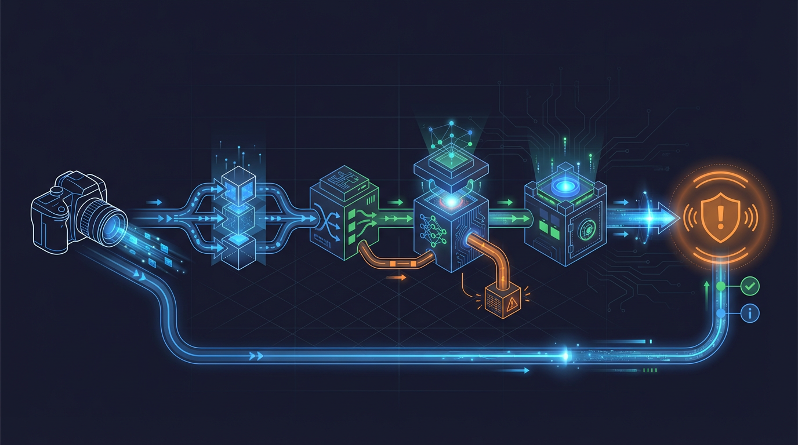

# Dataflows Hub

This hub documents the end-to-end data flows within the Home Security Intelligence system. Each document traces data through specific pathways, including timing information, error handling, and recovery mechanisms.



## End-to-End Flow Summary

```
Camera Upload (FTP)
       |
       v
+------------------+
|   File Watcher   |  <-- backend/services/file_watcher.py:330-400
|  (inotify/poll)  |      Debounce: 0.5s, Stability: 2s
+------------------+
       |
       v
+------------------+
| Detection Queue  |  <-- backend/core/constants.py (DETECTION_QUEUE)
|     (Redis)      |      Max size: configurable via settings
+------------------+
       |
       v
+------------------+
| Detection Worker |  <-- backend/services/pipeline_workers.py
+------------------+
       |
       v
+------------------+
|  YOLO26 API   |  <-- backend/services/detector_client.py:151-332
|  (Circuit Breaker)|     Timeout: 60s, Retries: 3
+------------------+
       |
       v
+------------------+
| Batch Aggregator |  <-- backend/services/batch_aggregator.py:122-160
|  (90s window)    |      Idle timeout: 30s
+------------------+
       |
       v
+------------------+
| Analysis Queue   |  <-- backend/core/constants.py (ANALYSIS_QUEUE)
|     (Redis)      |
+------------------+
       |
       v
+------------------+
| Analysis Worker  |  <-- backend/services/pipeline_workers.py
+------------------+
       |
       v
+------------------+
|   Enrichment     |  <-- backend/services/enrichment_pipeline.py:1-147
| Pipeline (opt.)  |      Florence-2, CLIP, Depth, Pose
+------------------+
       |
       v
+------------------+
|Nemotron Analyzer |  <-- backend/services/nemotron_analyzer.py:135-237
|    (LLM API)     |      Timeout: 120s, Retries: 3
+------------------+
       |
       v
+------------------+
|  Event Creation  |  <-- Database INSERT
|   (PostgreSQL)   |
+------------------+
       |
       v
+------------------+
|Event Broadcaster |  <-- backend/services/event_broadcaster.py:335-400
| (Redis Pub/Sub)  |      Message buffer: 100
+------------------+
       |
       v
+------------------+
| WebSocket Clients|  <-- backend/api/routes/websocket.py:313-400
+------------------+
```

## Quick Reference

| Document                                               | Description                                                     |
| ------------------------------------------------------ | --------------------------------------------------------------- |
| [image-to-event.md](image-to-event.md)                 | Complete detection pipeline from camera image to security event |
| [event-lifecycle.md](event-lifecycle.md)               | Event states from creation to archival                          |
| [websocket-message-flow.md](websocket-message-flow.md) | Real-time WebSocket event broadcasting                          |
| [api-request-flow.md](api-request-flow.md)             | REST API request processing                                     |
| [batch-aggregation-flow.md](batch-aggregation-flow.md) | Detection batching with timing diagram                          |
| [llm-analysis-flow.md](llm-analysis-flow.md)           | Nemotron LLM analysis request/response                          |
| [enrichment-pipeline.md](enrichment-pipeline.md)       | Florence-2, CLIP, depth, pose enrichment                        |
| [error-recovery-flow.md](error-recovery-flow.md)       | Circuit breaker and retry sequences                             |
| [startup-shutdown-flow.md](startup-shutdown-flow.md)   | Application lifecycle sequences                                 |

## Key Timing Parameters

| Parameter                    | Default | Source                                      |
| ---------------------------- | ------- | ------------------------------------------- |
| File debounce delay          | 0.5s    | `backend/services/file_watcher.py:355`      |
| File stability time          | 2.0s    | `backend/services/file_watcher.py:362`      |
| Batch window                 | 90s     | `backend/services/batch_aggregator.py:145`  |
| Batch idle timeout           | 30s     | `backend/services/batch_aggregator.py:146`  |
| YOLO26 connect timeout    | 10s     | `backend/services/detector_client.py:97`    |
| YOLO26 read timeout       | 60s     | `backend/services/detector_client.py:98`    |
| Nemotron connect timeout     | 10s     | `backend/services/nemotron_analyzer.py:130` |
| Nemotron read timeout        | 120s    | `backend/services/nemotron_analyzer.py:131` |
| WebSocket idle timeout       | 300s    | Configurable in settings                    |
| WebSocket heartbeat interval | 30s     | Configurable in settings                    |

## Key Circuit Breaker Parameters

| Service    | Failure Threshold | Recovery Timeout | Source                                        |
| ---------- | ----------------- | ---------------- | --------------------------------------------- |
| YOLO26  | 5                 | 60s              | `backend/services/detector_client.py:300-310` |
| Nemotron   | 5                 | 30s              | `backend/main.py:265-270`                     |
| PostgreSQL | 10                | 60s              | `backend/main.py:273-278`                     |
| Redis      | 10                | 60s              | `backend/main.py:273-278`                     |

## Concurrency Control

The system uses a shared semaphore to prevent GPU/AI service overload:

```python
# backend/services/nemotron_analyzer.py:19-22
# Uses a shared asyncio.Semaphore to limit concurrent AI inference operations.
# This prevents GPU/AI service overload under high traffic. The limit is
# configurable via AI_MAX_CONCURRENT_INFERENCES setting (default: 4).
```

## Error Categories

The enrichment pipeline classifies errors for observability:

| Category              | Description                     | Retry? |
| --------------------- | ------------------------------- | ------ |
| `SERVICE_UNAVAILABLE` | Connection errors, service down | Yes    |
| `TIMEOUT`             | Request timed out               | Yes    |
| `RATE_LIMITED`        | HTTP 429, back off              | Yes    |
| `SERVER_ERROR`        | HTTP 5xx, transient issue       | Yes    |
| `CLIENT_ERROR`        | HTTP 4xx, bad request           | No     |
| `PARSE_ERROR`         | JSON/response parsing failed    | No     |
| `VALIDATION_ERROR`    | Invalid input data              | No     |
| `UNEXPECTED`          | Unknown error type              | Yes    |

Source: `backend/services/enrichment_pipeline.py:170-189`

## Related Documentation

- [AI Pipeline Architecture](../ai-pipeline.md) - Detailed AI processing documentation
- [Real-time Architecture](../real-time.md) - WebSocket and event system details
- [Resilience Patterns](../resilience-patterns/) - Circuit breakers and fault tolerance
