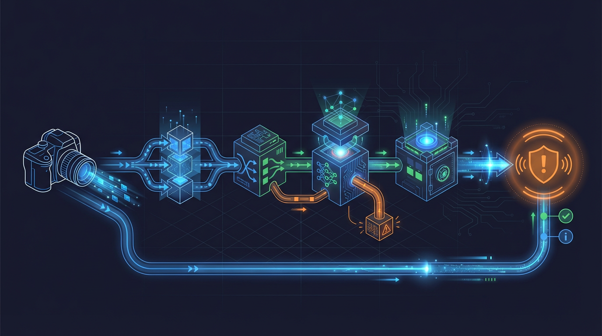
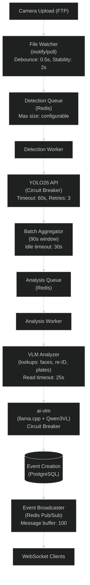

# Dataflows Hub

This hub documents the end-to-end data flows within the Home Security Intelligence system. Each document traces data through specific pathways, including timing information, error handling, and recovery mechanisms.



## End-to-End Flow Summary


```mermaid
%%{init: {'theme': 'dark'}}%%
flowchart TB
    Camera["Camera Upload (FTP)"]
    FW["File Watcher<br/>(inotify/poll)<br/>Debounce: 0.5s, Stability: 2s"]
    DQ["Detection Queue<br/>(Redis)<br/>Max size: configurable"]
    DW["Detection Worker"]
    YOLO["YOLO26 API<br/>(Circuit Breaker)<br/>Timeout: 60s, Retries: 3"]
    BA["Batch Aggregator<br/>(90s window)<br/>Idle timeout: 30s"]
    AQ["Analysis Queue<br/>(Redis)"]
    AW["Analysis Worker"]
    VA["VLM Analyzer<br/>(lookups: faces, re-ID, plates)<br/>Read timeout: 25s"]
    VLM["ai-vlm<br/>(llama.cpp + Qwen3VL)<br/>Circuit Breaker"]
    DB[("Event Creation<br/>(PostgreSQL)")]
    EB["Event Broadcaster<br/>(Redis Pub/Sub)<br/>Message buffer: 100"]
    WS["WebSocket Clients"]

    Camera --> FW
    FW --> DQ
    DQ --> DW
    DW --> YOLO
    YOLO --> BA
    BA --> AQ
    AQ --> AW
    AW --> VA
    VA --> VLM
    VLM --> DB
    DB --> EB
    EB --> WS
```

## Quick Reference

| Document                                                       | Description                                                     |
| -------------------------------------------------------------- | --------------------------------------------------------------- |
| [image-to-event.md](image-to-event.md)                         | Complete detection pipeline from camera image to security event |
| [event-lifecycle.md](event-lifecycle.md)                       | Event states from creation to archival                          |
| [websocket-message-flow.md](websocket-message-flow.md)         | Real-time WebSocket event broadcasting                          |
| [api-request-flow.md](api-request-flow.md)                     | REST API request processing                                     |
| [batch-aggregation-flow.md](batch-aggregation-flow.md)         | Detection batching with timing diagram                          |
| [llm-analysis-flow.md](llm-analysis-flow.md)                   | LLM analysis request/response                                   |
| [AI Pipeline — Current State](../ai-pipeline-current-state.md) | The shipped end-to-end AI path, detection to verdict            |
| [error-recovery-flow.md](error-recovery-flow.md)               | Circuit breaker and retry sequences                             |
| [startup-shutdown-flow.md](startup-shutdown-flow.md)           | Application lifecycle sequences                                 |

## Key Timing Parameters

| Parameter                    | Default | Source                                     |
| ---------------------------- | ------- | ------------------------------------------ |
| File debounce delay          | 0.5s    | `backend/services/file_watcher.py:355`     |
| File stability time          | 2.0s    | `backend/services/file_watcher.py:362`     |
| Batch window                 | 90s     | `backend/services/batch_aggregator.py:145` |
| Batch idle timeout           | 30s     | `backend/services/batch_aggregator.py:146` |
| YOLO26 connect timeout       | 10s     | `backend/services/detector_client.py:97`   |
| YOLO26 read timeout          | 60s     | `backend/services/detector_client.py:98`   |
| AI VLM connect timeout       | 10s     | `settings.ai_connect_timeout`              |
| AI VLM read timeout          | 25s     | `settings.ai_vlm_read_timeout`             |
| WebSocket idle timeout       | 300s    | Configurable in settings                   |
| WebSocket heartbeat interval | 30s     | Configurable in settings                   |

## Key Circuit Breaker Parameters

| Service    | Failure Threshold | Recovery Timeout | Source                                    |
| ---------- | ----------------- | ---------------- | ----------------------------------------- |
| YOLO26     | 5                 | 60s              | `backend/services/detector_client.py:336` |
| AI VLM     | 5                 | 60s              | `backend/services/vlm_client.py:247-249`  |
| PostgreSQL | 10                | 60s              | `backend/main.py:310-328`                 |
| Redis      | 10                | 60s              | `backend/main.py:310-328`                 |

## Concurrency Control

The system uses a shared semaphore to prevent GPU/AI service overload:

```python
# backend/services/inference_semaphore.py
# A shared asyncio.Semaphore limits concurrent AI inference operations to
# prevent GPU/AI service overload under high traffic. The limit is
# configurable via AI_MAX_CONCURRENT_INFERENCES (default: 20 for
# free-threaded Python, 4 for standard Python).
```

## Error Categories

The analysis leg classifies VLM failures through the `VlmClientError`
hierarchy (`backend/services/vlm_client.py`), and `vlm_analyzer.py` maps
whatever survives the retry ladder into the event:

| Category            | Description                                                      | Retry?                                                                                           |
| ------------------- | ---------------------------------------------------------------- | ------------------------------------------------------------------------------------------------ |
| `VlmTransportError` | Connection refused, timeout, HTTP 5xx                            | Once at temperature 0, then the event records `verification_failed`                              |
| `VlmSchemaError`    | Reply violates `VlmVerdict` after validation                     | No — the event records `verification_failed`                                                     |
| `VlmTruncatedError` | Reply cut off by its token budget (subclass of `VlmSchemaError`) | No — same `verification_failed` mapping; named apart because the cause and retry calculus differ |

A failed analysis still produces an event; it answers with
`verification_failed` and a NULL risk score rather than dropping the
detection (`backend/services/vlm_analyzer.py:561-563`).

## Related Documentation

- [AI Pipeline — Current State](../ai-pipeline-current-state.md) - Detailed AI processing documentation
- [Real-time Architecture](../real-time.md) - WebSocket and event system details
- [Resilience Patterns](../resilience-patterns/README.md) - Circuit breakers and fault tolerance
